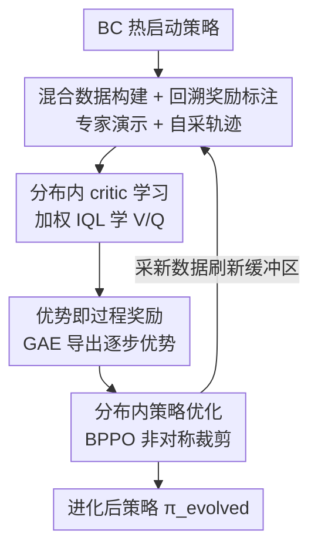

# Self-evolving LLM agents with in-distribution Optimization

**会议**: ICML2026  
**arXiv**: [2606.07367](https://arxiv.org/abs/2606.07367)  
**代码**: [qevolve.github.io](https://qevolve.github.io/)  
**领域**: LLM Agent / 强化学习 / 过程奖励  
**关键词**: 自进化智能体, 过程奖励, 隐式Q学习, 信用分配, 分布内优化

## 一句话总结
Q-Evolve 让 LLM 智能体在一个固定的混合离线数据集上学一个「分布内 critic」、用优势估计自动给每一步打过程奖励、再用 behavior-proximal 策略优化更新，全程不离开数据分布，从而在 AlfWorld/WebShop/ScienceWorld 上以远少的环境交互实现稳定的自我进化。

## 研究背景与动机
**领域现状**：LLM 正从静态文本生成转向驱动交互式智能体，在导航、游戏、机器人等长程任务里做序贯决策。但长程任务的反馈通常**稀疏且严重延迟**——智能体往往只在一幕结束时拿到一个二值奖励，很难把成败归因到中间某一步，这就是经典的信用分配难题。

**现有痛点**：为了给每一步补上过程奖励（process reward, PR），现有方法要么靠昂贵的人工标注，要么像 QLASS 那样靠**大量在线 rollout + 搜索**来估 Q 值当过程奖励标签。但它们有一个更根本的隐患：**过程奖励是分布敏感的**——PR 只在它被训练的那个状态-动作分布附近才可靠。一旦策略在线优化、生成了 PR 没见过的动作，或者环境动态把智能体推到 OOD 状态，PR 的打分就失效了，甚至造成灾难性的分布漂移。此外这些方法常依赖环境确定性、可回溯状态、可离散化状态等限制性假设。

**核心矛盾**：「生成过程监督」和「利用过程监督」如果发生在不同分布上，监督就不可信。已有离线 RL 的做法（用外部 critic 重排候选动作）把 critic 当成辅助过滤器而非内在目标，既不能让 LLM 变成可持续进化的自包含智能体，也没解决离线数据与策略自身分布之间的漂移。

**本文目标**：在**同一个分布内**既生成又利用逐步监督，让过程奖励标注始终可靠；同时让策略、critic、数据能闭环协同进化。

**切入角度**：经典 Bellman backup 理论上能解决长程信用分配，但直接搬到 LLM 上有两难——稀疏回报下 bootstrap 噪声累积难收敛，且 LLM 多 token 动作空间里标量 Q 值难以直接指导策略。作者的应对是用隐式 Q 学习（IQL）只在数据集动作上学 critic，避开 OOD 动作。

**核心 idea**：提出 **Q-Evolve**，一个自进化框架，把「自动过程奖励标注」和「分布内策略优化」统一进一个闭环：从专家演示 + 智能体轨迹的混合离线数据里学一个分布内 critic（加权 IQL），用 GAE 优势当过程奖励，再用 behavior-proximal 策略优化在同一份数据上更新——每次更新都被钉在分布内，从而不放大分布漂移。

## 方法详解

### 整体框架
Q-Evolve 先用行为克隆（BC）热启动策略，然后进入若干轮「分布内进化循环」。每一轮（inner loop）做四件事，外层再用进化后的策略采新数据刷新缓冲区，形成策略-critic-数据的闭环协同进化。

整条管线的关键转换是：**把「一幕结束才有的稀疏回报」通过 Bellman 传播 + 优势估计「填」成每一步的密集过程奖励，然后只在产生这些奖励的同一份数据上更新策略**。具体地，① 用当前策略 rollout 拼出「专家 + 自采」混合离线数据，并用基于规则的回溯标注补上辅助奖励；② 在这份固定数据上用加权 IQL 学一个分布内 critic（$V$、$Q$）；③ 用 GAE 从 critic 导出逐步优势当过程奖励；④ 用 behavior-proximal 策略目标（BPPO）更新策略。

### 关键设计

**1. 混合离线数据 + 回溯奖励标注：让过程监督钉在智能体真实犯错的分布上**

纯靠自采轨迹学 critic 会被随机噪声淹没——尤其早期弱智能体很少到达有奖励的终止状态，离线数据严重偏向低信号区域。作者刻意构造混合数据集 $\mathcal{D}=\mathcal{D}_{\text{expert}}\cup\mathcal{D}_{\text{self}}$：专家演示提供解决任务的关键步骤与成功子程序（高质量正信号锚点），自采轨迹则暴露策略真实的状态-动作覆盖（包括各种失败模式和「看起来合理实则错误」的动作），让过程监督正好校准在智能体真实会犯错的地方。第一轮的 $\mathcal{D}_{\text{self}}$ 由 BC 策略 $\pi_{\text{BC}}$ 采集。

在此之上做**回溯奖励标注（Retrospective Reward Labeling）**：利用 LLM 智能体「观察和动作都是自然语言、环境常有显式文本反馈」的特性，用规则解析下一步观察 $o_{t+1}$ 来给每步补一个辅助奖励——格式错误给 $r^{\text{fmt}}$、无效动作给 $r^{\text{inv}}$、原地踏步（$o_t=o_{t+1}$）给 $r^{\text{repeat}}$、否则为 0。这套标注**不需要访问环境动态**，立即惩罚不可执行步骤，把「动作有效性」从「任务成功」里解耦出来，是稀疏但细粒度的额外信号。

**2. 加权 IQL 的分布内 critic：在稀疏回报下稳住 Bellman backup**

为把过程奖励严格约束在固定数据内，作者选 IQL——它只在数据集动作上学，显式避开对 OOD 动作求最大值。$V$ 用非对称期望回归（expectile）逼近动作价值分布的某个分位，$Q$ 用标准 Bellman 回归 $L_Q=\mathbb{E}_{\mathcal{D}}[(r_{t+1}+\gamma V(u,h_{t+1},o_{t+1})-Q(\cdots))^2]$。但即便有 IQL，稀疏延迟回报下大多数转移奖励为 0、学习目标被 bootstrap 噪声主导，仍难学好。

作者的解法是**加权 IQL**：给每个转移一个步权重 $w_t=(t/T+d)\cdot 0.5+0.5$，其中 $d\in\{0,1\}$ 标记该轨迹是否以非零回报终止。这个权重做两件事——（i）上调成功轨迹（$d=1$）的权重，（ii）给越靠后、越和终止结果相关的步更大权重。把 $w_t$ 乘进 IQL 的期望回归与 Q 回归损失，critic 就从「信息量大」的步上拿到更强信号，估值更稳。同时把 critic 学习和策略改进解耦（先在固定数据上单独训 critic），避免噪声协同学习的反馈回路。

**3. GAE 优势当过程奖励：用多步优势补齐缺失的中间奖励**

有了 critic，作者**不直接拿 $Q-V$** 当过程奖励（一步优势在长程任务里被 bootstrap 噪声污染太重），而是用 GAE 算逐步优势：$\delta_t=r^{\text{env}}_{t+1}+\gamma V(\cdots_{t+1})-V(\cdots_t)$，$A_t=\delta_t+\lambda\gamma A_{t+1}$。这等于用 Bellman 传播把缺失的中间奖励「填」进来，既不需要环境回溯也不需要人工标注。

一个反直觉但关键的发现：**优势估计里只用环境回报 $r^{\text{env}}$、把辅助奖励 $r^{\text{aux}}$ 排除在外**，效果比「完全去掉 $r^{\text{aux}}$」或「把 $r^{\text{aux}}$ 也算进优势」都好。原因是这样让过程奖励对齐真正的任务目标、保持最优策略不变；$r^{\text{aux}}$ 只在训 critic 时作为辅助信号有用，一旦进入优势就会用启发式偏置策略学习。

**4. Behavior-Proximal 策略优化 + 非对称裁剪：在分布内既放大好动作又压制坏动作**

最初作者按 IQL 套路用优势加权回归（AWR）$L_\pi=\mathbb{E}[\exp(A_t)\log\pi_\theta(\cdots)]$，但它只会单调抬高数据集里出现过的动作概率，**没有机制去压低带负过程奖励的动作**，容易过拟合。

于是改用 **BPPO** 的裁剪式目标：$\mathcal{L}_\pi(\theta)=\mathbb{E}_{\mathcal{D}}[\min(\eta_t A_t,\ \text{clip}(\eta_t,1-\epsilon_{\text{low}},1+\epsilon_{\text{high}})A_t)]+\alpha\,\text{KL}(\pi_\phi\|\pi_{\text{ref}})$，其中 $\eta_t$ 是当前策略对生成数据的滞后行为策略 $\pi_{\text{old}}$ 的重要性比。它沿用 PPO 式裁剪，但优势直接来自前面标好的过程奖励，**无需在线 critic 和大量在线交互**。关键是用**非对称裁剪 $\epsilon_{\text{low}}>\epsilon_{\text{high}}$**：允许对负标注动作更激进地压制（下界放宽），同时把概率增大约束得更紧（上界收紧）——这样既能果断抑制有害动作，又不会激进外推到离线数据分布之外，保持「在支撑集内」的保守更新。

### 一个完整示例：一轮进化循环
以 AlfWorld 一个家务任务为例：① 用当前策略（首轮是 BC）跑 33 条轨迹，和专家演示拼成混合缓冲区，解析每步观察补上格式/无效/重复的辅助奖励；② 在这份固定缓冲区上用加权 IQL 学 $V/Q$，成功轨迹和靠后步拿到更大权重；③ 对每条轨迹用 GAE（只含环境回报）算出每一步的优势 $A_t$，当作过程奖励；④ 用 BPPO 非对称裁剪更新策略——把优势为正的 token 放大、为负的果断压低。一轮结束后，用进化后的策略再去环境采新轨迹刷新缓冲区，进入下一轮。实验里 SciWorld/AlfWorld 跑 2 轮、WebShop 跑 3 轮。

### 损失函数 / 训练策略
三层目标串联：BC 的负对数似然热启动 → 加权 IQL 的 $L_V$（非对称期望回归）+ $L_Q$（Bellman 回归）→ BPPO 的裁剪式策略目标 + KL 正则。基模型用 Llama2-7B-Chat，自采每任务 33 条轨迹。

## 实验关键数据

### 主实验
在 WebShop、SciWorld（Seen/Unseen）、AlfWorld（Seen/Unseen）三个稀疏延迟奖励环境上对比，指标为平均累计奖励：

| 方法 | WebShop | SciWorld Seen | SciWorld Unseen | AlfWorld Seen | AlfWorld Unseen | 平均 |
|------|---------|---------------|-----------------|---------------|-----------------|------|
| SFT | 63.1 | 67.4 | 53.0 | 60.0 | 67.2 | 62.1 |
| ETO | 67.4 | 73.8 | 65.0 | 68.6 | 72.4 | 69.4 |
| QLASS | 70.3 | 75.3 | 66.4 | 77.9 | 82.8 | 74.5 |
| **Q-Evolve** | **70.5** | **76.3** | **69.7** | **90.7** | **89.6** | **79.4** |

Q-Evolve 在所有 benchmark 上拿到最高平均分 79.4，比次优 QLASS 高 4.9。最显著的是 AlfWorld：Seen 90.7 / Unseen 89.6，比 QLASS 高出 12.8 / 6.8。更关键的是**样本效率**——AlfWorld 上 QLASS 需要 600K 在线采样，Q-Evolve 只用 20K（约 1/30），因为它主要靠离线重标注而非在线 rollout + 搜索来导出过程奖励。

### 消融实验（AlfWorld，1 轮进化）

| 变体 | Seen | Unseen | 说明 |
|------|------|--------|------|
| Q-Evolve (1-iter) | 87.9 | 86.6 | 完整模型 |
| w/o RR（去回溯标注） | 83.6 | 82.7 | 失去中间学习信号 |
| w/o W-IQL（换标准 IQL） | 83.6 | 76.1 | critic 在稀疏回报下变脆 |
| w/o GAE（不用多步优势） | 74.3 | 74.6 | 优势质量大幅下降 |
| w/o PI（critic 只做测试时重排） | 58.6 | 59.0 | 比 SFT 还低，分布失配 |
| w/o PI + AWR（用 AWR 改策略） | 64.3 | 67.9 | 无法压制坏动作 |

### 关键发现
- **分布内策略学习是主导机制**：把过程奖励拿去做 OOD 的测试时重排（w/o PI）会掉到 58.6/59.0，甚至低于 $\pi_{\text{BC}}$——因为策略可能给出 PR 没见过的候选动作、环境动态又把它推向 OOD 状态，PR 打分失效。这正面印证了「必须在可控的分布内用过程奖励」。
- **GAE 是 critic 到策略的关键桥梁**：去掉 GAE 直接掉到 74.x，且过程奖励选择对比中 GAE(只含 $r^{\text{env}}$) 优于一步 $Q-V$ 和势能塑形——多步优势提供更可靠的时序信用分配。
- **$r^{\text{aux}}$ 该放哪很讲究**：把辅助奖励放进优势估计反而掉点，但留作 critic 训练的辅助目标有用——启发式信号只适合「稳 critic」，不适合「直接塑形策略」。
- **各模块协同而非单一 trick**：RR/W-IQL/GAE 去任意一个都掉点，最终收益来自它们的协同。

## 亮点与洞察
- **「同分布内既生成又利用监督」这条主线很本质**：过程奖励的不可靠性根源就是「标 PR 的分布」和「用 PR 的分布」错位，Q-Evolve 把两者锁进同一个闭环，是对症下药而非又堆一个模块。
- **回溯奖励标注几乎零成本**：靠解析自然语言反馈就能补上格式/无效/重复的密集信号，不碰环境动态，可迁移到任何有文本反馈的交互环境。
- **优势里剔除 $r^{\text{aux}}$ 的设计**体现了「保持最优策略不变」的清醒：启发式奖励再好也只该塑形 critic、不该污染对齐任务目标的优势信号——这个区分值得借鉴到任何用辅助奖励的 RL 流程。
- **非对称裁剪（压坏动作放宽、抬好动作收紧）**是一个简单却有效的小手术，直击 AWR「只会抬概率、不会压概率」的痛点。
- 用 1/30 的在线采样达到更好效果，对在线交互昂贵的高风险/非确定性场景（机器人、真实 web）尤其有吸引力。

## 局限与展望
- **仍需专家演示**：混合数据强依赖专家轨迹提供成功锚点，纯无专家/冷启动场景下加权 IQL 的稳定性存疑。
- **回溯标注依赖文本反馈质量**：规则解析「无效/重复」假设环境会显式报告执行错误，反馈含糊或无文本反馈的环境里这层信号会失效。
- **基模型与规模单一**：只在 Llama2-7B-Chat 上验证，更大模型或更强基座下分布漂移问题是否同样突出未知。
- **进化轮数靠手调**（SciWorld/AlfWorld 2 轮、WebShop 3 轮），缺一个判断「该不该再进化一轮」的自动停止准则。

## 相关工作与启发
- **vs QLASS（在线搜索估 Q）**：QLASS 靠构建探索树 + 在线 rollout 估 Q 值当过程奖励，需要离散状态和 600K 采样；Q-Evolve 学分布内 critic、主要靠离线重标注，20K 采样就更稳更省。
- **vs ETO / DMPO（偏好式 RL）**：它们构造轨迹级偏好对走 DPO/多轮偏好目标，是轨迹级监督；Q-Evolve 给到逐步过程奖励，信用分配更细且更稳定。
- **vs 外部 critic 离线 RL（Snell / Xiang 等）**：那些方法把 critic 当辅助过滤器重排候选动作，LLM 无法变成可持续进化的自包含智能体，也没解决离线-测试分布漂移；Q-Evolve 把 critic 当内在目标、让策略/critic/数据闭环协同进化。

## 评分
- 新颖性: ⭐⭐⭐⭐⭐ 「分布内同时生成与利用过程奖励的自进化闭环」抓住了过程奖励不可靠的根因。
- 实验充分度: ⭐⭐⭐⭐ 三环境 Seen/Unseen + 细致消融 + 过程奖励选择对比，但只用单一 7B 基模。
- 写作质量: ⭐⭐⭐⭐ 动机到方法逻辑清晰，加权 IQL 与 BPPO 的设计动机交代到位。
- 价值: ⭐⭐⭐⭐⭐ 用 1/30 在线采样超过 SOTA，对昂贵交互场景的智能体训练有实际意义。

<!-- RELATED:START -->

## 相关论文

- [\[ICML 2026\] EvolveR: Self-Evolving LLM Agents through an Experience-Driven Lifecycle](evolver_self-evolving_llm_agents_through_an_experience-driven_lifecycle.md)
- [\[ACL 2026\] SEARL: Joint Optimization of Policy and Tool Graph Memory for Self-Evolving Agents](../../ACL2026/llm_agent/searl_joint_optimization_of_policy_and_tool_graph_memory_for_self-evolving_agent.md)
- [\[ICML 2026\] Towards Feedback-to-Plan Decisions for Self-Evolving LLM Agents in CUDA Kernel Generation](towards_feedback-to-plan_decisions_for_self-evolving_llm_agents_in_cuda_kernel_g.md)
- [\[CVPR 2026\] JarvisEvo: Towards a Self-Evolving Photo Editing Agent with Synergistic Editor-Evaluator Optimization](../../CVPR2026/llm_agent/jarvisevo_towards_a_self-evolving_photo_editing_agent_with_synergistic_editor-ev.md)
- [\[ICLR 2026\] Your Agent May Misevolve: Emergent Risks in Self-evolving LLM Agents](../../ICLR2026/llm_agent/your_agent_may_misevolve_emergent_risks_in_self-evolving_llm_agents.md)

<!-- RELATED:END -->
