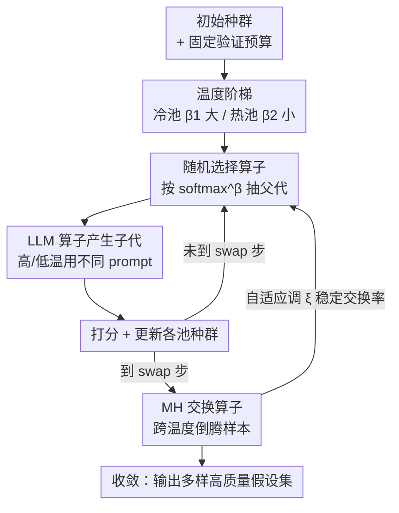

# Towards Diverse Scientific Hypothesis Search with Large Language Models

**会议**: ICML 2026  
**arXiv**: [2606.10587](https://arxiv.org/abs/2606.10587)  
**代码**: https://github.com/zoom-wang112358/EvoDiverse  
**领域**: LLM Agent / 科学发现 / 进化搜索  
**关键词**: 科学假设搜索, 并行回火, 进化算法, 多样性坍缩, 采样

## 一句话总结
把"用 LLM 搜科学假设"重新看成**在固定验证预算下高效产出一批多样且高质量假设的采样问题**，借鉴物理里的并行回火（Parallel Tempering）造了一个双温度池的进化框架 EvoDiverse，让高温池负责探索、低温池负责精炼、两池之间按 Metropolis-Hastings 规则交换样本，从而在分子/方程/算法三类发现任务上同时提升质量和多样性。

## 研究背景与动机
**领域现状**：用 LLM 加速科学发现是当下热点，主流做法是把 LLM 当作进化算法（EA）里的变异/交叉算子——给一组父代假设，让 LLM 提出更好的子代，用目标函数打分，选 top-k，迭代到收敛或耗尽评估预算。FunSearch、MOLLEO、LLM-SR 等都是这个套路。

**现有痛点**：科学发现里"最优解"往往不是唯一目标。仿真是近似的、实验是昂贵且有噪声的，多个有竞争力的假设可能在层层验证中都站得住。所以科学家真正需要的是**一批高质量但又彼此显著不同**的候选，用来对冲下游验证的不确定性。可现有 EA 流程隐式地把"优化"摆在"探索"之前，强选择压把概率质量挤进假设空间一个狭窄区域，导致**多样性坍缩**（diversity collapse）、过早收敛、样本同质。

**核心矛盾**：纯优化会坍缩多样性；可如果换个极端、把搜索当成**精确采样**（从一个质量正比于概率的分布里抽样）又不现实——LLM 提议分布无法在组合爆炸的假设空间上归一化、token 似然只有开源模型能拿到、有限验证预算也撑不到采样算法渐近收敛。更何况评估本身就是近似且随机的，目标分布根本没被精确定义，精确采样既不可行也无必要。

**本文目标**：找一个既不是纯优化、也不是精确采样的中间地带——在有限验证预算下**高效生成多样、高质量的假设集合**。

**切入角度**：作者保留"采样视角"但不强求精确采样：把进化搜索近似看成从一个带**演化幂因子**的 Boltzmann 分布中采样，幂因子随迭代逐渐变大（选择压逐渐增强）。既然单一温度难以兼顾收敛与覆盖，那就引入物理里采样多峰分布的经典工具——并行回火。

**核心 idea**：维护多个不同温度的种群，**高温种群宽松选择以激进探索、低温种群严苛选择以精炼**，并设计一个保持各温度分布不被破坏的跨温度交换机制，把高温发现的好苗子"漏斗式"地输送到低温去打磨。

## 方法详解

### 整体框架
EvoDiverse 的输入是一个初始假设种群和固定的验证（oracle 调用）预算，输出是收敛时的一批多样高质量假设。整篇方法可以一句话概括：**把单一进化搜索拆成两条不同温度的进化链并行跑，再用一个"接受/拒绝"式的交换算子在两链之间倒腾样本**。

先建立一个关键的认知：作者论证 EA 每一代的种群近似服从 $p(x)\propto\exp(-\xi(n)\beta h(x))$，其中 $h$ 是要最小化的目标函数，$\beta$ 反映选择强度，$\xi(n)$ 是随迭代 $n$ 单调增大的因子（直觉上，一个只做选择的平凡 EA 跑 $n$ 代后分布就是 $\exp(-n\beta h(x))$）。$\xi(n)$ 增长越快越偏收敛、越慢越偏探索。于是温度就成了调节"探索↔收敛"的旋钮。整个 pipeline 如下：

### 关键设计

**1. 把进化搜索改造成可控温度的随机选择：用 $\beta$ 当选择压旋钮**

痛点是：以往 EA（如 MOLLEO）的选择是**确定性**的——直接选 top-$\nu$ 进交配池、再从旧种群与新子代里选 top-$N$。确定性选择没法在不同温度间调"选择压"，也就无法让高温更宽松、低温更严苛。EvoDiverse 改成**无放回的随机选择**：每个候选被选中的概率为

$$p(x_i)=\frac{\exp(-h(x_i))^{\beta}}{\sum_{k=1}^{K}\exp(-h(x_k))^{\beta}}$$

$\beta$ 直接控制选择强度：$\beta\to\infty$ 退化为确定性的 top 选择（极端收敛），$\beta\to 0$ 则毫无选择压（纯随机探索）。高温池用小 $\beta$ 鼓励探索，低温池用大 $\beta$ 收紧。除了选择，作者还在不同温度用**不同的 LLM prompt**——比如分子任务里，高温 prompt 鼓励提出结构多样、骨架新颖但仍有竞争力打分的分子，低温 prompt 引导模型精炼已知高分基序、提升预测活性。这让"探索 vs 精炼"在算子层面也分了工。

**2. 基于 Metropolis-Hastings 的交换算子：跨温度搬运而不破坏各自分布**

直接把高低温样本互相塞进对方池子（类似 EA 的 Island 迁移）会出问题：高温样本普遍打分低，塞进低温池会被立刻淘汰；低温样本打分好，塞进高温池又会主导种群、打断探索。EvoDiverse 借并行回火的思路，把两池近似看成

$$p_1(x)\propto\exp(-\xi(n)\beta_1 h(x)),\qquad p_2(x)\propto\exp(-\xi(n)\beta_2 h(x)),\quad \beta_2<\beta_1$$

联合态近似服从乘积分布 $p_1(x_1)p_2(x_2)$。交换时**只交换两个样本的温度归属**：提议 $(x_1',x_2')\leftarrow(x_2,x_1)$，按

$$a=\exp\big(-\xi(n)(\beta_1-\beta_2)(h(x_2)-h(x_1))\big)$$

计算接受比，以 $A=\min\{1,a\}$ 接受、否则保持不变。这个 MH 步对乘积目标满足细致平衡，因此交换前后联合分布保持平稳。直觉上它**不丢弃任何候选**，只是把样本重新分配到与其质量最匹配的温度：强候选倾向留在低温精炼，弱但多样的候选留在高温继续探索。比起 Island 的无脑迁移，这是一种"只在两温度都大致认可时才搬"的更干净的通信机制。

**3. 对齐不同温度的收敛速度：把 $\xi(n)$ 当成稳定交换率的动态超参**

这是本文与经典并行回火分道扬镳的地方：经典 PT 的各温度对应**已知密度**的固定平稳分布，而这里每个温度对应一个**未知、且随时间不断被"锐化"**的分布，锐化速度还可能不一致。交换接受比里需要 $\xi(n)$，但它依赖 LLM、prompt 等实现细节，无法解析获得。作者的做法是把 $\xi$ 当成一个**动态超参**：实时跟踪近若干代的实际交换率，反过来调 $\xi$，把交换率维持在一个稳定、良性的区间（如 30%–50%）。这样即使两温度以不同速度收敛，交换机制也始终有效。算法在等式发现这类目标尺度敏感的任务上，还需对能量做 log-MSE 变换以保持稳定。

### 一个完整示例
以 JNK3 分子发现为例走一遍：从 ZINC-250K 抽 120 个分子作初始种群，固定 10,000 次 oracle 调用预算，用 DeepSeek-V3.2 当 LLM 算子。冷池用大 $\beta$ + 精炼 prompt 快速把高分子拉上去，热池用小 $\beta$ + 多样 prompt 持续提出新骨架。每隔若干代触发一次 MH 交换：热池里偶然蹦出的高分新骨架被搬进冷池精炼，冷池里挤占多样性的高分分子则可能被换回热池。结果是 EvoDiverse 在收敛时稳定保有约 90 个通过多样性筛选的候选，几乎是 MOLLEO（约 50 个）的两倍，同时平均分更高；而且这些候选在没有显式优化 QED/SA 的情况下仍保持高成药性与可合成性，t-SNE 显示它探到了已知化学空间之外的全新可合成区域。

## 实验关键数据

横跨**分子发现**（JNK3、GSK3β）、**方程发现**（LLM-SRBench，覆盖物理/生物/化学/材料）、**算法发现**（n=26 圆堆叠）三类任务，在同一评估预算下同时衡量质量与多样性。

### 主实验

分子发现（diversity-aware Top-10 指标）：

| 目标 | 方法 | Top-10 AUC ↑ | Top-10 Avg ↑ |
|------|------|------|------|
| JNK3 | MOLLEO | 0.58 | 0.66 |
| JNK3 | Ensemble | 0.54 | 0.71 |
| JNK3 | Tempering | 0.46 | 0.59 |
| JNK3 | **EvoDiverse** | **0.63** | **0.74** |
| GSK3β | MOLLEO | 0.70 | 0.82 |
| GSK3β | Ensemble | 0.73 | 0.85 |
| GSK3β | Tempering | 0.58 | 0.70 |
| GSK3β | **EvoDiverse** | **0.76** | 0.82 |

方程发现（按域平均，跨 DeepSeek-V3.2 与 GPT-5 两种 backbone）：

| 域 | 方法 | Diversity ↑ | Best $Acc_{0.1}$ ↑ | Top-10 $Acc_{0.1}$ ↑ |
|------|------|------|------|------|
| Physics | EvoDiverse | **0.305** | **0.408** | **0.275** |
| Biology | EvoDiverse | **0.290** | **0.212** | **0.146** |
| Chemistry | EvoDiverse | **0.284** | **0.618** | **0.433** |
| Materials | EvoDiverse | **0.223** | **0.803** | **0.763** |

（四个域里 EvoDiverse 的多样性与质量均优于 Tempering 和 Ensemble(LLM-SR) 基线；Biology 的 Best $Acc_{0.1}$ 从 0.104 提到 0.212，翻倍。）

算法发现（圆堆叠 n=26）：

| 方法 | Best Sum ↑ | Top-100 Avg ↑ | Diversity ↑ |
|------|------|------|------|
| EA | 2.4986 | 2.4302 | 0.61 |
| Island | 2.4247 | 2.4241 | 0.48 |
| Ensemble | 2.4105 | 2.3330 | 0.76 |
| **EvoDiverse** | **2.5461** | **2.5138** | **0.78** |

### 消融与对比

| 配置 | 机制 | 表现/问题 |
|------|------|---------|
| MOLLEO（单池 EA） | 无热池/无交换 | 早期难优化，收敛时仅 ~50 个多样候选 |
| Ensemble | 双池但完全隔离、最后合并 | 多样性高但缺乏推进机制，常困在低分区 |
| Island | 双池 + 频繁迁移 | 种群被迁移同质化，多样性最低（0.48） |
| Tempering | 单池高温采样 | 探索↑但易过早坍缩、质量下降 |
| **EvoDiverse** | 双温度 + MH 交换 | 质量与多样性双赢、收敛最快 |

### 关键发现
- **MH 交换是胜负手**：Ensemble 证明"光隔离不通信"推进慢，Island 证明"无脑频繁迁移"会同质化；只有 EvoDiverse 的细致平衡交换既保多样又能漏斗式精炼。
- **冷池产出大多数 elite 解**，证实"高温探索→低温精炼"的漏斗确实在工作；Island 两池几乎雷同，Ensemble 则只有一池在贡献。
- **多样性是"有产出的多样性"**：EvoDiverse 的程序嵌入空间覆盖更广更有结构，而非单纯增大方差——更宽的探索直接换来更高质量的方程/分子。
- **副产物**：分子任务中即便不显式优化 QED/SA，候选仍保持高成药性，暗示 LLM 内部可能把结合能力与理化可行性关联了起来。

## 亮点与洞察
- **问题重定义本身就是贡献**：把"找单一最优假设"重构成"固定预算下产多样高质量集合的采样问题"，精准戳中科学发现"验证昂贵且有噪声、需对冲不确定性"的真实需求，这个 framing 比具体算法更值钱。
- **物理直觉迁移得很干净**：并行回火本是采样多峰分布的工具，作者识别出"进化搜索≈带演化幂因子的 Boltzmann 采样"这一桥梁，让 PT 的温度阶梯 + MH 交换天然落地到 LLM-EA，理论上还保证了交换不破坏各池分布。
- **$\xi(n)$ 自适应调交换率**是个很实用的工程巧思：经典 PT 要求已知平稳密度，而这里分布未知且动态锐化，用"实时监控交换率反调 $\xi$"绕开了不可解析的难题，可迁移到其它"分布未知但想做回火/退火"的场景。
- **即插即用**：框架与具体 EA 解耦，论文还给出 GraphGA 适配版同样加速，说明这是一套可挂在现有 LLM-EA 上的通用增强。

## 局限与展望
- **预算权衡**：多温度池改善探索，但固定 oracle 预算下每池能分到的评估次数变少；池数、温度差、交换频率都是需按任务调的超参。
- **近似性带来的脆弱**：这是近似并行回火——LLM 提议诱导的种群不服从已知平稳分布，交换规则对目标尺度敏感（方程发现就必须做 log-MSE 能量变换才稳定）。如何自动化能量与温度阶梯的选择仍待解决。
- **落地仍需真实验证**：要正确设置 Boltzmann 常数把目标转成概率，需要对搜索空间与目标的理解；找到的假设最终仍需真实实验验证。
- 作者展望把多样性增强推广到树搜索等其它搜索算法，以及用 fine-tuning 进一步提升 LLM 采样多样性。

## 相关工作与启发
- **vs MOLLEO / FunSearch / LLM-SR（LLM-EA 主流）**: 它们把 LLM 当进化算子做纯优化，强选择压导致多样性坍缩；本文加一条高温探索链 + 原理化交换，在同预算下同时拿到质量和多样性。
- **vs Island EA**: Island 用启发式频繁迁移通信，易同质化或过早/过晚收敛；本文的 MH 交换是"概率化 island"，只在两温度都认可时才搬，通信更有原则。
- **vs 精确采样视角**: 精确从质量分布采样在组合爆炸的假设空间不可行也无必要；本文退一步用"带演化幂因子的 Boltzmann 近似采样"，把可行性与多样性都照顾到。
- **vs PT 在生成模型中的应用（He et al. 2025）**: 后者用 PT 控制扩散模型推理；本文把 PT 迁到离散的 LLM 假设搜索，并解决了"分布未知且动态"这一新难点。

## 评分
- 新颖性: ⭐⭐⭐⭐⭐ 问题重定义 + 把并行回火干净地迁到 LLM 假设搜索，视角和方法都新。
- 实验充分度: ⭐⭐⭐⭐ 横跨分子/方程/算法三类任务、两种 backbone、多基线对比，但每类任务规模偏小、缺更大预算下的趋势。
- 写作质量: ⭐⭐⭐⭐ 动机推导清晰、理论与直觉穿插得当，部分实现细节（$\xi$ 调参、能量变换）压在附录。
- 价值: ⭐⭐⭐⭐⭐ 直击科学发现"需要多样候选对冲验证不确定性"的真痛点，框架可即插即用到现有 LLM-EA。

<!-- RELATED:START -->

## 相关论文

- [\[ICML 2026\] Hunt Instead of Wait: Evaluating Deep Data Research on Large Language Models](hunt_instead_of_wait_evaluating_deep_data_research_on_large_language_models.md)
- [\[ACL 2026\] ImplicitMemBench: Measuring Unconscious Behavioral Adaptation in Large Language Models](../../ACL2026/llm_agent/implicitmembench_measuring_unconscious_behavioral_adaptation_in_large_language_m.md)
- [\[CVPR 2026\] ModularAgent: A Task-Aware Modular Framework for Joint Optimization of Multimodal Large Language Models and World Models](../../CVPR2026/llm_agent/modularagent_a_task-aware_modular_framework_for_joint_optimization_of_multimodal.md)
- [\[NeurIPS 2025\] Are Large Language Models Sensitive to the Motives Behind Communication?](../../NeurIPS2025/llm_agent/are_large_language_models_sensitive_to_the_motives_behind_communication.md)
- [\[ACL 2026\] Agent-GWO: Collaborative Agents for Dynamic Prompt Optimization in Large Language Models](../../ACL2026/llm_agent/agent-gwo_collaborative_agents_for_dynamic_prompt_optimization_in_large_language.md)

<!-- RELATED:END -->
