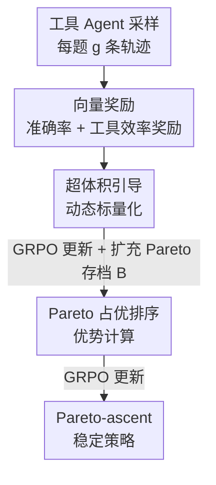

# Towards Pareto-Optimal Tool-Integrated Agents with Pareto Ranking Policy Optimization

**会议**: ICML2026  
**arXiv**: [2606.16111](https://arxiv.org/abs/2606.16111)  
**代码**: https://github.com/Applied-Machine-Learning-Lab/ICML2026_ParetoPO  
**领域**: Agent / 多目标强化学习  
**关键词**: 工具集成 Agent, 多目标 RL, Pareto 占优, 超体积, GRPO  

## 一句话总结
ParetoPO 把"工具使用 Agent 的对齐"显式建成一个多目标 RL 问题（准确率 vs 工具调用效率），用两阶段训练——先用超体积引导的动态标量化做全局探索、再用 Pareto 占优排序算优势做局部精修——在数学推理和多跳 QA 上同时拿到更高准确率和更少工具调用。

## 研究背景与动机
**领域现状**：在线 RL（尤其是 GRPO 一类）已经成为对齐"会调工具的 LLM Agent"的事实标准，从带搜索引擎的问答到带编译器的代码生成都靠它，性能提升明显。

**现有痛点**：现有对齐几乎只优化最终答案准确率，把过程层面的辅助目标——比如调了多少次工具、每一步决策质量如何——完全丢在优化之外。但在真实部署里，工具调用次数直接决定推理成本和可靠性：一个准确率高但每题狂调 3 次 Python 解释器的 Agent，远不如准确率相当、平均只调 0.8 次的版本实用。

**核心矛盾**：准确率和工具效率本质冲突——多调几次工具往往能提准确率，但代价是效率。把它们硬塞进一个标量奖励有两条死路：（1）**固定权重标量化**用一个静态权重把向量奖励加权求和，但不同目标的量纲和学习动态不一样，训练早期合适的权重到后期会错配学习力度；更糟的是线性标量化只能恢复 trade-off 曲线**凸区域**上的 Pareto 最优解，非凸区域的解永远够不着。（2）**基于梯度的多目标优化**给每个目标算独立梯度再合并，理论上能容纳多目标，但计算昂贵，而且大多只用在"有用性 / 无害性"这类高层语义目标上，没人针对 Agent 的**动作级**行为目标（如工具效率）做。

**本文目标**：让 Agent 不只产出正确答案，还要高效用工具——即在准确率和工具效率之间找到 Pareto 最优的策略，而不是被单一固定权重锁死在某个点。

**核心 idea**：把对齐建成多目标马尔可夫决策过程（MOMDP），用两阶段训练替代固定权重：第一阶段用**超体积（hypervolume）信号动态调权**做全局探索铺开 Pareto 前沿，第二阶段直接用 **Pareto 占优排序**算优势、把策略推向非占优轨迹，做细粒度的动作级精修。

## 方法详解

### 整体框架
ParetoPO 把工具 Agent 的训练形式化成一个 MOMDP：每一步 Agent 要么吐一个普通 token、要么发一次工具 API 调用；一条轨迹结束后拿到的是**向量奖励** $\bm{r}=(r_{task}, r_{tool})$，其中 $r_{task}$ 衡量任务表现（如准确率），$r_{tool}$ 衡量工具效率。效率奖励定义为

$$r_{tool}=\exp(-\alpha\,|N_{call}-N_{optimal}|),$$

$N_{call}$ 是这条轨迹实际的工具调用次数，$N_{optimal}=\min(\mathcal{C})$ 取的是当前**成功轨迹**里最少的调用次数（且要求 $N_{call}\ge N_{optimal}$），$\alpha$ 控制惩罚力度。$N_{optimal}$ 在多轮训练里持续更新——一旦发现更省的成功轨迹就下调，因此它单调非增、动态稳定。

整个优化分两阶段串行：**阶段 1** 用超体积引导的动态标量化，把向量奖励折成一个会随训练进度漂移的标量，把策略铺向 Pareto 前沿不同区域；**阶段 2** 丢掉标量奖励，改用 Pareto 占优排序直接给一批轨迹算优势值，让策略偏向非占优（更优）轨迹。两阶段共享一个不断扩充的 Pareto 存档 $\bm{B}$（记录历史最优的目标向量集合）。

### 关键设计

**1. 工具效率奖励：把"省着调工具"变成可优化的稠密信号**

问题在于"调用次数"是个离散计数，直接当负奖励既不可微、量纲也和准确率打架。本文用 $r_{tool}=\exp(-\alpha|N_{call}-N_{optimal}|)$ 把它压进 $[0,1]$：调用次数越接近当前已知最优 $N_{optimal}$，奖励越接近 1。妙处在 $N_{optimal}$ 不是预设常数，而是从**成功轨迹**里在线估计的最小调用数，并随训练单调下调来逼近全局最优。这样既给了 Agent 一个会自我收紧的效率目标，又因为奖励有界、$N_{optimal}$ 单调，避免了移动目标带来的训练非平稳性——作者论证后期 $N_{optimal}$ 很快稳定，优化近似平稳。

**2. 超体积引导的动态标量化：用前沿进展自适应调权，替掉固定权重**

固定权重 $\bm{w}$ 标量化 $r_w=\bm{w}^\top\bm{r}$ 既会随训练错配、又够不到非凸前沿。本文不直接改 $\bm{w}$，而是引入一个元层奖励 $r_{pareto}$ 去放大/抑制最终奖励。具体地，对新结果向量 $\bm{r}$ 算它相对当前 Pareto 存档 $\bm{B}$ 的**超体积增量** $\Delta\mathrm{HV}(\bm{r},\bm{B})=\mathrm{HV}(\bm{B}\cup\bm{r})-\mathrm{HV}(\bm{B})$——超体积衡量一组非占优解相对参考点所支配的体积，越大说明前沿覆盖越好。但工具场景奖励噪声大（偶发工具失败、某次幸运跳变），裸超体积信号会忽高忽低，所以先做指数平滑

$$\Delta\overline{\text{HV}}_t=\gamma\,\Delta\overline{\text{HV}}_{t-1}+(1-\gamma)\,\Delta\text{HV}_t,$$

再令 $r_{pareto}=0.5+1.5\tanh(\Delta\overline{\text{HV}}_t)$，最终标量奖励 $\tilde r_w=r_{pareto}\cdot r_w$。由于 $r_{pareto}$ 依赖随训练演化的存档 $\bm{B}$，等效目标是时变的，会自动把学习力度推向前沿里尚未充分覆盖的区域。这一阶段的更新用 GRPO 完成，更新后把新发现的非占优解并入 $\bm{B}$。

**3. Pareto 占优排序的优势计算：动作级地把策略推向非占优轨迹**

即便有了动态标量化，标量回报仍会偏向某个权重设定。阶段 2 干脆不用标量，而是在一组 rollout 里用 **Pareto 占优**直接排序：轨迹 $\tau_i$ 占优 $\tau_j$ 当且仅当它在所有目标上不差、至少一个目标上严格更好；非占优轨迹排第 1 层（rank 1），只被第 1 层占优的排第 2 层，依此类推。给每条轨迹一个 Pareto rank $\rho$ 后，基础优势取 $A_{base,\rho}=N_{rank}-\rho+1$。再在同一 rank 内用归一化标量奖励 $\hat r_w=\frac{r_w-r_{min}}{r_{max}-r_{min}}$（同 rank 内 $r_{min}=r_{max}$ 时取 0.5）做微调：

$$A_i=A_{base,\rho}+\beta\cdot(\hat r_w-0.5),\quad \beta\le 1.$$

$\beta\le 1$ 保证**坏 rank 的任何轨迹都不会比好 rank 的轨迹拿到更高优势**——占优结构是硬约束，标量偏好只在同层内做轻微倾斜。这样优势完全由占优关系主导，再用 GRPO 更新策略，等价于把策略往 Pareto 前沿"上爬"。

**4. 两阶段的理论支撑：全局覆盖 + 局部 Pareto 稳定**

为什么非要分两阶段？作者给了对应的理论。阶段 1（命题 3.1）证明：在动态标量化稠密探索偏好方向、且近似优化每个标量目标的假设下，发现的凸包 $\mathcal{C}_T$ 在支撑函数距离下收敛到可达凸包 $\mathcal{C}$，即渐近覆盖**所有受支撑的 Pareto 最优点**——这是全局探索的保证。阶段 2 的难点是 Pareto rank 离散不可微，作者加 Gumbel 噪声做**随机 Pareto rank** 平滑代理（$\sigma\to 0$ 时与真占优序一致），并证明：批级平滑梯度是一个 **Pareto-ascent 方向**（引理 3.4）、rank 优势二阶矩有界 $C=(N_{rank}+\beta/2)^2$ 与奖励量纲无关（定理 3.5）、在 Robbins-Monro 步长下收敛到 Pareto-ascent 稳定点（定理 3.6）——即不存在能同时一阶改进所有目标的方向。一句话：阶段 1 管"把前沿铺开"，阶段 2 管"在前沿上稳定收敛"。

## 实验关键数据

### 主实验
在数学推理（MATH500 / AIME24 / AIME25 / OlympiadBench / AMC23，工具为 Python 解释器）和多跳 QA（NQ / HotpotQA，工具为检索器）上评测，指标为 EM（准确率）和 #Tool（平均工具调用次数）。基线覆盖无工具、工具集成（TIR、ToRL-GRPO、Search-R1）和多目标（OTC-GRPO、MO-GRPO）三类。

| 模型 (Qwen2.5-Math-1.5B) | MATH500 EM / #Tool | AIME24 EM / #Tool | Olympiad EM / #Tool | AMC23 EM / #Tool |
|---|---|---|---|---|
| TIR（工具集成） | 73.8 / 1.3 | 13.3 / 1.1 | 41.3 / 1.5 | 55.0 / 2.0 |
| ToRL-GRPO | 77.8 / 2.1 | 23.3 / 2.2 | 44.0 / 2.7 | 67.5 / 2.5 |
| OTC-GRPO | 74.0 / 1.3 | 20.0 / 1.1 | 42.1 / 1.2 | 62.5 / 1.1 |
| MO-GRPO | 71.2 / 2.0 | 16.7 / 1.8 | 41.2 / 2.0 | 62.5 / 2.1 |
| **ParetoPO（本文）** | **80.0\* / 0.9** | **30.0\* / 0.8** | **48.1\* / 0.8** | **70.0\* / 0.8** |

ParetoPO 在 1.5B 上把 MATH500 准确率从最强基线 77.8 提到 80.0，同时把工具调用从 2.1 压到 0.9；AIME24 准确率 23.3→30.0 而调用 2.2→0.8。"\*"表示对最强基线有统计显著提升（t-test, $p<0.05$）。7B 上同样保持优势（MATH500 84.6、AMC23 77.5），且调用次数普遍压到 ~1.2 以内。

### 关键发现对比

| 维度 | 固定权重 / 启发式基线 | ParetoPO |
|---|---|---|
| 权重 | 静态，训练全程不变 | 超体积信号驱动、时变自适应 |
| 优势计算 | 标量回报（偏向某权重） | Pareto 占优排序，占优为硬约束 |
| 准确率-效率 trade-off | 要么准但费工具、要么省但掉点 | 准确率↑ 且 #Tool↓ 同时达成 |
| 前沿覆盖 | 仅凸区域 | 渐近覆盖全部受支撑 Pareto 点 |

### 关键发现
- ParetoPO 几乎在所有数据集上同时压低工具调用并提高准确率，说明两个目标并非只能此消彼长——动态调权 + 占优排序确实找到了更优的 trade-off 点，而非简单牺牲准确率换效率。
- 工具调用次数被稳定压到 ~0.8–1.2，远低于 ToRL-GRPO 的 2+，且这种"省"不是靠不调工具硬扛（那样会掉准确率），而是学会"该调才调"。
- $N_{optimal}$ 的单调非增设计是训练稳定的关键：它让移动的效率目标在后期快速收敛，避免了非平稳奖励常见的震荡。

## 亮点与洞察
- **把"工具效率"提升为一等公民目标**：以往工作把 Agent 对齐压缩成单一准确率目标，本文第一个把动作级的工具效率显式建成多目标 RL，并给出可优化的稠密奖励——这是部署导向的实际痛点，很容易迁移到"延迟 / token 预算 / API 成本"等其他过程目标。
- **超体积当"调权信号"很巧**：用一个全局质量指标（HV 增量）而非局部奖励来决定该往哪个目标使劲，天然鼓励探索前沿里覆盖不足的区域，比手调权重或固定 schedule 都更自适应。
- **占优排序当硬约束 + 标量偏好当软微调**的分层设计，既保证了 Pareto 一致性（坏 rank 不可能超好 rank），又留了按任务倾斜偏好的口子，工程上干净。
- **两阶段全局探索 + 局部精修**的范式可复用：先动态标量化铺开、再占优排序收敛，对任何多目标 RL 对齐都是值得借鉴的模板。

## 局限与展望
- 实验只在两目标（准确率 vs 工具效率）上做，三目标及以上时非占优轨迹占比上升，虽然作者论证在小 rollout 组内有界、不会爆，但更高维 trade-off 的实证仍缺。
- $N_{optimal}$ 由"当前成功轨迹的最少调用"局部估计，早期成功轨迹少时这个估计可能偏松，对早期训练信号质量的影响没有充分剖析。
- 超体积计算依赖参考点选取和维度扫描算法，目标数变多时 HV 计算开销会增长，论文未给出大目标数下的成本曲线。
- 实验主要在 1.5B / 7B 数学与 QA 模型上，是否在更大模型、更复杂工具链（多工具、长程多轮）上保持优势有待验证。

## 相关工作与启发
- **vs 固定权重 / 启发式奖励混合（如 OTC）**：它们用静态权重加权求和，只能恢复凸前沿、且训练全程错配；本文用超体积驱动的时变权重，渐近覆盖全部受支撑 Pareto 点。
- **vs 梯度型多目标 RL（GAPO / PAMA）**：它们给每目标算独立梯度再合并，计算贵且多用于高层语义目标；本文走"占优排序算优势"路线，开销小、且首次落到 Agent 的动作级工具行为。
- **vs ToRL-GRPO / Search-R1**：同样是 GRPO 训练的工具 Agent，但它们只追准确率，调用次数普遍 2+；本文在准确率不降反升的前提下把调用压到 ~0.8。
- **vs 动态加权（dynamic_weighting）**：本文借鉴其超体积思路，但不直接改权重而是引入平滑后的元层奖励 $r_{pareto}$，更鲁棒于工具场景的噪声。

## 评分
- 新颖性: ⭐⭐⭐⭐⭐ 首次把动作级工具效率建成多目标 RL，超体积调权 + Pareto 占优排序的组合新颖且有理论支撑。
- 实验充分度: ⭐⭐⭐⭐ 覆盖数学+QA、1.5B/7B、多类基线且有显著性检验，但只到两目标、缺更复杂工具链验证。
- 写作质量: ⭐⭐⭐⭐ 方法与理论叙述清晰，命题/定理交代到位。
- 价值: ⭐⭐⭐⭐⭐ 直击工具 Agent 部署成本痛点，框架可迁移到延迟/预算等多种过程目标。

<!-- RELATED:START -->

## 相关论文

- [\[ACL 2026\] SEARL: Joint Optimization of Policy and Tool Graph Memory for Self-Evolving Agents](../../ACL2026/llm_agent/searl_joint_optimization_of_policy_and_tool_graph_memory_for_self-evolving_agent.md)
- [\[ACL 2026\] BAPO: Boundary-Aware Policy Optimization for Reliable Agentic Search](../../ACL2026/llm_agent/bapo_boundary-aware_policy_optimization_for_reliable_agentic_search.md)
- [\[ICLR 2026\] Exploratory Memory-Augmented LLM Agent via Hybrid On- and Off-Policy Optimization](../../ICLR2026/llm_agent/exploratory_memory-augmented_llm_agent_via_hybrid_on-_and_off-policy_optimizatio.md)
- [\[NeurIPS 2025\] Group-in-Group Policy Optimization for LLM Agent Training](../../NeurIPS2025/llm_agent/groupingroup_policy_optimization_for_llm_agent_training.md)
- [\[ACL 2025\] Play2Prompt: Zero-shot Tool Instruction Optimization for LLM Agents via Tool Play](../../ACL2025/llm_agent/play2prompt_zero-shot_tool_instruction_optimization_for_llm_agents_via_tool_play.md)

<!-- RELATED:END -->
