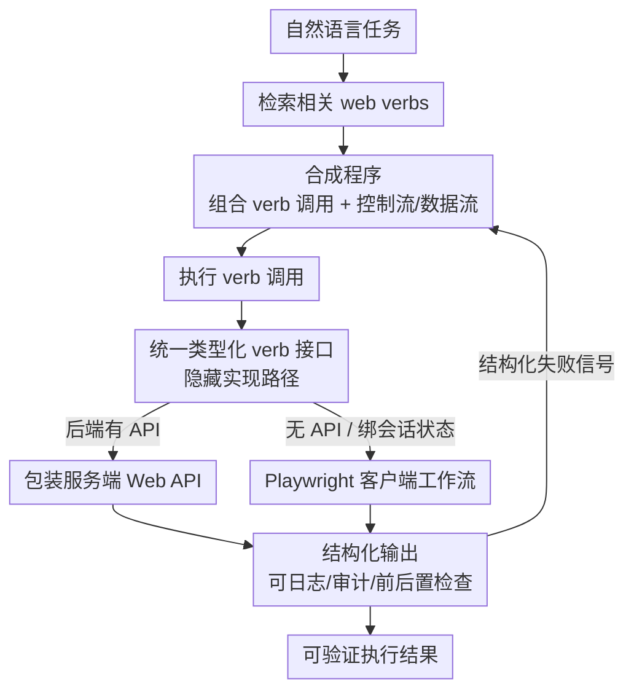

# Web Agents Should Use Typed Actions Instead of Click-Based Browsing

**会议**: ICML2026  
**arXiv**: [2602.17245](https://arxiv.org/abs/2602.17245)  
**代码**: https://github.com/nlweb-ai/MSR-Web-Verbs  
**领域**: Web Agent / LLM Agent（立场论文）  
**关键词**: Web 智能体, 类型化动作, 语义层, web verbs, 可验证执行  

## 一句话总结
这是一篇立场论文（Position Paper），主张要建一个可靠的"能动 Web"（agentic web），光靠更强的模型不够，必须让网站把常见 web 操作暴露成**带类型签名的"动作"**——作者把它具体设计成 **web verbs**（网页动词）：一个有结构化输入/输出、文档化行为的类型化函数，无论底层是服务端 Web API 还是客户端浏览器工作流；智能体在这层之上把任务合成成短小、带显式控制流/数据流、可审计的程序，从而比"点击+键盘+DOM"的低层原语更可靠、更高效、更可验证。

## 研究背景与动机
**领域现状**：Web 正在从"人去浏览"变成"软件去执行"。有了大模型，用户用自然语言委派开放任务（订机票、买东西、提申请）越来越现实，"能动 Web"成了 agent 研究的中心方向。当前主流 agent 主要通过两种范式与网页交互：**浏览器 agent**（感知 DOM/截图，执行点击、键入、滚动、导航等 GUI 低层原语）和 **API agent**（在有合适服务端 Web API 时通过结构化输入输出调用）。

**现有痛点**：真实环境里 web 自动化又脆、又慢、又难审计，尤其是长程、跨站工作流。根因是大多数 agent 还在用**低层交互原语**：动作抽象太细、几乎不携带语义信息，agent 被迫构造又长又脆的轨迹，每走一小步都要重新感知和规划，产出的执行过程意图与正确性都难以检查或复现。结果是——模型能力提升并不能稳定转化成可靠、高效、可验证的真实 web 自动化。论文用数据佐证：WebArena 上的顶尖系统 IBM CUGA 平均成功率 0.617，但跨站任务掉到 0.354（哪怕这些任务涉及的记录更少）。

**核心矛盾**：很多工作把 web 交互当成"在同一套低层原语上学更好的策略"，这有结构性上限——没有带稳定语义的类型化动作，agent 会永远在重新发现脆弱的、站点特定的点击序列，而不是合成正确可检查的工作流。而服务端 Web API 又只覆盖工作流的一部分（公开 API 多支持搜索/查询，而下单、选座、改地址、退订这些"完成任务"的步骤常绑定在交互式 web 流程和浏览器会话状态里，无法用一次无状态的公开 API 调用复现）。

**本文目标**：论证"能动 Web 需要一个暴露类型化动作的语义层"，并给出一个具体可落地的设计（web verbs），同时回应若干反对意见、指出标准化与工具链的待办。

**切入角度**：作者类比编程语言——类型化动作之于低层交互原语，就像高级语言之于汇编。高级语言让开发者写结构化程序而不必管每个寄存器和指令；web verbs 让 agent 构造工作流而不必推理每次点击和键入。底层操作依然精确，但 agent 的推理单位被抬高了。

**核心 idea**：让网站把高价值 web 操作暴露成"类型化、语义文档化、可组合、可审计"的 verb，agent 在 verb 层把任务合成成短程序——用"提高抽象层级"取代"学更好的低层策略"。

## 方法详解

### 整体框架
作者提出的工作流分两侧：**网站侧**把常见 web 操作发布并索引成 web verbs（每个 verb 有类型化输入、结构化输出、文档化行为）；**agent 侧**检索相关 verb，把它们组合成可执行的程序（procedure）。一个 verb 的实现可以走两条路——后端有合适 API 时把端点包成 verb，没有时用 Playwright 这类浏览器自动化工具把一段稳健的客户端工作流包成 verb——但 agent 始终只面对统一的类型化 verb 接口，"是 API 还是浏览器脚本"退化成实现细节。agent 拿到结构化输出后，可以把一个 verb 的结果传给下一个 verb，用条件分支、循环把任务逻辑显式写进代码，从而产出可检查、可复现的执行轨迹。

### 关键设计

**1. Web verb 抽象：把一次多步 web 操作收成一个类型化函数调用**

这是整篇论文的核心单元，针对的痛点是"低层原语语义太稀薄、轨迹太脆"。一个 web verb 是高层、类型化、像函数一样的接口，明确规定它的**输入、输出、预期行为**——不像点击/键入那样把含义绑死在坐标、元素状态、界面样式上。作者列出 verb 应满足的最小契约：语义清晰（用自然语言写明意图）、类型化参数（输入有名字和类型）、结构化结果（输出是结构化对象/记录，下游无需临时解析）、可组合（容易通过数据流/控制流拼接）、可审计（每次调用的输入输出都适合日志和检查）。一个例子是 Google Maps 的 `get_direction`：输入源/目的地，返回含行程时间、距离、路线的结构化结果；内部用 Playwright 走"输入地点→选驾车→读出时间距离"三步，但对 agent 就是一次类型化调用。关键是这把"在哪一层规划"从低层原语抬到了 verb 层。

**2. 统一 verb 层：把服务端 API 和客户端工作流藏在同一个接口后面**

痛点是现实里很多关键工作流根本没有单一公开 API（绑会话状态、要登录、要页面确认），而纯浏览器脚本又脆又不可复用。作者的设计是：一个站点的所有 verb 构成它面向 agent 的**语义层（verb 层）**，对外只呈现一个统一的类型化 verb 接口，对内允许两种实现路径并存。这也澄清了"web verb 不是换皮的公开 API"——公开 API 是面向开发者的产品，有自己的访问模型、版本、配额、支持义务；web verb 是面向 agent 的类型化动作，可由 API、客户端工作流或两者组合实现。对浏览器后端的 verb，作者并不声称今天的浏览器自动化栈已足够，而是说它提供一条对现存站点可行的路径：把脆弱的交互逻辑搬进一个**可测试、可加固、可版本化、可复用的维护实现**里，从而把工作从"每个 agent 每次运行时重新推理"转移到"共享的离线工程"。

**3. 在 verb 之上做程序化组合：让任务逻辑显式成代码，而非藏在长轨迹里**

有了 verb 作抽象层，任务不再是一步步预测低层原语，而是 agent 直接生成由 verb 调用组成的**显式程序**。因为每个 verb 有明确参数和结构化返回，程序可以把一个 verb 的输出传给后续调用、做变换、当作后续步骤的条件，不必让 agent 在上下文里推断调用细节或解析模糊结果。组合不限于线性流——可以有条件分支（下一步取决于中间结果）和循环（同一 verb 反复作用于一个集合），分支和迭代直接写在程序里，而不是执行时一步步临场决定。这与浏览器 agent"反复观察当前状态、预测下一个低层动作"形成对比：agent 的角色从"预测原语步骤"变成"合成保留任务逻辑的结构化程序"。程序化组合并不取消运行时适应——设计良好的 verb 内部能处理重试、会话检查、瞬时弹窗、轻微 UI 差异；遇到处理逻辑外的意外，verb 返回**结构化失败/恢复信号**，agent 可在 verb 层重规划、换 verb，或必要时回退到低层原语。

### 一个完整示例
论文用两个原型评测里的真实任务对比"verb 组合"与"低层轨迹"（原型为十多个网站实现了 verb、测了一百多个复杂任务全部成功）。

**旅行规划**：用户要为安克雷奇推荐博物馆和酒店，并按"每家候选酒店到每个选中博物馆的距离之和"排序。用 verb 时，任务自然拆成两步——先用包成 verb 的 NLWeb `ask` 接口返回带名称/描述/位置的结构化实体，再用 `get_direction` 取结构化的时间距离；agent 合成一个**嵌套循环程序**：外层遍历酒店、内层遍历博物馆、累加每家酒店的总距离再排序。而用低层原语时，浏览器 agent 没有"每家酒店到每个博物馆求和"，而是把博物馆串成单条路线的途经点、把路线总长当成总距离——输出看着合理，**却回答了另一个问题**。问题不是某个点击失败，而是用户指定的计算与 UI 实际执行的计算不匹配。

**家具购物**：用户搬新家，要在 1000 美元全局预算内、每类买一件（床架/床垫/书桌/椅子/落地灯/空气净化器/地毯）、最大化整体目标。用 verb 时 agent 为每类检索带价格/评分的结构化候选，把剩下的问题化简成标准的选择问题，再合成程序搜索候选组合、算总价总评分、返回预算内最高分的配置。用低层原语时，浏览器 agent 退化成**贪心**：一件件选直到超预算就停，留下若干类空着、跳过了本可满足约束的更便宜替代——没有实现"全局预算下的优化目标"。两个例子的共同教训：低层轨迹更容易在长序列里悄悄丢掉约束或改掉计算，而 verb 组合让任务逻辑显式、可检查，更直接地跟住了用户要求。

## 实验关键数据

作为立场论文，本文不做大规模基准刷分，而是用**代表性案例研究 + 原型证据**支撑论点。

### 案例对比

| 任务 | 用户要求的计算 | Web verb 组合 | 低层原语轨迹 |
|------|------|------|------|
| 旅行规划 | 每酒店到每博物馆距离求和后排序 | 嵌套循环：逐对累加距离再排序（正确） | 把博物馆串成单条路线途经点，路线总长当总距离（**答错了问题**） |
| 家具购物 | 全局 1000 美元预算下每类选一件、最大化目标 | 搜索候选组合、算总价总评分、返回预算内最优集 | 贪心选到超预算即停，留空类、跳过更优解（**未实现全局优化**） |

### 支撑论点的证据与论断

| 维度 | 低层原语的问题 | verb 层的改善 |
|------|------|------|
| 可靠性 | 动作绑坐标/样式、语义稀薄，跨站易累积误差（CUGA 跨站 0.354） | 稳定语义，逻辑不随界面细节漂移 |
| 效率 | 一次任务展开成上百步，每步都要感知+推理+工具调用 | 折叠成少量可复用类型化调用，维护成本集中一次、跨 agent 摊销 |
| 可验证 | 轨迹不透明，难以检查/复现 | 显式输入输出可日志、审计、加前后置条件与策略标签 |

### 关键发现
- **原型规模证据**：为 10+ 网站实现 verb、测 100+ 个复杂任务全部成功完成，说明 verb 层在真实站点上可落地。
- **失败不是"点错了"，而是"算错了"**：低层原语下的两次失败都不是点击失败，而是**用户指定的计算被翻译成长 UI 序列时悄悄走样**（旅行任务把求和变成单路线、购物任务把全局优化变成贪心）。这正是论文反复强调的"语义漂移"。
- **跨站是低层原语的重灾区**：CUGA 平均 0.617，跨站任务掉到 0.354，佐证"跨站组合给低层交互带来巨大压力"。

## 亮点与洞察
- **"类型化动作 : 低层原语 = 高级语言 : 汇编"这个类比极有解释力**：一句话讲清了为什么抬高抽象层级能同时改善可靠性/效率/可验证性——底层操作依旧精确，变的是 agent 的推理单位。
- **把"是 API 还是浏览器脚本"降格为实现细节**很关键：现实里关键工作流常绑会话状态、没有公开 API，统一 verb 接口让"对现存站点可行"和"长期可标准化"两个目标不打架。
- **可验证执行**是被很多 agent 工作忽视但对真实部署至关重要的一点：verb 调用天然可日志/审计/加前后置条件，把"不透明轨迹"变成"可解释的动作调用序列"，对需要正确性和合规的场景是刚需。
- **"成本从运行时重发现转到离线工程一次性投入再摊销"**这个经济学视角很务实——可迁移到任何"重复执行的脆弱自动化"场景：与其让每个调用方各自踩坑，不如把工作流硬化成一个维护良好的共享实现。
- 作者对反对意见的回应（更强模型够不够、覆盖率、与公开 API 同样的采纳壁垒）很坦诚，承认类型化动作初期覆盖不了整个 Web，但主张"先可靠覆盖高频高后果操作"即可显著降低工作流的长度与脆性。

## 局限与展望
- **这是立场论文，不是系统论文**：证据以代表性案例 + 原型为主，没有大规模、可复现的基准对比；"100+ 任务全成功"缺少与强基线在统一协议下的量化对照，外部效度有限。
- **覆盖率是公开软肋**（作者自己列为 View 2）：Web 长尾任务多，类型化动作初期只能覆盖一小部分；作者的回应是"长尾任务常分解为少数复发操作"，但这是论证而非实证。
- **采纳壁垒**（View 3）：web verb 可能像公开 API 一样面临"谁来实现、谁来维护、版本/配额/激励"的现实阻力；论文寄望于"agent 成为主流访问方式后开发者自有动力"，属于乐观假设。
- **浏览器后端 verb 仍依赖今天的自动化栈**，作者明确不声称其已足够稳健——脆弱性只是被搬进了维护实现里，没有消失。
- 待办：标准化（verb 的发布/索引/版本协议）、开发者工具链、社区流程——这些是让语义层能在 web 规模上可部署、可信任的前提。

## 相关工作与启发
- **vs 浏览器 agent（WebArena/CUGA 等低层原语路线）**: 他们在 DOM/截图上学更好的 GUI 接地与长程控制策略；本文论证"换接口"比"换策略"更根本——长有状态轨迹的失败模式来自交互的长度与结构，光靠训练难以消除。
- **vs API agent（服务端 Web API 路线）**: 公开 API 只覆盖搜索/查询等部分工作流，下单/退订/改地址等绑会话状态的步骤覆盖不到；web verb 统一两条实现路径，补上了"完成任务"那一段。
- **vs NLWeb（Microsoft, 2025）**: NLWeb 用语义层让 agent 更好地"知道" web 内容（检索/接地，靠 RSS、Schema.org），但它定义的是 agent **知道什么**，不是 agent **能做什么**；本文恰好补上"动作"这一维，且把 NLWeb 的 `ask` 包成 verb 来用。
- **vs 屏幕抓取/浏览器宏**: web verb 与之相关，但通过面向 agent 的类型化接口暴露工作流，而非作为独立脚本，因此可组合、可审计、可复用。

## 评分
- 新颖性: ⭐⭐⭐⭐ "用类型化语义层取代低层原语"的立场清晰，web verbs 的具体设计 + 编程语言类比有说服力。
- 实验充分度: ⭐⭐⭐ 立场论文，案例 + 原型证据扎实但缺统一协议下的量化基准对比。
- 写作质量: ⭐⭐⭐⭐⭐ 论点层层递进、主动列三种反对意见并逐一回应，结构与诚实度俱佳。
- 价值: ⭐⭐⭐⭐ 为 agentic web 指出"语义层/类型化动作"这一可落地方向，对可靠、可验证的 web 自动化有现实指导意义。

<!-- RELATED:START -->

## 相关论文

- [\[ACL 2026\] Don't Click That: Teaching Web Agents to Resist Deceptive Interfaces](../../ACL2026/llm_agent/dont_click_that_teaching_web_agents_to_resist_deceptive_interfaces.md)
- [\[ICML 2026\] Position: Agentic AI Orchestration Should Be Bayes-Consistent](position_agentic_ai_orchestration_should_be_bayes-consistent.md)
- [\[ICML 2026\] Hunt Instead of Wait: Evaluating Deep Data Research on Large Language Models](hunt_instead_of_wait_evaluating_deep_data_research_on_large_language_models.md)
- [\[ACL 2025\] Browsing Like Human: A Multimodal Web Agent with Experiential Fast-and-Slow Thinking](../../ACL2025/llm_agent/browsing_like_human_a_multimodal_web_agent_with_experiential_fast-and-slow_think.md)
- [\[ICML 2026\] MacArena: Benchmarking Computer Use Agents on an Online macOS Environment](macarena_benchmarking_computer_use_agents_on_an_online_macos_environment.md)

<!-- RELATED:END -->
