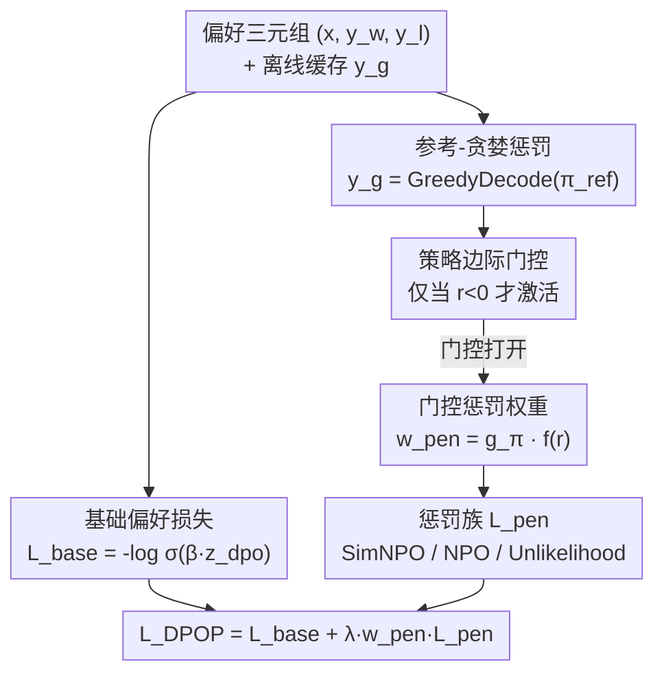

# Boosting Direct Preference Optimization with Penalization

**会议**: ICML2026  
**arXiv**: [2606.12505](https://arxiv.org/abs/2606.12505)  
**代码**: 待确认  
**领域**: 对齐RLHF / 偏好优化  
**关键词**: DPO、偏好优化、参考贪婪响应、门控惩罚、SimNPO

## 一句话总结
本文提出 DPOP（Direct Preference Optimization with Penalization），在标准 DPO 偏好损失之外，额外**惩罚"参考模型自己对同一 prompt 贪婪解码出的响应" $y_g$**，并用一个 detached 门控只在"策略当前仍把被拒响应排在被选响应之上"时才激活这个惩罚，从而把 DPO 一直没用上的参考-贪婪信号变成有效的离线对齐信号，在 AlpacaEval 2.0 上以长度控制胜率超过 DPO/SimPO/AlphaDPO。

## 研究背景与动机
**领域现状**：把 LLM 对齐到人类偏好，传统靠 RLHF——单独训奖励模型 + 在线策略优化，pipeline 复杂。DPO 把它简化成一个**纯成对分类任务**：直接在"参考校正过的策略对数似然比"上做 Bradley–Terry 偏好分类，绕开显式奖励模型，又保留了参考模型的正则作用，因此一直是强基线。

**现有痛点**：这种简化也带来一个限制——**训练信号被锁死在偏好数据集里已经存好的两条响应** $(y_w, y_l)$ 上。但现代指令微调的偏好数据往往是 off-policy 的、由教师模型生成或过滤，而非从正在训练的策略采样。在这种 regime 下，参考模型不只是个 KL 正则项，它还是一个**具体的生成器**——它对每个 prompt 自己贪婪解码出的那条响应 $y_g$，恰恰暴露了"策略可能会继续模仿的局部模式"。而 DPO 只在 $(x, y_w, y_l)$ 上更新，把 $y_g$ 完全晾在目标函数之外。

**核心矛盾**：参考模型贪婪输出的 $y_g$ 既是有用信号（它揭示了策略容易陷进去的局部模式），又被现有目标完全忽略——**有信号却不用**。

**本文目标**：用最小的改动把这条被浪费的 $y_g$ 信号纳进离线偏好目标，且不破坏 DPO 的稳定性。

**核心 idea**：保留原始成对偏好损失作为基础项，**额外对 $y_g$ 的策略似然施加一个门控惩罚**——只在策略还没学会这条偏好（即仍把 $y_l$ 排在 $y_w$ 前面）时才施压。

## 方法详解

### 整体框架
DPOP 的目标函数就两块：**基础成对偏好损失** + **对参考-贪婪响应 $y_g$ 的门控惩罚**。输入是常规偏好三元组 $(x, y_w, y_l)$，外加离线缓存好的 $y_g = \mathrm{GreedyDecode}(\pi_{\mathrm{ref}}(\cdot|x))$。训练时先算标准 DPO 基础损失；再算一个基于"策略似然边际"的门控，决定**这个样本要不要施加惩罚**；若要，则按某个惩罚族对 $y_g$ 施压。整套设计刻意极简——原成对损失原封不动，只在一条额外的生成响应上、且仅在门控打开时加压。

最终目标为：

$$\mathcal{L}_{\mathrm{DPOP}} = \mathcal{L}_{\mathrm{base}} + \lambda_{\mathrm{pen}}\, w_{\mathrm{pen}}\, \mathcal{L}_{\mathrm{pen}}$$

### 关键设计

**1. 参考-贪婪响应 $y_g$：把 DPO 漏掉的"参考模型局部模式"接回目标函数**

DPOP 的出发点是：参考模型对每个 prompt 贪婪解码出的 $y_g$，代表了"对当前 prompt 而言可能不可取的一个局部模式"——策略若不被显式纠正，就会继续模仿它。这条响应离线生成、缓存进训练数据，不增加在线 rollout 成本。和机器遗忘里"惩罚有害数据"不同，这里的 $y_g$ 不是私密或有害数据，而只是一条模型自己生成的、对当前 prompt 而言"不够好"的响应。把它当作惩罚目标，等于在标准偏好优化之外补了一个"别往参考模型的贪婪模式上靠"的反向信号。基础项仍是原汁原味的 DPO：用参考校正 logit $z_{\mathrm{dpo}} = \log\frac{\pi_\theta(y_w|x)\,\pi_{\mathrm{ref}}(y_l|x)}{\pi_{\mathrm{ref}}(y_w|x)\,\pi_\theta(y_l|x)}$，损失 $\mathcal{L}_{\mathrm{base}} = -\log\sigma(\beta z_{\mathrm{dpo}})$。

**2. detached 策略边际门控：只在"策略还没学会这条偏好"时才施压**

这是 DPOP 区别于"无脑加惩罚"的关键。直接对所有样本都惩罚 $y_g$ 会误伤——对那些策略已经学好的样本再施压只会破坏已有结构。DPOP 先算策略似然边际 $r = \mathrm{sg}\big(\log\pi_\theta(y_w|x) - \log\pi_\theta(y_l|x)\big)$（$\mathrm{sg}$ 为 stop-gradient），门控 $g_\pi = \mathrm{sg}(\mathbf{1}[r<0])$ 只在 **$r<0$**（即策略仍给被拒响应更高似然、说明它还没内化这条成对偏好）时才打开。惩罚权重 $w_{\mathrm{pen}} = g_\pi f(r)$ 进一步用一个非负函数 $f$ 调节施压强度，$f$ 可取线性 $\max(-r,0)$、常数、平方根 $\sqrt{\max(-r,0)+\epsilon}$ 或二次 $\max(-r,0)^2$。门控和权重都 detached（stop-gradient），所以它们只决定"何时、施加多大"惩罚，本身不回传梯度。这种"哪里没学会就往哪里补"的选择性施压，正是它不破坏 DPO 稳定性的原因。

**3. 惩罚族选择，SimNPO 风格最优：长度归一化 + 去参考的负向目标**

$y_g$ 上具体施什么惩罚，作者比较了三族。**Token 级 unlikelihood** 直接压低策略对 $y_g$ 各 token 的概率：$\mathcal{L}_{\mathrm{unll}} = -\frac{1}{|y_g|}\sum_t \log(1 - \pi_\theta(y_{g,t}|x, y_{g,<t}))$。**NPO** 用参考-相对的负向目标 $\mathcal{L}_{\mathrm{npo}} = -\frac{2}{\beta_p}\log\sigma(-\beta_p[\log\pi_\theta(y_g|x) - \log\pi_{\mathrm{ref}}(y_g|x)])$。**SimNPO** 则去掉参考、改用长度归一化的平均序列对数概率：$\mathcal{L}_{\mathrm{simnpo}} = -\frac{2}{\beta_p}\log\sigma(-\beta_p \overline{\log\pi_\theta(y_g|x)} - \gamma_p)$，其中 $\overline{\log\pi_\theta}$ 是平均序列对数概率、$\gamma_p$ 是惩罚边际。这三族原本来自机器遗忘领域，DPOP 把它们移植到偏好对齐当作"惩罚模板"。实验上 **SimNPO 风格显著最强**——它的长度归一化和"对被惩罚响应去参考"两个性质，让惩罚更稳、更有效（直觉上与 SimPO"序列平均对数概率比参考校正隐式奖励更贴合推理"的论证一脉相承）。

### 损失函数 / 训练策略
完整算法（单 minibatch）：① 在 $(x, y_w, y_l)$ 上算 $\mathcal{L}_{\mathrm{base}}$；② 算 $r = \mathrm{sg}(\log\pi_\theta(y_w|x) - \log\pi_\theta(y_l|x))$；③ 置 $w_{\mathrm{pen}} = \mathrm{sg}(\mathbf{1}[r<0])f(r)$；④ 在 $y_g$ 上算 $\mathcal{L}_{\mathrm{pen}}$；⑤ 返回 $\mathcal{L}_{\mathrm{base}} + \lambda_{\mathrm{pen}} w_{\mathrm{pen}} \mathcal{L}_{\mathrm{pen}}$。关键超参为惩罚权重 $\lambda_{\mathrm{pen}}$、惩罚温度 $\beta_p$、SimNPO 边际 $\gamma_p$。

## 实验关键数据

### 主实验
两个指令微调模型作 SFT 初始化：Meta-Llama-3-8B-Instruct 和 gemma-2-9b-it，用 UltraFeedback 风格偏好数据训练，8×H100 训练，AlpacaEval 2.0 评测，主指标是**长度控制胜率 LC-WR**（因自动评测器偏好更长响应）：

| 模型 | 方法 | WR | LC-WR | 长度 |
|------|------|-----|-------|------|
| Llama-3-8b-it | DPO | 39.49 | 41.84 | 1909 |
| | SimPO | 37.65 | 44.01 | 1763 |
| | AlphaDPO | 33.05 | 41.48 | 1675 |
| | **DPOP (ours)** | **47.57** | **46.35** | 2057 |
| Gemma-2-9b-it | DPO | 70.40 | 66.90 | 1900 |
| | SimPO | 66.12 | 73.08 | 1754 |
| | AlphaDPO | 65.32 | 74.90 | 1682 |
| | **DPOP (ours)** | **73.76** | **78.22** | 1970 |

DPOP 在两个模型上 LC-WR 都最高，相对基线分别有 5.3% 和 4.4% 的相对增益。作者也提醒：raw WR 的提升部分来自响应变长（尤其 Llama），所以强调 LC-WR 为主指标。

### 消融实验：惩罚族对比（Llama-3-8b-it，各取最优超参）

| 惩罚族 | $\lambda_{\mathrm{pen}}$ | $\beta_p$ | $\gamma_p$ | WR | LC-WR | 长度 |
|--------|------|------|------|-----|-------|------|
| SimNPO | 1.0 | 1.0 | 1.0 | 47.57 | **46.35** | 2057 |
| NPO | 0.01 | 0.05 | – | 42.76 | 43.94 | 1960 |
| Unlikelihood | 0.01 | – | – | 40.07 | 41.36 | 1948 |

### 关键发现
- **SimNPO 风格惩罚最强**：46.35 LC-WR，明显高于 NPO（43.94）；NPO 仍优于 DPO 基线，但 **Unlikelihood（41.36）甚至低于不加惩罚的 DPO**，说明 token 级 unlikelihood 在这个场景反而有害——惩罚族的选择至关重要，不是随便加个负向项就行。
- **参考-贪婪响应确实是有用信号**：DPOP 一致超过所有 baseline，验证了"$y_g$ 不只是可缓存的分析产物，而能转化为有效的离线惩罚信号"这一核心假设。
- **超参敏感性**：SimNPO sweep 显示 Llama 在 $\lambda{=}1.0,\beta_p{=}1.0,\gamma_p{=}1.0$ 最优（46.35），Gemma 在 $\lambda{=}2.0,\beta_p{=}1.0,\gamma_p{=}0.0$ 最优（78.22），最优配置随模型略有不同但都在小搜索空间内。

## 亮点与洞察
- **"参考模型的贪婪输出是被浪费的信号"这个观察很精准**：DPO 把参考模型只当 KL 正则，DPOP 点出它还是个具体生成器、其 $y_g$ 暴露了策略会模仿的局部坏模式——这是最"啊哈"的视角转换。
- **门控才是灵魂而非惩罚本身**：detached 的"只在 $r<0$ 才施压"门控，把惩罚精准投放到"策略还没学会的样本"，避免误伤已学好的样本，这是它能加信号又不崩稳定性的关键，可迁移到任何"想加辅助损失但怕破坏主目标"的场景。
- **跨领域移植**：把机器遗忘的 NPO/SimNPO 惩罚族搬到偏好对齐，并实证 SimNPO 的长度归一化 + 去参考性质在这里同样占优，呼应了 SimPO 的设计哲学。
- **改动极小、即插即用**：DPOP 只在 DPO 上加一项，$y_g$ 离线缓存、无额外在线 rollout，工程落地成本低。

## 局限与展望
- **评测面窄**：只在 AlpacaEval 2.0、两个模型上验证，缺乏更大模型、更多下游任务（如数学/代码/安全）的检验，泛化性待考。
- **$y_g$ 质量依赖参考模型**：若参考模型本身贪婪输出就还不错，"惩罚它"的收益和方向是否仍成立存疑；论文未深入讨论 $y_g$ 质量分布对效果的影响。
- **长度混淆未完全摆脱**：DPOP 的响应明显更长（Llama 2057 vs SimPO 1763），虽用 LC-WR 缓解，但 raw WR 的增益部分来自长度，真实质量提升幅度需谨慎解读。
- **改进方向**：可探索把 $y_g$ 从"单条贪婪"扩成"多条采样的坏模式集合"，或让门控阈值/惩罚强度随训练动态自适应。

## 相关工作与启发
- **vs DPO**: DPOP 完整保留 DPO 成对损失作基础项，只额外惩罚参考-贪婪响应 $y_g$；DPO 把 $y_g$ 完全排除在目标外，DPOP 把它接回来。
- **vs SimPO**: SimPO 去掉参考模型、用序列平均对数概率 + 固定边际 $\gamma$；DPOP 借鉴其"长度归一化更贴合推理"的思想，但用在**惩罚项**（SimNPO 风格）上而非主偏好损失，且仍保留参考校正的 DPO 基础项。
- **vs AlphaDPO**: AlphaDPO 保留参考视角、按策略与参考行为的插值自适应调节奖励边际；DPOP 不动边际机制，而是新增一条对 $y_g$ 的门控惩罚——两者改的是目标函数的不同部位。
- **vs NPO / SimNPO（机器遗忘）**: 它们是为遗忘"有害数据"设计的负向偏好目标；DPOP 把它们当惩罚模板移植到偏好对齐，且被惩罚的 $y_g$ 是模型自生成的"局部坏模式"而非私密/有害数据。

## 评分
- 新颖性: ⭐⭐⭐⭐ "用参考-贪婪响应 + 门控惩罚"是简洁而新的视角，但属 DPO 系增量改进。
- 实验充分度: ⭐⭐⭐ 两模型 + AlpacaEval 2.0 + 惩罚族/超参消融较扎实，但 benchmark 与模型覆盖偏窄。
- 写作质量: ⭐⭐⭐⭐ 方法极简清晰，公式与算法交代到位。
- 价值: ⭐⭐⭐⭐ 改动小、即插即用、有一致增益，对离线偏好优化实践有参考价值。

<!-- RELATED:START -->

## 相关论文

- [\[ICML 2026\] Autoregressive Direct Preference Optimization](autoregressive_direct_preference_optimization.md)
- [\[ICLR 2026\] SafeDPO: A Simple Approach to Direct Preference Optimization with Enhanced Safety](../../ICLR2026/llm_alignment/safedpo_preference_optimization_safety.md)
- [\[ICLR 2026\] Token-Importance Guided Direct Preference Optimization (TI-DPO)](../../ICLR2026/llm_alignment/token-importance_guided_direct_preference_optimization.md)
- [\[ICLR 2026\] ActiveDPO: Active Direct Preference Optimization for Sample-Efficient Alignment](../../ICLR2026/llm_alignment/activedpo_active_direct_preference_optimization_for_sample-efficient_alignment.md)
- [\[ACL 2025\] DiffPO: Diffusion Alignment with Direct Preference Optimization](../../ACL2025/llm_alignment/diffpo_diffusion_alignment.md)

<!-- RELATED:END -->
