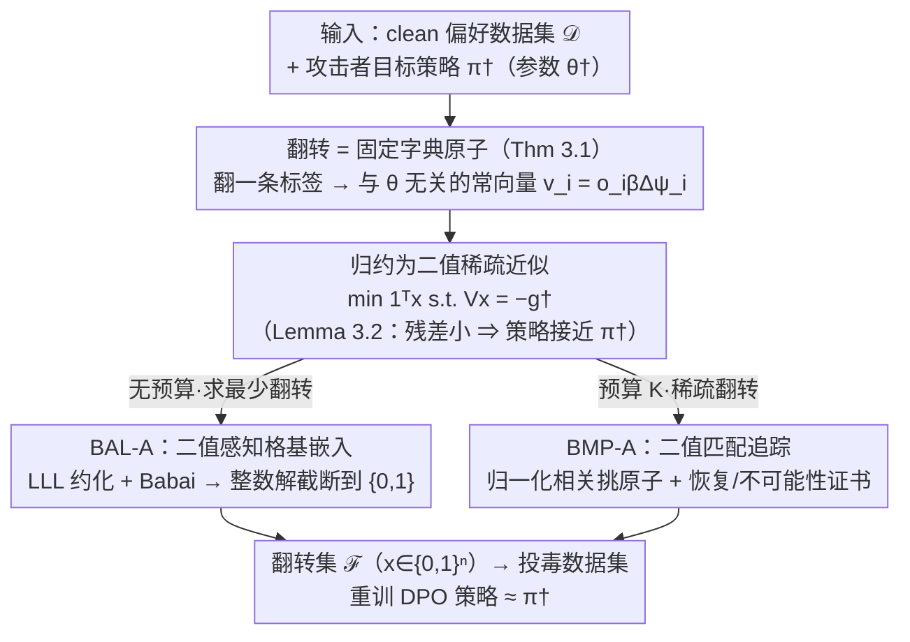

# Efficient Preference Poisoning Attack on Offline RLHF

**会议**: ICML 2026  
**arXiv**: [2605.02495](https://arxiv.org/abs/2605.02495)  
**代码**: 无  
**领域**: LLM安全 / 偏好投毒 / 对齐RLHF  
**关键词**: 偏好投毒, DPO, 标签翻转, 稀疏恢复, 格基约化

## 一句话总结
针对 log-linear DPO 提出"翻一条偏好标签 = 给损失梯度加一个与策略参数无关的固定向量"的关键观察，把目标投毒攻击归约为二值稀疏近似问题，给出基于 LLL 格基约化的 BAL-A 和基于匹配追踪的 BMP-A 两种算法以及可证明的恢复 / 不可能性条件。

## 研究背景与动机

**领域现状**：离线 RLHF 已成为对齐 LLM 的主流路径，DPO 直接在预先收集好的成对偏好数据集上做训练，省去显式 reward model。围绕 DPO 的安全性已经有两类典型攻击模型：标签翻转 (label flip) 和数据注入 (data injection)。

**现有痛点**：数据注入攻击 (Nika et al., 2025) 已有较完备的理论刻画，但相对昂贵——为了让攻击成立，注入样本数要随原数据集线性增长。标签翻转更"经济"也更现实（攻击者通常只能改既有标注，不能凭空造样本对），但目前主要是经验观察，**缺少理论刻画"翻几条、翻哪些"才能把策略推到指定方向**。

**核心矛盾**：标签翻转的攻击者面对两个本质难题。其一，可操作集合受限——只能在 $n$ 条既有比较里挑子集 $\mathcal{F}$ 翻转；其二，单条标签翻转对最终学到的策略 $\hat\theta$ 的影响在一般非线性模型里是参数依赖的，无法事先准确预测，因此"哪条最有效"是组合搜索问题。

**本文目标**：在 log-linear 策略类下，针对 DPO 给出：(i) 一阶刻画——翻转一条标签到底改了什么；(ii) 把目标投毒形式化为可解的优化问题；(iii) 两种可证明算法及其恢复 / 不可能性保证。

**切入角度**：作者注意到在 log-linear DPO 中，per-sample 损失 $\ell_i(\theta)$ 关于 $\theta$ 求梯度后，翻转标签 $o_i\to-o_i$ 引起的梯度增量 $\Delta g_i$ **完全不依赖当前 $\theta$**——它只是 $o_i\beta(\psi(s_i,a_i)-\psi(s_i,a_i'))$ 这一常向量。这把一个看似策略依赖的攻击瞬间变成了"在固定字典 $V$ 上做二值稀疏近似"。

**核心 idea**：把"找最少的标签翻转使训练后策略接近 $\pi^\dagger$"重写为 $\min_{x\in\{0,1\}^n}\|x\|_0$ s.t. $Vx=-g^\dagger$ ，其中字典 $V$ 的每列是单条样本的翻转梯度原子、target $g^\dagger$ 是 clean DPO 损失在 $\theta^\dagger$ 处的梯度。

## 方法详解

### 整体框架
这篇论文要回答的是"对 DPO 训练的偏好数据集，翻几条、翻哪些标签才能把学到的策略精确推到攻击者指定的方向 $\pi^\dagger$"。整条 pipeline 靠一个观察撑起来：在 log-linear 策略下翻一条标签对训练结果的影响是个与当前参数 $\theta$ 无关的常向量，于是攻击被归约成"在固定字典 $V=[v_1,\dots,v_n]\in\mathbb{R}^{d\times n}$（$v_i=o_i\beta\Delta\psi_i$）上找一个二值组合 $x\in\{0,1\}^n$ 逼近 $-g^\dagger$"的稀疏近似问题 $\min\mathbf{1}^\top x$ s.t. $\|Vx+g^\dagger\|_2\le\varepsilon$。Lemma 3.2 再补上残差到策略距离的桥梁——$m$-强凸下 $\|Vx+g^\dagger\|_2\le\varepsilon$ 蕴含 $\|\hat\theta-\theta^\dagger\|_2\le\varepsilon/m$ 进而界住 $\ell_1$ 策略距离，所以只要把残差压小就能保证训练后策略接近目标。这个稀疏问题 NP-hard，作者按攻击场景给两种求解器（无预算最少翻转用 BAL-A、预算 $K$ 的稀疏翻转用 BMP-A）并各配恢复 / 不可能性条件。

### 关键设计

**1. 翻转 = 固定字典原子（Theorem 3.1）：把投毒从 bi-level 难题降阶成稀疏恢复**

标签翻转攻击最棘手的地方在于，单条翻转对最终策略 $\hat\theta$ 的影响在一般模型里是参数依赖的——你得"在攻击后的数据上重训练再看策略变化"，这是个无法事先预测的 bi-level 组合搜索。本文的支点是发现 log-linear + DPO 的损失结构让这个依赖消失了：对 $\pi_\theta(a\mid s)\propto\exp(\psi(s,a)^\top\theta)$，单样本损失 $\ell_i(\theta)$ 对 $\theta$ 求导得到 $o_i\bigl(1-\sigma(o_i\beta\Delta\psi_i^\top\theta)\bigr)\beta\Delta\psi_i$，其中 sigmoid 项关于偏好标签 $o_i$ 是对称的。把 $o_i$ 翻成 $-o_i$ 再与原梯度做差，含 $\theta$ 的 sigmoid 部分恰好抵消，只剩下常向量 $\Delta g_i=o_i\beta\Delta\psi_i$。这一抵消把"重训练后看策略怎么变"直接换成了"在固定向量集 $\{v_i\}$ 上找二值线性组合逼近 $-g^\dagger$"，攻击因此落进标准稀疏恢复的语境，全文的两个算法和理论保证都建立在这条结构性观察上。

**2. 二值感知格基嵌入 BAL-A（§4）：用 LLL 求解最少翻转的整数解**

无预算场景要找最少的翻转使 $Vx+g^\dagger=0$。直接对 $\min_x\|Vx+g^\dagger\|^2$ 做整数松弛会退化成最近向量问题（CVP），但 CVP 的解未必落在 $\{0,1\}$ 上、也不直接最小化翻转条数。作者的做法是构造一个 $(d+n)\times(n+1)$ 的嵌入基

$$B_{\mathrm{bin}}=\begin{pmatrix}V&-g^\dagger\\ MI_n&0\end{pmatrix},$$

使任何整数系数 $z$ 对应格点的长度平方拆成 $\|y(z)\|^2=\|Vz+g^\dagger\|^2+M^2\|z\|^2$，同时惩罚残差和系数幅值；而在 $\{0,1\}$ 解上恰有 $\|x\|_2^2=\mathbf{1}^\top x$，于是那个 $\ell_2$ 惩罚自动变成了翻转条数。之后跑 LLL（$\delta=0.75$）+ Babai nearest-plane 求出整数 $z$ 再截断到 $\{0,1\}$。关键全在标量 $M$ 上：$M$ 充分大（Lemma 4.1 给出 $M_0\approx (B\sqrt{K^\star}+\sqrt{B^2K^\star+6BR+3B^2})/3$）能强制系数落进 $\{-1,0,1\}$、在 $z\ge0$ 下进一步收到 $\{0,1\}$；Theorem 4.3 的分离条件 $\rho_k^2>M^2(K^\star-k)$ 再保证全局极小确实是那个 $K^\star$-flip 可行解。这相当于第一次把数论里的 LLL-CVP 工具贴合到 $\{0,1\}$ 最小翻转语义上，靠一个 $M$ 在"残差小"与"系数小（即翻转少）"之间调度。

**3. 二值匹配追踪 BMP-A（§5）：预算受限下的贪心求解 + 攻不动的证书**

BAL-A 的 LLL 预处理在 $n$ 上百时就吃力，所以预算 $K$ 受限的场景换一条更轻的路：把正交匹配追踪（OMP/BMP）适配到非归一化字典 $V$。每步用归一化相关分数 $|\langle v_i,r\rangle|/\|v_i\|_2$ 挑原子、但残差更新仍用原始列 $r\leftarrow r-v_{i_t}$，最多 $K$ 步或 $\|r\|_2\le\varepsilon$ 提前停，复杂度极低（实测比 BAL-A 快约 $5000\times$）。它的保证写在字典几何上：定义互相干 $\mu(V)=\max_{i\ne j}|\langle v_i,v_j\rangle|/(\|v_i\|\|v_j\|)$，Theorem 5.3 在 $\mu(V)<b/((2K^\star-1)B)$ 时保证每步选对支撑、$K^\star$ 步精确恢复。更有意思的是反方向：Theorem 5.4 给出两个不依赖任何算法的不可能条件 $\|g^\dagger\|_2-\varepsilon>\sqrt{K}\|V\|_2$ 或 $(\|g^\dagger\|_2-\varepsilon)^2>B^2(K+\mu(V)K(K-1))$，列范数越小、方向越发散就越攻不动——这其实是对 DPO 自身鲁棒性的一个谱 + 几何刻画，也直接指向"主动设计偏好数据集让 $V$ 的列又小又散"这一防御方向。

### 损失函数 / 训练策略
攻击者本身不训练新模型，只求解上面的稀疏问题：BAL-A 仅一个超参 $M$（实验在 25 个 log-spaced 值上扫），BMP-A 仅 $K$ 和 $\varepsilon$。下游 DPO 训练沿用 log-linear + $\ell_2$ 正则 $L_{\mathrm{DPO}}(\theta;\mathcal{D})+\tfrac{\lambda}{2}\|\theta-\theta_\mu\|^2$ 的标准配方。

## 实验关键数据

### 主实验

| 数据集 | 方法 | 设置 | TPR | 残差/距离 |
|--------|------|------|------|----------|
| Synthetic Gaussian ($d=64,n=20,K^\star=5$) | BAL-A | $M<M_{\text{all sep}}\approx0.68$ | ≈1.0 | 全 0 |
| Synthetic Gaussian ($d=64,n=20,K^\star=5$) | BAL-A | $M>M_{\text{all sep}}$ | 快速下降 | 偏大 |
| Synthetic low-coherence ($\mu\approx0.197,n=200$) | BMP-A | $K^\star\le K_{\text{coh}}=3$ | 1.0 | 0 |
| Synthetic low-coherence ($\mu\approx0.197,n=200$) | BMP-A | $K^\star>K_{\text{coh}}$ | 仍较高，缓慢下降 | 较小 |
| SHP 实数据 ($n=50,K^\star=7$, common feasible) | BAL-A | TP/FP/FN = 7/0/0 | 1.0 | $\|\pi_{\theta^\dagger}-\pi_{\hat\theta}\|_1\approx0.012$ |
| SHP 实数据 ($n=50,K^\star=7$, common feasible) | BMP-A | TP/FP/FN = 7/0/0 | 1.0 | 同上 |

Clean-vs-attacked 距离 $\|\pi_{\mathrm{clean}}-\pi_{\hat\theta}\|_1\approx 0.224$，约为 attack-vs-groundtruth 距离 (0.012) 的 19 倍——说明恢复的翻转模式不仅复现了构造的攻击，还**把策略真正推离了 clean baseline**。

### 消融 / 对比

| 配置 | 关键指标 | 说明 |
|------|---------|------|
| BAL-A, $M\to0$ | TPR≈1 | $M$ 越小越接近纯残差极小，但失去 binary 强制 |
| BAL-A, $M=M_0\approx1.69$ (理论充分界) | TPR 显著下降 | Lemma 4.1 的二值充分界过于保守 |
| BMP-A on low-coherence subset | TPR↑ | 字典几何越发散，匹配追踪越准 |
| BMP-A on random subset | TPR↓ | 高相干字典让贪心选错原子 |
| BAL-A runtime (SHP, $n=50$) | 0.6865 s | 主要花在 LLL 预处理 |
| BMP-A runtime (SHP, $n=50$) | $1.37\times10^{-4}$ s | 比 BAL-A 快约 $5\times10^3$ 倍 |

### 关键发现
- BAL-A 的成功**陡变于 $M$ 的分离阈值** $M_{\text{all sep}}$，理论给出的二值充分界 $M_0$ 通常过于保守，实践中可以取更小的 $M$ 而仍然保证 binary。
- BMP-A 的相干性充分条件 $K_{\text{coh}}$ 也是保守的——超出 $K_{\text{coh}}$ 后 TPR 是缓慢退化而非断崖。
- 字典几何（特别是 mutual coherence $\mu(V)$）几乎是决定攻击是否成立的唯一关键——SHP 上 BMP-A 在 low-coherence 子集上显著优于 random 子集，反过来在 high-coherence 字典上即使 $K\gg K^\star$ 也可能失败。
- 不可能性证书 (Theorem 5.4) 是无算法依赖的——若 $\|g^\dagger\|_2-\varepsilon>\sqrt{K}\|V\|_2$，**任何**算法都无法用 $K$ 步翻转完成攻击。

## 亮点与洞察
- **"参数无关梯度增量"是把投毒从 bi-level 难题降阶到稀疏恢复的关键支点**——它依赖 log-linear + DPO sigmoid 损失的对称性，可被视为这一组合的内禀脆弱性，而不是某种"实现细节"。
- **把 LLL + Babai 这套数论级工具嫁接到机器学习投毒上**很巧妙：二值感知嵌入 $\begin{pmatrix}V&-g^\dagger\\MI_n&0\end{pmatrix}$ 同时编码"残差小"和"系数小"两个目标，调一个 $M$ 就能在两者间扫描——这种"用一个标量调度 NP-hard 二值约束"的范式可以迁到 OMP/Lasso 之外的诸多稀疏选择问题。
- **不可能性条件给出了 DPO 鲁棒性的几何刻画**：$\sqrt{K}\|V\|_2$ 和 $\mu(V)$ 提示真实防御方向不是"事后清洗"，而是**主动设计偏好数据集让 $V$ 的列既小又发散**（例如多样性采样 / 去重），这对偏好数据集构造有直接指导。
- 攻击的"经济性"——SHP 上仅翻转 7/50 条标签就能把策略 $\ell_1$ 距离推到 0.224，是相对数据注入方式的实质性效率提升，凸显了 RLHF 的标注链路是 attack surface 而不仅是"质量问题"。

## 局限与展望
- 假设极强：只覆盖 **log-linear 策略 + DPO**，对一般神经网络策略下梯度增量是 $\theta$ 依赖的，需要近似或在线更新字典 $V$。
- 白盒：攻击者需要知道特征映射 $\psi$、参考策略 $\mu$、目标 $\theta^\dagger$，黑盒 / 仅知数据子集的版本未讨论。
- 目标策略 $\pi^\dagger$ 由攻击者指定且假设可行 (Assumption 3.3)——没有解决"如何选一个既危险又可达的目标策略"。
- BAL-A 的 LLL 预处理在 $n$ 中等量级 (>100) 就开始吃力，实际大规模 SHP 上不得不切到 $n=50$ 子集；BMP-A 虽然快，但需要可行子集是 low-coherence 的，否则贪心选错。
- 实验仅在 SHP 一个真实数据集上做验证，未覆盖更主流的 Anthropic-HH / UltraFeedback 等。
- 防御侧完全开放：作者只给了不可能性证书作为"鲁棒性条件"，没有 propose 主动防御算法。

## 相关工作与启发
- **vs Nika et al. 2025（数据注入）**: 同样在 log-linear DPO 下做理论分析，但他们针对的是无约束新增样本对，结论是注入量随 $n$ 线性；本文是"在固定 $n$ 上挑子集翻转"，可行性受 $V$ 几何强约束，效率（少量翻转即可奏效）远高于注入。
- **vs Rando & Tramèr 2024 / Wu et al. 2025a**: 这些工作偏经验，本文首次给出 log-linear DPO 下标签翻转的可证明刻画。
- **vs Wen & Li 2021（Binary Matching Pursuit）**: 直接借用 BMP 的支撑恢复框架，主要技术贡献是把"非归一化列 + 范数比 $\rho=B/b$"塞进相干性界 $\mu(V)<b/((2K^\star-1)B)$。
- **vs Lenstra et al. 1982 / Babai 1986（LLL & CVP）**: 把数论 / 密码学里的格基约化首次用作"二值稀疏选择"的求解器，技巧在于 $M$ 的双重作用（残差正则 + 二值惩罚）。
- 启发：(i) "翻转 = 固定原子"提示在其他对称损失（contrastive / InfoNCE）上可能有类似 reduction；(ii) 不可能性证书的范式可以反过来用于设计鲁棒数据采集；(iii) 把 LLL 用在 ML 投毒之外，比如稀疏特征选择 / 整数神经网络量化，都有想象空间。

## 评分
- 新颖性: ⭐⭐⭐⭐⭐ "参数无关梯度增量"+ LLL 嫁接 + 不可能性证书，三件事都是首次在 DPO 投毒里出现。
- 实验充分度: ⭐⭐⭐ 合成 + SHP 一个真实数据集，规模较小 ($n\le 401$)，未覆盖主流 RLHF benchmark。
- 写作质量: ⭐⭐⭐⭐ 理论推导严谨清晰，附录补充充分；主文 4 张表 / 图说明结构，唯一遗憾是 BAL-A 的"为何 LLL"动机略学究。
- 价值: ⭐⭐⭐⭐ 对理解 RLHF 标注链路安全性、设计鲁棒偏好数据集都有直接意义；理论框架易于扩展到其他 DPO 变种。

<!-- RELATED:START -->

## 相关论文

- [\[AAAI 2026\] On the Exponential Convergence for Offline RLHF with Pairwise Comparisons](../../AAAI2026/llm_alignment/on_the_exponential_convergence_for_offline_rlhf_with_pairwise_comparisons.md)
- [\[ACL 2026\] Alignment Data Map for Efficient Preference Data Selection and Diagnosis](../../ACL2026/llm_alignment/alignment_data_map_for_efficient_preference_data_selection_and_diagnosis.md)
- [\[ICML 2026\] Implicit Preference Alignment for Human Image Animation](implicit_preference_alignment_for_human_image_animation.md)
- [\[ICML 2026\] SPARD: Defending Harmful Fine-Tuning Attack via Safety Projection with Relevance-Diversity Data Selection](spard_defending_harmful_fine-tuning_attack_via_safety_projection_with_relevance-.md)
- [\[NeurIPS 2025\] Greedy Sampling Is Provably Efficient for RLHF](../../NeurIPS2025/llm_alignment/greedy_sampling_is_provably_efficient_for_rlhf.md)

<!-- RELATED:END -->
