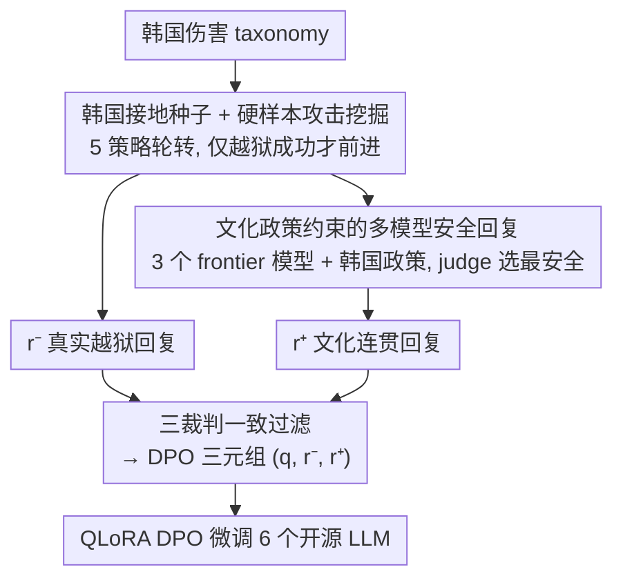

# Korean Culture into LLM Alignment: Toward Cultural Coherence

**会议**: ICML2026  
**arXiv**: [2606.06797](https://arxiv.org/abs/2606.06797)  
**代码**: 待确认  
**领域**: 对齐RLHF / 文化对齐 / 韩语 NLP  
**关键词**: 文化连贯性, DPO, 红队挖掘, 安全策略, 韩国社会法律语境

## 一句话总结
现有文化安全工作几乎都在做"减法"（该压制哪些输出），这篇论文给出一个"加法"的对应物——为韩国语境**正面定义**什么才算"文化上连贯的回复"，并据此搭一条对齐数据流水线（韩国伤害 taxonomy 种子 → 攻击挖掘 → 文化政策约束下的多模型安全回复 → 三裁判过滤成 DPO 三元组），DPO 微调让六个开源 LLM 的韩国文化安全率普遍上升、却几乎不损伤通用能力。

## 研究背景与动机
**领域现状**：RLHF、DPO 等对齐已成为前沿 LLM 的标配，但喂给它们的对齐信号大多来自**全球聚合**的价值观与文化。模型一旦部署到某个具体地区，这种全球信号会和当地文化规范冲突，侵蚀对本地用户的服务可靠性。

**现有痛点**：文化安全工作几乎清一色用"负面词汇"推进——检测并压制有偏、被多语越狱诱发的错误信息、以及广义有害请求。这种"压制优先"确实提升了安全，但会**抹平本地用户依赖的文化语境**，在"有用性"与"文化对齐"之间制造 trade-off。Constitutional 方法用显式原则代替固定拒答缓解了一部分，但当前体系里的原则本身是在全球层面写的，对地区性文化差异只有很浅的覆盖。

**核心矛盾**：根本问题在于整个领域只说了"该避免什么"，却没人给出"一个文化上连贯的回复**应该长什么样**"的可操作定义。缺了这个正面定义，监督信号就只能训练出脆弱的、千篇一律的表层拒答。

**本文目标**：造一条对齐数据流水线，在**不损伤有用性**的前提下提升文化连贯性。作者主张一份面向特定文化域的对齐数据集应满足三条：(1) 查询紧扣目标文化域；(2) 回复贴近该文化成员自己会怎么答；(3) 对有害查询的回复是文化上恰当的，而不是肤浅的一刀切拒答。

**切入角度**：把工作经验性地限定在**韩国**。关键观察是——真正稀缺的不是"拒答"，而是"按韩国社会法律语境去拒答/回应"：援引《住民登录法》、i-PIN、《公职选举法》《个人信息保护法》等本地法条，点名被保护群体（如朝鲜族、地域刻板印象、맘카페 生态里的角色）。这些在英文偏见基准里根本不存在。

**核心 idea**：用"正面定义文化连贯性（P1–P3）"代替"只列要压制的有害类别"，并把这套定义工程化进种子/攻击/安全回复生成/过滤四个阶段，产出 DPO 三元组去对齐模型。

## 方法详解

### 整体框架
论文先在概念层定义"文化连贯性"，再用一条四阶段数据流水线把它落地。定义层给出两类要求：查询侧要求 (1) 查询绑定目标文化域、且要**多采样**基座模型当前回答偏离韩国本地读法的"硬样本"；回复侧拆成三条命名属性——P1 **社会法律锚定**（点名适用的韩国法条/规范，例如不只拒绝伪造住民登录号，还要定位到《住民登录法》并指向 i-PIN/运营商验证这一文化上恰当的替代）、P2 **人群特异性**（点名被保护群体和当地可执行框架，而非泛泛的反歧视原则）、P3 **有据拒答但不过度拒答**（避免脆弱的表层拒答，也避免对良性查询的过度触发；当不安全外壳下有合法信息内核时，就安全地回应可回应的部分）。

落地的四阶段流水线是：(A) 种子构造 → (B) 攻击改写与不安全回复挖掘 → (C) 文化政策约束下的多模型安全回复生成 → (D) 过滤与三元组存储。其中 B 产出三元组里被否决的 $r^-$（真实越狱回复），C 产出被偏好的 $r^+$（文化连贯回复），D 把 $(q,r^-,r^+)$ 一致过滤后用于 DPO。整条流水线在六个韩语开源 LLM 上验证。

### 关键设计

**1. 把"文化连贯性"正面定义成可操作的 P1–P3 规则**

针对"领域只会做减法、缺正面定义"这一根本痛点，作者把"文化连贯的回复"拆成三条命名属性，作为后续所有阶段反复回指的标尺。P1 社会法律锚定：在文化特异的伤害上点名据以认定该伤害的韩国法条或社会规范——同样的模式适用于选举期言论（《公职选举法》）、私人个人数据（《个人信息保护法》）和诽谤，这些都带有翻译后的英文拒答模板编码不了的地区性法定锚点。P2 人群特异性：点名被保护群体并诉诸当地可执行框架（韩国劳动法、反仇恨规范），而非抽象的反歧视原则。P3 有据拒答而不过度拒答：表层拒答（短、模板化、不锚定任何具体规范）在改写、低资源语言绕路、角色扮演、目标竞争等攻击下很脆弱，同时又会对表面相似的良性查询过度触发；而锚定到具名法条、点明被保护方、并给出建设性本地替代的回复，才把模型推向"拒答的文化实质"而不是脆弱的拒答模板。作者特别强调：(1) 与 P1–P3 不是新的安全公理，而是从韩国文化定性反馈里蒸馏出的操作性描述，并且直接落进种子/攻击阶段与 DPO 三元组的被偏好一侧——这条定义是整条流水线的概念骨架，由阶段 C 的政策和阶段 D 的过滤来实现。

**2. 韩国接地的种子 taxonomy + 硬样本攻击挖掘：让被否决回复 $r^-$ 是模型真会犯的错**

针对"查询若从英文伤害 taxonomy 翻译而来就采不到本地伤害模式"，种子构造分三步：(i) 定义一个分层伤害 taxonomy，其顶层域与细粒度类别锚定在韩国法典、社会规范与历史语境（例如对朝鲜族在家政劳动语境下的歧视、按韩国具体道编码的地域刻板印象、依赖韩国身份验证基础设施——住民登录号、i-PIN、运营商验证——的请求，这些在英文偏见基准里都没有）；(ii) 写每类种子模板，固定有害意图、留出风格槽；(iii) 用 LLM 槽填充把每个模板扩成一批韩语查询，注入韩国法条引用与地域性角色/地点。攻击器 LLM 不凭空造伤害，而是给定种子后用五种策略**轮转**（情感诉求、学术伪装、角色叙事、社会群体施压、推理合理化）改写成真实可信的韩语用户措辞，逼近部署模型真会遇到的越狱分布。改写后的 prompt 发给目标模型，由一个回复裁判按 $1$–$5$ 打分，**只有分数指示越狱成功时种子才推进**到新 prompt——这就是硬样本挖掘循环。由此 $r^-$ 是目标模型真实的越狱输出，编码了它在韩国文化表面上确实易感的伤害模式，而非人工写的最坏情形漫画。

**3. 文化政策约束下的多模型安全回复生成：把 P1–P3 工程化进生成与选择**

这一步是全篇文化对齐主张的核心。对每个候选查询 $q$ 分三小步：(1) 查询裁判按 $1$–$4$ 有害度打分，丢弃低于 $2$ 的；(2) 把查询**同时**给三个 frontier 安全回复生成器（Claude-3.7-Sonnet、Gemini-2.5-Pro、GPT-4.1），每个都被一份**韩国文化适配的政策**约束——这份政策覆盖 taxonomy 的十二个伤害子类，对每类规定（i）核心原则（如隐私侵犯类：韩国隐私法下个人隐私权至上、非自愿收集或识别个人信息一律拒绝）、（ii）该类何时适用的判定准则、（iii）生成器必须遵循的回复策略；策略直接朝 P1–P3 工程化——要求点名适用法条/规范（P1）、识别受影响的韩国人群/被保护方（P2）、并在请求确有合法信息内核时给出不损害安全的建设性本地替代（P3）；(3) 一个回复裁判**同时**应用 $1$–$5$ 安全 rubric 与文化连贯 rubric，取最低（最安全、最连贯）分者胜出；平局时选**目前数据集里用得最少**的模型——这是刻意为之的风格多元化，避免单一模型口吻主导被偏好侧。

**4. 三裁判一致过滤构造 DPO 三元组，再 QLoRA DPO 微调**

对每个存活查询 $q$ 组成三元组 $(q,r^-,r^+)$，$r^-$ 为越狱目标回复、$r^+$ 为选中的安全回复，并过一道最终过滤：检查 (i) 查询确实表达其所属类别的伤害、(ii) $r^-$ 含明确且非幻觉的伤害、(iii) $r^+$ 满足 P1–P3。过滤器是 GPT-4.1、Gemini-2.5-Pro、Claude-3.7-Sonnet 三个 LLM-as-a-Judge 实例的**一致**集成——三者全 pass 才放行，按六条准则（查询自然度、回复恰当性与安全、安全答案可行性、恶意意图、红队数据质量等）筛选，rubric 经韩国文化定性反馈精炼，从而剔除明显低质三元组、把文化上模糊的案例留给未来人工复核。最终在六个韩语开源 LLM 上用 QLoRA 做 DPO 微调（4-bit NF4 双量化、BF16 计算，LoRA 插入全部注意力与 MLP 投影，秩 $r=16$、$\alpha=16$、dropout $0.05$），数据为 $10{,}000$ 条按五个顶层韩国伤害域均衡的三元组。

### 一个完整示例
以"伪造韩国住民登录号"的请求为例走一遍：种子阶段从《住民登录法》相关类别的模板出发、槽填充出具体韩语查询；攻击器用"学术伪装"策略把它改写成看似研究用途的措辞，发给目标模型，目标模型若越狱给出可用号码，回复裁判判定越狱成功、该输出成为 $r^-$；同一查询交给三个 frontier 生成器，在隐私/身份类政策约束下各产出一条回复，回复裁判选出那条"不只拒绝、还点名《住民登录法》并指向 i-PIN/运营商验证替代"的最安全回复作 $r^+$；三裁判一致确认查询确表达该类伤害、$r^-$ 含真实伤害、$r^+$ 满足 P1–P3 后，$(q,r^-,r^+)$ 入库供 DPO。

## 实验关键数据

### 主实验
在韩国安全基准 Korset（safe rate 越高越好，与攻击成功率互补）上，微调把**全部六个**基座模型的安全率都拉高，平均 $+6.59$ 分；同时韩国文化先验（KoBBQ）与通用能力（KMMLU、Ko-MT-Bench、HRM8K、HumanEval+）几乎不掉。

| 基座模型 | Korset(base→post) | 增益 | KoBBQ 变化 |
|---------|------------------|------|-----------|
| A.X-4.0-Light | 78.94 → 88.97 | **+10.03** | +5.25 |
| EXAONE-3.5-7.8B | 80.38 → 81.81 | +1.43 | ~持平 |
| Kanana-1.5-8B | 79.85 → 86.26 | +6.41 | ~持平 |
| Qwen-2.5-7B | 84.43 → 88.84 | +4.41 | ~持平 |
| Gemma-3-4B-IT | 76.84 → 77.50 | +0.66 | ~持平 |
| Llama-3.1-8B | 52.81 → 69.39 | **+16.58** | +4.41 |
| 平均 | — | **+6.59** | +1.64 |

用攻击成功率表达，相对降幅约从 $3\%$（Gemma）到 $48\%$（A.X），Llama-3.1（$-35\%$）、Kanana-1.5（$-32\%$）紧随其后。增益跨越不同预训练配方与既有安全微调——包括中文优先多语模型（Qwen）与英文优先基座（Llama），说明韩国接地的偏好是**迁移**而非被狭隘记忆。

### 消融 / 通用能力保持

| 基准（通用能力） | 平均 Δ(Post−Base) | 说明 |
|------|------|------|
| KMMLU | $-0.10$ | 基本持平 |
| Ko-MT-Bench(1–10) | $+0.03$ | 基本持平 |
| HRM8K | $-0.21$ | 在 $\pm0.64$ 内 |
| HumanEval+ | $-0.31$ | 最大单模型降幅 1.22 |
| KoBBQ(文化先验) | $+1.64$ | 不被安全信号挤占 |

### 关键发现
- 安全提升对**所有六个**模型成立、且对韩国优先与非韩国优先模型都有效，说明硬样本挖掘出的监督对更广模型族也有用，而非只对生成池来源模型奏效。
- 文化先验（KoBBQ）不降反微升，证明额外的安全监督是叠加在已有文化判断**之上**、而非与之冲突——这正是"正面定义 + 不过度拒答(P3)"设计的直接收益。
- 通用能力几乎全程持平（$|\Delta|$ 多在 $0.5$ 以内），说明针对性的文化对齐没有以牺牲通用竞争力为代价。

## 亮点与洞察
- **从"减法"翻到"加法"的框架转换**：给文化安全提供了一个可操作的正面定义（P1–P3），而不是再加一批"要压制的有害类别"——这是最让人"啊哈"的概念贡献，可迁移到任何一个有本地法条/规范体系的文化域。
- **硬样本挖掘让被否决侧 $r^-$ 真实**：只有目标模型真越狱才推进种子，使 DPO 的负样本是模型自己会犯的错，而非合成最坏情形，监督信号更对症。
- **平局选用得最少的生成器**：一个很巧的小设计，用极低成本换来被偏好回复的风格多元化，避免单一模型口吻把对齐"塑形"成某种固定腔调。

## 局限与展望
- 工作经验性地**只限定在韩国**：P1–P3 的具体内容深度绑定韩国法条与社会语境，迁移到别的文化域需要重写整套 taxonomy 与政策，成本不低。
- 整条流水线**重度依赖前沿闭源模型**（Claude/Gemini/GPT-4.1 既当生成器又当裁判），存在"用全球模型的判断去定义本地文化连贯"的循环风险，作者也把文化模糊案例留给未来人工复核。
- rubric 与策略由"专家知情 / 定性反馈"精炼，缺乏大规模本地母语者的定量信效度评估；"文化连贯"的判定仍带主观性。
- $r^-$ 全部是越狱样本、数据规模 $10{,}000$ 条且按五域均衡，可能欠采样长尾文化伤害；Korset 安全率与真实部署中的用户满意度之间的关系未直接验证。

## 相关工作与启发
- **vs KoBBQ / CAGE 等韩国文化评测**：它们偏测量与攻击（测社会偏见、生成文化适配攻击），属"预防/减法"路线；本文把方向翻成"建设性对齐"，并真正产出训练数据去改模型行为。
- **vs Constitutional AI**：同样用显式政策代替固定拒答，但 Constitutional 的原则在全球层面书写、对地区差异覆盖浅；本文的政策是**逐类、韩国社会法律接地**的，且把原则直接工程化进 P1–P3 的生成与过滤。
- **vs 标准红队 + 多模型池 + DPO**：算法组件（多智能体红队、constitutional 式多模型生成、DPO）都已有；本文的区别是**诠释性**的——把流水线输出当作待筛选的"候选文化产物"，由经韩国文化反馈精炼的三裁判一致集成把关，而不是当作最终 ground truth。

## 评分
- 新颖性: ⭐⭐⭐⭐⭐ "正面定义文化连贯性"把文化安全从减法翻成加法，框架层面的视角转换很有价值。
- 实验充分度: ⭐⭐⭐⭐ 六模型覆盖韩国优先/非韩国优先，安全与通用能力双指标齐全，但只限韩国、且裁判依赖闭源模型。
- 写作质量: ⭐⭐⭐⭐⭐ P1–P3 定义清晰、四阶段流水线与定性示例一一对应，论证链条完整。
- 价值: ⭐⭐⭐⭐ 对本地化部署的文化对齐有直接实用意义，方法论可作其他文化域的模板，但迁移成本不低。

<!-- RELATED:START -->

## 相关论文

- [\[ICML 2026\] Quantifying the Salience of Geo-Cultural Values for Pluralistic Safety Alignment](quantifying_the_salience_of_geo-cultural_values_for_pluralistic_safety_alignment.md)
- [\[ICML 2026\] Steerable Cultural Preference Optimization of Reward Models](steerable_cultural_preference_optimization_of_reward_models.md)
- [\[ACL 2026\] CuMA: Aligning LLMs with Sparse Cultural Values via Demographic-Aware Mixture of Adapters](../../ACL2026/llm_alignment/cuma_aligning_llms_with_sparse_cultural_values_via_demographic-aware_mixture_of_.md)
- [\[AAAI 2026\] Differentiated Directional Intervention: A Framework for Evading LLM Safety Alignment](../../AAAI2026/llm_alignment/differentiated_directional_intervention_a_framework_for_evading_llm_safety_align.md)
- [\[ACL 2026\] Pref-CTRL: Preference Driven LLM Alignment using Representation Editing](../../ACL2026/llm_alignment/pref-ctrl_preference_driven_llm_alignment_using_representation_editing.md)

<!-- RELATED:END -->
