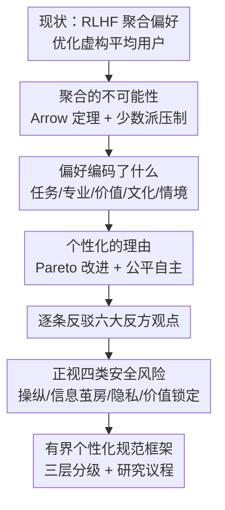

# Large Language Models Should Learn Personalized Rather Than Aggregated Human Preferences

**会议**: ICML 2026  
**arXiv**: [2606.07629](https://arxiv.org/abs/2606.07629)  
**代码**: 无（position paper）  
**领域**: 对齐RLHF / LLM个性化  
**关键词**: 偏好聚合, 个性化对齐, RLHF, 社会选择理论, 有界个性化

## 一句话总结
这是一篇立场论文，主张当前 RLHF 把多元人类偏好聚合成单一奖励信号、本质上是在优化一个"谁都不是"的平均用户，作者从社会选择理论与跨人群实证两路论证个性化对齐的必要性，并提出一套"保留普适安全约束、只在合法维度上做个性化"的有界个性化框架与研究议程。

## 研究背景与动机
**领域现状**：主流对齐范式（RLHF）把人类偏好比较数据（"对于 prompt P，输出 A 优于 B"）训练成一个奖励模型，再用它去微调 LLM，显著提升了有用性、无害性和诚实度。

**现有痛点**：这套范式默认"人类偏好可以被有意义地聚合成单一奖励信号"。但标注者之间分歧巨大，偏好随文化、任务、专业度、情境剧烈变化。把这些差异平均掉，等于在优化一个**可能根本不存在的"平均用户"**——作者称之为"偏好平庸"（preference mediocrity）：像给所有人设计同一个鞋码，号称服务所有人，实则谁都不合脚。

**核心矛盾**：聚合不是技术细节而是**价值选择**。作者借 Arrow 不可能定理作概念动机——没有任何聚合方法能在合并异质偏好时同时满足传递性、非独裁、Pareto 效率与无关选项独立性；虽然 Arrow 处理的是离散选项上的序数排序、与 RLHF 的连续奖励优化不完全对应，但核心洞见可迁移：**异质偏好的聚合不可能价值中立**。当 60% 标注者偏好直接回答、40% 偏好谨慎补充时，平均化会系统性压制少数派，对那些在多个维度（正式度、细节量、沟通风格）同时属于少数派的用户尤其不友好。

**切入角度**：作者把"标注者分歧"重新定义为**信号而非噪声**——分歧编码了真实的偏好多样性、个体价值和情境依赖，这些恰恰是聚合丢掉、而个性化系统必须恢复的东西。

**核心 idea**：从"为某个虚构的平均用户对齐"转向"为每个真实个体对齐"，并用有界个性化（bounded personalization）化解随之而来的安全风险——即把可个性化的行为（风格、语气、详略）与必须普适的行为（事实准确、安全、不伤害第三方）严格分层。

## 方法详解
作为立场论文，本文没有传统的模型/算法，其"方法"是一条完整的论证链：先拆穿聚合的理论与技术缺陷，再剖析偏好到底编码了什么，进而论证个性化的收益、逐条反驳反方观点、正视安全风险，最后落到一个可操作的规范框架。下面按论证骨架来梳理。

### 整体框架
全文的论证沿"问题诊断 → 结构分析 → 正面主张 → 防守反驳 → 风险正视 → 落地规范"六步推进，每一步都为下一步铺垫：只有先说清聚合错在哪、偏好里到底有什么，个性化的必要性才立得住；只有先把反方和安全风险讲透，"有界个性化"这个结论才不是空喊口号。

### 关键设计
作者的论证有四根支柱，分别对应"为什么聚合错了""偏好里有什么""为什么个性化对""怎样个性化才安全"。

**1. 聚合的不可能性：把标注分歧当噪声是系统性失误**

针对"偏好可被有意义聚合"这一隐含假设，作者从理论和实证两面拆解。理论上借 Arrow 不可能定理论证异质偏好的聚合无法价值中立；实证上，现有偏好数据集严重偏向英语、西方、受教育人群——LLM 观点与自由派、受教育、西方人群的相关性最高比其他群体高出约 $0.3$ 个点，全球南方视角的对齐分数系统性偏低，问到"婚礼长什么样"这类文化可变问题时模型默认西方惯例。更糟的是聚合在技术上放大了奖励模型的不确定性：它被迫对相互矛盾的信号取平均，无法区分"所有人都同意"和"偏好五五开"两种情形，由此产生的虚假相关成了**奖励黑客（reward hacking）**的可乘之机——模型学会在奖励模型上刷高分却不真正满足用户。这一根支柱把"聚合"从中性的工程手段重新定性为有系统性代价的价值选择。

**2. 偏好的多维结构：聚合到底丢掉了什么**

针对"既然要个性化，那要恢复的究竟是什么"这一问，作者系统拆解偏好编码的五类因素：任务类型（摘要重简洁、创作重文采、事实重准确）、用户专业度（专家要术语深度、新手要可达性）、个体价值与信念（对不确定性的态度、风险容忍度、道德框架——这些无法靠平均调和而不强加某套价值观）、文化语言语境、以及情境因素（紧迫度、压力、目标会让同一用户在不同时刻需要不同回答）。在"如何发现这些隐结构"上，作者把多种技术串成一条路线：用隐用户类型建模（latent user types）识别偏好簇、用多维奖励表示捕捉细粒度权衡、用因果推断找出驱动偏好的因素、用可解释奖励模型支持调试、用主动偏好引出（active elicitation）以最少查询定位用户在偏好空间的位置。这根支柱的价值在于：它把"个性化"从模糊口号变成了"恢复哪些可量化维度"的工程问题。

**3. 个性化是 Pareto 改进而非零和取舍**

针对"个性化是不是以牺牲多数派为代价"的疑虑，作者论证它是一个真正的 Pareto 改进：少数派偏好用户获得显著更好的服务，而偏好对齐多数派的用户体验并不退化——因为一个能按专业度调整深度、按偏好调整正式度的模型，本就比被迫在每个维度上选定固定立场的模型服务得更好。实证上，个性化模型在 LaMP 基准上相比非个性化基线在多样任务上提升 $15\%\text{–}30\%$。技术路径分四类并存：学用户专属表示（user embeddings / LoRA / prompt tuning / meta-learning）、架构方案（MoE 路由、把奖励分解为用户专属与普适两部分）、纯上下文方案（把偏好信息直接放进长上下文，零参数改动）。作者强调 prompt-based 与 training-based 互补而非竞争——上下文方案应对即时语境、训练方案沉淀稳定长期偏好，混合方案往往最优。

**4. 有界个性化：用三层分级把安全约束钉死在普适层**

针对"个性化更危险"的核心反对，作者既不回避也不让步：操纵与说服（系统掌握用户弱点后能定向投放最有说服力的内容、甚至做"偏好洗白"逐步把用户偏好推向商业/政治目标）、信息茧房与极化、隐私与监控（从看似无害的偏好模式可推断政治、健康、性取向等敏感属性）、价值锁定与自主性丧失（太完美满足当前偏好会消除促使偏好演化的摩擦）——这四类风险被正面列出。解法不是放弃个性化，而是**有界个性化**：用一张规范表把行为分三层——

| 类别 | 例子 | 指导原则 |
|------|------|----------|
| 明确适合个性化 | 风格、语气、详略、格式、专业度校准、语域 | 主要产生内部效应的行为，尊重用户自主、不伤害他人 |
| 需要保障措施 | 价值负载话题、敏感内容、脆弱人群、高情绪语境 | 有强化有害模式的风险，需透明、用户可控、可申辩 |
| 必须保持普适 | 事实准确、安全关键信息、伤害第三方的内容、虚假信息 | 有外部效应的行为，无论用户偏好如何都不可个性化 |

这根支柱是全文的落脚点：个性化与共同标准并非二选一，关键是设计正确的边界而非全盘否定。作者还强调要内建透明、用户控制（可查看/纠正/删除学到的偏好）、可申辩，并在个性化系统里以多目标优化保留"暴露多元观点"的认知多样性约束（很多用户本身就有"不愿被困在信息茧房里"的元偏好）。

## 实验关键数据
作为立场论文，本文不做新实验，而是汇集既有证据支撑论证。以下整理论证中引用的关键量化证据与六大反方观点的应对。

### 关键证据

| 证据 | 数值 / 结论 | 出处与含义 |
|------|------------|-----------|
| LLM 观点的人群偏置 | 与西方/自由派/受教育人群相关性高约 $0.3$ 点 | 聚合系统性偏向主流人群，边缘化其他群体 |
| 个性化收益 | LaMP 基准提升 $15\%\text{–}30\%$ | 个体适配带来聚合训练无法实现的实质增益 |
| 偏好标注规模上限 | 即便资源充足项目也只收集数十万条 | 相对数十亿用户的偏好变异是杯水车薪 |
| 聚合的认知风险 | 长期使用后中立化文章增加近 $70\%$ | 聚合训练抑制观点多样性，并非保留多样性 |

### 六大反方观点与应对

| 反方观点 | 核心反对 | 作者应对 |
|----------|----------|----------|
| "够用就行" | 现有 RLHF 已服务数亿用户，个性化增益不值复杂度 | 满意掩盖巨大变异；少数派被系统性亏待 |
| 可扩展性/数据挑战 | 逐用户模型算力不可行、个性化数据集难构建 | 参数高效法（LoRA/MoE）+ 少样本/调查基础设施使其可行（S-LoRA 单卡服务上千 adapter） |
| 共同标准论 | 个性化会碎片化、损害问责与公平 | 假二分法；有界个性化保留普适安全约束 |
| 操纵担忧 | 个性化天然更危险、便于操纵 | 聚合本身也是同质化操纵；问题是如何负责任地个性化 |
| 偏好不稳定 | 偏好太不稳定，难做可靠训练信号 | 不稳定恰恰要求更精细建模而非更少个性化 |
| 性能优先 | 应先提升原始能力再谈个性化 | 二者非竞争；很多场景下"个性化即性能" |

### 关键发现
- 作者把"标注者分歧"从噪声重新定性为信号，是全文最核心的视角转换——一旦接受这点，聚合的合理性就被釜底抽薪。
- 安全风险被分成"操纵/信息茧房/隐私/价值锁定"四类正面处理，且指出纯聚合与无约束个性化**都不安全**（聚合会同质化观点、个性化会强化茧房），唯一出路是带显式多样性约束的有界个性化。
- 三层规范表（适合/需保障/必须普适）是把抽象主张落地的关键，给出了"什么能个性化、什么绝不能"的可操作边界。

## 亮点与洞察
- **把分歧当信号**：这是最有迁移价值的视角——任何依赖人类标注的任务（不只是对齐），标注者分歧都可能编码真实的多元结构而非简单错误，值得用隐类型/多维奖励去建模而非平均掉。
- **"个性化即性能"**：作者反驳"先提能力再谈个性化"时一针见血——对许多部署场景，不能适配用户专业度和沟通风格的模型，无论 benchmark 多高都对该用户是失败的，把个性化从"锦上添花"提升为"性能本身"。
- **有界个性化的三层分级**：用"内部效应 vs 外部效应"区分可否个性化，是一个干净、可操作、可迁移到其他价值对齐场景的判据，避免了"全个性化"与"全统一"的虚假对立。

## 局限与展望
- **缺乏新实证**：作为立场论文，所有量化证据都来自他人工作，没有作者自己设计的对照实验直接验证"有界个性化"框架的可行性与安全性，结论的说服力依赖被引文献的可靠性。
- **边界设计被一笔带过**：三层分级里"需要保障措施"一层最棘手（价值负载话题、脆弱人群），但具体怎么划线、由谁划、如何处理跨文化的"普适安全约束"分歧，论文只给原则未给机制。
- **安全风险与收益的量化权衡缺失**：操纵、价值锁定等风险被定性讨论，但缺乏"个性化收益是否大于其引入的茧房/操纵风险"的量化框架，实际落地时难以决策。
- **改进方向**：可沿"主动偏好引出 + 不确定性感知适配"做对照实验，验证在保持普适安全约束下，有界个性化能否在 LaMP 之外的高风险域（医疗、法律）同时改善服务与避免茧房。

## 相关工作与启发
- **vs 标准 RLHF（Ouyang 2022 / Bai 2022）**：它们把偏好聚合成单一奖励模型，本文论证这在理论上不可能价值中立、在实证上系统性亏待少数派，主张转向用户专属奖励/表示。
- **vs Pluralistic Alignment（Sorensen 2024）**：同样关注价值多元，但本文更进一步把"个性化"与"普适安全约束"通过三层分级显式分层，强调有界而非无约束的多元。
- **vs 参数高效个性化（LoRA / S-LoRA / Punica）**：这些是本文论证"可扩展性反对站不住"时援引的工程基础——证明逐用户适配在算力上已可行，本文把它们组织进个性化的技术路线图。

## 评分
- 新颖性: ⭐⭐⭐⭐ 视角转换（分歧即信号、有界个性化）有力，但个性化本身已是活跃方向，主要贡献是系统化整合与规范框架
- 实验充分度: ⭐⭐⭐ 立场论文，无原创实验，证据全部转引自既有工作
- 写作质量: ⭐⭐⭐⭐⭐ 论证结构清晰、反方应对完整、规范表落地性强，是一篇组织得很好的 position paper
- 价值: ⭐⭐⭐⭐ 为对齐研究提出了"aligned for whom"的根本性追问和可操作的有界个性化框架，议题重要

<!-- RELATED:START -->

## 相关论文

- [\[ACL 2026\] BACH-V: Bridging Abstract and Concrete Human-Values in Large Language Models](../../ACL2026/llm_alignment/bach-v_bridging_abstract_and_concrete_human-values_in_large_language_models.md)
- [\[ACL 2026\] Why Supervised Fine-Tuning Fails to Learn: A Systematic Study of Incomplete Learning in Large Language Models](../../ACL2026/llm_alignment/why_supervised_fine-tuning_fails_to_learn_a_systematic_study_of_incomplete_learn.md)
- [\[ICML 2026\] Towards Context-Invariant Safety Alignment for Large Language Models](towards_context-invariant_safety_alignment_for_large_language_models.md)
- [\[ICML 2026\] VALUEFLOW: Toward Pluralistic and Steerable Value-based Alignment in Large Language Models](valueflow_toward_pluralistic_and_steerable_value-based_alignment_in_large_langua.md)
- [\[AAAI 2026\] When Human Preferences Flip: An Instance-Dependent Robust Loss for RLHF](../../AAAI2026/llm_alignment/when_human_preferences_flip_an_instance-dependent_robust_loss_for_rlhf.md)

<!-- RELATED:END -->
