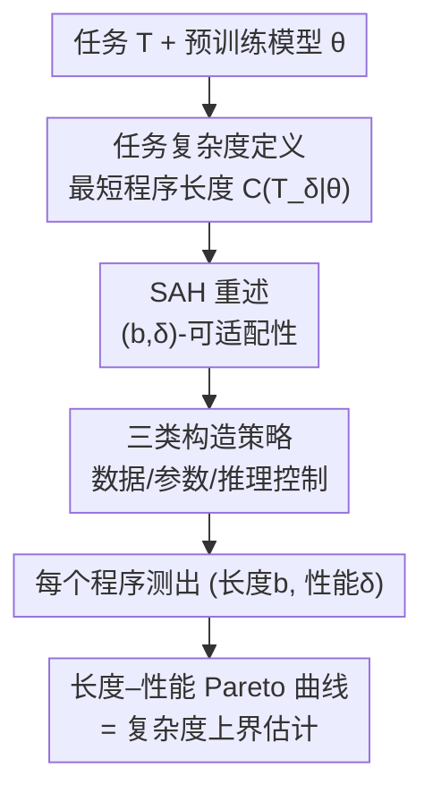

# Operationalising the Superficial Alignment Hypothesis via Task Complexity

**会议**: ICML 2026  
**arXiv**: [2602.15829](https://arxiv.org/abs/2602.15829)  
**代码**: 待确认  
**领域**: 对齐RLHF / LLM适配 / 算法信息论  
**关键词**: 表面对齐假设, 任务复杂度, 算法信息论, 后训练, 数据/参数/推理高效适配

## 一句话总结
作者用"解决某任务到目标性能所需的最短程序长度"这一算法信息论指标（task complexity）重新定义了表面对齐假设（SAH），把"数据高效/参数高效/推理控制"这三种看似各说各话的证据统一成"在同一条长度–性能 Pareto 曲线上找短程序"的不同策略，并实测发现：把预训练模型适配到数学推理、机器翻译、指令跟随等任务上，常常只需要几千字节到几兆字节的信息，而后训练的作用是把"够到强性能所需的程序长度"压缩好几个数量级。

## 研究背景与动机
**领域现状**：表面对齐假设（Superficial Alignment Hypothesis, SAH）由 Zhou et al. (2023, LIMA) 提出，主张大模型的"知识与能力"几乎全在预训练阶段学到，后训练（对齐/微调）只是教模型"在和用户交互时该用哪种格式子分布"。支持它的证据来自三个看似无关的角度：① 用极少数据（如 1000 条）就能微调出强指令模型；② 只更新极少参数（如 LoRA <1%）就能适配；③ 完全冻结权重、只靠精心设计的提示（如 URIAL）也能让模型完成任务。

**现有痛点**：SAH 对"知识""能力""格式子分布"这些核心词从来没有精确定义，导致两个麻烦。其一，上面三类证据彼此正交——一个谈数据量、一个谈参数量、一个谈推理控制，无法判断它们是不是在说同一件事。其二，批评者（Raghavendra et al. 2024；Lambert 2025）借这种含糊反推："如果模型真的'已经会'某任务，那少量微调就该让性能迅速饱和"，而实测发现很多任务需要大量微调才饱和，于是断言 SAH 不成立。

**核心矛盾**：争论双方其实在用各自隐含的、互不兼容的"适配成本"度量在比，缺一个能把数据、参数、提示三类适配方式放进同一把尺子里量化的统一框架。

**本文目标**：给 SAH 一个植根于算法信息论的精确"可操作化"定义，使得（i）三类证据能在同一坐标系下直接比较，（ii）批评意见能被定量地重新检视。

**切入角度**：把"适配一个任务"看成"写一个能解决该任务的程序"。一个自包含程序要从零解 GSM8K 必然很长（要懂语言、会规划、能算），但如果允许这个程序调用一个预训练模型的权重，长度可能骤减——这个"骤减量"恰好量化了模型里已经含有多少关于该任务的信息。

**核心 idea**：定义任务复杂度 = 达到目标性能 $\delta$ 的最短程序长度；SAH 被重述为"许多本来高复杂度的任务，一旦条件于预训练模型权重 $\theta$，复杂度就大幅下降"。数据/参数/推理三种视角不过是"找这条短程序"的三种构造策略。

## 方法详解

### 整体框架
论文不是提一个新模型，而是提一套**度量与估计框架**：先用算法信息论给"任务""任务复杂度""模型含信息量""可适配性"下严格定义，再把 SAH 翻译成关于这些量的一个命题；由于真正的最短程序不可计算，作者转而用三类实际适配策略各构造一个真实可运行的程序，用它们的（长度 $b$、性能 $\delta$）点描出一条 Pareto 曲线，作为任务复杂度的**上界估计**。

形式化的链条是：把任务定义为四元组 $\mathtt{T}=(\mathcal{X},\mathcal{Y},p,\mathcal{S})$（输入空间、输出空间、输入分布、打分函数）；程序 $\mathsf{P}$ 在任务上的得分是期望性能 $\mathtt{score}_{\mathtt{T}}(\mathsf{P})=\mathbb{E}_{x\sim p}[\mathcal{S}(x,\mathsf{P}(x))]$。任务在性能 $\delta$ 下的复杂度就是所有达标程序里最短的那个的长度：

$$\mathrm{C}(\mathtt{T}_\delta)\;\overset{\text{def}}{=}\;\min_{\mathsf{P}}\{\,\text{len}(\mathsf{P}):\mathtt{score}_{\mathtt{T}}(\mathsf{P})\ge\delta\,\}$$

再把"程序可调用模型权重 $\theta$"作为额外输入，得到条件复杂度 $\mathrm{C}(\mathtt{T}_\delta\mid\theta)$；两者之差 $\mathrm{I}(\mathtt{T}_\delta;\theta)=\mathrm{C}(\mathtt{T}_\delta)-\mathrm{C}(\mathtt{T}_\delta\mid\theta)$ 就是"模型 $\theta$ 关于任务 $\mathtt{T}$ 在性能 $\delta$ 下携带的信息量"。整套估计流程如下：

### 关键设计

**1. 任务复杂度：把"适配成本"统一成最短程序长度**

SAH 争论的根子是没有统一的"适配成本"度量。作者借 Kolmogorov 复杂度的思路，把成本定义为"达到目标性能的最短程序的比特长度"。但纯 Kolmogorov 复杂度不适合机器学习：它针对单个有限字符串、且只认 100% 精确复现，而 ML 任务是一个输入分布、又只要近似达标（90% 和 99% 的成本可能天差地别）。所以作者引入两点改造——用打分函数 $\mathcal{S}$ 在整个输入空间 $\mathcal{X}$ 上定义"近似达标"（借鉴算法率失真理论），并显式带上目标性能 $\delta$。这样 $\mathrm{C}(\mathtt{T}_\delta\mid\theta)$ 就同时刻画了"信息量"和"性能档位"，而且（在 Turing 完备的机器选择下）该复杂度对具体机器只差一个加性常数，是个良定义的量。这个设计的价值在于：数据、参数、提示三种适配方式产出的"程序"，其长度可以放在同一根比特轴上直接比大小。

**2. (b,δ)-可适配性：把 SAH 从含糊主张变成可证伪命题**

光有任务复杂度还不够，SAH 谈的是"模型有多容易被适配到新任务"。作者据此定义：若存在长度小于 $b$ 的程序能让模型 $\theta$ 解决 $\mathtt{T}_\delta$，则称 $\theta$ 对任务 $\mathtt{T}$ 是 $(b,\delta)$-可适配的，即 $\mathrm{C}(\mathtt{T}_\delta\mid\theta)\le b$。于是 SAH 被精确重述为：对许多本身高复杂度（$\mathrm{C}(\mathtt{T}_\delta)$ 很大）、有实用价值的任务，预训练模型 $\theta$ 都是"小 $b$、高 $\delta$"可适配的。作者诚实地指出框架里唯一留白的地方——多小的 $b$、多高的 $\delta$ 才算"表面"，没有原则性的单一阈值，所以他们干脆不挑一个点，而是研究整条 $b$–$\delta$ 权衡曲线。这一步把"模型已经会"这种口号，变成了"在某个长度预算下能否够到某性能"的可测命题。

**3. 三类构造策略：把数据/参数/推理三种视角变成同一条曲线上的程序**

由于条件复杂度不可计算，作者只能用真实策略构造程序来给它**上界**。关键在于：把 Section 2 里三种 SAH 视角各自落成一种"短程序构造法"，并把机器 $\mathrm{M}$ 定义成 Python 解释器（numpy/transformers 等库算作系统机器、不计入程序长度），这样程序长度主要由其内嵌的数据或参数比特数决定。三条策略分别是——
- **数据视角（Subset Training）**：取数据子集，用模型 $\theta$ 经算术编码把这批数据压进程序里，程序运行时再解压、做梯度更新、推理；长度主要是压缩后数据 $\text{len}(\mathcal{D}'_c)$。
- **参数视角（LoRA / Bayesian-LoRA）**：训练一个适配器并把适配器权重直接写进程序；长度主要是适配器参数比特数，Bayesian-LoRA 还会优化每层的秩和量化精度以更省比特。
- **推理控制视角（ICL / URIAL）**：把极少样本（URIAL 再加一段任务说明）拼成提示、压缩后写进程序，运行时解压塞进上下文、冻结权重推理；长度主要是压缩提示 $\text{len}(\kappa_c)$。

每种策略做超参扫描得到一堆 $(b,\delta)$ 点，取不被任何其它点支配的点连成 Pareto 前沿。这个设计最巧的地方是：原本被当成"竞争性解释"的三种视角，在此被重新理解为"在长度–性能曲线不同区段上各自最优的互补技术"。

### 损失函数 / 训练策略
本文没有统一训练目标——每条构造策略沿用各自既有的训练方式（Subset Training 用标准微调、LoRA/Bayesian-LoRA 用低秩适配训练、ICL/URIAL 无需训练）。关键约定是程序长度的度量：只计入最终程序 $\mathsf{P}$ 内嵌的脚本 + 数据/参数比特，不计入"生成这个程序的训练过程"的开销，也不计入 Python 标准库。复杂度估计取 Pareto 最优点，即同时在长度和性能上不被支配的 $(b,\delta)$ 组合。

## 实验关键数据

### 主实验
模型用 SmolLM3-3B、Olmo3-7B、Olmo3-32B（都开源、含权重/数据/代码），任务为数学推理（GSM8K，准确率）、英→法机器翻译（FLORES-200，BLEU）、指令跟随（IFEval，验证通过率）。核心发现是**极短程序即可大幅拉高性能**：

| 任务/模型 | 预训练基线 | 适配后 | 程序长度 |
|-----------|-----------|--------|----------|
| GSM8K / Olmo3-32B | 2.6%–29.6%（各模型） | 72.2% | 仅 4358 bits |
| GSM8K / Olmo3-32B（另一处） | — | 78.4% | ≈ 一张 ImageNet 图大小 |
| 英→法翻译 / Olmo3-7B | 22.63 BLEU | 34.43 BLEU | 仅 3992 bits |
| IFEval / 全部模型 | — | 最高性能 | 略超 $10^7$ bits（约 1.25 MB） |

对照预训练用掉的 TB 级数据，把模型适配到这些任务上只需 KB–MB 级信息——作者据此判定这是支持 SAH 的证据。

### Pareto 曲线分区与对旧论断的复检
三种视角各占曲线一段（消融性质的结构发现）：

| 程序长度区段 | 主导视角 | 代表方法 | 表现 |
|--------------|----------|----------|------|
| 最短 | 推理控制 | URIAL / ICL | 极小程序换温和提升 |
| 中等 | 数据 | Subset Training | 比提示更高，但需内嵌更多数据 |
| 最长 | 参数 | LoRA / Bayesian-LoRA | 直接编码参数，长度最大 |

复检批评论断：① 对 Raghavendra et al.（"少样本微调不饱和"），作者指出 SAH 定义里本就带 $\delta$——能用一张 ImageNet 图大小的程序把 Olmo3-32B 推到 78.4%，但更大的程序也难再显著提升，说明"饱和"需要的信息量本就高，这与 SAH 不矛盾。② 对 Liu et al.（"微调更新可压到约 1 bit/参数"），作者反指其其实**高估**了微调加入的信息——SmolLM3 整个 GSM8K 数据集才 $3\times10^7$ bits，而 1 bit/参数 × $3\times10^9$ 参数远大于此，故这类程序既不够短也不够好，落不到 Pareto 前沿。③ 对 Chen et al.（"只调输出层线性投影不足以解 GSM8K，故非表面"），作者在 Figure 4 中显示其方法在长度–性能上远离 Pareto 曲线，即"只调线性层"并非找短程序的好策略，没理由把"表面性"限定为线性可编码的知识。

### 关键发现
- **预训练让强性能"可达"，但够到它要很长程序**：Olmo3-7B 在 GSM8K 上从随机初始化的 1.1% 升到预训练的 67.6%、IFEval 从 26.6% 升到 68.5%；但性能要到 $10^5$ bits 程序时仍远未饱和，SmolLM3 在 GSM8K 上要到约 $5\times10^{10}$ bits（≈6.2 GB）才平台化。
- **后训练把复杂度"塌缩"几个数量级**：预训练 Olmo3-7B 够到最高性能要 $5\times10^6$ bits（GSM8K）/ $2.5\times10^7$ bits（IFEval），而后训练模型在程序超过 $10^4$ bits 后长度几乎不再影响性能。这给"后训练只是把预训练学到的东西重新浮现出来"一个信息论解释：它大幅压低了"够到强性能"的复杂度。作者也诚实标注 GSM8K/IFEval 的训练数据进过这两个模型的后训练，可能部分解释该效应，故另用 FLORES、e-SNLI 解耦验证。

## 亮点与洞察
- **把一场口水仗变成可测量的曲线**：最"啊哈"的地方是用"最短程序长度"这一把尺子，让数据/参数/推理三种各执一词的证据落到同一坐标系，还能把批评者的论断逐条放回曲线上检验——这是把哲学式争论操作化的范例。
- **用模型本身做算术编码压缩数据/提示**：把"数据视角"和"推理视角"的程序长度统一成"用 $\theta$ 压缩后的比特数"，巧妙地让"模型已含的信息"自动从程序长度里被扣除，这个度量 trick 可迁移到任何"衡量某预训练资产对下游任务贡献多少信息"的场景。
- **后训练 = 复杂度塌缩**：把"对齐很表面"重新表述为"后训练不是加了多少新性能上限，而是把够到上限所需的程序长度压了好几个量级"，这个视角对理解 SFT/RLHF 的真正作用很有启发。

## 局限与展望
- **只是上界估计，且依赖具体构造策略**：任务复杂度不可计算，所有数字都是"我们能找到的最短程序"给出的上界；某视角表现差，可能只是没找到该视角下的好程序，而非该视角本质不行（作者对 Chen et al. 的反驳同样受此 caveat 约束）。
- **数据泄漏 caveat**：GSM8K/IFEval 进过模型后训练，后训练塌缩复杂度的效应有部分来自见过同分布数据；虽用 FLORES/e-SNLI 部分解耦，但"后训练 vs. 见过数据"的贡献仍未完全分离。
- **"多表面才算表面"仍留白**：框架不挑单一 $(b,\delta)$ 阈值，所以它能量化、对比"表面程度"，却回答不了"这个任务到底算不算被表面适配"这种绝对判断——这是定义上有意的留白，也是它无法直接终结争论的原因。
- **任务覆盖有限**：仅三类 NLP 任务 + 三个模型，跨更复杂/多步 agent 任务、跨更大模型时曲线形态是否一致仍待验证。

## 相关工作与启发
- **vs Kolmogorov 复杂度**：经典 Kolmogorov 复杂度针对单字符串、要求精确复现；本文改为输入分布上的近似达标 + 显式性能档位 $\delta$，更贴合 ML，并证明任务复杂度可视为它（及算法率失真复杂度）的推广。
- **vs MDL / 探针（Voita & Titov, Pimentel et al.）**：MDL 探针量化"给定模型表示后数据能被压多紧"，关注的是"易获取信息"；本文量化的是"整个适配程序"的长度，因此能跨数据驱动微调与推理时控制做统一比较。
- **vs LIMA（Zhou et al. 2023）/ 原始 SAH**：LIMA 用"1000 条就够"给出直觉证据；本文把这种直觉升级为带 $\delta$、可证伪、三视角统一的定量命题。
- **vs delta 压缩（Liu et al. 2024 等）**：delta 压缩同样受"微调加信息少"的直觉驱动并去压缩权重差；本文指出按程序长度衡量它们往往既不够短也不够好，落不到 Pareto 前沿。

## 评分
- 新颖性: ⭐⭐⭐⭐⭐ 用算法信息论把 SAH 操作化、把三视角统一进一条 Pareto 曲线，视角极新。
- 实验充分度: ⭐⭐⭐⭐ 三任务三模型 + 训练阶段复检足以支撑论点，但任务/模型覆盖仍偏窄、数字均为上界。
- 写作质量: ⭐⭐⭐⭐⭐ 定义层层递进、对旧论断逐条复检，逻辑清晰且诚实标注 caveat。
- 价值: ⭐⭐⭐⭐⭐ 给一场长期含糊的争论提供了可测量的统一框架，对理解预训练/后训练分工有持久参考价值。

<!-- RELATED:START -->

## 相关论文

- [\[ICLR 2026\] Superficial Safety Alignment Hypothesis](../../ICLR2026/llm_alignment/superficial_safety_alignment_hypothesis.md)
- [\[AAAI 2026\] Intrinsic Barriers and Practical Pathways for Human-AI Alignment: An Agreement-Based Complexity Analysis](../../AAAI2026/llm_alignment/intrinsic_barriers_and_practical_pathways_for_human-ai_alignment_an_agreement-ba.md)
- [\[ICML 2026\] Alignment-Aware Decoding](alignment-aware_decoding.md)
- [\[ICML 2026\] Curriculum Learning for Safety Alignment](curriculum_learning_for_safety_alignment.md)
- [\[ICML 2026\] Implicit Safety Alignment from Crowd Preferences](implicit_safety_alignment_from_crowd_preferences.md)

<!-- RELATED:END -->
