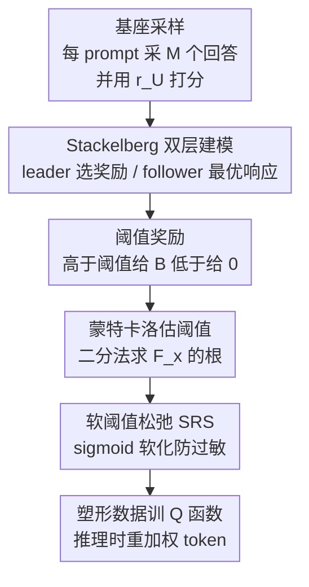

# Reward Shaping for (Inference-Time) Alignment: A Stackelberg Game Perspective

**会议**: ICML2026  
**arXiv**: [2602.02572](https://arxiv.org/abs/2602.02572)  
**代码**: https://github.com/Haichuan23/Stackelberg-Reward-Shaping  
**领域**: 对齐RLHF / 推理时对齐  
**关键词**: 推理时对齐, 奖励塑形, Stackelberg 博弈, 阈值奖励, KL 正则

## 一句话总结
把"该用什么奖励模型来对齐 LLM"建模成一个 Stackelberg 博弈，证明最优奖励是一个**逐 prompt 的阈值奖励**（高于阈值给满分 $B$、低于给 0），并用从基座模型采样的蒙特卡洛估计高效求出阈值，最后用 sigmoid 软化后无缝插进 CD/ARGS 等推理时对齐方法，在几乎零额外开销下把平均奖励和对 baseline 的 Win-Tie 率提到 66% 以上。

## 研究背景与动机

**领域现状**：主流对齐流程（无论 RLHF/DPO 这类训练时对齐，还是 Controlled Decoding、ARGS 这类推理时对齐）都是 reward-based 的——先从用户偏好数据学一个奖励模型 $r_U$，再让 LLM 在"最大化 $r_U$ 同时不偏离基座策略太远"的目标下优化。这个"不偏离"靠一项 KL 正则 $\beta\cdot D_{\mathrm{KL}}(\rho\,\|\,\rho_{\mathrm{base}})$ 实现，闭式解是 $\rho_r(\bm y|\bm x)\propto\rho_{\mathrm{base}}(\bm y|\bm x)\exp(\tfrac{1}{\beta}r_U(\bm x,\bm y))$。

**现有痛点**：大家默认"直接最大化学到的 $r_U$ = 最大化用户效用"，但在 KL 约束下这个假设是**错的**。当基座模型本身有强偏置、且这个偏置和用户偏好冲突时，KL 正则会把对齐后的策略硬拽回基座附近，导致用户真正想要的行为压不出来。论文给的例子很直白：一个明显政治左倾的基座模型（左倾回答先验 0.9、中立回答先验 0.1），即便你用一个"偏爱中立"的真实效用 $r_U$ 去对齐，在 $\tfrac{1}{\beta}=1$ 这种温和强度下，对齐后中立回答概率也只有约 0.23，用户效用 1.23——远没达成"想要中立"的目标。

**核心矛盾**：要抵消基座偏置，就得**放大**偏好回答的奖励（把中立回答的奖励抬上去），但放大过头又会让 KL 散度爆炸、引发 reward hacking（模型拿到高奖励却产出语无伦次的劣质输出）。这是一个"纠偏 vs. 防作弊"的根本 trade-off。而且这个矛盾**不能**靠简单地给奖励设一个固定上界、或把奖励粗暴平移来解决——真正需要的是在界内精细地雕刻奖励景观。

**本文目标**：在 KL 正则的对齐目标下，回答"到底该把奖励模型塑形成什么样"这一基础问题，并给出可直接落地、几乎零开销的算法。

**切入角度**：作者注意到，奖励模型提供方（leader）其实**没有义务把真实 $r_U$ 原样交给对齐流程**——她可以挑任意奖励模型 $r$，只要能让作为 follower 的 LLM 在最优响应后给用户带来最大真实效用。这天然是一个"先承诺、后跟随"的 Stackelberg 博弈。

**核心 idea**：把奖励设计本身当成 Stackelberg 博弈的 leader 决策来优化，解出最优奖励是"逐 prompt 阈值奖励"，并用基座采样的蒙特卡洛把阈值高效估出来——即"夸大偏好"而非"如实上报偏好"。

## 方法详解

### 整体框架

方法要解决的问题是：给定真实用户奖励 $r_U$、基座策略 $\rho_{\mathrm{base}}$ 和 KL 强度 $\beta$，构造一个塑形后的奖励 $r$，使得 LLM 按式 (2) 最优响应 $\rho_r$ 后，**用户在真实 $r_U$ 下的期望效用最大**。整体转法分四步：① 把"奖励提供方 vs. LLM"抽象成 Stackelberg 双层优化（leader 选奖励、follower 按闭式解最优响应）；② 理论上解出最优奖励具有阈值结构；③ 用基座的蒙特卡洛样本把逐 prompt 的最优阈值算出来；④ 把硬阈值用 sigmoid 软化得到鲁棒的 SRS，再离线塑形后插进现有推理时对齐方法（CD/ARGS）——推理阶段拿塑形后的 Q 值重加权 token 概率。

### 关键设计

**1. Stackelberg 双层建模：把"奖励设计"本身变成可优化的 leader 决策**

痛点在于现有流程把 $r_U$ 当成固定输入，从没问过"换一个奖励是不是对用户更好"。作者把整条对齐流水线抽象成两人 Stackelberg 博弈：leader（奖励提供方）先承诺一个奖励模型 $r$，follower（LLM）再按 KL 正则下的闭式最优解 $\rho_r$ 跟随。于是最优奖励是下面这个双层规划的解：

$$r^{*}=\operatorname*{argmax}_{r}\ \mathbb{E}_{\bm{y}\sim\rho_{r}(\cdot|\bm{x})}\big[r_{U}(\bm{x},\bm{y})\big]\quad\text{s.t.}\ \rho_r=\text{式(2) 最优响应},\ 0\le r(\bm x,\bm y)\le B.$$

关键之处有二：一是 leader 的目标用的是**真实 $r_U$**（衡量用户真效用），但她交给 follower 的可以是任何 $r$；二是上界约束 $0\le r\le B$ 直接管控 reward hacking——论文在附录证明对齐策略与基座的 KL 散度被 $O(B/\beta)$ 界住，所以 $B$ 是一个有理论意义的旋钮：它决定 leader 最多能把策略推离基座多远。和此前同样把奖励当 leader 的 Chakraborty et al. (2023) 相比，那套算法要算策略的 Hessian、对 LLM 不可行；本文利用 LLM 对齐的闭式解结构，绕开了 Hessian。

**2. 阈值奖励：最优塑形就是"够好的就顶满、其余清零"**

光建模还不够，得知道最优奖励长什么样。Theorem 1 给出干净的答案——最优奖励 $r^*$ 是一个**阈值奖励** $r_{m^*}$：对每个 prompt $\bm x$ 存在阈值 $m^*(\bm x)$，使得

$$r_{m^*}(\bm x,\bm y)=\begin{cases}0,& r_U(\bm x,\bm y)<m^*(\bm x)\\ B,& r_U(\bm x,\bm y)>m^*(\bm x)\end{cases}$$

也就是把回答按真实奖励是否超过阈值二分，超过的顶到上界 $B$、其余压到 0。更妙的是最优阈值满足**自洽条件** $m^*(\bm x)=\mathbb{E}_{\bm y\sim\rho_{r_{m^*}}}[r_U(\bm x,\bm y)]$：阈值恰好等于"LLM 在被这个阈值的二值景观充分优化后、实际交付给用户的平均真实效用"。直觉上 leader 应该把"足够被偏好"的回答尽量抬高、其余全压低，用这种夸张化的偏好去抵消基座偏置——这正好对应动机里那个政治中立的例子：与其如实上报 $r_U$，不如夸大对中立回答的偏好。注意阈值是**逐 prompt** 的，等价于给每个 prompt 量身定制了一个奖励强度，这跟全局调 $\tfrac1\beta$ 有本质区别。

**3. 蒙特卡洛求阈值：把"找阈值"变成一维二分查根**

阈值定义里的自洽条件 (式 4) 没法直接解，因为它对所有回答求期望。作者构造一个辅助函数把求阈值变成查根问题：

$$F_{\bm x}(m)=\mathbb{E}_{\bm y\sim\rho_{\mathrm{base}}}\big[w_{\bm x,\bm y}(m)\cdot(r_U(\bm x,\bm y)-m)\big],\quad w_{\bm x,\bm y}(m)=\begin{cases}1,& r_U<m\\ \exp(B/\beta),& r_U\ge m\end{cases}$$

Theorem 2 证明 $F_{\bm x}(m)$ 关于 $m$ 连续且严格单调递减，唯一的根就是最优阈值 $m^*(\bm x)$，于是可用**二分法**求解。而期望不可直接算，就从基座 $\rho_{\mathrm{base}}(\cdot|\bm x)$ 采 $M$ 个回答做无偏蒙特卡洛估计 $\widehat F_{\bm x}(m)$（其中 $k=\exp(B/\beta)$ 实践中做裁剪以保数值稳定）。这一步是落地的关键——它只需要基座采样和 $r_U$ 打分，没有任何额外训练。

**4. 软阈值松弛（SRS）：用 sigmoid 防"硬阈值过敏"**

硬阈值 $r_{m^*}$ 虽解析最优，但不连续：阈值附近一点点扰动就会让奖励从 0 突跳到 $B$，且大量不同回答拿到完全相同的奖励，实践中过于敏感。作者引入软阈值（即正式的 SRS）：

$$r_{\hat m^*,\alpha}(\bm x,\bm y)=B\cdot\sigma\big(\alpha\cdot(r_U(\bm x,\bm y)-\hat m^*(\bm x))\big)$$

$\alpha$ 是控制阈值附近过渡陡峭程度的"塑形强度"。Theorem 3 给出漂亮的两端行为：$\alpha\to 0$ 时退化为无对齐效果（效用回到 $U_{\mathrm{base}}$），$\alpha\to\infty$ 时收敛到解析最优 $r^*$，中间连续插值。直接推论（Corollary 1）是：总存在某个 $\alpha_0$ 使 SRS 塑形奖励带来的效用 $\ge$ 直接用 $r_U$——即塑形**至少不亏**。落地时把 SRS 离线作用在 CD 的采样数据集 $\mathcal D_{\text{CD}}$ 上得到塑形数据集 $\mathcal D_{\text{SRS}}$，再用和 CD 完全相同的目标训练 Q 函数 $Q_\phi^{\text{SRS}}$，推理时用它重加权 token 概率。整个流程对原方法零侵入、几乎零额外开销。

### 损失函数 / 训练策略

推理时对齐被建模成 token 级 MDP，奖励只在 EOS 时非零。最优 token 策略有闭式解 $\pi^*_{\mathrm{dec}}(y_t|\bm s_t)\propto\pi_{\mathrm{base}}(y_t|\bm s_t)\exp(\tfrac1\beta Q^*(\bm s_t,y_t))$，难点在于拿不到 $Q^*$。SRS-CD 的做法（Algorithm 1）：对每个 prompt 从基座采 $M=10$ 个轨迹并用 $r_U$ 打分→构造 $\widehat F_{\bm x}(m)$ 二分求阈值→用 SRS 塑形每个回答的奖励→在塑形后的数据集上按标准 CD 流程训练 Q 函数。超参选取上，对每个评测设定先 sweep vanilla 解码策略的奖励强度 $\tfrac1\beta$、取 reward hacking/oversteering 发生前的最佳值，然后固定该强度用于该设定下所有方法，保证公平比较。

## 实验关键数据

### 主实验

在 HH-RLHF 和 SHP 两个对齐基准、Qwen3-8B 与 Llama3-8B-Instruct 两个 backbone（配对应的 Skywork 奖励模型作为 $r_U$ 代理）上，组成 4 个评测设定。指标为多样性 Div.、连贯性 Coh. 和平均奖励 Reward。SRS 始终拿到最高平均奖励，同时多样性/连贯性与 baseline 持平：

| 设定 | 方法 | Div. | Coh. | Reward |
|------|------|------|------|--------|
| Eval-1 (HH/Qwen) | Base policy | 0.80 | 0.61 | 2.76 |
| | ARGS | 0.78 | 0.62 | 3.23 |
| | **SRS-ARGS** | 0.78 | 0.62 | **3.33** |
| | CD | 0.79 | 0.62 | 3.09 |
| | **SRS-CD** | 0.79 | 0.62 | **3.23** |
| Eval-2 (SHP/Qwen) | ARGS | 0.82 | 0.66 | 3.26 |
| | **SRS-ARGS** | 0.81 | 0.66 | **3.40** |
| | Meanstd-CD | 0.80 | 0.65 | 2.65 |
| | **SRS-CD** | 0.78 | 0.65 | **3.37** |
| Eval-3 (HH/Llama) | Base policy | 0.81 | 0.60 | −0.24 |
| | ARGS | 0.80 | 0.61 | 1.87 |
| | **SRS-ARGS** | 0.81 | 0.61 | **2.04** |
| Eval-4 (SHP/Llama) | ARGS | 0.85 | 0.65 | 2.97 |
| | **SRS-ARGS** | 0.85 | 0.66 | **3.29** |

### 对比塑形方案分析

| 塑形方案 | 是否有界 | 表现特点 |
|----------|---------|----------|
| Meanstd | 无界 | 不能随奖励强度自适应缩放，有时反而比基座还差（如 Eval-2 CD 仅 2.65 < 基座 2.95） |
| Minmax | 有界（按极值缩放） | 个别场景能接近 SRS，但对极端奖励敏感、跨设定不稳定 |
| **SRS** | 有界 + 逐 prompt 阈值 | 所有设定一致最优，纠偏同时不引发 hacking |

### GPT-4 评测与关键发现

- 用 GPT-4 做 300 个 prompt 的 head-to-head 评判（helpfulness/harmlessness/relevance 等多维度），SRS 对 Vanilla、Minmax、Meanstd 三类 baseline 的平均 **Win-Tie 率分别为 66.83% / 69.6% / 66.65%**，说明奖励提升不是靠 reward hacking 刷出来的。
- **有界塑形是稳定性的关键**：带显式奖励上界 $B$ 的方法（SRS、Minmax）能更好适配不同奖励强度；无界的 Meanstd 会失控。
- **逐 prompt 阈值优于全局缩放**：Minmax 用单一极值缩放，遇到离群高奖励就把其余样本压成一团、分不出好坏；SRS 的逐 prompt 阈值规避了这点。
- CD 在 Eval-3/4（Llama）上即便用未塑形奖励也不涨——这是 vanilla CD 本身的局限，作者诚实地省略了这两格 CD 结果而非掩盖。

## 亮点与洞察
- **把"对齐"的诊断从策略侧搬到奖励侧**：长期大家盯着怎么优化策略，本文指出问题根源是"奖励模型该不该原样用"——在 KL 约束下如实上报偏好本身就是次优的，这是一个反直觉但很扎实的观察。
- **阈值结构 + 自洽条件**很优雅：最优奖励竟然是简单的二值阈值，且阈值等于"优化后实际交付的平均效用"，把一个双层优化压缩成一维查根，可解释又可计算。
- **零侵入落地**：整套塑形是对采样数据的离线后处理，能直接套在 CD/ARGS 上、不改推理框架、几乎零额外开销，工程上极易采纳。
- **可迁移的思路**："夸大足够好的样本、压低其余"这套阈值塑形，原则上能迁到任何 KL 正则的偏好优化场景（含训练时 RLHF/DPO 的奖励预处理），而不只是推理时解码。

## 局限与展望
- **依赖 $r_U$ 与基座采样质量**：阈值靠从基座采 $M=10$ 个样本估计，若基座对某 prompt 几乎采不到偏好回答，蒙特卡洛估计的阈值会失真；$M$ 偏小时方差也值得关注。
- **理论最优建立在闭式最优响应假设上**：式 (2) 的闭式解假设 follower 能精确最优响应，真实解码（贪心/受限搜索）只是近似，理论最优与实际收益之间有 gap。
- **实验集中在 helpfulness/harmlessness 两类对齐**，且 backbone 都是 8B；在更大模型、更复杂多目标偏好（安全+风格+事实性同时冲突）下能否仍稳定最优未充分验证。
- **只验证了推理时对齐**：作者把训练时 RLHF 的奖励塑形列为相关但未实测的方向，软阈值在训练时是否同样防 hacking 待考。

## 相关工作与启发
- **vs 训练时奖励塑形（Wang et al. 2024 的 log-sigmoid、Fu et al. 2025 的有界 sigmoid）**：他们提出具体的奖励变换并分析其行为，本文则把奖励设计本身当成优化问题、用博弈论解出最优形态，且这些训练时方案需要基座与训练后策略的完整轨迹奖励，无法直接迁到推理时。
- **vs 博弈论对齐（Munos et al. 2024 等 Nash 学习）**：他们把对齐看成策略 vs 竞争策略的同时博弈、逼近 Nash 均衡；本文是 leader/follower 顺序博弈，且 leader 是奖励而非另一策略。
- **vs Chakraborty et al. (2023)**：同样视奖励为 leader、策略为 follower，但其算法需策略 Hessian、只适用小 RL 策略；本文借 LLM 对齐闭式解结构设计出对 LLM 可行的算法。
- **vs CD / ARGS（被集成的对象）**：它们用固定用户奖励来引导解码，本文回答的是"一开始就该构造什么奖励"这一正交问题，因而能即插即用地增强它们。

## 评分
- 新颖性: ⭐⭐⭐⭐⭐ 把"奖励该不该原样用"提成 Stackelberg 博弈并解出阈值结构，视角新且理论干净。
- 实验充分度: ⭐⭐⭐⭐ 4 设定 × 2 backbone + GPT-4 评测较扎实，但模型规模与偏好类型偏窄。
- 写作质量: ⭐⭐⭐⭐⭐ 动机例子直观、理论到算法层层递进、对自身局限（CD 在 Llama 上失效）诚实交代。
- 价值: ⭐⭐⭐⭐ 零侵入、几乎零开销即可增强主流推理时对齐方法，实用性强。

<!-- RELATED:START -->

## 相关论文

- [\[ACL 2026\] Debiasing Reward Models via Causally Motivated Inference-Time Intervention](../../ACL2026/llm_alignment/debiasing_reward_models_via_causally_motivated_inference-time_intervention.md)
- [\[NeurIPS 2025\] Inference-time Alignment in Continuous Space](../../NeurIPS2025/llm_alignment/inference-time_alignment_in_continuous_space.md)
- [\[ACL 2026\] To Intervene or Not: Guiding Inference-time Alignment with Probabilistic Model Blending](../../ACL2026/llm_alignment/to_intervene_or_not_guiding_inference-time_alignment_with_probabilistic_model_bl.md)
- [\[AAAI 2026\] W2S-AlignTree: Weak-to-Strong Inference-Time Alignment for Large Language Models via Monte Carlo Tree Search](../../AAAI2026/llm_alignment/w2s-aligntree_weak-to-strong_inference-time_alignment_for_large_language_models_.md)
- [\[ACL 2026\] AdaJudge: Adaptive Multi-Perspective Judging for Reward Modeling](../../ACL2026/llm_alignment/adajudge_adaptive_multi-perspective_judging_for_reward_modeling.md)

<!-- RELATED:END -->
