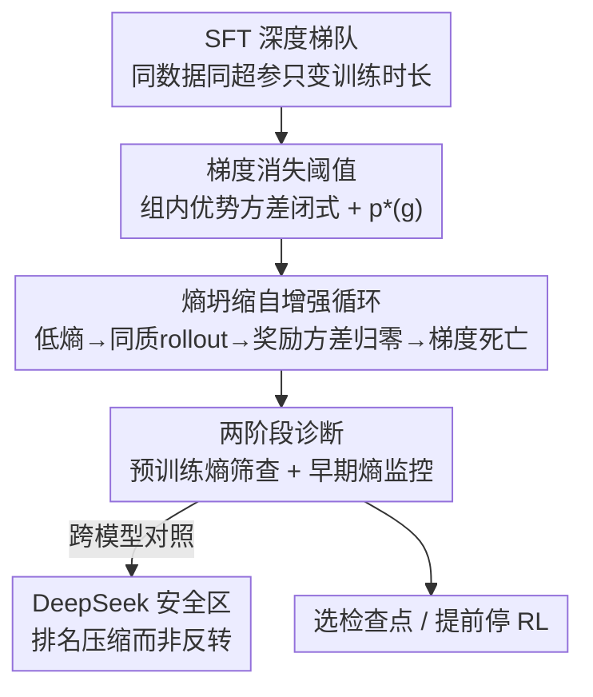

# SFT Overtraining Predicts Rank Inversion via Entropy Collapse Under RLVR

**会议**: ICML2026  
**arXiv**: [2606.18487](https://arxiv.org/abs/2606.18487)  
**代码**: https://github.com/siddharthaphale/entropy-collapse-rlvr  
**领域**: 对齐RLHF / RLVR后训练  
**关键词**: 熵坍缩, GRPO, RLVR, 检查点选择, 排名反转

## 一句话总结
作者发现"挑 SFT 阶段 pass@1 最高的检查点去做 GRPO"这条业界默认规则在代码生成上会系统性翻车——SFT 训得越久 pass@1 越高、但 GRPO 后的 pass@10 反而单调下跌（0.806→0.481），根因是过度 SFT 压扁了输出分布、让 GRPO 的组内优势方差归零、梯度消失，作者用一条闭式阈值 $p^*(g)$ 和一套"预训练熵筛查 + 早期熵监控"两阶段诊断把高危检查点提前揪出来。

## 研究背景与动机

**领域现状**：代码生成的标准后训练配方是"先 SFT 再 RLVR"（用可验证奖励做强化学习，如 GRPO），实践中默认挑 SFT 阶段打分（pass@1）最高的检查点喂给 RL。这条规则被当成理所当然的"越准越好"。

**现有痛点**：这条规则越来越被质疑。已有工作零散地指出：过长的 SFT 会变成死记硬背而非泛化、RLVR 实际上是在收窄推理边界而非拓宽、pass@1 在大规模下是后训练表现的弱预测器。但这些观察停留在"聚合层面"——它们能告诉你"平均而言 SFT 别训太久"，却无法对单个检查点做诊断：两个 pass@64 完全相同的检查点，可能携带截然不同的熵分布。

**核心矛盾**：问题的根本在于评估温度与 RL 工作温度的错位。贪婪 pass@1（$T=0$）测的是"能力天花板"，而 GRPO 在 $T=1.0$ 下采样工作——在采样温度下，一个检查点的输出分布可能比它贪婪行为暗示的要塌缩得多。SFT 训得越深，pass@1（能力）越高，但 $T=1.0$ 下的输出多样性（熵）越低，两者朝相反方向走，于是"选 pass@1 最高"恰好选中了多样性最差、最容易在 GRPO 早期触发梯度消失的那个检查点。

**本文目标**：(1) 从理论上刻画 GRPO 在什么条件下梯度结构性消失；(2) 在真实模型上展示"SFT 越深 → pass@1 越高 → GRPO 越差"的排名反转现象并解释机制；(3) 给出可操作、几乎零额外算力的检查点筛查工具。

**切入角度**：作者抓住 GRPO 这个"无 critic"设计的一个数学特性——二元奖励下组内优势方差有闭式 $p(1-p)(g-1)/g$，存在一个让"多数组退化、信号归零"的阈值 $p^*(g)$。一旦早期 GRPO 把通过率 $p$ 压到 $p^*(g)$ 以下，多数 rollout 组奖励全相同、组相对信号消失。这把一个看似经验性的"训练崩了"翻译成了可预测的相变。

**核心 idea**：用"预训练熵"代替"pass@1"作为检查点健康度的筛查信号——熵直接刻画 GRPO 所需的多样性，而 pass@1 在 SFT 深度梯队上几乎不动（0.151→0.187）、毫无区分度。

## 方法详解

### 整体框架
论文不是提出新算法，而是建立一条"机制 → 预测 → 诊断"的链路。先用一个受控实验设计（SFT 深度梯队：固定数据/超参/评估，只变 SFT 训练时长）在 Qwen2.5-Coder-3B 上跑出排名反转，再用 DeepSeek-Coder-6.7B 作为对照梯队（停在"安全区"、不反转），最后把理论阈值 $p^*(g)$ 落地成一套两阶段诊断，告诉工程师"哪个检查点别拿去做 RL""哪条 RL 跑应该提前停"。

### 关键设计

**1. 梯度消失阈值：把"GRPO 训练崩掉"翻译成一个闭式相变点**

GRPO 是无 critic 的，组内每条 rollout 的优势靠"减去组均值"得到。作者证明（Proposition 1）：在二元奖励下，一个组（大小 $g$、单题通过概率 $p$）的优势方差期望恰好是

$$\mathbb{E}[\sigma_G^2] = p(1-p)\frac{g-1}{g}.$$

这意味着当 $p\to 0$（几乎全错）或 $p\to 1$（几乎全对）时方差都塌向零——组内 rollout 奖励全相同，组相对优势为 0，梯度消失。进一步存在一个"多数组退化阈值" $p^*(g)$（Proposition 2/3），当 $p$ 跌破它时大多数组退化、整体不再提供学习信号（论文取 $g=8$，给出 $p^*(8)=0.083$）。这把一个经验现象（"deep SFT 后 RL 不动了"）变成了可计算、可预测的判据：检查点的通过率离 $p^*(g)$ 有多远，直接决定它在 GRPO 早期会不会掉进梯度死区。Qwen 的检查点起始 pass@1 只有约 $1.8\times\sim2.3\times$ 阈值、深层检查点在早期 GRPO 就跌破阈值；DeepSeek 每个检查点都 $\geq 4.2\times$ 阈值，所以根本进不了崩溃区。

**2. 熵坍缩自增强循环：解释"为什么 SFT 越深、GRPO 越崩"的五阶段机制**

光有阈值还不够，得回答"什么把 $p$ 推到阈值以下"。作者把它归结为一个由低熵触发、会自我放大的五阶段循环：① 过度 SFT 压缩输出分布（预训练熵从 1.0 epoch 的 0.227 nats 降到 5.8 epoch 的 0.120 nats）；② 在 $T=1.0$ 下低熵策略生成近乎相同的补全，组内同质化，pass@1 滑向 0（5.8-epoch 在 step 200 跌到 0.020）；③ 由 Proposition 1，$p=0.020$ 时方差只剩 0.0172，多数组退化、携带零梯度；④ 优势方差近零 → GRPO 更新可忽略，策略无法朝正确解移动（梯度死亡）；⑤ 没有梯度信号，残余的优化器动量与权重衰减进一步侵蚀能力，回到①。一旦进入循环，每一阶段放大下一阶段。关键证据是 GRPO **放大**而非抹平预训练的熵差距：1.0-epoch 与 5.8-epoch 的最差 token 熵比值从 step 10 的 $4.3\times$ 拉大到 step 400 的 $12.3\times$；而多样性比 $\Delta_k$ 始终 >0.84，说明坍缩发生在"采样概率"（多久能采到正确解）而非"可解上界"——deep 检查点不是不会解，是采不到。

**3. 两阶段诊断：预训练熵筛查 + 早期 GRPO 熵监控，几乎零额外算力揪出高危检查点**

理论指向的"应当筛查的量"是组内方差插件估计 $\hat{\mathbb{E}}[\sigma_G^2]=\hat p(1-\hat p)(g-1)/g$，但 Qwen 上 pass@1 只在 0.151~0.187 之间、几乎没有区分度，所以作者改用熵作代理。**Stage 1（无需任何 RL 算力）**：在 $T=1.0$ 下测平均 next-token 熵 $H(\pi_\text{SFT})$，低于阈值 $\tau_H=0.18$ nats 即标记高危——Qwen 五个检查点中三个（1.9/2.9/5.8 epoch）被 flag，5.8-epoch 每个 seed 都是最高危。**Stage 2（GRPO 早期）**：监控最差 token 熵从 step 10 到 step 150 的相对下降 $\Delta H(10\to150)/H(10)$，超过 $\tau_2=0.50$ 即判定坍缩——5.8-epoch 在 step 150 已损失 64% 熵（1.0-epoch 仅 24%），在 step 150 而非 step 400 停掉可省 62.5% 的 RL 算力。作者强调"模型无关的主张"是这个**排序**（预训练熵越低 → GRPO 越差，Spearman $\rho=+0.69$）和风险信号，而非这些具体阈值（阈值是对 Qwen 梯队标定的）。把诊断反过来用作选择规则：放弃 pass@1 最高的 5.8-epoch、改选 1.9-epoch 最优点，deep eval pass@10 回收 +0.090 绝对值（0.643 vs 0.553）。

### 损失函数 / 训练策略
两个基座模型用完全相同的配方：BF16 + LoRA（$r=128,\alpha=128$，作用于所有线性层+embedding），SFT 用 AdamW-8bit、lr $1\times10^{-5}$、batch 16。GRPO 用 DAPO 变体，组大小 $g=8$、$\beta=0$（无 KL 惩罚）、$\varepsilon_\text{high}=0.28$、lr $1\times10^{-6}$、400 步、二元正确性奖励（全部单测通过 +2.0 否则 0，刻意去掉格式奖励以免掩盖能力信号）。GRPO 训练集用一个"校准带"过滤：对每题跑 16 次采样，只保留通过数 $\in[1,14]$ 的题（既非无解也非饱和），保证每条 GRPO 臂都有梯度方差。

## 实验关键数据

### 主实验
SFT 深度梯队上，"选 pass@1 最高"在每个 seed、每个深度都选中了**最差**的 GRPO 初始点，峰值 pass@10 差距高达 0.325。

| 模型 / SFT epochs | 预训练熵 (nats) | 预训练 pass@1 | GRPO 峰值 pass@10 |
|---|---|---|---|
| Qwen-3B / 1.0 | 0.227 | 0.151 | **0.806** |
| Qwen-3B / 1.9 | 0.163 | 0.163 | 0.750 |
| Qwen-3B / 2.9 | 0.156 | 0.159 | 0.671 |
| Qwen-3B / 3.8 | 0.171 | 0.173 | 0.608 |
| Qwen-3B / 5.8 | 0.120 | **0.187** | 0.481 |
| DeepSeek-6.7B / 1.0 | 0.399 | 0.351 | 0.861 |
| DeepSeek-6.7B / 5.8 | 0.185 | 0.413 | 0.888 |

注意 Qwen 上 pass@1 越高（5.8-epoch 最高）对应 pass@10 越低（完全反转）；DeepSeek 上 pass@1 与 pass@10 同向（压缩而非反转）。绝对水平跨模型不可直接比较，关键是梯队**内部排序**。

### 跨模型对照 / 干预消融
DeepSeek 占据 $p^*(8)$ 的安全侧（每个检查点 $\geq 4.2\times$ 阈值），所有臂在 GRPO 下都提升（$\Delta$pass@10 $\in[+0.003,+0.024]$），是排名压缩而非反转——这是对阈值预测的对照验证，不是对崩溃机制的复现。

| 配置 | 关键现象 | 说明 |
|---|---|---|
| Qwen 全梯队 | pass@10 随 SFT 深度单调下跌、排名反转 | 落入 $p^*(8)$ 崩溃区，$\rho_{\text{pass@1, pass@10}}=-0.75$ |
| DeepSeek 全梯队 | pass@10 聚在 [0.841,0.884]、排名压缩 | 全部 $\geq4.2\times$ 阈值，前后排名 Spearman $\rho=+1.00$ |
| + KL 惩罚（干预） | 救不回坍缩的 Qwen 检查点 | 失败发生在 GRPO 超参之上游 |
| + label smoothing（干预） | 同样救不回 5.8-epoch | 说明不是平凡的 GRPO 超参 artefact |

### 关键发现
- **pass@64 几乎不变（0.897~0.932）但 pass@10 大跌**：检查点差的不是"能否解题"而是"多可靠地采到正确解"——能力天花板一致，区别在采样可靠性。
- **峰值步本身随 SFT 深度收缩**（从 step 250 缩到 step 50）：坍缩的检查点不是学得更快，而是更早耗尽学习信号。
- **熵的非单调是 seed 级 artefact**：seed 42 的 3.8-epoch 熵反常偏高，但 3 seed 均值仍单调，正好说明只靠单张预训练熵快照不够、需要 Stage 2 早期监控补强。
- **KL 惩罚与 label smoothing 都救不回**：失败在 SFT 阶段就已注定，不是 GRPO 侧能补救的超参问题。

## 亮点与洞察
- **把"RL 训崩"变成可预测的相变**：$\mathbb{E}[\sigma_G^2]=p(1-p)(g-1)/g$ 这条闭式 + 阈值 $p^*(g)$，让"组相对信号何时结构性消失"有了可计算判据，是整篇论文最漂亮的一击。
- **诊断信号选得很务实**：理论上该筛 $\hat{\mathbb{E}}[\sigma_G^2]$，但 pass@1 在梯队上没区分度，于是改用熵——熵直接刻画多样性、且预训练即可测、无需 RL 算力。这种"理论指方向、工程换代理量"的取舍值得借鉴。
- **反直觉结论可迁移**：任何"先 SFT 再 RLVR"的流程（数学推理、agent、工具调用）都可能踩同一个坑——别迷信 pass@1，先量一眼 $T=1.0$ 下的熵离崩溃阈值有多远。
- **对照实验设计干净**：DeepSeek 不是用来"复现"，而是用来"反证"——它停在安全区、不该崩也确实没崩，反而强化了阈值的因果解释。

## 局限与展望
- **阈值是对 Qwen 标定的**：$\tau_H=0.18$、$\tau_2=0.50$、$p^*(8)=0.083$ 都依赖具体设置，作者也明确只敢主张"排序与风险信号"是模型无关的，绝对 cutoff 换模型/换任务需要重新标定。
- **规模有限**：只有两个代码模型、各 4~5 个深度 × 3 seed，且都在代码生成 + 二元奖励下；连续/稠密奖励、非代码任务、更大模型是否同样适用未验证。
- **只诊断不修复**：两阶段诊断能"提前止损"和"换检查点"，但没有给出"如何在不牺牲 pass@1 的前提下保住熵"的训练侧方案（Clip-Cov 等训练时熵保持方法是互补但未整合）。
- **干预测得不全**：只试了 KL 与 label smoothing 两种最朴素的补救，更激进的熵正则、采样温度调度、数据重配比未纳入。

## 相关工作与启发
- **vs Kang et al. (2025)**：他们做跨模型聚合预测（pass@64 + 泛化损失，$R^2=0.94$），本文做的是**同族梯队内、固定算力下的检查点级**诊断——聚合预测器无法诊断单个失败，两个 pass@64 相同的检查点可以有截然不同的熵分布。
- **vs Zhang et al. (2026, PEAR)**：他们也观察到数学推理里的排名反转，归因于离线/在线分布失配、并改 SFT 损失目标来补救；本文给的是熵的机制解释，并把失败定位在 SFT 阶段本身而非 SFT 损失函数。
- **vs Cui et al. (2025, Clip-Cov)**：他们处理 RL **训练中**的熵坍缩，本文处理**训练前**——先识别哪些检查点在 GRPO 开始前就已经熵枯竭，二者互补（先筛后保）。
- **vs 可塑性丧失（plasticity loss）一线**：熵坍缩与深度 RL 里的可塑性丧失（network reset、向初始权重正则）一致，但熵的优势是**预训练即可测**，而有效秩、死神经元比例需要额外探针。

## 评分
- 新颖性: ⭐⭐⭐⭐ 把业界默认规则证伪 + 闭式阈值解释机制，角度新但不是全新算法
- 实验充分度: ⭐⭐⭐ 受控梯队 + 跨模型对照很干净，但只有两模型/代码任务/二元奖励，规模偏小
- 写作质量: ⭐⭐⭐⭐ 机制→预测→诊断链路清晰，三条"有界贡献"诚实不夸大
- 价值: ⭐⭐⭐⭐ 直接改写"怎么选 SFT 检查点做 RL"的工程实践，省算力且可落地

<!-- RELATED:START -->

## 相关论文

- [\[ACL 2026\] ComplexConstraints and Beyond: Expert Rubrics for RLVR](../../ACL2026/llm_alignment/complexconstraints_and_beyond_expert_rubrics_for_rlvr.md)
- [\[CVPR 2025\] Continual SFT Matches Multimodal RLHF with Negative Supervision](../../CVPR2025/llm_alignment/continual_sft_matches_multimodal_rlhf_with_negative_supervision.md)
- [\[ICLR 2026\] Beyond RLHF and NLHF: Population-Proportional Alignment under an Axiomatic Framework](../../ICLR2026/llm_alignment/beyond_rlhf_and_nlhf_population-proportional_alignment_under_an_axiomatic_framew.md)
- [\[ACL 2025\] LSSF: Safety Alignment via Low-Rank Safety Subspace Fusion](../../ACL2025/llm_alignment/lssf_safety_subspace.md)
- [\[ICLR 2026\] JailNewsBench: Multi-Lingual and Regional Benchmark for Fake News Generation under Jailbreak Attacks](../../ICLR2026/llm_alignment/jailnewsbench_multi-lingual_and_regional_benchmark_for_fake_news_generation_unde.md)

<!-- RELATED:END -->
