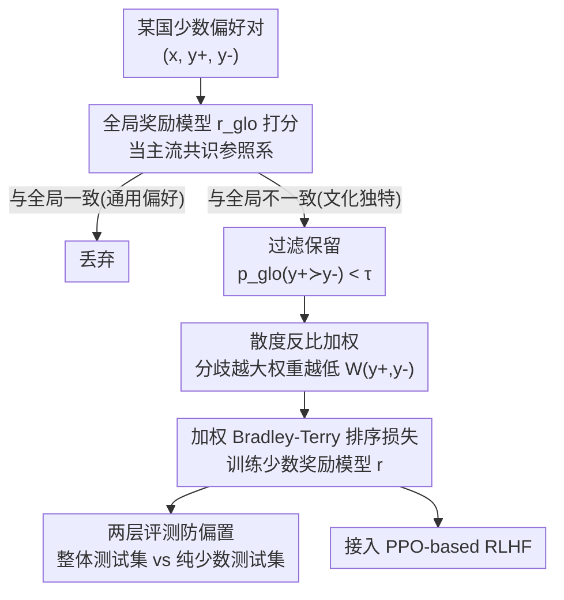

# Steerable Cultural Preference Optimization of Reward Models

**会议**: ICML 2026  
**arXiv**: [2606.18606](https://arxiv.org/abs/2606.18606)  
**代码**: https://github.com/minsik-ai/Steerable-Cultural-Preference  
**领域**: 对齐RLHF / 奖励模型  
**关键词**: 文化对齐, 奖励模型, 多元对齐, 偏好过滤, 偏好加权

## 一句话总结
SCPO 用一个"全局奖励模型"当参照系，先**过滤**掉少数群体里那些和全局共识一致的通用偏好、只留下真正有文化差异的偏好对，再按**散度反比加权**把过激的离群偏好压低权重，从而训出既能代表某国少数群体观点、又不至于过度偏置的可steer奖励模型——在 PRISM、GlobalOpinionQA 两数据集、7 个国家上把少数奖励模型最多提升约 7 个点，且比全量微调省下 170%–280% 的训练数据。

## 研究背景与动机
**领域现状**：LLM 对齐（RLHF/DPO）长期把"标注者偏好"当成一个统一的目标来预测，奖励模型也大多拟合某地区/主流人群的单一偏好分布。

**现有痛点**：这种做法让模型系统性地偏向特权人群或西方发达国家的观点，少数文化子社区的偏好被淹没。要服务全球不同文化社区，需要的是能被"导向"到某个特定群体视角、同时又不过度偏置的对齐模型。

**核心矛盾**：直接拿某国的全部偏好数据去微调奖励模型，会把两类东西混在一起——一类是真正体现该文化独特性的偏好，另一类是和全球共识其实一致的通用偏好，还夹杂着标注噪声和可能有害的极端偏好。全量拟合既学不到"独特性"，又容易被极端样本带偏（over-bias）。已有的群体对齐方法（GPO 要外挂一个 transformer 模块、不好接进标准 RLHF；GRPO 只优化最坏群体损失、不关心对单一少数群体的独立可steer性）都没解决这个矛盾。

**本文目标**：在 RLHF 框架内训出**可steer**（steerable，多元对齐三类之一）的、面向某国视角的奖励模型，同时回答三个问题——怎么保证少数奖励模型观点均衡？能否复用现成全局奖励模型的打分来训练少数模型？哪一部分偏好数据对训练才真正有用？

**切入角度**：作者的关键观察是，一个在广义偏好数据（OpenAssistant、Tülu 3）上训出来的"全局奖励模型"可以当成"主流/共识偏好"的参照系——少数标注与全局 RM 预测**不一致**的偏好对，正是该文化真正独特的地方；而不一致幅度过大的，则可能是会让模型过偏的离群点。注意作者并不假设全局 RM 是"正确"的，只是拿它当一把区分"少数 vs 多数"的尺子。

**核心 idea**：用全局 RM 的打分对少数偏好数据做两步处理——**过滤**（去掉与全局一致的通用对）+ **散度反比加权**（压低过激离群对），再用加权排序损失训练少数奖励模型。

## 方法详解

### 整体框架
输入是某国少数群体的成对偏好数据 $(x, y^+, y^-)$（来自 PRISM，$y^+$ 是该群体更偏好的回复）。SCPO 先让一个固定的全局奖励模型 $r_\text{glo}$ 给每对打分，然后做两件事：**过滤**——丢掉全局 RM 已经同意的对（这些是通用偏好，对学文化独特性没用）；**加权**——对保留下来的对，按"少数标注与全局 RM 的分歧幅度"反比地分配训练权重，分歧越大权重越低，避免极端离群偏好把模型带偏。最后用带权重的二元排序损失把现成的 OpenAssistant / Tülu3 模型微调成该国的少数奖励模型，可直接接进 PPO-based RLHF。全局 RM 可以就用待训模型的初始检查点。

### 关键设计

**1. 全局 RM 作参照系 + 偏好过滤：只留下真正有文化差异的数据**

针对"少数偏好里混了一堆和全球共识一致的通用偏好"这个痛点，SCPO 用全局奖励模型 $r_\text{glo}$ 当尺子，把那些"全局 RM 也同意"的偏好对从训练集里删掉，只保留"全局 RM 不同意"的对。判据基于 Bradley-Terry 模型：全局认为 $y^+$ 胜过 $y^-$ 的概率

$$p_\text{glo}(y^+\succ y^-\mid x)=\frac{e^{r_\text{glo}(x,y^+)}}{e^{r_\text{glo}(x,y^+)}+e^{r_\text{glo}(x,y^-)}}<\tau,$$

当这个概率低于阈值 $\tau\in[0,1]$（即全局其实更偏 $y^-$、和少数标注相反）时才保留该对，$\tau$ 越小过滤越激进。这样做让训练聚焦在"是什么让这个文化与众不同"上，而不是浪费在全局模型早就学会的普世偏好上。副作用是数据量大幅缩减——实测过滤后只剩原来约 1/2 到 1/3，带来 170%–280% 的数据效率，同时模拟出"少数偏好高度独特（九成都与全球共识相左）"的场景。

**2. 散度反比加权：压低过激离群偏好，缓解过度偏置**

光过滤还不够——保留下来的"分歧对"里，分歧幅度差别很大。作者把一对偏好的"散度"定义为少数标注与全局 RM 偏好的分歧程度：当 $p_\text{glo}(y^+\succ y^-\mid x)$ 很高（全局强烈偏向少数群体**拒绝**的那个回复）时，散度大。小分歧（全局概率接近 0.5）说明全局与少数几乎无差别、该偏好是细微但真实的文化区别；大分歧（全局概率接近 0）说明少数标注与强全局共识相悖，更可能是噪声、标注错误或有害内容。基于 Bradley-Terry"偏好本质是概率性"的视角，作者给出反比权重

$$W(y^+,y^-)=\min\!\Big(e^{(r_\text{glo}(x,y^+)-r_\text{glo}(x,y^-))/\beta},\,1\Big),$$

温度 $\beta>0$ 控制锐度（$\beta$ 越小越放大高低置信对的差异）。当 $r_\text{glo}(x,y^-)>r_\text{glo}(x,y^+)$（存在分歧）时权重 $<1$，分歧越大权重越小。注意这套加权**不判断内容好坏**，只按分歧幅度调节训练影响——让细微而真实的文化差异被强调、让离群点被淡化，从而既保留少数特色又不丢掉核心的全球知识与价值观。

**3. 加权排序损失与两层评测：训练目标与"是否过偏"的诊断**

训练用标准二元排序损失，并把上面的权重乘进去：

$$L=-\mathbb{E}_{D}\big[W(y^+,y^-)\,\log\sigma\big(r(x,y^+)-r(x,y^-)\big)\big],$$

这里 $r$ 是待训的少数奖励模型，区别于固定的 $r_\text{glo}$。为了回答"少数模型是否观点均衡"，作者还设计了**两层多面评测**：一层在"全部国家偏好"测试集上看整体表现（越高越好），另一层在"纯该国独特偏好"测试集上看（**越高未必越好**——过高反而说明模型只会迎合少数极端观点、被过度偏置）。这两个测试集配合起来，才能判断一个少数奖励模型是真的均衡，还是表面分数高、实则偏激。

### 损失函数 / 训练策略
核心就是上面的加权 Bradley-Terry 排序损失（Eq. 4），是对标准排序损失（Eq. 3）乘上每对的散度反比权重 $W$。两个关键超参：过滤阈值 $\tau$（控制保留多少数据/过滤激进程度）和加权温度 $\beta$（控制权重分布锐度）。全局 RM 可直接复用待训模型的起始检查点，无需额外训练辅助模块。

## 实验关键数据

### 主实验
在 PRISM 的 7 个国家（智利、南非、新西兰、澳大利亚、墨西哥、以色列、加拿大）上，用 OpenAssistant 与 Tülu3 两个 RM 做骨干。下表为 OpenAssistant RM 在"全部国家偏好"测试集（整体，越高越好）上的国家平均准确率：

| 方法 | 7 国平均 (整体测试集) | 说明 |
|------|------|------|
| Global RM（未对齐） | 58.55 | 直接用全局奖励模型 |
| Baseline（全量微调） | 62.12 | 不做过滤/加权的全量微调 |
| Filtered Only | 46.87 | 只过滤、不加权 → 大幅掉点 |
| Inverse Weighted Only | 56.62 | 只加权、不过滤 |
| SCPO (W) | 61.13 | 仅加权版完整流程 |
| **SCPO (F + W)** | **62.72** | 过滤 + 加权，整体最优 |
| SCPO (F + W)$_\text{tuned}$ | 63.42 | 调参后进一步提升 |

论文摘要称少数奖励模型相比 baseline 最多提升约 7 个点（跨 PRISM/GlobalOpinionQA 两数据集、7 国），并比全量微调最多省 280% 训练数据。⚠️ 具体"+7 点"对应的国家/数据集组合以原文详表为准，上表平均提升幅度较小（约 +0.6～1.3 点），单国差异更大。

### 消融实验（"过滤"与"加权"各自的作用）
下表为 OpenAssistant RM 在"纯该国独特偏好"测试集上的 7 国平均（**越高未必越好**，过高=过偏）：

| 配置 | 纯少数测试集均值 | 含义 |
|------|---------|------|
| Baseline | 27.37 | 全量微调，几乎没学到少数特色 |
| Filtered Only | 63.01 | 只过滤 → 分数飙到 63，**严重过偏**（只会迎合少数极端观点） |
| Inverse Weighted Only | 46.70 | 只加权，偏置居中 |
| SCPO (W) | 18.21 | 仅加权，过度保守 |
| SCPO (F + W) | 40.57 | 过滤+加权，把过偏拉回到适中区间 |

### 关键发现
- **过滤和加权必须配合用**：单独过滤会让模型在纯少数测试集上分数虚高（63.01）、实则过度偏置；加上散度反比加权后回落到 40.57 的均衡区间，同时整体测试集还保持最佳（62.72）。
- **"越高越好"在这里不成立**：纯少数测试集上分数过高是危险信号，这正是作者设计两层评测的意义——只看一个指标会被"过偏但分高"的模型骗到。
- **数据效率显著**：过滤后训练数据砍到 1/2～1/3，仍能达到甚至超过全量微调的整体表现，省 170%–280% 数据。
- **可直接接进 RLHF**：全局 RM 用现成开源模型、少数 RM 是标准奖励模型，无需 GPO 那样的外挂偏好模块，PPO 流程零改造。

## 亮点与洞察
- **"用一个参照系来定义独特性"很巧**：不直接学少数偏好，而是用全局 RM 做减法（过滤通用偏好）+ 调权（压离群偏好），把"什么是文化独特"操作化成"与全局的分歧"，且不需要假设全局 RM 正确。
- **两层评测戳破"分高即好"的幻觉**：纯少数测试集越高反而越可能过偏，这个反直觉的诊断设计对整个多元对齐评测都有借鉴意义。
- **可迁移性强**："用强参照模型做分歧度量、再按分歧反比加权"的思路可推广到任何"想拟合子群体特色又怕被极端样本带偏"的个性化/分群对齐场景（如方言、领域、人群细分）。

## 局限与展望
- **依赖全局 RM 的质量与偏向**：整套方法把全局 RM 当尺子，若全局 RM 本身偏向某种文化，过滤与加权的"分歧"判断也会被它的偏向污染；作者虽声明不假设全局正确，但实际效果与全局 RM 的覆盖面强相关。
- **散度与有害/噪声/真实文化差异纠缠**：作者自己区分了"有害内容/文化独特/标注错误"三者，但权重只按分歧幅度调、不做内容判断，可能误压真实但激进的文化偏好、或漏放有害但分歧小的偏好。
- **评测范围有限**：只在 PRISM 7 国 + GlobalOpinionQA 上验证，国家数和每国样本量都不大；两个超参 $\tau,\beta$ 的敏感性与跨国可迁移性还需更大规模检验。

## 相关工作与启发
- **vs GPO / GRPO**：GPO 要在 LLM 上外挂一个微调 transformer 模块预测群体偏好、难接进标准 RLHF；GRPO 只最小化最坏群体损失、不关心对单一少数群体的独立可steer。SCPO 用现成全局 RM 当固定参照、产出标准奖励模型，可直接 drop-in 进 RLHF 且面向单一国家视角。
- **vs RAFT / SuperHF（基于奖励的过滤）**：它们用奖励模型筛高分样本来微调，但只做基础阈值过滤、不针对少数对齐、也不处理成对偏好；SCPO 的过滤是"与全局分歧"而非"绝对高分"。
- **vs OPTune / Mallows-DPO（基于权重的对齐）**：它们按奖励差/标注一致性给 DPO 样本加权，但不针对少数对齐、不联合分析过滤与加权；SCPO 把过滤与散度反比加权放在一起做并系统分析其权衡。
- **vs PAL / VPL（个性化奖励建模）**：它们学"用户条件化"模型、多在合成或图像偏好基准上按"已见/未见用户"汇总评测；SCPO 走"群体身份 × 全局-少数对比"，用真实逐国人类数据、报告"少数 vs 整体"的人群分层权衡——因为按用户对齐不等于群体层面均衡。

## 评分
- 新颖性: ⭐⭐⭐⭐ 把"文化独特性"操作化为"与全局 RM 的分歧"并做过滤+反比加权，角度新且实用，但单个组件（过滤、加权）各有前作。
- 实验充分度: ⭐⭐⭐⭐ 两骨干 RM、两数据集、7 国、两层评测 + 消融较扎实；但国家/样本规模有限，超参敏感性待补。
- 写作质量: ⭐⭐⭐⭐ 动机与研究问题清晰，散度的三类辨析与两层评测解释到位；部分实验表"越高未必越好"需读者细看才不被误导。
- 价值: ⭐⭐⭐⭐ 可直接接进 RLHF、数据效率高，对多元/文化对齐这一开放问题有切实推进。

<!-- RELATED:START -->

## 相关论文

- [\[ICML 2026\] VALUEFLOW: Toward Pluralistic and Steerable Value-based Alignment in Large Language Models](valueflow_toward_pluralistic_and_steerable_value-based_alignment_in_large_langua.md)
- [\[ICML 2026\] Korean Culture into LLM Alignment: Toward Cultural Coherence](korean_culture_into_llm_alignment_toward_cultural_coherence.md)
- [\[ACL 2025\] AMoPO: Adaptive Multi-objective Preference Optimization without Reward Models and Reference Models](../../ACL2025/llm_alignment/amopo_adaptive_multi-objective_preference_optimization_without_reward_models_and.md)
- [\[ICML 2026\] Autoregressive Direct Preference Optimization](autoregressive_direct_preference_optimization.md)
- [\[ICML 2026\] Quantifying the Salience of Geo-Cultural Values for Pluralistic Safety Alignment](quantifying_the_salience_of_geo-cultural_values_for_pluralistic_safety_alignment.md)

<!-- RELATED:END -->
