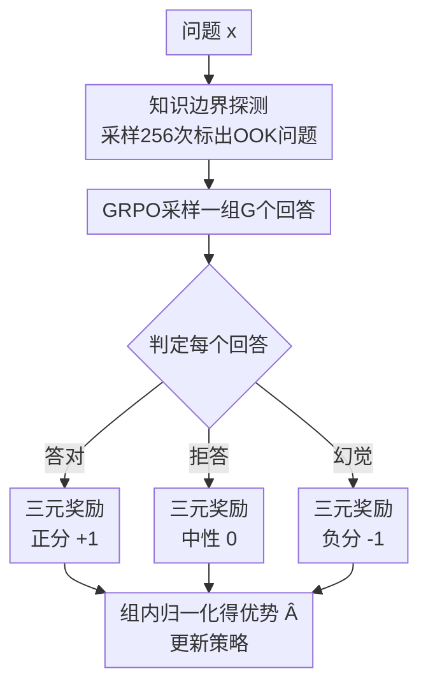

# TruthRL: Incentivizing Truthful LLMs via Reinforcement Learning

**会议**: ICML2026  
**arXiv**: [2509.25760](https://arxiv.org/abs/2509.25760)  
**代码**: https://github.com/facebookresearch/TruthRL  
**领域**: 对齐RLHF / LLM真实性  
**关键词**: 真实性, 幻觉抑制, 拒答, GRPO, 三元奖励

## 一句话总结
针对"只优化准确率反而鼓励瞎猜、强行教拒答又过度保守"的两难，TruthRL 用一个区分"答对 / 幻觉 / 拒答"的三元奖励在 GRPO 上直接优化真实性，把幻觉率从 43.5% 压到 19.4%、真实性得分从 5.3% 拉到 37.2%。

## 研究背景与动机

**领域现状**：让 LLM 在事实问答上少出错，主流走两条路——要么用 SFT/RL 优化答案准确率，要么靠 RAG / 微调扩大模型的知识范围。还有一条线是专门教模型"承认不知道"（R-Tuning 把不可答问题标成"I don't know"再 SFT）。

**现有痛点**：这些方法各有硬伤。纯准确率导向的 SFT/RL 会把"猜"当成最优策略——因为在期望意义上，瞎猜的收益永远高于拒答（猜还有概率蒙对，拒答恒为 0 分），结果模型几乎不再拒答、幻觉照旧甚至更多。反过来，R-Tuning 这类教拒答的方法要么需要为每个模型重新标注昂贵的数据集，要么训出来过度保守——明明知道答案也拒答，把准确率一起牺牲掉。

**核心矛盾**：真实性（truthfulness）不等于准确率。一个"答得少但不确定就闭嘴"的模型，比一个"准确率更高但经常一本正经胡说"的模型更可信，尤其在法律、医疗这种高风险场景。但现有目标函数要么只盯准确率（鼓励幻觉），要么死板教拒答（牺牲准确率），没有一个目标能让模型**该答的答、不确定的拒、永远别幻觉**。

**本文目标**：设计一个直接优化"真实性"而非"准确率"的学习目标，让模型同时学会三件事——最大化答对、恰当地拒答、最小化幻觉。

**切入角度**：作者先做了一个关键观测（Figure 2，CRAG + Llama3.1-8B）：未微调的 base 模型用 majority@$k$ 投票时，随采样数增加准确率升、幻觉降、拒答也合理增加——说明 base 模型本身就有"识别知识边界"的潜力；而 vanilla SFT/RL 微调后这种潜力被抹平了，拒答率被压到接近 0。既然潜力本就存在，缺的只是一个对齐的奖励信号去把它激发出来。

**核心 idea**：把二元的"对/错"奖励换成**三元奖励**——答对给正分、幻觉给负分、拒答给中性 0 分，然后用 GRPO 在线优化。一句话：用"显式惩罚幻觉、中性对待拒答"代替"只奖励准确率"来直接优化真实性。

## 方法详解

### 整体框架

TruthRL 的目标是把真实性写进优化目标本身。论文先把真实性形式化为三个维度的加权组合：给定预测 $\hat{y}_i=f_\theta(x_i)$，统计准确率 $\mathrm{Acc}$、拒答率（不确定率）$\mathrm{Unc}$、幻觉率 $\mathrm{Hall}$，定义

$$\text{Truthfulness}=w_1\cdot\mathrm{Acc}+w_2\cdot\mathrm{Unc}-w_3\cdot\mathrm{Hall}$$

其中 $w_1,w_3\ge 0$ 表示"答对永远奖励、幻觉永远惩罚"，$w_2$ 由部署需求决定（默认 $w_1{=}1,w_2{=}0,w_3{=}1$，即拒答中性）。优化目标就是最大化期望真实性 $\max_\theta\mathbb{E}_{\mathcal{D}}[\text{Truthfulness}(f_\theta)]$。

整条 pipeline 分两步：先（可选地）探测模型的知识边界、构造能表达"不确定"的强基线，再用一个与真实性目标对齐的三元奖励在 GRPO 上做在线 RL。下图是训练时单个样本的奖励判定与优化流程。

### 关键设计

**1. 真实性三元奖励：让拒答比瞎猜更划算**

这是全文的核心，直接针对"准确率导向逼模型瞎猜"这个根因。传统 RL 用二元奖励——对得 1、错（含幻觉）得 0、拒答也得 0，于是拒答和幻觉同分，而幻觉至少有蒙对的期望收益，模型自然永远选择猜。TruthRL 把奖励改成三档：答对 $r{=}+1$、拒答 $r{=}0$（中性）、幻觉 $r{=}-1$（显式惩罚）。这样一来，当模型对某题没把握时，拒答（0 分）的期望收益开始高于"猜错就被扣分"的瞎猜，模型被激励去"识别自己不知道并闭嘴"。注意这与二元奖励的区别只在于把"幻觉"从 0 分拉到负分——但正是这一点改变了博弈的纳什均衡，论文用 TruthRL$_{\text{Binary}}$（去掉幻觉惩罚的退化版）做了对照，证明少了这条负分，真实性会大幅崩塌。

**2. GRPO 在线优化 + 组内优势归一化：稳定地把三元奖励变成梯度**

三元奖励需要一个能用稀疏标量奖励训练的 RL 框架，作者选了 GRPO（无需单独的价值网络，靠组内采样估计优势）。对每个问题从旧策略 $\pi_{\theta_{\text{old}}}$ 采样一组 $G$ 个回答，各自打三元奖励 $\{r_1,\dots,r_G\}$，用组内均值和标准差归一化得到优势

$$\hat{A}_i=\frac{r(x,y_i)-\text{mean}(\{r(x,y_j)\}_{j=1}^G)}{\text{std}(\{r(x,y_j)\}_{j=1}^G)}$$

再走带 clip 的 PPO 式目标 $\ell_{i,t}(\theta)=\min(w_{i,t}\hat{A}_i,\ \mathrm{clip}(w_{i,t},1-\epsilon,1+\epsilon)\hat{A}_i)$，并对参考策略加 KL 正则 $\beta\mathbb{D}_{KL}(\pi_\theta\|\pi_{\text{ref}})$。组内归一化让"这组里相对更真实的回答"获得正优势，于是同一题里"答对"被拉高、"幻觉"被压低、"拒答"居中，三元信号被平滑地转成策略梯度。

**3. 知识边界探测 + 强基线：先让模型有能力表达"不确定"**

要让 RL 学会拒答，模型首先得能产出"I don't know"这种表达。作者用知识边界探测构造可拒答的强基线：对每个训练问题以 temperature 0.6、top-p 0.9 采样 256 个回答，若**无一答对**就把该题标为 OOK（out-of-knowledge），并把标签改成"I don't know"用标准 SFT 训练，即 R-Tuning 基线。在此之上还扩展了 RFT（rejection sampling fine-tuning）：对 OOK 题选一条以"I don't know"收尾的推理轨迹当标签、对非 OOK 题选导向正确答案的轨迹。这一步既给出了对照基线，也让 TruthRL 在"有/无知识边界信息"两种设定下都能运行——有边界信息时用它辅助奖励判定，没有时也能纯靠三元奖励自学拒答。

### 损失函数 / 训练策略

训练目标即上面的 GRPO 损失加 KL 正则；奖励默认设置为答对 $+1$ / 拒答 $0$ / 幻觉 $-1$，对应真实性目标 $w_1{=}1,w_2{=}0,w_3{=}1$。回答的对/错/拒判定由验证器完成。实验在 Qwen2.5-7B-Instruct、Llama3.1-8B-Instruct 等多个 backbone 上进行，覆盖 with/without retrieval 两种设定。

## 实验关键数据

### 主实验

四个知识密集型 benchmark（CRAG / NQ / HotpotQA / MuSiQue），报告真实性得分 T、幻觉率 H、准确率 A。下表为 Llama3.1-8B-Instruct 的平均结果（节选自原文 Table 1）：

| 设定 | 方法 | 真实性 T ↑ | 幻觉率 H ↓ | 准确率 A ↑ |
|------|------|-----------|-----------|-----------|
| 无检索 | Prompting | -20.9 | 53.1 | 32.1 |
| 无检索 | SFT | -50.3 | 75.2 | 24.8 |
| 无检索 | R-Tuning | -13.6 | 33.5 | 19.9 |
| 无检索 | RLKF | -9.8 | 34.7 | 24.9 |
| 无检索 | TruthRL$_{\text{Binary}}$ | -26.7 | 63.3 | 36.7 |
| 无检索 | **TruthRL** | **~10.5** | **20.5** | 31.0 |
| 有检索 | Prompting | -7.9 | 46.5 | 38.6 |
| 有检索 | TruthRL$_{\text{Binary}}$ | -2.3 | 50.1 | 47.9 |

Qwen2.5-7B 无检索设定上，TruthRL 把幻觉率从 Prompting 的 43.5% 左右压到 19.4% 量级、真实性从 5.3% 拉到 37.2%（摘要数字）。关键对比是 TruthRL vs TruthRL$_{\text{Binary}}$：去掉幻觉负分后，模型为冲准确率（A 反而更高，如 36.7）把幻觉率顶到 63%，真实性崩到负值——证明**幻觉惩罚这一项不可或缺**。

### 消融实验

| 配置 | 关键变化 | 说明 |
|------|---------|------|
| TruthRL (Full) | 三元奖励（+1/0/-1） | 完整方法，真实性最高 |
| TruthRL$_{\text{Binary}}$ | 去掉幻觉负分（对/错二元） | 退化为准确率导向，幻觉率飙升、真实性崩 |
| SFT / RFT | 监督微调 | 几乎不拒答，幻觉率最高 |
| R-Tuning | 教拒答的 SFT | 拒答上来了但过度保守，准确率掉到 ~20% |

### 关键发现
- 幻觉负分是真实性的开关：TruthRL 与其二元退化版的唯一差别就是幻觉是否被显式惩罚，而两者真实性差出几十个点——说明真实性提升不是来自更强的准确率，而是来自"把幻觉转成拒答"。
- 拒答增加源于真识别知识边界而非过度保守：分析显示 TruthRL 在知识不足时拒答最多、在有把握时照常作答，而基线倾向在知识不足时硬答（幻觉）。
- 检索设定下增益更大：有 RAG 时模型能拿到额外信息，三元奖励既鼓励用好检索答对、也鼓励信息不足时拒答，准确率和真实性同时上升。

## 亮点与洞察
- 最"啊哈"的点是把真实性建模成博弈问题：传统二元奖励下"瞎猜"是占优策略，仅仅把幻觉从 0 分改成负分，就把均衡从"永远猜"挪到"不确定就拒答"——一个极简的奖励改动撬动了模型的整体行为。
- 三元奖励 $+1/0/-1$ 与真实性目标 $w_1\mathrm{Acc}+w_2\mathrm{Unc}-w_3\mathrm{Hall}$ 一一对应，奖励设计有明确的目标函数依据，不是拍脑袋调出来的。
- 这套"重新定义奖励语义"的思路可迁移到任何"准确率与安全性/保守性冲突"的对齐任务，比如有害内容拒答、工具调用的 abstain 决策。

## 局限与展望
- 拒答的判定依赖验证器能可靠区分"答对/幻觉/拒答"，在开放生成、长答案场景下这种判定本身就很难，可能引入噪声奖励。
- 实验主要在知识密集型问答上，三元奖励对推理链很长、错误是"中间步出错"而非"事实记错"的任务是否仍然有效，尚未充分验证。
- 拒答中性（$w_2{=}0$）是个折中：某些部署可能希望轻微奖励或惩罚拒答，论文给了 $w_2$ 的口子但未系统扫该超参对行为的影响。

## 相关工作与启发
- **vs R-Tuning**: 它把不可答问题标成"I don't know"做 SFT，需要为每个模型重标数据且易过度保守；TruthRL 不靠固定标签、用奖励让模型自学边界，泛化更好、不过度保守。
- **vs vanilla RL (RLHF/RLKF)**: 它们用二元准确率奖励，隐式鼓励幻觉胜过拒答；TruthRL 显式惩罚幻觉、中性对待拒答，直接对齐真实性。
- **vs RAG**: RAG 靠外部检索补知识但检索文档可能有噪声反而误导模型；TruthRL 是行为层面的对齐，与 RAG 正交，实验显示二者叠加（检索设定）增益更大。

## 评分
- 新颖性: ⭐⭐⭐⭐ 奖励设计极简但抓住了"瞎猜占优"的根因，问题formulation 干净
- 实验充分度: ⭐⭐⭐⭐⭐ 四 benchmark × 多 backbone × 有无检索，且有二元退化版的关键对照
- 写作质量: ⭐⭐⭐⭐ 动机推导清晰，preliminary 观测有说服力
- 价值: ⭐⭐⭐⭐⭐ 高风险场景下"会拒答"的可信 LLM 是刚需，方法简单可复现

<!-- RELATED:START -->

## 相关论文

- [\[ICLR 2026\] AlphaAlign: Incentivizing Safety Alignment with Extremely Simplified Reinforcement Learning](../../ICLR2026/llm_alignment/alphaalign_incentivizing_safety_alignment_with_extremely_simplified_reinforcemen.md)
- [\[ACL 2026\] PERSA: Reinforcement Learning for Professor-Style Personalized Feedback with LLMs](../../ACL2026/llm_alignment/persa_reinforcement_learning_for_professor-style_personalized_feedback_with_llms.md)
- [\[ICML 2026\] Decoupling Reasoning and Confidence: Resurrecting Calibration in Reinforcement Learning from Verifiable Rewards](decoupling_reasoning_and_confidence_resurrecting_calibration_in_reinforcement_le.md)
- [\[ACL 2026\] Too Correct to Learn: Reinforcement Learning on Saturated Reasoning Data](../../ACL2026/llm_alignment/too_correct_to_learn_reinforcement_learning_on_saturated_reasoning_data.md)
- [\[NeurIPS 2025\] Strategyproof Reinforcement Learning from Human Feedback](../../NeurIPS2025/llm_alignment/strategyproof_reinforcement_learning_from_human_feedback.md)

<!-- RELATED:END -->
