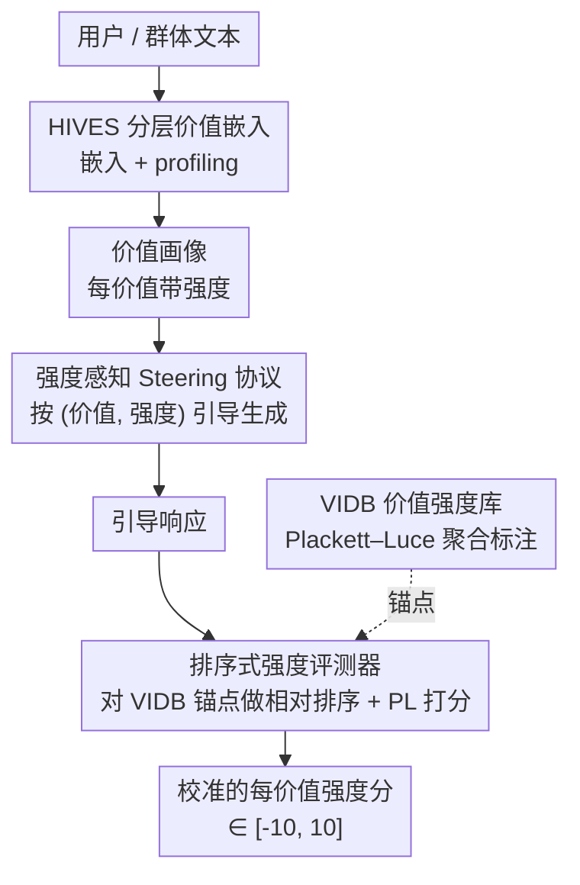

# VALUEFLOW: Toward Pluralistic and Steerable Value-based Alignment in Large Language Models

**会议**: ICML 2026  
**arXiv**: [2602.03160](https://arxiv.org/abs/2602.03160)  
**代码**: 待确认  
**领域**: 对齐RLHF / 价值对齐  
**关键词**: 价值对齐、价值多元、可控强度、排序式评测、层次化嵌入  

## 一句话总结
针对「用 LLM 给价值打绝对分极不稳定、且没法控制价值表达强度」的难题，本文提出 VALUEFLOW——一个把价值「抽取—评测—引导」串成一条流水线的统一框架，核心是分层价值嵌入空间 HIVES、用 Plackett–Luce 排序聚合得到的价值强度库 VIDB，以及基于锚点排序的强度评测器，并在 10 个模型、4 套价值理论上系统刻画了 LLM 的可引导性规律。

## 研究背景与动机
**领域现状**：让 LLM 对齐多元人类价值是核心挑战。主流偏好对齐（preference-based）方法捕捉的是表层、依赖语境的选择，而非支撑人类一致行为的深层动机原则。价值（values）作为跨情境、稳定的优先级，比偏好更能解释「人为什么这么选」，因此「基于价值的对齐」被认为是通往多元、可问责对齐的更有原则的路径。

**现有痛点**：价值对齐要做到「可引导」，需要端到端地——从用户/群体抽取价值表征、按指定价值与强度引导生成、再评测输出是否忠实反映目标配置。但现有工作在三个环节各自为政、各有硬伤：（1）**抽取**常依赖静态问卷或简单判断，捕捉不到开放对话信号，也很少编码价值的层次结构（抽象原则→中层维度→具体实例），导致「公平」和「平等」这类相近价值被混为一谈；（2）**评测**多只测价值「在不在」，而非「有多强」，且用词典或粗评分，跨模型比较极不稳定；（3）**引导**——LLM 到底能不能、能在多大程度上被可靠引导到「指定价值的指定强度」，几乎没人系统刻画过。

**核心矛盾**：用 LLM judge 给一段文本的价值强度打一个绝对标量分，看似自然，实则不可靠——同样的文本和价值，不同模型打出的分能从强负跨到强正，轻微换 prompt 就改变量级（论文 Figure 2 和 Table 1 量化了这点：评分法均值方差高达 12.6、符号翻转率 48%）。**绝对打分会随模型和语境漂移，但相对偏好（谁比谁更体现某价值）却高度一致**——这是全文的关键观察。

**本文目标**：把价值的抽取、评测、引导统一进一条共享主干，并第一次把「可引导性」从「方向对齐」扩展到「带刻度的强度控制」。

**切入角度**：既然绝对分不稳、相对序稳定，就用「排序」替代「打分」；既然价值有层次，就训一个层次化、跨理论统一的嵌入空间作为统一表征器。

**核心 idea**：用「对固定锚点库做相对排序 + Plackett–Luce 聚合」代替「LLM 绝对打分」来量化价值强度，并以同一套主干支撑抽取、引导、评测三件事。

## 方法详解

### 整体框架
VALUEFLOW 是一条「同一主干、三段复用」的端到端流水线：输入是用户或群体的文本，输出是带每价值强度的引导响应及其校准强度分。三段分别是——**价值抽取**：用 HIVES 把文本嵌入并 profiling 成一份带每价值强度的价值画像（value profile）；**强度感知引导**：给定 query，用画像引导生成，让响应在指定价值上达到指定强度，不同画像得到不同输出；**强度评测**：把每个引导响应拿去和价值强度库 VIDB 里的有标注锚点做相对排序打分，产出校准的每价值强度分。三大组件 HIVES、VIDB、排序评测器贯穿始终：HIVES 是统一表征器，VIDB 是参考锚点库，排序评测器把二者连起来。覆盖四套价值理论——Schwartz 基本价值论（SVT）、道德基础论（MFT）、义务（Duties）、权利（Rights），共 32 个价值。

### 关键设计

**1. HIVES：分层、跨理论统一的价值嵌入空间**

针对「抽取忽略层次、混淆相近价值」的痛点，HIVES 把每段文本先映射到各理论自身的层次结构（抽象维度→子维度→叶节点），再把异构理论整合进统一空间。层次映射用「人–LLM 协作」迭代分类：每层由 7 个 LLM 投票选最佳类别，≥5 票或领先 ≥2 票则采纳，否则带 Neutral 选项重问，未决案例交人工裁决，最终标签是从根到最后固定节点的路径。跨理论整合用 CLAVE 式概念池化（嵌入全部语料→聚类→LLM 总结簇例→去重过滤）得到 274 个跨理论锚点，再配一套用户友好的可读价值实例（158 义务、142 价值、107 权利）。训练分两阶段：**阶段 1 理论内对齐**用层次化对比损失，把层次前缀和方向标签（支持/反对）都相同的样本拉近，$\mathcal{L}_{\mathrm{hier}}=\frac{1}{V}\sum_{v=1}^{V}\mathcal{L}_v$，其中 $\mathcal{L}_v$ 是按 level-$v$ 前缀定义正样本的对比损失；**阶段 2 跨理论 + 锚点对齐**用 InfoNCE 把每个嵌入拉近其指派锚点，总目标 $\mathcal{L}=\mathcal{L}_{\mathrm{hier}}+\lambda_{\mathrm{ind}}\mathcal{L}_{\mathrm{ind}}+\lambda_{\mathrm{theory}}\mathcal{L}_{\mathrm{theory}}$。这样既保住单理论内部的层次几何，又让不同理论在共享坐标里可比。

**2. VIDB：用排序聚合而非绝对打分构建价值强度库**

这是把「相对序比绝对分稳」这一观察落地成数据资产的关键。对每个价值，从 ValueNet、MFRC、ValuePrism 等语料抽 10K 条文本（优先含目标价值标签、正负平衡），为每条采样 $k-1$ 条组成排序窗口，让 LLM 按价值定义对窗口内 $k$ 条排序；实践中主用成对比较（$k=2$，可靠性与标注效率最佳），每条文本重复 $m$ 次。所有排序用 **Plackett–Luce（PL）模型**聚合估计潜在强度：给定排序 $\pi=(\pi_1,\ldots,\pi_k)$，$P(\pi\mid\theta)=\prod_{j=1}^{k}\frac{\exp(\theta_{\pi_j})}{\sum_{l=j}^{k}\exp(\theta_{\pi_l})}$，最大化似然得到对模型打分偏差稳健的强度估计，最后归一到 $[-10, 10]$。每个价值**单独**做 PL，因此 VIDB 分是「沿目标价值语义轴的条件强度」，不是跨价值全局可比的统一刻度。再加一道「7-LLM panel 标记异常→≥2 个标记则人工复核」的合理性检查兜底。

**3. 基于锚点排序的强度评测器**

有了 VIDB 锚点，评测一段新响应 $x$ 在价值 $v$ 上的强度 $I_v(x)$ 就变成「让它和锚点排队」：每轮从 $D_v$ 采 $k-1$ 个锚点（三种采样策略 Random / Bucketed / Fixed，默认 Bucketed 分层覆盖 $[-10,10]$），judge LLM 给出从「最支持」到「最反对」的全序。复用 PL：把锚点效用固定为其 DB 分，只估计响应效用，再经每价值有界单调校准映射到 $[-10,10]$；若响应在所有窗口都排在全部锚点之下，就把强度设在最低锚点略下方，否则截断到观测范围。相比直接让 LLM 打绝对分，这套方法把「跨模型、跨 prompt 的漂移」转化成了「相对一个稳定锚点库的位置」，稳定性大幅提升（见实验 Table 1）。

**4. 强度感知的可控生成协议与 profile steering**

本文把「可引导性」正式定义为带强度的版本：模型 $M$ 可引导，当对 query $x$ 和价值-强度对集合 $\{(a_i,\lambda_i)\}$，响应满足 $I(y\mid x, a_i)\approx\lambda_i$。引导以推理时为主（prompt-based，辅以 activation-based），用两类 prompt：（1）**强度锚点**——在价值-锚点 prompt 基础上加显式强度提示（「+2: 强烈认同 / +1: 略认同 / −1: 略拒斥 / −2: 强烈拒斥」）；（2）**带强度的用户文本**——从 VIDB 选 LLM 与人类评分一致的代表性文本，按强度分桶各采 3 条。在群体对齐场景，还能用 HIVES 把某人群 5% 数据 profiling 成价值画像，再用画像 prompt 引导模型预测该群体最可能的回答（profile steering）。

## 实验关键数据

### 主实验
**排序法 vs 评分法（稳定性与人类一致性）**：对每个 SVT 价值采 10K 文本，多个 LLM 给 $[-10,10]$ 分，对比绝对评分与排序评测。

| 指标 | 评分法 | 排序法 |
|------|--------|--------|
| 均值方差 (↓) | 12.6 | **2.1** |
| 最大极差 (↓) | 7.1 | **2.8** |
| 符号翻转率 % (↓) | 48 | **29** |
| 换 prompt 变化 (↓) | 3.6 | **2.3** |
| 符号准确率 % (↑) | 82.5 | **86.8** |
| 成对排序准确率 % (↑) | 77.4 | **84.2** |

排序法把方差从 12.6 砍到 2.1、符号翻转从 48% 降到 29%，同时与 ValueNet 人类标注的一致性反升——印证了「相对序比绝对分稳」的核心假设。

**群体对齐（OpinionQA 预测准确率，部分模型）**：

| 模型 | 方法 | 平均准确率 % |
|------|------|--------------|
| Qwen3-32B | Default | 56.6 |
| Qwen3-32B | Modular Pluralism | 39.3 |
| Qwen3-32B | **Profile（本文）** | **59.1** |
| Phi-4-14B | Default | 51.2 |
| Phi-4-14B | **Profile（本文）** | **55.7** |
| GLM-4-32B | Default | 56.8 |
| GLM-4-32B | **Profile（本文）** | **59.1** |

profile steering 在多数维度优于「只给群体属性」的 default 和 Modular Pluralism；某些属性提升 >10%（如 Phi-4 的 Religion 44.5%→57.4%），且对解码温度 $T\in[0,0.8]$ 稳健、配对 t 检验显著（$t\approx16$–$20$，$p<10^{-60}$）。

### 可引导性规律分析
在 10 个模型、32 个价值、强度目标 $\{-2,-1,+1,+2\}$ 上引导（评测窗口 $k=6$、$m=3$，Gemma-3-27B 当 judge）：

| 视角 | 规律 | 代表 |
|------|------|------|
| 按模型 | 弱可引导 | Phi-4、Claude-4（尤其负向引导失灵） |
| 按模型 | 中等可引导 | Qwen3、GPT-4.1、gpt-oss、Mistral-3.1 |
| 按模型 | 强可引导 | Grok-4、Gemma-3、Gemini-2.5、GLM-4 |
| 按价值 | 难引导 | Conformity 等（双向都几乎不动，$|\Delta|\approx0$） |
| 按价值 | 极性不对称 | Hedonism、多数 rights（正向灵、负向钝） |
| 按价值 | 双向可动 | 多数 SVT 与 duty 价值 |

VIDB 强度分的人类对齐（2K 标量评分 + 1.5K 排序任务，25 名评测者）：本文评测器对人类评分的偏差仅 **1.4**，对各评分基线的胜率 **60.4%–78.7%**；成对评测人–机一致性 85.3%。

### 关键发现
- **排序式评测是全文地基**：把绝对打分换成对 VIDB 锚点的相对排序，方差、符号翻转、prompt 敏感度全面下降，且更贴人类——这让后续的强度引导分析有了可信刻度。
- **可引导性存在明显的「剂量–反应不对称」与「强锚点主导」效应**：负向引导普遍弱于正向；多价值引导时 +2 目标主导分布，负目标多被「衰减」而非「反转」；相似价值对近似线性叠加，对立价值对则呈现 trade-off（一维大降、另一维被压甚至略升）。
- **价值的可引导性高度依赖默认倾向**：当某价值默认认同已高（如 Security），引导主要表现为向下（天花板效应、正向空间有限）。
- **层次化组合引导可行**：通过构成价值（如用 caring + dependability 诱导 benevolence）间接引导，方向与量级大体匹配直接引导，偶尔还超过。

## 亮点与洞察
- **「用排序替代打分」是简洁而有力的范式转换**：它直击 LLM-as-judge 的绝对分漂移问题，且 Plackett–Luce 对每价值单独优化，把「跨价值不可比」这一诚实约束写进了方法本身，而非假装有统一刻度——这种对评测局限的自觉很难得。
- **三组件复用同一主干（HIVES→VIDB→评测器）**让抽取、引导、评测共享语义坐标，避免了各环节各用一套表征导致的口径不一致。
- **把「可引导性」量化成带刻度的科学问题**：用统一协议在 10 模型 × 32 价值上系统画出「弱/中/强可引导」三档和「难引导/极性不对称/双向」三类，这种「基础设施 + 大规模实证」的组合，给价值引导研究提供了可复用的工具和一批可证伪的经验规律。
- 可迁移的 trick：「分桶采样锚点 + 固定锚点效用、只估响应效用」的排序评测范式，可用于任何「绝对打分不稳但相对序稳」的主观维度评测（如安全、情感强度）。

## 局限与展望
- **重度依赖 LLM 投票与人–LLM 协作标注**：层次映射的 7-LLM 投票、VIDB 的排序标注、judge 的选择都引入了模型偏置，虽用人工兜底，但成本与可复现性是隐忧。
- **VIDB 分跨价值不可比**：每价值单独 PL 优化是诚实的，但也意味着无法直接比较「Kindness +8」和「Justice +8」的绝对强弱，限制了某些多价值聚合场景。
- **引导以 prompt-based 为主**：作者自承 activation-/embedding-based 引导控制力有限；强可引导模型在强负向引导下能把 Universalism、Benevolence 等亲社会价值大幅压低，这在安全上是双刃剑，论文虽提及 refusal 行为分析但未深入治理。
- **可改进方向**：把强度刻度做成跨价值可比、降低对大模型投票的依赖（如用更轻量的校准）、并把「强锚点主导」「极性不对称」这些规律反哺到训练时对齐，而非只停留在推理时引导。

## 相关工作与启发
- **vs 偏好对齐（preference-based / RLHF）**: 偏好法优化平均偏好、易抹平多样性且跨语境不稳；本文锚定在多元价值坐标系，把行为映射成可控引导的坐标，追求的是带强度的可问责对齐。
- **vs Modular Pluralism (Feng et al., 2024)**: 它用分别训练的模型做多元引导；本文用 HIVES 构建的价值画像做 profile steering，在 OpinionQA 上准确率更高，且无需为每群体单训模型。
- **vs 基于评分/词典的价值评测（如 ValueBench、直接 LLM 打分）**: 它们测「价值在不在」且打绝对分，跨模型不稳；本文用排序 + PL 聚合测「有多强」，方差与符号翻转大幅下降，与人类更一致。
- **vs UniVar (Cahyawijaya et al., 2025)**: 同为价值感知嵌入空间，但 HIVES 在层次排序一致性（>20%）与相似度相关性（>50%）上更优，且方向更解耦。

## 评分
- 新颖性: ⭐⭐⭐⭐⭐ 首个把价值抽取、强度评测、可控引导统一进一条主干，并把「带刻度可引导性」量化成科学问题。
- 实验充分度: ⭐⭐⭐⭐⭐ 10 模型 × 4 理论 × 32 价值的大规模实证，配人类研究与多价值组合分析，扎实。
- 写作质量: ⭐⭐⭐⭐ 框架清晰、动机层层递进，但组件多、附录依赖重，正文略密。
- 价值: ⭐⭐⭐⭐⭐ 提供可复用的评测/引导基础设施（HIVES、VIDB）和一批可证伪的引导规律，对多元价值对齐推动明显。

<!-- RELATED:START -->

## 相关论文

- [\[ICML 2026\] PICACO: Pluralistic In-Context Value Alignment of LLMs via Total Correlation Optimization](picaco_pluralistic_in-context_value_alignment_of_llms_via_total_correlation_opti.md)
- [\[ACL 2025\] Internal Value Alignment in Large Language Models through Controlled Value Vector Activation](../../ACL2025/llm_alignment/internal_value_alignment_in_large_language_models_through_controlled_value_vecto.md)
- [\[ICML 2026\] Towards Context-Invariant Safety Alignment for Large Language Models](towards_context-invariant_safety_alignment_for_large_language_models.md)
- [\[ICML 2026\] Toward Stable Value Alignment: Introducing Independent Modules for Consistent Value Guidance](toward_stable_value_alignment_introducing_independent_modules_for_consistent_val.md)
- [\[ICML 2026\] Steerable Cultural Preference Optimization of Reward Models](steerable_cultural_preference_optimization_of_reward_models.md)

<!-- RELATED:END -->
