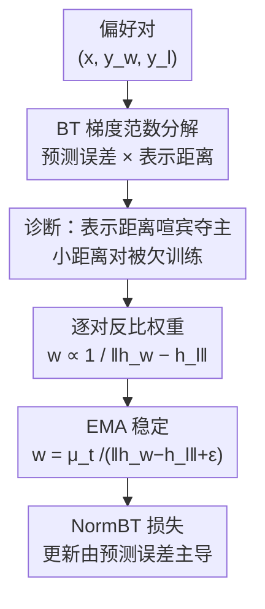

# When Distance Distracts: Representation Distance Bias in BT-Loss for Reward Models

**会议**: ICML 2026  
**arXiv**: [2512.06343](https://arxiv.org/abs/2512.06343)  
**代码**: 待确认  
**领域**: 对齐RLHF / 奖励模型  
**关键词**: 奖励模型, Bradley-Terry 损失, 梯度分析, 表示距离, RLHF

## 一句话总结
本文把 Bradley-Terry（BT）奖励模型损失的梯度范数拆成「预测误差 × 表示距离」两项，指出表示距离会喧宾夺主——表示相近的难分对即使排错也只得到微弱更新，于是作者提出 NormBT，用一个与表示距离成反比的逐对权重把更新强度重新交还给预测误差，在 RewardBench 的 Reasoning 类上平均提升 5% 以上。

## 研究背景与动机

**领域现状**：RLHF 是当前对齐大模型的主流框架，其中奖励模型（RM）充当人类偏好的代理：第一阶段在「chosen / rejected」成对偏好数据上训练 RM，第二阶段用它给策略模型的输出打分、提供 RL 信号。训练 RM 的标准目标几乎清一色是 BT 损失 $\mathcal{L}_{\text{BT}}=-\mathbb{E}[\log\sigma(r_w-r_l)]$，因为它简单、有概率解释。

**现有痛点**：人们默认 BT 更新的强度应该由「模型错得多严重」（预测误差）决定——排错得离谱就该大力纠正，排对了就该少动。但作者发现 BT 并不是这样工作的：同样错得一样离谱的两个偏好对，更新幅度却可能差很多，取决于一个与对错无关的量。

**核心矛盾**：BT 梯度范数同时被两个因素决定——预测误差与「这对回答在最后一层表示空间里的距离」。两者相乘，意味着表示相近的对天然只能拿到弱更新，表示相远的对天然拿到强更新，哪怕前者排错、后者排对。这正好打在最需要细粒度区分的地方：Reasoning 类里的 chosen / rejected 往往只差一个逻辑错误、表面几乎一样，表示距离最小，于是被系统性地欠训练。

**本文目标**：定量刻画表示距离偏置有多严重、在真实偏好数据里多普遍，并设计一个轻量、即插即用、不改架构、几乎零开销的修正，让更新强度重新由预测误差主导。

**核心 idea**：既然多出来的麻烦是表示距离这个乘性因子，那就在损失里乘一个与表示距离成反比的逐对权重把它「除掉」——这就是 NormBT。

## 方法详解

### 整体框架
NormBT 不是一个新模型，而是对 BT 损失的一处梯度级修正。作者先做诊断（拆梯度范数、用 RewardBench 实测验证偏置真实存在且普遍），再据此开药方（用最后一层表示距离作代理、加 EMA 稳定，逐对重加权）。整条逻辑是「先证明病因是表示距离，再用一个反比权重把病因约掉」。

### 关键设计

**1. BT 梯度范数分解：把更新强度拆成「预测误差 × 表示距离」**

这是全文的诊断基石，也是后续方法的合法性来源。记 $d=r_w-r_l$ 为 chosen 与 rejected 的奖励差，BT 单样本梯度是 $\nabla_\theta\mathcal{L}_{\text{BT}}=(\sigma(d)-1)\nabla_\theta(r_w-r_l)$。作者在标准参数化 $r_\theta(x,y)=\mathbf{w}_s^\top h_\phi(x,y)+b_s$（LLM 主干 $\phi$ + 线性打分头 $\mathbf{w}_s$）下，把梯度范数对主干和打分头分别求出来：打分头部分精确等于 $|\sigma(d)-1|\cdot\|h_w-h_l\|$，主干部分在局部 $L_g$-Lipschitz 假设下被 $\|h_w-h_l\|$ 上界控制。合起来得到关键分解：

$$\|\nabla_\theta\mathcal{L}\|=\underbrace{|\sigma(d)-1|}_{\text{预测误差}}\cdot\underbrace{\big(k\,\|h_w-h_l\|\big)}_{\text{表示距离}},\quad k=\sqrt{1+(L_g\|\mathbf{w}_s\|)^2}.$$

这一式子直白地说明：更新幅度是两项相乘。两个预测误差 $|\sigma(d)-1|$ 相同的对，表示距离 $\|h_w-h_l\|$ 小的那个梯度近乎相互抵消、只得弱更新，距离大的那个得强更新。这与「更新该由对错决定」的直觉相矛盾，正是偏置的根源。

**2. 偏置的实证：用 RewardBench 证明它普遍且打在难分对上**

光有公式不够，作者要证明这不是孤例。他们做了两个量化分析：其一，把偏好对按预测误差 $d$ 分箱，**控住预测误差不变**，发现箱内梯度范数仍随表示距离系统性增大——这是「即使一样错」距离也主导更新的直接证据。其二，跨 RewardBench 四个类别（Chat / Chat-Hard / Safety / Reasoning）统计梯度范数与表示距离，发现 Reasoning 类梯度范数最小、表示距离也最小，两者高度吻合。也就是说，最需要细粒度判别的 Reasoning（chosen 与 rejected 常常只差一个逻辑/代码错误、表面几乎一致）恰恰被 BT 给了最弱的学习信号。这把「表示距离偏置」从理论隐患坐实为真实数据上的系统性欠训练。

**3. 表示距离代理 + 逐对反比权重：把更新强度还给预测误差**

理想权重是 $w_i=\text{sg}(1/\|\nabla_\theta(r_w-r_l)\|)$（$\text{sg}$ 为 stop-gradient），乘上去后梯度范数恰好简化为 $|\sigma(d)-1|$，完全由预测误差决定。但逐样本梯度范数要额外反传、不可扩展。设计 1 的分解恰好给了出路：$\|\nabla_\theta(r_w-r_l)\|\propto\|h_w-h_l\|$，于是直接用前向就能拿到的最后一层表示距离作代理，定义 $\tilde{w}_i=\text{sg}(1/\|h_w-h_l\|)$。这个代理有三个好处：高效（前向即得，无额外计算）、有根据（在线性打分头上是精确而非近似，见式 6）、可解释（表示相近往往就是表面/语义接近的细粒度难分对，上调它们的权重正好补上欠训练，而高度不相似的对被下调，避免过分强调表面差异）。

**4. EMA 尺度稳定：让权重对训练中的表示尺度漂移免疫**

直接用 $1/\|h_w-h_l\|$ 有个隐患：训练过程中嵌入的整体尺度会漂移，原始权重值会跟着漂、无意中收紧或放松归一化。作者用批统计的指数滑动平均（EMA）来定标：设 $\mu_t$ 为表示差范数均值的 EMA，权重定义为 $\tilde{w}_t(y_w,y_l)=\mu_t/(\|h_w-h_l\|+\epsilon)$，其中 $\mu_{t+1}\leftarrow\beta\mu_t+(1-\beta)\hat{\mu}_t$，默认 $\beta=0.9$。这样做不是把表示距离分量彻底抹掉，而是相对当前批均值重缩放每个对——权重平均维持在 1 附近，有效损失尺度保持稳定，对主干表示尺度漂移免疫。最终目标为：

$$\mathcal{L}_{\text{NormBT}}(\theta)=-\mathbb{E}_{s\sim D}\big[\tilde{w}(y_w,y_l)\cdot\log\sigma(r_w-r_l)\big].$$

### 损失函数 / 训练策略
NormBT 是对 BT 的 drop-in 改造：保留概率基础、不改架构、无需任何外部标注（不像 margin 类方法要真值 reward margin）。唯一新增的是逐对权重 $\tilde{w}$ 与一个 EMA 标量 $\mu_t$，计算与显存开销可忽略。实验中对所有 BT 基线都做了学习率等超参的网格搜索并报告最优结果，保证对比公平。

## 实验关键数据

### 主实验
在两个主干（gemma-2b-it、Llama-3.2-3B-Instruct）× 两个数据集（Unified-Feedback 80K、Skywork-Reward-80K）共四个设置上评测 RewardBench。NormBT 在四个设置上一致优于 BT 基线，且增益集中在表示距离最小的 Reasoning 类（平均 +5% 以上）。

| 设置（主干 / 数据集） | 方法 | Reasoning | Average |
|------|------|-----------|---------|
| gemma-2b / Unified-Feedback | BT 基线 | 75.41 | 72.25 |
| gemma-2b / Unified-Feedback | **NormBT** | **80.71** | **73.57** |
| Llama-3.2-3B / Unified-Feedback | BT 基线 | 71.70 | 75.24 |
| Llama-3.2-3B / Unified-Feedback | **NormBT** | **76.93** | **76.96** |
| gemma-2b / Skywork-80K | BT 基线 | 77.46 | 78.63 |
| gemma-2b / Skywork-80K | **NormBT** | **80.71** | **80.12** |
| Llama-3.2-3B / Skywork-80K | BT 基线 | 67.05 | 80.31 |
| Llama-3.2-3B / Skywork-80K | **NormBT** | **74.60** | **81.48** |

### 对比与下游分析

| 对比项 | 关键发现 | 说明 |
|------|---------|------|
| vs BT+Margin / Margin-out | 不稳定，未一致超过 BT | 只改预测误差项、不修表示距离偏置，且依赖高质量真值 margin，可能过拟合噪声标注 |
| vs BT+Label Smoothing | 反而掉点，Reasoning 最明显（75.41→72.28） | 均匀压低预测误差项、全局削弱更新，把本就微弱的小距离对更新进一步削弱 |
| Best-of-N（下游 RLHF） | NormBT gold score 一致最高，叠加到各 BT 变体上还能再涨 | 对 label smoothing 提升最大，因为它先削弱、NormBT 再补回小距离对 |
| 增益来源分析（按距离分箱） | 最显著增益在「小距离」区间 | 与理论一致：BT 在此区欠训练，NormBT 把更新还给预测误差；中/大距离区基本持平或小幅提升 |

### 关键发现
- NormBT 的增益与「表示距离最小的类别」高度对应——Reasoning 类提升最大，验证了「小距离被欠训练」这一诊断。
- margin 类方法只动预测误差项、不碰表示距离，因此无法根治结构性偏置；NormBT 不需任何外部信号就更可靠、更普适。
- 在 Safety 等大距离类别上偶有轻微下降（如 78.65→77.97），说明下调大距离对会略有代价，但整体是「以小距离区的大涨换大距离区的微跌」，净收益为正。

## 亮点与洞察
- **把一个看似纯优化的损失拆出可解释的「干扰项」**：梯度范数 = 预测误差 × 表示距离，这个分解既是诊断又是药方的依据，干净利落。值得迁移到任何 pairwise/对比损失的更新动力学分析。
- **代理选得巧**：用前向就能拿到的最后一层表示距离近似逐样本梯度范数，而且在线性打分头上是精确等式而非近似——既省算力又有理论支撑。
- **「难分对 = 小表示距离 = 最该被重视却被压制」这条因果链很有画面感**：Reasoning 对只差一个逻辑错误、表面雷同，恰恰最重要也最易被 BT 忽略，NormBT 的反比加权直觉上完全对症。

## 局限与展望
- 分解依赖局部 $L_g$-Lipschitz-smooth 假设来界定主干项，真实深网的 Lipschitz 常数难以精确刻画，上界的紧致程度存疑（⚠️ 以原文为准）。
- 大距离类别（如 Safety）存在轻微下降，说明「下调大距离对」并非完全无害；如何在不牺牲大距离对的前提下只补小距离对，仍有空间。
- 实验主干规模较小（2B / 3B），更大模型、更多样的偏好分布下表示距离偏置的强度与 NormBT 的收益是否保持，需进一步验证。

## 相关工作与启发
- **vs BT + Margin / Margin-out**：它们把真值 reward margin 注入预测误差项来调更新强度，本文则直接归一化表示距离这个乘性因子；区别在于前者依赖外部高质量标注且只修了「误差侧」，本文不需任何外部信号、修的是「距离侧」这个真正的结构性偏置。
- **vs BT + Label Smoothing**：label smoothing 用软标签均匀压低预测误差项，全局削弱更新，正好把本就微弱的小距离对更新削得更狠；NormBT 反其道而行，专门上调小距离对。
- **vs 一般对比/偏好学习**：本文揭示的「更新被表示几何而非任务对错主导」是 pairwise 目标的通病，这一视角可启发对 DPO 等其它偏好优化目标的梯度动力学审视。

## 评分
- 新颖性: ⭐⭐⭐⭐ 把 BT 梯度拆出「表示距离」干扰项并给出反比归一化解法，视角清晰、切口小而准。
- 实验充分度: ⭐⭐⭐⭐ 两主干两数据集 + RewardBench + Best-of-N 下游 + 分箱分析，证据链完整，但模型规模偏小。
- 写作质量: ⭐⭐⭐⭐ 诊断—验证—解法三段逻辑顺畅，公式与直觉配合到位。
- 价值: ⭐⭐⭐⭐ 即插即用、零额外标注、几乎零开销，对 RLHF 奖励建模有直接实用价值。

<!-- RELATED:START -->

## 相关论文

- [\[AAAI 2026\] When Human Preferences Flip: An Instance-Dependent Robust Loss for RLHF](../../AAAI2026/llm_alignment/when_human_preferences_flip_an_instance-dependent_robust_loss_for_rlhf.md)
- [\[AAAI 2026\] Exploring the Effects of Alignment on Numerical Bias in Large Language Models](../../AAAI2026/llm_alignment/exploring_the_effects_of_alignment_on_numerical_bias_in_large_language_models.md)
- [\[ICML 2026\] The Realignment Problem: When Right becomes Wrong in LLMs](the_realignment_problem_when_right_becomes_wrong_in_llms.md)
- [\[ACL 2026\] Mitigating Selection Bias in Large Language Models via Permutation-Aware GRPO](../../ACL2026/llm_alignment/mitigating_selection_bias_in_large_language_models_via_permutation-aware_grpo.md)
- [\[ACL 2026\] Topology-Enhanced Alignment for Large Language Models: Trajectory Topology Loss and Topological Preference Optimization](../../ACL2026/llm_alignment/topology-enhanced_alignment_for_large_language_models_trajectory_topology_loss_a.md)

<!-- RELATED:END -->
