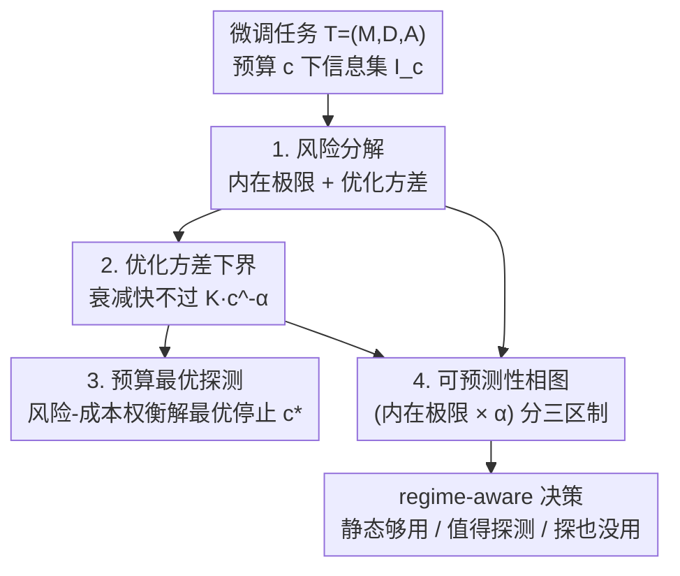

# A Risk Decomposition Framework for Pre-Hoc Fine-Tuning Prediction

**会议**: ICML2026  
**arXiv**: [2606.17649](https://arxiv.org/abs/2606.17649)  
**代码**: 未公开  
**领域**: LLM效率 / 微调成本预测 / 不确定性量化  
**关键词**: pre-hoc 预测, 风险分解, 优化方差, 幂律衰减, 最优停止  

## 一句话总结
微调 LLM 又贵又难预测，本文把「在开训前/早期就预测微调最终性能」这件事形式化成一个信息约束下的随机估计问题，把预测风险分解成**不可约的内在极限（数据-模型静态兼容性）+ 可约的优化方差**，证明优化方差的衰减速率有一个 $c^{-\alpha}$ 的必然下界（再强的预测器也快不过它），由此推出预算最优的探测停止条件，并用「内在极限 × 衰减率」两个轴把任务组织成 Static-Sufficient / Dynamic-Critical / Noise-Dominant 三个可预测性区制，解释了为什么浅探测在 SST-2 上够用、在 GSM8K 上却失败。

## 研究背景与动机

**领域现状**：微调大模型已成把基础模型适配到下游任务的主流范式，但它又贵又不确定——同样的配置因为预训练先验、数据特性、随机优化三者交互，可能跑出天差地别的结果，大量算力常常只换来微小提升、性能退化甚至灾难性遗忘。于是出现了 **pre-hoc 微调预测**：给定预训练模型、数据集、优化算法，只用开训前或训练极早期的信息去预测最终性能，从而决定要不要继续训、先训哪个配置、投多少预算。

**现有痛点**：现有方法基本是启发式的。代理模型法（proxy-based）靠静态相关，分布漂移就失效；早期探测法（early-stage probing）把「探测多深」当成一个离散超参拍脑袋定；而且预测器几乎都是黑盒回归，把预测误差当成一个**不可分的整体量**，对「不确定性怎么随算力演化」「误差到底来自哪」没有任何结构性洞察，更谈不上原则性的资源分配。

**核心矛盾**：微调的不可预测性其实来自**两个本质不同的源头**——一个是静态的数据-模型兼容性决定的**内在极限**（哪怕看到完整训练轨迹也消不掉），一个是随机优化引入的、可以靠观测轨迹消解的**优化方差**。黑盒回归把这两者糊成一团，所以既说不清「该不该探测」，也说不清「探测多深才划算」。

**本文目标**：把 pre-hoc 预测从「黑盒回归」升级成「风险分解」视角（图 1 的 perspective shift），并回答三件事——预测误差的结构是什么？优化方差最快能多快衰减？给定算力预算，探测到哪一步停最划算？

**核心 idea**：把探测重新理解为「**消解优化引入的不确定性**」而非「提取特征」，用全方差律把 Bayes 最优风险拆成 内在极限 + 优化方差，再用随机逼近理论给优化方差的衰减套一个必然的幂律下界，从而把「探测预算」变成一个有原则的最优停止问题。

## 方法详解

> 这是一篇**纯理论 + 结构性验证**的论文：不提新架构、不提新训练目标，核心产物是一个分解、一个下界、一个停止条件和一张相图。

### 整体框架
作者把一次微调任务记成三元组 $\mathcal{T}=(M,D,\mathcal{A})$（预训练模型、下游数据、随机优化算法），执行它得到一个随机的标量性能 $R$。预测器 $f$ 在算力预算 $c$ 下只能看到信息集 $\mathcal{I}_c=\{X_s, X_d^{(c)}\}$（静态信息 $X_s$ 零边际成本 + 探测到 $c$ 步揭示的动态轨迹 $X_d^{(c)}$），信息随算力单调增长 $\mathcal{I}_c\subseteq\mathcal{I}_{c'}$。整条逻辑链是：先用全方差律把 Bayes 最优风险**分解**成不可约的内在极限和可约的优化方差；再证明优化方差的衰减**快不过** $c^{-\alpha}$；再把「再探测一步的收益 vs 成本」写成最优停止，解出闭式最优探测深度；最后用 $(\mathcal{L}_{int}, \alpha)$ 两个量把任务摊到一张**可预测性相图**上分成三区。

### 关键设计

**1. 风险分解：把预测误差切成「不可约内在极限」和「可约优化方差」**

这是整个框架的地基。对 Bayes 最优预测器 $f^*(\mathcal{I}_c)=\mathbb{E}[R\mid\mathcal{I}_c]$，由全方差律可得（命题 4.1）

$$\mathcal{L}(c)=\underbrace{\mathbb{E}[\mathrm{Var}(R\mid\mathcal{I}_\infty)]}_{\mathcal{L}_{int}}+\underbrace{\mathbb{E}[\mathrm{Var}(R\mid\mathcal{I}_c)-\mathrm{Var}(R\mid\mathcal{I}_\infty)]}_{\mathcal{V}_{opt}(c)}.$$

其中 $\mathcal{L}_{int}$ 是**内在极限**——哪怕拿到完整优化轨迹 $\mathcal{I}_\infty$ 仍残留的不确定性，来自静态数据-模型不匹配和任务固有随机性，与探测预算 $c$ 无关、加再多算力也消不掉；$\mathcal{V}_{opt}(c)$ 是**优化方差**——只看到轨迹有限前缀带来的多余不确定性，随 $c$ 单调非负递减，是**唯一能被探测影响**的部分。这个分解还有信息论解读：探测能减少 $\mathcal{V}_{opt}(c)$ 当且仅当条件互信息 $I(R;X_d^{(c)}\mid X_s)>0$，即轨迹里有静态先验没有的关于 $R$ 的信息；若轨迹完全由静态信息决定，探测就是白探。这一步把「探测到底在做什么」讲清了：它在揭示信息、消解可约方差，而不是黑盒地提特征。

**2. 优化方差的幂律衰减下界：再强的预测器也快不过 $c^{-\alpha}$**

分解告诉我们只有 $\mathcal{V}_{opt}(c)$ 可约，那它最快能多快被消掉？作者不去建模 LLM 微调的完整非凸轨迹，而是退一步求一个**保守的速率限制包络**：在优化进入「局部规则」区制（从高质量预训练解出发、初始化邻域内有信息梯度、评测指标 $R$ 对参数局部 Lipschitz）后，由随机逼近理论得（命题 5.1）

$$\mathcal{V}_{opt}(c)\;\gtrsim\;K\,c^{-\alpha}\quad (c\to\infty),$$

存在常数 $K>0$ 和指数 $\alpha>0$。证明草图：在局部稳定区，参数不确定性的收缩速率由步长衰减和梯度噪声结构决定——例如多项式衰减步长 $\eta_c\propto c^{-\rho}$（$\rho>1/2$）下，参数迭代协方差 $\mathrm{Cov}(\theta_c)=\Omega(c^{-(2\rho-1)})$，再由 $R(\theta)$ 局部光滑经 Delta 方法把这个多项式衰减传到 $R$ 的波动上，得到幂律包络。关键含义是：**噪声在典型随机优化里只被多项式地抑制，所以一旦进入速率受限阶段，优化结局的不确定性不可能任意快地塌缩**。这里的 $\alpha$ 不是优化器或模型族的普适常数，而是「任务-优化器对」的**有效信息揭示速率**——$\alpha$ 大 = 浅探测就能揭示大部分信息，$\alpha$ 小 = 要长探测才能消解。

**3. 预算最优探测：把「探多深」解成最优停止的闭式解**

既然优化方差边际递减，探测自然是个算力约束下的最优停止问题。作者不把预算当硬约束，而写成风险-成本权衡（式 6）$\min_{c\ge0}\mathcal{L}_\mathcal{T}(c)+\gamma C(c)$，其中 $\gamma$ 把算力折算成等价风险惩罚。代入分解 $\mathcal{L}_\mathcal{T}(c)=\mathcal{L}_{\mathcal{T},int}+\mathcal{V}_{opt}(c)$ 和幂律包络 $\mathcal{V}_{opt}(c)\approx Kc^{-\alpha}$，任何内部最优 $c^\star$ 满足「边际收益 = 边际成本」的均衡条件（定理 6.1）$|d\mathcal{V}_{opt}/dc|_{c^\star}=\gamma C'(c^\star)$；在线性成本 $C(c)=C_s+\lambda c$ 下解出闭式

$$c^\star=\left(\frac{\alpha K}{\gamma\lambda}\right)^{\frac{1}{\alpha+1}}.$$

注意内在极限 $\mathcal{L}_{\mathcal{T},int}$ 是常数，不进求导，所以**最优探测深度只由优化方差的动力学 $(\alpha,K)$ 和成本参数决定**。落地上作者给了 Algorithm 1 的离线标定：在若干探测深度 $\{c_i\}$ 跑轻量探测、算一个能保留相对衰减行为的不确定性代理 $\widehat{U}(c_i)$，然后联合拟合 $\widehat{U}(c)\approx\mathcal{L}_{\mathcal{T},int}+Kc^{-\alpha}$（log-log 回归，避免顺序插值偏差），再代入闭式得 $\widehat{c}^\star$。这一步把启发式的「固定步数探测」换成了有原则的、随任务动力学自适应的预算分配。

**4. 可预测性相图：用「内在极限 × 衰减率」把任务分成三区**

把任务的可预测性归结为两个机制——内在模糊度 $\mathcal{L}_{int}$（横轴）和信息揭示速率 $\alpha$（纵轴），任务被摊到二维相空间，自然分出三个区制，且每个区对应定理 6.1 均衡条件随 $(\mathcal{L}_{int},\alpha)$ 变化的不同解结构：**Static-Sufficient（静态够用，偏差主导）**——$\alpha$ 大或内在极限主导，结局基本由数据-模型静态属性决定，探测几乎无增益（如 SST-2、GLUE 类分类）；**Dynamic-Critical（动态关键，方差主导）**——内在模糊度低但 $\alpha$ 小，信息揭示慢，结局对优化轨迹敏感、早期常有长平台（如 GSM8K 算术推理、复杂代码生成，grokking 也属此类），$c^\star$ 大、值得深探；**Noise-Dominant（噪声主导，内在受限）**——$\mathcal{L}_{int}$ 大，再怎么探总风险都下不来（标签噪声大、严重域偏移、模型欠定）。这张相图给了一个统一解释：浅探测在 SST-2 上成功不是因为预测器更强，而是任务落在静态够用区；同样的策略在 GSM8K 上失败也不是方法烂，而是任务落在动态关键区、探测深度不够——**预测器的失败应被理解为「区制错配」而非估计器缺陷**。

### 损失函数 / 训练策略
本文不训练新模型，没有损失函数。唯一的「训练侧」流程是 Algorithm 1 的离线标定：多探测深度跑轻量探测 → 算不确定性代理 → log-log 联合拟合 $(\alpha,K,\mathcal{L}_{int})$ → 闭式得最优探测深度。这些拟合量是「任务级动力学描述子」，用于离线分析、benchmark、探测预算设计，而非部署时要逐实例精确恢复的隐变量。

## 实验关键数据

实验目标是**验证结构性预言而非某个预测器的绝对精度**：(i) 优化方差不能任意快衰减、受任务相关 $\alpha$ 支配；(ii) 任务会按 $(\mathcal{L}_{int},\alpha)$ 组织成三区；(iii) 最优探测是 regime 依赖的停止结构而非固定启发预算。协议：探测轴 $c$ = 探测优化步数，每个任务每个深度跑 $N=1500$ 个不同随机种子的独立微调，得到最终结局的经验分布，再算可观测的不确定性代理（run-to-run 方差）。

### 主验证：幂律衰减与区制分离

| 区制 | 不确定性衰减行为（log-log） | 代表任务 |
|---|---|---|
| Static-Sufficient | 收缩极快，$\alpha$ 大，探测信息几乎立刻耗尽 | SST-2、GLUE 分类 |
| Dynamic-Critical | 衰减明显慢，$\alpha$ 小，不确定性跨大范围预算持续 | GSM8K、复杂代码生成 |
| Noise-Dominant | 被有效内在地板主导，探多深都降不下来 | 高标签噪声 / 严重域偏移任务 |

图 2 显示三区在拟合区间内 log-log 关系近似线性，与幂律预言一致；图 3 的经验相图里，三区在 $(\mathcal{L}_{int},\alpha)$ 平面上结构性分离——静态够用区聚在「低内在模糊 + 快衰减」，动态关键区是「低内在模糊 + 慢衰减」，噪声主导区主要沿内在极限轴向高模糊度铺开。

### 效率前沿与失败案例

| 现象 | 区制 | 说明 |
|---|---|---|
| 边际收益几乎立刻消失 | Static-Sufficient | 再探测只徒增随机优化方差，浅/零探测即可 |
| 边际收益跨大范围持续 | Dynamic-Critical | 深探测划算，浅探测会低估不确定性、预测不稳 |
| 边际收益始终可忽略 | Noise-Dominant | 内在地板压制，探测无效，预测分数应附高不确定性 |

### 关键发现
- **$\alpha$ 是「动态难度」的有意义刻画**：它把「为什么固定步数探测跨任务表现飘忽」解释清楚了——衰减率不同的任务，同一探测深度揭示的信息量天差地别。
- **失败 = 区制错配**：GSM8K 上浅探测失败不是预测器有缺陷，而是探测深度相对其慢动力学不够；SST-2 上深探测无益是因为静态描述子已饱和。这把「预测器好坏」的讨论换成了「探测预算 vs 任务动力学是否匹配」。
- **静态信号与早期轨迹信号是互补而非竞争**：静态代理（数据集统计、参考模型困惑度、兼容性分）在静态够用区最有用；早期轨迹信号（loss 衰减、梯度稳定性、短程验证）在可约优化方差仍大时才有价值，相图给了用哪种信号的判据。

## 亮点与洞察
- **视角转换本身就是贡献**：从「黑盒回归预测最终分数」转到「结构性分解预测风险」，让「误差来自哪、能不能靠算力消、该投多少算力」三件事第一次可以分开回答——这种把模糊整体量拆成「不可约 + 可约」的套路可迁移到很多 cost-aware 的预测/决策问题。
- **下界比上界更有用**：作者不去拟合一个乐观的衰减曲线，而是证明优化方差**快不过** $c^{-\alpha}$，这是个「无论用什么预测器都绕不过」的硬约束，直接说明 pre-hoc 预测本质是边际递减的预算分配问题。
- **相图把一堆互相矛盾的经验观察统一了**：浅探测在 SST-2 成功、在 GSM8K 失败，过去被当成方法学差异，本文用「任务落在哪个区」一次解释，且给出 regime-aware 的实操建议（静态够用就别探、动态关键就多探、噪声主导就标注高不确定性）。

## 局限与展望
- **不建模完整非凸轨迹**：幂律下界只在「局部规则、速率受限」区制成立，作者明确不声称微调轨迹普遍服从某条衰减律，$\alpha$ 也不是物理常数；早期的瞬态、loss 突变、任务特定适应阶段不在刻画范围内。
- **量是离线描述子，不是在线可恢复量**：$(\alpha,K,\mathcal{L}_{int})$ 用于离线标定和 regime 级决策支持，部署时不保证每个实例都能精确恢复；换超参、模型族、训练协议，任务区制还可能漂移。
- **验证停在「不确定性代理」层面**：实验用 run-to-run 方差代理而非真实 Bayes 风险，每任务每深度 1500 次独立微调是受控离线设定，部署时并不重复探测；框架是决策支持工具，不能替代下游严谨评测。
- **缺与现有预测器的端到端精度对比**：论文有意只验证结构性预言，没给「用本框架选预算后预测精度比启发式高多少」的直接数字。

## 相关工作与启发
- **vs 代理模型法 / 早期探测法（Anugraha 2024、Zhu 2022）**：它们靠静态相关或把探测深度当固定超参、预测器是黑盒回归，本文给出「探测深度该多大」的原则性闭式条件，并用风险分解解释这些方法各自捕捉了哪部分风险。
- **vs 经验 scaling laws（Kaplan 2020、Hoffmann 2022）**：scaling law 刻画性能分布的**一阶矩**（期望性能随算力/数据幂律），本文关注**二阶矩**（微调结局的方差及其衰减），把「不确定性如何随算力消解」补上。
- **vs 训练动力学/信息瓶颈研究**：这些工作多是描述性的（critical learning periods、梯度噪声结构），本文给出规范性的预算分配框架——不只是描述「结局早期就被决定」，而是回答「该投多少探测算力」。

## 评分
- 新颖性: ⭐⭐⭐⭐⭐ 把 pre-hoc 微调预测重述为风险分解 + 衰减下界 + 相图，视角和理论都新
- 实验充分度: ⭐⭐⭐ 结构性验证（幂律、三区、边际收益）扎实，但缺端到端预测精度对比、停在代理量
- 写作质量: ⭐⭐⭐⭐ 逻辑链（分解→下界→停止→相图）干净，理论陈述清楚
- 价值: ⭐⭐⭐⭐ 给「微调前要不要训、训多久」提供了原则性决策框架，省算力潜力大

<!-- RELATED:START -->

## 相关论文

- [\[ICML 2026\] TuneAhead: Predicting Fine-tuning Performance Before Full Training Begins](tuneahead_predicting_fine-tuning_performance_before_full_training_begins.md)
- [\[ICLR 2026\] TokenSeek: Memory Efficient Fine Tuning via Instance-Aware Token Selection](../../ICLR2026/llm_efficiency/tokenseek_memory_efficient_fine_tuning_via_instance-aware_token_selection.md)
- [\[ICLR 2026\] When Does Divide and Conquer Work for Long Context LLM? A Noise Decomposition Framework](../../ICLR2026/llm_efficiency/when_does_divide_and_conquer_work_for_long_context_llm_a_noise_decomposition_fra.md)
- [\[ICML 2026\] ReMoE: Boosting Expert Reuse through Router Fine-Tuning in Memory-Constrained MoE LLM Inference](remoe_boosting_expert_reuse_through_router_fine-tuning_in_memory-constrained_moe.md)
- [\[ACL 2026\] Small Data, Big Noise: Adversarial Training for Robust Parameter-Efficient Fine-Tuning](../../ACL2026/llm_efficiency/small_data_big_noise_adversarial_training_for_robust_parameter-efficient_fine-tu.md)

<!-- RELATED:END -->
