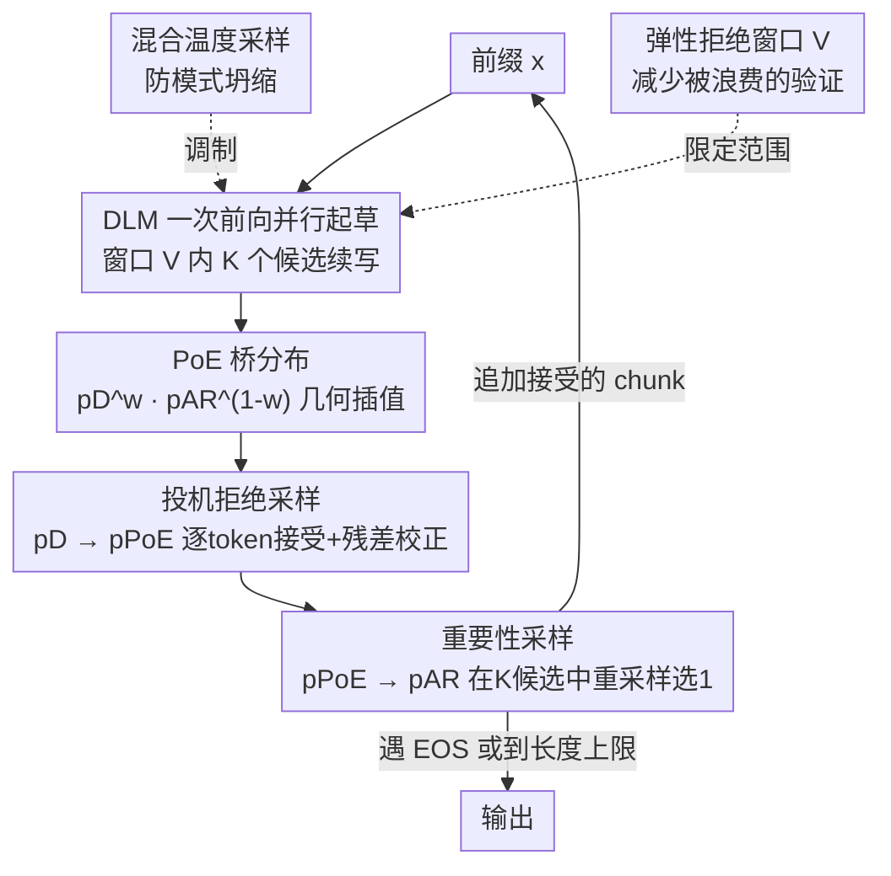

# Diffusion Language Model Parallel Decoding via Product-of-Experts Bridge

**会议**: ICML2026  
**arXiv**: [2606.08048](https://arxiv.org/abs/2606.08048)  
**代码**: https://github.com/juntongshi48/poe-bridge  
**领域**: LLM效率 / 扩散语言模型并行解码  
**关键词**: 扩散语言模型、并行解码、Product-of-Experts、投机采样、重要性采样

## 一句话总结
扩散语言模型（DLM）能并行解码但质量差，直接用蒙特卡洛把 DLM 草稿校正到自回归（AR）目标又因分布差距太大而代价高昂；本文 PoE-Bridge 在 DLM 与 AR 之间插入一个 Product-of-Experts 中间桥分布，把「DLM→AR」这步难校正拆成「DLM→PoE→AR」两步易校正，配合混合温度采样与弹性拒绝窗口，在数学推理与代码任务上比标准 DLM 解码提速 5×、并恢复至少 95% 的 AR 精度。

## 研究背景与动机

**领域现状**：自回归（AR）模型逐 token 串行生成，质量强但延迟高、并行度差；扩散语言模型（DLM）通过迭代式同时刷新多个 token 来并行解码，速度有潜力但质量明显落后于强 AR 模型。

**现有痛点**：DLM 质量差的根源是**并行解码所依赖的条件独立假设**——同一步生成的多个 token 被独立建模、而非联合建模，于是想真正吃到并行加速就要付出明显的质量损失。一个自然方向是「DLM 当快速 proposal、强 AR 当 target 来验证/校正」：但两种朴素蒙特卡洛都会崩。**拒绝采样**下 DLM 与 AR 分布失配大、频繁拒绝，解码退化成近乎串行；**重要性采样**下需要海量候选才能采到好样本，候选预算一小，重采样往往只是挑出「最不离谱的那条 DLM 续写」，而非真正忠于 AR 的样本。

**核心矛盾**：两种朴素方法失败的共同根因是同一个——**并行 DLM proposal 与强 AR target 之间的分布失配太大**。校正这一大步要么拒绝率高、要么权重方差大。

**本文目标**：要既保住 DLM 的并行解码优势，又生成得像 AR 解码一样忠实。

**切入角度**：与其硬校正这一大步，不如**在中间塞一个分布**，把大步拆成两小步。注意到 AR 模型「采样慢但给定前缀打分快」，正好用来评估 DLM 的并行草稿。

**核心 idea**：用 DLM 与 AR 的 **Product-of-Experts（PoE）几何插值** $p_{\mathrm{PoE}}(\mathbf{x})\propto p_D(\mathbf{x})^{w}p_{\mathrm{AR}}(\mathbf{x})^{1-w}$ 当桥，把难的 $p_D\to p_{\mathrm{AR}}$ 校正分解为两步更容易的 $p_D\to p_{\mathrm{PoE}}\to p_{\mathrm{AR}}$。

## 方法详解

### 整体框架

PoE-Bridge 是一个**解码期（inference-time）框架**，不重新训练任何模型，只改采样流程。它用一个 DLM（Dream-7B）当并行 proposal、一个任务专精 AR 模型（Qwen2.5-Math/Coder-7B）当 target，二者共享 tokenizer。为了让 DLM 草稿能逐 token 和 AR 似然对比，DLM 采用**半自回归的从左到右解码**，并用「均场 chunk 参数化」把整段草稿在一次前向里并行预测出来——即 chunk 内每个 token 都条件在同一前缀 $\mathbf{x}_{<c_t}$ 上：$\tilde{p}_D(\mathbf{x}_i\mid\mathbf{x}_{<i})\coloneqq\boldsymbol{\mu}_\theta(\mathbf{x}_i\mid\mathbf{x}_{<c_t})$，从而一次前向即可并行采样并打分。

核心是在 $\tilde{p}_D$ 与 $p_{\mathrm{AR}}$ 之间构造 PoE 桥，然后**两段式校正**：先用投机拒绝采样把并行草稿推到桥分布 $p_{\mathrm{PoE}}$（这一步因为桥离 DLM 近、接受率高、保住并行吞吐），再用重要性采样把已经靠近 AR 的候选轻量地推到 $p_{\mathrm{AR}}$（这一步因为前一步已缩小了差距、权重稳定）。整个流程对每个解码块循环，直到生成 EOS 或到最大长度。

### 关键设计

**1. PoE 桥分布：用 token 级几何插值把 proposal–target 的鸿沟劈成两半**

序列级 PoE $p_{\mathrm{PoE}}(\mathbf{x}_{c:n})\propto \tilde{p}_D^{\,w}p_{\mathrm{AR}}^{\,1-w}$ 难以直接采样或算下一 token 概率，所以本文把它**自回归化为 token 级 PoE**：$p_{\mathrm{PoE}}(\mathbf{x}_i\mid\mathbf{x}_{<i})=\frac{\tilde{p}_D(\mathbf{x}_i\mid\mathbf{x}_{<i})^{w}\,p_{\mathrm{AR}}(\mathbf{x}_i\mid\mathbf{x}_{<i})^{1-w}}{Z_i(\mathbf{x}_{<i})}$，其中 $Z_i$ 是每个位置的局部归一化常数。这一定义有两个好处：一是因为用的是可并行的 $\tilde{p}_D$，下一 token 概率和 chunk 似然都能高效计算，可直接喂给后续投机验证和重要性加权；二是权重 $w\in[0,1]$ 平滑控制桥的位置——$w=1$ 退回 DLM proposal、$w=0$ 退回 AR target、中间值让桥落在两者之间。$w$ 越大桥越靠 proposal、接受率越高但越依赖后续重采样纠偏，$w$ 越小越忠于 AR 但拒绝更多；实验取 $w=0.3$ 平衡最好。

**2. 两段式校正：投机拒绝（→PoE）+ 重要性重采样（→AR）**

桥建好后，校正分两段串行。**第一段·投机拒绝采样（$\tilde{p}_D\to p_{\mathrm{PoE}}$）**：从 $\tilde{p}_D$ 并行采续写，逐 token 以概率 $\min\!\big(1,\frac{p_{\mathrm{PoE}}(\hat{\mathbf{x}}_i\mid\hat{\mathbf{x}}_{<i})}{\tilde{p}_D(\hat{\mathbf{x}}_i\mid\hat{\mathbf{x}}_{<i})}\big)$ 接受，直到首次拒绝；在拒绝位置从残差分布 $\mathrm{norm}\big(\max(0,\,p_{\mathrm{PoE}}-\tilde{p}_D)\big)$ 重采一个校正 token。这样**无需支配常数 $M$**，每个被验证的 token 都服从桥分布 $p_{\mathrm{PoE}}$；因为桥离 DLM 近、失配小，每步能接受更多草稿 token，吞吐高。**第二段·重要性采样（$p_{\mathrm{PoE}}\to p_{\mathrm{AR}}$）**：并行跑出 $K$ 条候选，每条赋权 $w_k\propto\frac{p_{\mathrm{AR}}(\hat{\mathbf{x}}^{(k)}\mid\mathbf{x}_{<c})}{p_{\mathrm{PoE}}(\hat{\mathbf{x}}^{(k)}\mid\mathbf{x}_{<c})}$，按归一化权重重采一条。由于第一段已把候选挪近 AR，这里的重要性权重远比「直接从 $\tilde{p}_D$ 做 IS」稳定，有限 $K$ 下也能用——重采样此时只是轻量收尾，而非校正失配的主力。

**3. 混合温度采样：防止固定低温下的模式坍缩**

LLM 推理常用低温稳定生成，但候选预算 $K$ 有限时，全用一个低温会让 $K$ 条候选几乎雷同（模式坍缩），重要性采样形同虚设。本文改从**一族不同温度的 PoE 分布**采候选：$\mathbf{x}^{(k)}\sim q_{\tau_k}$，$q_{\tau_k}(\mathbf{x})\propto p_{\mathrm{PoE}}(\mathbf{x})^{1/\tau_k}$，温度表 $\{\tau_k\}$ 在 $[\tau_{\text{low}},\tau_{\text{high}}]$ 线性铺开——小温度聚焦高概率区、大温度促探索。关键是 token 级 PoE 定义下温度缩放保持同一结构：$q_{\tau_k}(\mathbf{x}_i\mid\mathbf{x}_{<i})\propto \tilde{p}_D^{\,w/\tau_k}p_{\mathrm{AR}}^{\,(1-w)/\tau_k}$，所以「带温度的投机拒绝」只需把带温度的 DLM logit 与 AR logit 组合即可高效实现。因候选来自不同 proposal，用多重重要性重采样规则（Eq. 16，实现上略去各温度归一化常数，经验上即好用）。它显著提升候选多样性与有效样本数，让精度能随 $K$ 增长持续改善。

**4. 弹性拒绝窗口：把验证算力从「整条长尾」收回到「真正会被接受的几个 token」**

DLM 推理常需喂足够长的 masked 后缀以避免分布漂移，但拒绝式验证通常只接受续写的短前缀——为整条长后缀起草并验证非常浪费，还挤占了能并行的候选数 $K$。**弹性拒绝窗口**把每次并行起草与验证限制在接下来的 $V$ 个位置：在前缀 $c$ 处只对 $\mathbf{x}_{c:c+V-1}$ 并行采样并算 AR 似然；若 $V$ 个全接受就前进 $c\leftarrow c+V$ 并复用该次前向 logit，否则从首个被拒位置重启。它**不改变输出分布**，只是砍掉「拒绝后本就会被丢弃」的那部分计算。窗口 $V$ 在并行度与无效验证之间权衡：$V$ 太小会把接受切碎成多次串行迭代、$V$ 太大则验证跨度超过硬件并行能力且白验大量终将被拒的 token；实验默认 $V=32$。

### 一个完整示例

设 $K=4$、$V=32$、$w=0.3$。当前前缀已生成到第 $c$ 位：① DLM 一次前向，在窗口 $\mathbf{x}_{c:c+31}$ 内**并行**采出 4 条续写候选，每条用一个不同温度 $\tau_k$（混合温度，防止 4 条雷同）。② 对每条候选逐 token 跑投机拒绝：比如候选 $k$ 在前 9 个 token 都满足接受概率、第 10 个被拒，于是从残差分布补一个校正 token，得到长度 $a_k=10$ 的、服从 $p_{\mathrm{PoE}}$ 的已验证块。③ 4 条候选各自得到 $a_k$ 长的桥分布块，算每条的重要性权重 $w_k\propto p_{\mathrm{AR}}/p_{\mathrm{PoE}}$，按权重重采**选 1 条**追加到前缀。④ 前缀前进约 10 个 token（远多于标准 DLM 每步只敢提交 1–2 个），循环回 ①，直到 EOS。一轮 DLM 前向就推进了一个多 token 的块，这正是吞吐提升的来源。

## 实验关键数据

### 主实验

Dream-7B-Instruct 当 DLM proposal，Qwen2.5-Math/Coder-7B-Instruct 当 AR target，单张 A100、BF16，默认 $w=0.3,K=4,V=32$。报告精度（Acc.）与吞吐（tokens/s）。

| 方法 | GSM8K Acc/Thrpt | MATH Acc/Thrpt | HumanEval Acc/Thrpt | MBPP Acc/Thrpt |
|------|------|------|------|------|
| Dream 7B (Entropy, 2 tok/step) | 72.00 / 26.25 | 27.91 / 29.13 | 47.56 / 17.44 | 55.93 / 8.26 |
| Qwen2.5 7B (AR target) | 95.53 / 49.26 | 76.28 / 46.50 | 83.54 / 45.83 | 75.87 / 47.09 |
| PoE-Bridge w/o IS（K=1） | 95.20 / **104.49** | 73.86 / **99.49** | **80.69** / 84.82 | 72.20 / 79.65 |
| **PoE-Bridge** | **95.30** / 100.71 | **74.42** / 94.94 | 79.47 / 76.13 | **73.20** / 72.10 |

相对标准 entropy-based DLM 解码，PoE-Bridge 精度大幅提升、吞吐最高约 **5×**；相对 AR target，恢复 **≥95%** 精度的同时吞吐约 **2×**，打破了 DLM 一贯的质量–效率取舍。去掉重要性采样（K=1，w/o IS）吞吐略增、精度略降，说明 PoE 拒绝这一步已把样本推近 AR，但多候选重要性采样是把质量再拉满的必要一环。

### 消融实验

| 配置 | 关键指标 | 说明 |
|------|---------|------|
| PoE 权重 $w=0.0$（即直接 DLM→AR 投机解码） | Acc 81.27 / Thrpt 56.55 / Tok·Step 4.91 / 全拒 17.15% | 无桥，接受块短、全拒率高 |
| $w=0.3$（默认） | Acc 80.69 / Thrpt 84.82 / Tok·Step 8.30 / 全拒 4.53% | 质量–效率最佳点 |
| $w=0.9$ | Acc 30.49 / Thrpt 168.35 / Tok·Step 15.61 / 全拒 0.33% | 吞吐飙升但精度崩 |
| 弹性窗口 $V$（MATH，K=1） | V=32 → 99.49（最高），V=∞ → 83.91 | 太小切碎串行、太大白验 |
| 弹性窗口 $V$（MATH，K=4） | V=16/32 → 94.99/94.94，V=∞ → 39.46 | K 大时大窗口危害更明显 |
| 混合温度 vs 均匀温度（随 K） | 混合温度随 K 持续涨，均匀温度早早饱和 | 混合温度至少闭合剩余差距的 1/3 |

### 关键发现
- **PoE 桥（$w$）是质量–效率的旋钮**：$w$ 从 0 增到 0.9，每步接受 token 数 4.91→15.61、全拒率 17.15%→0.33%、吞吐飙升，但精度从 81→30 崩盘；$w=0.3$ 是甜点。引入桥（$w=0.3$）相比无桥（$w=0$）几乎不掉精度却把吞吐从 56.55 拉到 84.82。
- **混合温度让「加候选数 $K$」真正有用**：均匀温度下加 $K$ 几乎不涨精度反而掉吞吐（模式坍缩）；混合温度下精度随 $K$ 稳定逼近 AR，至少闭合剩余差距的 1/3。
- **弹性窗口存在最优 $V$**：MATH 上 K=4 时 V=∞ 吞吐仅 39.46，而 V=16/32 接近 95——自适应窗口是让重要性采样在真实硬件上可行的关键。

## 亮点与洞察
- **「插一个中间分布把难校正拆成两步易校正」是可迁移的范式**：本质是给蒙特卡洛校正搭桥降低 proposal–target 失配，思路可推广到任何「弱 proposal → 强 target」的采样/蒸馏场景。
- **token 级 PoE 让几何插值变得可并行可打分**：序列级 PoE 不可解，作者用自回归 token 级 PoE 换来 tractable 的下一 token 概率，且温度缩放保持同结构——这个「可解化」技巧很巧。
- **两个工程化设计直击实际瓶颈**：混合温度治「有限预算下候选雷同」、弹性窗口治「为长尾白白验证」，都不是锦上添花而是让方法在单卡真实跑起来的必要条件。

## 局限与展望
- **要求 DLM 与 AR 共享 tokenizer**：跨 tokenizer 需借助投机解码的 token 对齐技术，本文留作未来工作。
- **只在单卡、batch-size 1 设置评测**：两模型都需常驻显存、内存压力大，多查询服务场景未研究。
- **有限 $K$ 下非严格无损**：重要性采样预算有限会带偏差，但实测退化小且随 $K$ 增大而减小。

## 相关工作与启发
- **vs 朴素投机解码（Leviathan 2023 等）**：经典投机解码用小 draft 模型 + 强 AR 验证，但本文针对的是「大 DLM 当主并行 proposal、失配巨大」的新场景，单步 DLM→AR 校正接受率太低。
- **vs APD（Israel 2025）**：APD 也对大 DLM 用拒绝式 + 轻量验证器，但目标是提速而非忠实采样自强 AR 专家，性能被 DLM 上限锁死；PoE-Bridge 用桥把质量真正拉到 AR 级。
- **vs 能量/重要性校正的并行生成（Xu 2025 等）**：以往 IS/能量校正只对小模型、且对失配敏感、只能近似对齐；本文用桥稳住权重，使大 DLM 在有限预算下也能逼近 AR。

## 评分
- 新颖性: ⭐⭐⭐⭐ 「PoE 中间桥 + 两段式蒙特卡洛校正」是干净且可迁移的新框架。
- 实验充分度: ⭐⭐⭐⭐ 4 个数学/代码 benchmark + 三组关键消融（w / 混合温度 / 弹性窗口）。
- 写作质量: ⭐⭐⭐⭐ 动机—方法—消融逻辑清晰，公式与算法完整。
- 价值: ⭐⭐⭐⭐⭐ 在单卡上让 DLM 既快又准、恢复 95% AR 精度并 2× 吞吐，实用价值高。

<!-- RELATED:START -->

## 相关论文

- [\[ACL 2026\] CreditDecoding: Accelerating Parallel Decoding in Diffusion Large Language Models with Trace Credit](../../ACL2026/llm_efficiency/creditdecoding_accelerating_parallel_decoding_in_diffusion_large_language_models.md)
- [\[ICML 2026\] MineDraft: A Framework for Batch Parallel Speculative Decoding](minedraft_a_framework_for_batch_parallel_speculative_decoding.md)
- [\[ICML 2026\] TEAM: Temporal-Spatial Consistency Guided Expert Activation for MoE Diffusion Language Model Acceleration](team_temporal-spatial_consistency_guided_expert_activation_for_moe_diffusion_lan.md)
- [\[ICML 2026\] VIA-SD: Verification via Intra-Model Routing for Speculative Decoding](via-sd_verification_via_intra-model_routing_for_speculative_decoding.md)
- [\[ICML 2026\] Structuring The Future: Diffusion LLM Speculative Decoding via Calibrated Draft Graphs](structuring_the_future_diffusion_llm_speculative_decoding_via_calibrated_draft_g.md)

<!-- RELATED:END -->
