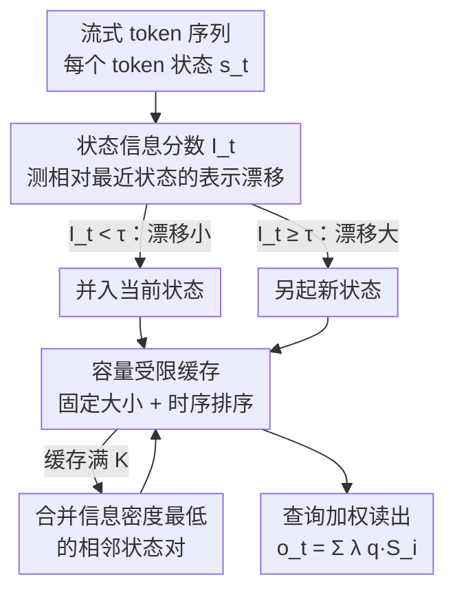

# Dynamic Linear Attention

**会议**: ICML2026  
**arXiv**: [2606.10650](https://arxiv.org/abs/2606.10650)  
**代码**: 待确认  
**领域**: LLM效率 / 线性注意力 / 长上下文建模  
**关键词**: 线性注意力, 多状态记忆, 动态状态合并, 容量受限缓存, 长上下文

## 一句话总结
针对现有"多状态线性注意力"用固定规则合并记忆、会把关键 token 过早压进粗摘要并累积误差的问题，DLA 提出一套**信息感知 + 容量受限**的动态记忆框架：用一个轻量的"状态信息分数"按 token 级信息变化自适应地决定何时新建/合并记忆状态，并用固定大小的时序缓存压住状态膨胀，在 16 个数据集上稳定超过 SOTA 的 Log-Linear Attention，且 DLA 版 Mamba-2 能逼平同参数量的全注意力 Transformer。

## 研究背景与动机

**领域现状**：标准自注意力对序列长度是二次复杂度，长上下文吃不消。线性注意力通过去掉 softmax、利用结合律重排计算，把复杂度降到次二次，是有希望的方向。为了在长序列下提升表达力，近期工作把历史组织成**多状态**形式：把长 token 历史切块、各自摘要成紧凑的记忆状态。代表作 Log-Linear Attention 用 Fenwick 树把因果前缀分解成对数个多尺度状态，近端细、远端粗，做到 $O(T\log T)$ 训练、$O(\log T)$ 每步解码。

**现有痛点**：这些多状态方法随上下文变长仍会明显掉点。根因在于**固定的记忆构造策略**和序列**非均匀、动态演化的信息结构**之间存在根本错配。现有方法用固定块大小或基于规则的合并时间表，隐含假设了"信息密度沿序列均匀"——但实际并非如此：语义转折可能突然发生，而长段 token 又可能局部冗余。

**核心矛盾**：固定策略有两宗罪。其一，**无法适应动态涌现的语义变化**，仅仅因为预定义边界到了就把重要转折过早吸收进粗摘要；其二，**合并决策不可逆**——一旦异质 token 被压进同一个状态，它们各自的贡献就再也找不回来，即便后文揭示了它们的重要性，从而沿长序列累积误差。

**本文目标**：设计一种既**信息感知**（状态构造跟着局部表示变化走，在语义易变区分配高分辨率、对稳定段激进摘要）又**容量受控**（显式限定状态总数，保证推理时计算/显存可预测）的记忆建模机制。

**核心 idea**：用"token 相对当前记忆状态的表示漂移"来在线决定状态边界——漂移小就并入、漂移大就另起新状态；再配一个固定容量的时序缓存，满了就合并信息密度最低的相邻状态对。

## 方法详解

### 整体框架

DLA 把 token 逐个流式处理。对每个新 token，先算一个轻量的**状态信息分数**衡量它相对最近记忆状态的表示变化：变化小就并入当前状态，变化大就另起一个新状态——这让语义转折处保持高分辨率、稳定段被激进摘要。为了把显存和计算压住，DLA 维护一个**容量受限的状态缓存**，缓存满时就合并信息密度最低的一对相邻状态，腾出一个槽位，得到的记忆始终是**固定大小、按时间排序**的摘要状态集合。解码时，对当前 query 用查询相关的权重去注意所有记忆状态，得到输出。两个设计合起来，让 DLA 同时拿到自适应分辨率、稳定的推理成本和高效的长上下文表示。

### 关键设计

**1. 信息感知的动态状态合并：让状态边界跟着语义变化走**

固定分块（每 $K$ 个 token 切一刀）或硬规则边界对序列的语义演化是"瞎"的，会把重要转折过早压进粗摘要、且不可逆。DLA 的解法是引入一个新指标——**状态信息分数（State Information Score）** $I_t$，衡量当前 token 相对最近记忆状态携带了多少新信息。记新 token 的状态为 $s_t \triangleq \phi(k_t)v_t^\top$，最近记忆状态为 $S_{t-1}$，则

$$I_t = \frac{\|S_t - S_{t-1}\|_F}{\|S_{t-1}\|_F + \epsilon}$$

（实践中先对 $S_t$、$S_{t-1}$ 做 RMSNorm 以稳定跨层跨时刻的尺度。）再用阈值 $\tau$ 得到边界指示 $b_t \triangleq \mathbf{1}[I_t \ge \tau]$，状态更新规则为：$b_t=0$（漂移小）时把 $s_t$ 累加进当前状态、$b_t=1$（漂移大）时把当前 token 另起一个新状态并按时序追加进缓存。一个关键工程细节是**软硬两套门控**：预训练时用软门控让边界决策可微（梯度能流过 $\tau$），推理时切换成硬分割，产出一组离散、与语义边界对齐的记忆状态——既保证训练可学，又保证推理离散高效。

**2. 容量受限的记忆建模：用固定大小缓存压住状态膨胀**

只做设计 1 的话状态数会无界增长，对长上下文/高吞吐服务很不友好：动态膨胀导致内存布局不规则、注意力成本可变、批处理效率下降。DLA 因此维护一个状态缓存 $\mathcal{M}=\{(S_i, n_i, \bar{I}_i)\}_{i=1}^m$（$m\le K$），其中 $n_i$ 是该状态摘要的 token 数、$\bar{I}_i$ 是该状态内逐 token 信息分数之和，于是 $\bar{I}_i/n_i$ 就是**信息密度**。缓存没满时直接插入新状态；一旦满了（$m=K$），就触发压缩：在所有相邻对里选信息密度最低的一对合并，

$$(i^\star, i^\star{+}1) = \arg\min_{i\in\{1,\dots,K-1\}} \frac{\bar{I}_i + \bar{I}_{i+1}}{n_i + n_{i+1}}$$

合并时把状态、token 数、信息分数分别相加。**只合并相邻状态**是有意为之——这样能保住时间顺序、不扭曲位置语义。读出时对 query $q_t$ 用预训练学到的查询相关权重 $\lambda_{t,i}$ 加权所有状态：$o_t = \sum_{i=1}^m \lambda_{t,i}\, q_t^\top S_i$，从而在固定容量缓存上做到稳定的推理成本，又保留了"推理时强调信息量大的状态"的能力。实验里容量 $K=30$，与 Log-Linear 的最大状态数对齐，保证公平比较。

**3. 偏差上界理论：证明固定分块在非平稳序列上次优**

为了说清"为什么固定策略不好、动态合并好"，作者给了理论支撑。设每个 token 对状态的加性贡献为 $u_t$，把序列切成 $m$ 个连续块、每块用代表向量 $\bar{u}_i$ 摘要，则摘要输出相对精确输出的偏差有上界（Theorem 3.1）：

$$\big|y(q) - \tilde{y}_\pi(q)\big| \le \|q\|_2 \cdot \sum_{i=1}^m \sqrt{|\mathcal{C}_i|}\sqrt{\sum_{t\in\mathcal{C}_i}\|u_t - \bar{u}_i\|_2^2}$$

这个上界由**块内异质性**主导。推论 3.2 进一步证明：存在一类非平稳序列，任何固定分块策略 $\pi_{\text{fix}}$ 只要有一个块跨越了语义变化点，就会因这个跨段块贡献一个严格为正的异质项，从而偏差上界严格大于"把边界对齐到变化点"的自适应策略 $\pi_{\text{dyn}}$（后者块内异质性可降到 0）。由此 DLA 可被理解为一个**贪心在线策略**，用信息分数 $I_t$ 近似最小化偏差上界里的主导项，而固定策略完全忽略它——这就是 DLA 更强的理论根据。

## 实验关键数据

### 实验设置
在 Mamba-2-780M 与 Gated DeltaNet-1.3B 两个线性注意力骨干上从头预训练，用 Long-Data-Collections 的 50B token、序列长 16K、4 张 A100。状态缓存容量 $K=30$。在 16 个数据集上评测，分三类：8 个常识推理、6 个上下文检索、2 个长上下文（RULER、LongBench）。基线含原版线性注意力、以及它们的 Log-Linear 变体；DLA 版 Mamba-2 还对比了 24 层、778M 的全注意力 Transformer。

### 主实验：常识推理（准确率，越高越好）

| 模型 | LAMBADA | PIQA | ARC-c | CSQA | 平均 |
|------|------|------|------|------|------|
| Transformer (778M) | 21.8 | 63.1 | 17.7 | 18.0 | 32.9 |
| Mamba-2 | 15.7 | 58.9 | 18.9 | 20.3 | 31.8 |
| Mamba-2 w/ Log-linear | 13.2 | 59.7 | 20.1 | 19.1 | 31.0 |
| **Mamba-2 w/ DLA** | **18.7** | **63.7** | **22.1** | **21.1** | **34.2** |
| Gated DeltaNet (1.3B) | 20.3 | 58.8 | 20.2 | 21.3 | 32.8 |
| GDN w/ Log-linear | 19.0 | 60.4 | 20.5 | 21.0 | 32.6 |
| **GDN w/ DLA** | **20.8** | **62.7** | **23.0** | **22.9** | **34.8** |

两个观察：① DLA 在所有任务上一致超过原版和 Log-Linear 变体，相对 Log-Linear 在 Mamba-2 / GDN 上分别最高拿到 52% / 22% 的相对准确率提升；② DLA 版 Mamba-2 平均分（34.2）反超同参数量的全注意力 Transformer（32.9），说明它能抹平甚至超过线性注意力与全注意力之间的差距。

### 上下文检索（准确率，越高越好）

| 模型 | SQuAD | TriviaQA | SWDE | 平均 |
|------|------|------|------|------|
| Mamba-2 | 22.4 | 13.6 | 17.4 | 9.5 |
| Mamba-2 w/ Log-linear | 7.1 | 9.1 | 15.2 | 6.3 |
| **Mamba-2 w/ DLA** | **28.1** (↑25%) | **20.2** (↑49%) | **26.3** (↑51%) | **13.7** (↑44%) |

检索任务上提升尤其大——平均相对最优基线 ↑44%。有意思的是 Log-Linear 在检索上反而拖累了 Mamba-2（9.5→6.3），印证了"固定多尺度分块会把关键 token 过早摘掉"的痛点，而 DLA 的信息感知合并恰好对症。

### 关键发现
- **检索类任务收益 > 常识推理**：检索强依赖精确召回特定 token，最怕被粗摘要抹掉，所以信息感知的动态边界在这里价值最大（SWDE +51%、TriviaQA +49%）。
- **Log-Linear 并非总优于原版**：在检索上它甚至掉点，说明"固定多尺度状态"是把双刃剑——这正是 DLA 动机的实证支撑。
- **效率侧**：论文称 DLA 在更高吞吐、更低运行时显存下取得上述精度（容量受限缓存保证了推理成本稳定），效率与精度兼得。

## 亮点与洞察
- **"信息分数 $I_t$"是个轻量却有效的钩子**：只用相邻状态的 Frobenius 范数比值就能在线判断语义漂移，不需要额外大模块，几乎零开销地把"该不该合并"变成数据驱动的决策——这个思路可迁移到任何需要自适应分段/压缩的序列记忆场景（KV cache 压缩、流式摘要等）。
- **理论与方法咬合得很紧**：偏差上界把"块内异质性"点出来，方法就直接去贪心最小化这一项，动机不是空话而是有数学落脚点，这种"先证瓶颈、再对症设计"的范式值得学。
- **软训练 / 硬推理的门控切换**很实用：既要训练时可微可学阈值，又要推理时离散高效，DLA 用同一套信息感知准则把两者统一，避免了硬阈值不可导的老问题。

## 局限与展望
- **依赖阈值 $\tau$ 与容量 $K$**：状态分辨率受这两个超参控制，论文用 $K=30$ 对齐基线，但 $\tau$ 的敏感性、不同任务/长度下是否需要重调，文中（截至所读部分）未充分展开。
- **贪心在线策略只是近似最优**：DLA 被定位成贪心地近似最小化偏差上界，并非全局最优分段；对极端非平稳或长程依赖序列，贪心是否会陷入次优分段值得进一步分析。
- **规模与骨干有限**：只在 780M / 1.3B、两个线性注意力骨干、50B token 学术规模上验证，能否随模型/数据规模继续保持对全注意力的优势仍待检验。
- **合并是加法摘要**：状态合并用的是简单相加（保序），异质状态被合并时仍有信息损失，是否有更优的摘要算子（带权、低秩）是可改进方向。

## 相关工作与启发
- **vs Log-Linear Attention**：它用 Fenwick 树做**固定**的对数级多尺度分块，近端细远端粗但与内容无关；DLA 把"分块时间表"换成**内容驱动**的信息分数边界，并补了容量受限缓存，本质区别在于"边界跟语义走"而非"跟位置走"，因此在检索类任务上反超明显。
- **vs DeltaNet / Gated DeltaNet**：它们在单一全局状态上引入 delta 式可控遗忘，提升了状态追踪，但**仍是单状态**，无法沿长序列选择性保留细粒度信息；DLA 是多状态、且状态数自适应，可看作在它们之上叠加了一层信息感知的记忆组织。
- **vs 标准线性注意力**：原版把整段历史压进单个 $d\times d$ 状态矩阵，长上下文表达力受限；DLA 用一组容量受限的多状态替代单状态，在保持次二次成本的同时拿回了分辨率。

## 评分
- 新颖性: ⭐⭐⭐⭐ 把"信息感知动态分段 + 容量受限缓存"引入多状态线性注意力，并配上偏差上界理论，角度新且自洽。
- 实验充分度: ⭐⭐⭐⭐ 两骨干 × 16 数据集 × 三类任务，对比 SOTA 充分；若补 $\tau$/$K$ 敏感性与更大规模会更稳。
- 写作质量: ⭐⭐⭐⭐ 动机—理论—方法—实验链条清晰，伪代码与公式齐全。
- 价值: ⭐⭐⭐⭐ 长上下文线性注意力的实用改进，检索任务收益大，思路可迁移到 KV 压缩等场景。

<!-- RELATED:START -->

## 相关论文

- [\[ICLR 2026\] RACE Attention: A Strictly Linear-Time Attention for Long-Sequence Training](../../ICLR2026/llm_efficiency/race_attention_a_strictly_linear-time_attention_for_long-sequence_training.md)
- [\[ICML 2026\] Kalman Linear Attention: Parallel Bayesian Filtering For Efficient Language Modelling and State Tracking](kalman_linear_attention_parallel_bayesian_filtering_for_efficient_language_model.md)
- [\[NeurIPS 2025\] Tiled Flash Linear Attention: More Efficient Linear RNN and xLSTM Kernels](../../NeurIPS2025/llm_efficiency/tiled_flash_linear_attention_more_efficient_linear_rnn_and_xlstm_kernels.md)
- [\[NeurIPS 2025\] ZeroS: Zero-Sum Linear Attention for Efficient Transformers](../../NeurIPS2025/llm_efficiency/zeros_zero-sum_linear_attention_for_efficient_transformers.md)
- [\[ICML 2026\] IR3DE: A Linear Router for Large Language Models](ir3de_a_linear_router_for_large_language_models.md)

<!-- RELATED:END -->
