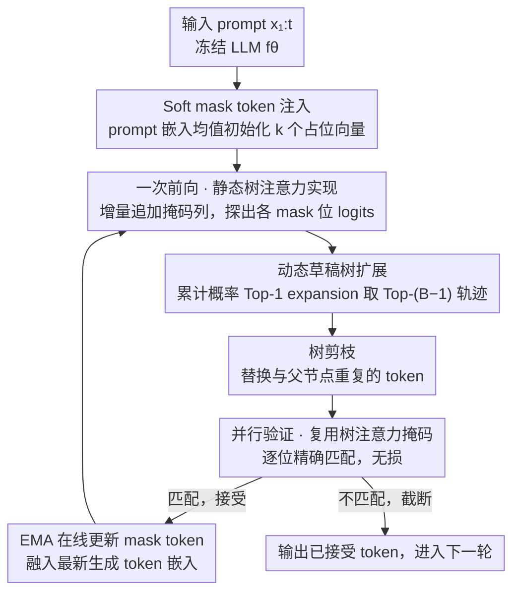

# Efficient Training-Free Multi-Token Prediction via Embedding-Space Probing

**会议**: ICML 2026  
**arXiv**: [2603.17942](https://arxiv.org/abs/2603.17942)  
**代码**: 待确认  
**领域**: LLM效率 / 推测解码 / 多 token 预测  
**关键词**: 多 token 预测, 训练免费, 嵌入空间探针, 推测解码, 动态草稿树

## 一句话总结
本文提出 ESP（Embedding-Space Probing）：在不修改任何权重、不训练任何辅助模型的前提下，把"prompt 嵌入均值"作为 mask token 注入到冻结 LLM 的输入序列里，借助一次前向同时探出未来多个 token，再用基础模型自身做无损推测验证，在 LLaMA3 / Qwen3 上比同类训练免费基线（LADE / STAND / PLD）的平均接受长度高 7–11%、吞吐高 15–19%。

## 研究背景与动机

**领域现状**：自回归解码每步只产一个 token，GPU 并行度严重浪费。主流的多 token 预测（MTP）/推测解码方案分两类：(i) 给主模型加 MTP head 并重训（Medusa、Gloeckle et al.），(ii) 引入一个独立的小 draft model 做推测（Leviathan、Cai 等）。两者都需要构造数据集、调架构、烧 GPU 训练，且部署时多出 ~400M 额外参数，对端侧设备非常不友好。

**现有痛点**：真正"训练免费"的 baseline 屈指可数——PLD 靠 prompt 里 n-gram copy，STAND 靠自适应 n-gram cache，LADE 用 Jacobi 迭代造草稿。它们在 n-gram 重复多的任务（如 coding、RAG）上还行，但在 writing、math/reasoning 这类开放任务上接受率掉得很厉害，且需要在线维护 n-gram 缓存。Future Lens 之类的探针工作虽然观察到"LLM 内部已经潜藏未来 token 信息"，却只把它当作诊断现象，没做成解码算法。

**核心矛盾**：要想"无重训 + 无辅助模型 + 无损"，就必须只用冻结模型本身、在一次前向里同时预测多个未来 token——但 LLM 是 next-token 训练的，怎么"骗"它一次性吐出 k 个 token？

**本文目标**：(1) 找到一种 token 表示，把它塞进序列后能让 LLM 在对应位置输出"未来第 i 步"的分布；(2) 把多个候选组织成树并设计 budget 受控的扩展/剪枝策略；(3) 用基础模型自己验证保证无损；(4) 给出理论解释为什么这种探针能 work。

**切入角度**：作者观察到 decoder 各层在做计算时，会**逐层把"占位 token"的隐状态拉向真实未来 token 的隐状态**。如果用一个"语义中性但与 prompt 同分布"的向量当 mask token，深层会自动让它对齐到真实未来 token 的表征，于是 LM head 自然就会把正确的未来 token 排进 Top-K。

**核心 idea**：用"prompt 嵌入均值"做 soft mask token，在 embedding 空间直接探出未来 k 个 token 的 logits；用动态树扩展把候选组织起来；用主模型一次性并行验证——整条 pipeline 完全 training-free、无需 draft model、无损。

## 方法详解

### 整体框架
冻结的 LLM $f_\theta$ 接收 prompt $x_{1:t}$ 后，ESP 不直接 next-token 解码，而是：(1) 在 embedding 空间合成 $k$ 个 mask token $m_1,\dots,m_k$ 并拼到序列末尾；(2) 一次前向得到所有 mask 位置的 logits，按动态树扩展从这些 logits 里采样 Top-K 候选构成"草稿 token 树"；(3) 用一个简单剪枝规则去掉与父节点重复的冗余分支；(4) 把整棵草稿树送进同一个 $f_\theta$ 做并行验证（speculative-decoding 标准做法），逐位精确匹配则接受、不匹配则截断；(5) 每个被接受的 token 触发对应 mask token 的更新（EMA 式融合最新生成 token 的嵌入），进入下一轮。整套流程通过定制的"树注意力掩码 + 位置索引"在一次前向里完成。

### 关键设计

**1. Soft mask token 注入 + EMA 在线更新：用什么向量当"占位符"才能骗出未来 token**

ESP 要在一次前向里探出多个未来 token，前提是给序列末尾塞进的"占位向量"能被深层网络拉向真实未来 token 的表征。作者不取"prompt 最后 K 个 token 的嵌入"（hard init）、也不按 embedding 表的整体均值/方差采样，而是直接用 prompt 嵌入均值 $m_i = \frac{1}{t}\sum_{j=1}^t \mathbf{e}_j$ 初始化全部 mask token——这样占位向量在统计上与当前 prompt 同分布，比另外两种初始化都更稳。生成过程中每接受一个新 token $x_{t+s}$，就用 $m_i[s+1] = m_i[s] + \lambda(\mathbf{e}_{t+s} - m_i[s])$（$\lambda = 0.1$）做 EMA 更新，把最新上下文持续渗进 mask 表征；同一棵树里所有未来轨迹共享同一个 $m_i$ 值，分支差异完全靠 position id 和 tree-attention 路径产生。

之所以"prompt 同分布"是关键，是因为作者在 Dolly-Databricks 上观察到一个清晰现象：对被接受的 token，mask token 与真实未来 token 的隐状态余弦相似度从第 15 层起稳步爬到 ~0.45，而被拒绝的 token 停在 ~0.35。Lemma 3.1 把它形式化——只要 $\cos(h_m, h_v) \geq \delta^*$，真实未来 token 就必然落入 mask token logits 的 Top-K。mean-prompt 初始化恰好能最大化这种"逐层对齐"，从而保证 Top-K 命中率，**这是整套训练免费方法能 work 的理论根基**。

**2. 基于累计概率的动态草稿树扩展（Algorithm 1）：让模型自己决定该展宽还是展深**

固定的 Top-K 草稿树有个硬伤：mask token 在不同 prompt 下"该展宽还是展深"差别极大——开放任务（writing/reasoning）适合"宽而浅"多探索，封闭任务（math/translation）适合"窄而深"更聚焦，任何一组手工 Top-K 都会在某类任务上吃亏。ESP 改用累计概率驱动的 Top-1 expansion：给定预算 $B$、mask token 数 $k$，每层 $i$ 对当前 frontier 节点采 $B-i$ 个候选，按 $P(c) = P(n) \cdot P(t_j \mid l_n)$ 更新累计概率，取 Top-$(B-i)$ 进入下一层，最终保留累计概率最高的 $B-1$ 条轨迹。$B-i$ 的逐层衰减天然鼓励早期多采样分支、后期聚焦高置信轨迹，相当于让模型自己决定"在哪里多花预算"。

这里把"一次前向能处理多少 token"显式抽象成 block complexity，并给出闭式表达 $\text{Block Complexity} = (k+1)(1 + \sum_{i=1}^k K_i)$，使不同树形在同一预算下可比。实测中 dynamic 在 BC=30/60、两种 LLaMA3 上都打平或超过最佳静态 $[K_1, K_2]$ 配置，免去了离线网格搜索。

**3. GPU 友好的静态树注意力与位置索引实现：别让 tree mask 的构造吃掉省下的 forward**

tree decoding 有个容易被忽视的隐藏开销：传统 tree-attention 每步都要遍历树节点重新构造掩码，这类 CPU/串行操作会严重拖慢 GPU。ESP 把 attention mask 缓存下来，每接受新 token 时只**增量追加列**而非重算整张掩码，position id 也通过简单 offset 复用；再配合 mask token 统一摆到序列末尾的布局（Figure 3），让一次前向同时覆盖"最后被接受的 token + 草稿树全部节点 + 所有 mask token"。这一项是纯工程优化，却对吞吐影响巨大。

表 4 把这一点讲得很直白：naive 实现下 LLaMA3.1-8B-Instruct 在 BC=60 时端到端只有 1.05–1.07× 加速，树搜索开销几乎抵消了"少 forward"的收益；换成 efficient 实现后跃升到 1.35–1.38×，平均约 21% 增益、BC=60 时高达 29–30%。它提醒后续工作：训练免费 MTP 的吞吐瓶颈往往在 attention mask 构造，而非 token 接受率本身。

### 损失函数 / 训练策略
**完全 training-free**。不引入任何可训练参数，不动 LLM 权重。唯一的超参是 EMA 系数 $\lambda = 0.1$、mask token 数 $k$（实测 $k = 1, 2$ 最优；$k = 3$ 反而下降，因为 LLM 本身只为 next-token 训练）、以及 block complexity $B \in \{10, 30, 60\}$。验证阶段沿用 speculative decoding 的精确匹配 sample matching，保证生成分布与原始自回归无差异（lossless）。

## 实验关键数据

### 主实验
在 SpecBench（涵盖 writing / roleplay / coding / translation / summarization / math&reasoning / RAG 等任务）上对比 PLD、STAND、LADE。报告平均接受长度 $\tau$（每次模型调用平均接受的 token 数，越大 ⇒ 模型调用次数越少）和端到端 wall-time speedup S/R。

| 模型 | BC | PLD $\tau$ / S/R | STAND $\tau$ / S/R | LADE $\tau$ / S/R | **ESP $\tau$ / S/R** |
|------|----|---|---|---|---|
| LLaMA3.1-8B-Instruct | 30 | 1.44 / 1.23× | 1.58 / 1.10× | 1.45 / 1.06× | **1.63 / 1.35×** |
| LLaMA3.1-8B-Instruct | 60 | 1.44 / 1.23× | 1.64 / 1.14× | 1.60 / 1.14× | **1.71 / 1.38×** |
| Qwen3-8B | 60 | 1.31 / 1.12× | 1.48 / 1.06× | 1.73 / 1.21× | **1.74 / 1.43×** |
| Qwen3-32B | 60 | 1.29 / 1.09× | 1.48 / 1.13× | 1.69 / 1.31× | **1.70 / 1.48×** |
| LLaMA3.2-3B-Instruct | 60 | 1.43 / 1.19× | 1.62 / 1.07× | 1.57 / 1.10× | **1.63 / 1.22×** |

ESP 在 4 个模型 × 2 个 BC 上全部取得最高（或并列最高）$\tau$ 和 S/R；相比 LADE 在 LLaMA3 上 $\tau$ 高 7–12%、在 Qwen3 上 7–8%，相对最强基线吞吐高 15–19%；BC=60 下最多减少 42% 的 forward 模型调用。

### 消融实验

| 配置 | LLaMA3.2-3B $\tau$ (BC=60) | LLaMA3.1-8B $\tau$ (BC=60) | 说明 |
|------|------|------|------|
| Mean (soft init) | **1.67** | **1.71** | 完整方法，prompt 嵌入均值初始化 |
| Sample (embedding 分布) | 1.65 | 1.69 | 按 embedding 表 $\mathcal{N}(\mu, \sigma^2 I)$ 采样 |
| Last K (hard init) | 1.62 | 1.67 | 取 prompt 最后 K 个 token 嵌入 |
| 1 mask token $[29]$ | **1.65** | **1.73** | BC=60，单 mask token |
| 2 mask tokens $[15,4]$ | 1.63 | 1.71 | 两 mask token + 动态分支 |
| 3 mask tokens $[7,5,3]$ | 1.51 | 1.57 | 三 mask token，**显著回退** |
| Efficient attention impl | 1.22× / 1.38× S/R | — | 相对 naive 实现的额外加速 |
| Naive attention impl | 0.96× / 1.07× S/R | — | 树掩码逐节点构造，吃掉收益 |

### 关键发现
- **Mean-prompt soft init > 其他初始化**：始终高 0.02–0.05 $\tau$，验证 Lemma 3.1 关于"层间余弦对齐"的论断——与 prompt 同分布的占位向量更容易被深层网络拉向真实未来 token 的隐状态。
- **Mask token 数不是越多越好**：$k=1$ 在多数情形下反而最优，$k=3$ 普遍掉 0.1+。原因是 LLM 本身只为 next-token 训练，过深的探针会让对齐失效。开放任务偏好 $k=1$（更宽的探索），封闭任务偏好 $k=2$（更深的利用）。
- **动态树打平/打败所有手工静态树**：BC=60 上 dynamic 1.630 vs 最佳静态 $[15,4]$ 1.631，BC=30 上 dynamic 1.506 vs 静态 $[7,2]$ 1.504，省下了离线网格搜索。
- **工程加速量级 ≈ 算法加速量级**：efficient attention 实现单独贡献 ~21% 吞吐，提醒后续推测解码工作不要忽视 tree-attention 的构造开销。
- **任务相关性**：在 coding/RAG/summarization 上 STAND（n-gram copy）会略胜，因为这些任务文本重复度高；ESP 在 math/reasoning 等需要"模型真正生成"的任务上优势最明显（LLaMA3.1-8B 上 $\tau=1.81$）。

## 亮点与洞察
- **"探针即解码"的范式转换**：之前的探针工作（Future Lens 等）只把"LLM 内部已编码未来 token"当成可解释性现象，本文第一次把它工程化为可用的解码算法，且完全不训练。这种"现象 → 算法"的思路对未来挖掘冻结模型的潜在能力很有启发。
- **理论与现象的闭环非常漂亮**：先经验观察到 mask token 隐状态会"层层向未来 token 收敛"，再用 Lemma 3.1 给出"$\cos$ 相似度 ≥ $\delta^*$ ⇒ Top-K 命中"的形式化保证，最后用 mean-prompt 初始化的实验回收这个论断——三者闭环让人愿意相信方法不是 ad-hoc 调参。
- **Block complexity 抽象很值得复用**：把"一次前向能处理多少 token"显式提到一阶设计变量，并按它给出闭式表达 $(k+1)(1 + \sum K_i)$，让不同方法的比较变得有意义（避免"我树大所以接受率高"的不公平对比）。
- **Soft mask token + EMA 更新可迁移**：这种"用 prompt 统计量造占位向量并随生成 EMA 漂移"的思路完全可以借给 prompt-tuning、continuous prompt 优化、甚至 retrieval-augmented decoding 里"未观测槽位"的填充。

## 局限与展望
- 对 n-gram 重复多的任务（coding、RAG、summarization）不及 STAND——这类场景"复制 prompt"比"探针生成"更划算；可考虑 ESP + n-gram cache 的混合策略。
- $k=3$ 起接受率显著下降，根本原因是 base LLM 只为 next-token 训练；想突破得做轻量微调，但这违背 training-free 初衷，需在"完全冻结"与"超长 horizon 探针"间权衡。
- 仅评估了 max_len=100/256 的生成长度和 single-A100/H100；长生成（>1k）、batch>1、多 GPU pipeline 下的接受率/吞吐行为未报告。
- Mean-prompt init 在某些极端 prompt（如纯代码、纯数字串）上是否仍能保证 Lemma 3.1 的 $\delta^*$ 条件？这种 prompt 分布敏感性的鲁棒性边界没充分实验。
- 改进思路：(1) 让 $\lambda$ 随层数/位置自适应；(2) 把 mask token 的"对齐质量"作为 in-flight 信号决定提前终止；(3) 与 KV-cache 量化、连续批处理一起做端到端 throughput 优化。

## 相关工作与启发
- **vs LADE (Lookahead Decoding)**：LADE 用 Jacobi 迭代在多个位置同时猜测 token；ESP 用嵌入空间的 mask token 探针。两者都 training-free，但 ESP 借助"层间对齐"现象，在 LLaMA3 上 $\tau$ 高 7–11%、Qwen3 上 7–8%，且不需要维护 n-gram pool。
- **vs Medusa / Cai et al.**：Medusa 训 ~400M 额外 MTP head；ESP 零额外参数、零训练、零额外内存。代价是接受率天花板更低，但在边端设备场景压倒性占优。
- **vs PaSS / Future Lens**：PaSS 引入特殊 marker token 并需要微调；Future Lens 只做分析不解码。ESP 既不微调也不需特殊词表，且把分析现象做成了实用算法。
- **vs STAND / PLD**：两者本质都是"从 prompt/历史抄 n-gram"，在重复度高的任务（coding/RAG）上吃香但泛化差；ESP 在 reasoning/writing 等"必须真生成"的任务上反超明显。

## 评分
- 新颖性: ⭐⭐⭐⭐ "embedding-space 探针 → MTP 解码"的范式转换很干净，理论 + 现象 + 算法形成闭环。
- 实验充分度: ⭐⭐⭐⭐ 覆盖 4 模型 × 3 BC × SpecBench 全任务，初始化/mask 数/动态树/工程实现四维消融都做了；扣分项是缺 long-gen 与 batch>1。
- 写作质量: ⭐⭐⭐⭐ 动机—观察—引理—算法—消融脉络清晰，Figure 1/3 把 mask token 注入与树注意力讲得直观。
- 价值: ⭐⭐⭐⭐ 真正"plug-and-play"的训练免费 MTP，对边端 LLM 推理与冻结模型部署有直接实用价值。

<!-- RELATED:START -->

## 相关论文

- [\[NeurIPS 2025\] L-MTP: Leap Multi-Token Prediction Beyond Adjacent Context for Large Language Models](../../NeurIPS2025/llm_efficiency/l-mtp_leap_multi-token_prediction_beyond_adjacent_context_for_large_language_mod.md)
- [\[NeurIPS 2025\] Efficient Training-Free Online Routing for High-Volume Multi-LLM Serving](../../NeurIPS2025/llm_efficiency/efficient_training-free_online_routing_for_high-volume_multi-llm_serving.md)
- [\[ICML 2026\] Sparser Block-Sparse Attention via Token Permutation](sparser_block-sparse_attention_via_token_permutation.md)
- [\[ICML 2026\] Training-Inference Consistent Segmented Execution for Long-Context LLMs](training-inference_consistent_segmented_execution_for_long-context_llms.md)
- [\[ICLR 2026\] TokenSeek: Memory Efficient Fine Tuning via Instance-Aware Token Selection](../../ICLR2026/llm_efficiency/tokenseek_memory_efficient_fine_tuning_via_instance-aware_token_selection.md)

<!-- RELATED:END -->
