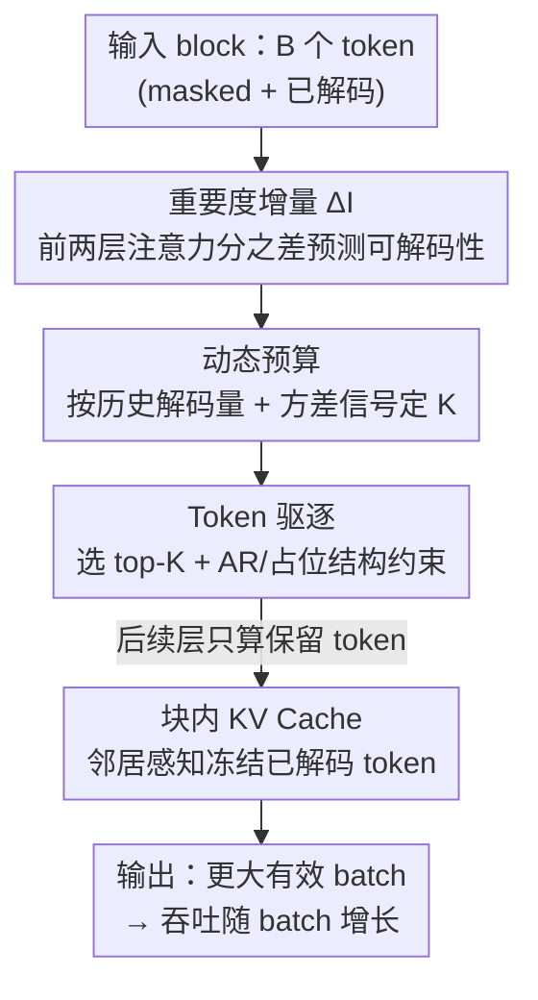

# FOCUS: DLLMs Know How to Tame Their Compute Bound

**会议**: ICML 2026  
**arXiv**: [2601.23278](https://arxiv.org/abs/2601.23278)  
**代码**: https://github.com/sands-lab/FOCUS  
**领域**: LLM效率 / 扩散语言模型推理 / ML 系统  
**关键词**: 扩散语言模型, 推理加速, token 驱逐, 注意力重要度, 吞吐量  

## 一句话总结
FOCUS 发现扩散大语言模型（DLLM）解码时一个 block 里每步只有约 10% 的 token 真正被解码、其余 90% 算力全浪费，并揭示"前两层注意力重要度的增量"能高度预测哪些 token 这一步可解码；据此设计一套免训练的推理系统，在 Layer 1 后就把不可解码 token 驱逐掉，让有效 batch 变大，在大 batch 下相对生产级引擎 LMDeploy 拿到最高 3.52× 的吞吐提升且生成质量不降反升。

## 研究背景与动机
**领域现状**：自回归（AR）大模型逐 token 解码缺乏并行性。扩散大语言模型（DLLM，如 LLaDA、Dream）通过迭代去噪一次生成多个 token、打破严格的顺序依赖，被视为有前景的替代路线。近期主流是 **Block-Diffusion** 范式（SDAR、LLaDA2.0）：一次并行处理一个 token block、把前文当固定上下文，用 block 内双向注意力，从而像 AR 一样实现 **精确 KV cache**、避免周期性全序列重算。

**现有痛点**：DLLM 撞上一堵和 AR 完全不同的"计算墙"。AR 解码是**访存受限**（memory-bound），加大 batch 能摊薄 I/O、吞吐随之上升直到算力饱和；而 DLLM 每个去噪步要对整个 block 的 query token 算注意力，算术强度暴涨、变成**计算受限**（compute-bound）。结果是 batch 一大就吞吐封顶——增大 batch 几乎没有收益。

**核心矛盾**：block 内并行虽然最大化了硬件利用率，但**只有约 10% 的 block token 这一步真正被解码**（$B=32$ 时平均只解出 2.00–4.05 个 token），其余 ~90% 的 FLOPs 都花在不可解码 token 上做无用功。和 AR 那种 1:1 的"计算-生成比"相比，DLLM 有结构性的巨大冗余。要恢复 batch 扩展性，就得在每步把这些冗余 token 砍掉。

**本文目标**：在推理时**只对可解码 token 计算**（即那些预测满足解码判据、这一步能被 unmask 的 masked token），直接减少每步 FLOPs，从而缓解计算瓶颈、让吞吐随 batch 重新增长——而且要**免训练**、不掉生成质量。

**切入角度**：AR 上早有"少数 heavy-hitter / attention-sink token 主导注意力质量"的发现被用于 KV cache 压缩（H2O、StreamingLLM、SnapKV、Quest）。本文把这个"访存侧 cache 压缩"的概念**搬到计算侧的 query token 驱逐**，并发现 DLLM 特有的现象：block 内 token 重要度的"漂移"（前几层入向注意力分的增量）和该 token 最终的解码概率高度相关。

**核心 idea**：用"前两层注意力重要度之差"当作 token 可解码性的廉价预测器，在 Layer 1 后就把不可解码 token 早早驱逐，只让后续层处理少量候选，从而把每步处理 token 数砍掉约 65%–80%。

## 方法详解

### 整体框架
FOCUS 是一个 DLLM 推理系统，核心动作只有一个：**在很早的层（Layer 1 后）就把这一步不可解码的 token 从后续计算里踢掉**，让 GPU 只算少量"有希望被解码"的候选，于是在同样显存下能塞进更大的有效 batch、吞吐随之上升。

要让这个驱逐既准又稳，系统需要三件事协同：（1）有一个**廉价且准确的可解码性信号**——本文发现的"重要度增量" $\Delta\mathcal{I}$（设计 1）；（2）每步该保留多少 token 不能拍脑袋，要根据历史解码量和瞬时信号强度**动态定预算** $K$（设计 2）；（3）实际驱逐时要加结构约束保证生成不崩，并且把已解码 token 的 KV 安全地缓存复用（设计 3、4）。整体流程是：算前两层的 Q/K 投影 → 求 $\Delta\mathcal{I}$ → 由动态预算定 $K$ → 选 top-$K$ 候选并补结构约束 token → 后续层只在这批 reduced token 上跑。

### 关键设计

**1. 重要度增量 $\Delta\mathcal{I}$：用前两层注意力之差廉价预测 token 可解码性**

要在早期层就决定踢谁，就得有一个不依赖完整前向、又能区分"可解码 token"和"噪声"的信号。作者先定义 token $j$ 的**重要度** $\mathcal{I}_j$：把当前 block 内所有 query token 对 $j$ 的注意力分聚合起来，

$$\mathcal{I}_j=\sum_{i,h}\operatorname{Softmax}\big(\operatorname{MaxPool1D}(S_{i,j}^{(h)})\big)$$

其中 $S_{i,j}^{(h)}=(\mathbf{q}_i^{(h)})^\top\mathbf{k}_j^{(h)}/\sqrt{d_k}$ 是 head $h$ 里 query $i$ 对 key $j$ 的 pre-softmax 注意力分，按列聚合就突出了"被 block 里其它 token 重点关注"的 token（MaxPool1D 沿用 SnapKV 来稳健捕捉局部特征）。

但直接用 $\mathcal{I}_j$ 不行——已解码 token 因为有现成上下文会天然霸占注意力质量。作者的关键观察是：把已解码 token 滤掉后，**从 Layer 1 开始**可解码 token 和不可解码 token 的重要度就明显分叉（Layer 0 几乎没差别）。原因在早期层的角色不同：Layer 0 的 Q/K 直接由带噪输入 embedding 投影、没有跨 token 交互，注意力分基本是静态先验/噪声；Layer 1 在初步混合的隐状态上运算，token 获得了足够语义、开始把自己和别人区分开（类比 BERT 早期层先解析表层特征）。于是本文提出**重要度增量**作为可解码性预测器：

$$\Delta\mathcal{I}_j=\mathcal{I}_j^{(\text{Layer1})}-\mathcal{I}_j^{(\text{Layer0})}$$

这个相减相当于"共模抑制"（common mode rejection）：把 Layer 0 里非特异的位置先验滤掉，只留 Layer 1 涌现的"语义抬升"。因为 Layer 1 是两类 token 最早分叉的地方，在此处识别可解码 token 能让后续所有层的算力都省下来——这是"两层之差"在时机上的最优性。实证上 $\Delta\mathcal{I}$ 的高分位 token 几乎都成功解码、低分位的基本仍被 mask，相关性很强，且优于直接用原始注意力分。

**2. 动态预算：每步该留多少 token 不能拍死**

每步可解码 token 数波动很大（容易步多、难步少），静态预算 $K$ 会要么砍掉真候选、要么留太多浪费。FOCUS 用一个双判据动态算预算：

$$K=\min\big(B,\ \max(\lceil\alpha\times\bar{N}_{decoded}^{(t)}\rceil,\ N_\sigma)\big)$$

其中 $\alpha>1$ 是 FOCUS **唯一新增的超参**，控制扩张激进度；$\bar{N}_{decoded}$ 是历史平均解码量（首步无历史时默认取 1）；$N_\sigma=\sum_{j\in\mathcal{M}}\mathbb{1}(\Delta\mathcal{I}_j\ge\operatorname{Std}(\Delta\bm{\mathcal{I}}))$ 统计 block 内重要度增量 ≥ 一个标准差的 token 数（增量服从零均值分布）。两项分工明确：历史项 $\alpha\bar{N}$ 给出基于近期解码产出的"安全基线"，方差项 $N_\sigma$ 让预算在模型突然检测到一大批高置信 token 时**自适应放大**、避免在易解码步误砍有效候选。附录还从理论上证明这个阈值策略能最小化"漏掉可解码 token"的概率、最大化有效并行度。

**3. Token 驱逐策略：早期过滤 + 两条结构约束防生成崩坏**

有了预算 $K$ 和信号 $\Delta\mathcal{I}$，FOCUS 先算前两层（Layer 0、1）整个 block 的 Q/K 投影求出 $\Delta\mathcal{I}$，再选 top-$K$ 个 masked token。但光选 top-$K$ 会破坏生成稳定性，所以补两条结构约束：**AR 上下文保留**——因为多数 DLLM 是在 AR backbone 上继续预训练的，局部 $t_i\leftarrow t_{i-1}$ 的注意力模式很关键，所以为每个候选强制保留它的直接前驱；**占位完整性**——保留任何被选候选之前的未处理 masked token，给它们初始化 KV 状态，避免相对位置偏移错乱导致生成损坏（如重复），开销很小（每个 token 至多多算一次）。最终把 top-$K$ 候选和约束所需 token 合并成索引集 $\mathcal{S}$，对 block 隐状态做 Gather 得到 $\mathbf{H}_{reduced}\in\mathbb{R}^{|\mathcal{S}|\times h}$，**后续层只在这批 reduced 表示上运算**，被驱逐 token 仅作固定参考 KV。因为 $|\mathcal{S}|\ll B$，矩阵乘的计算量线性下降，而调度与驱逐开销仅占每步延迟约 1%，理论 FLOPs 削减能直接兑现成 wall-clock 加速。

**4. 块内 KV Cache + 邻居感知稳定判据：复用已解码 token 还不破坏依赖链**

标准 Block-Diffusion 每步刷新整个 block 的 KV，仍有冗余。FOCUS 引入**块内 KV Cache**复用已解码 token 的状态、冻结它们停止重复更新，并借鉴 dKV-Cache 的 Delayed Cache——推迟提交直到 token 稳定（解码后再前向一次）。但直接套用会破坏局部依赖链：CPT 架构里 $t_{i+1}$ 的生成强烈依赖前驱 $t_i$ 的注意力特征，过早冻结 $t_i$ 的 KV 会给这条关键依赖注入噪声。于是作者加**邻居感知稳定判据**：延迟缓存 $t_i$ 的 KV，直到 $t_i$ 和它右邻 $t_{i+1}$ 都成功解码，确保局部上下文窗口完全稳定后才定稿，防止误差在长程生成里传播。

### 一个完整示例
以 SDAR-8B-Chat、block size $B=32$、confidence threshold 0.9 走一步：这一步 block 里 32 个 masked token，但按统计平均只有约 2–4 个真能被解码。FOCUS 先算 Layer 0、1 的 Q/K，得到每个 token 的 $\Delta\mathcal{I}$；动态预算根据历史（比如上几步平均解出 3 个、$\alpha=1.5$）给出 $K\approx\lceil1.5\times3\rceil=5$，若这步方差项 $N_\sigma$ 检测到 7 个高增量 token 则放大到 7；选出这 7 个 top 候选，再为每个补上前驱和占位 masked token；后续 30 层只在这十几个 token（而非 32 个）上运算，省掉约 65%–80% 的处理量。被解码的 token 进块内 KV Cache，但要等它和右邻都解码后才真正冻结。整步调度开销只占约 1% 延迟。

## 实验关键数据

### 主实验
硬件为单张 A100-80GB，基线是生产级引擎 LMDeploy（已含 Continuous Batching、PagedAttention、FlashAttention）。模型为 SDAR-8B-Chat（默认）和 LLaDA2.0-mini（16B 总 / 1.4B 激活的 MoE）。吞吐在 batch size 256 时评测（ShareGPT/WildChat/MATH，每个随机抽 5000 请求、最大生成 2048 token）。

| 模型 / 数据集 | 计算冗余比（处理/解码）基线 | FOCUS | 冗余下降 |
|---|---|---|---|
| SDAR / ShareGPT | 15.02 | 3.12 | 79.23% |
| SDAR / WildChat | 14.83 | 3.05 | 79.43% |
| SDAR / MATH | 7.45 | 2.69 | 63.89% |
| LLaDA2.0 / ShareGPT | 19.73 | 4.19 | 78.76% |
| LLaDA2.0 / WildChat | 21.47 | 4.30 | 79.97% |

FOCUS 把"处理/解码"冗余比从 ~15 砍到 ~3（接近 AR 的 1:1 理想），SDAR-ShareGPT 峰值吞吐 2272 tokens/s、WildChat 2324 tokens/s，相对 LMDeploy 约 2.32× 加速；在 block size $B=64$（冗余更重）时峰值加速达 **3.52×**。基线在 batch 32→256 间吞吐封顶（SDAR-ShareGPT 约 900 tokens/s 饱和），FOCUS 则让吞吐随 batch 持续增长。

### 消融 / 分析实验

| 实验 | 关键设置 | 结论（数据） |
|---|---|---|
| 选择策略（Math500，$K{=}2$） | Top / Random / Bottom | Top 65.40 ≫ Random 7.50 ≫ Bottom 4.40，验证 $\Delta\mathcal{I}$ 是可靠选择信号 |
| 阈值鲁棒性（Math500，SDAR） | Conf 0.9→0.7 | 基线从 64.70 暴跌到 54.60；FOCUS（$\alpha{=}1.5$）仍保 62.20 |
| 块内 KV Cache（SDAR） | DC vs DC+ vs FOCUS | 朴素 Delayed Cache 掉点严重，邻居感知 DC+ 恢复稳定，完整 FOCUS 反超基线 |

### 关键发现
- **重要度增量是核心**：Top/Random/Bottom 选择实验里 Top 远超另两者，且预算越小差距越大；因为解码是 Markov 链，选错候选的误差会在去噪过程中累积、严重劣化质量。
- **质量不降反升**：FOCUS 在各 $\alpha$ 和 confidence threshold 下都匹配或超过基线，默认 $\alpha{=}1.5$、Conf 0.8 的平均分 68.37 甚至高于保守基线（Conf 0.9）的 67.60——驱逐机制顺手把"高置信但错误"的 token 当噪声过滤掉了（作者把这视作间接证据而非严格因果）。
- **块越大收益越大**：$B=64$ 时冗余最重，FOCUS 加速最高（3.52×），说明它确实在驯服大 block diffusion 的计算负担。
- **MoE 上收益更温和**：LLaDA2.0 只激活 1.4B 参数、FLOPs 本就低，加速幅度小于 dense 的 SDAR；MATH 这种短 prompt + 长推理场景优化空间更小，batch 64 时甚至因关闭多循环优化出现轻微回退。

## 亮点与洞察
- **把"cache 压缩"概念跨界到"query 驱逐"**：AR 上 heavy-hitter 用于压访存侧 KV cache，本文反过来用于砍计算侧的 query token，精准对上了 DLLM 的 compute-bound 痛点——视角迁移很巧。
- **两层之差 = 共模抑制**：用 $\Delta\mathcal{I}=\mathcal{I}^{(1)}-\mathcal{I}^{(0)}$ 滤掉 Layer 0 的位置先验、只留 Layer 1 的语义抬升，既廉价又在"最早可分"的时机出手，把后续所有层的算力都省下来，时机选择有理论支撑。
- **免训练、只加一个超参 $\alpha$**：纯推理系统改造（4000+ 行 Triton kernel + 调度逻辑），不动权重就能落地，对已有 DLLM 友好。
- 最"啊哈"的是：质量不仅不掉还略升——把"高置信但错误"的 token 顺手清掉，等于免费送了个鲁棒性，尤其在低 confidence 阈值下优势明显。

## 局限与展望
- **质量提升的因果性未坐实**：作者自己承认"驱逐抑制了 confidence 模型漏掉的噪声候选"只是间接证据，缺受控因果验证。
- **收益依赖架构与负载**：MoE（激活参数少）和短 prompt 长推理（如 MATH）上加速明显缩水，batch 64 还会因关掉多循环优化轻微回退，说明优化高度依赖 compute-bound 程度。
- **强绑定 Block-Diffusion + CPT backbone**：AR 上下文保留、邻居感知判据都建立在"DLLM 由 AR backbone 继续预训练"的假设上，对非 AR 起源或纯 from-scratch 的 DLLM 是否成立未验证。
- **工程复杂度高**：irregular memory access 的 Gather/驱逐需要定制 Triton kernel，复现与移植门槛不低。

## 相关工作与启发
- **vs Fast-dLLM**：Fast-dLLM 用置信度解码 + 近似缓存提速，但仍需周期性 KV cache 重算、且以质量换速度；FOCUS 用精确 KV cache 且专攻计算冗余（驱逐 query token），质量不降反升。
- **vs SDAR / LLaDA2.0（Block-Diffusion）**：它们靠 block 内并行解决全局刷新瓶颈、实现精确 KV cache，但仍冗余地重算整个 block；FOCUS 在其之上再砍掉不可解码 token，把冗余比从 ~15 降到 ~3。
- **vs H2O / StreamingLLM / SnapKV / Quest**：这些在 AR 上做 KV cache 压缩（访存侧）；FOCUS 把同一注意力稀疏直觉用到 DLLM 的 query token 驱逐（计算侧），并配上 DLLM 特有的 $\Delta\mathcal{I}$ 信号。

## 评分
- 新颖性: ⭐⭐⭐⭐⭐ 首次揭示 DLLM 注意力重要度与解码概率的内在关联，并据此做计算侧 token 驱逐，视角新。
- 实验充分度: ⭐⭐⭐⭐ 两种 DLLM × 多 benchmark × 多 batch/block，含选择策略、阈值、KV cache 三组消融，较扎实。
- 写作质量: ⭐⭐⭐⭐ 从"10% 解码率"现象一路推到系统设计，动机链清晰；个别机制（共模抑制、因果）说明偏定性。
- 价值: ⭐⭐⭐⭐⭐ 直击 DLLM 部署的吞吐瓶颈，免训练、即插即用、最高 3.52× 加速，落地价值高。

<!-- RELATED:START -->

## 相关论文

- [\[ICML 2026\] Stochastic Sparse Attention for Memory-Bound Inference](stochastic_sparse_attention_for_memory-bound_inference.md)
- [\[ACL 2025\] FastDraft: How to Train Your Draft](../../ACL2025/llm_efficiency/fastdraft_how_to_train_your_draft.md)
- [\[AAAI 2026\] How Many Experts Are Enough? Towards Optimal Semantic Specialization for Mixture-of-Experts](../../AAAI2026/llm_efficiency/how_many_experts_are_enough_towards_optimal_semantic_specialization_for_mixture-.md)
- [\[ACL 2025\] How to Train Long-Context Language Models (Effectively)](../../ACL2025/llm_efficiency/train_long_context_effectively.md)
- [\[NeurIPS 2025\] From Shortcut to Induction Head: How Data Diversity Shapes Algorithm Selection in Transformers](../../NeurIPS2025/llm_efficiency/from_shortcut_to_induction_head_how_data_diversity_shapes_algorithm_selection_in.md)

<!-- RELATED:END -->
