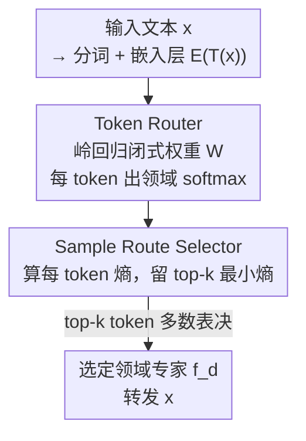

# IR3DE: A Linear Router for Large Language Models

**会议**: ICML 2026  
**arXiv**: [2606.06098](https://arxiv.org/abs/2606.06098)  
**代码**: https://github.com/gensyn-ai/IR3DE  
**领域**: LLM效率 / 推理路由 / 专家模型选择  
**关键词**: LLM 路由、岭回归、领域专家、token 级路由、去中心化训练

## 一句话总结
这篇论文提出 IR3DE——一个用**岭回归闭式解**构建的线性 LLM 路由器，仅凭 token 嵌入就把每条 prompt 路由到最合适的领域专家模型，无需训练额外语言模型、无需把各领域数据集中到一处，且专家可随时增删而不必重训路由器；尽管是线性的，它在推理任务上以 98.4% 的归一化性能超过所有基线。

## 研究背景与动机

**领域现状**：可用的 LLM 越来越多——通用基础模型在广泛任务上表现好，领域专家模型（代码、数学、指令跟随等）在各自专长上更强。于是"推理路由器"应运而生：给每条 query 动态挑一个最合适的模型来服务。

**现有痛点**：现有路由方法分两类，都有硬伤。一类做**成本-性能权衡**，在能力相近但容量不同的强/弱通用模型间选，主要按 query 难度路由（难的给大模型），并不看模型"专长"。另一类做**专长路由**追求准确率，但它们普遍要额外的（语言）模型来给 query 分类或抽最后一层隐表示当 token 嵌入，于是必须把各领域数据集收集起来训练路由器——这在隐私受限、通信/算力预算不足时往往不可行。

**核心矛盾**：想要"按专长精确路由"，现有做法就得付出"训练一个重的 LM 路由器 + 集中所有领域数据"的代价；而想要"便宜快速"，又只能退回到只看难度的粗糙路由。专长 + 轻量 + 去中心化三者难以兼得。

**本文目标**：造一个既能路由到正确领域专家、又**便宜快速、且支持去中心化与专家热插拔**的路由器。具体拆成：路由决策要 cheap & fast；构建路由器不能要求把所有领域数据集中到单节点；新专家加入/退出时不必从头重训。

**切入角度**：作者借用岭回归（正则最小二乘 RLS）的闭式解——它在联邦学习和 MoE 路由里已被验证可异步累加统计量。既然 RLS 的解只依赖两个可分批累加的统计矩阵，那每个领域数据集就能当成独立 batch 在各自节点算，天然契合去中心化与热插拔。

**核心 idea**：用一个**线性岭回归 token 路由器**给每个 token 打领域分布，再用一个**基于熵的 sample 选择器**只让"最有把握"的 top-k 个 token 投票选专家——把整个路由器压成"一次小矩阵求逆"的开销。

## 方法详解

### 整体框架
IR3DE 由两个组件串成：**Token Router (TR)** 和 **Sample Route Selector (SRS)**。给定输入文本 $x$，先用任意分词器 $\mathcal{T}$ 和预训练嵌入层 $\mathcal{E}$ 把它变成 token 嵌入矩阵，TR 用一组线性权重 $W$ 把每个 token 映成一个领域 softmax 概率向量。SRS 则对这些 per-token 概率算 Shannon 熵，只保留熵最小（最有把握）的 top-k 个 token，让它们各投一票、多数表决选出最终领域，把 $x$ 转发给对应专家。$W$ 不靠梯度训练，而是由岭回归闭式解一次算出，且统计量可分批/分节点累加。

### 关键设计

**1. 岭回归 Token Router：用闭式解把路由器变成"一次小矩阵求逆"**

要按领域路由，最直接的想法是训一个分类器，但那要梯度训练、要集中数据。作者把它写成正则最小二乘问题：设 $\mathcal{E}(\mathcal{T}(X))\in\mathbb{R}^{n\times h}$ 是所有领域所有样本 token 的堆叠嵌入、$Y\in\mathbb{R}^{n\times C}$ 是对应的领域 one-hot 标签（token $i$ 属领域 $j$ 则 $Y_{ij}=1$），求

$$\min_{W\in\mathbb{R}^{h\times C}}\big[\,\lVert \mathcal{E}(\mathcal{T}(X))-Y\rVert^2+\lambda\lVert W\rVert^2\,\big]$$

它有闭式解 $W^*=(\mathcal{E}(\mathcal{T}(X))^\top\mathcal{E}(\mathcal{T}(X))+\lambda I_h)^{-1}\mathcal{E}(\mathcal{T}(X))Y$，其中 $\lambda$ 控制 Tikhonov 正则。推理时 $\mathcal{R}(x)=\mathrm{softmax}(\mathcal{E}(\mathcal{T}(x))W)$ 给每个 token 一个领域概率向量。

这样设计的关键收益是**统计量可分批累加**：定义 $A\coloneqq\sum_j [\mathcal{E}]_{j:j+J}^\top[\mathcal{E}]_{j:j+J}$、$B\coloneqq\sum_j[\mathcal{E}]_{j:j+J}^\top[Y]_{j:j+J}$，则 $W^*=(A+\lambda I_h)^{-1}B$。$A$（$h\times h$，通常约 1k×1k）和 $B$ 都能逐 batch、逐领域、逐节点独立累加——于是**领域数据不必集中**（每个数据集当一个或多个 batch），**新专家可随时加入**（只需把它的统计量累加进去），路由器的成本"无关紧要"，只要一次小矩阵求逆。注意 TR 用的 $\mathcal{T}$、$\mathcal{E}$ 与各专家自己用的分词器/嵌入层**完全解耦**，专家之间用什么 tokenizer 都行。

**2. 基于熵的 Sample Route Selector：只让有把握的 token 投票**

有了 per-token 领域分布后，怎么聚合成一条 prompt 的最终决策？朴素做法是让所有 token 投票，但这会引入噪声：像 "the" 这种常见 token 在所有领域都高频出现，岭回归会给它一个接近均匀的概率（两领域时约 $(0.5,0.5)$），这种**不判别**的 token 投票只会搅局。SRS 的做法是对每个 token 的 softmax $s_t$ 算 Shannon 熵 $e_t=-\sum_{d=1}^D s_{td}\log s_{td}$，只选熵**最小**的 $\min(k,T)$ 个 token（即最有把握的那批），让它们各取 $\arg\max$ 投一票、多数表决定领域。

为什么有效：高熵 token 正是那些跨领域等频出现、对路由毫无信息量的词；把它们剔掉，留下的是真正带领域信号的判别性 token。实验里 $k$ 太小则信号太浅、$k$ 太大则把不确定 token 放进来引噪，存在一个甜区——"让足够多的有把握 token 参与、同时排除不确定的"。

**3. 三种 SRS 变体：在精度与开销之间给不同档位**

围绕"如何用 token 信号选专家"，作者给了三档。默认 **IR3DE** 用上面的 top-k 最小熵 + 多数表决，在复杂推理任务上精度最高。**IR3DE-all** 不做熵过滤、所有 token（每条 prompt 截断到 1024）都参与多数表决——省掉了 SRS 的过滤逻辑，但正因为放进了高熵噪声 token，平均分在三个设置里都低于默认版。**IR3DE-avg** 更省：先把 token 嵌入取平均，再对平均向量算 softmax 取 $\arg\max$ 选领域，连 SRS 都不要；代价是强信号压缩会削弱单 token 判别能力。三者覆盖了"精度优先 → 极致省事"的不同部署需求。

### 损失函数 / 训练策略
核心没有"训练"——$W$ 由岭回归闭式解一次算出（也可选地用交叉熵等损失训 $\mathcal{R}$，但默认走闭式解）。唯一可调的是正则系数 $\lambda$、SRS 的 top-k 阈值 $k$（试了 $k\in\{1,2,5,10,20,50,100,200,500\}$，按最佳报告），以及嵌入层的选择。全部实验在单张 NVIDIA H100（80GB HBM3）上跑。

## 实验关键数据

三个设置：两个因果语言建模（CLM、CLMlarge，所有领域都做 next-token 预测，指标为困惑度）和一个推理（Reasoning，每领域有各自的推理任务）。结果都用**归一化指标**——把方法在某领域的表现除以该领域专家在自己领域的表现（CLM 用 $\bar p_d=\hat p_d/p_d$，Reasoning 反过来 $\bar p_d=p_d/\hat p_d$），再 ×100；因生成有随机性（温度 0.7），分数可能略超 100。基线含各领域专家、专家平均、随机路由、MoDEM-small/large（DeBERTa v3，44M/304M）、1NN/kNN router（BERT 嵌入）。

### 主实验

| 设置 | IR3DE 平均 | kNN router | MoDEM-large | 备注 |
|------|------|------|------|------|
| CLM（5 领域） | 98.2（IR3DE-all 100.0） | 100.0 | 98.3 | Coding/Math/Physics 域超过所有基线 |
| CLMlarge（4 领域） | 95.3 | 97.9 | 87.0 | 显著优于 MoDEM，略低于 kNN |
| Reasoning（4 领域） | **98.4** | 97.6 | 72.3 | 平均第一，全部单域第一或第二 |

推理设置是 IR3DE 的高光：用 MergeBench 的 LLaMA3-3B 领域专家（代码/数学/多语言/指令跟随），下游用 HumanEval(pass@1)、GSM8k、M_ARC、IFEval 评测，IR3DE 平均 98.4 超过第二名 kNN 的 97.6，而依赖额外 LM 的 MoDEM 在这里崩到 72–74。值得注意的是 CLM 设置下 MoDEM-large（304M）比专家本身还大，部署上太贵不实用。

### 消融实验

| 配置 | Reasoning 平均 | 说明 |
|------|---------|------|
| IR3DE（top-k 熵过滤） | 98.4 | 默认，精度最高 |
| IR3DE-all（全 token 投票） | 95.0 | 去掉熵过滤，引入噪声 token 掉约 3.4 |
| IR3DE-avg（嵌入平均） | 96.0 | 最省版，强信号压缩 |
| top-k 的 $k$ 扫描 | — | 太小信号浅、太大引噪，存在中间甜区 |

### 关键发现
- **熵过滤是关键**：去掉它（IR3DE-all）在三个设置的平均分都下降，因为常见高熵 token（如 "the"）跨领域等频、概率接近均匀，参与投票只会稀释信号；top-k 选最小熵 token 等于"只听有把握的票"。
- **$k$ 有甜区**：路由准确率随 $k$ 先升后降，三个设置趋势一致——既要足够多的自信 token 提供信号、又要排除不确定 token 引入的噪声。
- **线性也够强**：尽管是闭式线性路由器，IR3DE 在 Reasoning 上超过所有需要训练 LM 的基线；CLM 下 IR3DE-all 平均做到 100.0，即平均而言与各领域专家在自己领域的表现持平。
- **专长路由远胜难度路由**：在 Reasoning 这种领域差异极大的设置里，依赖 LM 分类的 MoDEM 反而大幅落后（错路由代价高），说明对专家池而言"选对领域"比"估对难度"更重要。

## 亮点与洞察
- **把路由器从"要训的模型"降维成"一次矩阵求逆"**：岭回归闭式解 + 可分批累加的 $A,B$ 统计量，直接抹掉了训练成本，还顺带解锁了去中心化（数据不出节点）和专家热插拔（增量累加统计量）——这是它相对 MoDEM/PolyRouter 最实在的工程优势。
- **熵当"token 置信度"用得很干净**：不引入任何额外参数，仅靠 softmax 熵就把判别性 token 和噪声 token 分开，是个可直接搬到任何 token 级聚合任务的轻量 trick。
- **tokenizer/嵌入层与专家解耦**：路由器用的分词器和嵌入层独立于各专家实际所用，意味着可以混合服务用不同 tokenizer 训出来的异构专家，部署灵活性高。
- **去中心化友好的科学性论证**：作者明确把"每个数据集当独立 batch 累加"和联邦学习里的 RLS 统计量复用对上，使"隐私/通信受限场景也能建路由器"不只是口号而有公式支撑。

## 局限与展望
- 作者承认线性构造的**表达力天花板**：在需要丰富语义理解或复杂决策边界的 query 上，IR3DE 会弱于更强的 LM-based 路由器；它本质上只做"领域相关性"判别。
- 路由只看领域，**不考虑多步推理需求**：当同一领域内 query 难度差异大、或需要按推理步数路由时，单凭领域标签可能不够。
- 当前未把**系统级成本**（计算、延迟、显存）纳入路由目标，离资源受限的真实部署还差一层。
- 展望：把岭回归升级为核岭回归以捕捉非线性结构（同时保留解析简洁性）、在更复杂推理任务上适配、以及把延迟/算力等成本显式写进路由目标。

## 相关工作与启发
- **vs MoDEM**: MoDEM 用在所有领域数据并集上训练的 DeBERTa v3 当路由器，必须集中数据、且 large 版本（304M）比专家还大；IR3DE 用闭式线性解，数据可不出节点、成本只有一次小矩阵求逆，Reasoning 上 98.4 vs MoDEM 的 72–74。
- **vs PolyRouter（BERT/MLP/1NN router）**: 它们都要额外语言模型来分类 query 或抽 token 嵌入；IR3DE 同样只用现成嵌入层，但路由权重是闭式解、无需训练分类器，且支持专家热插拔。
- **vs kNN router**: kNN router 用 BERT 嵌入做最近邻 + 多数表决，是最强基线；IR3DE 在 CLM/CLMlarge 上与它相当或略低，但在 Reasoning 上反超（98.4 vs 97.6），且不依赖额外 LM、天然去中心化。
- **vs 成本-难度路由器（RouterLLM / IRT-Router 等）**: 它们在通用模型间按难度路由、不看专长；IR3DE 专攻"按领域专长选专家"，互补于难度路由。

## 评分
- 新颖性: ⭐⭐⭐⭐ 把岭回归闭式解 + 熵 token 过滤组合成去中心化、可热插拔的专家路由器，工程视角新颖，单组件较经典。
- 实验充分度: ⭐⭐⭐⭐ 三设置多领域 + 三变体 + $k$ 扫描较完整，但专家规模偏小（115M–3B）、未测大规模真实服务负载。
- 写作质量: ⭐⭐⭐⭐ 动机-方法-实验逻辑清晰，去中心化与热插拔的论证扎实。
- 价值: ⭐⭐⭐⭐ 为"按专长路由"提供了极轻量、隐私友好、可热插拔的实用方案，对多专家服务系统有直接落地价值。

<!-- RELATED:START -->

## 相关论文

- [\[ICML 2026\] ProactiveLLM: Learning Active Interaction for Streaming Large Language Models](proactivellm_learning_active_interaction_for_streaming_large_language_models.md)
- [\[ICML 2026\] dLLM-Cache: Accelerating Diffusion Large Language Models with Adaptive Caching](dllm-cache_accelerating_diffusion_large_language_models_with_adaptive_caching.md)
- [\[ACL 2026\] Lizard: An Efficient Linearization Framework for Large Language Models](../../ACL2026/llm_efficiency/lizard_an_efficient_linearization_framework_for_large_language_models.md)
- [\[ACL 2026\] Are Large Language Models Economically Viable for Industry Deployment?](../../ACL2026/llm_efficiency/are_large_language_models_economically_viable_for_industry_deployment.md)
- [\[ICLR 2026\] DND: Boosting Large Language Models with Dynamic Nested Depth](../../ICLR2026/llm_efficiency/dnd_boosting_large_language_models_with_dynamic_nested_depth.md)

<!-- RELATED:END -->
