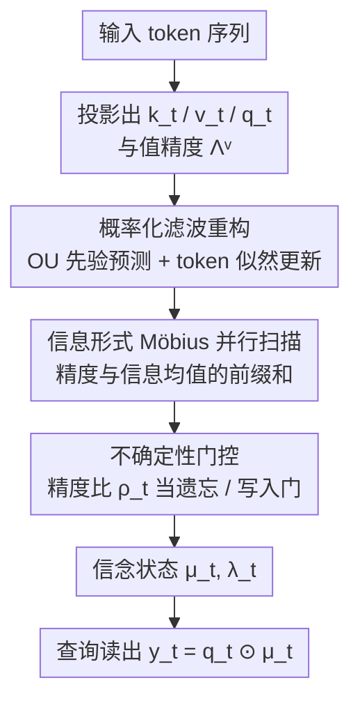

# Kalman Linear Attention: Parallel Bayesian Filtering For Efficient Language Modelling and State Tracking

**会议**: ICML2026  
**arXiv**: [2602.10743](https://arxiv.org/abs/2602.10743)  
**代码**: https://github.com/vaisakh-shaj/kalman-linear-attention  
**领域**: LLM效率 / 状态空间模型 / 线性注意力  
**关键词**: 卡尔曼滤波, 信息形式, Möbius 扫描, 不确定性门控, 状态追踪

## 一句话总结
把序列混合重新解释成一次精确的贝叶斯滤波，用卡尔曼滤波器的"信息形式"把本该顺序递归的更新改写成可并行前缀扫描的 Möbius（分式线性）映射，得到一个即插即用、线性复杂度、却比 GLA 更具表达力、还自带显式不确定性的序列混合层 KLA。

## 研究背景与动机
**领域现状**：为了突破 Transformer 注意力的 $\mathcal{O}(T^2)$ 复杂度，状态空间模型（S4/S5、Mamba）和门控线性注意力（GLA）成为主流替代品——它们用结构化递归实现 $\mathcal{O}(T)$ 训练、$\mathcal{O}(1)$ 推理，并且能用并行扫描在 $\mathcal{O}(\log T)$ 深度内训练。近期工作进一步把 Mamba 等都统一成 GLA 的门控变体，性能主要取决于门怎么定义。

**现有痛点**：这一类模型的隐状态更新本质上是**线性/仿射**的（$\mathbf{h}_t=\bar{\mathbf{a}}_t\odot\mathbf{h}_{t-1}+\bar{\mathbf{b}}_t x_t$），表达力受限于 softmax 注意力——softmax 的归一化会在 token 之间引入非线性交互，而线性递归做不到。更关键的是，它们**没有任何显式的状态不确定性**：模型对"自己当前记得的东西有多可靠"一无所知，于是门控只能是确定性的重加权，而不是按可信度去筛选信息。

**核心矛盾**：想要更强的表达力（尤其是状态追踪，如置换群 $A_5$ 的合成任务）就得引入非线性，但非线性更新通常意味着递归、不可并行；想要并行高效就得退回线性更新。表达力与并行性之间存在张力。

**本文目标**：能不能造一个状态空间块，**高效地实现精确的卡尔曼滤波更新**，从而在保持线性时间、可并行的同时获得超过 GLA 的非线性表达力和显式不确定性？

**切入角度**：作者从概率视角切入——把"token 序列"看成对一个隐随机过程的**含噪观测**，而不是驱动隐状态的外部控制信号。这样序列混合就变成贝叶斯滤波（后验推断），而卡尔曼滤波天然带着状态与不确定性的最优估计。乍看滤波是顺序的，但作者发现：卡尔曼滤波的**信息形式**让精度更新变成一个分式线性（Möbius）映射，而 Möbius 映射可以用 $2\times 2$ 矩阵相乘来复合、满足结合律，于是可以并行前缀扫描。

**核心 idea**：用"信息形式的卡尔曼滤波"代替"线性递归"来做序列混合——每个 token 的递归更新是非线性的（Möbius 精度递归），但在时间维度上仍然可并行扫描，由此换来更强的状态追踪能力和一条显式的不确定性轨迹。

## 方法详解

### 整体框架
KLA（Kalman Linear Attention）是一个即插即用的序列混合层，可以直接替换 Transformer 里的注意力层或 SSM 层。它不再像 Mamba 那样确定性地更新一个隐状态，而是维护一个关于隐表示 $\mathbf{z}_t$ 的**信念状态**——后验高斯 $\mathcal{N}(\bm{\mu}_t,\bm{\lambda}_t^{-1})$，既有后验均值 $\bm{\mu}_t$ 又有显式精度（不确定性）$\bm{\lambda}_t$。输入 token 投影出 $(\mathbf{k}_t,\mathbf{v}_t,\mathbf{q}_t)$ 与值精度 $\bm{\Lambda}_t^{\mathrm{v}}$ 后，每个 token 被当作隐状态的一次含噪观测：用连续时间 OU 随机先验做"预测"，用 token 似然做"更新"，最后用查询 $\mathbf{q}_t$ 从信念里读出输出 $\mathbf{y}_t=\mathbf{q}_t\odot\bm{\mu}_t$。

整条流程关键在于：把卡尔曼滤波改写到信息形式后，精度更新成了 Möbius 映射、信息均值更新成了仿射映射，两者都满足结合律，于是可以用并行前缀扫描在 $\mathcal{O}(T)$ 工作量、$\mathcal{O}(\log T)$ 深度里算完——和 Mamba 同档的并行画像。下图是单层 KLA 的数据流（为可读性按 $N=1$ 的对角逐通道形式画）：

### 关键设计

**1. 概率化滤波重构：把序列混合改写成线性高斯状态空间模型的后验推断**

针对"现有 SSM/GLA 没有显式不确定性、门控只能确定性重加权"这一痛点，KLA 把 token 处理整个改写成一个线性高斯状态空间模型上的贝叶斯滤波。隐状态演化用一个 Ornstein–Uhlenbeck（OU）过程当先验——它是均值回复扩散、是稳定 AR(1) 的连续时间对应，既保留指数遗忘，又**显式引入过程噪声**刻画隐动力学里"没建模到的漂移"。精确离散化后得到高斯转移 $\mathbf{z}_t\mid\mathbf{z}_{t-1}\sim\mathcal{N}(\bar{\mathbf{a}}_t\odot\mathbf{z}_{t-1},\,\bar{\mathbf{p}}_t)$，其中衰减 $\bar{\mathbf{a}}_t=e^{-\mathbf{a}\Delta t}$、过程噪声 $\bar{\mathbf{p}}_t=\tfrac{\mathbf{p}^2}{2\mathbf{a}}\odot(1-e^{-2\mathbf{a}\Delta t})$。

关键在于 $\bar{\mathbf{p}}_t$ 与 $\bar{\mathbf{a}}_t$ 由同一组参数耦合：控制遗忘速度的参数同时决定"两次观测之间不确定性怎么累积"，于是每个通道沿"记忆衰减"和"漂移自由度"两条轴自动专门化。每个 token 则被建模成隐状态的含噪证据 $\mathbf{v}_t\mid\mathbf{z}_t\sim\mathcal{N}(\mathbf{k}_t\odot\mathbf{z}_t,(\bm{\Lambda}_t^{\mathrm{v}})^{-1})$——$\mathbf{k}_t$ 是观测算子、$\bm{\Lambda}_t^{\mathrm{v}}$ 是"对这个 token 证据有多信"的精度。这和注意力里 q-k-v 的对应非常自然：$\mathbf{k}_t$ 给观测几何、$\mathbf{v}_t$ 是观测值、$\mathbf{q}_t$ 决定从推断出的信念里读出什么（取确定性读出极限 $\bm{\Lambda}_t^{\mathrm{out}}\to\infty$ 时输出就是后验均值投影 $\mathbf{y}_t=\mathbf{q}_t\odot\bm{\mu}_t$）。和 Mamba 把离散步长 $\Delta_t$ 既当时间尺度又当选择门不同，KLA 让"选择/筛选"完全由不确定性来做，不给 $\Delta_t$ 加额外负担。

**2. 信息形式 Möbius 重参数化：把顺序滤波变成可并行的前缀扫描**

贝叶斯滤波天然是递归的、看起来必须顺序算——这是它一直没能当序列混合器用的最大障碍。作者的关键观察是：把高斯后验写成**信息形式**（精度 $\bm{\lambda}_t$ 与自然参数 $\bm{\eta}_t:=\bm{\lambda}_t\odot\bm{\mu}_t$）后，吸收 token 证据只是"加自然参数"，而 predict 那一步带来的结构化变换可以复合。

定理 1 给出核心：定义 $\bm{\phi}_t:=\mathbf{k}_t^2\odot\bm{\Lambda}_t^{\mathrm{v}}$，则精度的递推 $\bm{\lambda}_{t-1}\mapsto\bm{\lambda}_t$ 是一个分式线性（Möbius）变换

$$\bm{\lambda}_t=\frac{\bm{\alpha}_t\odot\bm{\lambda}_{t-1}+\bm{\beta}_t}{\bm{\gamma}_t\odot\bm{\lambda}_{t-1}+\bm{\delta}_t},\qquad \mathbf{M}_t=\begin{pmatrix}1+\bar{\mathbf{p}}_t\odot\bm{\phi}_t & \bar{\mathbf{a}}_t^2\odot\bm{\phi}_t\\ \bar{\mathbf{p}}_t & \bar{\mathbf{a}}_t^2\end{pmatrix}.$$

Möbius 变换的复合等价于其 $2\times 2$ 系数矩阵相乘，矩阵乘法满足结合律，因此精度序列 $\{\bm{\lambda}_t\}$ 可以用并行前缀扫描在 $\mathcal{O}(T)$ 工作量、$\mathcal{O}(\log T)$ 深度算完（推论 1.1）。定理 2 进一步证明，给定精度轨迹后，信息均值 $\bm{\eta}_t$ 的演化是**仿射**的 $\bm{\eta}_t=\mathbf{f}_t\odot\bm{\eta}_{t-1}+\mathbf{k}_t\odot\bm{\Lambda}_t^{\mathrm{v}}\odot\mathbf{v}_t$，同样可并行扫描。相比 Särkkä 等人需要把每步滤波"提升"成 5 元组来凑结合律，KLA 在信息形式下**天然**就是 Möbius 映射，只需 $2\times 2$ 矩阵乘，结构最小、对 GPU 友好，也不需要 MesaNet/Gated KalmaNet 那样的稳态假设或共轭梯度/Chebyshev 内层迭代求解器。

**3. 不确定性驱动的非线性门控：让"历史置信度"决定吸收多少新证据**

这是 KLA 比线性/仿射 SSM 更强表达力的来源。把定理 1 的 Möbius 更新重排成"门"的形式

$$\bm{\lambda}_t=\underbrace{(\bar{\mathbf{a}}_t^2+\bar{\mathbf{p}}_t\odot\bm{\lambda}_{t-1})^{-1}\odot\bm{\lambda}_{t-1}}_{\text{历史置信度}}+\underbrace{\mathbf{k}_t^2\odot\bm{\Lambda}_t^{\mathrm{v}}}_{\text{当前 token 置信度}},$$

共享分母 $\bar{\mathbf{a}}_t^2+\bar{\mathbf{p}}_t\odot\bm{\lambda}_{t-1}$ 引入了**历史依赖**：随着累积精度变大，模型自然对吸收新证据越来越挑剔。记其倒数为精度比 $\bm{\rho}_t:=\mathbf{1}\oslash(\bar{\mathbf{a}}_t^2+\bar{\mathbf{p}}_t\odot\bm{\lambda}_{t-1})$，同一个 $\bm{\rho}_t$ 又出现在均值更新里当遗忘门 $\mathbf{f}_t=\bm{\rho}_t\odot\bar{\mathbf{a}}_t$，把精度轨迹和均值轨迹**耦合**在一起，诱导出"输入门/遗忘门"行为。关键是：KLA 的非线性**完全**来自过程噪声 $\bar{\mathbf{p}}_t$——它只通过 $\bm{\rho}_t$ 这个状态依赖因子进入递归。一旦令 $\bar{\mathbf{p}}_t=\mathbf{0}$，$\bm{\rho}_t$ 变常数、递归退化成固定遗忘的线性递归，KLA 就塌回普通 GLA。也正因如此，这种"分式线性（Möbius）"更新介于全非线性 RNN 和线性 SSM/注意力之间，能在常数深度（1–2 层）解掉 $A_5$ 置换合成任务，而线性 SSM/注意力需要随序列长度增长的深度。

这套递归还有一个统一视角：把信息均值递推读回矩量坐标 $\bm{\mu}_t=\bm{\eta}_t\oslash\bm{\lambda}_t$，会得到一个门控 RNN 更新，它正好是一个**精度加权最小二乘**目标的闭式最小解

$$L_t(\bm{\mu})=\bm{\Lambda}_t^{\mathrm{v}}\|\mathbf{v}_t-\mathbf{k}_t\odot\bm{\mu}\|^2+\bm{\rho}_t\odot\bm{\lambda}_{t-1}\|\bm{\mu}-\bar{\mathbf{a}}_t\odot\bm{\mu}_{t-1}\|^2,$$

即用观测精度权衡"拟合当前 token"与"贴近传播过来的旧均值"。这把 KLA 放进了 Longhorn/DeltaNet/Mamba 那套"序列模型 = 测试时在线学习器"的模板里，但 KLA 是表中唯一带精度加权、且门控来自一条耦合 Möbius 精度递归的成员——这也是它表达力更强的结构性原因。

### 损失函数 / 训练策略
KLA 块沿用 Mamba 的 fused-MLP 设计，把卡尔曼滤波器当作即插即用的混合器嵌进去；语言建模按标准自回归 next-token 预测训练。消融显示 OU 先验动力学与离散化对滤波稳定性很关键：去掉 OU 离散化后精度和学习稳定性都变差，越深的模型越明显。在确定性（$\mathbf{p}_t=0$）且线性时不变（LTI）设定下，KLA 更新退化成卷积，可用 FFT 在 $\mathcal{O}(\log T)$ 时间算出。

## 实验关键数据

### 主实验
KLA 是首批在**十亿 token 规模**上预训练的堆叠贝叶斯滤波原语。在表达力上，把 GPT 最后一层注意力替换成 KLA（GPT++KLA）在 45M 和 180M 参数下都是对注意力最强的补充；在状态追踪上，KLA 能在常数深度解掉线性 SSM/注意力解不了的 $A_5$ 置换合成任务。

| 维度 | Softmax 注意力 | SSM / GLA | KLA |
|------|---------------|-----------|-----|
| 表达力 | 非线性 | 线性 | 分式线性（Möbius） |
| 训练复杂度 | $\mathcal{O}(T^2)$ | $\mathcal{O}(T)$ | $\mathcal{O}(T)$ |
| 推理复杂度 | $\mathcal{O}(T)$ | $\mathcal{O}(1)$ | $\mathcal{O}(1)$ |
| 显式序列不确定性 | ✗ | ✗ | ✓ |
| 可并行训练 | ✓ | ✓ | ✓ |

在合成 token 操作、关联回忆与八个常识基准的零样本评测上，KLA 在相同计算开销下匹配或超过现代 SSM 与 GLA。

### 消融实验

| 配置 | 现象 | 说明 |
|------|------|------|
| 完整 KLA | 稳定收敛、表达力最强 | OU 先验 + Möbius 门控 |
| w/o OU 离散化 | 精度与学习稳定性下降，越深越差 | 失去耦合的过程噪声/时间尺度 |
| $\bar{\mathbf{p}}_t=\mathbf{0}$（去过程噪声） | $\bm{\rho}_t$ 变常数，塌回固定遗忘线性递归 | 非线性表达力丢失，退化为 GLA |

### 关键发现
- 非线性表达力**完全**由过程噪声 $\bar{\mathbf{p}}_t$ 供给：它只通过状态依赖因子 $\bm{\rho}_t$ 进入递归，置零即线性化——这把"表达力增益来自哪"定位得非常干净。
- 显式不确定性不是摆设，而是直接当门控：精度比 $\bm{\rho}_t$ 既调精度轨迹又当遗忘门，"历史越确信、对新证据越挑剔"是自然涌现的、而非人工设计的门。
- 同等算力下能解线性 SSM/注意力解不了的状态追踪任务，说明 Möbius 更新的额外表达力是真有用、可测量的，而不只是理论上的好看。

## 亮点与洞察
- **把"顺序滤波不可并行"这一刻板印象证伪**：信息形式下卡尔曼更新天然是 Möbius 映射、精度按 $2\times 2$ 矩阵乘复合，无需 5 元组提升、无需稳态假设、无需测试时内层求解器——这是全篇最漂亮的一手。
- **不确定性即门控**：现有门控线性注意力的门都是人工设计的标量/向量，KLA 让门从"贝叶斯精度比"里推导出来，自带可解释语义（置信度高就少吸收新证据），把"为什么这样门控"回答得很彻底。
- **统一视角可迁移**：精度加权最小二乘的在线学习器解释把 KLA 与 DeltaNet/Mamba/Gated DeltaNet 摆在同一张表里，给后续设计新混合器提供了"在目标函数里加什么权重"的清晰旋钮。

## 局限与展望
- 协方差/精度全程保持**对角**，状态扩展得到的 $\mathbf{H}_t\in\mathbb{R}^{N\times D}$ 只是并行记忆槽、不是满协方差——这限制了能表达的跨维相关结构，作者也明确这一点。
- 方法把连续状态的概率模型用于离散语言建模，理论最优性（MMSE）只在线性高斯假设下成立，真实语言显然不满足，增益更多是经验性的。
- 实验规模到十亿 token，但与最前沿大模型相比仍偏小；超长上下文下 Möbius 扫描的数值稳定性（精度可能极端化）值得进一步压力测试。
- 读出取了确定性极限 $\bm{\Lambda}_t^{\mathrm{out}}\to\infty$，把输出不确定性丢掉了；如何把信念状态的不确定性真正用到下游决策/校准上是个自然的延伸方向。

## 相关工作与启发
- **vs Mamba / GLA**：它们用线性/仿射递归、门由参数化定义、无显式不确定性；KLA 用 Möbius 精度递归、门由不确定性推导、自带信念状态——表达力从"线性"升到"分式线性"，开销不变。
- **vs MesaNet / Gated KalmaNet**：两者也解类似的正则最小二乘，但假设静态确定性隐状态（无转移动力学）、且需要共轭梯度/Chebyshev 这类昂贵迭代求解器；KLA 保留转移与过程噪声，给出闭式、可扫描的 Möbius 后验均值更新，既不要稳态假设也不要内层求解器。
- **vs Särkkä 的滤波时间并行化**：他们靠把每步提升成 5 元组来凑结合律；KLA 证明信息形式下根本不需要提升，结构更小更省、且把概率原语真正嵌进可学习的神经序列模型里、用多层堆叠训练到十亿 token 规模。

## 评分
- 新颖性: ⭐⭐⭐⭐⭐ 把卡尔曼滤波的信息形式与 Möbius 并行扫描结合，给序列混合提供了全新且自洽的概率视角。
- 实验充分度: ⭐⭐⭐⭐ 覆盖状态追踪、关联回忆、常识零样本与十亿 token 预训练，但与最前沿大模型相比规模仍有限。
- 写作质量: ⭐⭐⭐⭐⭐ 定理—推论—门控重排—在线学习器视角层层递进，q-k-v 对照表把概率语义讲得很清楚。
- 价值: ⭐⭐⭐⭐⭐ 即插即用、复杂度不变却换来更强表达力与显式不确定性，对高效长序列建模有直接意义。

<!-- RELATED:START -->

## 相关论文

- [\[ICML 2026\] Dynamic Linear Attention](dynamic_linear_attention.md)
- [\[ICML 2026\] Optimal Bayesian Stopping for Efficient Inference of Consistent LLM Answers](optimal_bayesian_stopping_for_efficient_inference_of_consistent_llm_answers.md)
- [\[NeurIPS 2025\] Tiled Flash Linear Attention: More Efficient Linear RNN and xLSTM Kernels](../../NeurIPS2025/llm_efficiency/tiled_flash_linear_attention_more_efficient_linear_rnn_and_xlstm_kernels.md)
- [\[ICML 2026\] IR3DE: A Linear Router for Large Language Models](ir3de_a_linear_router_for_large_language_models.md)
- [\[NeurIPS 2025\] ZeroS: Zero-Sum Linear Attention for Efficient Transformers](../../NeurIPS2025/llm_efficiency/zeros_zero-sum_linear_attention_for_efficient_transformers.md)

<!-- RELATED:END -->
