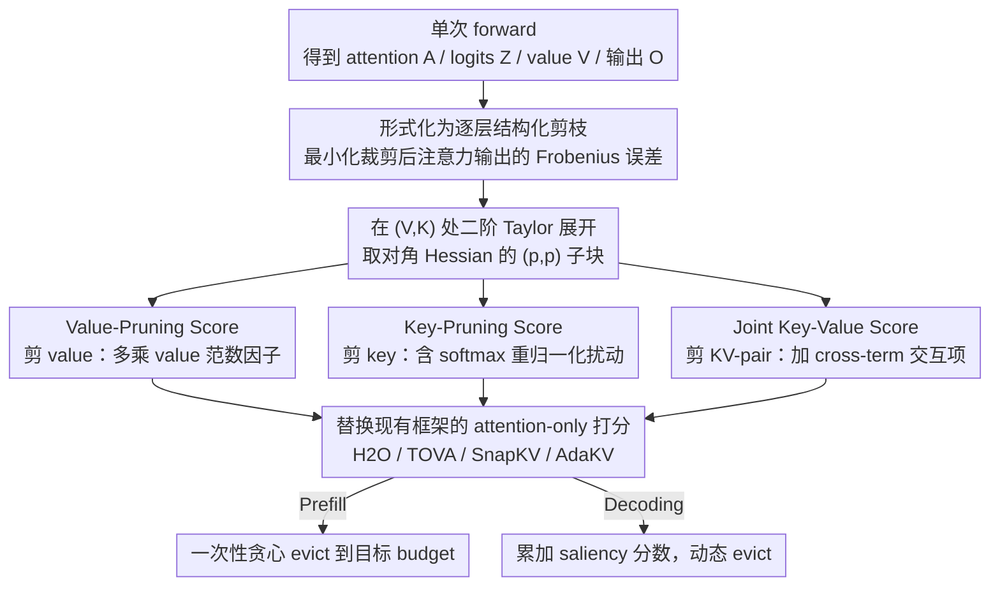

# OBCache: Optimal Brain KV Cache Pruning for Efficient Long-Context LLM Inference

**会议**: ICML2026  
**arXiv**: [2510.07651](https://arxiv.org/abs/2510.07651)  
**代码**: https://github.com/DreamSoul-AI/OBCache  
**领域**: LLM效率 / KV Cache 压缩  
**关键词**: KV cache eviction, Optimal Brain Damage, 长上下文推理, 二阶 Taylor 近似, output-aware saliency

## 一句话总结
本文把 KV cache eviction 重新表述为"逐层结构化剪枝"问题，借用 Optimal Brain Damage 的二阶 Taylor 近似推导出针对独立 value、独立 key、key-value 联合三种剪枝单位的闭式 saliency 分数，作为即插即用的"分数替换件"接入 H2O / TOVA / SnapKV / AdaKV 等现有 attention-only eviction 框架，在 LLaMA-3.1 / Qwen-2.5 的 RULER 与 LongBench 上获得稳定提升（AdaKV 在 query-agnostic RULER-4K 30% budget 上提升近 15%）。

## 研究背景与动机

**领域现状**：长上下文 LLM（128K–1M tokens）推理的最大瓶颈是 KV cache，其大小随序列长度和 batch 线性增长——LLaMA-3.1-8B 在 1M 上下文下需要 120GB+ 的 KV cache，远超主流 GPU 显存。主流缓解方案之一是 **training-free 的 cache eviction**：H2O / TOVA / SnapKV 等方法基于 "只有少量 token 显著影响输出" 的观察，按某种 saliency 分数把不重要的 token 永久丢掉。

**现有痛点**：现有 eviction 方法几乎都只用 attention weights 累加作为 saliency（H2O 累加全部历史，TOVA 只看最新 query，SnapKV 用最近窗口+pooling），完全忽略 value state 对最终输出的贡献。直觉上很容易出错——一个 token 的 attention weight 大但对应 value 几乎是零向量，对输出毫无影响却被保留；反之 attention weight 小但 value 方向特殊的 token 可能被错杀。

**核心矛盾**：saliency 的"金标准"应该是 **去掉这个 token 后真实输出 $\mathbf{O}$ 的扰动**，而 attention weight 只是这个扰动的一个粗糙近似。VATP / CriticalKV 已经意识到 value norm 该被纳入，但要么没有形式化框架，要么需要额外的 attention 分布假设。

**本文目标**：(1) 给 cache eviction 一个统一的理论框架，把 attention-only 分数和 value-aware 分数都纳入其中；(2) 在该框架下推出**显式包含 value/key 信息的闭式 saliency 分数**；(3) 让新分数能即插即用替换任意现有方法里的 saliency 项。

**切入角度**：注意到 1989 年 LeCun 的 Optimal Brain Damage 已经为"剪掉某个权重后任务损失的二阶 Taylor 近似"给出了优雅闭式解。如果把 cached KV 视作"动态权重"，eviction 就是结构化剪枝；那么 OBD 的二阶展开同样适用。

**核心 idea**：把 cache eviction 形式化为"使裁剪后注意力输出 $\widehat{\mathbf{O}}$ 与原始 $\mathbf{O}$ 的 Frobenius 误差最小"的逐层剪枝问题，对该误差做二阶 Taylor 展开后，**针对剪 value、剪 key、剪 KV-pair 三种单位**分别得到一个能立即计算的闭式分数。

## 方法详解

### 整体框架
OBCache 的全部改动只发生在 eviction 方法的"打分"这一步：它不碰 H2O / TOVA / SnapKV / AdaKV 决定"何时触发裁剪""如何在多 head 间分配预算"的调度逻辑，只把它们打分函数里那个 attention-only 的 saliency 换成一个能感知 value/key 的闭式分数。换分数的依据是把 cache eviction 重新看成逐层的结构化剪枝：在 token 位置 $p$ 写出扰动 $\widehat{\mathbf{V}} = \mathbf{V} + \delta\mathbf{V}$、$\widehat{\mathbf{K}} = \mathbf{K} + \delta\mathbf{K}$，剪掉该 token 等价于令 $\mathbf{e}_p^\top [\widehat{\mathbf{V}}\ \widehat{\mathbf{K}}] = \mathbf{0}$；优化目标是让裁剪后注意力输出与原始输出的 Frobenius 误差（*pruning-induced eviction error*）$\mathcal{L} = \| \sigma(\mathbf{Q}\widehat{\mathbf{K}}^\top/\sqrt{d})\widehat{\mathbf{V}} - \sigma(\mathbf{Q}\mathbf{K}^\top/\sqrt{d})\mathbf{V} \|_F^2$ 最小，它是不可观测的真实 eviction error（影响未来 $\mathbf{o}_{s+1},\dots$）的代理。在 $(\mathbf{V},\mathbf{K})$ 处做二阶 Taylor 展开，一阶项因 $\widehat{\mathbf{O}}-\mathbf{O}=\mathbf{0}$ 而消失，剩下 $\mathcal{L} = \tfrac{1}{2}\delta\mathbf{V}^\top \mathbf{H}^{vv} \delta\mathbf{V} + \tfrac{1}{2}\delta\mathbf{K}^\top \mathbf{H}^{kk} \delta\mathbf{K} + \delta\mathbf{V}^\top \mathbf{H}^{vk} \delta\mathbf{K} + \mathcal{O}(\|\cdot\|^3)$；再沿用 OBD 的对角假设、只取 Hessian 的 $(p,p)$ 子块，就能为剪 value、剪 key、剪 KV-pair 三种单位各推出一个能从单次 forward 立即算出的闭式 saliency $\mathbf{S}_p$，最后代回原方法替换 attention-累加分数即可。下面三个分数对应论文 Propositions 4.3–4.5。

### 关键设计

**1. Value-Pruning Score（$\mathbf{S}_p^{\text{value}}$）：只删 value 时输出扰动的最廉价度量**

attention-only 分数最直接的漏洞是只看 token 被注意了多少、不看它的 value 长什么样——一个 attention weight 大但 value 接近零向量的 token 对输出毫无贡献却被保留。把 value 当作唯一剪枝单位（$\mathbf{e}_p^\top \widehat{\mathbf{V}} = \mathbf{0}$）代入二阶 Taylor 的第一项，闭式结果是 $\mathbf{S}_p^{\text{value}} = \sum_i |\mathbf{A}_{i,p}|^2 \|\mathbf{v}_p\|^2$，即该 token 所在 attention 列的 $\ell_2$ 范数平方再乘以 value 范数平方。这等于在原来的 attention 分数上只多挂一个 $\|\mathbf{v}_p\|^2$ 缩放因子，开销几乎为零却把 value-state 信息引了进来；更关键的是，VATP / CriticalKV 此前启发式提出的 value-aware 分数恰好是该式取 $\ell_1$-norm 的特例，所以"value norm 该乘进来"这件事不再是经验直觉，而是 OBD 框架自然推出的结论。

**2. Key-Pruning Score（$\mathbf{S}_p^{\text{key}}$）：捕捉剪 key 后 softmax 重归一化的连锁扰动**

剪 value 只挪动一个被加权的向量，剪 key 的破坏力大得多——它会改写整列 logits，softmax 行重归一化后整张 attention 分布都被拉偏，而现有 attention-only / value-aware 分数都没显式建模这一连锁效应。把 key 当作剪枝单位（$\mathbf{e}_p^\top \widehat{\mathbf{K}} = \mathbf{0}$）推出的闭式分数是 $\mathbf{S}_p^{\text{key}} = \sum_i |\mathbf{A}_{i,p} \mathbf{Z}_{i,p}|^2 \|\mathbf{v}_p - \mathbf{o}_i\|^2$，其中 $\mathbf{Z}$ 是 pre-softmax logits、$\mathbf{o}_i$ 是第 $i$ 个 query 位置的注意力输出。它给高分的是那些"value 方向与当前输出 $\mathbf{o}_i$ 差异大、且 attention 与 logits 都不小"的 token——正是这类 token 一旦被剪，重归一化后会把 $\mathbf{O}$ 显著拉偏。因为显式刻画了这层 attention-only 信号完全看不见的灵敏度，key-pruning 也成了 OBCache 相比已有方法收益最大的来源。

**3. Joint Key-Value Score（$\mathbf{S}_p^{\text{joint}}$）：把 key/value 交互项也算进来的完备估计**

前两个分数各自只动一边，无法刻画同时剪掉 $(\mathbf{k}_p,\mathbf{v}_p)$ 时二者的耦合。把它们当作联合剪枝单位，闭式分数为 $\mathbf{S}_p^{\text{joint}} = \mathbf{S}_p^{\text{value}} + \mathbf{S}_p^{\text{key}} + 2 \sum_i |\mathbf{A}_{i,p}|^2 \mathbf{Z}_{i,p} (\|\mathbf{v}_p\|^2 - \mathbf{v}_p^\top \mathbf{o}_i)$，比 value+key 多出的第三项正是 cross-Hessian $\mathbf{H}^{vk}$ 的贡献，捕获 key 与 value 的交互效应，因而对真实 eviction error 的估计最完整。它的意义更多在框架上的理论完备，同时把 OBCache-V / -K / -V&K 三档摆出来，让用户按算力预算选择。

**与现有方法的统一**：把目标函数从"输出误差"放松到"注意力矩阵行误差 $\|\widehat{\mathbf{A}}_{w:s} - \mathbf{A}_{w:s}\|_{1,1}$"、并把剪枝单位简化为 attention 矩阵的一列时，框架退化到 $\mathbf{S}_p^{\text{attn}} = \sum_{i=w}^s |\mathbf{A}_{i,p}|$——这正是 H2O ($w=1$)、TOVA ($w=s$)、SnapKV ($w \gg 1$) 所用的累加分数，它们因此都成了 OBCache 在不同"扰动窗口" $w$ 下的特例。

### 损失函数 / 训练策略
OBCache 是 **training-free 的推理时方法**，无需任何训练或微调。所有 Hessian 子块都可以从一次正常的 forward 中算出（需要 attention weights $\mathbf{A}$、pre-softmax logits $\mathbf{Z}$、values $\mathbf{V}$、outputs $\mathbf{O}$），用 FlashAttention-2 实现 prefill 时几乎零额外显存代价。Prefill 阶段一次性贪心 evict 到目标 budget；decoding 阶段对 $\mathbf{S}_p$ 累加做实时更新支持动态 eviction。GQA 模型有独立的推导（Appendix A.5）。

## 实验关键数据

### 主实验
设置：LLaMA-3.1-8B-Instruct / Qwen-2.5-7B-Instruct，KVPress 框架；prefill 阶段在 RULER (4K/32K) + LongBench 上评估，decoding 阶段在 PG19 (~70K tokens) 上评估 perplexity。Cache budget = prompt 长度的 10–40%。对比 query-aware 与 query-agnostic 两种设定。

| Baseline (LLaMA-3.1-8B, RULER-4K) | 设定 | 平均 acc | + OBCache-K | + OBCache-V&K | 提升 |
|------|------|------|------|------|------|
| H2O | Q-Aware | 57.5 | 67.6 | 67.8 | **+10.3** |
| H2O | Q-Agnostic | 31.7 | 38.9 | 40.0 | +8.3 |
| TOVA | Q-Aware | 74.5 | 76.5 | 76.7 | +2.2 |
| SnapKV | Q-Aware | 72.4 | 73.9 | 73.6 | +1.5 |
| SnapKV | Q-Agnostic | 37.9 | 42.1 | 41.9 | +4.2 |
| AdaKV | Q-Aware | 75.7 | 81.6 | 81.9 | +6.2 |
| AdaKV | Q-Agnostic | 43.0 | 55.0 | **55.2** | **+12.2** |

> RULER-32K 同样全面提升，AdaKV + OBCache-V&K 在 query-agnostic 上从 45.5 → 55.1（+9.6）。LongBench 上 AdaKV 在 10% budget 下 OBCache-K 贡献 query-aware +1.2 / query-agnostic +2.6。

### 消融实验

| 配置 (RULER-4K, AdaKV baseline, Q-Agnostic) | 平均 acc | 说明 |
|------|------|------|
| AdaKV (attention-only) | 43.0 | 现有最强 attention-only 基线 |
| + OBCache-V | 51.4 | 仅引入 value 信息（与 VATP / CriticalKV 同型，但 $\ell_2$） |
| + OBCache-K | 55.0 | 引入 key 灵敏度，贡献最大 |
| + OBCache-V&K | 55.2 | 加入 cross-term，对 V 仅有微小改进 |
| VATP (OBCache-V-L1) | < OBCache-V | $\ell_1$-norm value-only，被 OBCache-V 全面超越 |
| CriticalKV | < OBCache-K | 仅在 40% budget 时与 OBCache 接近 |

### 关键发现
- **Key-pruning 分数收益远大于 value-pruning 分数**：剪 key 会让整行 softmax 重新归一化、改写 attention 分布，扰动量级天然更大，OBCache-K 在所有 baseline、所有 budget 下都明显优于 OBCache-V。
- **OBCache 与 baseline 越强越互补**：在 H2O 上提升 ~10%，在 AdaKV 上 query-agnostic 仍能涨 ~12%，说明 attention-only 信号在所有 budget 分配策略里都是"信息缺口"。
- **二阶 Taylor 近似几乎无损**：4.4 节 Needle-in-A-Haystack 实验显示 OBCache 闭式分数对 oracle top-$k$ 的 recall 与"精确重算 Eq.(1)"几乎相同，但成本远低。
- **存在结构性偏置**：扰动窗口越大，早期 token 因被更多 query 注意而累计分数过高；论文沿用 H2O 的"固定 recent window"策略（如 20 tokens）即可缓解。
- **Decoding 场景**：PG19 上固定 1024-token budget、4 个 sink，OBCache-K 在 1–32K 全段 perplexity 都低于 H2O；OBCache-V&K 没超过 OBCache-K，提示简单加法形式可能不是最优融合。

## 亮点与洞察
- **把 1989 年的 OBD 优雅地搬到了 2026 年的 KV cache**：cached KV 在推理时其实就是"按需注入的动态权重"，结构化剪枝的二阶分析整套机器立刻可用，无需重新发明。
- **统一框架的副产品很值钱**：作者顺手证明 H2O / TOVA / SnapKV 是同一个目标的不同"扰动窗口 $w$"特例、VATP / CriticalKV 是 value-only 的 $\ell_1$ 变体——这种"老方法在新框架下都是特例"的叙事比单纯刷点更有说服力。
- **OBCache-V 几乎免费**：在 attention-only 分数上只多一个 $\|\mathbf{v}_p\|^2$ 缩放因子，几乎零开销但在大部分 baseline 上都涨点，部署性价比极高。
- **可迁移性强**：相同范式可以推到 channel-wise KV pruning、cache merging（把"剪到 0"换成"剪到另一个保留 token"）、甚至 weight-share 场景下的 KV factorization。

## 局限与展望
- **二阶展开仅在"小扰动"成立**：当 cache budget 极低（如 5%）时多 token 同时剪掉，对角假设和小扰动假设都会破裂，框架的理论保证变弱，论文没在 < 10% budget 报点。
- **Cross-term 收益微弱**：OBCache-V&K 几乎不超过 OBCache-K，意味着加法形式没充分利用 V/K 交互；这恰恰是论文 conclusion 暗示的"未来更精细组合"的空间。
- **没探究 head-wise / channel-wise pruning**：框架明显能推到 head channel 维度（OBD 本来就是 channel-wise），但本文实验只覆盖 token-wise eviction。
- **依赖能拿到 logits $\mathbf{Z}$、outputs $\mathbf{O}$**：在某些定制推理后端（如把 softmax 融进 kernel 里）需要额外暴露中间量，工程改动不算零成本。
- **没有跨模型族泛化研究**：仅在 LLaMA-3.1 / Qwen-2.5 上验证；MoE 模型（DeepSeek-V3）和长 KV cache 蒸馏模型上是否仍稳定提升留待验证。

## 相关工作与启发
- **vs H2O (NeurIPS 2023)**: H2O 累加全部历史 attention，OBCache 把这个公式视作"扰动窗口 $w=1$、最小化 attention 行误差"的特例，并显式纳入 value/key 信息，因而在同一个 budget 调度下稳定加 10%。
- **vs SnapKV (NeurIPS 2024)**: SnapKV 用最近窗口 + 1D pooling 平滑 attention-only 分数；OBCache 直接给出更准的 saliency，pooling 的边际收益反而减小（query-aware 上 OBCache 提升幅度对 SnapKV 最小）。
- **vs VATP / CriticalKV (2024–2025)**: 它们启发式地把 $\|\mathbf{v}_p\|$ 乘进 attention 分数；OBCache 用 OBD 重新推出同型公式（且证明 $\ell_2$ 比 $\ell_1$ 更利于推出 key-pruning 项），并多出 key/joint 两个新分数，全面超越。
- **vs Wanda / SparseGPT (2023)**: 它们是 OBD 范式在静态权重剪枝的现代化复兴，OBCache 把这条线推广到"动态 KV 权重"上，本质是把 Hessian 推导从 weight 维度搬到 token 维度。
- **可迁移启发**：(1) 任何带 softmax 的 attention/router 都可以套同一框架——比如 MoE expert eviction、retrieval-augmented 系统里的 chunk eviction、多模态 vision token pruning；(2) "把启发式分数证明成某个 well-defined 目标的二阶解"是一种强叙事范式，很适合写"统一/重审"类论文。

## 评分
- 新颖性: ⭐⭐⭐⭐ 把 OBD 拓展到动态 KV cache 是相当干净的概念再使用，统一现有方法的部分尤其出彩；但 value-aware 部分本质是给 VATP / CriticalKV 补了理论解释。
- 实验充分度: ⭐⭐⭐⭐ 跨 4 个 baseline × 2 个模型 × 2 个长上下文 benchmark × 多 budget × prefill/decoding，覆盖全面；缺极低 budget 与 MoE 验证。
- 写作质量: ⭐⭐⭐⭐ 从 OBD 一路推到三个 closed-form 分数、再把现有方法收成特例的叙事很清晰；公式排版偶有 GQA / 多 head 表述容易跳步。
- 价值: ⭐⭐⭐⭐ 即插即用的 saliency 替换件，对部署长上下文 LLM 的工程团队有立即可落地价值；OBCache-V 几乎零成本就能涨点。

<!-- RELATED:START -->

## 相关论文

- [\[ICML 2026\] Optimal Bayesian Stopping for Efficient Inference of Consistent LLM Answers](optimal_bayesian_stopping_for_efficient_inference_of_consistent_llm_answers.md)
- [\[ICML 2026\] CriticalKV: Optimizing KV Cache Eviction from an Output Perturbation Perspective](criticalkv_optimizing_kv_cache_eviction_from_an_output_perturbation_perspective.md)
- [\[ICML 2026\] RKSC: Reasoning-Aware KV Cache Sharing and Confident Early Exit for Multi-Step LLM Inference](rksc_reasoning-aware_kv_cache_sharing_and_confident_early_exit_for_multi-step_ll.md)
- [\[ICLR 2026\] LycheeDecode: Accelerating Long-Context LLM Inference via Hybrid-Head Sparse Decoding](../../ICLR2026/llm_efficiency/lycheedecode_accelerating_long-context_llm_inference_via_hybrid-head_sparse_deco.md)
- [\[ACL 2025\] Squeezed Attention: Accelerating Long Context Length LLM Inference](../../ACL2025/llm_efficiency/squeezed_attention_accelerating_long_context_length_llm_inference.md)

<!-- RELATED:END -->
