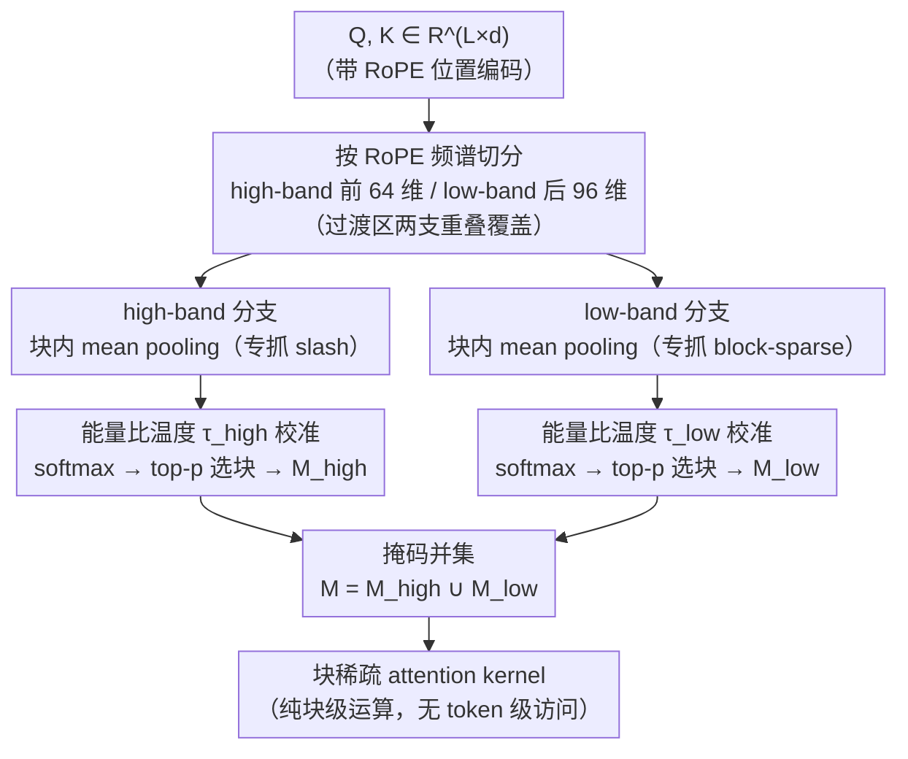

# Prism: Spectral-Aware Block-Sparse Attention

**会议**: ICML 2026  
**arXiv**: [2602.08426](https://arxiv.org/abs/2602.08426)  
**代码**: https://github.com/xinghaow99/prism  
**领域**: LLM效率 / 长上下文稀疏注意力  
**关键词**: 块稀疏注意力, RoPE, 频谱分解, 长上下文, pre-filling 加速

## 一句话总结
Prism 把"块重要性估计"分解到 RoPE 的高频/低频两个频带分别做 mean-pooling 加 softmax，并用能量比推出的温度自动校准 logit 量级，从而完全用块级运算（不再回落到 token 级搜索）拿到与 full attention 几乎相同的精度，在 128K 上对 FlashAttention-2 取得 5.1× 加速。

## 研究背景与动机

**领域现状**：长上下文 LLM 的 pre-filling 阶段被 $O(L^2)$ 自注意力卡住。块稀疏注意力把序列切成 $B \times B$ 块（典型 $B=128$），只算被选中的块对，天然契合 FlashAttention 的 tiling，是当前主流加速路线。其核心子问题是**块重要性估计**：在不算全注意力的前提下，挑出每个 Query 块该看哪些 Key 块。

**现有痛点**：训练-free 方法（MInference、FlexPrefill、XAttention、PBS-Attn 等）走的是"先 mean pooling 做 coarse-grained 代理，再启发式补救"的路线。代理本身不准，所以它们必须额外做 token 级搜索/打分/置换/反对角线扫描去抓住 vertical slash 这类局部模式。结果是估计开销吃掉了稀疏带来的收益——在 32K 量级它们甚至打不过高度优化的 FlashAttention-2。

**核心矛盾**：为什么 mean pooling 这一步代理这么不准？作者给出一个之前没被点破的根因：**mean pooling 在 RoPE 下是一个低通滤波器**。RoPE 把不同维度配上几何衰减的旋转频率 $\theta_j = b^{-2j/d}$；高频维度（小 $j$，旋转快）在一个块内做平均时发生相位抵消，能量塌到接近 0，形成一个"盲区"，恰好把刻画局部相对位置（slash 模式）的信号抹掉了。换言之，注意力的两类典型稀疏模式不是"分散在不同 head 上"，而是"在同一个 head 里被频谱分离开"。

**本文目标**：在不引入任何 token 级运算的前提下，做出一个能同时抓 vertical slash 和 block-sparse 两种模式、且 logit 量级和 full attention 对齐的块级估计器。

**切入角度**：既然 mean pooling 把高频信号"过滤掉了"，那就别让两个频带在一个池化结果里互相干扰——把高频和低频拆开各自池化、各自打分，然后用一个数学上推得出来的温度把两边的 logit 量级拉回到与全维度等价。

**核心 idea**：用频谱分解的双分支 coarse-grained attention + 能量比温度校准，替代"粗代理 + token 级补救"的旧范式。

## 方法详解

### 整体框架
Prism 要解决的是块稀疏注意力的核心瓶颈——如何在不回落到 token 级运算的前提下，准确挑出每个 Query 块该看哪些 Key 块。它的做法是把块重要性估计拆到 RoPE 的两个频带上分头处理：拿到 query/key 矩阵 $Q, K \in \mathbb{R}^{L \times d}$ 后，先按 RoPE 频谱把维度切成 high-band（前 $d_{\text{high}}$ 维）和 low-band（后 $d_{\text{low}}$ 维），两个分支各自做 block 内 mean pooling 得到 $\bar Q_z, \bar K_z \in \mathbb{R}^{N \times d_z}$（$N = \lceil L/B \rceil$），再用各自的能量校准温度 $\tau_z$ 算 softmax 得到块级得分 $\bar S_z$ 并 top-p 选块，最后把两支掩码并起来 $M = M_{\text{high}} \cup M_{\text{low}}$ 喂给后续的块稀疏 attention kernel。整个估计过程只有块级矩阵乘，没有任何 token 级访问。

### 关键设计

**1. Mean pooling = RoPE 下的低通滤波器：先讲清旧代理为什么看不见 slash 模式**

旧的训练-free 方法都靠"先 mean pooling 做粗代理、再启发式补救"，但代理本身不准，所以才要额外做 token 级搜索。Prism 给出的根因是：在 RoPE 下，块内 mean pooling 本质上是一个低通滤波器。假设块内语义内容 $c^{(j)}$ 局部稳定，第 $j$ 个频率对在块大小 $B$、起点 $n_0$ 的池化结果可写成几何级数 $\bar q^{(j)} \approx \frac{c^{(j)} e^{i n_0 \theta_j}}{B} \sum_{k=0}^{B-1} e^{i k \theta_j}$，其幅值衰减因子等价于 $\lambda_j(B) = \frac{1}{B}\left|\frac{\sin(B \theta_j / 2)}{\sin(\theta_j / 2)}\right| \approx \mathrm{sinc}(B \theta_j / 2\pi)$。RoPE 给高频维度配的旋转频率 $\theta_j = b^{-2j/d}$ 很大，一个块内做平均时相位互相抵消、能量塌到接近 0——刻画局部相对位置（slash 模式）的信号恰好就藏在这些高频维度里，于是被滤掉了。代入 $B=128, d=128$、Qwen3 base $b=10^6$，解 $B\theta_j = 2\pi$ 得 cutoff $2j \approx 28$：前约 30 维是"死区"（信号被完全相位抵消），30–60 维是"过渡区"，60 维之后才是"语义区"。Qwen3-8B 上实测的 query RMS norm 印证了这点——token 级时死区 RMS≈1.0，池化后塌到 ≈0.1，而语义区池化前后基本不变。

这个分析把"代理不准"从一句工程吐槽升级成可量化的频谱事实，也直接给出处方：被低通滤波吃掉的频带和被保留的频带，logit 量级天差地远，绝不能共享同一个 softmax 温度，更不该塞进同一次池化里互相干扰。

**2. Dual-Band Block Importance Estimation：把高频和低频拆开各打各的分**

既然高频和低频在 RoPE 下编码的是完全不同的结构（相对位置 vs. 全局语义），硬塞进同一个 softmax 必然让强信号掩盖被池化拍弱的高频信号，那就让两个频带分头处理。切片得到 $Q_z, K_z$ 后分别 mean-pool，每个分支按 $\bar S_z = \mathrm{softmax}\big(\bar Q_z \bar K_z^\top / (\tau_z \sqrt{d_z})\big)$ 算块级 attention，再对每个 query 块用 top-p 累计概率挑出该分支看中的 key 块，得到 $M_{\text{high}}, M_{\text{low}}$，最终并集 $M = M_{\text{high}} \cup M_{\text{low}}$。这样 high-band 专抓 slash、low-band 专抓 block-sparse，比"先合并再用 token 级搜索补救"省掉了全部 token 级开销。

一个反直觉但关键的细节是两个分支故意重叠：论文取 $d_{\text{high}} = 64, d_{\text{low}} = 96$，合计 160 > $d=128$，让过渡区被两支同时覆盖。消融证实这种重叠是必要的——把 high-band 缩到死区 $d_{\text{high}}=32$ 会因为在纯噪声上做校准而严重掉点；把 low-band 缩到 $d_{\text{low}}=64$（不覆盖过渡区）则会出现 U 形不稳定曲线，因为过渡区那段中等能量正好是 low-band 的天然"频谱正则化"。

**3. Energy-Based Temperature Calibration：用能量比推一个 0 超参的温度，把两支 logit 量级拉回可比**

分头打分后还有个问题：高频分支被低通滤波拍弱，logit 摊得很平、softmax 熵高，top-p 会被迫一口气塞进大量噪声块，密度预算全浪费了。Prism 用一个无超参的温度 $\tau_z$ 把每个频带子空间的 logit 幅度对齐回"全维度池化"的量级。先用 $\mathrm{RMS}(\bar X) = \sqrt{\frac{1}{N}\sum_u \|\bar x_u\|^2 / d}$ 衡量频谱能量密度；注意力 logit 在 $d$ 个维度上累加，幅度满足 $|L_{\text{full}}| \propto \sqrt{d}\,\mathrm{RMS}(\bar Q_{\text{full}})\mathrm{RMS}(\bar K_{\text{full}})$，子空间分支同理是 $|L_z| \propto \sqrt{d_z}\,\mathrm{RMS}(\bar Q_z)\mathrm{RMS}(\bar K_z)$。令 $|L_z|/\tau_z \approx |L_{\text{full}}|$ 即可解出

$$\tau_z \approx \sqrt{d_z/d} \cdot \frac{\mathrm{RMS}(\bar Q_z)}{\mathrm{RMS}(\bar Q_{\text{full}})} \cdot \frac{\mathrm{RMS}(\bar K_z)}{\mathrm{RMS}(\bar K_{\text{full}})}.$$

整个公式只依赖运行时统计量、0 超参。校准把高频分支被摊平的分布重新锐化，使 top-p 的密度预算花在真正的强信号上、两支的阈值也变得可比——消融图显示校准后整条 PPL-Density 帕累托前沿显著左移。

### 损失函数 / 训练策略
完全 training-free。$B=128$；$d_{\text{high}}=64, d_{\text{low}}=96$（按 Eq.8 算出的 cutoff + 32 倍数对齐 Tensor Core 选取）；Llama-3.1-8B 用 top-p $=0.95$，Qwen 系列用 $0.93$；估计和稀疏 attention 均用自定义 Triton kernel。

## 实验关键数据

### 主实验
在 PG19（语言建模）、LongBench（长上下文理解）、RULER（长上下文检索）、VideoMME / LongVideoBench（视频理解）、HunyuanVideo（视频生成）五类任务上对比 MInference / FlexPrefill / XAttention / PBS-Attn / FlashAttention-2。

| 任务/模型 | 指标 | Full | XAttention | FlexPrefill | MInference | PBS-Attn | **Prism** |
|---|---|---|---|---|---|---|---|
| LongBench / Llama-3.1-8B | 平均分 | 41.47 | 39.68 | 33.90 | 41.14 | 40.94 | **41.08** |
| LongBench / Qwen-3-8B | 平均分 | 39.49 | 38.82 | 36.13 | 39.18 | 39.01 | **39.12** |
| RULER / Llama-3.1-8B | 4K–128K 平均 | 88.94 | 87.44 | 87.43 | 87.44 | 87.08 | **87.54** |
| RULER / Qwen-3-8B (YaRN) | 4K–128K 平均 | 86.61 | 84.60 | 83.93 | 85.00 | 85.25 | **85.27** |
| VideoMME / Qwen3-VL-8B | Overall | 71.22 | 70.81 | 70.34 | 70.63 | 70.67 | **71.22** |
| VideoMME Long split | Acc | 63.11 | 63.44 | 62.67 | 62.44 | 62.89 | **64.00** |
| PG19 128K | 相对 FA-2 加速 | 1.0× | 3.0× | — | — | — | **5.1×** |

### 消融实验

| 配置 | PPL @ 32K | 现象/说明 |
|---|---|---|
| Full dim coarse | ≈ 35.0 | 等价于"只用全维度 mean pooling"，作为对照 |
| Only low-band ($d_l=96, d_h=0$) | ≈ 全维度水平 | 验证高频项在传统 coarse-grained 里"只是噪声"，去掉反而不掉点 |
| $d_h=32$ (只覆盖死区) | 明显劣 | 死区里信号已被相位抵消，校准只放大噪声 |
| $d_h=64$ + $d_l=96$（含过渡区重叠） | **最佳** | 过渡区的中等能量起到频谱正则化作用 |
| $d_h=64$ + $d_l=64$（无过渡区重叠） | U 形不稳 | 高密度下反弹，缺过渡区导致校准温度不稳 |
| $\tau_{\text{low}}=\tau_{\text{high}}=1.0$（无校准） | 帕累托前沿明显劣 | 高频 logit 平坦 → top-p 选入大量无效块 → 密度膨胀 |

### 关键发现
- **理论与现象吻合**：Eq.8 在 Qwen3 base=1M, $B=128$ 下解出的 cutoff $\approx 28$，与 Figure 3 中 RMS 实测崩塌的维度区间一致，给"为什么旧代理不准"一个干净的频谱解释。
- **估计开销才是真瓶颈**：Figure 7 显示 XAttention 在 128K 上估计阶段就要 ~85ms，FlexPrefill 内存占用是 Prism 的约 5×；Prism 因为全是块级 matmul，估计时延和内存随长度都线性温和增长。
- **稀疏甚至会反超 full attention**：VideoMME Long split（视频 30–60 分钟，54K–107K token）上 Prism 64.00 > Full 63.11，作者归因为稀疏对无关视觉 token 的去噪效应——这是块稀疏方法少见的"既快又略好"的点。
- **跨 RoPE 变体直接迁移**：YaRN（Qwen3 32K→128K 外推）、M-RoPE（Qwen3-VL 交错位置编码）、3D-RoPE（HunyuanVideo 时空旋转）都只需按 Eq.8 重新选 $d_{\text{high}}/d_{\text{low}}$，不改其他超参就能用。

## 亮点与洞察
- **把工程黑魔法升级成可解析的频谱事实**：以往"为什么 mean pooling 漏掉 slash"只能定性说"代理不准"；本文用 $\lambda_j(B) = \mathrm{sinc}(B\theta_j/2\pi)$ 一行公式把它变成低通滤波器，并能算出每个模型/块大小下的 cutoff——这种"理论根因 → 直接给出处方"的链条非常干净。
- **能量比温度校准是个可迁移的小杠杆**：只要某个 attention 变体在子空间里做 score（比如 latent attention、low-rank query、quantized key），都可以套用 $\tau_z \propto \sqrt{d_z/d}\cdot \mathrm{RMS}_z / \mathrm{RMS}_{\text{full}}$ 这条无超参公式去对齐 logit 量级，不必再调温度。
- **"重叠分解"反直觉但合理**：$d_{\text{high}} + d_{\text{low}} = 160 > d = 128$，让过渡区被两个分支同时覆盖。这把"信号连续性"和"能量规整"一起照顾到，对工程实现是个值得记的 trick。
- **稀疏注意力首次成为"短/中序列也敢用"的方案**：以往的训练-free 方法在 32K 以下打不过 FlashAttention，Prism 把估计开销压到最低后，从 8K 起就全程领先（Figure 6）。

## 局限与展望
- **作者承认的局限**：top-p 阈值 $p$ 仍是按模型族手调（Llama 0.95 vs. Qwen 0.93），尚未做到完全无超参。
- **理论假设**：推导假设"块内语义内容 $c^{(j)}$ 局部稳定"，在长程跨主题的块上这个假设会变弱，可能影响死区的具体边界——文中没量化这个边界漂移。
- **场景边界**：评测全集中在 pre-filling 阶段，对 decoding 阶段（KV cache 已存在，瓶颈是 memory bandwidth 而非 FLOPs）的收益没单独 ablate；视频生成只在 HunyuanVideo 上跑了一个 1.5–1.8× 的区间，尚未在更大 diffusion backbone 上验证。
- **改进方向**：把 $\tau_z$ 思路扩到 KV 压缩 / 量化注意力，以及和 attention sink、sliding window 这类静态稀疏组合时的"频谱兼容性"分析。

## 相关工作与启发
- **vs MInference / FlexPrefill**：它们走"代理 + token 级补救（搜索、分类、置换）"路线；Prism 直接用频谱分解把代理本身做准，因此 token 级运算彻底消失，估计延迟在长序列上比 MInference 低一个数量级。
- **vs XAttention**：XAttention 用反对角线打分企图在统一指标里抓 slash + block-sparse 两种模式，但仍需 token 级访问；Prism 同样想统一这两种模式，但把统一拆到"频谱两支并集"，因此可以纯块级——这是为什么 XAttention 在 128K 退化到 3.0× 而 Prism 能到 5.1×。
- **vs PBS-Attn**：PBS-Attn 用 token permutation 把关键 token 聚到一起增加块内可分性；Prism 不动 token 顺序，而是从 RoPE 的频谱性质入手——两者其实是正交方向，未来可能可以叠加。
- **vs Spectral Heterogeneity / YaRN 类工作**：之前 RoPE 的频谱性质主要被用来分析外推（YaRN、Scaling Laws of RoPE）；Prism 是第一次把同样的频谱视角搬进"稀疏注意力的块选择"，是一个挺漂亮的视角迁移。

## 评分
- 新颖性: ⭐⭐⭐⭐⭐ 用频谱解释 mean pooling 在 RoPE 下的失效，把工程现象升级为可解析的盲区+死区/过渡区/语义区结构，处方直接从理论里掉出来。
- 实验充分度: ⭐⭐⭐⭐ 五类任务（语言建模/理解/检索/视频理解/视频生成）+ 多模型（Llama / Qwen / Qwen-VL / HunyuanVideo）+ 多 RoPE 变体（标准 / YaRN / M-RoPE / 3D-RoPE）+ 估计开销分解都做了；唯一遗憾是 decoding 阶段没单独 ablate。
- 写作质量: ⭐⭐⭐⭐⭐ 理论推导、能量度量、消融解释、效率分解逐层递进，Figure 1/2/3 串成一条很顺的故事线。
- 价值: ⭐⭐⭐⭐⭐ 训练-free，公式 0 超参（除 top-p），可直接挂到 Triton kernel，工业落地几乎没门槛，且是稀疏注意力第一次在中等序列就稳定超越 FlashAttention-2。

<!-- RELATED:START -->

## 相关论文

- [\[ICML 2026\] Sparser Block-Sparse Attention via Token Permutation](sparser_block-sparse_attention_via_token_permutation.md)
- [\[ICML 2026\] Stochastic Sparse Attention for Memory-Bound Inference](stochastic_sparse_attention_for_memory-bound_inference.md)
- [\[ACL 2025\] Efficient Many-Shot In-Context Learning with Dynamic Block-Sparse Attention](../../ACL2025/llm_efficiency/efficient_many-shot_in-context_learning_with_dynamic_block-sparse_attention.md)
- [\[ICLR 2026\] Understanding and Improving Length Generalization in Hierarchical Sparse Attention Models](../../ICLR2026/llm_efficiency/understanding_and_improving_length_generalization_in_hierarchical_sparse_attenti.md)
- [\[ACL 2025\] Native Sparse Attention: Hardware-Aligned and Natively Trainable Sparse Attention](../../ACL2025/llm_efficiency/native_sparse_attention.md)

<!-- RELATED:END -->
