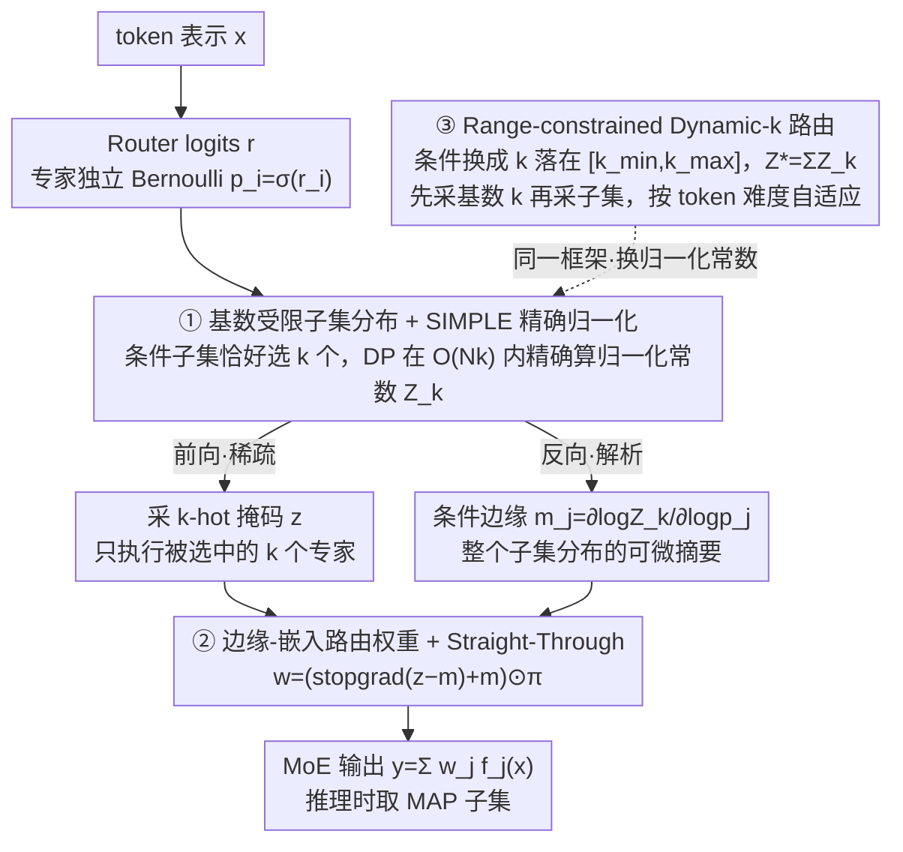

# ProbMoE: Differentiable Probabilistic Routing for Mixture-of-Experts

**会议**: ICML 2026  
**arXiv**: [2606.01509](https://arxiv.org/abs/2606.01509)  
**代码**: https://github.com/HengHugoZhao/ProbMoE.git (有)  
**领域**: LLM效率 / MoE路由  
**关键词**: Mixture-of-Experts, 概率路由, 子集采样, SIMPLE梯度估计, 动态专家分配

## 一句话总结
ProbMoE 把 MoE 的 top-$k$ 路由重新表述为"基数受限子集分布上的概率推断"，前向用 SIMPLE 估计器从 exact-$k$ 子集分布中采样、反向用可解析计算的专家边缘概率 $m_j=\partial \log Z_k/\partial \log p_j$ 作为离散选择的可微代理，在 OLMoE/Qwen1.5-MoE 上明显提升 GSM/Law/Translation 等任务并显著改善专家利用率，同时自然延伸出 Dynamic-$k$ 变体——按 token 难度自适应激活专家数。

## 研究背景与动机
**领域现状**：稀疏 MoE 通过对每个 token 只激活 $k$ 个专家来实现"参数量远大于激活算力"的扩展（Switch Transformer、GLaM、DeepSeek-MoE 等），核心组件是一个 softmax router 加 top-$k$ 选择器。

**现有痛点**：top-$k$ 算子是离散、分段常数的，对 router logits 几乎处处梯度为零，标准训练只能把 $S_{\text{top-}k}$ 当作前向给定的常量、只通过被选中专家的 softmax 权重 $\pi_j$ 反传梯度（即丢掉式 (2) 中 "discrete-selection path"）。后果是 router 拿不到关于"未被选中的备选子集"的任何学习信号，导致路由分布越来越尖、少数专家被反复强化、出现 expert collapse 与训练不稳。

**核心矛盾**：router 真正需要学习的是一个 *离散组合对象*（$k$-子集的选择），但现有方法要么用启发式噪声/重排来近似随机性（Shazeer 等），要么用 dense STE（DenseMixer）在被选专家上做密集梯度——这些做法都是"在确定性 top-$k$ 上打补丁"，并未显式建模"$k$-子集上的分布"，因而无法系统性探索备选子集。

**本文目标**：(i) 把 router 训练目标重写成 *子集分布* 下的期望损失 $\mathcal{J}(\theta)=\mathbb{E}_{S\sim\mathbb{P}_r(\cdot\mid|S|=k)}[\mathcal{L}(y_S(x;r))]$；(ii) 在保持每步仍只激活 $k$ 个专家的前提下给 router 提供反映整个子集分布的梯度；(iii) 把同一框架自然推广到 dynamic-$k$（$k\in[k_{\min},k_{\max}]$）。

**切入角度**：作者注意到 Ahmed et al. 2023 提出的 SIMPLE 估计器能在 $\mathcal{O}(Nk)$ 时间内精确归一化"恰好选 $k$ 个"的 Bernoulli 乘积分布，并对每个变量给出解析的条件边缘概率 $m_j$。一旦把每个专家的选择视作独立 Bernoulli $p_i=\sigma(r_i)$ 再条件化于 $|S|=k$，路由就变成一个"可精确归一化、可解析求边缘"的概率层。

**核心 idea**：用 *"从 $k$-基数子集分布采样 + 用条件边缘概率做反向代理"* 替换"top-$k$ + 仅 softmax 路径梯度"，从而把路由真正变成可微的离散概率推断；同样的归一化常数加一行求和就能换成 range-constrained $Z^*=\sum_{k=k_{\min}}^{k_{\max}} Z_k$，得到 dynamic-$k$ 版本。

## 方法详解

### 整体框架
设 MoE 层有 $N$ 个专家，token hidden state 为 $x\in\mathbb{R}^d$，router 输出 logits $r=\mathrm{Router}_\theta(x)\in\mathbb{R}^N$、softmax 权重 $\pi_i=\exp(r_i)/\sum_j\exp(r_j)$，给定子集 $S$ 则 MoE 输出 $y_S(x;r)=\sum_{j\in S}\pi_j f_j(x)$。ProbMoE 的核心改动是把"确定性 top-$k$ 选择"替换成"$k$-基数子集分布上的概率推断"：先把每个专家的选中与否看作独立 Bernoulli $p_i=\sigma(r_i)$，再条件化于基数约束（exact-$k$ 或 range $[k_{\min},k_{\max}]$）得到子集分布 $\mathbb{P}_r(S\mid\cdot)$。前向时它从这个分布里采样一个 $k$-hot 掩码、只执行被选中的 $k$ 个专家（计算量与标准 MoE 一致）；反向时它把整个子集分布对每个 logit 的依赖（用解析的条件边缘概率 $m_j$ 表达）回传给 router，从而第一次让"未被选中的备选子集"也参与学习。

### 关键设计

**1. 基数受限子集分布 + SIMPLE 精确归一化：把路由输出层换成可精确归一化的概率层**

旧的 top-$k$ 算子是分段常数的，对 router logits 几乎处处零梯度；要让路由变成"可学习的离散对象"，第一步是给"恰好选 $k$ 个专家"这件事一个能精确写出来的概率。ProbMoE 把每个专家独立 Bernoulli $p_i=\sigma(r_i)$ 构造的无约束乘积测度，条件化于 $|S|=k$，得到子集分布 $\mathbb{P}_r(S\mid|S|=k)=Z_k^{-1}\prod_{j\in S}p_j\prod_{j\notin S}(1-p_j)$，其中归一化常数 $Z_k=\sum_{|S|=k}\prod_{j\in S}p_j\prod_{j\notin S}(1-p_j)$ 是对全部 $\binom{N}{k}$ 个子集求和。直接枚举会组合爆炸，关键在于借用 Ahmed et al. 2023 的 SIMPLE 估计器：它用 1D 卷积式动态规划，把 $Z_k$ 拆成"逐个加入第 $i$ 个专家"的递推，在 $\mathcal{O}(Nk)$（向量化后 $\mathcal{O}(\log N\log k)$）时间内精确算出，无需显式枚举。这一步之所以是后面一切的基石，是因为 Gumbel-Softmax/Concrete 这类连续松弛要么有偏要么方差大、且根本无法表达"恰好 $k$ 个"这种硬约束；SIMPLE 的 DP 归一化让"组合空间上的精确概率推断"在 MoE router 中第一次变得可行，精确边缘、采样、动态 $k$ 都从这里派生。推广到 range constraint 也只需把单个 $Z_k$ 换成 $Z^*=\sum_{k=k_{\min}}^{k_{\max}} Z_k$（Theorem 5.1，复杂度仍是 $\mathcal{O}(Nk_{\max})$）。

**2. 边缘-嵌入路由权重 + Straight-Through 反向：前向稀疏、反向带整个分布的梯度**

有了精确归一化还不够——前向只能激活 $k$ 个专家以保证稀疏算力，但又希望梯度反映"如果换一个备选子集会怎样"。ProbMoE 的做法是用条件边缘 $m_j=\mathbb{P}_r(j\in S\mid|S|=k)=\partial\log Z_k/\partial\log p_j$ 作为离散选择的可微"摘要"，再通过 STE 把采样掩码 $z$、边缘 $m$、softmax $\pi$ 拼成一个路由权重

$$w=(\operatorname{stopgrad}(z-m)+m)\odot\pi.$$

前向时 $w_i=z_i\pi_i$ 仍然只在被采中的专家上非零（稀疏不变），反向时梯度分解为 $\partial\mathcal{L}/\partial r_i=\sum_j\langle\partial\mathcal{L}/\partial y,f_j(x)\rangle(m_j\,\partial\pi_j/\partial r_i+\pi_j\,\partial m_j/\partial r_i)$——第一项是常规 softmax-权重路径，第二项是新增的"边缘路径"，正是它把整个子集分布对 logit 的依赖回传给 router。之所以前向采样必须和这个解析边缘配对，是因为消融（Fig. 2）显示只有 "Sample（前向随机）+ Marginal（反向解析）" 能拿到 50.24% EM（OLMoE/GSM），换成 "Sample + Dense STE" 会掉到 46.6% 且方差暴增、"Top-$k$ + Marginal" 也次于 ProbMoE——前后向若不同源于同一分布就会自相矛盾，反而劣化（Appendix F 的合成实验也表明该估计器方差低于 DenseMixer 的 dense STE）。

**3. Range-constrained Dynamic-$k$ 路由：同一框架免费换来按 token 难度自适应专家数**

固定 $k$ 对所有 token 一视同仁，但简单 token 其实用不到那么多专家、难 token 又可能不够。ProbMoE 把 exact-$k$ 推广为允许 $|S|\in[k_{\min},k_{\max}]$ 自由取值的条件分布 $\mathbb{P}_r(S\mid k_{\min}\le|S|\le k_{\max})=Z^{*-1}\prod_{j\in S}p_j\prod_{j\notin S}(1-p_j)$。由于 $Z^*=\sum_{k=k_{\min}}^{k_{\max}}Z_k$，采样可以先从基数边缘 $\mathbb{P}_r(|S|=k\mid\cdot)=Z_k/Z^*$ 采出一个 $k$、再调用 exact-$k$ 采子集，做到联合推断 $k$ 与 $S$；反向只需把 $m_j$ 换成 range-constrained 边缘 $m_j^*=\partial\log Z^*/\partial\log p_j$，仍走同一套 STE 路由权重；推理时取 MAP 子集（$k$ 和身份一起选）。它的优势在于保持了概率框架的封闭性——之前 DA-MoE/DynMoE/AdaMOE 等动态分配靠阈值、null expert 等启发式 gating，没有全局归一化也就无法做严格可微训练；而这里 dynamic-$k$ 几乎是 exact-$k$ 的"免费"升级。表 2 显示 OLMoE/Qwen 上 Dynamic-$k$ 只激活 75–84% 专家即可取得与 Exact-$k$ 相当甚至更高的 EM，Fig. 5/6 进一步显示 router 会给稀有/含义模糊的 token（标点、词缀 `ons`、`:`、`?`）分配更多专家、给常见数字/具体名词分配更少，体现出真实的"按难度计算"。

### 损失函数 / 训练策略
训练目标是子集分布下的期望损失 $\mathcal{J}(\theta)=\mathbb{E}_{S\sim\mathbb{P}_r(\cdot\mid|S|=k)}[\mathcal{L}(y_S(x;r))]$（dynamic-$k$ 同理换条件），ProbMoE 用基于式 (7) 路由权重的 $\nabla_\theta\mathcal{L}(y(x;r))$ 作为期望梯度的近似。这里 $p_i=\sigma(r_i)$ 与 softmax $\pi$ 派生自同一组 router logits，却分别用于子集采样与权重加权，互不冲突。所有实验沿用 DenseMixer (Yao et al. 2026) 的同一数据/拆分/评估协议、只替换路由模块以保证公平比较；Qwen 上 ProbMoE 只作用于 routed experts，共享专家保持不变。

## 实验关键数据

### 主实验
两类 MoE backbone：OLMoE-1B-7B（16 层 × 64 专家 / token 激活 8）与 Qwen1.5-MoE-A2.7B（24 层 × 60 routed + 4 shared / token 激活 4）。任务覆盖数学推理（GSM8K, EM）、法律理解、机器翻译、摘要（LLM-as-judge）、代码生成（CodeAlpaca 微调 → MBPP 评测，LM-Eval-Harness）、通用知识（MMLU/MMLU-Stem）。

| Backbone | 方法 | GSM | Law | Translation | MBPP | Summary | MMLU |
|---|---|---|---|---|---|---|---|
| OLMoE (k=8) | Conventional | 45.94 | 25.00 | 27.56 | 23.20 | 33.70 | 54.04 |
| OLMoE (k=8) | DenseMixer | 47.00 | 27.90 | 30.32 | **24.40** | 37.50 | 53.95 |
| OLMoE (k=8) | **ProbMoE** | **50.19** | **29.00** | **31.63** | 22.80 | **39.29** | 53.69 |
| Qwen (k=4) | Conventional | 53.30 | 29.50 | 30.00 | 32.80 | 39.00 | 61.03 |
| Qwen (k=4) | DenseMixer | **54.97** | 30.75 | 33.75 | 34.00 | 41.00 | 61.03 |
| Qwen (k=4) | SparseMixer | 1.30 | 3.40 | 3.50 | 0.00 | 2.10 | – |
| Qwen (k=4) | ReMoE | 46.30 | 25.50 | 16.99 | 33.00 | 25.80 | – |
| Qwen (k=4) | **ProbMoE** | 53.29 | **34.40** | **39.23** | **35.00** | **44.40** | **61.05** |

ProbMoE 在 OLMoE 上 6 个任务里 4 个第一（GSM/Law/Translation/Summary 提升 +2.2~+5.5），Qwen 上 4 个第一（Law +3.65、Translation +5.48、Summary +3.4），且唯一稳定击败 DenseMixer 的"router-dense / expert-sparse"方案（DenseMixer 训练时要做 dense expert 计算，ProbMoE 仍是稀疏）。

### 消融实验

| 配置（OLMoE/GSM, 3 seed） | 前向 | 反向 | EM (%) | 方差 σ |
|---|---|---|---|---|
| ProbMoE | Sample (k-子集) | Marginal | **50.24** | **0.09** |
| DenseMixer | Top-$k$ | Dense STE | ~47 | 中 |
| Sample + Dense STE | Sample | Dense STE | 46.6 | 0.37 |
| Top-$k$ + Marginal | Top-$k$ | Marginal | < ProbMoE | – |

| 设置 | 数据集 | $\Delta$EM vs Exact-$k$ | 平均专家用量 |
|---|---|---|---|
| Dynamic-$k$ (OLMoE) | GSM | −1.82 | 80.00% |
| Dynamic-$k$ (OLMoE) | Law | −0.04 | 84.50% |
| Dynamic-$k$ (OLMoE) | Translation | +0.36 | 82.00% |
| Dynamic-$k$ (Qwen1.5) | GSM | −4.29 | 75.00% |
| Dynamic-$k$ (Qwen1.5) | Law | **+2.70** | 75.00% |
| Dynamic-$k$ (Qwen1.5) | Translation | **+3.22** | 75.00% |

### 关键发现
- **前后向必须配对**：消融最强的不是"加更多机制"，而是"前向概率采样 + 反向解析边缘"二者搭配；任意打散（如 Sample+Dense STE）反而 EM 掉 4 个点且方差翻 4 倍，说明 ProbMoE 的收益来自前后向同源于同一 $k$-子集分布的自洽性，而非随机性本身。
- **专家利用率显著提升**：Qwen/Translation 上 ProbMoE 要用更多专家才能累计到 99% 概率质量（Fig. 3），Top-4 mass 更低、归一化熵更高（Fig. 4），表示路由更分散、专家专精化更充分；这与 DeepSeek-MoE 等先前发现"广泛专家参与可缓解 expert collapse"相吻合。
- **训练/推理基数错配现象**：表 3 显示，传统 Exact-$k$（$k=8$）训练的模型在 dynamic-$k$ MAP 推理（$k\in[4,8]$）下，平均只选 ~5 个专家就停止，说明它学到的路由分布本身就很尖；ProbMoE 由于显式建模基数，在 dynamic 推理下 EM 反而更高（44.50 vs 38.59）且 avg-$k$ 相近。
- **自适应有语义解释**：Dynamic-$k$ 给标点/词缀/上下文敏感符号（`:`、`?`、`ons`）更多专家，给数字/具体名词更少专家（Fig. 6），且 Law > Translation > GSM 的整体专家用量与任务难度直观一致（Fig. 5）。
- **关键失败**：SparseMixer 在 Qwen 上全面崩盘（GSM 1.30、MBPP 0.00），说明 dynamic sparse-gradient routing 在大 backbone 上未必稳定；ReMoE 的全可微 ReLU 路由也明显落后，间接佐证"显式 $k$-子集分布"的必要性。

## 亮点与洞察
- **"router gradient 的根本短板是建模而非估计"**：ProbMoE 不是又一个 STE 变体，而是把"应该建模什么对象"的问题摆出来——router 真正要学的是"$k$-子集分布的参数"，而不是"被选专家的 softmax 权重"。一旦换了对象，梯度就自带"如果选别的子集会怎样"的信号。
- **SIMPLE 在 MoE 上的首次落地**：把组合学习里的 cardinality-constrained Bernoulli + DP 归一化嫁接到 router，这套"概率层 + 解析边缘"框架可复用到任何"硬基数 + 需要稀疏前向"的场景（如 sparse attention head selection、subset routing in vision MoE、active learning 中的 batch 选择）。
- **Dynamic-$k$ 几乎免费**：把 $Z_k$ 换成 $Z^*=\sum_k Z_k$ 这一行加法就把 exact-$k$ 升级成 dynamic-$k$，且保持精确归一化，是少见的"理论统一性直接换来工程简洁"。
- **可迁移 trick**：式 (7) 的"STE × 边缘 × softmax 三合一权重"是一种通用的"前向稀疏、反向带分布梯度"模式，比单纯 STE 更稳，可考虑用在 Mixture-of-Tokens、Mixture-of-Depths 等离散选择层。

## 局限与展望
- **作者承认**：当前实验集中在 SFT 阶段（finetune OLMoE/Qwen），尚未在 pre-training 规模上验证；dynamic-$k$ 的 system-level 收益（kernel-level 实际加速）也未充分实现，目前仍是"平均专家数减少"。
- **MMLU 几乎平手**：OLMoE/Qwen 上 MMLU/MMLU-Stem 与 baselines 差距 < 0.5，说明 ProbMoE 对"通用知识检索型任务"边际收益有限，主要好处在生成/推理类任务。
- **OLMoE/GSM dynamic 反掉 1.82、Qwen/GSM dynamic 反掉 4.29**：数学推理任务可能恰好需要稳定的固定专家集合，dynamic-$k$ 的"按 token 变动"反而引入了不一致；论文未深入分析这一回归。
- **超参依赖**：$[k_{\min},k_{\max}]$ 范围设置只在 Appendix C 简述；实际选范围对最终自适应模式影响多大、是否需要 per-layer 调，还缺系统消融。
- **复杂度常数**：虽然 $\mathcal{O}(Nk)$ 渐近 OK，但 $N=64$、$k=8$ 时 DP 仍是逐 token 串行算（除非显式向量化），对每 step 的吞吐究竟开销多大，正文未给训练 wall-clock 对比。
- **改进思路**：把 ProbMoE 推到 pretraining 规模并配合 expert-parallel 时验证 dynamic-$k$ 的实际加速；探索把 $k_{\min}/k_{\max}$ 也学习化；用 ProbMoE 做"专家专精化分析"工具，反过来指导专家剪枝/合并。

## 相关工作与启发
- **vs DenseMixer / Yao 2026**：DenseMixer 在前向仍 top-$k$、但反向通过 dense STE 给所有专家发梯度（训练时引入 dense expert 计算）；ProbMoE 反过来——前向用稀疏采样、反向给 router 提供来自整个子集分布的"密集"信号，专家侧始终稀疏。ProbMoE 在 OLMoE 上多任务领先 DenseMixer，且训练计算更稀疏。
- **vs SparseMixer (Liu 2023) / ReMoE (Wang 2025)**：SparseMixer 学一个 sparse-gradient mask，ReMoE 把离散路由换成连续 ReLU 激活——两者都在 Qwen 大 backbone 上崩盘，反衬"保留离散选择 + 在分布层面可微"是更稳的折中。
- **vs Gumbel-Softmax / Concrete**：通用离散松弛方差/偏差大且不能精确归一化"恰好 $k$ 个"；ProbMoE 借助 SIMPLE 的 DP 给出精确归一化与精确边缘，从根上不同。
- **vs DA-MoE / DynMoE / AdaMOE**：这些动态分配方法用阈值、null expert 等启发式 gating，没有概率归一化，因此训练时无法做严格可微的全局优化；ProbMoE Dynamic-$k$ 用 range 约束保留概率框架，做到训练-推理一致。
- **vs DeepSeek-MoE (Dai 2024) / Mixtral**：那条线主要从"shared expert + 细粒度专家"架构层面改善 expert collapse；ProbMoE 是正交的*训练-side* 改进，原则上可叠加到任何 MoE 架构（论文已在 Qwen shared-expert 架构上验证非冲突）。

## 评分
- 新颖性: ⭐⭐⭐⭐⭐ 第一个把 MoE 路由形式化成 cardinality-constrained 子集分布的概率推断，并真正落地可微训练。
- 实验充分度: ⭐⭐⭐⭐ 两 backbone × 6 任务 + 消融 + 路由分布分析 + dynamic-$k$ 语义分析很完整，但缺 pretraining 规模与训练时长 wall-clock 对比。
- 写作质量: ⭐⭐⭐⭐⭐ 公式推导和直觉穿插得当，式 (2) 把"丢掉哪一项"讲得清晰；图 1 把传统/ProbMoE 路由对比可视化非常直观。
- 价值: ⭐⭐⭐⭐⭐ 给 MoE 训练提供了一个新的、可叠加的、原理性的路由组件；dynamic-$k$ 几乎免费的扩展性使得这套框架在 efficient inference 方向也有立刻可用的价值。

<!-- RELATED:START -->

## 相关论文

- [\[ICML 2026\] SoftMoE: Soft Differentiable Routing for Mixture-of-Experts in LLMs](softmoe_soft_differentiable_routing_for_mixture-of-experts_in_llms.md)
- [\[ICML 2026\] Hyperparameter Transfer with Mixture-of-Experts Layers](hyperparameter_transfer_with_mixture-of-expert_layers.md)
- [\[ICML 2026\] Skill-Based Mixture-of-Experts: Adaptive Routing for Heterogeneous Reasoning via Inferred Skills](skill-based_mixture-of-experts_adaptive_routing_for_heterogeneous_reasoning_via_.md)
- [\[ICML 2026\] RepetitionCurse: Measuring and Understanding Router Imbalance in Mixture-of-Experts LLMs under DoS Stress](repetitioncurse_measuring_and_understanding_router_imbalance_in_mixture-of-exper.md)
- [\[ICML 2026\] Beyond Sunk Costs: Boosting LLM Pre-training Efficiency via Orthogonal Growth of Mixture-of-Experts](beyond_sunk_costs_boosting_llm_pre-training_efficiency_via_orthogonal_growth_of_.md)

<!-- RELATED:END -->
