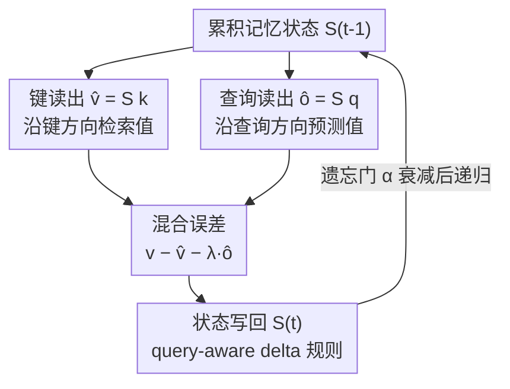

# Q-Delta: Beyond Key–Value Associative State Evolution

**会议**: ICML2026  
**arXiv**: [2606.08804](https://arxiv.org/abs/2606.08804)  
**代码**: https://github.com/psmiz/Q-Delta  
**领域**: LLM效率 · 线性注意力 / 状态空间模型  
**关键词**: 线性注意力, delta规则, 查询条件反馈, 状态演化, 长上下文检索

## 一句话总结
这篇论文挑战了线性注意力里"query 只负责读出、不参与状态演化"的隐含假设，证明查询读出 $\hat{o}_t=S_{t-1}q_t$ 本身就是一个结构化的值预测（与键检索互补），据此提出 **Q-Delta**——把键、查询的混合预测误差一起注入 delta 规则的状态更新，在保持线性时间与分块并行效率的同时，于语言建模和长上下文检索上稳定超过 DeltaNet、GatedDeltaNet 等强基线（S-NIAH 平均 90.0% vs GatedDeltaNet 83.5%）。

## 研究背景与动机

**领域现状**：Transformer 的 softmax 自注意力序列长度上是二次复杂度。线性注意力用核函数 $\phi(\cdot)$ 把注意力重排成 $\phi(Q)(\phi(K)^\top V)$，从而把 $\phi(K)^\top V$ 维护成一个增量更新的状态 $S_t=\sum_{i=1}^{t}v_i\phi(k_i)^\top$，读出 $o_t=S_t\phi(q_t)$——本质上是一个"键值联想记忆"：信息靠键值外积写入，靠查询读出。

**现有痛点**：纯加性更新没有"选择性修改/删除已存信息"的机制，序列变长后键碰撞加剧、检索精度下降。delta 规则（DeltaNet/GatedDeltaNet/Longhorn）通过**检索误差**（观测值与当前键检索值之差）来修正状态，把状态更新解释为对键值预测目标的在线回归，缓解了这个问题。

**核心矛盾**：但所有这些线性 RNN 共享一个**结构性假设**——状态演化只由键值交互主导，query 仅在读出时被用一次。这个分工源自原始注意力公式，却隐含地认定 query 对塑造状态动态毫无信息贡献。作者质疑：query 真的只是一个被动的读出探针吗？

**本文目标**：重新审视 query 读出在递归状态更新中的角色，搞清楚"查询读出到底编码了什么信息"，并据此设计一个让 query 主动参与状态演化、又不破坏 delta 规则线性效率的更新规则。

**切入角度**：作者发现——从前一时刻状态做查询读出 $\hat{o}_t=S_{t-1}q_t$，可以写成对**全部历史值**的加权聚合，形式上是一种"对累积记忆的注意力"。它和键检索 $\hat{v}_t=S_{t-1}k_t$ 落在同一个值空间，但用的是不同的加权方向。而且 query 不是任意探针——它正是状态最终被读出 $o_t=S_tq_t$ 的方向，所以 $\hat{o}_t$ 是模型沿"记忆真正被下游消费的方向"做出的自我预测。

**核心 idea**：既然传统 delta 只针对键检索误差修正状态、却放任了"读出方向上的预测误差"，那就把键、查询的**混合误差**一起注入状态更新。

## 方法详解

### 整体框架
Q-Delta 的核心是对 delta 规则递归式的一处改造：在每一步，累积记忆状态 $S_{t-1}$ 同时产生两个值估计——沿键方向的检索值 $\hat{v}_t=S_{t-1}k_t$ 和沿查询方向的预测值 $\hat{o}_t=S_{t-1}q_t$；二者被组合成一个**混合校正信号** $v_t-\hat{v}_t-\lambda_t\hat{o}_t$，再以 delta 规则写回状态。整篇方法围绕四件事展开：先用理论证明 $\hat{o}_t$ 是结构化值预测且与 $\hat{v}_t$ 互补，再给出 Q-Delta 更新规则，接着推导分块并行形式（配 Triton kernel）保住硬件效率，最后证明这套动态稳定收敛。

### 关键设计

**1. 查询即值预测：揭示 query 读出是对累积记忆的结构化聚合**

要让 query 名正言顺地参与更新，先得证明它携带了独立信息。作者考虑通用递归 $S_t=S_{t-1}P_t+\eta_t v_t k_t^\top$（涵盖线性注意力 $P_t=I$、delta 规则 $P_t=I-\beta_t k_t k_t^\top$、门控 delta $P_t=\alpha_t(I-\beta_t k_t k_t^\top)$），把状态展开成历史值的线性组合，得到前一状态的查询读出：

$$\hat{o}_t=S_{t-1}q_t=\sum_{\tau=1}^{t-1}\langle q_t,\tilde{k}_{\tau,t}\rangle_{\eta_\tau}\,v_\tau,\qquad \tilde{k}_{\tau,t}=\Big(\prod_{j=\tau+1}^{t-1}P_j^\top\Big)k_\tau$$

也就是说 $\hat{o}_t$ 落在历史值张成的空间里，形式上是一种**未归一化注意力**：当前 query 与"被后续状态转移重塑过的时间演化键" $\tilde{k}_{\tau,t}$ 匹配，再去混合历史值。它和键读出 $\hat{v}_t=S_{t-1}k_t$ 同属值空间，但用查询-键相似度而非键-键自相似度加权——这是一种"键检索拿不到"的信息。论文用 PCA 等实证（340M 模型上 $\hat{o}$ 与 $\hat{v}$ 的余弦相似度均值仅 $\approx0.07$）佐证两者方向上几乎不相关、互补而非冗余。

**2. Q-Delta 更新规则：把混合键–查询误差注入状态演化**

基于上一点，Q-Delta 在 delta 更新里同时纠正键检索误差和查询预测误差。序列递归形式为：

$$S_t=S_{t-1}+\beta_t\big(v_t-\hat{v}_t-\lambda_t\hat{o}_t\big)k_t^\top$$

其中 $\beta_t\in[0,1]$ 控制写入强度、$\lambda_t\in[0,1]$ 调制查询反馈的影响。等价改写并加入遗忘门 $\alpha_t$ 后得到最终规则：

$$S_t=\alpha_t S_{t-1}\big(I-\beta_t(k_t k_t^\top+\lambda_t q_t k_t^\top)\big)+\beta_t v_t k_t^\top,\qquad o_t=S_t q_t$$

和 GatedDeltaNet 相比，唯一新增的就是蓝色项 $\lambda_t q_t k_t^\top$——它让状态在键方向擦除旧值的同时，也沿"读出方向"做一次校正。$\lambda_t$ 是**逐头可学习**的查询反馈系数，模型可以自适应决定每个头要多大程度听 query 的反馈。作者也明确指出：这个更新**不**严格对应任何 $\|v_t-S_{t-1}(k_t+\lambda q_t)\|^2$ 的梯度下降步（不同于其他 delta 规则的在线回归解释），所以需要单独的稳定性分析来兜底。

**3. 分块并行与 Triton 实现：保住 delta 规则的硬件效率**

线性递归虽是 $\mathcal{O}(LD^2)$，但纯顺序执行在 GPU 上吃亏。作者定义混合输入 $x_t:=k_t+\lambda_t q_t$，把 Q-Delta 递归重写成 $S_t=\alpha_t S_{t-1}(I-\beta_t x_t k_t^\top)+\beta_t v_t k_t^\top$——形式上和 GatedDeltaNet 同构，只是把原来的 $k_t$ 换成 $x_t$。于是可以直接复用 GatedDeltaNet 的扩展 WY 表示和 UT 变换，把 chunk 内递归展开成可并行的矩阵运算（chunk 间保持递归依赖），并提供了同时支持全递归和分块并行的 **Triton kernel**。关键收益是：新增 query 反馈几乎不增加计算图复杂度，吞吐与纯 delta 基线持平。

**4. 稳定性保证：证明混合误差几何收缩、全局有界**

由于 Q-Delta 不是严格梯度下降，作者补上理论。**Lemma 3.1（一步收缩）**：定义混合输入 $x_t=k_t+\lambda_t q_t$、对齐标量 $a_t=k_t^\top x_t$，若 $\beta_t a_t\in(0,2)$，则混合预测误差一步收缩 $\|v_t-S_t x_t\|\le\rho\|v_t-S_{t-1}x_t\|$，$\rho=\sup_t|1-\beta_t a_t|\in(0,1)$。**Theorem 3.2（全局稳定）**：在一步收缩成立下，误差几何衰减并被残差漂移 $r_t=\Delta_t v-\Delta_t p$（目标漂移减预测漂移）一致界住：$\|e_t\|\le\rho^t\|e_0\|+\tfrac{1-\rho^t}{1-\rho}\rho r$。实证上，340M 模型 15B token 训练全程 $\beta_t a_t$ 紧密落在收缩区间（均值 0.043），残差漂移均值范数 0.538、被目标漂移主导而非预测不稳定——说明这套动态在实际训练里确实表现为一个稳定的在线学习器。

### 损失函数 / 训练策略
基于 flash-linear-attention 框架实现。两个规模：340M 在 FineWeb-Edu 上训 15B token、1.3B 训 30B token；4×RTX Pro 6000（Blackwell）bf16 混合精度。AdamW + cosine 调度 + 梯度裁剪，峰值学习率 340M 用 $1\times10^{-3}$、1.3B 用 $4\times10^{-4}$。基线（RetNet/Mamba/Mamba2/DeltaNet/GatedDeltaNet）全部在同框架、同优化设置下复现以保证公平。

## 实验关键数据

### 主实验
零样本语言建模平均准确率 + 合成长上下文检索 S-NIAH（1.3B）。Q-Delta 在两个规模、两类任务上都拿到最高平均。

| 模型 | 340M Avg Acc ↑ | 1.3B Avg Acc ↑ | S-NIAH Avg (1.3B) ↑ |
|------|----------------|----------------|---------------------|
| RetNet | 44.55 | 50.31 | 38.09 |
| Mamba | 46.64 | 52.39 | 62.62 |
| Mamba2 | 46.27 | 52.46 | 76.58 |
| DeltaNet | 43.82 | 52.53 | 81.29 |
| GatedDeltaNet | 46.01 | 52.77 | 83.51 |
| **Q-Delta** | **47.24** | **53.47** | **90.02** |

### 消融实验
查询反馈系数 $\lambda$ 与门控的消融（340M）。可学习 $\lambda_t$ 给出最佳综合表现。

| 配置 | Wiki ppl ↓ | Lamb ppl ↓ | Avg Acc (8 任务) ↑ |
|------|-----------|-----------|---------------------|
| 可学习 $\lambda_t$（Q-Delta） | 26.89 | 32.67 | **47.24** |
| 固定 $\lambda=0.2$ | 26.96 | 35.39 | 46.99 |
| 固定 $\lambda=0.5$ | 26.86 | 33.31 | 47.20 |
| 固定 $\lambda=0.8$ | 26.61 | 33.58 | 46.42 |
| 去状态衰减（$\alpha_t=1$） | 26.52 | 32.97 | 45.86 |
| 去门控（$\lambda_t=1$） | 26.55 | 35.21 | 46.36 |

### 关键发现
- **查询反馈的增益在长上下文检索上最突出**：S-NIAH 上 Q-Delta 平均 90.02%，远超 GatedDeltaNet 83.51%；尤其在更难的 number-in-haystack（S-NIAH-2）和 UUID-in-haystack（S-NIAH-3）以及更长的 4K 上下文上提升明显（如 S-NIAH-3 @4K 从 GatedDeltaNet 的 21.4% 提到 48.0%），说明读出方向的校正确实增强了稀疏信息检索的鲁棒性。
- **可学习 $\lambda_t$ > 任何固定 $\lambda$**：固定标量里 $\lambda=0.5$ 最好（47.20），但端到端学习 $\lambda_t$ 拿到 47.24 且保持最佳困惑度——自适应调制查询反馈强度是有益的。
- **query 反馈独立于门控生效**：去掉衰减门（$\alpha_t=1$）准确率降到 45.86，但仍明显高于同规模最直接的无衰减基线 DeltaNet（43.82），证明增益来自 query 反馈本身、而非门控机制。
- **效率不打折**：单卡吞吐从序列长 2048 到 16384 的各配置下与 delta 基线持平，Mamba2 反而在短序列上吞吐更低；训练 loss 曲线稳定、早期收敛与基线相当或更快。

## 亮点与洞察
- **重新解读一个被默认的假设**：本文最"啊哈"的地方是指出 query 读出方向 $\hat{o}_t=S_{t-1}q_t$ 恰好是状态被下游消费的方向，因此它是一个"读出对齐"的状态校正信号，而传统 delta 偏偏放过了它。这个视角把"query 是被动读出"这一全行业默认拆掉了。
- **改动极小、收益清晰**：相对 GatedDeltaNet 只多了一项 $\lambda_t q_t k_t^\top$，却能通过定义 $x_t=k_t+\lambda_t q_t$ 与现有 chunkwise/WY 机制无缝复用，几乎零额外工程代价——这种"一行公式改进 + 可直接进现有 kernel"的设计很容易被后续工作采纳。
- **理论与实证闭环**：不仅给出一步收缩 + 全局几何跟踪的稳定性定理，还用训练全程的 $\beta_t a_t$ 分布和漂移范数实证验证假设成立，避免了"理论假设悬空"的常见毛病。

## 局限与展望
- **稳定性依赖经验条件**：收缩保证依赖 $\beta_t a_t\in(0,2)$，这是数据相关、逐步变化的量，论文只能用经验测量证明它"通常"落在收缩区间，没有解析保证——极端分布下可能失效。
- **规模有限**：最大只到 1.3B、30B token，相对当代 LLM 仍偏小，query 反馈在更大规模、更长上下文（>4K）下的增益是否持续未验证。
- **$\hat{o}$ 与 $\hat{v}$ 互补性是观测性结论**：余弦相似度 $\approx0.07$ 的互补性来自特定模型的特定层（5/10/15 层），是否在所有架构/层都成立、互补程度与任务难度的关系，仍待更系统的刻画。

## 相关工作与启发
- **vs DeltaNet**：DeltaNet 用 $S_t=S_{t-1}(I-\beta_t k_t k_t^\top)+\beta_t v_t k_t^\top$ 沿键方向擦旧写新，只纠正键检索误差；Q-Delta 额外纠正查询预测误差，区别在于让 query 参与状态演化而非只读出，长上下文检索（S-NIAH 81.29→90.02）明显占优。
- **vs GatedDeltaNet**：GatedDeltaNet 加了乘性衰减门 $\alpha_t$；Q-Delta 与它同构，仅把 $k_t$ 换成混合输入 $x_t=k_t+\lambda_t q_t$，因而能直接继承其分块并行实现，是"在门控 delta 上正交叠加 query 反馈"。
- **vs TTT / Titans（显式记忆 + 测试时在线学习）**：它们把记忆当作测试时用在线梯度更新的显式模块（如 TTT 对键值预测损失做在线梯度下降）；Q-Delta 走的是隐式递归路线，不引入测试时优化，靠一项 query 反馈在标准 delta 框架内实现"读出对齐"的状态校正。

## 评分
- 新颖性: ⭐⭐⭐⭐⭐ "query 读出即结构化值预测、应参与状态演化"是对线性注意力核心假设的实质性挑战
- 实验充分度: ⭐⭐⭐⭐ 两规模 × 语言建模 + 合成/真实检索 + 消融齐全，理论实证闭环；但规模偏小、上下文仅到 4K
- 写作质量: ⭐⭐⭐⭐⭐ 从洞察到公式到稳定性证明逻辑严密、动机具体
- 价值: ⭐⭐⭐⭐⭐ 改动极小、可直接进现有 delta kernel，长上下文检索增益显著，易被采纳

<!-- RELATED:START -->

## 相关论文

- [\[CVPR 2025\] Associative Transformer](../../CVPR2025/llm_efficiency/associative_transformer.md)
- [\[ICML 2026\] Kalman Linear Attention: Parallel Bayesian Filtering For Efficient Language Modelling and State Tracking](kalman_linear_attention_parallel_bayesian_filtering_for_efficient_language_model.md)
- [\[ICLR 2026\] EvoEngineer: Mastering Automated CUDA Kernel Code Evolution with Large Language Models](../../ICLR2026/llm_efficiency/evoengineer_mastering_automated_cuda_kernel_code_evolution_with_large_language_m.md)
- [\[ICML 2026\] Beyond Sunk Costs: Boosting LLM Pre-training Efficiency via Orthogonal Growth of Mixture-of-Experts](beyond_sunk_costs_boosting_llm_pre-training_efficiency_via_orthogonal_growth_of_.md)
- [\[ACL 2026\] Beyond Accuracy: Unveiling Inefficiency Patterns in Tool-Integrated Reasoning](../../ACL2026/llm_efficiency/beyond_accuracy_unveiling_inefficiency_patterns_in_tool-integrated_reasoning.md)

<!-- RELATED:END -->
