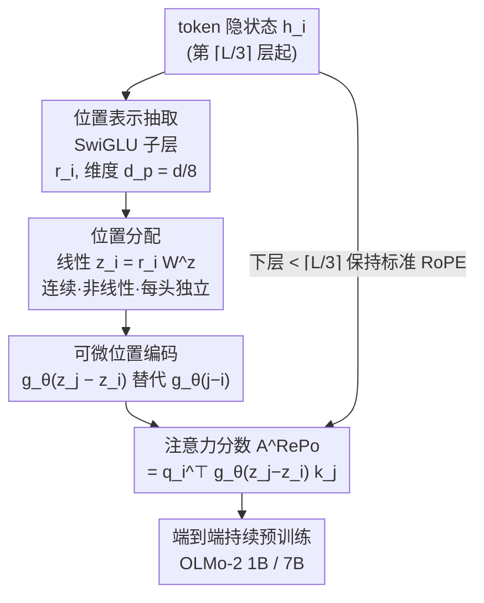

# RePo: Language Models with Context Re-Positioning

**会议**: ICML 2026  
**arXiv**: [2512.14391](https://arxiv.org/abs/2512.14391)  
**代码**: https://github.com/SakanaAI/repo  
**领域**: LLM效率 / 位置编码 / 长上下文  
**关键词**: 位置编码, 上下文重定位, RoPE, 长上下文, 注意力分配

## 一句话总结
现有 LLM 把 token 强行按线性整数索引 0…L−1 排位，让注意力层独自承担"整理上下文结构"的重活；RePo 用一个轻量可微模块 $f_\phi$ 根据 token 隐状态给它分配**连续、非线性**的位置值，把这份"额外认知负荷"卸掉，在嘈杂上下文、结构化数据和长上下文任务上稳定涨点，短上下文通用任务几乎不掉。

## 研究背景与动机
**领域现状**：现代 LLM 的上下文处理高度依赖位置编码方案。绝大多数模型给 token 分配连续整数索引 $0$ 到 $L-1$（如 RoPE），或给所有 token 一个常数索引 $a$（如 NoPE），再通过位置编码函数把这套**刚性的上下文组织**注入注意力。

**现有痛点**：固定位置分配虽是事实标准，却偏离了人类工作记忆处理信息的方式——人类阅读时会借助结构信息（标题、分段）来加速理解，而把线性化文本**重组成结构化表示**的能力在现代 LLM 架构里是缺失的。结果就是：注意力机制要**独自**负责理解线性化文本背后的语言结构，这份负担挤占了用于上下文推理的算力，在 needle-in-a-haystack（NIAH）、高度稀释上下文下的问答等需要强长程/细粒度依赖的任务上显著掉点。

**核心矛盾**：作者用**认知负荷理论（CLT）**来刻画——工作记忆容量被"外在负荷"（extraneous load，信息如何组织呈现）和"内在/相关负荷"（germane load，真正的学习过程）瓜分。任务难度和模型容量固定时，注意力层一边要"理解输入序列的结构"、一边要"处理输入"；当前者（外在负荷）吃掉太多容量，后者（真正的推理）就退化。刚性线性位置正是外在负荷的来源。

**本文目标 + 核心 idea**：与其让注意力层背负"从线性顺序里反推结构"的重活，不如**给模型一个内部机制去重新组织 token 的位置**，从而降低外在负荷、把有限的工作记忆容量省给真正有益的推理。具体做法是引入可微模块 $f_\phi:\mathbb{R}^d\to\mathbb{R}$，根据 token 隐状态（即其在上下文中的相关性）给每个 token 分配一个**连续空间里的实数位置**，摆脱单调性、整数等传统约束；借助现代位置编码（RoPE、ALiBi）的连续可微性，这些新位置可以端到端地和 LLM 联合优化。

## 方法详解

### 整体框架
RePo 不改注意力本身，而是在"位置编码之前"插入一个重定位步骤。对每个 token $x_i$，先用一个轻量 SwiGLU 子层从其隐状态 $\bm{h}_i$ 里**显式抽取位置表示** $\bm{r}_i$，再用一个线性变换把 $\bm{r}_i$ 映成一个**实数位置值** $z_i$；随后照常用 RoPE 这类编码函数，只是把原来的整数距离 $j-i$ 换成 $z_j-z_i$ 来算注意力分数。整个 $f_\phi$ 可微，和 LLM 一起在通用数据上持续预训练即可学会"按相关性重排位置"。为兼顾效率，RePo 只从第 $\lceil L/3\rceil$ 层起施加（下层保持标准 RoPE），且**只让 $z$ 影响位置编码、不改 token 的自回归顺序**，从而不破坏 KV cache。

### 关键设计

**1. 上下文重定位模块 $f_\phi$：从隐状态抽位置表示，再分配连续实数位置**

这是 RePo 的核心。模块分两步。第一步**位置表示抽取**：既有研究指出位置信息可能纠缠在原始隐状态里，所以先用一个轻量 SwiGLU 子层把它显式抽出来——

$$\bm{r}_i=\mathrm{Swish}(\bm{h}_i\mathbf{W}^g)\odot(\bm{h}_i\mathbf{W}^c),$$

其中 $\bm{r}_i\in\mathbb{R}^{d_p}$、$\mathbf{W}^g,\mathbf{W}^c\in\mathbb{R}^{d\times d_p}$ 分别是门控和内容映射，$d_p<d$（实验取 $d_p=d/8$，假设位置信息比原隐状态更"稀薄"）。第二步**位置分配**：用一个线性变换把 $\bm{r}_i$ 压成单个标量位置 $z_i=\bm{r}_i\mathbf{W}^z$（$\mathbf{W}^z\in\mathbb{R}^{d_p\times 1}$）。作者试过用全/受限注意力去处理 $\bm{r}_{<i}$，但发现**一个线性变换就能在更低延迟下达到相当性能**。合起来 $f_\phi(\bm{h}_i)=\big(\mathrm{Swish}(\bm{h}_i\mathbf{W}^g)\odot(\bm{h}_i\mathbf{W}^c)\big)\mathbf{W}^z$。关键点：分配出的 $z_i$ 在**连续、非线性空间**里，可以打破整数、单调、等间隔等约束，让"相关性高的 token"在位置空间里被拉近——这正是它能减少外在负荷的机制。有个细节值得注意：作者**特意不把原始线性位置 $i$ 喂进去**，因为预实验发现一旦把 $i$ 当额外维度，RoPE 预训练过的 LLM 会迅速偏向这个特征、退化成平凡的线性分配。

**2. 与可微位置编码无缝集成：用 $z_j-z_i$ 替代 $j-i$，且保持自回归顺序不变以省效率**

RePo 不自带编码函数，而是复用现代位置编码的连续可微性。以 RoPE 为例，原始注意力分数是 $\mathbf{A}_{i,j}^{\text{RoPE}}=\bm{q}_i^\top g_\theta(j-i)\bm{k}_j$，RePo 只是把整数距离换成重定位后的实数距离：

$$\mathbf{A}^{\text{RePo}}_{i,j}=\bm{q}_i^\top g_\theta\big(f_\phi(\bm{h}_j)-f_\phi(\bm{h}_i)\big)\bm{k}_j=\bm{q}_i^\top g_\theta(z_j-z_i)\bm{k}_j.$$

因为 $g_\theta$ 连续可微，整个 $f_\phi$ 可以端到端反传优化。它不局限于 RoPE，对 ALiBi 等任意可微编码都能套用。**效率上的关键取舍**：原则上可以按 $z$ 把每个头的 query/key 重新排序，但在自回归生成下这会要求每步重算 KV cache、开销巨大；因此作者**只用 $z_i,z_j$ 去影响注意力计算里的位置编码，而保持 $\bm{q}/\bm{k}$ 的自回归顺序不变**。这样 KV cache 完全沿用，RePo 几乎不增加推理开销。位置表示模块按层共享、位置分配模块按头独立，进一步控制参数量。

**3. 层选择性施加：只从第 $\lceil L/3\rceil$ 层起重定位，下层留给局部句法**

并非所有层都该重排位置。先前研究表明 LLM 的**下层主要捕捉依赖局部信息的表面特征**（词性标注、句法），重组上下文对它们帮助不大。因此 RePo 从第 $\lceil L/3\rceil$ 层起施加、下层保持标准 RoPE（1B 模型即第 5 层起、7B 即第 10 层起）。作者的预实验佐证了这个设计：若只在极少数层用 RePo，训练后行为几乎退回 RoPE、起不到作用；若反过来——下 1/3 层用 RePo、上 2/3 层用标准 RoPE——训练会变得**不稳定**。可见"下层做局部、上层做重组"这个分工是有效且必要的。

### 损失函数 / 训练策略
不引入额外损失项，仍是标准语言建模目标，靠持续预训练让 $f_\phi$ 学到位置分配。从 OLMo-2 1B / 7B 完成 stage-1（4T tokens）的 checkpoint 出发，在 50B-token 的 stage-2 数据上持续预训练，训练上下文长度 4096，用 4 张 H100。训练配置和代码库与 OLMo-2 官方发布保持一致，仅替换位置机制。

## 实验关键数据

### 主实验
评测刻意选用全开源的 OLMo-2（训练数据/权重/代码全开），以规避数据污染导致的偏差。任务分三类：**嘈杂上下文**（RULER 的 NIAH，4K 内）、**结构化数据**（HybridQA 表格问答，EM）、**长上下文**（RULER/LongBench 4K–16K，对 RoPE 层用 YaRN 外推）。

| 任务维度 | 基准 | 指标 | RoPE | RePo | Δ |
|----------|------|------|------|------|---|
| 嘈杂上下文 (1B) | RULER NIAH | AVG | 85.9 | **91.3** | +5.4 |
| 嘈杂上下文 (7B) | RULER NIAH | AVG | 97.3 | **97.9** | +0.6 |
| 结构化数据 (1B) | HybridQA-Table | EM | 24.43 | **26.70** | +2.27 |
| 结构化数据 (7B) | HybridQA-Table | EM | 33.52 | **37.61** | +4.09 |

在 1B 上，RePo 相对 RoPE 在嘈杂上下文、结构化数据、长上下文三类基准上分别至少高出 5.4 / 2.2 / 6.9 分；在 7B 上同样取得一致增益，说明 RePo **随模型规模放大依然有效**。短上下文通用基准（如 ARC、HellaSwag、MMLU 等，本就少需重组）上保持相当性能，无明显回退。

### 消融实验

| 配置 | NIAH AVG (1B) | 说明 |
|------|---------------|------|
| RoPE | 85.9 | 线性整数位置，基线 |
| NoPE | 80.2 (−5.7) | 等价常数位置，长程依赖最差 |
| R2N1 | 90.5 (+4.6) | 每 3 层 RoPE×2+NoPE×1 的混合 |
| N2R1 | 88.3 (+2.4) | R2N1 的反向 |
| **RePo** | **91.3 (+5.4)** | 可学习连续非线性位置，最优 |

LongBench（1B，YaRN 外推到 16K）上 RoPE 平均 20.93，NoPE 暴跌到 6.98（−13.95），而 RePo 与 R2N1 等明显占优——印证位置编码方案对长上下文外推影响极大，且简单去掉位置（NoPE）并不可取。

### 关键发现
- **RePo 打破了局部偏置**：在 NIAH 分析里，RePo 给最关键的"needle"token 分配了**更多**注意力质量、给最近的"query"token **更少**，动态依据上下文调整，而非像 RoPE/ALiBi 那样天然偏向邻近 token——这正是它擅长长程依赖的直接原因。
- **位置落在更密、更非线性的空间**：RePo 分配的位置不再等间隔整数，这种密集非线性分布对从 4K 外推到 16K 的长上下文泛化至关重要。
- **学到了混合式位置策略**：RePo 自发学出"类 NoPE 的常数位置 $a\pm\epsilon$"与"类 RoPE 的局部单调序列"的**杂交**——在一个上下文片段内单调、跨片段近常数，并能捕捉输入的内在结构（如 few-shot 样例的自动分段）。
- **层位置很关键**：只在少数层用 RePo 会退回 RoPE；下层用 RePo、上层用 RoPE 则训练不稳——必须"下层局部、上层重组"。

## 亮点与洞察
- **用 CLT 给位置编码找了个新动机**：把"线性位置"诊断为"外在认知负荷"，目标是把注意力从"理解结构"中解放出来——这个认知科学视角既新颖又能解释为何在嘈杂/结构化/长上下文上收益最大。
- **可微重定位 + 不动自回归顺序"这一手很务实**：既让位置端到端可学，又通过"只改位置编码、不改 q/k 顺序"绕开了 KV cache 重算的致命开销，使 RePo 真正可用于自回归推理而非只是理论玩具。
- **它学出来的"混合策略"可迁移为先验**：RePo 自发收敛到 NoPE+RoPE 杂交（段内单调、段间近常数），暗示**显式构造**这种分段位置先验或许能直接逼近 RePo 的部分收益，是一个值得跟进的方向。
- **轻量到几乎零开销**：$d_p=d/8$、按层共享表示、按头独立分配、只施加于上 2/3 层——多重设计把额外参数和延迟压到可忽略。

## 局限与展望
- **需要持续预训练**：RePo 不是即插即用，得在 50B token 上继续训练才学到位置分配，迁移到已部署模型有成本。
- **只验证到 7B / 16K**：更大模型（70B+）和更长上下文（128K+）下的扩展性与外推能力尚未验证。
- **位置分配的可解释性有限**：虽给出注意力分配和"混合策略"的分析，但 $f_\phi$ 为何对某类结构（表格、few-shot）特别有效，仍偏经验性。
- **依赖可微位置编码**：方法以 RoPE/ALiBi 的连续可微性为前提，对不可微或离散位置方案不直接适用。

## 相关工作与启发
- **vs RoPE（线性整数位置）**：RoPE 用固定 $g_\theta(j-i)$ 编码相对距离，把组织结构的重担全压给注意力；RePo 把 $j-i$ 换成可学的 $z_j-z_i$，让位置本身承担部分结构组织，注意力得以专注推理。
- **vs NoPE（常数位置）**：NoPE 去掉显式位置，本文证明它等价于给所有 token 常数位置 $a$，在长程依赖上最差（NIAH −5.7、LongBench −13.95）；RePo 反而把"近常数"作为一种可学的局部模式纳入混合策略。
- **vs R2N1 / N2R1（RoPE+NoPE 层间硬混合）**：这些方法按固定规则在层间交替 RoPE 与 NoPE，是**静态**混合；RePo 在每个头内**数据自适应**地学出混合式位置，且整体优于 R2N1（NIAH 91.3 vs 90.5）。

## 评分
- 新颖性: ⭐⭐⭐⭐⭐ "可微学习连续非线性 token 位置"是位置编码上一个干净且少见的方向。
- 实验充分度: ⭐⭐⭐⭐ 1B/7B 双尺度、三类任务 + 多 baseline + 注意力/位置空间分析，较完整；缺更大模型与超长上下文。
- 写作质量: ⭐⭐⭐⭐ CLT 动机—方法—分析逻辑顺畅，公式与机制讲得清楚。
- 价值: ⭐⭐⭐⭐ 对长上下文/结构化输入场景有直接价值，且开源代码可复现。

<!-- RELATED:START -->

## 相关论文

- [\[CVPR 2025\] LOCORE: Image Re-ranking with Long-Context Sequence Modeling](../../CVPR2025/llm_efficiency/locore_image_re-ranking_with_long-context_sequence_modeling.md)
- [\[ICML 2026\] IR3DE: A Linear Router for Large Language Models](ir3de_a_linear_router_for_large_language_models.md)
- [\[AAAI 2026\] Harnessing the Unseen: The Hidden Influence of Intrinsic Knowledge in Long-Context Language Models](../../AAAI2026/llm_efficiency/harnessing_the_unseen_the_hidden_influence_of_intrinsic_knowledge_in_long-contex.md)
- [\[ACL 2025\] Literary Evidence Retrieval via Long-Context Language Models](../../ACL2025/llm_efficiency/literary_evidence_retrieval_via_long-context_language_models.md)
- [\[ACL 2025\] How to Train Long-Context Language Models (Effectively)](../../ACL2025/llm_efficiency/train_long_context_effectively.md)

<!-- RELATED:END -->
