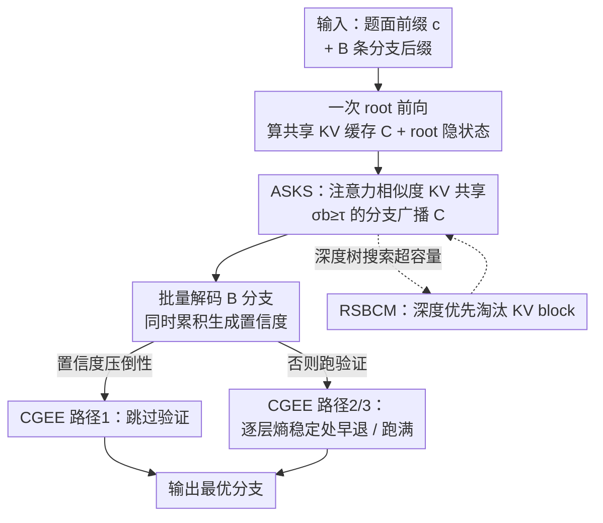

# RKSC: Reasoning-Aware KV Cache Sharing and Confident Early Exit for Multi-Step LLM Inference

**会议**: ICML2026  
**arXiv**: [2606.09937](https://arxiv.org/abs/2606.09937)  
**代码**: https://github.com/AnirudhSekar/RKSC  
**领域**: LLM效率  
**关键词**: KV Cache、推理加速、多分支推理、早退、训练无关

## 一句话总结
RKSC 是一个**训练无关**的推理框架，针对"多分支推理"（一题跑多条 reasoning 轨迹再投票/验证）里的两类结构性浪费——跨分支重复算前缀 KV、过深的验证前向——分别用"按隐状态相似度共享 KV"和"双层置信度早退"消掉，在 5 个 7B–10B 模型、4 个 benchmark 上相对无缓存基线平均加速 $3.008\times$，且早退引入的错误率只有 $0.37\%$。

## 研究背景与动机
**领域现状**：DeepSeek-R1、Qwen3、o1 这类推理时扩展（inference-time scaling）系统的标准玩法是：对同一道题并行生成 $B$ 条推理分支，再用一个过程奖励/验证器（process-reward verifier）给所有分支打分、选出最好的答案。多数情况下第一条轨迹就是对的，但系统仍要把所有分支都跑完。

**现有痛点**：这套流程里有两处生产系统都没碰的冗余。其一是**跨分支 KV 浪费**：并行分支共享绝大部分前缀（题面），却各自独立重算前缀的 KV cache——以 Tree of Thoughts（分支 4、深度 3、在深度 2 分叉）为例，分支间天然共享 $66\%$ 的 KV 计算。vLLM 和 SGLang 的前缀缓存只在 token **逐字节相同**时才复用 KV，跨分支的语义相似性完全没被利用。其二是**过深的验证**：过程奖励验证即使模型早已胸有成竹，也照样跑满整个网络深度的前向，没有系统去利用"后几层 logit 熵已经塌缩"这件事来层级早退。

**核心矛盾**：现有 KV 复用机制把"复用"和"词法相同"死死绑定，而真正决定能否复用的应该是"语义/隐状态是否一致"；同理，验证的算力被"必须跑满 $L$ 层"绑死，而实际需要的深度远小于 $L$。

**本文目标**：在**不微调、不改架构**的前提下，把这两类冗余都榨干，并把它做成任意多分支推理 pipeline 的即插即用 wrapper。

**切入角度**：作者观察到推理负载里本就存在三种现成结构——共享前缀、集中的生成置信度、后层熵塌缩——RKSC 不引入新计算，只是去"利用"这些结构。

**核心 idea**：用隐状态余弦相似度做 KV 复用的门控（严格泛化 token-exact 缓存），用生成置信度 + 逐层熵双层门控决定"验证要不要跑 / 跑多深"。

## 方法详解

### 整体框架
RKSC 把多分支推理的一次 solve 拆成三个可独立开关、零可学习参数的机制串起来：先用**一次** root 前向算出共享前缀 KV cache $\mathcal{C}$ 和 root 隐状态；ASKS 据此把 $\mathcal{C}$ 只广播给与 root 语义相似（$\sigma_b\geq\tau$）的分支，所有 $B$ 条分支在一个 batched 前向里解码并顺手累积生成置信度；解码完成后 CGEE 在三条路径里选一条——置信度压倒性时直接跳过验证（verify-skip）、否则跑验证但在中间层熵稳定处早退、再否则跑满验证；RSBCM 则在深度树搜索下按"分支得分/深度"给 KV block 打重要性分、超容量时优先淘汰深而弱的 block，防止缓存无界增长。

### 关键设计

**1. ASKS：用隐状态相似度门控 KV 共享，把"复用"从词法相同解绑**

痛点很直白：vLLM/SGLang 只在分支 token 与 root **逐字节相同**时才复用前缀 KV，但推理分支往往只是换了句话问同一题，token 一旦在第一个位置就分叉，复用率立刻归零。ASKS 的做法是先做一次 root 前向，存下每层 KV 和隐状态 $\mathbf{H}_{\text{root}}$（root 隐状态预先归一化为单位向量存一次，避免后续 $B$ 次比较时重复算）；每条分支处理完自己的后缀 token 后，计算它与 root 隐状态的**加权余弦相似度**

$$\sigma_b=\sum_{l=1}^{L}w_l\cdot\frac{\mathbf{h}^{(l)}_b\cdot\mathbf{h}^{(l)}_{\text{root}}}{\|\mathbf{h}^{(l)}_b\|\,\|\mathbf{h}^{(l)}_{\text{root}}\|},\qquad w_l=\frac{\exp(\alpha l/L)}{\sum_{l'}\exp(\alpha l'/L)},\ \alpha=1.5$$

权重 $w_l$ 对**后层指数加权**，因为后层携带更多任务相关信息、对"是否真的语义分叉"更敏感（$\alpha=1.5$ 由 30 道 GPQA Diamond 上网格搜索 $\{0.5,1.0,1.5,2.0\}$ 选出）。$\sigma_b\geq\tau$ 的分支拿共享缓存，低于 $\tau$ 的退回独立重算。这设计**严格泛化** token-exact 缓存：任何词法相同的前缀必然 $\sigma_b=1$，所以 vLLM 会复用的分支 ASKS 一定也复用；反过来 ASKS 还能多救回一批"token 不同但隐状态贴近 root"的分支——在多样化措辞的压力测试里多复用了 $28.6\%$（token-exact 在那里是 $0\%$）。复用通过对各层 K/V 张量做零拷贝 `repeat_interleave` 到 batch size $B$（再一次 `.clone()` 保证内存连续、防 SDPA kernel 崩），从而把 $B-1$ 条分支的 $O(n^2)$ 前缀注意力省掉。此外 ASKS 自带一个**运行时探针**：在每个 64-token 前缀桶的首次调用里实测"全重算"vs"单次前缀前向 + 共享解码"两条路谁快，只有后者更快才启用共享——在 A100 + SDPA 上，$n\geq 512$ 时所有 5 个模型都判定共享有利。

**2. CGEE：用置信度做双层门控，决定验证"跑不跑 / 跑多深"**

验证前向是第二大浪费。CGEE 分两级。**Level 1（verify-skip）**先看要不要跑验证：解码时顺手记录每个分支每步的 top-1 softmax 概率（这本来就要算，零额外开销），生成置信度取均值 $p^{(b)}=\frac{1}{t}\sum_{j=1}^{t}\max_v\Pr[y_j^{(b)}=v]$。门控要求**绝对置信度高且相对优势大**同时成立：

$$\max_b p^{(b)}\geq\tau_{\text{conf}}\quad\text{且}\quad\frac{\max_b p^{(b)}-\text{2nd-max}_b\,p^{(b)}}{\max_b p^{(b)}}\geq r_{\text{gap}}$$

双条件是为了同时堵住两种误判——"一条分支置信度中等但有个紧逼的对手"（只看绝对阈值会误触发）和"两条分支差距大但都很不自信"（只看 gap 会误触发）；门控触发就跳过整个 $\delta$-cost 验证、直接按 $p^{(b)}$ 排名。**Level 2（逐层熵早退）**在验证真的要跑时介入：用 `register_forward_hook` 在每层挂轻量钩子，取末 token 隐状态、过缓存好的 unembedding 矩阵 $W_u$ 投到 logit 空间算熵 $H^{(l)}=-\sum_v \text{softmax}(\mathbf{h}^{(l)}W_u^\top)_v\log\text{softmax}(\mathbf{h}^{(l)}W_u^\top)_v$，当三条件同时满足——深度 $l^*\geq l_{\min}$（默认 2）、$H^{(l^*)}<\theta$（熵足够低、logit 分布已集中）、$|H^{(l^*)}-H^{(l^*-1)}|<\epsilon$（连续两层熵已稳定、排除瞬时下探）——就抛内部异常让 solver 接住、用部分输出当验证结果（钩子每次 solve 后摘掉防内存泄漏）。在 Qwen2.5-7B（28 层）上 Level 2 在 $100\%$ 的验证前向里触发、平均退出层 18.4，即模型在最后约 $34\%$ 的层之前 logit 就已稳定，这 $34\%$ 对验证纯属浪费。三个阈值 $\tau_{\text{conf}}/r_{\text{gap}}/\theta$ 每模型在 30 道 held-out GPQA Diamond 上校准（分别取观测分布的 75 分位 / 25 分位 / 首次稳定点熵的中位数），得到只在"明摆着"的情形才触发的保守门控。

**3. RSBCM：按"分支得分/深度"淘汰 KV block，封顶深度树搜索的缓存增长**

深度树搜索下共享 KV 会无界膨胀。RSBCM 给每个缓存 block 一个重要性分 $\omega=\text{branch score}/(\text{depth}+1)$，分母用深度压低"树深处、几乎不会被回访"的 block，分子用分支得分保住"高置信轨迹"的 block；当已分配 block 数超过容量（默认 2000）就按 $\omega$ 升序淘汰。压力测试里把 `max_blocks=4<B=8` 强制触发淘汰，RSBCM 每题恰好淘汰 $B-4=4$ 个（20 题共 80 次，与期望完全吻合），开销约 $+1.5$ ms/题、答案一致性 $100\%$。在本文所有单深度实验里 RSBCM 其实是休眠的（block 总数从未超 2000），它是为多深度树搜索预留的机制。

### 损失函数 / 训练策略
无。RKSC 全程**训练无关**：不微调、不改架构、零可学习参数，三个机制各自可开关，作为任意多分支推理 pipeline 的即插即用 wrapper。

## 实验关键数据

实验在单张 A100-80GB（bf16 + TF32 + SDPA）上跑，5 个模型（Qwen2.5-7B、Mistral-7B、Falcon3-7B、Falcon3-10B、Llama-3-8B），4 个 benchmark（GPQA Diamond、MMLU-STEM、ARC-Challenge、GSM8K），$B=8$ 分支、前缀约 1024 token。两个基线：**No-KV**（各分支独立重算前缀）与 **vLLM-equivalent**（token-exact 前缀缓存）。

### 主实验
扩展评测（$t=8$ 解码步，$N=50$/数据集，共 1000 题）：

| 配置 | 平均延迟 (ms) | 相对 No-KV 加速 | 备注 |
|------|------|------|------|
| No-KV (基线) | 1,301 | $1.000\times$ | 各分支独立重算前缀 |
| vLLM-equivalent | 719 | $1.808\times$ | token-exact 前缀缓存 |
| **RKSC (KV+CGEE)** | **452** | **$3.008\times$** | 峰值 $3.990\times$（Llama-3-8B/MMLU） |

RKSC 相对 vLLM-equivalent 再快 $+61.2\%$（在同前缀 regime 下这部分增益全来自 CGEE）；vLLM-equivalent 的增益在所有 20 个模型×数据集对里都稳在 $1.78\times$–$1.83\times$（std 0.02），印证 KV 增益只依赖 $n$ 和 $B$、与模型族无关。

### 消融实验
延迟分解（GPQA Diamond，Qwen2.5-7B，$t=32$）与 ASKS 隔离测试：

| 配置 | 关键指标 | 说明 |
|------|---------|------|
| KV only | $1.343\times$（省 25.5%） | 仅前缀共享，CV=1% 极稳 |
| KV + CGEE (RKSC) | $1.622\times$（省 38.3%） | CGEE 让分布呈双峰、CV=28% |
| CGEE 验证隔离 ($t=128$) | $1.258\times$ | 验证前向 315→251 ms，$p<0.0001$ |
| ASKS vs token-exact（多样措辞） | +28.6% 复用 | token-exact 此处 0% 复用 |

### 关键发现
- **KV 共享是加速主力且极稳**（CV<2%），CGEE 是"难度自适应"的增量：verify-skip 触发率随难度单调变化——最难的 GPQA Diamond 约 $42\%$，最易的 ARC-C/MMLU 高到 $60\%$–$92\%$，因为难题分支间置信度差距小、双条件更难同时满足。这正好让 CGEE 在"最不需要验证"的简单题上贡献最大加速，是个自我纠偏的性质。
- **模型越大省得越多**：Falcon3-10B 平均 $3.619\times$（绝对省 1179 ms/题），7B–8B 模型 $2.57\times$–$3.17\times$，符合"固定省下若干层、大模型每层更贵"的延迟模型。
- **精度近乎无损**：1616 次验证调用里 CGEE 只引入 6 个错误（$0.37\%$），平均精度变化 $-0.2\%$，且 6 个错误全集中在 Level 1 的 verify-skip、且都在多选题（ARC-C）上——多选题的生成置信度反映的是"吐答案字母的流畅度"、偶尔与正确性信号背离。

## 亮点与洞察
- **"严格泛化"的论证很漂亮**：ASKS 用 $\sigma_b=1$ 必含 token-exact 这一点，把自己证成 vLLM 前缀缓存的**严格超集**——任何旧系统能复用的它都能复用，还能多救一批语义相似分支，没有"为了新方法牺牲旧场景"的风险。
- **零额外开销的置信度**：生成置信度复用了解码时本来就要算的 softmax，等于白嫖一个早退信号；逐层熵早退也只是把"模型自己已经想清楚了"显式化，思路可迁移到任何"重复跑满深度做打分/验证"的场景（reranking、RM 打分）。
- **运行时探针 vs 解析阈值**：作者没有去信理论推出的 $n^*\approx 90$，而是直接实测两条路径谁快——因为 SDPA kernel 有线性模型抓不住的固定开销（kernel launch、显存分配），这种"不信公式信实测"的工程取舍很实在。

## 局限与展望
- **样本量偏小**：$N=50$/数据集导致 CGEE 触发率的 95% CI 高达 $\pm10$–$18\%$；$N\geq200$ 才能压到 $\pm5\%$（但占加速主体的 KV 增益 CV<2%、不受此影响）。
- **规模与并行未验证**：只测了单卡 7B–10B，14B+ 和多卡张量并行会引入通信开销、可能改变"前缀共享 vs 验证"的相对占比。
- **域迁移与架构耦合**：熵阈值 $\theta$ 在 GPQA Diamond 上校准，换域可能要重新小扫一遍；Level 2 早退依赖 `register_forward_hook` 和可独立访问的 unembedding 矩阵，tied embedding 或 MoE/融合层架构需要额外 adapter 代码。
- **要求零验证错误的场景**应关掉 Level 1 只留 Level 2（后者按构造保持完整验证结果），代价是加速贡献变小。

## 相关工作与启发
- **vs vLLM / SGLang 前缀缓存**: 它们要求前缀逐字节相同才复用 KV，ASKS 把复用从词法相同解绑、改用隐状态相似度门控，是它们的严格超集；在多样措辞下旧方法 0% 复用，ASKS 仍有 1.131× 加速。
- **vs MemShare**: MemShare 在**单条**推理链内按 step 分隔符去重 KV，ASKS 作用于**跨并行分支**，互补。
- **vs 推测解码（Speculative / SpecInfer / Medusa）**: 它们用小草稿模型并行提议 token、加速 **decode 阶段**并保持输出分布不变；CGEE 加速的是过程奖励打分的**验证阶段**（靠逐层熵塌缩门控/截断验证前向），两条线完全正交、可叠加。
- **vs 层级早退（BERT 早退 / 生成早退 / 链间转移 token 早退）**: 已有早退多在 token 级或链间转移点；CGEE Level 2 是**单次验证前向内的层级早退**，机制正交。

## 评分
- 新颖性: ⭐⭐⭐⭐ "隐状态相似度门控 KV 共享 + 双层置信度早退"组合清晰，ASKS 严格泛化 token-exact 的论证有说服力。
- 实验充分度: ⭐⭐⭐⭐ 5 模型×4 数据集×1000 题、分解/隔离/敏感性消融齐全，唯样本量 N=50 偏小。
- 写作质量: ⭐⭐⭐⭐ 机制、公式、操作 regime 披露都很清楚，连 CV/CI 都老实交代。
- 价值: ⭐⭐⭐⭐ 训练无关、即插即用、3× 加速且精度近乎无损，对部署多分支推理系统很实用。

<!-- RELATED:START -->

## 相关论文

- [\[ICML 2026\] OBCache: Optimal Brain KV Cache Pruning for Efficient Long-Context LLM Inference](obcache_optimal_brain_kv_cache_pruning_for_efficient_long-context_llm_inference.md)
- [\[ICML 2026\] CriticalKV: Optimizing KV Cache Eviction from an Output Perturbation Perspective](criticalkv_optimizing_kv_cache_eviction_from_an_output_perturbation_perspective.md)
- [\[ACL 2025\] KV-Latent: Dimensional-level KV Cache Reduction with Frequency-aware Rotary Positional Embedding](../../ACL2025/llm_efficiency/kv_latent_cache_reduction.md)
- [\[ICLR 2026\] Cache What Lasts: Token Retention for Memory-Bounded KV Cache in LLMs](../../ICLR2026/llm_efficiency/cache_what_lasts_token_retention_for_memory-bounded_kv_cache_in_llms.md)
- [\[ACL 2026\] MTRouter: Cost-Aware Multi-Turn LLM Routing with History-Model Joint Embeddings](../../ACL2026/llm_efficiency/mtrouter_cost-aware_multi-turn_llm_routing_with_history-model_joint_embeddings.md)

<!-- RELATED:END -->
