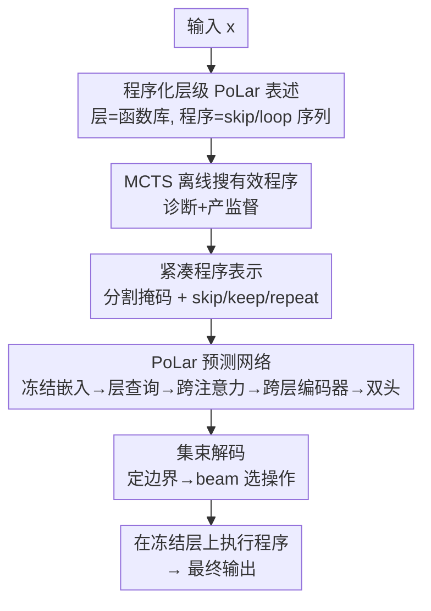

# Skip a Layer or Loop It? Learning Program-of-Layers in LLMs

**会议**: ICML2026  
**arXiv**: [2606.06574](https://arxiv.org/abs/2606.06574)  
**代码**: https://github.com/tianyi-lab/PoLar  
**领域**: LLM效率 / 动态深度推理 / 测试时计算  
**关键词**: 程序化层级, 层跳过与循环, 动态深度, 测试时扩展, 潜在推理

## 一句话总结
本文把预训练 LLM 的每一层看成可被任意调用的"原子函数"，提出"程序化层级"（Program-of-Layers, PoLar）——为每个输入定制一个可**跳过(skip)或循环(loop)**层的执行程序；先用 MCTS 实证发现这类更优程序对几乎每个输入都训练-free 地存在，再训一个轻量预测网络单次预测出执行程序，在数学推理基准上比标准前向和已有动态深度方法都更准、还常常执行更少的层。

## 研究背景与动机
**领域现状**：LLM 推理是**固定深度、固定顺序**的：不论输入难易，都把全部 $D$ 层按 $f_0\to f_{D-1}$ 跑一遍。而人类写程序解题是自适应的——简单题省步骤、难题加复杂度。

**现有痛点**：已有的层跳过 / 早退出 / 循环 Transformer 等动态深度方法，**只采用单一操作**（要么只跳、要么只重复），产生的也只是"深度变浅/变深"的有限架构，覆盖不了真正多样的潜在计算路径。

**核心矛盾**：固定前向是不是对所有输入都最优？作者的假设是——**正确推理需要随输入而变的计算量**，这种变化可以发生在 token 空间（更长的思维链），也可以发生在隐状态内部（本文关注的**潜在推理**）。固定深度执行只截取了 LLM 潜在推理能力的一个很窄子集。

**本文目标**：（1）实证检验"对每个输入，是否存在比标准前向更优（更准 / 更短）的层执行程序"；（2）若存在，如何**不靠昂贵搜索**就在推理时高效地生成这种程序。

**切入角度**：把 $D$ 层当成函数库 $\{f_0,\dots,f_{D-1}\}$，一个"程序"就是层索引序列 $\pi=(i_1,\dots,i_K)$，诱导复合计算 $F_\pi=f_{i_K}\circ\cdots\circ f_{i_1}$；允许跳过和重复，于是程序空间远大于"固定前向"这一个点。用 MCTS 在这个联合空间里搜，验证更优程序的存在性与结构规律。

**核心 idea**：用一个轻量预测网络**单次预测**输入专属的执行程序（哪些层段跳过/保留/循环），把"在线搜索程序"变成"一次性预测程序"，从而把 MCTS 揭示的潜在程序红利真正落地到推理。

## 方法详解

### 整体框架
PoLar 分两阶段。**阶段一（离线诊断）**：把推理重述为"执行一段层程序"，用 MCTS 在 skip/loop 联合空间里搜索每个输入的有效程序（valid program = 能产出正确预测的层序列），把它当**诊断工具**验证"更优程序普遍存在"并提炼结构规律；这些搜到的有效程序同时充当后续训练的监督信号。**阶段二（在线预测）**：训一个轻量 PoLar 预测网络，给定输入直接吐出"程序表示"——一个把层切成模块的分割掩码，加上每个模块的 skip/keep/repeat 操作标签；推理时把它解码成具体执行路径，在**完全冻结**的预训练层上跑一次得到输出。整条链路不更新任何预训练参数。

### 关键设计

**1. 程序化层级表述 + MCTS 实证：先证明"更优程序训练-free 地普遍存在"**

这是全文的地基。把每层当固定函数 $f_i:\mathbb{R}^{T\times d}\to\mathbb{R}^{T\times d}$，推理就是执行一段层程序 $\pi$。作者用 MCTS（选择—扩展—模拟—回传）在 skip/repeat 联合空间里搜有效程序，**只作诊断、不作推理手段**。在 DART-Math 五个难度级、四个模型上得到几条关键结论：在**联合空间**里搜（Skip&Loop）远好于只跳或只循环；对已答对的输入有 75.5% 存在更短的有效程序、对答错的输入有 36.2% 能被更短程序纠正，说明标准前向**经常过度计算**；越难的输入越依赖循环与跳过；而有效程序结构上高度"局部"——54.5% 的段只含单层、超过 2/3 的段至多含 2 个连续层、且每段至多重复一次。这些规律既证明红利存在，又直接约束了下一步的表示设计。

**2. 紧凑程序表示（packed modules：分割掩码 + skip/keep/repeat，$K_{\max}=4$）：把指数级程序空间压成可学习的小空间**

MCTS 搜出的程序是变长、离散、高度非凸的，直接学不动。作者据"局部段 + 至多一次重复"的实证规律，把程序压成两个离散结构：一个**二值边界掩码** $\mathbf{z}^{\text{seg}}(x)\in\{0,1\}^D$，$\mathbf{z}^{\text{seg}}_i=1$ 表示第 $i$ 层起一个新段，段长上界 $s_{j+1}-s_j\le K_{\max}=4$；以及一个**操作标签向量** $\mathbf{z}^{\text{op}}(x)\in\{\textsf{skip},\textsf{keep},\textsf{repeat}\}^D$（仅在段起点有效），其中 skip 删掉该段、keep 原样执行、repeat 把该段再跑一遍。这样把"任意层序列"收缩成"把连续层切段 + 每段三选一操作"，既覆盖了实证里最主流的程序模式，又让程序空间小到可稳定学习。表示并非原理上只能单次重复——操作词表可扩到 $\{\textsf{repeat-2},\dots\}$，只是 MCTS 显示更深重复收益甚微，故保持单 repeat。

**3. PoLar 预测网络：用单次前向预测取代昂贵的逐输入搜索**

为了避开 MCTS 的在线搜索成本，作者训一个轻量预测器直接出程序 logits。流程是：输入先过**冻结**的嵌入模型（Qwen3-Embedding-0.6B）得 token 表示 $\mathbf{H}=E(x)$、线性投到工作维 $\tilde{\mathbf{H}}=\mathbf{H}\mathbf{W}_h$；给每个层索引配一个**可学习的层查询嵌入** $\mathbf{E}\in\mathbb{R}^{D\times d}$；做**多头跨注意力** $\mathbf{X}=\text{MHA}(\mathbf{Q}{=}\mathbf{E},\mathbf{K}{=}\tilde{\mathbf{H}},\mathbf{V}{=}\tilde{\mathbf{H}})$，让每层拿到一个"输入条件化"的表示；再过一个**跨层 Transformer 编码器** $\mathbf{X}'=\text{Enc}_{\text{layer}}(\mathbf{X})$ 在深度维上自注意力、让每层决策能看到全局深度上下文；最后两个线性头分别出分割 logits $\ell^{\text{seg}}\in\mathbb{R}^D$ 与操作 logits $\ell^{\text{op}}\in\mathbb{R}^{D\times3}$。监督来自 MCTS 离线收集的有效程序（解析成 $\mathbf{z}^{\text{seg}*},\mathbf{z}^{\text{op}*}$），当一个输入有多个有效程序且至少一个比满深度短时，**下调满深度执行的损失权重**（呼应"更短程序更优"的发现）。

**4. 两阶段集束解码：定边界再 beam 选操作，顺带支撑测试时扩展**

推理时若每段独立 argmax 选操作，会忽略段与段之间的非局部交互。PoLar 改成两步解码：先对 $\ell^{\text{seg}}$ 阈值化定段边界，超过 $K_{\max}$ 的段再插边界强制满足约束，得段起点 $\{s_j\}$；在此分割下计算各段起点的操作对数概率 $\log p(o_j\mid x,s_j)=\log\text{Softmax}(\ell^{\text{op}}_{s_j})[o_j]$，再在段级操作选择上做**小规模集束搜索**以保证全局一致，产出一组排序好的候选程序 $\pi(x)$；每个候选按段-路径规则确定性地映射成具体执行路径。候选数即天然的"测试时计算预算"，增大候选数就能做 pass@k 形式的测试时扩展。

### 损失函数 / 训练策略
分割用二值交叉熵：$\mathcal{L}_{\text{seg}}=-\sum_i[\mathbf{z}^{\text{seg}*}_i\log p^{\text{seg}}_i+(1-\mathbf{z}^{\text{seg}*}_i)\log(1-p^{\text{seg}}_i)]$，$p^{\text{seg}}_i=\sigma(\ell^{\text{seg}}_i)$；操作用**仅在段起点生效的掩码交叉熵**：$\mathcal{L}_{\text{op}}=-\sum_i m_i\log\mathbf{p}^{\text{op}}_i[\mathbf{z}^{\text{op}*}_i]$，$m_i=\mathbf{z}^{\text{seg}*}_i$；总目标 $\mathcal{L}=\mathcal{L}_{\text{seg}}+\mathcal{L}_{\text{op}}$。预测网络轻量、预训练 LLM 全程冻结。

## 实验关键数据

### 主实验
评测在 DART-Math（DM-1 到 DM-5 五个难度级）上，覆盖 LLaMA-3.2-3B-Instruct、Qwen1.5-MoE-A2.7B、Qwen2.5-3B、Qwen3-8B。下表是**MCTS 程序在不同搜索空间下的准确率**（Base=标准前向，Skip=只跳，Loop=只循环，Skip&Loop=联合），印证联合空间的巨大红利（数值为准确率 %）。

| 模型 / 难度 | Base | Skip | Loop | Skip&Loop | 增益 |
|------------|------|------|------|-----------|------|
| Qwen2.5-3B · DM-1 | 25.4 | 47.0 | 60.2 | **87.4** | +62.0 |
| Qwen2.5-3B · DM-3 | 4.3 | 25.1 | 35.5 | **65.0** | +60.7 |
| Qwen3-8B · DM-1 | 40.7 | 66.0 | 68.5 | **91.3** | +50.6 |
| LLaMA-3.2-3B · DM-1 | 37.9 | 45.7 | 54.9 | **84.7** | +46.8 |

注意这是 MCTS 搜到的**存在性上界**（诊断用），说明"更优程序"对几乎每个输入都存在；落地效果看下表预测网络。

### 落地与 OOD
下表是 LLaMA-3.2-3B 上**实际预测网络** PoLar 与动态深度基线（ShortGPT、MindSkip、FlexiDepth、DR.LLM）的 pass@k 对比，以及 Qwen1.5-MoE 上的 OOD 泛化（pass@1）。

| 配置 | DM-1 | DM-3 | DM-5 | 说明 |
|------|------|------|------|------|
| Base (采样) p@1 | 40.6 | 27.4 | 29.2 | 标准前向 |
| DR.LLM p@1 | 41.6 | 27.0 | 28.4 | 最强基线 |
| **PoLar p@1** | **46.2** | **28.2** | **30.2** | 单候选已超基线 |
| **PoLar p@5** | **68.4** | **46.0** | **45.8** | 测试时扩展 |
| Δ vs Base p@5 | +20.8 | +13.2 | +10.2 | 增大候选数的增益 |

| OOD (Qwen1.5-MoE, p@1) | ASDiv | MAWPS | MMLU-Pro·Math | 说明 |
|------------------------|-------|-------|---------------|------|
| Base (τ=0) | 59.1 | 41.7 | 13.9 | 标准前向 |
| DR.LLM | 59.1 | 41.3 | 14.6 | 最强基线 |
| **PoLar** | **63.8** | **46.7** | **18.5** | ID 学到的程序迁移到 OOD 仍涨 |

### 关键发现
- **跳+循环互补、循环更关键**：Loop 普遍强于 Skip，但 Skip&Loop 才拿到每个设定的最高分，说明两种操作角色互补。
- **标准前向经常过算**：75.5% 答对的输入存在更短有效程序，PoLar 因此常在涨点的同时**平均执行更少层**。
- **难题需要更多计算**：越难的难度级越依赖循环/跳过，测试时增大候选数（segment recurrence）单调提升有效程序存在概率——揭示了"潜在推理层面的测试时扩展"。
- **冷启动基线崩盘**：ShortGPT/MindSkip/FlexiDepth 在数学推理上准确率掉到个位数，而 PoLar/DR.LLM 保住并超过 Base，说明不当的层操作会严重破坏推理。
- **OOD 不退化**：在 ID（数学）上学到的程序迁移到 ASDiv/MAWPS/MMLU-Pro 多领域仍稳定涨点，程序选择策略具备泛化性。

## 亮点与洞察
- **"层即函数库、推理即执行程序"的重述很有冲击力**：把固定前向看成程序空间里的一个点，自然引出 skip+loop 联合空间，揭示了固定深度只用到 LLM 潜在推理能力的一个窄子集。
- **先 MCTS 诊断、后蒸馏成预测器**：用昂贵搜索证明红利存在并提炼结构先验（局部段、单次重复），再把先验灌进紧凑表示让轻量网络可学——"搜索发现 → 表示约束 → 单次预测"的范式很可复用。
- **完全冻结、零参数更新**：PoLar 是外挂的轻量预测器，不动任何预训练权重，部署上像给现成模型加一个"程序调度器"。
- **候选数=测试时预算**：集束解码天然给出候选集，pass@k 形式的测试时扩展不需要改模型，难易自适应地分配计算。

## 局限与展望
- **依赖 MCTS 离线监督**：训练信号来自昂贵的 MCTS 搜索，搜索质量/覆盖直接决定预测器上限；新模型/新任务都要重搜。
- **表示受局部先验约束**：$K_{\max}=4$、单次 repeat、连续段——这些约束来自数学推理上的实证，未必适配需要长程跳转/深度迭代的任务。
- **评测集中在数学推理**：主结果在 DART-Math，OOD 也偏推理类；在生成、长上下文等任务上的收益尚未验证。
- **pass@k 的实际成本**：p@5 的大幅增益依赖跑多候选程序，单条延迟优势会被候选数稀释，真实部署需权衡。

## 相关工作与启发
- **vs ShortGPT / MindSkip（层跳过/早退出）**：它们只做单一 skip、且在数学推理上准确率崩盘；PoLar 在 skip/keep/repeat 联合空间里学程序，既保住准确率又能更短。
- **vs FlexiDepth / 循环 Transformer**：这些是单一操作的动态深度；PoLar 联合 skip 与 loop，严格泛化了仅支持单一执行控制的方法。
- **vs DR.LLM（最强动态深度基线）**：DR.LLM 大致与 Base 持平、略升；PoLar 在 p@1 与 p@k 上全面超过它，且 OOD 不退化。
- **vs MCTS 在线搜索 / 逐输入枚举路径**：MCTS 揭示红利但指数空间搜索不可实用；PoLar 把在线搜索换成单次预测，保留红利、去掉搜索成本。

## 评分
- 新颖性: ⭐⭐⭐⭐⭐ "层即函数库、推理即程序"的重述 + skip/loop 联合空间，视角新颖且实证扎实。
- 实验充分度: ⭐⭐⭐⭐ 4 模型 × 5 难度 + 多基线 + OOD，较充分，但任务偏数学推理。
- 写作质量: ⭐⭐⭐⭐⭐ 先诊断后落地的两阶段叙事清晰，结构规律提炼到位。
- 价值: ⭐⭐⭐⭐ 给"冻结模型上做难易自适应的潜在推理"提供了可落地范式，对动态深度方向有推动力。

<!-- RELATED:START -->

## 相关论文

- [\[ACL 2025\] CLaSp: In-Context Layer Skip for Self-Speculative Decoding](../../ACL2025/llm_efficiency/clasp_self_speculative_decoding.md)
- [\[ICML 2026\] L$^3$: Large Lookup Layers](l3_large_lookup_layers.md)
- [\[ICML 2026\] Hyperparameter Transfer with Mixture-of-Experts Layers](hyperparameter_transfer_with_mixture-of-expert_layers.md)
- [\[ICML 2026\] KnapSpec: Self-Speculative Decoding via Adaptive Layer Selection as a Knapsack Problem](knapspec_self-speculative_decoding_via_adaptive_layer_selection_as_a_knapsack_pr.md)
- [\[ICML 2026\] SoftMoE: Soft Differentiable Routing for Mixture-of-Experts in LLMs](softmoe_soft_differentiable_routing_for_mixture-of-experts_in_llms.md)

<!-- RELATED:END -->
