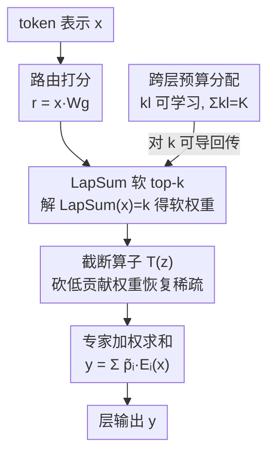

# SoftMoE: Soft Differentiable Routing for Mixture-of-Experts in LLMs

**会议**: ICML2026  
**arXiv**: [2606.17952](https://arxiv.org/abs/2606.17952)  
**代码**: https://github.com/dlcuda/SoftMoE  
**领域**: LLM 效率 / 混合专家  
**关键词**: 混合专家, 可微路由, 软 top-k, LapSum, 专家分配, 自回归

## 一句话总结
SoftMoE 用一个基于 LapSum 的可微「软 top-$k$」算子替换 MoE 里不可导的硬 top-$k$ 选择，让路由可以梯度优化、激活专家数随 token 自适应；再加一个全局预算约束让模型**自己学每层该分多少专家**，结果在更省专家的前提下匹配甚至超过稀疏 MoE，并发现一个有趣规律——**越靠后的层越想多激活专家**。

## 研究背景与动机

**领域现状**：稀疏混合专家（MoE）是当下扩大 LLM 参数量却不涨推理成本的主流手段：每个 token 只激活 $k$ 个最高分专家（硬 top-$k$ 路由），既保住自回归因果性、又有强经验表现，Switch Transformer 是事实标准。

**现有痛点**：硬 top-$k$ 算子是**离散、不可导**的。梯度没法穿过专家选择过程，于是 ① 每个 token 激活的专家数只能**先验固定**（事先定死 $k$）；② 专家容量没法跨层、跨 token 自适应分配，常导致算力用得低效；③ 训练动态还容易不稳。门控矩阵 $\mathbf{W}_g$ 只能靠选择前 softmax 分数的「替代梯度」来训，训练目标和推理时的 top-$k$ 选择存在长期错配。

**核心矛盾**：已有的替代路由要么打破自回归兼容（如把不同位置/不同输入的 token 混在一起做软路由），要么把推理路由和训练流程解耦，要么把推理时的专家负载弄歪。**没有一个方案能同时做到：跨层跨 token 自适应分配容量 + 保因果性 + 计算高效。**

**本文目标**：拆成两步——先造一个适配大规模 MoE 的可微软 top-$k$ 路由；再在其上加一个可学习、带全局约束的专家预算，让模型自己决定各层激活几个专家。

**切入角度**：作者借用 Struski et al. (2025) 提出的 LapSum 可微序统计算子。它把 top-$k$ 阈值问题写成一个闭式可解的方程，**线性时间/内存、无需排序**，天然适合专家数动辄 32–64 的大 MoE。关键是它对路由分数 $r$ **和**选择参数 $k$ **都可导**——后者正是「学每层专家数」的钥匙。

**核心 idea**：用 LapSum 软 top-$k$ 替换硬 top-$k$，每个 token 独立处理（不混 token、保自回归），再用可微的 $k$ 配上全局预算约束，把「每层分多少专家」从超参变成学出来的参数。

## 方法详解

### 整体框架

SoftMoE 的目标是把标准稀疏 MoE 里那个不可导的 $\operatorname{Top_k}$ 门控换成可导版本，从而解锁两件硬 top-$k$ 做不到的事：**每 token 自适应激活专家数** 和 **跨层学习专家预算分配**。整条链路是：路由网络对 $n$ 个专家打分 $\mathbf{r}=\mathbf{x}\mathbf{W}_g$ → 软 top-$k$ 算子把分数转成 $[0,1]$ 的软选择权重（而非 0/1 硬掩码）→ 截断算子砍掉低贡献权重恢复稀疏 → 用剩下的权重对专家输出加权求和。在此之上再套一层「跨层预算」机制：把各层的平均激活专家数 $k_l$ 设为可学习参数，用 softmax 重参数化在固定全局预算 $K$ 下竞争分配。

### 关键设计

**1. LapSum 软 top-$k$ 算子：把离散选择变成闭式可解的可微阈值**

硬 top-$k$ 的病根是不可导，作者用 LapSum 把它松弛掉。给定 $n$ 个专家的路由分数 $\mathbf{r}=(r_i)$，硬版本输出 0/1 向量 $\mathbf{p}$ 且 $\sum_i p_i=k$；松弛版改成连续权重 $\tilde{\mathbf{p}}\in[0,1]^n$ 且仍满足 $\sum_i \tilde{p}_i=k$。核心是把 top-$k$ 阈值问题写成一个方程：

$$\mathrm{LapSum}(x)=\sum_{i=1}^{n}F_{\text{Lap}}(r_i-x)=k,$$

其中 $F_{\text{Lap}}$ 是 Laplace 分布的 CDF。这个方程有**唯一解** $\tilde{x}$，且能**闭式求出、无需排序或迭代**，因此对专家数是线性时间/内存复杂度。直觉上 $\mathrm{LapSum}(x)$ 是计数函数 $\sum_i \mathbf{1}[r_i\ge x]$ 的光滑近似，解 $\mathrm{LapSum}(x)=k$ 等于找第 $k$ 个序统计量的连续松弛；软权重 $F_{\text{Lap}}(r_i-\tilde{x})$ 就是 0/1 掩码的可导近似。它可看作 softmax 的推广：softmax 输出和为 1，而 LapSum 输出**和恰为 $k$**、每个元素仍在 $[0,1]$——既保稀疏语义又让梯度流动。最关键的是它对 $r$ 和 $k$ 都可导，后者是学专家分配的前提。

**2. ReLU 式截断恢复稀疏：让激活专家数随 token 输入自适应**

软 top-$k$ 给了可导性，但若真的对全部 $n$ 个专家都用软权重计算，就退化成稠密计算、白白丢掉 MoE 的省算力优势。作者用一个截断算子砍掉低贡献权重：

$$\mathcal{T}(z)=z\,\mathbb{I}_{z>\tau},$$

即把低于阈值 $\tau$ 的软权重置零、只让 $z>\tau$ 的专家参与并回传梯度（$z<\tau$ 处梯度为 0，边界处取次梯度 $\mathcal{T}'(0)=0$）。它等价于一个平移过的 ReLU。这里有个微妙但重要的点：**按阈值截断而非按排名选 top-$k$**，意味着激活的专家数**取决于 token**——简单 token 的软权重集中在一两个专家上、就少激活，需要更多容量的 token 权重分布更均匀、就多激活，从而实现 per-token 的算力自适应。门控对具体哪些专家的选择在边界处仍不可导（类似硬 top-$k$），但模型对**选择参数 $k$** 经 LapSum 逆始终可导，这条梯度通路正是学习每层专家预算的命脉，而它在 $k$ 是固定整数时是不存在的。

**3. 全局预算下的可学习跨层专家分配：让模型自己决定每层放几个专家**

标准稀疏 MoE 各层激活同样多的专家，但不同深度对容量的需求未必一样。借助对 $k$ 可导，作者把 $L$ 个 MoE 层的平均激活专家数写成可学习向量 $\mathbf{k}=(k_l)_{l=1}^L$，并施加约束：每层至少 1 个专家、总和等于全局预算，即 $k_l\ge 1$ 且 $\sum_{l=1}^L k_l=K$。为了无约束优化，引入辅助参数 $\bm{\eta}$ 做重参数化：

$$\bm{\pi}=\operatorname{softmax}(\bm{\eta}),\quad k_l=\pi_l\cdot(K-L)+1.$$

softmax 保证 $\sum_l \pi_l=1$，仿射变换把概率单纯形映到可行域（$\sum_l k_l=K$ 且每个 $k_l\ge 1$），整条端到端可导，能和模型其它参数一起用普通梯度下降优化。全局预算 $K$（如 $K=2L$ 等价于平均每层 2 个专家）引入了**层间竞争**：某层想多要专家，别的层就得让出来，逼模型把算力挪给最受益的层。论文给出的额外工程细节：阈值 $\tau$ 用初始 batch 的激活统计标定到平均约激活 $k$ 个专家；每层再用扩张因子 $\alpha\in\{2,4\}$ 把激活上界卡在 $\lceil k_i\cdot\alpha\rceil$，防止近均匀路由的 token 触发 OOM，同时仍允许输入相关地激活数倍于均值的专家。LapSum 路由本身只加 $O(n)$ 开销，相对乘 $n\times d$ 门控矩阵的成本可忽略。

### 损失函数 / 训练策略

模型是 decoder-only GPT-2 架构（10 个 transformer block、每块 32 专家、每专家 5M 参数、共 1.63B 参数），把稠密 MLP 换成 Switch 风格稀疏 MoE 或 SoftMoE 层。所有模型加 Switch 的辅助负载均衡损失保持各层专家负载平衡，并给门控预激活值加小噪声鼓励探索不同路由模式。在 C4 上训 164k 步、OWT 上训 18k 步，用 Megatron-LM 扩展 SoftMoE 路由实现。

## 实验关键数据

### 主实验

下表为 OWT 与 C4 上按「平均激活专家预算」分组的对比（Train-AE/Infer-AE 为训练/推理平均激活专家数，越低越省；Loss 越低越好）：

| 数据集 | 模型 | 预算 | Train-AE | Infer-AE | Loss | HellaSwag |
|--------|------|------|------|------|------|------|
| OWT | Sparse MoE (k=2) | ≤2 | 2 | 2 | 2.79 | 31.50 |
| OWT | SoftMoE* (k=1.5) | ≤2 | **1.53** | **1.73** | **2.78** | 32.13 |
| OWT | SoftMoE (k=1.5) | ≤2 | 1.63 | 1.96 | **2.76** | **32.12** |
| C4 | Sparse MoE (k=2) | ≤2 | 2 | 2 | 2.24 | 45.41 |
| C4 | SoftMoE* (k=1.5) | ≤2 | **1.65** | 1.81 | **2.23** | **45.49** |
| C4 | Sparse MoE (k=4) | ≤4 | 4 | 4 | 2.20 | 47.23 |
| C4 | SoftMoE* (k=1, α=4) | ≤4 | 3.60 | 3.82 | **2.19** | **48.48** |

在 ≤2 预算档，SoftMoE* 在**训练时少激活 17%（C4）到 24%（OWT）专家**的同时把建模损失做得更低；HellaSwag 上软路由在所有配置上都稳定超过稀疏 MoE。

### 消融实验

| 配置 | 关键差异 | 效果 |
|------|---------|------|
| Sparse MoE | 硬 top-$k$，每层固定 $k$ 个专家 | 基线 |
| SoftMoE* | 软 top-$k$，无跨层学习分配 | 更省专家 + 更低 loss，验证「可微路由」本身就增益 |
| SoftMoE | 软 top-$k$ + 学习跨层分配 | loss 通常进一步更低，但平均激活专家略升（容量向后层集中） |

### 关键发现

- **可微路由本身就值钱**：SoftMoE*（仅换软 top-$k$、不学分配）就已在更少专家下做到更低 loss，说明增益主要来自「让每 token 自适应决定激活几个专家」，而非额外的分配学习。
- **学到的分配高度非均匀、且偏向后层**：在固定全局预算下，SoftMoE 把容量从前/中层挪向最后几层——**最后 3 个 transformer 层吃掉约 50% 的总专家预算**，且这个模式在前 25k 步内迅速形成。
- **与表征深度研究呼应**：后层多要专家这一现象，和「深层编码高层语义、浅层编码句法」（Tenney et al. 2019、Jawahar et al. 2019）的探针结论一致，提示 decoder-only MoE 也有类似深度分工，暗示**深度感知的专家分配比当前通行的均匀分配更合理**。
- **下游任务确认增益**：HellaSwag 上软路由全配置占优，PIQA 多数配置更好或相当，预训练 loss 最好的配置往往下游也最强；ARC-E 方差较大（评测集小），但 SoftMoE 在 OWT 预训练下取得最强 ARC-E。

## 亮点与洞察
- **把超参变成可学参数**：MoE 里「每层激活几个专家」一直是手调超参，本文借 LapSum 对 $k$ 可导，把它升级成端到端学出来的量，是个干净漂亮的「让模型自己决定算力分配」的范式。
- **保自回归的软路由很难得**：此前软路由（token mixing、跨样本聚合）几乎都要打破因果性或引入跨输入泄漏风险；SoftMoE 每 token 独立处理、不混 token，是少数能和自回归 LM 完全兼容的软路由。
- **「后层多要专家」是可迁移的工程结论**：它直接挑战「均匀分配专家」的工业惯例，提示在实际大 MoE 里把更多专家预算放到深层可能免费涨点，且这个发现有表征学理论背书。
- **闭式 + 线性复杂度**：LapSum 无需排序/迭代、$O(n)$ 内存，相对门控矩阵开销可忽略，让软路由在 32–64 专家的真实 MoE 上可用，而非只停留在小规模玩具。

## 局限与展望
- **规模偏小**：只在 1.63B 参数、10 层 32 专家上验证；现代部署的 MoE 大得多，结论（尤其「后层吃一半预算」）能否外推到大模型未知。
- **语言/模态单一**：只用 OWT、C4 两个英文语料 + 英文下游任务；多语言、多模态下 SoftMoE 的表现未测。
- **边界仍不可导 + OOM 工程补丁**：截断在阈值边界对「选哪些专家」仍不可导，且需要用扩张因子 $\alpha$ 卡上界防 OOM——说明 per-token 激活数虽自适应、但实现上仍要硬性封顶，离「完全自由的动态算力」有距离。
- **学习分配是双刃**：SoftMoE（带学习分配）loss 更低但平均激活专家略升，是把算力往后层堆的代价；在严格算力预算下未必总是净赚。

## 相关工作与启发
- **vs Switch Transformer (Fedus et al. 2022)**: 硬 top-1/top-$k$ 路由、每层固定专家数；SoftMoE 换成可微软 top-$k$ 并学跨层分配，在同等或更少专家下匹配/超越它，是直接的可微化升级。
- **vs Soft MoE / Mixture of Tokens (Puigcerver 2024, Antoniak 2024)**: 它们靠 token mixing 或跨样本聚合实现软路由，破坏自回归因果或引入跨输入泄漏；本文每 token 独立、保因果，是关键区别。
- **vs LapSum 原作 (Struski et al. 2025)**: 本文是 LapSum 可微序统计算子在大规模 MoE 路由上的具体落地，并额外利用「对 $k$ 可导」这条性质做出了跨层预算学习这个新能力。

## 评分
- 新颖性: ⭐⭐⭐⭐ 把可微 top-$k$ 落到保自回归的 MoE 路由，并解锁「学每层专家数」，角度扎实新颖。
- 实验充分度: ⭐⭐⭐ 两语料 + 三下游 + 充分消融，但仅 1.63B 单一规模，缺大模型与多模态验证。
- 写作质量: ⭐⭐⭐⭐ 从硬到软的推导清晰，LapSum、截断、跨层分配三层递进讲得顺。
- 价值: ⭐⭐⭐⭐ 「后层多分专家」与「可学专家预算」对真实 MoE 设计有直接启发，代码开源。

<!-- RELATED:START -->

## 相关论文

- [\[ICML 2026\] ProbMoE: Differentiable Probabilistic Routing for Mixture-of-Experts](probmoe_differentiable_probabilistic_routing_for_mixture-of-experts.md)
- [\[ICML 2026\] Skill-Based Mixture-of-Experts: Adaptive Routing for Heterogeneous Reasoning via Inferred Skills](skill-based_mixture-of-experts_adaptive_routing_for_heterogeneous_reasoning_via_.md)
- [\[ICML 2026\] RepetitionCurse: Measuring and Understanding Router Imbalance in Mixture-of-Experts LLMs under DoS Stress](repetitioncurse_measuring_and_understanding_router_imbalance_in_mixture-of-exper.md)
- [\[ICML 2026\] Hyperparameter Transfer with Mixture-of-Experts Layers](hyperparameter_transfer_with_mixture-of-expert_layers.md)
- [\[ICML 2026\] Beyond Sunk Costs: Boosting LLM Pre-training Efficiency via Orthogonal Growth of Mixture-of-Experts](beyond_sunk_costs_boosting_llm_pre-training_efficiency_via_orthogonal_growth_of_.md)

<!-- RELATED:END -->
