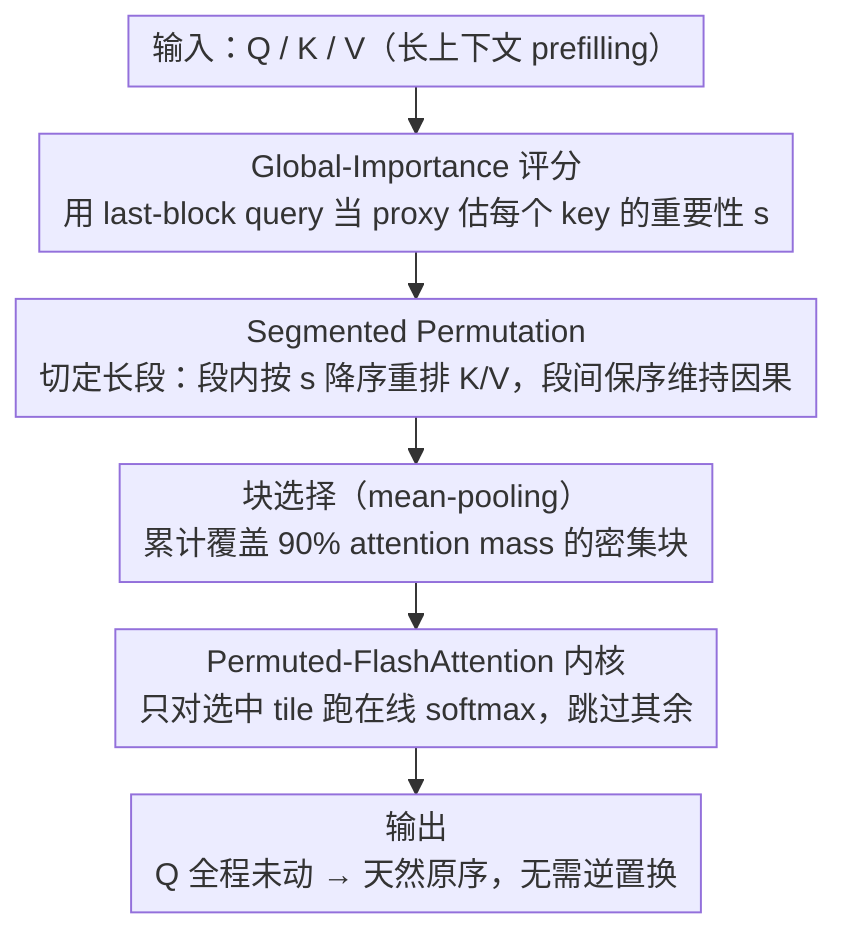

# Sparser Block-Sparse Attention via Token Permutation

**会议**: ICML 2026  
**arXiv**: [2510.21270](https://arxiv.org/abs/2510.21270)  
**代码**: https://github.com/xinghaow99/pbs-attn (有)  
**领域**: LLM效率 / 长上下文 / 稀疏注意力  
**关键词**: 块稀疏注意力, Token Permutation, 长上下文 Prefilling, FlashAttention, Heavy Hitter

## 一句话总结
本文提出 PBS-Attn，利用注意力的置换不变性，先按"全局重要性"对 key 在段内重排，把散落各处的 heavy hitter 聚拢成连续高密度块，再做块稀疏计算，从而在保持精度近乎追平 full attention 的同时，把长上下文 prefilling 端到端加速最高 2.75 倍。

## 研究背景与动机

**领域现状**：长上下文 LLM 的瓶颈是 self-attention 的 $O(N^2)$ 复杂度。FlashAttention 通过分块和在线 softmax 解决了显存问题，但 FLOPs 仍是平方级。块稀疏注意力（MInference / FlexPrefill / XAttention 等）在 FlashAttention 的 tiling 之上再加一层 "block mask"，对预测为低权重的整块直接跳过计算，是目前主流加速路径。

**现有痛点**：块稀疏方法被注意力矩阵的**原始结构**绑住了。query 在某个 block 里关心的关键 key（"heavy hitter"），实际是按重尾分布零散撒在整条序列上的；要把它们覆盖住，就得选很多个 block，而每个被选中的 block 里真正有用的 token 又很少，造成"取了一筐石头去淘几粒金子"。

**核心矛盾**：现有方法只在**给定的混乱矩阵**里被动挑选 block（优化 $\mathbb{C}_{\text{sel}}$），却没有人去优化注意力矩阵本身的结构。这是一条被忽略的优化轴。

**本文目标**：在保持模型精度和因果性的前提下，主动重塑 Q/K/V 的排列，让 block 级稀疏度从 30%-40% 提到 60%+，并端到端落到墙钟加速上。

**切入角度**：注意力对 key-value 的**置换是不变的**（$\text{Attn}(Q, P_\pi K, P_\pi V) = \text{Attn}(Q, K, V)$）。这意味着可以自由重排 key 的顺序，把散落的 heavy hitter 物理上聚到一起，而不改变数学输出。难点只剩两个：① 怎么定义"重要性"来排序；② 怎么和因果 mask 共存。

**核心 idea**：用最后一个 query block 当 proxy 估出每个 key 的全局重要性分数，然后在**段内**按分数降序重排 key，段间保持原序以维持因果性 —— 把"挑块"变成"先整理再挑块"。

## 方法详解

### 整体框架

PBS-Attn 是一个 plug-and-play 的长上下文 prefilling 加速模块，核心是把块稀疏注意力的"被动挑块"改成"先把重要 key 聚成簇再挑块"。一次前向里它做四件事：先用序列最后一个 query block 当 proxy，给每个 key 估一个全局重要性分数；再把序列切成定长段、在段内按分数降序重排 K（和对应 V），段间保持原序以维持因果；接着在重排后的张量上用 mean-pooling 选出真正密集的块、只对这些块跑 FlashAttention 在线 softmax；最后因为 query 全程没动，输出天然就是原始顺序、不用做逆置换。整套流程不改动数学输出，只重塑了注意力矩阵的稀疏结构。

### 关键设计

**1. Global-Importance-based Key Permutation：用 last-block query 当 proxy 排出 heavy hitter**

要把散落各处的 heavy hitter 聚成簇，第一步得先有一把"哪些 key 重要"的尺子。本设计给出"key 有多重要"的可计算定义：分数向量 $\mathbf{s} = \text{mean}_{\text{rows}}(\text{softmax}(\mathbf{Q}_{\text{last\_block}} \mathbf{K}^T / \sqrt{d}))$，之后就按它对 key 降序排。直接对完整 $QK^T$ 排序要 $O(N^2)$、得不偿失，所以只用最后 $B$ 个 query 做 proxy，把代价压到线性的 $O(NBd)$，而实测它和"全 query 平均"几乎一致。为什么一小撮 query 就够？因为 heavy hitter（attention sink、vertical line pattern 等）对不同 query 几乎是一致的——16K 上的对照实验（Figure 1）显示：随机 permutation 反而掉点（说明原序里确有局部结构要尊重），fine-grained 的 greedy 局部对齐略好但不如全局重要性排序。这把"permutation 为什么 work"从经验观察落到了一个可解释的归纳偏置上：稀疏注意力的关键不在精细对齐，而在把全局重要 token 聚成簇。

**2. Segmented Permutation：在不破坏因果 mask 的前提下重排 key**

有了重要性分数，直接按它做一次性全局重排却会踩因果性的坑——全局 permutation 把因果三角彻底打散，让原本被天然跳过的上三角块也变成必须计算（block density 从 $\frac{T_c+1}{2T_c}$ 涨到 1），收益直接变负。本设计的解法是段化：把前 $\lfloor N/S \rfloor \cdot S$ 个 token 切成 $G$ 个长度 $S$ 的段，全局置换矩阵写成块对角形式 $\mathbf{P}_\pi = \text{diag}(\mathbf{P}_{\pi_1}, \dots, \mathbf{P}_{\pi_G}, \mathbf{I})$：段内按分数 $\mathbf{s}$ 降序重排（$\pi_i = \text{argsort}(-\mathbf{s}_{[(i-1)S+1 : iS]})$）、段间相对顺序不动。这样 query $q_i$ 仍然只能"看到"它所在段及之前的所有段——这些段不论内部怎么重排都还在它的可见范围里，对角线段（query 段 = key 段）保留因果三角，对角线以下的段整块要么全选要么全跳。段化是"保因果"与"提稀疏度"之间的最小折中。

**3. Permuted-FlashAttention 内核：只重排 K/V，避开 GQA 复制开销**

光有 permutation 还不够，得让它落到墙钟加速上、且不打断 SRAM 上的在线 softmax。内核先在 HBM 上做一次性的 $\mathbf{K}' = \mathbf{P}_\pi \mathbf{K}$、$\mathbf{V}' = \mathbf{P}_\pi \mathbf{V}$ 重排，再由块选择 mask $\mathbf{M}$ 指引哪些 $(i,j)$ tile 跳过：选中的 tile 走标准 FlashAttention 流程更新 $\mathbf{m}_i^{(j)}, \mathbf{l}_i^{(j)}, \mathbf{O}_i^{(j)}$，跳过的 tile 直接继承前一状态。关键的取舍是"只动 K/V、不动 Q"：query permutation 的收益本就边际（Figure 6a），却要额外逆置换输出、在 GQA 下还得重新组织 query tile，不划算；不动 query 反而带来隐藏好处——GQA 下一个 query head 对应多个 key head 时，permutation 可以选独立（默认，最大化稀疏度）或共享（附录 G，省显存）两种策略。综合下来只重排 K/V 是性价比最高的切法。

### 损失函数 / 训练策略

PBS-Attn 是 **training-free** 的 inference 加速方法，不引入任何额外参数、不需要训练。默认配置 $B=128$、$S=256$、块选择阈值 0.9（累计 attention mass 覆盖 90% 时停止选 block）。把段化 permutation 与 antidiagonal scoring（XAttention 的选块策略）组合即得增强版 PBS-Attn+。

## 实验关键数据

### 主实验

LongBench 平均分（Llama-3.1-8B-Instruct，越接近 Full 越好）：

| 方法 | Single-Doc QA | Multi-Doc QA | Few-shot | Synthetic | Avg | 说明 |
|------|---------------|--------------|----------|-----------|-----|------|
| Full Attention | 48.80 | 41.80 | 29.73 | 66.82 | **38.28** | 上限 oracle |
| MInference | 47.21 | 40.93 | 29.36 | 62.36 | 37.06 | 离线 pattern 搜索 |
| FlexPrefill | 47.03 | 38.57 | 30.38 | 24.71 | 30.56 | Synthetic 任务崩了 |
| XAttention | 48.26 | 40.23 | 31.35 | 54.64 | 36.42 | antidiagonal 评分 |
| MeanPooling（无 perm） | 46.61 | 40.66 | 30.64 | 58.14 | 36.67 | 同选块器但不重排 |
| **PBS-Attn** | 48.00 | **42.09** | 28.36 | **63.80** | **37.37** | 距 Full 仅差 0.91 |

RULER 128K 上 Llama-3.1-8B-Instruct 平均分：Full 75.30 / MeanPooling 59.32 / PBS-Attn 66.98 / PBS-Attn+ 72.09 —— 越长上下文，permutation 的相对收益越大（128K 上对 MeanPooling 提升 7.66 分）。

效率：在 H100 上测 TTFT，256K 上下文上 PBS-Attn 相对 FlashAttention 实现 **2.75×** 端到端加速，且在 8K-512K 全程都是最快或并列最快；对比 MInference 直到 128K 才有加速、XAttention 在 128K 后停止增长。

### 消融实验

| 配置 | 现象 | 说明 |
|------|------|------|
| 只 permute K（默认）| 性能-密度曲线最优 | 主方案 |
| 只 permute Q | 边际略优但 GQA 下效率低 | 不采用 |
| Q 和 K 都 permute | 无显著改进 | 排除 |
| 大段 $S$ | 性能-密度曲线更平 | 段内排序信息更充分，但对角线段计算量也大 |
| 不做 permutation（MeanPooling）| LongBenchv2-Qwen 上掉 31% 相对分 | 验证 permutation 本身的价值 |
| Random Permutation | 显著掉点 | 证实原序里确有局部结构需要尊重 |
| Greedy 局部对齐 | 不如全局 heavy-hitter 排序 | 全局簇 ≻ 局部精细 |

### 关键发现

- **越长越受益**：8K 上 sparsity 绝对提升 7%，128K 上 selected block 数下降 14.4%，RULER 128K 上对 MeanPooling 提升 7.66 分 —— 长上下文里 fragmentation 越严重，permutation 越值。
- **Heavy hitter 是 query-agnostic 的**：用随机 query 子集 vs 最后一个 block 做 proxy，差距可忽略。这暗示稀疏注意力中真正重要的 key 是序列固有属性，而非和特定 query 强相关 —— 这一观察让 proxy 排序的 $O(N B d)$ 开销显得理所当然。
- **Permutation 与块选择算法正交**：把 antidiagonal scoring（XAttention）换进 PBS-Attn 得到 PBS-Attn+，进一步把 RULER 平均分推到接近 full attention（Llama 上仅差 3.21）；说明 permutation 的收益是结构层面的，不与具体选块器耦合。
- **失败模式有界**：在 Llama-3.1-8B 的 1024 个 head 上，permutation 在 97.5% 覆盖率下让 70.8% 的 head 稀疏度变好，只让 5.2% 的 head 变差；对应那些天然就是"对角带"或"垂直线整齐排列"的 head。

## 亮点与洞察

- **把"挑"换成"先整理再挑"是一个很优雅的视角切换**：之前所有块稀疏工作都在卷选块策略，本文换了一根优化轴 —— 注意力矩阵本身可以被无损改写。这种"打开新优化维度"比榨干旧维度更值钱。
- **Permutation 的因果性处理可以套用到其他稀疏机制**：段内置换 + 段间保序的块对角形式，本质上是给"必须保留某种全局顺序"的场景提供了一个通用的局部重排框架。比如 KV cache eviction、prefix caching、speculative decoding 的 verify 阶段，都可能借用同一思路把"看似不能动"的 token 顺序变成"段内可调"。
- **用极小 proxy 估全局重要性的思路可迁移**：last-block query 作为 proxy 的代价只有 $O(NBd)$，但能稳定排出 heavy hitter —— 这种"花 1% 算力换 30% 结构优化"的范式，可以用在 KV 量化粒度选择、token pruning 排序、layer skipping 决策等任何"哪些维度值得保留全精度"的子问题上。

## 局限与展望

- **只覆盖 prefilling，没动 decoding**。decoding 阶段每步只产生一个 query，proxy 排序的逻辑不再适用；KV cache 的 permutation 需要更精细的增量维护策略。
- **打分依赖 last-block query 这个 proxy**，对超长 sequence 且最后一段语义与前文严重断裂的场景（如多文档混合）可能失真；论文没给极端 mismatch 场景的鲁棒性分析。
- **block 选择阈值 0.9 是手工设的**；不同任务（如 RULER 上 KV 检索任务）需要切换到 antidiagonal 评分才不掉点，说明"一套阈值打天下"在 synthetic 任务上还有缺口。
- **GQA 下默认要把 K/V 在 group 内复制以最大化稀疏度**，会增加 HBM 占用；附录 G 的 share-permutation 方案省内存但稀疏度降低，二者之间还没有一个自适应折中。
- **改进思路**：① 把 last-block proxy 换成"动态采样若干 query block 的并集"做更鲁棒的估计；② 让 segment size $S$ 随 layer/head 自适应（不同 head 的 fragmentation 程度差异很大）；③ 把 permutation 推到 decoding 阶段，配合分段 KV cache 做增量 re-sort。

## 相关工作与启发

- **vs MInference**：MInference 离线搜索 attention pattern 再固定使用；PBS-Attn 在线根据输入决定 permutation，泛化性更好（MInference 在 RULER 128K 上掉到 70.47，PBS-Attn 66.98 但 PBS-Attn+ 72.09）。
- **vs FlexPrefill**：FlexPrefill 用 $\gamma=0.95, \tau=0.1$ 的动态阈值挑块，速度接近 PBS-Attn 但精度严重下降（LongBench Synthetic 24.71 vs Full 66.82，几乎崩了）。说明"光挑得快"不够，得让被挑的内容真正密集。
- **vs XAttention**：XAttention 用对角线评分挑块，是当前最强 baseline 之一；PBS-Attn 的 permutation 与之正交，PBS-Attn+ 直接把 XAttention 当块选择器、外加 permutation，进一步把 LongBench 推到 36.87（比 XAttention 高 0.45），证明 permutation 是 plug-in 收益。
- **vs Heavy Hitter Oracle (H2O)**：H2O 在 decoding 阶段保留重要 token；本文在 prefilling 阶段把它们聚拢但保留全量计算。可视为同一"heavy hitter"信念在两个阶段的不同利用方式 —— 一个是"保留谁"，一个是"重排谁"。

## 评分
- 新颖性: ⭐⭐⭐⭐⭐ 第一个把 attention 的 permutation invariance 当作主动优化轴用在块稀疏加速上，且段内置换 + 段间保序的因果处理足够干净。
- 实验充分度: ⭐⭐⭐⭐ LongBench / LongBenchv2 / RULER 三套数据 + 两个主流长上下文模型 + 端到端 TTFT 测量 + 段大小/块大小/置换对象/proxy 选择多维消融；唯一可惜是缺 70B+ 量级和 decoding 阶段的探讨。
- 写作质量: ⭐⭐⭐⭐⭐ 从 information fragmentation 的现象出发，先观察—再理论（三条 lemma + 一条 theorem）—再算法—再实验，逻辑链非常顺；Figure 1 的 coverage-density trade-off 图把核心动机讲得一目了然。
- 价值: ⭐⭐⭐⭐⭐ training-free，plug-and-play，开源 Triton 内核，2.75× 端到端加速对长上下文推理服务有直接落地价值；而且"用 permutation 重塑稀疏结构"的思路大概率会被后续 KV cache 压缩 / decoding 加速工作复用。

<!-- RELATED:START -->

## 相关论文

- [\[ICML 2026\] Prism: Spectral-Aware Block-Sparse Attention](prism_spectral-aware_block-sparse_attention.md)
- [\[ICML 2026\] Stochastic Sparse Attention for Memory-Bound Inference](stochastic_sparse_attention_for_memory-bound_inference.md)
- [\[ACL 2025\] Efficient Many-Shot In-Context Learning with Dynamic Block-Sparse Attention](../../ACL2025/llm_efficiency/efficient_many-shot_in-context_learning_with_dynamic_block-sparse_attention.md)
- [\[ICLR 2026\] Understanding and Improving Length Generalization in Hierarchical Sparse Attention Models](../../ICLR2026/llm_efficiency/understanding_and_improving_length_generalization_in_hierarchical_sparse_attenti.md)
- [\[ICML 2026\] Efficient Training-Free Multi-Token Prediction via Embedding-Space Probing](efficient_training-free_multi-token_prediction_via_embedding-space_probing.md)

<!-- RELATED:END -->
