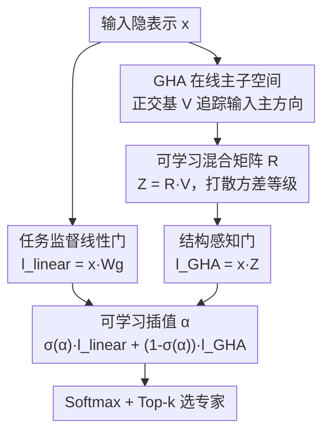

# STAR: Rethinking MoE Routing as Structure-Aware Subspace Learning

**会议**: ICML 2026  
**arXiv**: [2606.08814](https://arxiv.org/abs/2606.08814)  
**代码**: https://github.com/psmiz/STAR  
**领域**: LLM效率 / MoE路由  
**关键词**: 混合专家, 路由, 主子空间, 广义Hebbian算法, 专家特化

## 一句话总结
STAR 把 MoE 路由重新理解成一个"子空间学习"问题：在原本浅薄的线性路由器之外，用广义 Hebbian 算法（GHA）在线学一组追踪输入主方向的正交基，让路由决策直接对齐输入结构，从而在合成任务、LLaMA-MoE 预训练、BERT-GLUE 微调和 ViT ImageNet-C 上都拿到更稳的专家特化与更好的下游性能。

## 研究背景与动机
**领域现状**：MoE（Mixture-of-Experts）靠"把每个输入只发给少数专家"来在几乎不增加计算的前提下扩容。决定输入去哪个专家的就是路由器（gating network），而当下几乎所有主流 MoE（Switch、Mixtral、DeepSeek、Qwen 等）的路由器都只是一层**浅线性投影 + softmax/sigmoid**。

**现有痛点**：这种极简路由器表达力太弱，捕捉不了输入分布里的复杂变化，导致专家特化既不稳定也不均衡——有的专家被挤爆、有的专家从不被选（专家坍缩）。

**核心矛盾**：以往工作几乎都把"路由不均衡"当成唯一要治的病，加各种 load-balancing 正则（Switch 的负载均衡损失、GShard loss）或换 expert-choice 路由。但负载均衡只保证"专家被均匀用到"，并不保证"路由决策真的反映了输入的差异"。换句话说，整个领域忽略了一个正交的维度：**路由器到底有没有"看懂"输入的结构**。

**本文目标**：让路由器具备 data-aware 能力——能感知并响应输入里有意义的变化，从而促成稳定的输入-专家特化；同时这套东西要能和现有的均衡损失共存，而不是二选一。

**切入角度**：作者的观察是，输入隐表示的"主要变化方向"其实就是它的主子空间（top-K 主成分）。如果路由能显式地沿着这些主方向来分配专家，特化自然就稳了。问题是 PCA 需要显式算协方差、不适合流式训练。

**核心 idea**：用广义 Hebbian 算法（GHA）在线、增量地估计输入的 top-K 主子空间，把它做成一条"结构感知"的路由分支，再与原来的"任务监督"线性路由分支做可学习插值——也就是**把 MoE 路由当成主子空间学习来做**。

## 方法详解

### 整体框架
STAR 的输入输出和普通 MoE 一样：给一个隐表示 $x\in\mathbb{R}^d$，输出每个专家的路由分数 $s\in\mathbb{R}^K$，再 top-k 选专家。不同之处在于路由分数怎么算。STAR 同时维护**两条路由分支**：一条是原汁原味的任务监督线性门 $l_\text{linear}=xW_g^\top$（靠梯度学，但对输入结构无感）；另一条是结构感知门 $l_\text{GHA}=xZ^\top$，其中 $Z=RV$ 来自一组用 GHA 在线学到的主子空间基 $V$。两条分支用一个可学习系数 $\alpha$ 做逐元素插值后再 softmax。整套流程在每次前向时都顺手更新一下 GHA 基，所以子空间是"活的"、跟着隐表示分布演化。

### 关键设计

**1. GHA 在线主子空间：让路由器"看见"输入结构**

针对"线性路由器对输入结构无感"这个根痛点，STAR 引入一组正交基 $V\in\mathbb{R}^{K\times d}$ 来显式刻画输入的主结构。所谓主结构，正式定义为最小化重构误差的秩-K 主子空间 $S_K^*=\arg\min_{P^\top P=I}\mathbb{E}\|x-PP^\top x\|_2^2$，其列正好是输入协方差 $\Sigma_x=\mathbb{E}[xx^\top]$ 的 top-K 特征向量，也就是投影方差最大的那些方向。直接做 PCA 要算协方差、不适合 mini-batch 流式训练，所以 STAR 改用广义 Hebbian 算法（GHA）——它是 Oja 规则的推广，每次前向迭代 $m$ 步、对每个分量做

$$v_k \leftarrow v_k + \eta\, y_k\Big(x - \sum_{i=1}^{k} y_i v_i\Big),\quad y_k = v_k^\top x,$$

再归一化 $v_k\leftarrow v_k/\|v_k\|_2$。这条更新规则在让各分量保持正交的同时，把它们对齐到输入方差最大的方向，且**不用显式构造协方差矩阵**，天然适配在线/批量场景。作者实测 GHA 即便 $m=1$ 也能把 top-100 主成分的累计解释方差逼得很接近真 SVD，说明这个在线近似够用。这条结构感知分支产出 $l_\text{GHA}=xZ^\top$，让路由决策直接挂靠在输入的主方向上。

**2. 可学习混合矩阵 R：打散方差等级，避免专家坍缩**

光有 $V$ 还不够。如果直接拿 $V$ 当路由向量（即 $Z=RV$ 取 $R=I$），那每个路由向量恰好对应一个主成分，于是**专家会继承主成分的方差排序**：对齐到前几个大方差方向的专家会主导路由，对齐到低方差方向的专家几乎不被选，照样专家坍缩。STAR 用一个可学习的混合矩阵 $R\in\mathbb{R}^{K\times K}$ 把主方向重新线性组合成专家专属的路由向量 $Z=RV$，从而把"选哪个专家"和"主成分的方差大小"解耦，同时保持 $Z$ 仍扎根于 $V$ 张成的输入结构里。作者还给了理论刻画：定义每个专家的路由能量 $L_k=\mathbb{E}_x[\ell_k(x)^2]=r_k^\top\Lambda r_k=\sum_i\lambda_i r_{k,i}^2$，证明 $R=I$ 时 $\hat L_k=\hat\lambda_k$（能量直接等于第 k 个特征值，必然失衡），而随机正交 $R$ 时 $\mathbb{E}[\hat L_k]=\frac1K\sum_i\hat\lambda_i$（各专家能量在期望意义上被拉平）。实测可学习 $R$ 也能像随机正交 $R$ 一样把路由能量的变异系数（CV）压下来，避免 $R=I$ 那种极度偏斜的分布。

**3. 可学习插值 α 与可选的测试时更新：两条门各取所长**

两条门一条懂任务、一条懂结构，STAR 用逐元素的可学习系数 $\alpha\in\mathbb{R}^K$ 把它们融起来：

$$s = \mathrm{Softmax}\big(\sigma(\alpha)\odot l_\text{linear} + (1-\sigma(\alpha))\odot l_\text{GHA}\big),$$

其中 $\sigma(\cdot)$ 是 sigmoid。这样既保留了梯度信号对下游任务的优化能力，又显式注入了输入结构。有意思的是训练中作者跟踪 $\sigma(\alpha)$ 的均值，发现它一路单调下降——也就是模型会**越来越依赖 GHA 结构门**，反映了隐表示逐渐稳定后结构感知路由更可信。此外因为 GHA 是无监督在线更新的，STAR 还能在**测试时**继续更新子空间（TTA），不动任何任务参数就让路由适应输入分布漂移，用于 OOD 场景增强鲁棒性。

### 损失函数 / 训练策略
STAR 本身不额外引入路由损失，沿用标准 MoE 训练目标（合成任务用 next-token 预测）。只有在大规模 LLaMA-MoE 预训练这一个设定里，所有方法（含 STAR）才统一加上 Switch 的 load-balancing 辅助损失——这恰好证明 STAR 与显式均衡正则是**互补**的；其余所有实验 STAR 都不带均衡正则。大规模预训练里 GHA 迭代数取 $m=1$ 以省算力。

## 实验关键数据

### 主实验
在合成 HMM/GINC 序列建模任务上，STAR 在所有专家数 $K\in\{10,20,30,40\}$、所有 top-k 配置下测试损失都低于 Standard MoE，且专家越多差距越大——说明它随模型变大更稳。下面两表是真实大规模任务的核心结果。

| 任务 / 设定 | 指标 | Standard MoE | 最强基线 | STAR |
|------|------|------|----------|------|
| LLaMA-MoE 182M 预训练（7 任务零样本均值） | Acc | 40.65 | 40.13 (EC) | **41.31** |
| LLaMA-MoE 469M 预训练（7 任务零样本均值） | Acc | 42.69 | 43.29 (ReMoE) | **43.93** |
| BERT-GLUE 微调 (8,4)（5 子任务均值） | Acc | — | 81.77 (Cosine) | **82.24** |
| BERT-GLUE 微调 (16,4) | Acc | — | 81.69 (Cosine) | **82.11** |

在 ViT-S/32 的 ImageNet-C（15 种损坏、3 个严重级）上，STAR 也整体优于 Standard MoE，且开启测试时子空间更新（TTA）后在多数损坏类型上进一步提升，验证了结构感知路由对分布漂移的鲁棒性。

### 消融实验
基于 GLUE (8,4) 设定，逐一拆掉 STAR 的关键组件：

| 配置 | GLUE 均值 | 说明 |
|------|---------|------|
| STAR (8,4) 完整 | 82.24 | 双门 + 可学习 R + 插值 |
| No R | 81.23 | 去掉混合矩阵，路由继承方差等级 → 掉约 1 点 |
| No Interpolation | 81.60 | 不做 α 插值 → 掉约 0.6 点 |
| Random basis | 79.59 | 用随机基替代 GHA → MNLI 崩到 75.52、方差巨大 |

### 关键发现
- **混合矩阵 R 是稳的关键**：合成实验里 Standard MoE 在 $K=40$ 时互信息 $I(e,s)$ 从 0.74 崩到 0.24、负载熵 $H_\text{norm}$ 从 0.43 崩到 0.17（专家坍缩），而 STAR 的 $I(e,s)$ 一路升到 0.98、负载熵保持稳定。
- **GHA 基不可随便换**：用随机基替代在线学的 GHA 基，GLUE 上 MNLI 直接崩盘、整体掉 2.6 点，说明"基要真的追踪输入主方向"才有效。
- **α 会自发偏向结构门**：训练中 $\sigma(\alpha)$ 单调下降，模型越训越信任 GHA 结构感知路由。
- **专家越多越显优势**：性能差距随专家池增大而拉开，STAR 把"专家多了反而路由变差"的常见退化给压住了。

## 亮点与洞察
- **换了个问题视角**：把 MoE 路由从"加均衡正则的工程问题"重新表述成"主子空间学习"，区分出"负载均衡"和"输入结构感知"这两个正交维度——这是全文最让人"啊哈"的地方，也解释了为什么它能和均衡损失叠加用。
- **GHA 这块老工具用得巧**：用 1989 年的广义 Hebbian 算法做在线 PCA，免去显式协方差、$m=1$ 就够近似 SVD，几乎零额外成本地给路由器装上"结构传感器"。
- **可迁移的设计**：混合矩阵 $R$ "解耦方差等级"的思路可以推广到任何"想用主成分做选择但又怕被大方差方向主导"的场景（如检索、聚类的原型选择）；测试时无监督更新子空间也是即插即用的 OOD 适配 trick。

## 局限与展望
- **可学习 R 缺理论保证**：作者坦言可学习 $R$ 的动力学难以解析，只能靠经验（CV、能量分布）说明它不坍缩，没有像随机正交 $R$ 那样的闭式结论。
- **额外超参与开销**：GHA 迭代数 $m$、插值系数初始化、子空间维度 $K$ 都是新引入的旋钮；虽然 $m=1$ 够用，但每次前向都要跑 GHA 更新，超大规模下的实际吞吐影响文中未深入量化。
- **大模型尺度仍偏小**：真实验证最大到 469M active 参数、E=8 专家，离当下几十/上百专家的生产级 MoE 仍有距离，"专家越多越好"的结论需在更大专家池上验证。

## 相关工作与启发
- **vs 负载均衡类（Switch load-balancing / GShard / Expert-Choice）**：它们只管"专家被均匀用到"，STAR 管"路由是否反映输入结构"，两者正交且可叠加——预训练实验里 STAR 就是带着均衡损失一起用还更好。
- **vs Cosine Router / DynMoE**：Cosine Router 用归一化相似度提升稳定性、DynMoE 动态调专家数，都还是在"线性/相似度门"框架内打转；STAR 直接给路由器注入在线学到的主子空间，GLUE 上在各 $(K,k)$ 下都超过它们。
- **vs ReMoE**：ReMoE 改进路由形式与训练稳定性，STAR 则从"输入结构感知"这个不同轴切入，469M 尺度上零样本均值更高（43.93 vs 43.29）。

## 评分
- 新颖性: ⭐⭐⭐⭐⭐ 把 MoE 路由重述为主子空间学习、分离出"结构感知"这一被忽略的正交维度，视角新且有理论支撑。
- 实验充分度: ⭐⭐⭐⭐ 合成 + LLM 预训练 + BERT 微调 + ViT OOD 四类任务齐全，消融到位；但最大尺度偏小、专家数有限。
- 写作质量: ⭐⭐⭐⭐⭐ 动机层层递进，理论（路由能量 Lemma/Prop）与实证（互信息、负载熵）配合清晰。
- 价值: ⭐⭐⭐⭐ 几乎零成本、可与均衡损失共存的即插即用路由改进，对 MoE 社区有实用价值。

<!-- RELATED:START -->

## 相关论文

- [\[ICML 2026\] Variational Routing: 校准 MoE Transformer 的可扩展贝叶斯框架](variational_routing_a_scalable_bayesian_framework_for_calibrated_mixture-of-expe.md)
- [\[ICLR 2026\] Deep Hierarchical Learning with Nested Subspace Networks for Large Language Models](../../ICLR2026/llm_efficiency/deep_hierarchical_learning_with_nested_subspace_networks_for_large_language_mode.md)
- [\[ICLR 2026\] Expert Divergence Learning for MoE-based Language Models](../../ICLR2026/llm_efficiency/expert_divergence_learning_for_moe-based_language_models.md)
- [\[ACL 2026\] MTRouter: Cost-Aware Multi-Turn LLM Routing with History-Model Joint Embeddings](../../ACL2026/llm_efficiency/mtrouter_cost-aware_multi-turn_llm_routing_with_history-model_joint_embeddings.md)
- [\[ICML 2026\] DOT-MoE: 用可微 optimal transport 把 dense LLM 转成 MoE](dot-moe_differentiable_optimal_transport_for_moefication.md)

<!-- RELATED:END -->
