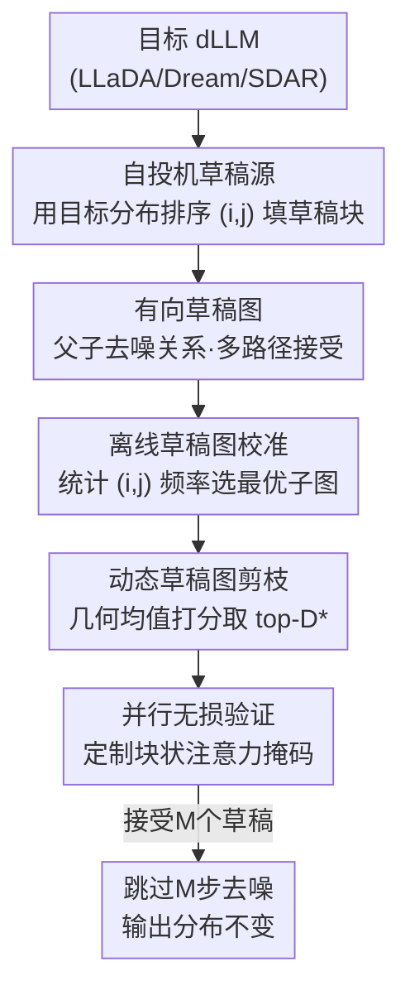

# Structuring The Future: Diffusion LLM Speculative Decoding via Calibrated Draft Graphs

**会议**: ICML2026  
**arXiv**: [2509.18085](https://arxiv.org/abs/2509.18085)  
**代码**: 待确认  
**领域**: LLM效率  
**关键词**: 扩散语言模型, 投机解码, 有向草稿图, 无损加速, 离线校准

## 一句话总结
Spiffy 把投机解码搬到扩散语言模型（dLLM）上：不另训草稿模型，直接用目标模型自己的分布"自投机"，并把多步去噪状态组织成一张**有向草稿图**，再用离线校准的图结构最大化接受率，在 LLaDA / Dream / SDAR 上实现最高 8.6× 的模型推理次数削减和 6.3× 的 token 速率提升，且可证明保持输出分布无损。

## 研究背景与动机
**领域现状**：扩散语言模型（dLLM，如 LLaDA、Dream、SDAR）是自回归 LLM 的新替代路线。它们不走严格的从左到右因果分解，而是对一整块 token 用双向注意力建模联合分布，理论上能并行解一整块，速度潜力远超自回归模型。

**现有痛点**：可惜开源 dLLM 为了保住生成质量，默认每次模型推理只揭开（unmask）一个 token，等于把"并行"的优势退化成了逐 token 串行，速度远没跑满。现有提速手段（KV 缓存、基于置信度阈值的动态 unmask）只能部分缓解，吞吐仍受限于去噪步数。

**核心矛盾**：自回归 LLM 那边早有投机解码（speculative decoding）这种又快又无损的利器，但它的前提是"因果分解 + 树状草稿"。dLLM 的分布**没有因果分解**，验证流程一旦照搬就不再无损；树状草稿也假设单向依赖，对双向注意力是浪费。直接迁移行不通。

**本文目标**：在 dLLM 上定义一套（1）无损、（2）不依赖独立草稿模型、（3）能利用双向特性的投机解码。

**切入角度**：作者的关键观察是——dLLM 的去噪过程本身就是"一步步揭开 token"，每一步的目标分布 $p_\theta(X_k(t-1)\mid X';X_k(t))$ 已经现成可用，与其去猜下一个 token，不如直接**猜整块在未来若干去噪时刻的状态**，一次模型调用跳过多步。

**核心 idea**：用目标模型自身分布构造草稿块（auto-speculation），把这些草稿块按"父→子"去噪关系组织成**有向草稿图**（而非树），让每个草稿状态有多条被接受的路径，并离线校准出最优图结构、推理时动态剪枝，从而在保持无损的前提下成倍跳过去噪步。

## 方法详解

### 整体框架
Spiffy 把 dLLM 的去噪改写成投机解码框架：投机的对象不是单个 token，而是**某个 block 在去噪时间轴上的状态**。设当前在解第 $k$ 个 block，它在时刻 $t$ 的状态记为 $X_k(t)$，序列其余部分记为 $X'$。一次迭代里，Spiffy 同时对真实状态算"下一时刻目标分布" $p_{\text{TD}}(t-1)$，并对若干**草稿块** $\hat{X}_k^m$ 算它们各自的草稿分布——这些都靠**一次**带定制注意力掩码的并行模型调用完成。然后用真实分布揭开 $S_{t-1}$ 个 token 得到 $X_k(t-1)$，凡是和它匹配的草稿块就被接受；因为被接受草稿块的草稿分布也已算好，可直接据此再往前跳一格、继续验证它的子节点。接受 $M$ 个草稿就把模型推理次数从 $T$ 降到 $T-M$。

整个 pipeline 是：离线先跑一次**校准**确定草稿图结构 → 推理时按图结构、用当前目标分布填充每个草稿块的 token → 按预算**剪枝**到更小的图 → 并行**验证**接受草稿状态、跳步前进。

### 关键设计

**1. 有向草稿图：用双向特性让一个草稿有多条被接受路径**

自回归投机用的是草稿**树**，因为单向依赖下每个草稿只有唯一的前驱路径。dLLM 是双向的——同一个"揭开了某几个位置"的块状态，可能从多个不同的前驱状态一步到达。Spiffy 据此定义父子关系：块 $A$（时刻 $t_a$）是块 $B$（时刻 $t_b$）的父，当且仅当 $t_b=t_a-1$、$|unmasked(A)|+S_{t_b}=|unmasked(B)|$ 且 $unmasked(A)\subset unmasked(B)$，即 $B$ 是从 $A$ 再揭开 $S_{t_b}$ 个 token 的合法下一步。把多级草稿块按这种关系连起来就成了一张**有向图**：每个节点可以有多个父节点、从而有**多条**通往被接受的路径。这正是相对自回归草稿树的独特红利——只要某条路径上的父被接受，它的子就有机会被一并接受，一次调用跳更多步。

**2. 自投机草稿源：不另训草稿模型，用 (i,j) 双秩从目标分布里取 token**

投机解码通常要一个独立的小草稿模型，又要训练又要部署。Spiffy 直接拿当前时刻的目标分布 $p_{\text{TD}}$ 来造草稿块，省掉草稿模型。具体地，对块内每个位置算 top-1 概率，按概率给位置排序得到**位置秩** $i$（哪个位置最该揭开）；对每个位置再按词表概率排序得到**词表秩** $j$（这个位置该填哪个词）。于是任一候选 token 可由 $(i,j)$ 唯一标定为 $c_{ij}$。一个草稿块就是"当前块状态 + 一组按 $(i,j)$ 选出的额外揭开 token"，且揭开数量等于跨越的去噪步数之和 $\sum_{t<t'\le t_m}S_{t'}$。把草稿写成 $(i,j)$ 公式而非具体 token，好处是结构可以离线固定、推理时再用当时的真实分布把 $(i,j)$ 翻译成实际 token——这让校准与推理解耦。

**3. 离线校准 + 动态剪枝：先选出高频图结构，再按几何均值打分裁到预算内**

位置有 $L$ 个、每个位置有 $V$ 个候选，可能的草稿状态爆炸，必须挑"最可能被接受"的。Spiffy 用一个离线校准算法（Algorithm 2）：在一小撮样本（MATH500 + MBPP 各 25 条）上跑原版 dLLM，回放其去噪轨迹、统计各种 $(i,j)$ 序列出现的**频率**，构造"全可能性图"，再选出累计频率最大的、大小为 $D$ 的连通子图作为草稿图 $G^*$。这一步每个模型只需做一次、单卡约 10 分钟，且把校准集换成通用文本（ShareGPT）效果相当。推理时，图有 $D$ 个节点但不必全用，Spiffy 用**几何均值**定义节点打分：节点局部分 $localScore(q_i)=\big(\prod_j p_{ij}\big)^{1/k}$，再几何均值地聚合其子节点得分 $childScore$，最终 $score=GM(localScore, childScore)$，按当前时刻分布取 top-$D^*$ 个节点（$D^*<D$）即可。用几何均值是为了尊重概率的乘性本质；实验里这个剪枝几乎不损接受率却显著省算力。论文默认 $D=10$、推理剪到 $D^*=3$。

**4. 无损验证：定制块状注意力掩码，并行验所有草稿**

要保证"加速但不改输出分布"。验证时把 $D$ 个草稿块都拼到序列上，用一个**块状 tree-attention 掩码**让真实序列照常自注意、每个草稿块只注意自己加上真实序列里除"它正在替代的原块"以外的所有块，从而一次前向并行算出真实分布与所有草稿分布。揭开真实 token 后与草稿逐一比对、匹配即接受，并用已算好的草稿分布递归验证其子节点（Algorithm 1）。论文证明该流程无损（附录 A.1）；对全序列双向的 LLaDA 用简化掩码可达近无损，而配合双缓存或对块状因果的 SDAR 则是严格无损。

### 损失函数 / 训练策略
Spiffy **不引入任何训练**：草稿来自目标模型自身分布，唯一的"离线开销"是上面的图校准（单卡约 10 分钟、一次性）。它正交叠加在已有的前缀 KV 缓存与阈值动态 unmask 之上，作为额外的加速层。

## 实验关键数据

### 主实验
在 LLaDA-8B-Instruct、Dream-7B-Instruct、SDAR-8B-Chat-b32 上，于 GSM8K / HumanEval / MATH500 / MBPP 评测。baseline 为"静态 unmask 每步一 token + 前缀 KV 缓存"；中间档加阈值（$\tau=0.9$）动态 unmask；Spiffy 再叠加其上。每格报告 **TPS 加速（NFE 削减），accuracy**。校准用 25+25 样本、$D=10$、推理剪到 $D^*=3$。

| 模型 / 任务 | Baseline (TPS, acc) | + 动态 unmask | + Spiffy | 准确率 |
|------|------|------|------|------|
| LLaDA / MBPP | 1.00×, 0.36 | 5.73× | **8.58× (NFE 5.23×)** | 0.36 不变 |
| LLaDA / GSM8K | 1.00×, 0.79 | 3.31× | **4.97×** | 0.79 不变 |
| SDAR / GSM8K | 1.00×, 0.90 | 6.71× | **8.25× (NFE 6.28×)** | 0.88 |
| SDAR / HumanEval | 1.00×, 0.68 | 5.54× | **6.96×** | 0.71 |
| Dream / HumanEval | 1.00×, 0.54 | 2.68× | **4.42×** | 0.55 |

跨任务跨模型，Spiffy 在动态 unmask 之上再叠加约 1.3–1.6× 的提升，NFE 最高削减 8.6×、TPS 最高 6.3×，且准确率与 baseline 基本持平（验证无损性）。

### 消融实验

| 配置 | 现象 | 说明 |
|------|------|------|
| 草稿块数 $D^*$ 变化（Fig.5） | $D^*$↑ → 接受多、NFE 降更多；$D^*$↓ → 算力省、接受少 | 剪枝预算可按系统需求在"接受率 vs 计算"间调档 |
| 几何均值剪枝 vs 全图 | 近乎完全恢复全图接受率，同时降低计算开销 | 证明 §4.4.4 打分指标有效 |
| 温度 0.0 → 升高（Fig.6） | 接受变难但 TPS 仍高于 baseline | 复用 0.0 校准的图就已稳健；重校准可进一步提升 |
| 校准集 MATH/MBPP → ShareGPT | 性能相当 | 校准对数据域不敏感（附录 D.3） |

### 关键发现
- **接受率—算力可调**：剪枝预算 $D^*$ 是一个干净的旋钮，直接在吞吐和计算开销之间权衡，部署时按硬件选档即可。
- **SDAR 收益最大**：块状因果结构让 Spiffy 拿到严格无损 + 高加速（GSM8K 8.25×），双向全序列的 LLaDA 在 MBPP 上也到 8.58×。
- **对温度鲁棒**：即便不重新校准，升温后仍快于 baseline，说明校准出的图结构捕捉的是较普适的揭开动态。

## 亮点与洞察
- **"图 > 树"是被双向性逼出来的红利**：自回归只能用树，是单向依赖的限制；dLLM 双向后，同一草稿状态天然有多个前驱，把树升级成有向图、让一个草稿多路径可达，是顺势而为的巧思。
- **把草稿写成 $(i,j)$ 公式**：用"位置秩 × 词表秩"而非具体 token 来定义草稿，使图结构能离线校准、推理时再实例化，干净地把"结构搜索"和"在线解码"解耦——这个抽象很可复用。
- **零训练的自投机**：直接借目标分布造草稿，免去草稿模型的训练/部署/对齐成本，落地门槛极低，且能正交叠在 KV 缓存、动态 unmask 之上。
- **几何均值贯穿打分**：剪枝分数全用几何均值聚合，尊重概率乘性，避免算术平均被个别高概率项带偏——细节虽小但和"序列联合概率"的语义一致。

## 局限与展望
- **校准用真实标签轨迹**：图结构靠在小样本上回放去噪轨迹统计得到，若部署分布与校准分布差异大，接受率可能下降（虽然温度/数据域实验显示有一定鲁棒性）。
- **近无损 vs 严格无损有条件**：对 LLaDA 这类全序列双向模型，简化掩码只是"近无损"，严格无损需要双缓存或块状因果结构（如 SDAR）；浮点精度损失的影响放在附录讨论。
- **加速仍受接受率上限约束**：TPS 提升小于 NFE 削减（如 LLaDA-MBPP 是 8.58× vs 5.23×），说明并行验证本身有开销，跳步收益不能完全转化为墙钟时间。
- **作者展望**：探索别的校准/剪枝指标，或把自投机换成辅助草稿模型；并指出随着未来 dLLM 所需去噪步数下降，Spiffy 的"按任意揭开率泛化"特性仍然适用。

## 相关工作与启发
- **vs 自回归投机解码（EAGLE / Medusa / SpecInfer 等）**：它们用树状草稿 + 因果验证；Spiffy 把场景换到 dLLM，必须重做无损验证、并用有向图替代树以吃下双向性红利。
- **vs dLLM 已有提速（阈值动态 unmask、KV 缓存、步蒸馏）**：那些是减少冗余计算或减步；Spiffy 是正交的投机层，叠加其上还能再快约 1.3–1.6×。
- **vs 同期 dLLM drafting/verification 工作（Hong et al., Gao et al. 2025）**：它们也做草稿—验证，但没有用**结构化的有向草稿图**与离线校准，这正是 Spiffy 提接受率的关键。
- **vs 图像扩散的投机（Wang et al., De Bortoli et al. 2025）**：连续值扩散上改造拒绝采样；Spiffy 处理的是离散文本的掩码扩散，机制不同。

## 评分
- 新颖性: ⭐⭐⭐⭐⭐ 首次把投机解码系统化迁移到 dLLM，并提出"有向草稿图 + 离线校准"这一专门吃双向特性的新结构
- 实验充分度: ⭐⭐⭐⭐ 覆盖三大 dLLM 家族 + 四个基准，含草稿数/温度/校准集消融，但加速主要在数学/代码任务上验证
- 写作质量: ⭐⭐⭐⭐ 形式化清晰、算法与图配套，符号略密
- 价值: ⭐⭐⭐⭐⭐ 零训练、可证无损、正交叠加，对 dLLM 推理加速有直接落地价值

<!-- RELATED:START -->

## 相关论文

- [\[ICML 2026\] Fast-dLLM++: Fréchet Profile Decoding for Faster Diffusion LLM Inference](fast-dllm_fréchet_profile_decoding_for_faster_diffusion_llm_inference.md)
- [\[ICLR 2026\] Bridging Draft Policy Misalignment: Group Tree Optimization for Speculative Decoding](../../ICLR2026/llm_efficiency/bridging_draft_policy_misalignment_group_tree_optimization_for_speculative_decod.md)
- [\[ACL 2025\] Accelerating Speculative Decoding via Efficient Context-Aware Draft Generation](../../ACL2025/llm_efficiency/accelerating_speculative_decoding_via_efficient_context-aware_draft_generation.md)
- [\[ACL 2025\] Tetris: Optimal Draft Token Selection for Batch Speculative Decoding](../../ACL2025/llm_efficiency/tetris_optimal_draft_token_selection_for_batch_speculative_decoding.md)
- [\[ICML 2026\] Diffusion Language Model Parallel Decoding via Product-of-Experts Bridge](diffusion_language_model_parallel_decoding_via_product-of-experts_bridge.md)

<!-- RELATED:END -->
