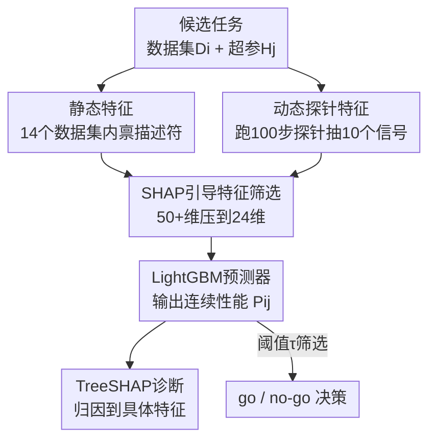

# TuneAhead: Predicting Fine-tuning Performance Before Full Training Begins

**会议**: ICML2026  
**arXiv**: [2606.17660](https://arxiv.org/abs/2606.17660)  
**代码**: 待确认  
**领域**: LLM效率 / 性能预测 / 数据中心AI  
**关键词**: 微调性能预测, 元特征, 探针, LightGBM, SHAP诊断

## 一句话总结
针对"微调跑完才知道翻车、白烧几百 GPU 小时"的痛点，TuneAhead 把每个候选微调任务编码成"静态数据集描述符 + 100 步探针动态特征"的元特征向量，用 LightGBM 在训练前就预测最终性能（370 个测试任务上 RMSE 1.47pp、95.1% 落在 ±3pp 内），并用 SHAP 给出"为什么会失败"的可诊断解释。

## 研究背景与动机

**领域现状**：微调 LLM 已是领域适配的标准路径，但它既贵又难预测——性能对数据质量和超参高度敏感，盲跑甚至可能让模型比 base 还差。实践者真正关心的往往不是"怎么微调"，而是"这个任务到底值不值得跑"。

**现有痛点**：现有预测手段都不够用。Scaling-law 分析只能给跨模型跨数据集的大趋势，对某个具体数据集没有指导意义；代理模型（COSMOS、ProxyLM）和短程外推（early-stop extrapolation）证明了低成本预测可行，但它们把所有特征压成一个**单一纠缠的分数**，把"base 模型自身的能力上限"和"数据集本身的性质"混在一起，实践者拿到一个数字却答不出"为什么会失败"，也就无法做针对性改进。

**核心矛盾**：完整微调 + 评测拿到真值分数 $R_{i,j}$ 太贵（一次完整 cycle 几百 GPU 小时），而便宜的代理预测又只给黑盒分数、没有可诊断性。要么准但贵、要么便宜但说不清原因。

**本文目标**：把"微调结果预测"形式化为一个**事前（pre-hoc）、可诊断**的元学习任务，支持三件实际的事——训练前做 go/no-go 决策、对数据集×超参组合排序分配资源、把预测溯源到具体数据/超参特征做诊断。

**切入角度**：作者的关键观察是"失败往往比成功更好预测"——失败的微调常留下清晰的低成本信号：数据-模型不匹配（参考困惑度高）、冗余/多样性不足（短程进展平或噪声大）、优化不稳（梯度抖、loss 衰减不规则）。单一强缺陷就能可靠预示失败，于是可以低成本提前 rule-out。

**核心 idea**：用两类互补的低成本特征——**静态数据集描述符**（模型无关的数据质量先验）+ **动态探针特征**（跑 100 步短探针，捕捉这个 base 模型对这份数据的可学习性）——喂给轻量 LightGBM 预测性能，再用 SHAP 把预测拆成各特征贡献，做到既准又能诊断。

## 方法详解

### 整体框架

TuneAhead 要解决的是：给定 base 模型 $M$、微调算法 $A$、数据集-超参对 $(D_i,H_j)$，在不真正跑完整微调的前提下，用一个低成本预测函数 $F$ 估计真值性能。形式化为：完整微调得 $M'_{i,j}=A(M,D_i,H_j)$ 并在下游 benchmark（如 MMLU）上评得真值 $R_{i,j}$；TuneAhead 学一个 $F$ 使 $P_{i,j}=F(V_{i,j})\approx R_{i,j}$，其中 $V_{i,j}$ 是描述该数据集-超参对的元特征向量，训练目标是 $\min_F \mathbb{E}_{(D_i,H_j)\sim\mathrm{Dist}}[\Delta(F(V_{i,j}),R_{i,j})]$（$\Delta$ 取 MSE）。预测是连续值，部署时可选地用阈值 $\tau$ 把它转成 go/no-go 决策（$P_{i,j}\ge\tau$ 才启动完整微调）。

整体分两阶段：Stage 1 元数据集构建（把每个任务编码成静态+动态特征的元向量），Stage 2 预测与诊断建模（LightGBM 回归 + TreeSHAP 归因）。

### 关键设计

**1. 静态+动态混合元特征：把"数据先验"和"模型可学习性"分开编码**

这是 TuneAhead 区别于黑盒代理的根基，直接针对"单一纠缠分数说不清原因"的痛点。静态特征是模型无关的数据集内禀描述符（14 个，分四类）：全局统计（数据集大小、token 长度均值/方差、输入输出长度比、特殊字符比）、词汇多样性（type-token ratio、N-gram 重复、解析树深度估计的指令复杂度）、语义多样性（MinHash 近似去重、嵌入离群比、IO 语义相似度等）、以及基于模型的复杂度（参考困惑度、与预训练语料的 KL 散度、answer groundedness）。动态特征则跑一个标准化 100 步探针、抽 10 个**交互特征**——它们不只反映数据，还反映这个 base 模型在这份数据+这组超参下的早期优化行为：loss 动态（初始 loss、对 log-loss 曲线拟合斜率得到的 loss 衰减、loss 方差 $\sigma_L^2=\frac{1}{T}\sum_{t=1}^T(L_t-\bar{L})^2$）、梯度信号（梯度范数均值/方差、梯度一致性、梯度稀疏度）、泛化线索（参数变化范数、扰动参数测的 landscape 平坦度）。两类特征互补：静态给"数据本身好不好"的先验，动态揭示静态分析看不见的"数据-模型不匹配 / 优化不稳"早期征兆。

**2. SHAP 引导的特征筛选：从 50+ 维压到 24 维且保证可解释**

特征不是随手选的。作者从 50+ 候选特征出发，在训练/验证集（绝不碰 held-out 测试集）上训一个初步 LightGBM，按三条标准剪枝：全局重要性（特征 $f$ 的平均绝对 SHAP 值 $s_f=\frac{1}{N}\sum_{i=1}^N|\phi_{i,f}|$，低于 15 分位的剪掉）、方向一致性（$c_f=\mathrm{sign}(\rho_f)\cdot\rho_f$，$\rho_f$ 是特征与目标的 Spearman 相关，$c_f<0.2$ 即方向不稳的剪掉，保证"loss 更低应当意味着更易优化"这类可解释方向）、冗余剪枝（迭代删高相关特征，除非删了让交叉验证 RMSE 恶化超过 $\Delta\mathrm{RMSE}>0.01$）。这一流程把池子收敛到 24 个最具判别力的特征（14 静态 + 10 动态），既保证轻量又保证每个保留特征都方向可解释——为后面的诊断打地基。

**3. LightGBM + TreeSHAP：可诊断的预测而非黑盒分数**

Stage 2 用 LightGBM 做回归器——它天生适合异构的表格型元特征，论文（附录 D）显示其精度与 SVR 等 SOTA 相当但可解释性和可扩展性更好，所以是有原则的选择而非随手拿来的 baseline。关键在于 LightGBM 无缝接 TreeSHAP：SHAP 把每个预测 $P_{i,j}$ 分解成各元特征的可加贡献，于是一个被预测为"失败"的任务能被溯源到具体原因——比如"词汇多样性低（静态特征）"或"梯度范数不稳（动态探针特征）"，直接指向"该清洗数据"还是"该调超参"的可执行改进。这正是它相比只给不透明总分的代理 baseline 的核心增量（满足设计目标 G3 可诊断性）。

### 损失函数 / 训练策略

预测器最小化 MSE，固定一套 LightGBM 配置跨实验（learning rate 0.05、num_leaves 4）。真值标签是完整 LoRA 微调后在 MMLU 测试集上 seed 平均（默认 3 个 seed）的准确率。所有特征筛选决策都在训练/验证集上完成，held-out 测试集只用于最终评测，避免信息泄露。

## 实验关键数据

### 主实验

在 Qwen2.5-7B-Instruct 上构建 1300+ 完整微调任务的元数据集，370 个 held-out 任务测试，预测 MMLU 准确率（误差单位均为百分点 pp）：

| 方法 | RMSE ↓ | $R^2$ ↑ | $r$ ↑ | Acc@1pp | Acc@2pp | Acc@3pp |
|------|--------|--------|------|---------|---------|---------|
| Early-Stop Extrapolation | 7.43 | 0.81 | 0.90 | 11.2 | 23.9 | 32.8 |
| Domain-Proxy Baseline | 6.58 | 0.85 | 0.92 | 8.6 | 22.0 | 32.8 |
| Early-Dynamics Baseline | 3.33 | 0.96 | 0.98 | 29.9 | 50.0 | 67.5 |
| ProxyLM | 2.11 | 0.98 | 0.99 | 40.7 | 67.9 | 85.8 |
| **TuneAhead (Full)** | **1.47** | **0.99** | **0.99** | **50.0** | **82.5** | **95.1** |

TuneAhead 相对最强 baseline ProxyLM 把 RMSE 再降 30%（2.11→1.47）、相对 Early-Stop 降 80%；Acc@3pp 达 95.1%（即 95% 的预测落在真值 ±3pp 内）。

### 消融实验

| 配置 | RMSE ↓ | Acc@3pp | 说明 |
|------|--------|---------|------|
| TuneAhead-Static-Only | 3.50 | 49.3 | 只用静态数据集特征 |
| TuneAhead-Dynamic-Only | 3.38 | 55.6 | 只用 100 步探针动态特征 |
| TuneAhead (Full) | 1.47 | 95.1 | 静态+动态，RMSE 比单源降 ~56-58% |

### 关键发现
- 静态与动态特征强互补：单用任一源 RMSE 都在 3.4-3.5 附近，合起来骤降到 1.47（比 dynamic-only -56%、static-only -58%），说明"数据先验"和"模型可学习性"缺一不可。
- 跨架构/规模可移植：换 Llama-3-8B（400 任务）得 $R^2{=}0.86$、Qwen2-0.5B（450 任务）得 $R^2{=}0.91$；作者谨慎地把这解读为"框架可移植"而非"零样本通用迁移"（小元数据集自然误差更大）。
- 跨 benchmark 不过拟合：把 1300+ checkpoint 重评到 TruthfulQA（MC2），同套特征与协议下 RMSE 2.17、$R^2{=}0.98$，仍优于 ProxyLM 等。
- 从预测到筛选有真金白银：阈值 $\tau{=}55\%$ 时净省 58.4% 算力、仍保留 94.5% 真正成功的任务；$\tau{=}60\%$ 省 67.4% 算力、保留 91.3% 成功任务——阈值越严越省但留住的成功任务越少。

## 亮点与洞察
- 最巧妙的是"失败比成功更好预测"这个洞察：不用精确建模成功路径，只要单一强缺陷信号（高困惑度 / 梯度抖）就能可靠 rule-out 失败，把一个难的回归问题变成了便宜的早期筛查。
- 把超参当成候选输入的一部分而非隐藏调优过程——元样本是 $(D_i,H_j)$ 对、从预定义 LoRA 搜索空间采，于是 TuneAhead 能直接给"数据×超参"组合排序，而不只是评数据。
- 可诊断性是真正的差异化：SHAP 把"预测失败"翻译成"因为词汇多样性低 / 梯度不稳"，给出可执行的数据清洗/调参方向，这套思路可迁移到任何"先验估算训练收益"的场景（如预训练数据配比筛选）。

## 局限与展望
- 预测器在每个目标设定内单独训练，跨模型的 Llama/Qwen2-0.5B 元数据集小、误差明显更高，作者明确说这只是"框架可移植"而非零样本迁移——换新 base 模型仍需重建元数据集。
- 真值固定为 MMLU/TruthfulQA 准确率，生成式任务（SAMSum 摘要只放在附录），对长文本、开放式生成的预测可靠性验证有限。
- 100 步探针仍有成本，且探针长度、LoRA 搜索空间这些设定本身是固定的，探针预算与预测精度的 trade-off 未系统扫。

## 相关工作与启发
- **vs ProxyLM / COSMOS**: 它们用代理小模型回归出单一纠缠分数，混了模型 bias 与数据性质、不可诊断；TuneAhead 显式分离静态数据特征与动态交互特征，且 SHAP 可溯源，精度也更高（RMSE 1.47 vs 2.11）。
- **vs Early-Stop Extrapolation / Early-Dynamics**: 它们只外推短程 loss 曲线，遇到现代 LLM 微调"非单调、晚发"的动态就失效；TuneAhead 用 24 维结构化特征而非单一曲线斜率，鲁棒得多（RMSE 1.47 vs 3.33-7.43）。
- **vs 数据质量评估（Data Cartography / Data Shapley）**: 它们在实例级打数据质量分但不预测"微调收益"；TuneAhead 把整个数据集当作一个元实例，把聚合描述符直接绑到下游性能上，填了"质量评估"与"性能预测"之间的缺口。

## 评分
- 新颖性: ⭐⭐⭐⭐ "事前可诊断预测"的 formulation 清晰，静态+动态互补与 SHAP 诊断是实在的增量
- 实验充分度: ⭐⭐⭐⭐⭐ 1300+ 任务、跨 3 个 base 模型、跨 MMLU/TruthfulQA/SAMSum，且有 go/no-go 阈值分析
- 写作质量: ⭐⭐⭐⭐ 动机与"失败更好预测"的洞察讲得透，特征工程有据可循
- 价值: ⭐⭐⭐⭐⭐ 直接省算力 + 给可执行诊断，对工程实践吸引力强

<!-- RELATED:START -->

## 相关论文

- [\[ICML 2026\] A Risk Decomposition Framework for Pre-Hoc Fine-Tuning Prediction](a_risk_decomposition_framework_for_pre-hoc_fine-tuning_prediction.md)
- [\[ACL 2026\] Small Data, Big Noise: Adversarial Training for Robust Parameter-Efficient Fine-Tuning](../../ACL2026/llm_efficiency/small_data_big_noise_adversarial_training_for_robust_parameter-efficient_fine-tu.md)
- [\[ICML 2026\] ReMoE: Boosting Expert Reuse through Router Fine-Tuning in Memory-Constrained MoE LLM Inference](remoe_boosting_expert_reuse_through_router_fine-tuning_in_memory-constrained_moe.md)
- [\[ICLR 2026\] TokenSeek: Memory Efficient Fine Tuning via Instance-Aware Token Selection](../../ICLR2026/llm_efficiency/tokenseek_memory_efficient_fine_tuning_via_instance-aware_token_selection.md)
- [\[NeurIPS 2025\] Hierarchical Balance Packing: Towards Efficient Supervised Fine-tuning for Long-Context LLM](../../NeurIPS2025/llm_efficiency/hierarchical_balance_packing_towards_efficient_supervised_fine-tuning_for_long-c.md)

<!-- RELATED:END -->
