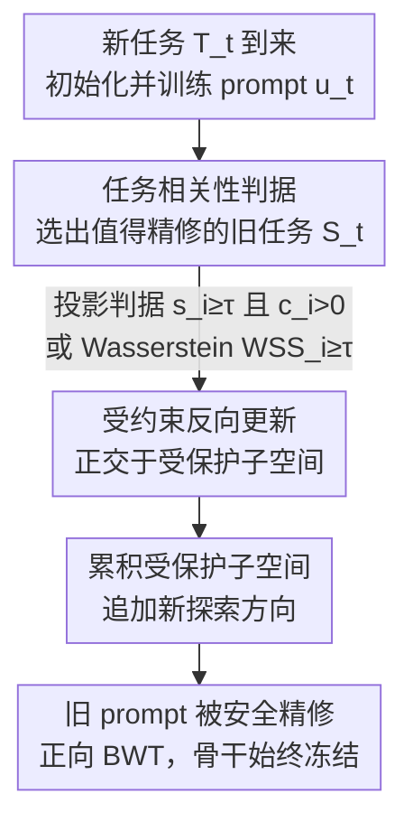

# Turning Back Without Forgetting: Selective Backward Refinement for Parameter-Efficient Continual Learning

**会议**: ICML 2026  
**arXiv**: [2606.01379](https://arxiv.org/abs/2606.01379)  
**代码**: https://github.com/OptMN-Lab/SABER-ICML-2026/  
**领域**: LLM效率 / 持续学习 / 提示微调  
**关键词**: 持续学习, 提示微调, 反向知识迁移, 梯度子空间, 无回放

## 一句话总结
SABER 在 prompt-based 持续学习里第一次实现了"无回放的正向反向迁移"——用梯度几何 + 损失分布两套相关性判据决定"该不该回头改旧任务的 prompt"，再把更新约束到不干扰旧任务的正交子空间里去"安全地改"，让后学的任务真正反过来提升先学任务的精度。

## 研究背景与动机
**领域现状**：在大模型上做持续学习（continual learning, CL），主流是参数高效微调（PEFT）：冻结骨干、只为每个任务学一小撮参数。其中 prompt-based 方法最轻——给每个任务学一段 soft prompt 拼到输入前，骨干完全不动，单任务参数量比 adapter/LoRA 还少，特别适合长任务序列。

**现有痛点**：这些方法靠"严格任务隔离"来防遗忘——一个任务的 prompt 学完就冻住，后面再来新任务也绝不动它。防遗忘是做到了，但代价是**后学的任务永远没法回头改进先学的任务**，哪怕两个任务高度相关、共享知识本可互相受益。也就是说，反向知识迁移（backward transfer, BWT）在 prompt-based CL 里几乎是被结构性地堵死了。

**核心矛盾**：能不能动旧 prompt 上存在一个两难。直接拿新任务的梯度去更新旧 prompt（无约束反向更新），论文用实验证明它**不可靠**：即便对语义相关的任务对，无约束更新也常常带来 0 甚至负的 BWT（如 Yelp←Amazon 掉 0.121），因为它会覆盖掉旧任务赖以生存的关键方向。

**本文目标**：拆成两个子问题——(1) **何时**该做反向精修（哪些旧任务和当前任务足够相关、值得回头改）；(2) **如何**安全地改（在不破坏旧任务关键方向的前提下注入新知识）。

**切入角度**：作者观察到反向精修不是"普遍有益"，而是强依赖于当前任务的学习信号是否与旧任务兼容。于是从 prompt 梯度几何与损失响应两个互补视角去刻画"任务兼容性"，并把更新限制在旧任务梯度子空间的**正交补**里。

**核心 idea**：用"选择性 + 受约束"取代"一刀切冻结"——只对相关任务、只沿不干扰方向去精修旧 prompt，从而在零回放下换来正向 BWT。

## 方法详解

### 整体框架
SABER（Selective bAckward refinement for positive Backward knowledge transfER）面对的是任务增量 CL：任务 $T_1,\dots,T_T$ 顺序到来，骨干 $f(\cdot;\theta)$ 冻结，每个任务 $T_t$ 学一段 soft prompt $u_t\in\mathbb{R}^{\ell\times d}$。整条流水线分三步走：先在已学任务上为每个 prompt 维护一个"受保护梯度子空间"；新任务 $T_t$ 来时，用相关性判据从历史 prompt 里**挑出**值得精修的子集 $S_t$；然后在训练 $u_t$ 的同时，对 $S_t$ 里的旧 prompt 做**正交约束**的反向更新，并把新探索到的方向追加进保护子空间，保证后续精修不再覆盖它。

### 关键设计

**1. 投影 + 对齐双判据：用梯度几何判"该不该回头改"**

第一个判据从"参数更新的几何"看任务兼容性，针对的痛点是"语义相似或任务标签都不能可靠判断该不该反向迁移"。对旧任务 $T_i$，收集其 prompt 梯度并取一组正交基 $U_i\in\mathbb{R}^{(\ell d)\times r}$（$r\ll \ell d$）张成它的梯度子空间。当前任务 $T_t$ 对旧 prompt $u_i$ 的梯度记为 $g_{t\to i}=\nabla_{u_i}\mathcal{L}_t(u_i)$，定义**投影分数**

$$s_i=\mathbb{E}\!\left[\frac{\lVert U_iU_i^\top g_{t\to i}\rVert_2}{\lVert g_{t\to i}\rVert_2}\right]\in[0,1],$$

它度量"当前任务的更新有多大比例落在旧任务的关键方向里"。但 $s_i$ 大只说明共享基多、不保证方向一致，于是再加一个**梯度对齐度** $c_i=\max\!\big(\frac{\langle \bar g_i,\bar g_{t\to i}\rangle}{\lVert\bar g_i\rVert_2\lVert\bar g_{t\to i}\rVert_2},0\big)$。只有 $s_i\ge\tau_s$ 且 $c_i>0$ 同时成立才判为正相关。这套几何判据精细、可控，适合"梯度信息可靠、想要更强安全保证"的场景。

**2. Wasserstein 损失分布判据：更轻量的响应级相关性**

存梯度子空间在任务多/prompt 维度大时内存开销不小，于是论文给出一个只用标量损失统计的互补判据，从"模型响应"层面判相关。对任务 $T_i$ 的某个 prompt $u_i$，把它作用在 $T_t$ 的各 batch 上得到经验损失分布 $\mathcal{P}_t^{(i)}=\{\ell(B_j;u_i)\}$。用 Wasserstein 距离 $W(\cdot,\cdot)$ 定义

$$\mathrm{WSS}_i=d_i^{(0)}-d_i^{(i)},\quad d_i^{(0)}=W\!\big(\mathcal{P}_i^{(0)},\mathcal{P}_t^{(0)}\big),\ d_i^{(i)}=W\!\big(\mathcal{P}_i^{(i)},\mathcal{P}_t^{(i)}\big).$$

直觉是：若 $T_i$ 学到的知识能迁移到 $T_t$，那把 prompt $u_i$ 同时套到两个任务上，应当让它们的损失响应**更接近**（相比冻结骨干基线）。所以 $\mathrm{WSS}_i>0$ 表示响应级相关。这个判据只需存标量损失统计，存储/维护成本远低于梯度子空间——以"粒度换效率"。两套判据各有所长，按部署约束二选一即可。

**3. 正交约束的反向更新 + 累积受保护子空间：安全地改不覆盖旧知识**

选出 $S_t$ 后的问题是"怎么改才不伤旧任务"。论文把旧任务梯度子空间 $U_i$ 当作**受保护子空间**，把当前任务梯度投影出与之对齐的分量，只保留正交补方向去更新：

$$\Delta u_i^{\text{orth}}=(I-U_iU_i^\top)\,g_{t\to i},\qquad u_i\leftarrow u_i-\eta\,\Delta u_i^{\text{orth}}.$$

论文对比了无约束、同子空间、混合三种替代方案（Table 4）：无约束更新噪声大、时好时坏（平均 ΔAcc +0.007），同子空间更新更糟（−0.007，证明动旧任务关键方向特别有害），混合也不稳定；唯有正交更新平均 ΔAcc 达 **+0.0215**，把"利用 prompt 空间未用容量、又少碰关键方向"做到了平衡。当一个旧 prompt 被多次精修时，论文维护**累积受保护子空间** $\tilde U_i^{(t)}$：每步只在 $\tilde U_i^{(t-1)}$ 之外取安全方向 $\Delta u_i^{(t)}=(I-\tilde U_i^{(t-1)}\tilde U_i^{(t-1)\top})\nabla_{u_i}\mathcal{L}_t(u_i)$，再把归一化后的新方向正交化追加进去。命题 4.1 保证每次精修都正交于"原始训练 + 此前所有精修"用过的方向（非干扰、不重用）；命题 4.2 进一步证明在 $L$-smooth 与 $\eta\le 1/L$ 下，$K$ 步安全精修使当前任务损失单调不增 $f(u^{(0)})-f(u^{(K)})\ge\frac{\eta}{2}\sum_k\lVert\Delta(u^{(k)})\rVert_2^2$，理论上既安全又有效。

### 损失函数 / 训练策略
每个任务 $T_t$ 先用标准梯度下降学好 $u_t$（骨干冻结，第一个任务退化为普通 prompt tuning）；待 $u_t$ 稳定后，再对 $S_t$ 里的旧 prompt 做几步安全精修。选择集为

$$S_t=\Big\{i\,\big|\,\text{C1: }s_i\ge\tau_s\wedge c_i>0\ \ \text{或}\ \ \text{C2: }\mathrm{WSS}_{t,i}\ge\tau_{\mathrm{WSS}}\Big\}.$$

全程用**固定全局阈值** $\tau_s=0.1$、$\tau_{\mathrm{WSS}}=0.2$，跨数据集/骨干都不需逐基准调参。整体优化目标是 $\min_{\{u_t\}\cup\{u_i\}_{i\in S_t}}\mathcal{L}_t(u_t)$，约束为 $\tilde U_i^{(t-1)\top}\Delta u_i^{(t)}=0,\ \forall i\in S_t$。SABER 是模块化的，可直接嵌入已有的冻结 prompt 池（FPP）与共享 prompt 增强（SPA）框架，对应 SABER-P（投影判据）与 SABER-L（损失分布判据）两个变体。

## 实验关键数据

### 主实验
在两个标准任务增量基准 Long Sequence 与 SuperNI（各 15 个任务、两种任务顺序）上，用 AP（平均性能）与 BWT（反向迁移）评测。下表为 LLaMA-2-7B 上 Order1 的代表性结果：

| 方法 | Long Seq. AP↑ | Long Seq. BWT↑ | SuperNI AP↑ | SuperNI BWT↑ |
|------|------|------|------|------|
| Replay | 60.32 | −19.54 | 37.48 | −21.47 |
| ProgPrompt | 78.98 | −0.18 | 40.65 | −0.26 |
| SHLPT | 79.40 | −0.27 | 44.97 | −0.45 |
| SAPT | 78.43 | −0.86 | 46.98 | −0.75 |
| **FPP + SABER-P** | **82.87** | **+1.56** | **48.65** | **+2.13** |
| SPA + SABER-P | 81.47 | +1.39 | 49.48 | +2.18 |

关键观察：所有对比方法的 BWT 都是负的（最好也只是接近 0），**SABER 是唯一稳定取得正向 BWT 的方法**，同时 AP 还更高。T5-Large 上结论一致（FPP+SABER-P 在 Long Seq. Order1 达 AP 80.46 / BWT +1.76，而 SAPT 为 78.14 / −0.45）。

### 消融实验

| 配置 | 平均 ΔAcc（pairwise BWT） | 说明 |
|------|------|------|
| 无约束更新 $\Delta u^{\text{unconstr}}$ | +0.007 | 噪声大、时正时负 |
| 同子空间 $\Delta u^{\text{same}}$ | −0.007 | 改关键方向，最差 |
| 混合 $\Delta u^{\text{hybrid}}$ | −0.002 | 不稳定 |
| **正交 $\Delta u^{\text{orth}}$（本文）** | **+0.0215** | 唯一稳定正迁移 |

### 关键发现
- **"同子空间"反而最糟**：均匀扰动旧任务关键方向会覆盖精调好的表示，比完全不约束还差，印证了"受保护子空间"设计的必要性。
- **选择性是前提**：Table 2/3 显示无约束反向更新对不相关任务对（如 WiC←MultiRC 掉 0.160）灾难性，对相关任务对（IMDb←Amazon 掉 0.044）也常无正收益——所以必须先用判据筛掉不兼容任务。
- **阈值鲁棒**：固定 $\tau_s=0.1$、$\tau_{\mathrm{WSS}}=0.2$ 跨数据集/骨干无需调参，工程上很省心。

## 亮点与洞察
- **把"反向迁移难"归因到几何层面**：不是"该不该动旧 prompt"的哲学之争，而是"沿哪些方向动"的几何问题——正交补里动是安全的，关键方向里动是有害的，一图说清。
- **两套判据的取舍很实用**：梯度几何判据精细可控但要存子空间，Wasserstein 损失判据只存标量、内存友好，给了部署侧"粒度 vs 效率"的明确旋钮。
- **理论 + 实证双闭环**：命题 4.1/4.2 证明了非干扰性与单调不增，且累积保护子空间机制让多轮精修不互相覆盖——这套正交投影思路可迁移到 adapter/LoRA 等其他 PEFT 模块的反向精修。
- **零回放**：在隐私/存储受限场景下，不存任何旧数据就能反向提升，是相对 replay 类方法的硬优势。

## 局限与展望
- **依赖梯度子空间的秩 $r$ 与采样质量**：投影判据需要可靠的梯度子空间，任务数据少或噪声大时 $U_i$ 估计可能不准，论文主要在分类/生成 NLP 任务上验证。
- **正交补容量会被逐步吃光**：累积保护子空间只增不减，长序列下"可用的正交方向"会越来越少，反向精修的空间可能枯竭，论文未深入讨论极长序列的退化。
- **任务边界已知假设**：方法建立在任务增量、任务边界清晰的设定上，对任务边界模糊或无任务标识（task-free）的场景如何选 $S_t$ 仍待探索。
- **改进思路**：可考虑对受保护子空间做"老化/遗忘"以释放容量，或把判据扩展到无任务标识的在线相关性估计。

## 相关工作与启发
- **vs ProgPrompt / CODA-Prompt（冻结隔离派）**：它们靠冻结旧 prompt 防遗忘，BWT 天花板是 0；SABER 允许"受控地动"旧 prompt，把 BWT 推到正区间，且 AP 不降反升。
- **vs wong2024learning（mask + replay 反向迁移）**：对方用梯度信号更新任务 mask 但**依赖回放数据**；SABER 完全无回放，且直接精修任务表示而非 mask。
- **vs li2026turning（causal-aware LoRA）**：对方用先验任务信号引导当前 adapter 更新，仍不直接精修已学表示；SABER 针对 prompt 把知识直接写回旧任务。
- **vs 梯度投影类 CL（如 OGD/GPM）**：传统梯度投影主要用任务相似度约束**前向**学习以防遗忘；SABER 反其道把相似度用于**选择性反向精修**，目标是提升而非仅保护旧任务。

## 评分
- 新颖性: ⭐⭐⭐⭐⭐ 第一个在 prompt-based CL 里做到无回放正向反向迁移，问题切入点清晰
- 实验充分度: ⭐⭐⭐⭐ T5/LLaMA/Qwen 多骨干 + 两基准两顺序，唯一稳定正 BWT；极长序列退化未测
- 写作质量: ⭐⭐⭐⭐⭐ 动机—判据—约束—理论层层递进，Table 2/3/4 把"为什么这么设计"讲得很透
- 价值: ⭐⭐⭐⭐ 正交精修 + 累积保护子空间的范式可迁移到其他 PEFT 反向迁移场景

<!-- RELATED:START -->

## 相关论文

- [\[ICLR 2026\] One-Prompt Strikes Back: Sparse Mixture of Experts for Prompt-based Continual Learning](../../ICLR2026/llm_efficiency/one-prompt_strikes_back_sparse_mixture_of_experts_for_prompt-based_continual_lea.md)
- [\[ACL 2026\] Small Data, Big Noise: Adversarial Training for Robust Parameter-Efficient Fine-Tuning](../../ACL2026/llm_efficiency/small_data_big_noise_adversarial_training_for_robust_parameter-efficient_fine-tu.md)
- [\[AAAI 2026\] Resource Efficient Sleep Staging via Multi-Level Masking and Prompt Learning](../../AAAI2026/llm_efficiency/resource_efficient_sleep_staging_via_multi-level_masking_and_prompt_learning.md)
- [\[ICML 2026\] Skip a Layer or Loop It? Learning Program-of-Layers in LLMs](skip_a_layer_or_loop_it_learning_program-of-layers_in_llms.md)
- [\[ICML 2026\] STAR: Rethinking MoE Routing as Structure-Aware Subspace Learning](star_rethinking_moe_routing_as_structure-aware_subspace_learning.md)

<!-- RELATED:END -->
