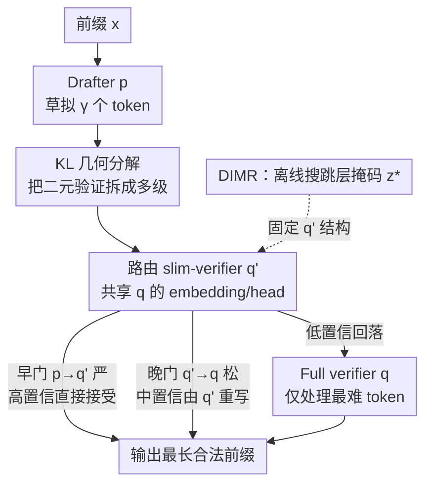

# VIA-SD: Verification via Intra-Model Routing for Speculative Decoding

**会议**: ICML 2026  
**arXiv**: [2606.12243](https://arxiv.org/abs/2606.12243)  
**代码**: https://zju-xyc.github.io/VIA-SD-Project-Page/ (项目页)  
**领域**: LLM效率 / 投机解码  
**关键词**: 投机解码, 层级验证, 模型内路由, KL 几何, 推理加速  

## 一句话总结
针对投机解码"要么接受、要么用大模型重算"的二元决策瓶颈，VIA-SD 从大验证器内部路由出一个轻量的 slim-verifier 来处理那些"中等置信度"的 token，构成 draft → slim-verifier → full-verifier 的多级验证流程，在四类任务、多个模型族上把拒绝率压低 0.10–0.22，相对强投机解码基线再提速 10–20%。

## 研究背景与动机
**领域现状**：投机解码（speculative decoding, SD）是当前降低 LLM 推理延迟的主流系统级手段——用一个轻量 drafter 一次性草拟 $\gamma$ 个候选 token，再让大验证器并行验证，接受的整块一起吐出，省下大模型逐 token 前向的开销。绝大多数后续工作要么强化 drafter（让草稿更准），要么加速 verifier。

**现有痛点**：无论怎么改，主流 SD 都困在同一条**二元分配规则**里——每个草稿 token 要么被小模型直接接受，要么被拒绝、然后交给最大的验证器从头重算。即便是并发的层级 SD（如 Syu & Lee, 2025）也只是用中间模型做二元判断。但作者观察到，实际生成中大量 token 落在一个"中间地带"：drafter 已经很接近正确，却又不完全可靠，这类 token 根本不需要动用最大模型的全部算力，却被迫走最贵的那条路。

**核心矛盾**：从信息论看，SD 的加速潜力由 drafter 分布 $p_t$ 与 verifier 分布 $q_t$ 的对齐程度决定。无损情形下单步拒绝率恰好等于二者的全变差距离 $\rho_t = D_{TV}(p_t, q_t)$。而 TV 距离的"硬等价"意味着：要降拒绝率，只能去改 drafter 或 verifier 本身——它**根本看不到中间地带的存在**，于是中间地带的 token 只能由 full verifier 兜底。

**本文目标**：能不能在不拉大 $p$ 与 $q$ 分布差距的前提下，引入一串"中间验证阶段"来专门消化这些中间地带的 token？

**切入角度**：把 TV 距离换成 KL 散度。KL 是**方向性且可加**的，天然支持"分段分解"——一条 $p \to u_1 \to \dots \to u_n \to q$ 的多级路径，累计散度可以比 $p \to q$ 的直达映射更小（信息几何里的广义勾股定理）。这说明中间分布不是拍脑袋的启发式，而是有理论依据的"验证锚点"。

**核心 idea**：用一个从大验证器**内部路由**出来的 slim-verifier 充当中间分布，把投机解码从"二元 accept/reject"重写成"逐级把生成责任交给越来越强的验证器"的多级验证。

## 方法详解

### 整体框架
VIA-SD 在标准 draft–verify 之间插入一层 slim-verifier，构成三级流水线。给定前缀 $x_{<t}$，每个解码周期：drafter $p$ 先草拟一块 $\gamma$ 个 token；接着用一个**离线一次性搜出、推理期固定**的 slim-verifier $q'$（从 full verifier $q$ 路由而来）做第一道并行验证；草稿块用两个置信度阈值 $(\delta_1, \delta_2)$ 把关——早门 $p \to q'$ 更严、晚门 $q' \to q$ 更松（实践中 $\delta_1 \gg \delta_2$）；接受最长的合法前缀，若有 token 被拒，就由 $q'$ 自己重写该 token，只有最难的情形才回落到 full verifier $q$。这样一来，原本必须由 $q$ 兜底的中间地带 token 大量被 $q'$ 消化，大模型调用频率显著下降。

关键之处在于 $q'$ 的来源：它不是另外加载的独立模型，而是 $q$ 跳过若干 Transformer 层得到的子模型，**共享 $q$ 的 embedding 和输出头**——这保证了它与 $q$ 的分布一致性，也是它比"同等大小的独立中间模型"更有效的根本原因。

### 关键设计

**1. KL 几何分解：把"二选一"重写成多级验证**

这一设计直接针对 TV 距离的硬约束——既然 $\rho_t = D_{TV}(p_t, q_t)$ 把降拒绝率锁死在"改 $p$ 或改 $q$"上，作者改用 KL 散度 $D_{KL}(p\|q) = \sum_v p(v)\log\frac{p(v)}{q(v)}$。KL 是方向性、可加的，因此可以沿一串通过信息投影定义的中间分布 $u_i = \arg\min_{u\in S} D_{KL}(u_{i-1}\|u)$ 做分段分解。由信息几何的广义勾股定理：

$$D_{KL}(p \| q) \ge \sum_{i=0}^{n} D_{KL}(u_i \| u_{i+1}), \quad u_0 = p,\ u_{n+1} = q$$

即一条多级路径 $p \to u_1 \to \dots \to q$ 的累计散度可低于直达 $p\to q$。为了让这套理论落地，作者进一步定义混合目标分布 $\pi_t(v) = (1-\delta)p_t(v) + \delta q_t(v)$ 构成全局 $\Pi$ 空间，并给出判据：插入中间验证器 $u$ 是否划算，取决于 $\Delta_{KL}^{\alpha,\beta}(u\mid\pi) = C_{KL}^{\alpha,\beta}(q\|p) - C_{KL}^{\alpha,\beta}(u\|p) - C_{KL}^{\alpha,\beta}(q\|u)$ 是否为正——为正则路由路径严格更优，为负则该 $u$ 应被丢弃。这把"要不要加中间级、加几级"从直觉变成了可计算的成本判据；经验上收益并非随级数单调，三级（一个中间验证器）始终给出最佳折中。

**2. 路由 slim-verifier：从大模型内部抠出中间验证器**

候选的中间验证器有三种：放大版 drafter $p'$、同族的独立小模型、或从 $q$ 路由出的子模型 $q'$。VIA-SD 选第三种，核心理由是**分布一致性**。$q'$ 虽然参数量与独立中间模型相当，但它共享 $q$ 的 embedding 和输出头，因此把 $u = q'$ 代入成本时，$C_{KL}^{\alpha,\beta}(q\|q')$ 始终小于同等大小独立模型的对应成本，于是路由路径 $p \to q' \to q$ 更容易满足 $\Delta_{KL}^{\alpha,\beta}(u\mid\pi) > 0$，从而拒绝率更低。

具体地，把 $q$ 的 $L$ 层用路由掩码 $z\in\{0,1\}^L$ 表示（$z_\ell=1$ 保留第 $\ell$ 层、$=0$ 跳过），slim-verifier 即 $q'_z(x) = \Pi_z(q)(x)$。验证用的 KL 式单步成本由 ReLU 形式的对数边际违反给出（可从 logits 直接算）：

$$R_{KL}^{\alpha,\beta}(q\|p)_t = \sum_v p_t(v)\,\mathrm{ReLU}(z_1(v)) + \sum_v q_t(v)\,\mathrm{ReLU}(z_2(v))$$

其中 $z_1, z_2$ 分别对应接受阈值项和残差替换项的对数边际。这套设计让中间验证器**零额外加载**——不增大显存峰值，却能调节跳层比例换取加速/精度的可控权衡。

**3. DIMR：离线搜一个稳定的跳层掩码**

随便跳层并不行——消融显示随机跳层既掉精度又几乎不提速，说明中间验证器必须"精挑"。DIMR（Dynamic Intra-Model Routing）为每个模型对**离线搜一次**最优掩码：在长度 $\tau$ 的上下文窗口上累计 KL 式成本给每个候选掩码打分，$z^* = \arg\min_z \sum_{t=1}^{\tau} R_{KL}^{\alpha,\beta}(q\|q'_z)_t$。搜索策略是随机搜索 + 周期性贝叶斯优化的组合：

$$z = \begin{cases} \mathrm{BayesOpt}(l), & \text{若 } o \bmod \theta = 0 \\ \mathrm{RandomSearch}(l), & \text{否则}\end{cases}$$

贝叶斯优化把已评估的 (掩码, 成本) 对当作观测、提名有潜力的离散掩码，中间穿插的随机搜索维持对组合掩码空间的探索、避免过早收敛到局部层模式。搜到的 $q'$ 结构一旦固定就在整个推理期复用，**不在推理时再搜**。这把成本一次性地隔离在离线阶段：实测各模型对仅需 18–68 分钟、0.30–1.13 GPU-小时，且可跨下游任务复用，因此主表里报告的提速是纯在线解码加速，而非摊薄的端到端加速。

### 一个完整示例
以 Gemma2-2B→27B 在 WebQuestions 上为例（45% 跳层、$(\alpha_1,\alpha_2)=(0.5,0.3)$）：drafter 2B 草拟一块 token，先过 DIMR 路由出的 slim-verifier $q'$（约相当于 27B 跳掉 45% 层）。高置信 token 在严门 $p\to q'$ 处直接通过；中等置信 token 被 $q'$ 在松门处重写——这部分原本要 27B 兜底，现在被 $q'$ 消化；只有真正不确定的 token 才回落到完整 27B。最终拒绝率从二元 SD 的 0.27 降到 0.14，速度从 1.55× 提到 2.32×，而精度（0.32）几乎不变。

## 实验关键数据

### 主实验
在 WebQuestions / NaturalQA / TriviaQA 上，跨 Gemma2、LLaMA2、Qwen 多个模型对，VIA-SD 在精度持平的前提下把拒绝率压到最低、速度最高（节选 Gemma2-2B→27B）：

| 方法 | WebQ 拒绝率 | WebQ 速度 | NatQA 拒绝率 | NatQA 速度 | TriviaQA 拒绝率 | TriviaQA 速度 |
|------|------------|-----------|-------------|-----------|----------------|--------------|
| Speculative Decoding | 0.27 | 1.55× | 0.45 | 1.54× | 0.24 | 1.65× |
| Cascade SD | 0.24 | 1.71× | 0.42 | 1.73× | 0.23 | 1.81× |
| Faster Cascades | 0.22 | 1.81× | 0.40 | 2.10× | 0.20 | 2.30× |
| **VIA-SD (ours)** | **0.14** | **2.32×** | **0.30** | **2.61×** | **0.15** | **2.50×** |

整体上 VIA-SD 把拒绝率较强基线再降 0.10–0.22，提速 10–20%，相对无草稿解码达 2.5–3× 加速。Table 1 还显示验证级数并非越多越好：2/3/4/5 级里**三级**始终是最佳折中（如 2B→27B 的 TriviaQA 三级 2.50×、四级反而掉到 2.10×、五级跌破 1×）。

### 消融实验

| 配置 | 额外模型 | 显存峰值 | 速度 | 精度 |
|------|---------|---------|------|------|
| Two-layer SD（二元基线） | ✘ | 1.00× | 1.55× | 0.32 |
| 独立 13B 中间模型 | ✔ | 1.38× | 2.08× | 0.33 |
| 随机跳层 | ✘ | 1.04× | 1.62× | 0.29 |
| **DIMR 路由（ours）** | ✘ | **1.04×** | **2.32×** | 0.32 |

### 关键发现
- **中间验证器的"来源"是胜负手**：独立 13B 虽也能提速到 2.08×，但要多加载一个模型、显存涨到 1.38×；随机跳层零额外显存却几乎不提速且掉精度；只有 DIMR 路由在 1.04× 显存下做到 2.32× 且不掉精度——印证"中间验证器必须精挑、且要与 $q$ 分布一致"。
- **跳层比例有甜区**：跳得越多越快，但跳过头会让 slim-verifier 太弱、触发更多回落，速度反降；默认 45% 跳层在 Gemma2 上给出最佳平均速度。
- **阈值鲁棒**：默认 $(\alpha_1,\alpha_2)=(0.5,0.3)$ 优于保守 $(0.4,0.2)$ 和激进 $(0.6,0.4)$，方法对阈值不敏感。
- **任务差异**：解码器-only 的生成里"中间地带"token 更多，因此大间隔设置（2B→27B、7B→70B）收益最大；翻译（WMT14）这类低置信 token 集中的任务，slim-verifier 尤其擅长在调用大模型前先过滤掉它们。

## 亮点与洞察
- **把"加几级中间验证"从直觉变成可计算判据**：$\Delta_{KL}^{\alpha,\beta}(u\mid\pi)$ 的正负直接告诉你某个中间验证器值不值得插入，这比"试出来三级最好"更有指导性。
- **slim-verifier 复用大模型自身**：共享 embedding/head 带来的分布一致性，是它压过"同等大小独立模型"的关键——这点很反直觉但被消融坐实，可迁移到任何"需要中间能力档位"的级联系统。
- **离线/在线成本分离干净**：DIMR 一次性搜、推理期固定，让主表提速是真实在线加速；且对已有 SD 框架免改训练即可叠加，工程友好。

## 局限与展望
- **DIMR 是离线一次性搜的固定掩码**：对每个模型对都要重搜（虽便宜），且掩码在推理期不随上下文自适应——理论上 token 难度分布会漂移，固定 slim-verifier 未必处处最优。
- **跳层 slim-verifier 的能力上限受限于"哪些层可跳"**：对层间冗余低的模型，可压缩空间有限，收益可能缩水。
- **三级是经验最优**：理论允许任意级数，但作者只实例化到一个中间验证器；更深层级在何种分布下才划算仍未充分刻画（仅给出 $\Delta_{KL}$ 判据与有限实验）。
- 阈值 $(\alpha_1,\alpha_2)$ 与跳层比例需按模型对调，虽鲁棒但仍是需要调的超参。

## 相关工作与启发
- **vs 传统两级 SD（Leviathan 2023 等）**：他们守着二元 accept/reject，本文加一层 slim-verifier 专吃中间地带 token，区别在于把"生成责任"分级下放而非一刀切，优势是同精度下更低拒绝率。
- **vs Cascade SD / Faster Cascades**：同属级联思路，但它们的中间环节多依赖独立模型或学到的延迟策略，本文用 intra-model 路由保证分布一致性，从而在相同显存下提速更多。
- **vs EAGLE / PEARL 这类学习式验证**：那些方法靠额外训练强化 draft–verify 交互、加深 drafter–verifier 耦合；VIA-SD 走 verification 侧、免改训练、保持 drafter 与 verifier 模块解耦。

## 评分
- 新颖性: ⭐⭐⭐⭐⭐ 把投机解码从二元决策重写为 KL 几何驱动的多级验证，intra-model 路由的中间验证器思路新颖且有理论支撑。
- 实验充分度: ⭐⭐⭐⭐ 覆盖 4 类任务、多模型族、级数/跳层/阈值/搜索策略消融齐全，但多为推理加速指标、缺训练成本之外的端到端长文本压力测试。
- 写作质量: ⭐⭐⭐⭐ 理论铺陈完整，但 KL 几何那段公式密集、对读者门槛较高。
- 价值: ⭐⭐⭐⭐⭐ 免改训练即可叠加到现有 SD、显存几乎不增、一次离线搜可复用，落地性强。

<!-- RELATED:START -->

## 相关论文

- [\[ACL 2026\] Speculative Verification: Exploiting Information Gain to Refine Speculative Decoding](../../ACL2026/llm_efficiency/speculative_verification_exploiting_information_gain_to_refine_speculative_decod.md)
- [\[NeurIPS 2025\] 3-Model Speculative Decoding (PyramidSD)](../../NeurIPS2025/llm_efficiency/3model_speculative_decoding.md)
- [\[ACL 2026\] TokenTiming: A Dynamic Alignment Method for Universal Speculative Decoding Model Pairs](../../ACL2026/llm_efficiency/tokentiming_a_dynamic_alignment_method_for_universal_speculative_decoding_model_.md)
- [\[ICML 2026\] MineDraft: A Framework for Batch Parallel Speculative Decoding](minedraft_a_framework_for_batch_parallel_speculative_decoding.md)
- [\[ICML 2026\] Diffusion Language Model Parallel Decoding via Product-of-Experts Bridge](diffusion_language_model_parallel_decoding_via_product-of-experts_bridge.md)

<!-- RELATED:END -->
