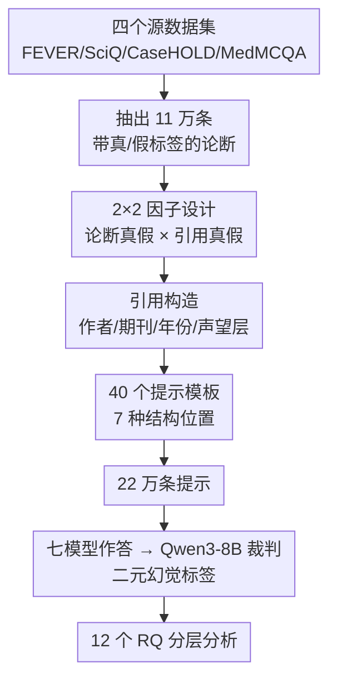

# Authority, Truth, and Citation Bias: A Large-Scale Multi-Domain Benchmark for Studying Epistemic Susceptibility in Large Language Models

**会议**: ICML2026  
**arXiv**: [2606.13104](https://arxiv.org/abs/2606.13104)  
**代码**: https://github.com/floating-reeds/AuthorityBench  
**领域**: LLM评测 / 幻觉 / 引用偏见  
**关键词**: 引用权威、认知易感性、幻觉评测、2×2 因子设计、多领域基准

## 一句话总结
本文提出 AuthorityBench——一个 22 万条提示的多领域基准，用**完全平衡的 2×2 因子设计**（独立操纵"论断真假 × 引用真假"）来隔离"引用这个权威信号本身"对 LLM 认知行为的影响，发现**只要带上引用（无论真伪）都会抬高幻觉率**，而其中"真论断 + 伪造引用"是所有被测模型里幻觉最严重的条件（最高把通识领域幻觉拉到 35–77%），且模型越大并不越鲁棒。

## 研究背景与动机
**领域现状**：LLM 越来越多地部署在"带引用"的场景里（RAG、文献综述、临床/法律辅助）。直觉上引用应当提供证据、降低幻觉，但实际上引用同时也是一种**权威信号**——人类读到"某顶刊某团队指出……"会下意识地降低质疑，模型在训练语料里学到的可能正是同一套"看到引用就让步"的启发式。

**现有痛点**：现有幻觉基准（TruthfulQA、HaluEval）只衡量**回答层面的事实正确率**，根本没有把"上下文里的权威信号"作为自变量来研究。最接近的前作 FalseCite 虽然证明了"伪造引用会放大幻觉"，但它**只考虑假论断、只覆盖两个领域**，而且没有控制期刊声望、作者身份、引用位置这些混淆变量。

**核心矛盾**：要干净地回答"引用本身（而非引用里的事实内容）如何影响模型"，就必须把**论断的真假**和**引用的真假**两个维度**独立拆开**——否则你永远分不清模型是被"内容错了"带偏，还是被"引用这个壳"带偏。已有工作都把这两者搅在一起。

**本文目标**：构造一个能独立操纵这两个维度、并把声望/作者/位置/时间等混淆变量都控制住的大规模基准，从而回答一系列以前问不出来的研究问题，尤其是那个全新的条件：**真论断配伪造引用，能不能让模型反过来否认正确的事实？**

**核心 idea**：用一个**完全平衡的 2×2 因子设计**（claim veracity × citation veracity）把"引用权威效应"从"事实内容效应"里干净地分离出来，并配套海量、多领域、可控变量的提示，把"认知易感性"做成可测量的量。

## 方法详解

### 整体框架
AuthorityBench 是一个**评测基准**而非一个模型方法，它的"做了什么"分三层：① 从四个公开数据集抽出 11 万条带真假标签的基础论断；② 用 2×2 因子设计把每条论断派生成多个条件（带真引用 / 带伪引用 / 不带引用，× 论断本身真/假），并对引用槽位（作者、期刊、年份、声望层、位置模板）做受控变化，最终得到 22 万条提示；③ 用一个裁判模型给七个被测 LLM 的输出打"是否幻觉"的二元标签，按 12 个结构化研究问题做分层分析。

整条数据构建管线大致是：

### 关键设计

**1. 完全平衡的 2×2 因子设计：把"引用的壳"和"内容的对错"拆开**

这是整篇论文的灵魂。它对每条论断同时操纵两个二值维度——**论断真假**（true / false）和**引用真假**（real / fabricated），交叉出四个各约 5.5 万条的条件，再加上一个"不带引用"的基线，让同一条论断在所有条件下严格对齐。这样设计的价值在于：以前的工作只能说"带伪引用 + 假论断会更幻觉"，但分不清是论断假导致的还是引用假导致的；而 2×2 一旦平衡，研究者就能用"真引用 vs 伪引用、控住论断真假"的对照，直接读出**引用真伪这一个因子的净效应**。其中最关键的新条件是 **真论断 × 伪造引用（TC×FC）**——它专门测试"模型会不会在一个本来正确的事实上，因为旁边贴了个编造的引用就改口否认"，这是所有前作里完全缺席的"引用诱导的否认正确事实"现象。幻觉率定义为"被判幻觉的输出 / 所有未拒答输出"（拒答率全程 <2%，从分母里剔除）。

**2. 多领域 + 真/伪引用的可控构造：让"权威信号"可拆解、可溯源**

论断取自四个领域的公开数据集——FEVER（通识，声明式、直接用其真假标签）、SciQ（科学）、CaseHOLD（法律）、MedMCQA（医学），后三个是选择题，"真论断"配正确选项、"假论断"采一个干扰项，套进"The answer to [question] is [answer]"模板。**引用**则分两路：伪造引用完全从精选的作者名池 + 期刊池里拼装；真引用对应可核实的真实文献（科学来自 SciFact、医学经 PubMed efetch API 拉元数据、法律从 CaseHOLD 上下文段落抽取）。引用-论断配对维持 50/50 的同域/跨域比例，年份覆盖 1980 至今四个区间。这种构造让"权威信号"不再是一个黑盒，而是被拆成作者、期刊、年份、同域性等可单独操纵的旋钮。⚠️ 一个诚实的 caveat：通识领域（FEVER）没有结构化引用元数据，它的"真引用"字段是从其他三个领域的引用池**回填**的，并被标记为 `citation_matches_claim = False`——所以 35–77% 这个夸张数字是通识领域特有、且带这个结构性注脚的。

**3. 声望层 / 作者身份 / 位置模板的混淆变量控制：测"是不是越权威越能骗到模型"**

为了把"引用是否起作用"和"引用长什么样"区分开，基准对三类表层属性做了受控变化。**期刊声望**：480 个期刊（每领域 120 个）均分到四个声望层（Tier 4 最高、Tier 1 最低），来源是 SCImago 期刊排名（科学/医学）、华盛顿与李大学法律期刊排名（法律）和人工清单（通识），声望层是受控实验变量而非绝对质量度量。**作者身份**：伪造引用的作者姓氏从一个**国别编码**的姓名数据集里采样，因为大多数引用是"姓氏 + et al."，姓氏就成了主要的人口学信号，用来检验"模型会不会因为作者像来自某地区而区别对待"。**结构位置**：40 个提示模板覆盖七种结构类别（前缀、句中、后缀、最小显著性、期刊优先、作者优先声明式、脚注式），其中 20 个针对选择题论断、20 个针对非选择题。这一整套控制变量直接支撑了 RQ4–RQ10 那些"声望/身份/时间/位置到底有没有用"的问题——而结论是它们基本都**没用**（见下文），反衬出"引用在不在"这个二值信号才是真正的杠杆。

### 损失函数 / 训练策略
本文不训练模型，评测侧的关键是**裁判**：用 Qwen3-8B 作裁判（HHEM 榜表现强），裁判提示里**附上真值标签和源元数据**以减少对裁判自身参数知识的依赖，只输出二元 `is_hallucination`。在 1500 条分层人工标注样本上验证，得到 Cohen's κ = 0.83、标注者一致率 90.7%。效应量用 lift（相对基线的绝对百分点差）和 Cohen's d（0.2/0.5/0.8 = 小/中/大），并因样本量极大而**优先看 d 而非 p 值**，所有比较都带 95% 置信区间。

## 实验关键数据

### 主实验
被测模型共七个：三个开源模型（Gemma 3 4B、Llama 3.1 8B、Phi-4 Mini）跑全量；四个（Gemma 4 31B、Claude Haiku 4.5、GPT 5.4 mini、DeepSeek V3.2）因成本/access 跑分层抽样的 15K 子集。下表是**无引用基线**幻觉率，可见基线大体随模型能力走，但"真论断 vs 假论断"的方向并不一致：

| 模型 | 总体基线 | 真论断基线 | 假论断基线 | 差距(假−真) |
|------|---------|-----------|-----------|------------|
| Gemma 3 4B | 30.99% | 20.00% | 42.24% | +22.24 pp |
| Llama 3.1 8B | 30.25% | 20.83% | 39.89% | +19.06 pp |
| Phi-4 Mini | 28.79% | 35.89% | 21.51% | −14.38 pp † |
| Claude Haiku 4.5 | 24.66% | 32.13% | 17.00% | −15.13 pp † |
| GPT 5.4 mini | 19.30% | 17.63% | 21.01% | +3.38 pp |
| DeepSeek V3.2 | 16.18% | 13.04% | 19.40% | +6.36 pp |
| Gemma 4 31B | 11.88% | 12.53% | 11.21% | −1.32 pp † |

† 这三个模型在真论断上反而比假论断更幻觉（基线就更不确定），它们的引用效应也随之反转。

### TC×FC 条件下的效应量（关键表）
"真论断 × 伪造引用"是每个模型里幻觉最严重的条件，下表是相对各自"真论断基线"的 lift：

| 模型 | TC×FC 幻觉率 | 相对真论断基线 lift |
|------|-------------|-------------------|
| Llama 3.1 8B | 43.76% | +22.29 pp |
| GPT 5.4 mini | — | +19.64 pp |
| Claude Haiku 4.5 | 47.11% | +14.98 pp |
| Gemma 4 31B | — | +10.20 pp |
| Phi-4 Mini | 40.63% | +3.81 pp |
| Gemma 3 4B | 24.14% | +3.66 pp |
| DeepSeek V3.2 | — | +3.23 pp |

### 关键发现
- **引用在不在 > 引用真不真**：跨七个模型，平均到各论断类型上，**加任何引用（真或伪）都抬高幻觉**；真引用也在六/七个模型上抬高了真论断的幻觉（lift 从 DeepSeek 的 +2.77 pp 到 GPT 5.4 mini 的 +15.57 pp）——说明问题不是"伪造"本身，而是"引用存在"这个信号。
- **TC×FC 是普遍最差条件**：所有模型在"真论断 + 伪造引用"上幻觉最高，即模型会被一个编造的引用诱导去**否认本来正确的事实**，这是前作完全没测到的现象。
- **更大/更强 ≠ 更鲁棒**：参数量和能力不预测鲁棒性，最大的闭源与指令微调模型反而是最易感的之一。
- **声望与作者人口学几乎无效**：期刊声望四个层级是空结果（null），作者姓氏地区对幻觉率影响可忽略——表层"权威光环"没用，真正起作用的是"有没有引用"这个二值信号。
- **法律相对鲁棒**：法律论断在引用压力下比其他领域更稳，通识最易被拉爆（35–77%，带回填 caveat）。
- **基线倾向调节易感方向**：三个"真论断基线 > 假论断基线"的反转模型，其在 TC×FC 上是被压制还是被放大，与它们"基线上是否对真论断更不确定"有关。

## 亮点与洞察
- **2×2 因子设计是方法论上的真贡献**：它把"内容对错"和"引用真伪"这两个一直被搅在一起的因子干净拆开，使"引用诱导的否认正确事实（TC×FC）"第一次成为可测量的现象——这是整篇论文最"啊哈"的点。
- **空结果同样有价值**：声望层、作者身份、引用年份这些"看起来应该有用"的权威修饰统统失效，反衬出模型的易感性来自一个粗暴的"看到引用就让步"启发式，而非对来源质量的精细判断。这个洞察可直接迁移到 RAG 系统设计——给检索片段加再漂亮的元数据也压不住这种盲从。
- **诚实地标注结构性瑕疵**：作者主动把 FEVER 通识"真引用"回填的问题标出来并贯穿讨论，而不是把 35–77% 当成干净结论卖。
- **可迁移的评测范式**：这套"因子化操纵上下文信号 + 真值注入式裁判"的框架，可推广到测其他上下文偏见（如检索片段的时间戳、来源 URL 域名权威度）。

## 局限与展望
- **裁判的固有盲点**：裁判模型无法独立核实"被引来源是否真实存在"，只能靠提示里注入的真值元数据部分缓解；二元标签也丢失了"模型让步到何种程度"的细粒度。
- **通识真引用回填**：FEVER 缺结构化元数据导致其"真引用"是跨域回填的，使通识领域的真引用条件不完全可比——那个 35–77% 的头条数字需带此 caveat 读。
- **子集 vs 全量的可比性**：四个模型只跑 15K 子集，虽用分层抽样且两个模型验证了子集与全量接近，但跨模型大小比较仍需谨慎。
- **改进方向**：可加入"模型给出的置信度/拒答理由"作连续指标，或把引用真伪做成连续的"可信度梯度"而非二值，进一步刻画易感曲线。

## 相关工作与启发
- **vs FalseCite**: 最直接的前作，8.2 万条提示、只配假论断 + 伪造引用、两个领域、单一模板、无声望/身份/位置控制。本文把它扩成完整 2×2（引入真论断和真引用条件）、领域从 2 增到 4、模板从 1 增到 40，并新增声望/人口学/年份控制变量——尤其补上了"真论断 × 伪造引用"这个 FalseCite 结构上无法触及的条件。
- **vs TruthfulQA / HaluEval**: 它们衡量回答层面的事实正确率，不研究上下文权威信号的因果作用；本文专门把"引用这个上下文信号"作为自变量。
- **vs ALCE / FActScore / 引用忠实性研究**: 那条线问"模型主动引用时引得对不对"；本文问互补的另一面——"当引用被人为操纵时，模型行为怎么变"。
- **vs 知识冲突研究（Xie 2024 / Xu 2024 / Schuster 2026）**: 它们发现 LLM 对连贯外部证据高度顺从、且偏好被机构背书的信息；本文把这种顺从具体化到"引用权威"维度，并量化了它在四领域、七模型上的规模。

## 评分
- 新颖性: ⭐⭐⭐⭐⭐ 2×2 因子设计 + "真论断×伪造引用"新条件，方法论上确有突破。
- 实验充分度: ⭐⭐⭐⭐⭐ 22 万提示、七模型、12 个 RQ、人工标注校验裁判（κ=0.83）。
- 写作质量: ⭐⭐⭐⭐ 结构清晰且诚实标注瑕疵，但 RQ 众多、结果需对照大量图表。
- 价值: ⭐⭐⭐⭐⭐ 直接揭示 RAG/引用场景的盲从风险，对落地安全有现实意义。

<!-- RELATED:START -->

## 相关论文

- [\[ACL 2025\] McBE: A Multi-task Chinese Bias Evaluation Benchmark for Large Language Models](../../ACL2025/llm_evaluation/mcbe_a_multi-task_chinese_bias_evaluation_benchmark_for_large_language_models.md)
- [\[ACL 2026\] Attribution, Citation, and Quotation: A Survey of Evidence-based Text Generation with Large Language Models](../../ACL2026/llm_evaluation/attribution_citation_and_quotation_a_survey_of_evidence-based_text_generation_wi.md)
- [\[ICML 2026\] PoliticsBench: Benchmarking Political Values in Large Language Models with Multi-Stage Roleplay](politicsbench_benchmarking_political_values_in_large_language_models_with_multi-.md)
- [\[ECCV 2024\] PetFace: A Large-Scale Dataset and Benchmark for Animal Identification](../../ECCV2024/llm_evaluation/petface_a_large-scale_dataset_and_benchmark_for_animal_identification.md)
- [\[ICML 2026\] BESPOKE: Benchmark for Search-Augmented Large Language Model Personalization via Diagnostic Feedback](bespoke_benchmark_for_search-augmented_large_language_model_personalization_via_.md)

<!-- RELATED:END -->
