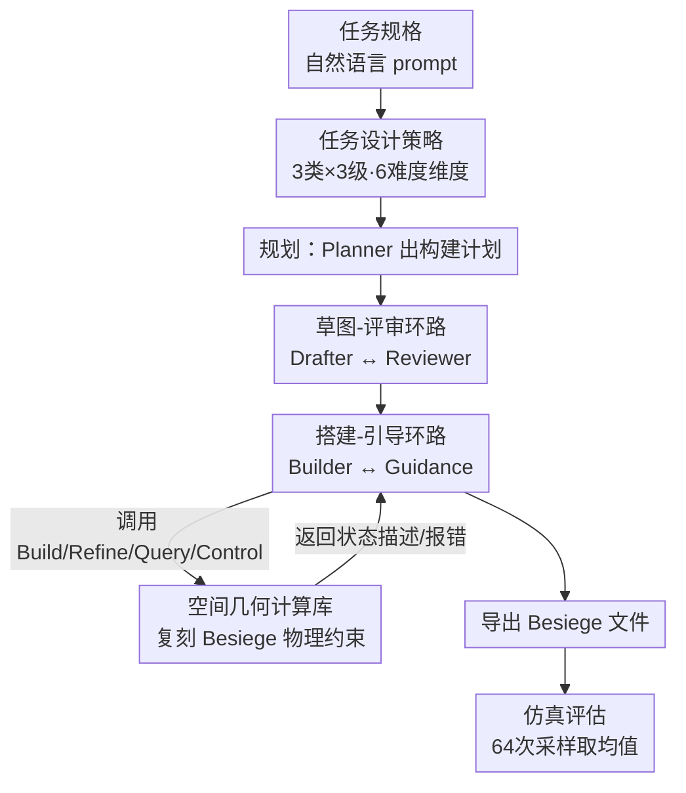

# BuildArena: A Physics-Aligned Interactive Benchmark of LLMs for Engineering Construction

**会议**: ICML2026  
**arXiv**: [2510.16559](https://arxiv.org/abs/2510.16559)  
**代码**: https://github.com/AI4Science-WestlakeU/BuildArena  
**领域**: LLM评估 / 具身智能 / 工程构建  
**关键词**: LLM基准, 物理仿真, 3D构建, 智能体工作流, Besiege  

## 一句话总结
BuildArena 把 LLM 丢进物理沙盒游戏 Besiege 里，让它用自然语言一砖一瓦搭桥、造车、造火箭，再用物理引擎跑仿真打分，从而第一次系统评测了 LLM"把语言变成能跑得动的真实结构"的工程构建能力——结果显示只有 GPT-5 在难任务上勉强能打，其余模型在 Hard 级别几乎全军覆没。

## 研究背景与动机
**领域现状**：工程构建自动化的理想形态是"用户说一句'设计一个满足火星任务的火箭'，系统就自动完成设计、制造、装配"。LLM 拥有广博知识、强推理、会规划会调工具，看上去是这条路线的天然候选。

**现有痛点**：但现有 LLM 基准几乎全在测数学和编程，评测发生在纯文本或静态环境里，从不和物理世界交互；已有的物理推理数据集（如 PHYRE）只考"理解物理"，不考"多步搭建";程序化 3D/CAD 生成虽然能产出模型，却很少验证生成的设计在真实物理条件下能不能装配、能不能动。

**核心矛盾**：工程构建本质上是一个**增量式、约束驱动**的过程——结构一步步装配，每个新构件必须连到已有结构上，且每一步都要连续验证物理可行性（如避免碰撞）。这要求"广度知识 × 深度分析"的结合，而当前没有任何框架能评估 LLM 是否真能把自然语言规格翻译成**物理上站得住、跑得动**的装配体。

**本文目标**：拆成两个子问题——(1) 怎么构造既覆盖工程难度谱、又能扩展的任务集；(2) 怎么让只会吐文字的 LLM 真正去操作一个带物理约束的 3D 构建空间，并自动评估结果。

**切入角度**：作者盯上了 Besiege——一个被全球玩家社区验证过"符合人类物理直觉"的物理仿真沙盒游戏，模块丰富、可组合成复杂物体。它天然提供了高保真物理环境，缺的只是一个让 LLM 能用语言操作的接口。

**核心 idea**：搭一套"任务定义 → LLM 智能体构建 → 物理仿真评估"三段式可定制流水线，并为 Besiege 复刻一个**开源的 3D 空间几何计算库**当语言接口，让 LLM 用自然语言增量搭建、用物理仿真客观打分。

## 方法详解

### 整体框架
BuildArena 是一个评测**框架**而非单个模型：输入是一段自然语言任务规格（目标 + 约束 + 测试流程 + 评估指标），输出是 LLM 搭出来的结构在 Besiege 里跑仿真得到的客观分数。整条流水线分三大可定制部件——**任务定义**、**LLM 智能体构建**、**仿真评估**。任务规格喂给一个由五个 LLM 实体组成的智能体工作流，工作流通过调用空间几何计算库一步步把结构搭出来、导出成 Besiege 可加载的文件，最后由统一脚本载入仿真器执行任务专属协议、记录轨迹与指标。为提高可靠性，每个"任务-模型"对采样 64 次取均值。

### 关键设计

**1. 可扩展任务设计策略：用 6 个工程难度维度撑起 3 类×3 级的任务谱**

要测"工程能力"，先得说清工程难在哪。作者从工程实践里抽象出 6 个难度维度——**量化**（需要多少显式数值推理）、**鲁棒性**（对单点失效的容忍度）、**规模**（跨度/载荷/模块数）、**组合性**（层级子结构构建与集成的深度）、**精度**（放置与朝向的几何严格程度）、**歧义**（任务指引的清晰完整度）。在这些维度上实例化出三类代表性任务：**Transport**（在平面上定向移动，指标为最大运输距离）、**Support**（跨越间隙支撑载荷的桥，指标为最大承载重量）、**Lift**（造火箭，Lv.1 造火箭引擎用推重比 $\text{TWR}$ 衡量、$\text{TWR}\gg 1$ 才算可行，Lv.2/3 造火箭飞行器用最大高度衡量）。每类任务再设 Easy/Medium/Hard 三级：例如 Transport 从 Lv.1 起去掉"造四轮车"的明确指令、把运输目标从机器本身换成带尺寸要求的货物，同时考验指令理解和大结构搭建。难任务（Support Lv.2/3、Lift Lv.3）已具备长程组合结构，单实例需要数百个搭建动作并带迭代环境反馈。这套"维度→任务→分级"的设计是个可复用模板，新增任务类别和难度等级都能往里加。

**2. 五智能体协作工作流：用粗到细 + 多轮修订把"造"这件事拆成可执行的对话**

LLM 不能一口气吐出一个能跑的结构，必须像人一样边搭边改。作者设计了一个**统一的基线工作流**，要求所有实体用同一个 LLM、只靠 prompt 区分角色，从而保证不同模型在同样的智能体设定下公平比较。它遵循粗到细 + 多轮修订结构，含五个实体——Planner（规划）、Drafter（出草图）、Reviewer（评审）、Builder（搭建）、Guidance（引导），Transport 任务额外加一个 Controller。流程走三个阶段：**规划阶段**由 Planner 把任务描述和初始模块集变成结构化构建计划；**草图-评审环路**里 Drafter 出设计图、Reviewer 审查并指导修订，循环到通过为止（违规则失败终止）；**搭建-引导环路**里 Guidance 逐步给出高层建议指定下一个动作、Builder 把建议翻译成几何计算库能执行的格式化命令，库更新状态并返回描述性反馈或报错，直到 Guidance 确认完工、把最终状态导出为无冲突、可仿真的运行文件。这个工作流只是基线，整个部件可被用户自定义替换。

**3. 3D 空间几何计算库：给闭源 Besiege 造一个开源的语言接口**

Besiege 只给人类玩家图形界面、只接受物理控制器输入，没有任何符号/语言接口或编程 API，LLM 根本插不进去；而其几何计算逻辑是闭源不可访问的。作者因此**复刻**了一个开源的空间几何计算库，忠实镜像 Besiege 的构建逻辑和物理约束，保证 LLM 在语言空间执行的动作效果与人类在图形界面操作一致。库接收 LLM 发来的动作及参数，计算并更新状态、执行物理约束检查：要么返回人类可读的当前状态描述，要么在违反约束时禁止该非法动作并解释失败原因。所有动作归为四类——**Build、Refine、Query、Control**。一次 49 模块机器的定量保真验证显示，本库与 Besiege 的差异可忽略：位置误差 $<1.5\times10^{-6}$ 单位长度、朝向误差 $<2.5\times10^{-5}$ 度。正是这个库把"增量、约束驱动、带碰撞检测的物理搭建"暴露给了纯文本的 LLM。

### 损失函数 / 训练策略
BuildArena 是评测框架，不训练模型。评估侧每个"任务-LLM"对采样 64 次取均值，性能指标含三项——模块数（仅作复杂度描述、不参与排名）、成功率（64 次试验中通过判据的比例）、任务专属性能指标（最大运输距离 / 最大承载 / TWR / 最大高度）；成本侧含累计输入 token、输出 token、LLM 请求总数。模型排名仅由成功率和性能指标经跨任务秩聚合决定。

## 实验关键数据

### 主实验
评测 9 个前沿模型（GPT-5、GPT-4o、Claude-4、Grok-4、Gemini-2.0、DeepSeek-3.1、Qwen-3、Kimi-K2、Seed-1.6）外加 3 个开源权重模型。下表摘录各任务三个难度级别的**成功率（%）**对比，可见 GPT-5 几乎全面碾压，其余模型在 Hard 级别普遍逼近 0：

| 任务 | 模型 | Lv.1 成功率 | Lv.2 成功率 | Lv.3 成功率 |
|------|------|------|------|------|
| Transport | GPT-5 | 78.1 | 23.4 | 26.6 |
| Transport | Claude-4 | 17.2 | 4.7 | 15.6 |
| Transport | Gemini-2.0 | 1.6 | 1.6 | 1.6 |
| Support | GPT-5 | 85.9 | 59.4 | 10.9 |
| Support | Seed-1.6 | 45.3 | 9.4 | 3.1 |
| Support | GPT-4o | 40.6 | 0.0 | 0.0 |
| Lift | GPT-5 | 95.3 | 10.9 | 17.2 |
| Lift | Grok-4 | 31.2 | 31.2 | 3.1 |
| Lift | Seed-1.6 | 6.2 | 0.0 | 0.0 |

GPT-5 在 Support Hard 仍能拿 10.9% 成功率、最大承载指标 24.9，而 GPT-4o/Claude-4/Gemini-2.0/DeepSeek-3.1/Qwen-3 在多个 Hard 级别直接挂零。Lift 是公认最难的类别（精确模块对齐 + 多个单点失效 + 严格的模块化装配要求）。

### 难度与判别力分析
作者用一张"基准能力对照表"论证 BuildArena 的覆盖面比前作更全：

| 基准 | 空间推理 | 3D构建 | 面向构建的规划 | 物理仿真器 | 交互环境 |
|------|------|------|------|------|------|
| PlanBench | ✗ | ✗ | ✗ | ✗ | ✗ |
| PHYRE | ✓ | ✗ | ✗ | ✓ | ✓ |
| Embodied Agent Interface | ✓ | ✓ | ✗ | ✓ | ✓ |
| **BuildArena (本文)** | ✓ | ✓ | ✓ | ✓ | ✓ |

### 关键发现
- **难度配置合理且有判别力**：在三类任务中，性能随难度上升而下降（Lift Lv.1 用 TWR、Lv.2/3 用高度，指标不同不可直接比）；Hard 级别大多数模型表现很低、但少数模型能脱颖而出，说明难度与判据设置具备良好区分度。
- **工作流确实奏效**：大量成功构建结果验证了五智能体协作（如逐步反思调整）对长序列规划是必要的。
- **几何库支撑语言操控物理世界**：构建过程涉及附着、移除、旋转、平移、连接等多样动作，覆盖了构建任务的动作需求。
- **顶配与中坚断层明显**：GPT-5 是唯一在多数 Hard 任务上还能稳定产出可行结构的模型，反映当前 LLM 的物理构建能力整体仍很初级。

## 亮点与洞察
- **把闭源物理引擎"几何复刻"成开源库**是最实在的工程贡献：49 模块验证位置误差 $<1.5\times10^{-6}$、朝向误差 $<2.5\times10^{-5}$ 度，意味着任何 LLM 都能在不碰原游戏的前提下，得到与人类操作几乎一致的物理反馈，这套接口可被后续工作直接复用。
- **用 6 个工程难度维度做"任务生成器"**而非写死一批任务，让基准天然可扩展——这种"先定义难度谱、再实例化任务"的思路可迁移到任何需要分级评测的具身/构建任务。
- **全流程三部件可定制**（任务、工作流、仿真器都能换）使 BuildArena 既是评测榜也是研究平台：换掉基线工作流就能直接测"更聪明的智能体编排"能带来多少提升。

## 局限与展望
- **强依赖单一仿真器 Besiege**：模块空间和物理规则都被 Besiege 框定，能不能推广到真实 CAD/机器人装配仍是开放问题。
- **64 次采样成本高**：每个"任务-模型"对都要跑 64 次完整智能体工作流，token 与请求开销巨大，限制了可评测的模型规模与任务数量。
- **基线工作流可能低估模型上限**：要求所有实体共用同一 LLM、只靠 prompt 区分，虽保证公平但可能压低了"用更强编排能达到的天花板"，Hard 级别近乎全挂的结论需结合这一点解读。
- **指标跨级不可比**：Lift Lv.1（TWR）与 Lv.2/3（高度）用不同指标，作者已提示不能直接比大小，读榜时需注意。

## 相关工作与启发
- **vs PHYRE / 物理推理数据集**：它们只考"理解物理"（预测会发生什么），BuildArena 考的是"多步增量构建"——要真的把结构一块块搭出来并通过物理仿真，是从被动理解到主动构建的跨越。
- **vs 程序化 3D / CAD 生成**：那类工作优化的是生成质量，很少验证生成设计在真实物理下能否装配、能否动；BuildArena 强制结果进物理仿真器跑，闭环了"生成→可行性验证"。
- **vs BesiegeField（并行工作）**：作者指出这是除该并行工作外、首个让 LLM 通过自然语言做 3D 结构构建并在物理约束环境下评估的基准（详见原文附录 A）。

## 评分
- 新颖性: ⭐⭐⭐⭐⭐ 首个物理对齐的语言驱动 3D 工程构建交互基准，补上了"理解物理"到"构建物理"的空白
- 实验充分度: ⭐⭐⭐⭐ 9 前沿 + 3 开源模型 × 3 任务 × 3 级 × 64 采样，覆盖广；但仅限 Besiege 单环境
- 写作质量: ⭐⭐⭐⭐ 三部件框架、难度维度、几何库保真验证讲得清晰，图表丰富
- 价值: ⭐⭐⭐⭐⭐ 既是评测榜又是可定制研究平台，开源库可直接复用，对 AI for Engineering 有实际推动

<!-- RELATED:START -->

## 相关论文

- [\[NeurIPS 2025\] Toward Engineering AGI: Benchmarking the Engineering Design Capabilities of LLMs](../../NeurIPS2025/llm_evaluation/toward_engineering_agi_benchmarking_the_engineering_design_capabilities_of_llms.md)
- [\[ACL 2026\] Beyond Marginal Distributions: A Framework to Evaluate the Representativeness of Demographic-Aligned LLMs](../../ACL2026/llm_evaluation/beyond_marginal_distributions_a_framework_to_evaluate_the_representativeness_of_.md)
- [\[ACL 2025\] PhysReason: A Comprehensive Benchmark towards Physics-Based Reasoning](../../ACL2025/llm_evaluation/physreason_a_comprehensive_benchmark_towards_physics-based_reasoning.md)
- [\[ACL 2026\] EngiBench: A Benchmark for Evaluating Large Language Models on Engineering Problem Solving](../../ACL2026/llm_evaluation/engibench_a_benchmark_for_evaluating_large_language_models_on_engineering_proble.md)
- [\[ACL 2026\] CLARITY: A Framework and Benchmark for Conversational Language Ambiguity and Unanswerability in Interactive NL2SQL Systems](../../ACL2026/llm_evaluation/clarity_a_framework_and_benchmark_for_conversational_language_ambiguity_and_unan.md)

<!-- RELATED:END -->
