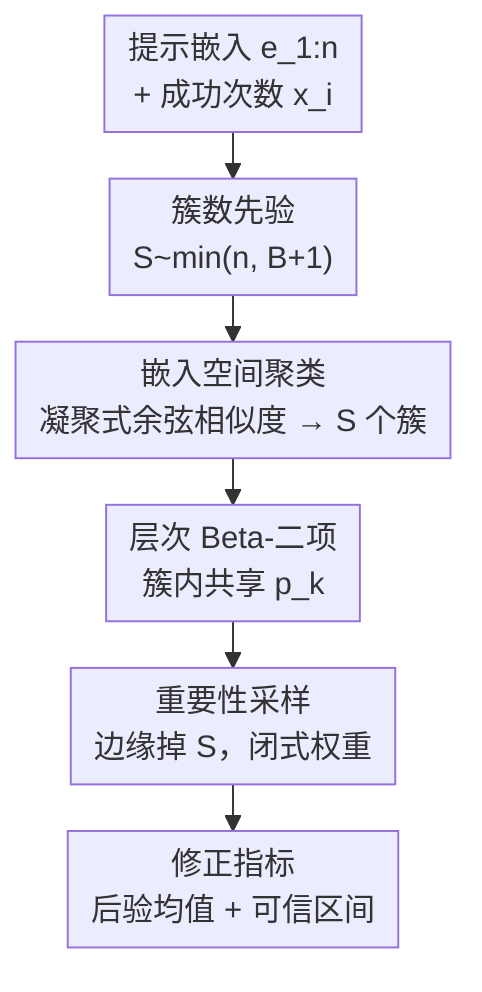

# Correcting Prompt Dependence in LLM Benchmarks: A Bayesian Hierarchical Model with Embedding-Space Clustering

**会议**: ICML2026  
**arXiv**: [2510.05709](https://arxiv.org/abs/2510.05709)  
**代码**: 待确认  
**领域**: LLM评测 / 贝叶斯统计  
**关键词**: LLM 基准、提示依赖、贝叶斯层次模型、嵌入聚类、有效样本量  

## 一句话总结
作者指出主流 LLM 基准指标依赖两个常被违反的假设——评测次数足够多（可用中心极限定理）、提示之间相互独立——并提出一个带「嵌入空间聚类」的贝叶斯层次模型 BHM-ESC：先把语义相似的提示聚成簇、簇内共享一个成功概率，再把簇数当未知量从数据里推断出来，从而在小样本下给出更可靠、且修正了提示依赖的性能估计，在对抗鲁棒性基准上把平均绝对误差降低 4–73%、预期对数后验密度提升 40–450。

## 研究背景与动机
**领域现状**：基准测试是评估 LLM 的主要手段。为了量化采样波动，近期工作建议把同一基准重复跑多次，再用样本均值、置信区间、p 值去比较模型。

**现有痛点**：两个隐含假设在实践里都站不住。其一，受算力限制，重复次数往往太少，达不到中心极限定理（CLT）所需的样本量，导致样本均值、置信区间、p 值都不可靠；其二，标准指标默认提示相互独立、等权平均，但多个基准的提示其实高度相关——对抗鲁棒性数据集尤其如此，提示常常围绕某个已知漏洞迭代构造而成，天然成簇。

**核心矛盾**：等权平均把 $n$ 个相关提示当作 $n$ 个独立样本，会高估「有效样本量」，从而虚高地抬升对统计结论的置信度——簇内近乎重复的提示，除了第一条之外几乎不贡献新信息。于是均值有偏、不确定性被低估，下游对模型优劣的比较可能被误导。

**本文目标**：(1) 拿出实证证据说明基准提示确实成语义簇、有效独立样本数远低于名义提示数；(2) 提出一个能同时「修正提示依赖」且「在小样本下稳健」的指标。

**切入角度**：把提示嵌入到句向量空间，用 Hopkins 统计量衡量聚类倾向——结果所有基准（或其子类）都 >0.6（0.5 是随机分布的零假设），证明聚类结构普遍存在。既然结构来自语义相似，就在嵌入空间里聚类、簇内信息汇聚。

**核心 idea**：用贝叶斯层次模型显式建模提示依赖——语义相似的提示归为一簇、簇内共享一个任务成功概率，并把「簇数」当未知随机变量从数据里推断，从而做到不需要预先的任务标签、对任意基准通用。

## 方法详解

### 整体框架
对一个含 $n$ 条提示的数据集，BHM-ESC 的输入是每条提示重复 $m$ 次评测得到的成功次数 $x_i$ 以及提示的句向量 $e_{1:n}$，输出是修正后的性能估计（后验均值与可信区间）。整条管线是：把「簇数 $S$」当未知随机变量并给一个先验 → 对每个采样到的 $S$ 用凝聚式余弦相似度聚类把提示切成 $S$ 个簇 → 簇内用 Beta-二项层次模型共享一个成功概率 $p_k$ → 用重要性采样把 $S$ 边缘掉、得到目标后验 $\pi(\bar p\mid x_{1:n})$ → 汇总成修正指标。关键巧思在于：簇数未知、从数据学，所以无需人工任务标签，对任意基准即插即用。

### 关键设计

**1. 簇数未知的嵌入空间聚类：让模型自己决定「有多少个独立话题」**

这一步针对「等权平均高估有效样本量」与「前人需要预先任务标签」两个痛点。作者不固定簇数，而是把它当随机变量 $S$ 并给一个扩散先验：

$$B\sim\text{Binomial}(50n,0.01),\qquad S=\min(n,B+1),$$

其期望约为 $0.5n+1$，既在合理的簇数范围内铺开足够概率、又把 $S$ 上界限制在 $n$。对给定的 $S$，用凝聚式余弦相似度聚类（all-MiniLM-L6-v2 句向量）把提示索引切成 $S$ 个互不相交的簇 $\mathcal{C}_1,\dots,\mathcal{C}_S$。作者特意「在给定 $S$ 时条件于这个确定性划分」而非把每个提示的簇归属也当随机变量——因为在小样本下完全贝叶斯聚类会过参数化、过拟合。把簇数当未知量、簇内分配用确定性聚类替代，是「benchmark-agnostic」与「抗过拟合」的来源。

**2. 层次 Beta-二项汇聚：簇内共享成功概率，把不确定性抬到话题层级**

这一步针对「簇内近重复提示被当独立样本」的痛点。对落在簇 $k$ 的提示 $i$，其 $m$ 次评测的成功次数建模为共享同一成功概率 $p_k$ 的二项分布：

$$x_i\mid p_k\sim\text{Binomial}(m,p_k),\ i\in\mathcal{C}_k,\qquad p_k\sim\text{Beta}(1,1).$$

$\text{Beta}(1,1)$ 是 $[0,1]$ 上的均匀先验，不偏好任何成功率。簇内共享 $p_k$ 等于承认「语义近似的提示成功概率应当一样」，从而把簇内冗余信息正确汇聚、而非重复计数。整体成功概率 $\bar p$ 取各簇概率分布的等权混合（均值分布），把独立簇之间的波动池化、在话题层级量化不确定性——这正是修正提示依赖、还原真实有效样本量的核心机制。

**3. 闭式权重的重要性采样：在小样本下绕过无解析解的后验**

这一步针对「目标后验 $\pi(\bar p\mid x_{1:n})$ 没有闭式解、且小样本下 CLT 不适用」的痛点。由于 $\bar p$ 是 $p_{1:S}$ 与 $S$ 的确定性函数，联合后验按贝叶斯规则分解为

$$\pi(p_{1:S},S\mid x_{1:n})\propto\pi(S)\,\pi(p_{1:S}\mid x_{1:n},S)\,\pi(x_{1:n}\mid S).$$

于是自然得到一个重要性采样方案：从先验 $\pi(S)$ 抽 $S$（簇划分随之确定）、从可解析的条件后验抽 $p_{1:S}$，对应的重要性权重正比于边缘似然 $\pi(x_{1:n}\mid S)$——把 $p_{1:S}$ 积掉后，每个簇恰好是一个 Beta 分布的归一化常数，因此边缘似然有闭式：

$$\pi(x_{1:n}\mid S)=\prod_{k=1}^{S}\frac{1}{\beta(1,1)}\Big(\prod_{i\in\mathcal{C}_k}\binom{m}{x_i}\Big)\beta\Big(1+\textstyle\sum_{i\in\mathcal{C}_k}x_i,\ 1+\sum_{i\in\mathcal{C}_k}(m-x_i)\Big).$$

归一化权重后即得逼近联合后验的加权样本，对每个样本把 $p_{1:S}$ 按簇平均算出 $\bar p$、复用已有权重，就得到无偏的修正指标（加权均值与可信区间）。闭式权重让整套推断在小样本下既无偏又高效。

## 实验关键数据

### 实证：基准提示确实成簇
用 all-MiniLM-L6-v2 算句向量、Hopkins 统计量衡量聚类倾向（>0.5 即非随机），1000 次重采样取均值。所有基准/子类都 >0.6，对抗类的 Garak 子集尤其高。

| 基准（子类） | Hopkins 均值 | 标准误 |
|--------------|-------------|--------|
| MMLU·World History | 0.896 | 0.0007 |
| Garak·Latent Injection | 0.880 | 0.0017 |
| Garak·Repeat | 0.814 | 0.0005 |
| HellaSwag | 0.723 | 0.0000 |
| GSM8K | 0.707 | 0.0000 |
| HarmBench·Copyright | 0.609 | 0.0003 |

### 主实验
在 4 个 Garak 对抗基准、两种架构（Pythia-2.8B / Mamba-2.8B）上评测，每组合采样 25 次、后验采样 10000 次，报告 ELPD（越高越好）与 MAE（越低越好）。下表为 Mamba-2.8B 在 AnsiRaw 基准上的对比：

| 方法 | ELPD ↑ | MAE ↓ | 说明 |
|------|--------|-------|------|
| BAYES (S=1) | -566.3 | 45.5 | 无聚类，全部当一簇 |
| FREQ (naive) | -565.6 | 45.5 | 频率派样本均值 + Wald 区间 |
| BHM-ESC-Mini | -132.8 | 12.2 | 本文（MiniLM 嵌入） |
| BHM-ESC-TF | -97.2 | 10.7 | 本文（TF-IDF 嵌入） |
| ORACLE | -115.2 | 12.9 | 用人工独立标签的上界 |

整体上 BHM-ESC 把 MAE 降低 4–73%、ELPD 提升 20–450 个对数概率单位；两种嵌入空间表现接近，说明增益来自结构还原而非某种嵌入的偶然 artefact。

### 关键发现
- 当前做法系统性高估有效独立样本量 1.3–5.6×：把 $n$ 个相关提示全当独立，虚高了统计置信度；BHM-ESC 推断出的簇数 $S$ 揭示了真实有效样本量。
- 修正能实质改变结论：在某些基准上，BHM-ESC 给出的模型性能比较（均值与不确定性）与基线明显不同，例如它判定模型对 AnsiRaw 攻击的鲁棒性比基线显示得更同质、且比频率派更有把握。
- 内部有效性三重佐证：BHM-ESC 分数紧贴 oracle、后验相似度矩阵与人工语义判断吻合、对扩散先验不敏感（只有特别强信息先验下才显现敏感）。
- 当提示强相互依赖、簇大小不平衡时，BHM-ESC 的修正价值最大。

## 亮点与洞察
- 把「LLM 评测可靠性」问题从「跑更多次」转向「正确建模相关性」，指出真正的病根是有效样本量被高估——这是评测方法论上很有价值的视角转换。
- 「簇数当未知量 + 簇内确定性聚类」的折中很聪明：既避免完全贝叶斯聚类在小样本下过参数化，又不需要人工任务标签，做到对任意基准通用。
- 闭式边缘似然让重要性采样权重可直接算，整套推断无需 MCMC、在小样本下既无偏又快，是可复用的统计工程范式。
- 这套方法不限于 LLM：任何「样本天然成簇、却被当独立处理」的评测/估计场景，都能借鉴「嵌入聚类 + 层次汇聚 + 推断簇数」的思路修正过度自信的不确定性。

## 局限与展望
- 簇内强制共享同一成功概率 $p_k$ 是简化假设，作者也承认可放宽以允许簇内异质性（如加超先验）。
- 簇归属用确定性凝聚聚类、未建模分配不确定性；作者提出可用贝叶斯隐空间聚类、或换 DBSCAN / k-means 等算法，但各有计算复杂度与超参敏感性的取舍。
- 当提示独立性本身「不够清晰可辨」时，刚性划分可能次优——实验里 oracle 在 AnsiRaw 上反而略差就是佐证。
- 目前针对单轮基准；多轮基准需把各轮嵌入拼接后聚类，尚待验证。嵌入模型本身的质量也会传导到聚类与最终指标上。

## 相关工作与启发
- **vs 贝叶斯不确定性估计（Longjohn 等 / Ross 等）**：前人用贝叶斯改进 LLM 评测的不确定性，但未显式建模提示依赖；本文把「贝叶斯小样本稳健」与「提示依赖修正」两条线合一。
- **vs 用任务标签建模依赖（Bowyer 等 / Luettgau 等）**：他们需要预定义的簇/任务标签当 oracle；本文把簇数当未知量、直接从嵌入空间学结构，去掉了对标签的依赖。
- **vs 频率派（样本均值 + Wald 区间）**：在小样本下 CLT 失效，频率派区间不可靠；BHM-ESC 给出校准的后验不确定性，且 ELPD/MAE 全面更优。

## 评分
- 新颖性: ⭐⭐⭐⭐⭐ 把「簇数未知的嵌入聚类」嵌进贝叶斯层次模型来修正提示依赖，角度新颖。
- 实验充分度: ⭐⭐⭐⭐ 覆盖多基准、多架构、多嵌入、oracle 上界与先验敏感性分析，但主战场偏对抗鲁棒基准。
- 写作质量: ⭐⭐⭐⭐⭐ 从假设违背→实证证据→模型→推断，逻辑严密、统计推导完整。
- 价值: ⭐⭐⭐⭐⭐ 直指 LLM 评测可信度的方法论痛点，且方法对任意基准通用，影响面广。

<!-- RELATED:START -->

## 相关论文

- [\[ICML 2025\] Hyperband-based Bayesian Optimization for Black-box Prompt Selection](../../ICML2025/llm_evaluation/hyperband-based_bayesian_optimization_for_black-box_prompt_selection.md)
- [\[ICML 2026\] HiPER: Hierarchical Reinforcement Learning with Explicit Credit Assignment for Large Language Model Agents](hiper_hierarchical_reinforcement_learning_with_explicit_credit_assignment_for_la.md)
- [\[NeurIPS 2025\] Bayesian Evaluation of Large Language Model Behavior](../../NeurIPS2025/llm_evaluation/bayesian_evaluation_of_large_language_model_behavior.md)
- [\[ICML 2026\] Multi$^2$: Hierarchical Multi-Agent Decision-Making with LLM-Based Agents in Interactive Environments](multi2_hierarchical_multi-agent_decision-making_with_llm-based_agents_in_interac.md)
- [\[AAAI 2026\] Lost in Benchmarks? Rethinking Large Language Model Benchmarking with Item Response Theory](../../AAAI2026/llm_evaluation/lost_in_benchmarks_rethinking_large_language_model_benchmarking_with_item_respon.md)

<!-- RELATED:END -->
