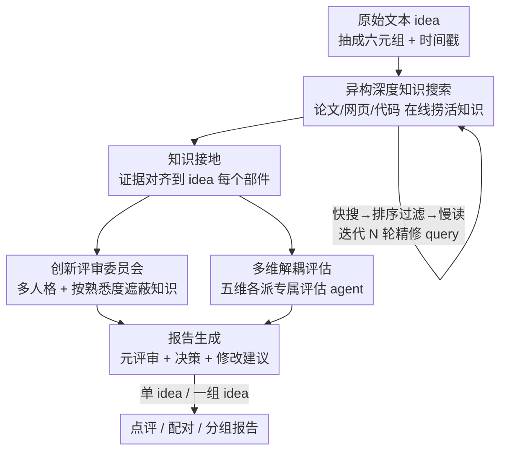

# InnoEval: On Research Idea Evaluation as a Knowledge-Grounded, Multi-Perspective Reasoning Problem

**会议**: ICML 2026  
**arXiv**: [2602.14367](https://arxiv.org/abs/2602.14367)  
**代码**: https://github.com/zjunlp/InnoEval （项目页 innoeval.zjukg.cn）  
**领域**: LLM 评估 / 科研 Agent / 研究想法评估  
**关键词**: 想法评估、异构知识检索、多视角评审、人格化 reviewer、元评审

## 一句话总结
InnoEval 把"评一个研究 idea"重新定义成一个**知识接地 + 多视角推理**的问题：先用一个异构深度搜索引擎从论文/网页/代码里在线捞活知识并细粒度对齐到 idea 的每个部件，再用一个由不同学术人格组成的"创新评审委员会"在五个维度上各自打分、汇总成带决策的元评审，在点评、配对、分组三类任务上全面超过现有 baseline 且与人类专家高度一致。

## 研究背景与动机
**领域现状**：LLM 把科研 idea 的"生产"加速到了前所未有的规模——自动出假设、自动写方法的 agent 层出不穷。但"生产爆炸"之后，**评估**这一环没有跟上：判断一个 idea 好不好仍然高度依赖稀缺、昂贵、主观的人类专家。

**现有痛点**：作者把现有自动评估工具的不足归纳成三条。一是**知识视野太窄**——多数方法只查静态学术论文，忽略了 idea 所处的"活知识生态"（网上的讨论、开源代码、最新进展），评估容易脱离现实。二是**忽视评审共识**——主流做法直接用单个 LLM-as-a-Judge，等于把这个模型自身的偏见固化成评判标准，无法模拟多个专家之间的审议。三是**评估维度被压扁**——把 novelty、feasibility、impact 等本该相互独立甚至彼此张力的属性，硬塞进一两个分数里，既丢信息也给不出有用反馈。

**核心矛盾**：科学评估的本质是一个**整体的认知验证过程**，作者用三条原则刻画它——知识接地（idea 是知识密集实体，要对照整个理论与实践生态）、集体审议（好评价来自多元视角的融合，而非单一权威）、多准则决策（idea 的复杂性要靠多个属性的并集来尊重）。现有工具恰好在这三点上全线失守。

**本文目标**：造一个自动化、系统化、却能逼近人类专家水平的 idea 评估框架，同时支持单 idea 打分、两两比较、一组排序三种实际场景。

**切入角度**：与其把评估当成一次"静态生成"，不如把它建模成**知识接地的多视角推理**——先把证据找全、对齐准，再让一群背景各异的"评审"独立判断后汇聚共识。

**核心 idea**：用"异构深度搜索 + 细粒度接地 + 人格化评审委员会 + 维度解耦评估"这条流水线，逐条堵住知识窄、无共识、维度扁三个漏洞。

## 方法详解

### 整体框架
给定一段**原始文本形式的 idea**（成熟度不限，从一句假设到一篇完整论文都行），InnoEval 先把它抽成一个结构化六元组 $\mathcal{I}=(\text{TLDR}, \text{Motis}, \text{ResQues}, \text{Meths}, \text{ExpSets}, \text{ExpRes})$，并附一个时间戳 $t$ 标明"站在哪个时间点评"。随后流水线分四步走：① 异构深度知识搜索，从在线论文/网页/代码里迭代地捞取并过滤高质量背景知识；② 知识接地，把检索到的证据细粒度地对齐到 idea 的每个部件，挑出真正支持或反驳它的片段；③ 多维多视角评估，由一组维度专属的评估 agent 和一个人格化评审委员会在五个维度上分别打分；④ 报告生成，把所有评审意见汇成带引用证据、结构化分析、最终决策和修改建议的元评审。输出可以是单 idea 报告 $P_\text{point}$，也可以是一组 idea 的排序报告 $P_\text{group}$。

### 关键设计

**1. 异构深度知识搜索引擎：用"快搜—过滤—慢读—精修"的迭代循环捞活知识，堵住知识视野窄**

针对"只查静态论文"的痛点，作者让一个搜索 agent $\mathcal{M}_s$ 把触角伸到三类**在线**异构源——学术文献（arXiv、Semantic Scholar、Google Scholar）、网页内容（Google Search）、开源代码（GitHub、Kaggle），并把检索结果分成 literature / web / code 三类知识。关键是一个**快慢混合**的迭代策略：对 idea 的每个部件 $p$ 和每个工具 $u$，agent 先生成一组定制 query 并做同义词扩展（不同社区对等概念措辞往往不同），再用 API **快搜**拿到简略结果 $\widetilde{\mathcal{K}}_{p,u}=u(\mathcal{Q}_{p,u}, t)$；时间戳 $t$ 把知识切成 pre / post 两半——前者用于评估、后者用于给修改建议。

过滤用的是一个**混合打分**函数：先用嵌入模型算 idea 与每条知识的语义相似度、每类留 top-$3m$，再过一遍 reranker 得到 $\mathcal{S}^\text{sem}$；同时把 $\mathcal{M}_s$ 当 judge，结合引用数、发表 venue、网站热度、repo star 等给出 $\mathcal{S}^\text{llm}$；二者按系数 $\alpha$ 加权后取每类 top-$m$：

$$\mathcal{S}_j = \alpha\,\mathcal{S}^\text{sem}_j + (1-\alpha)\,\mathcal{S}^\text{llm}_j,\quad \widetilde{\mathcal{K}}^*_j = \text{Top}_m(\widetilde{\mathcal{K}}_j, \mathcal{S}_j)$$

这样既缓解纯语义相似的脆弱，又压住纯 model-as-judge 的偏见与幻觉。过滤后再做**慢搜**充实内容：文献抓全文 PDF 转结构化文本，网页抓 URL 转摘要报告，代码则爬仓库的文件级/函数级调用图、分析核心代码片段并结合 README 汇成报告。最后是**迭代精修**：$\mathcal{M}_s$ 根据已充实的知识沿三个轴改写 query——重写相关性不足的、泛化结果过于具体的、具体化结果过于宽泛的，再把新一轮简略知识与上一轮保留的并集重新排序过滤，整个过程迭代 $N$ 次（实验取 $N=3$，$m=10$，$\alpha=0.2$）。

**2. 知识接地：把证据对齐到 idea 的每个部件，去噪并标出"支持还是反驳"**

光检索回来一堆知识还不够——它们与 idea 的具体关联是模糊的。接地 agent $\mathcal{M}_g$ 做的事是细粒度对齐：对 idea 的每个部件 $p$，收集所有据它检索到的知识 $\mathcal{K}_p$，再对每条 $k_p$ 蒸馏出真正**支持或反驳** $p$ 的证据 $e_p$ 并给一段相关性分析 $s_p$：$e_p, s_p = \mathcal{M}_g(p, k_p)$。最终接地结果 $\mathcal{G}=\{(p, \mathcal{G}_p)\}_{p\in\mathcal{I}}$ 喂给后续评估模块。消融显示去掉接地（-Grounding）会在多任务上不同程度掉点，说明它确实在过滤检索报告里的噪声、让评估聚焦相关信息。

**3. 创新评审委员会：用多元学术人格 + 按熟悉度遮蔽知识，把单一 judge 的偏见换成多视角共识**

针对"单 LLM-as-Judge 固化偏见"的痛点，作者精心构建了一个评审委员会 $\mathcal{P}$，其中每个人格 $\rho$ 包含学术画像、一个对 literature/web/code 三类知识的**熟悉度向量**、以及评审习惯。评估时按该人格在各类源上的熟悉度**随机遮蔽一定比例的知识**，以此模拟真实人类"不是所有背景都精通"的认知局限。这一步把"假装多样意见的单个 reviewer"换成了"背景真不同、从不同视角看后才收敛"的真共识。分析里有个有趣证据：在分组排序任务上，**只用 1 个人格反而不如不用人格**——因为从 0 到 1 只是把 LLM 的固有偏见平移到那个特定人格上，没解决根本问题；而随着人格数增加，人格化 test-time scaling 持续涨、普通 TTS 很快见顶（主实验随机选 5 个人格是效率与效果的折中，并非性能上限）。

**4. 多维解耦评估与报告生成：五个维度各派专属 agent 独立评，再汇成带决策的元评审**

针对"维度被压扁"的痛点，InnoEval 初始给出五个相互解耦的维度——Clarity、Novelty、Feasibility、Validity、Significance（用户可自由注册新维度）。对评审委员会随机选出的子集 $\mathcal{P}'$（每个 idea 派 5 个不同人格）中的每个人格 $\rho$ 和每个维度 $\psi$，由专属评估 agent $\mathcal{M}_\psi$ 结合接地证据 $\mathcal{G}$ 在 $[0,10]$ 区间打分并给出推理叙述 $\varphi_{\rho,\psi}=\mathcal{M}_\psi(\rho, \mathcal{I}, \mathcal{G})$。报告 agent $\mathcal{M}_r$ 再把所有 $\{\varphi_{\rho,\psi}\}$ 汇成元评审 $\varphi_\text{meta}$（含总分 $s_\text{point}$ 和决策 $d_\text{point}\in\{$Reject, Poster, Spotlight, Oral$\}$），并基于 idea 之后发表的"未来知识" $\mathcal{G}_\text{future}$ 给出修改建议 $\mathcal{V}$。**分组场景**先为每个 idea 合成点评报告，再让报告 agent 沿五维两两比较、产出完整排序 $\varphi^\text{group}_\text{meta}$。

### 损失函数 / 训练策略
InnoEval 是**纯推理流水线、无需训练**：检索用现成的 bge-base-en-v1.5 做 retriever、bge-reranker-base 做 reranker，主干 LLM 用 DeepSeek-V3.2（鲁棒性测试换 o4-mini）。超参 $m=10$、$\alpha=0.2$、$N=3$，评一条样本平均成本约 \$0.42。

## 实验关键数据

### 数据集与任务
作者从权威同行评审论文里抽 idea 构数据集：爬 NeurIPS25 / ICLR25 的 OpenReview 投稿，按最终决定分 Reject / Poster / Spotlight / Oral 四层做分层采样，经抽取 agent + 人工校正得 **217 条点评样本**（$\mathcal{D}_\text{point}$）。再用每条 idea 检索相似论文构组得 **172 条分组样本**，并从中采样配对、按标签差距分 easy（如 Reject vs. Highlight）/ hard（相邻标签）共 **372 条配对样本**（172 easy + 200 hard）。

### 主实验

| 任务 | 指标 | 最强 baseline (ScholarEval) | InnoEval | 提升 |
|------|------|------|------|------|
| 点评·三分类 | F1₃ | 58.38 | **74.56** | +16.18 |
| 点评·三分类 | Acc₃ | 61.75 | **73.73** | +11.98 |
| 点评·二分类 | Acc₂ | 65.44 | **75.58** | +10.14 |
| 配对·easy | Acc | 74.42 | **80.81** | +6.39 |
| 配对·hard | Acc | 60.00 | **63.00** | +3.00 |
| 分组·best 选择 | Acc | 49.42 | **65.12** | +15.70 |
| 分组·排序 | Acc | 14.53 | **22.09** | +7.56 |

一个值得注意的现象：多数 baseline 在点评任务上出现**标签塌缩**（预测只集中在一两个标签，表现为 F1 远低于 Acc）；InnoEval 靠充分证据与多维多视角评估把预测分散开，F1 才能追上甚至反超 Acc。

### 质量对比（o4-mini 当 judge 的胜率，节选 Overall Quality）

| InnoEval vs. | Rationality 胜% | Depth 胜% | Constructiveness 胜% | Overall 胜% |
|------|------|------|------|------|
| CoT | 88.48 | 93.09 | 89.77 | 90.70 |
| RAG | 87.10 | 92.63 | 87.10 | 90.32 |
| ResearchAgent | 86.18 | 90.32 | 88.94 | 89.86 |
| InternAgent | 83.41 | 91.24 | 82.03 | 85.71 |
| ScholarEval | 67.28 | 70.51 | 84.79 | 71.89 |

InnoEval 在 Overall Quality 上对所有 baseline 胜率均 >70%，Depth 维度对多数方法 >90%。ScholarEval 是强 baseline（在 rationality/supportiveness/depth 上能赢过 25% 样本），但它评估维度有限、缺基于证据的改进建议，constructiveness 拉胯。

### 消融与分析

| 配置 | 效果 | 说明 |
|------|------|------|
| Full InnoEval | 最优 | 完整流水线 |
| -Grounding | 多任务不同程度掉点 | 去接地后噪声混入，评估失焦 |
| -Personalized | 显著掉点（点评/分组尤甚） | 退回单 LLM-as-Judge，偏见回潮 |
| -Web&Code | 明显掉点（配对/分组尤甚） | 只留文献检索，背景知识不足 |
| o4-mini 主干 | 略降但仍超最强 baseline | 跨模型鲁棒 |

### 关键发现
- **人格化是共识的关键**：普通 test-time scaling 很快见顶，而人格化 TTS 持续涨；分组排序里"只用 1 个人格反不如 0 个人格"，因为单人格只是把 LLM 偏见平移到该人格、没解决根本问题。
- **比较任务最吃背景知识**：-Web&Code 对配对/分组的伤害大于对点评，说明比较多个 idea 尤其需要丰富的活知识。
- **人机一致性高**：随机抽 60 条与人类专家、真实 peer-review 评论对比，五维相关系数均 ≥ 0.5；Clarity 相关最高（只看逻辑与结构连贯，好判断），Significance 最低（本身复杂，是未来工作方向）。
- **评审能反哺生成**：把 InnoEval 的修改建议接进 ResearchAgent 的 idea 迭代流水线，在问题定义、方法、实验设计上都显著提升生成质量；而 ScholarEval 只盯 contribution/soundness 两维，反而带偏优化、退化生成质量。

## 亮点与洞察
- **把"评估"从生成任务重定义成知识接地的多视角推理**：三条原则（知识接地 / 集体审议 / 多准则）→ 三个漏洞（窄 / 无共识 / 扁）→ 三个模块，论证链条干净，是这篇最"啊哈"的地方。
- **按人格熟悉度随机遮蔽知识**是个巧设计：它把"模拟人类认知局限"落到了可执行的机制上，而不是空喊"多样性"，也正是人格化 TTS 持续 scaling 的来源。
- **快慢混合 + 混合打分**的检索范式可迁移：先快搜广撒网、语义相似 + LLM-judge 双分过滤、再慢读充实、迭代精修 query，这套对任何"需要在线找活证据"的 agent 任务都通用。
- **用未来论文做修改建议**：靠时间戳把知识切成 pre/post，post 知识专门用于给 actionable 反馈，让评估不止"判死刑"还能"开药方"。

## 局限与展望
- **成本与延迟**：每条样本约 \$0.42，且强依赖多个在线搜索 API；人格数虽能 scaling 但更大的池会让推理时间急剧上升，主实验只能折中选 5 个。
- **Significance 维度评不准**：与人类相关最低，反映"影响力"这种长期、主观属性本身难以即时判断。
- **标签来自会议决定**：用 NeurIPS/ICLR 的接收档位当 ground truth，会把评审本身的噪声与运气也当成信号；"被拒"未必等于"idea 差"。
- **依赖在线源的时效与可得性**：链接失效、检索 API 变动都会影响活知识的覆盖；中文或小语种社区知识可能覆盖不足。

## 相关工作与启发
- **vs LLM-as-a-Judge（CoT / RAG）**：直接让单个 LLM 打分会把模型偏见固化成标准、且标签塌缩严重；InnoEval 用人格化委员会 + 维度解耦把偏见摊开成共识，F1 大幅领先。
- **vs ScholarEval（专门的 idea 评估方法）**：ScholarEval 检索强但结果收敛、牺牲多样性，且只盯 contribution/soundness 两维、缺证据化改进建议；InnoEval 的异构搜索同时保住相关性/覆盖/多样性，constructiveness 因而碾压。
- **vs GraphEval**：它只为单 idea 标签预测训练，配对/分组任务几乎失效，暴露了评估系统需要的灵活性。
- **vs ResearchAgent / InternAgent**：前者依赖预建文献库、对新 idea 评不准，后者搜索流水线复杂但评估维度单一、难对齐人类标签；InnoEval 把"在线活知识 + 多维评估"补齐了这两块短板。

## 评分
- 新颖性: ⭐⭐⭐⭐⭐ 把 idea 评估重构成知识接地的多视角推理，三原则—三漏洞—三模块的设计逻辑自洽且新。
- 实验充分度: ⭐⭐⭐⭐⭐ 点评/配对/分组三类任务 + 质量胜率 + 人机一致性 + 消融 + scaling 分析，证据链完整。
- 写作质量: ⭐⭐⭐⭐ 形式化定义清晰、动机层层递进；公式记号偏密，附录依赖较重。
- 价值: ⭐⭐⭐⭐⭐ 自动 idea 评估是科研 Agent 流水线的关键瓶颈，且证明评审能反哺生成，落地意义强。

<!-- RELATED:START -->

## 相关论文

- [\[ACL 2026\] Teaching Language Models to Forecast Research Success Through Comparative Idea Evaluation](../../ACL2026/llm_evaluation/teaching_language_models_to_forecast_research_success_through_comparative_idea_e.md)
- [\[ACL 2025\] MDBench: A Synthetic Multi-Document Reasoning Benchmark Generated with Knowledge Guidance](../../ACL2025/llm_evaluation/mdbench_a_synthetic_multi-document_reasoning_benchmark_generated_with_knowledge_.md)
- [\[ACL 2026\] BizCompass: Benchmarking the Reasoning Capabilities of LLMs in Business Knowledge and Applications](../../ACL2026/llm_evaluation/bizcompass_benchmarking_the_reasoning_capabilities_of_llms_in_business_knowledge.md)
- [\[ACL 2026\] Aggregate vs. Personalized Judges in Business Idea Evaluation: Evidence from Expert Disagreement](../../ACL2026/llm_evaluation/aggregate_vs_personalized_judges_in_business_idea_evaluation_evidence_from_exper.md)
- [\[ICLR 2026\] ACADREASON: Exploring the Limits of Reasoning Models with Academic Research Problems](../../ICLR2026/llm_evaluation/acadreason_exploring_the_limits_of_reasoning_models_with_academic_research_probl.md)

<!-- RELATED:END -->
