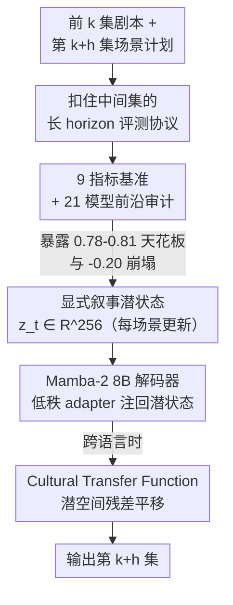

# NarrativeWorldBench: A Frontier-Saturated Benchmark and a Latent World Model for Long-Horizon Co-Creative Audio Drama

**会议**: ICML 2026  
**arXiv**: [2606.17391](https://arxiv.org/abs/2606.17391)  
**代码**: 待确认（作者称将发布 benchmark / 模型权重 / harness / Cultural Transfer Function）  
**领域**: LLM 评测 / 长程叙事生成 / 状态空间模型  
**关键词**: 长程叙事、剧情节拍、世界模型、Mamba-2、跨文化本地化

## 一句话总结
作者构建了一个专测「长程连载剧本续写」结构一致性的 9 指标基准 NarrativeWorldBench，发现 21 个前沿大模型在剧情节拍 F1 上集体卡在 $[0.78,0.81]$ 天花板、且 horizon 拉到 200 集会齐刷刷掉 $-0.20$，随后提出用 Mamba-2 维护一个 256 维显式叙事潜状态的世界模型 N-VSSM，以 4 倍更低算力把 F1 稳在 $\geq 0.84$ 并被专业编剧 71% 概率更偏好。

## 研究背景与动机

**领域现状**：长篇连载音频剧（有声剧 / 虚构播客）是个体量巨大的创作媒介——全球已有 6 万多个在播系列、约 20 亿月活听众，单条故事线常跨 200 到 800 集。这种媒介真正难的不是「单集写得好不好」，而是 **horizon**：模型要在编剧实时介入引导的前提下，把一条故事线在几百集里保持连贯。

**现有痛点**：现有长上下文基准（LongBench、RULER、NoCha、FActScore、L-Eval）测的全是检索、事实召回、摘要这类「信息能不能取回来」的能力，**没有一个在测共创式续写下的结构性叙事一致性**——即模型要在编剧正在塑造的故事线上继续往下写，伏笔有没有回收、人物口吻稳不稳、世界观规则有没有被违反。

**核心矛盾**：长程连载叙事本质是个**部分可观测过程**——它的潜在状态（人物关系、未回收伏笔、母题、情绪弧线）无法从局部上下文恢复出来。于是单纯堆模型规模或推理预算并不能突破天花板，因为信息没被结构化地携带下去，只能随上下文衰减而遗忘。

**本文目标**：（1）造一个真能量化长程结构一致性的基准；（2）审计当前前沿模型到底差在哪；（3）给出一个能跨过天花板的方法。

**切入角度**：如果天花板的根因是「潜状态不可从局部恢复」，那解法就不该是更大的被动解码器，而是给模型挂一个**显式、可更新、低维的叙事潜状态**，让长程信息以有界遗忘的方式被携带；同理，跨语言文化贴合度也不必重训解码器，而可当作潜空间里的一次**表征平移**来恢复。

**核心 idea**：用「Mamba-2 骨干 + 每场景更新一次的 256 维事件条件潜变量」构成的叙事世界模型 N-VSSM，把长程叙事状态显式地存起来、传下去，从而在远 horizon 上抗住结构崩塌。

## 方法详解

本文有两部分：一个**基准 NarrativeWorldBench**（含前沿审计）和一个**模型 N-VSSM**。前者定义了怎么测、暴露了天花板与崩塌；后者给出怎么跨过去。

### 整体框架

NarrativeWorldBench 的评测协议是「给模型前 $k$ 集 + 第 $k+h$ 集的结构化场景计划，让它直接写出第 $k+h$ 集」，而中间的 $k+1\dots k+h-1$ 集**全部扣住不给**——模型只拿到目标集的场景骨架，看不到中间剧情。这一刀切干净地隔离出「模型能不能把叙事状态往前携带 $h$ 集」，而不是「能不能检索/复制已有文本」。在 horizon $h\in\{10,20,50,100,200\}$ 上、用 9 个可自动化指标打分，并扩到 4 种印度语言做跨文化评测。

N-VSSM 则是被测系统里唯一越过天花板的那个：它在 Mamba-2 8B 解码器之上挂一个显式叙事潜变量 $z_t\in\mathbb{R}^{256}$，每个场景边界更新一次，用事件三元组驱动后验，并通过低秩 adapter 把潜状态注回生成。跨语言时再叠一个轻量的 Cultural Transfer Function 做潜空间平移。

### 关键设计

**1. 九指标长程叙事基准：把「结构一致性」拆成可自动化的可复现量纲**

针对「现有基准只测检索召回、测不出叙事结构」这个痛点，作者把「故事写得连不连贯」拆成 9 个全自动、可复现的指标，核心主指标是 **Plot-Beat F1**——在 14 类 Save-the-Cat 剧情节拍分类法（opening image / catalyst / midpoint / all is lost / finale 等）上算 F1，由一个留出的裁判集成抽取节拍。其余 8 个各自盯住一种长程失效模式：人物口吻一致性（按角色风格嵌入质心算余弦距离）、世界观规则违反率（对照系列设定集 series bible）、伏笔回收率（引入的伏笔在 $h$ 集内被回收的比例）、时序连贯（事件链顺序违反率）、母题复现（母题分布的 KL 散度）、情绪弧对齐（对每场景 valence/arousal 轨迹做 DTW）、对白归属准确率、母题存续。语料来自 38 个开放许可（CC-BY / CC-BY-SA）系列的 1,204 个续写实例，跨剧情/惊悚/奇幻/科幻/日常/悬疑六类均衡，弧长 80–412 集、中位数 178。把「连贯」量化成这九个轴，是后面能做前沿审计的前提。

**2. 前沿审计：暴露 $[0.78,0.81]$ 天花板与 $-0.20$ 的 horizon 崩塌**

作者横扫 5 个层级共 21 个系统（经典 GPT-3.5/Llama-2、微调叙事基线 DOC/Dramatron/Re3、开放前沿 Llama-3.1-405B/DeepSeek-V3、闭源前沿 Claude Opus 4.5/GPT-5/Gemini-2.5-Pro、以及推理层 o3-Pro/DeepSeek-R1）。两个发现极具说服力：其一，在 $h=50$ 时，**闭源前沿与推理层紧紧挤在 $[0.78,0.81]$ 这条带里**，28 对两两 Welch t 检验（Bonferroni 校正）全都不显著（$p>0.13$）——说明加规模、加推理预算都撞同一面墙；其二，**从 $h=10$ 到 $h=200$，每个前沿/推理系统都单调掉 $-0.18$ 到 $-0.21$ F1**（每个对比 $p<10^{-4}$）。这两点共同坐实了「长程结构一致性不是规模能解决的问题」，给 N-VSSM 提供了立论靶子。

**3. N-VSSM：用事件条件潜变量做显式叙事世界模型**

针对「潜状态不可从局部恢复 → 被动解码器必然遗忘」，N-VSSM 给 Mamba-2 8B 解码器挂一个显式叙事潜变量 $z_t\in\mathbb{R}^{256}$，**每场景更新一次**。每到场景边界，事件抽取器产出三元组 $e_t=(\text{actor},\text{action},\text{object},\text{location},\text{outcome})$，潜后验为

$$q_{\phi}(z_t\mid z_{t-1},e_t,h_t)=\mathcal{N}\bigl(\mu_{\phi},\operatorname{diag}(\sigma^2_{\phi})\bigr),$$

其中 $h_t$ 是 Mamba-2 隐状态。生成时通过插在每第 4 个 Mamba-2 块上的低秩 adapter，用 cross-attention 把 $z_t$ 注回解码。训练上先在 480B token 英文虚构语料预训练骨干，再在 180 万连载场景上按系列级留出联合微调，损失是每场景负 ELBO（带 KL 退火）加一项伏笔回收辅助损失。**关键收益是把长程信息塞进一个低维、可更新的有界容器里携带下去**，于是远 horizon 不再随上下文衰减——这正是被动解码器做不到的。代价端 N-VSSM 8B 每集只要 17 H100-秒，约为前沿带（GPT-5 约 72 秒）的 $0.24\times$。

**4. Cultural Transfer Function：把跨文化贴合当成潜空间的一次平移**

针对「跨语言本地化常要重训解码器、代价高」，作者对每个非英语目标语言 $l$ 学一个残差变换 $T_l:\mathbb{R}^{256}\to\mathbb{R}^{256}$（2 层 MLP），在 24k 对（英语,$l$）平行场景上用对比损失加散度惩罚训练。它**只把潜状态平移到目标文化的表征区域，完全不动解码器**。这把「文化贴合」从「必须重训进解码器的属性」降格为「潜空间里可恢复的一次表征变换」，因而每种语言只花 28 H100-小时就能把母语者文化贴合度抬升 $+0.20\sim+0.23$ Likert。

### 损失函数 / 训练策略
预训练：Mamba-2 8B 骨干在去重的 480B token 英文虚构混合语料上预训练（3,600 H100-天）。微调：与潜模块联合在 180 万连载场景上微调，损失 = 每场景负 ELBO（KL 退火）+ 伏笔回收辅助损失，384 张 H100 跑 9.4 天。Cultural Transfer Function：每语言 28 H100-小时。全程严格系列级留出，杜绝同系列泄漏。

## 实验关键数据

### 主实验

N-VSSM 是唯一越过天花板的系统，且在远 horizon 几乎不掉。下表为 $h=50$ 的剧情节拍 F1（均值 $\pm$ 5 seed 的 95% CI）：

| 模型 | Plot-Beat F1（$h=50$） | 备注 |
|------|------------------------|------|
| GPT-5 | $0.81\pm0.02$ | 闭源前沿天花板上沿 |
| Claude Opus 4.5 | $0.80\pm0.02$ | 闭源前沿 |
| Gemini-2.5-Pro | $0.79\pm0.02$ | 闭源前沿 |
| o3-Pro | $0.79\pm0.02$ | 推理层 |
| DeepSeek-R1 | $0.78\pm0.02$ | 推理层（带下沿） |
| Llama-3.1-405B | $0.71\pm0.02$ | 开放前沿 |
| DOC (Llama-3-70B) | $0.62\pm0.03$ | 微调叙事基线 |
| **N-VSSM (ours, 8B)** | $\mathbf{0.86\pm0.02}$ | 唯一在带之上 |

横跨 horizon 看崩塌更直观：前沿系统从 $h=10$ 到 $h=200$ 普遍掉约 $-0.20$，N-VSSM 近乎持平。

| 模型 | $h=10$ | $h=50$ | $h=100$ | $h=200$ | 净跌幅 |
|------|--------|--------|---------|---------|--------|
| GPT-5 | 0.93 | 0.81 | 0.76 | 0.73 | $-0.20$ |
| Claude Opus 4.5 | 0.92 | 0.80 | 0.74 | 0.71 | $-0.21$ |
| o3-Pro | 0.92 | 0.79 | 0.73 | 0.71 | $-0.21$ |
| **N-VSSM** | 0.89 | 0.86 | 0.85 | **0.84** | $-0.05$ |

算力上 N-VSSM 8B 每集 17 H100-秒，仅为 GPT-5（约 72 秒）的 $0.24\times$。在 $h=200$ 处它相对前沿带的最大优势集中在结构指标：伏笔回收 $+0.18$、时序连贯 $+0.14$、母题存续 $+0.12$。跨文化上，开启 Cultural Transfer Function 后母语者文化贴合度从 4.31→4.51（印地语）、4.18→4.39（泰米尔语）、4.22→4.42（泰卢固语）、4.26→4.49（马拉地语），每项 $+0.20\sim+0.23$ 均显著（$p<0.01$，混合效应模型，BH 校正）。

### 消融实验

| 配置 | 关键指标变化 | 说明 |
|------|-------------|------|
| 完整 N-VSSM | $h=200$ F1 = 0.84 | 基准 |
| 去掉潜后验 | $-0.11$（$h=200$） | 显式叙事潜状态是主贡献 |
| Mamba-2 换同参数 Transformer | $-0.06$ | 线性时序骨干对长程有实质增益 |
| 去掉伏笔回收辅助损失 | 伏笔回收率 $-0.13$ | 该辅助损失直接撑起伏笔指标 |

### 关键发现
- **天花板与规模/推理预算无关**：闭源前沿和推理层在 $[0.78,0.81]$ 不可区分，说明长程结构问题不是「再大一点」能解的，而是范式问题（部分可观测、潜状态不可恢复）。
- **贡献最大的是显式潜后验**：去掉它 $h=200$ 直接掉 $0.11$，是所有消融里最大的单点损失，印证「显式携带叙事状态」才是越过天花板的关键，而非骨干换型（换 Transformer 只掉 0.06）。
- **裁判鲁棒性**：节拍抽取用 GPT-4o/Claude Sonnet 4.5/Gemini-2.5-Flash 三裁判多数投票，与人工标注 Cohen's $\kappa=0.78$；换成与 N-VSSM 无交集的裁判子集，排名不变，排除「自家裁判偏袒」。
- **专业编剧背书**：12 位职业编剧、240 次被试内试验，N-VSSM 在长弧一致性上 71% 概率被更偏好（95% CI $[64\%,77\%]$），可控性高 $+1.3$ Likert，条件顺序效应可忽略（$\beta=0.04$, $p=0.61$）。

## 亮点与洞察
- **把「长程叙事失效」诊断为部分可观测问题**：作者没把天花板归因于「模型不够大」，而是论证潜状态不可从局部恢复——这是个干净有力的归因，直接决定了解法形态（显式潜状态而非更大解码器）。
- **评测协议的「扣中间集」设计很巧**：只给首尾不给中间，把「携带状态」和「检索/复制」彻底切开，这是大多数长上下文基准做不到的隔离。
- **文化贴合 = 潜空间平移**这个观点可迁移：任何「在共享潜空间上叠一个轻量残差变换即可换风格/换域」的设定，都能借鉴这种「不重训主干、只学一个低成本 transform」的思路，省下大量算力。
- **9 个自动指标全可复现**（声称 6 H100-小时可重建所有表格），对叙事生成这种历来靠人评的领域是难得的工程贡献。

## 局限与展望
- 作者自承：开放许可语料偏向独立制作，存在选择偏置；跨文化只覆盖 4 种印度语言；裁判模型与部分被测系统有重叠；编剧研究 $n=12$ 偏小；预训练以英语为主。
- 自己看：Plot-Beat F1 依赖「裁判集成抽节拍」，$\kappa=0.78$ 虽不低，但节拍抽取本身是个会传播误差的代理任务，绝对分数的可比性需谨慎；N-VSSM 的「事件三元组抽取器」质量没单独消融，若抽取出错，潜状态会被污染。
- 改进方向：把 Cultural Transfer Function 推广到形态更远的语言（非印度语系）、对事件抽取器做端到端联合训练以减少误差累积、补充更大规模、跨语种的编剧研究。

## 相关工作与启发
- **vs 长上下文基准（LongBench / RULER / NoCha / L-Eval）**：它们测检索/召回/摘要，本文测共创续写下的结构一致性，二者互补但不可替代——前沿模型在前者上很强、在后者上集体撞墙正说明这是一个被忽视的能力维度。
- **vs 故事生成（Re3 / DOC / Dramatron / 学习式 planner / 结构记忆 Transformer）**：这些大多是在基础生成器外面**加显式结构（plan-and-write / 搜索 / 外部记忆）**；N-VSSM 把结构**内化成模型自身的低维潜状态**并随场景更新，而非外挂模块。
- **vs 状态空间模型（S4 / Mamba / Mamba-2）**：本文直接拿 Mamba-2 当解码骨干，并在其上叠一个显式叙事潜变量，把 SSM 的「线性时间长上下文」优势用到「长程叙事状态携带」这一具体问题上。

## 评分
- 新颖性: ⭐⭐⭐⭐⭐ 把长程叙事失效诊断为部分可观测问题，并给出「显式潜状态世界模型 + 文化平移」的双重解法，视角新。
- 实验充分度: ⭐⭐⭐⭐⭐ 21 模型 × 9 指标 × 5 horizon 审计 + 消融 + 裁判鲁棒性 + 240 次编剧被试内研究，覆盖很全。
- 写作质量: ⭐⭐⭐⭐ 逻辑链清晰、统计严谨；但模型细节（事件抽取器、潜模块结构）略简。
- 价值: ⭐⭐⭐⭐⭐ 暴露了一个规模解决不了的真问题，并配套开源基准/权重/harness，对长程生成研究有持续价值。

<!-- RELATED:START -->

## 相关论文

- [\[ICML 2026\] Agent World Model: Infinity Synthetic Environments for Agentic Reinforcement Learning](agent_world_model_infinity_synthetic_environments_for_agentic_reinforcement_lear.md)
- [\[ICLR 2026\] Prompt and Parameter Co-Optimization for Large Language Models](../../ICLR2026/llm_evaluation/prompt_and_parameter_co-optimization_for_large_language_models.md)
- [\[ACL 2026\] Same Voice, Different Lab: On the Homogenization of Frontier LLM Personalities](../../ACL2026/llm_evaluation/same_voice_different_lab_on_the_homogenization_of_frontier_llm_personalities.md)
- [\[ICML 2026\] BESPOKE: Benchmark for Search-Augmented Large Language Model Personalization via Diagnostic Feedback](bespoke_benchmark_for_search-augmented_large_language_model_personalization_via_.md)
- [\[ACL 2025\] TripTailor: A Real-World Benchmark for Personalized Travel Planning](../../ACL2025/llm_evaluation/triptailor_a_real-world_benchmark_for_personalized_travel_planning.md)

<!-- RELATED:END -->
