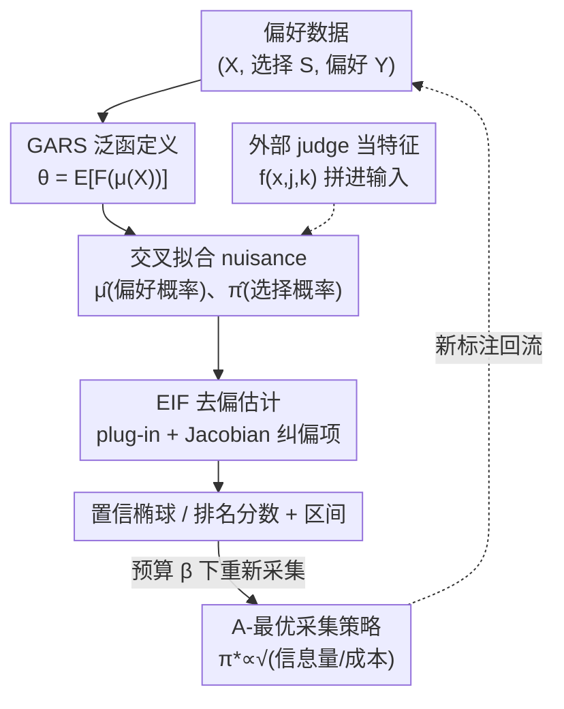

# Nonparametric LLM Evaluation from Preference Data

**会议**: ICML 2026  
**arXiv**: [2601.21816](https://arxiv.org/abs/2601.21816)  
**代码**: https://github.com/DennisFrauen/NonparametricLLMEval  
**领域**: LLM评估  
**关键词**: 偏好数据排名, 去偏机器学习, 半参数有效性, 置信区间, 实验设计  

## 一句话总结
针对当前 LLM 排行榜普遍依赖参数化 Bradley–Terry 模型、在模型误设或接入黑盒 ML/LLM-as-a-judge 时无法给出有效置信区间的问题，本文提出非参数框架 **DMLRank**：把排名分数统一抽象成"上下文偏好概率的泛函"（GARS），再用去偏机器学习推出渐近有效、带合法置信区间的估计量，并进一步给出预算约束下最优的偏好采集策略。

## 研究背景与动机
**领域现状**：用 LLM A 和 B 对同一 prompt 生成回答、让评判者（人类众包或 LLM-as-a-judge）选出更好的一方，是 LM Arena 等排行榜的主流评测范式。实践中"二选一"的偏好比"给绝对分"更容易、更可靠，因此排行榜的核心任务就是从一堆成对比较里反推出每个模型的排名分数，并给出该分数的置信区间。

**现有痛点**：偏好数据只含**相对信息**——你永远观测不到某个回答的绝对质量分，只知道"这次 A 比 B 好"。要把相对信息变成排名分数，绝大多数排行榜（包括 LM Arena）都建立在参数化的 **Bradley–Terry（BT）模型**上：它假设每个模型有一个潜在分数 $r_j(x)$，偏好概率在 logit 尺度上加性可分，$\mu_{jk1}(x)=\sigma\big(r_j(x)-r_k(x)+b(x)\big)$。

**核心矛盾**：参数化 BT 有三个绕不开的缺陷——(i) **模型误设即有偏**：若真实偏好存在循环（A>B>C>A）或 BT 连接函数不成立，估计就是错的；(ii) **和灵活 ML 不兼容**：一旦用神经网络等黑盒模型去拟合上下文相关的 $r_\rho(x)$，标准的渐近推断保证就被破坏，置信区间不再合法；(iii) **难融合代理标签**：现代评测常把少量高质量人工标签和大量廉价的 auto-rater / LLM-as-a-judge 代理标签混用，但参数化模型在融合这些代理信号的同时保持合法推断并不直接。

**本文目标**：建立一个**非参数、且自带合法置信区间**的排名推断框架，既能塞进任意黑盒 ML 估计器，又能接外部 judge，还能指导"该花预算去标注哪些对比"。

**核心 idea**：不再把排名分数定义成某个参数化模型的参数，而是直接把它定义成**偏好概率 $\mu(X)$ 的已知泛函** $\theta=\mathbb{E}[F(\mu(X))]$；这样估 $\theta$ 就只需估 $\mu$（任意黑盒都行），再用去偏机器学习（DML）纠正 plug-in 偏差，拿到半参数有效的估计和合法区间。

## 方法详解

### 整体框架
DMLRank 要解决的是"从成对偏好数据 $\mathcal{D}=\{(x_i,s_i,\tilde y_i)\}$ 里估出 $K$ 个模型的排名分数，并给出合法置信区间"。它的整体转法分三层：**先把排名目标抽象成偏好概率的泛函（GARS）**，**再用去偏估计量（基于高效影响函数 EIF）把它估出来且带合法区间**，**最后反过来指导该怎么花预算采集新偏好**。

记两个待估的 nuisance（讨厌因子）：偏好类别概率 $\mu_{jkc}(x)=\mathbb{P}(Y_{jkc}=1\mid X=x)$（在 pair $(j,k)$、上下文 $x$ 下落到类别 $c$ 的概率，$c$ 可以是"j 赢/k 赢/平局"），以及选择概率 $\pi_{jk}(x)=\mathbb{P}(S_{jk}=1\mid X=x)$（该 pair 是否被标注）。整套流程围绕这两个量展开：用交叉拟合（cross-fitting）估 $\hat\mu,\hat\pi$，代入去偏公式得到 $\hat\theta_{\mathrm{EIF}}$，再用其协方差构造置信椭球。

### 关键设计

**1. GARS：把排名分数定义成偏好概率的泛函，一套框架统一多种排名定义**

参数化 BT 的根本问题是"把排名目标绑死在一个具体参数模型上"。本文反其道而行：给定一个**已知**函数 $F:[0,1]^{K\times K\times C}\to\mathbb{R}^d$，把广义平均排名分数（Generalized Average Ranking Score, GARS）定义为 $\theta=\mathbb{E}[F(\mu(X))]$。这个抽象的妙处是 $F$ 一换就覆盖了社会选择理论里几乎所有常用排名口径：

- **BT 投影**：取 $F(\mu(x))=H(H^\top L_0 H)^{-1}H^\top B^\top \ell(\mu(x))$，其中 $L_0=B^\top B$ 是比较图的 Laplacian、$\ell$ 是边上的对数几率向量。它等价于把边的 log-odds 向量 $L^2$-投影到分数空间，在真 BT 成立时正好还原 $\mathbb{E}[r(X)]$。
- **Borda / 胜率分**：$F_j(\mu(x))=\frac{1}{2(K-1)}\sum_{k\neq j}(\mu_{jk1}(x)+\mu_{kj2}(x))$，即模型 $j$ 平均被偏好的概率。
- **Rank Centrality（RC）**：先用对称化偏好概率构造随机矩阵 $T(\mu(x))$，取其平稳分布 $F(\mu(x))=(I-T^\top+\mathbf{1}\mathbf{1}^\top)^{-1}\mathbf{1}$，直观上是"评判者按偏好在各模型间随机游走，长期停留时间越长越好"，天然能容忍偏好循环。

因为 GARS 不假设任何参数链接，它对 BT 误设（如循环偏好）天然鲁棒；而且只要能估出 $\mu$，就能估 $\theta$——这把"排名推断"彻底解耦成了"一个分类问题"。

**2. EIF 去偏估计量：纠正 plug-in 偏差，给出合法置信区间**

最朴素的做法是 plug-in：$\hat\theta=\frac1n\sum_i F(\hat\mu(x_i))$。但 $\hat\mu$ 的估计误差（数据少、judge 有偏）会经 $F$ 传播到 $\hat\theta$，造成 plug-in 偏差，区间覆盖率失效。本文基于半参数有效性理论推出 $\theta$ 的**高效影响函数（EIF）**：

$$\phi(O,\eta,\theta)=F(\mu(X))-\theta+\sum_{j\neq k}\frac{S_{jk}}{\pi_{jk}(X)}\,J_{jk}(\mu(X))\big(Y_{jk}-\mu_{jk}(X)\big)$$

其中 $J_{jk}(\mu)=\nabla_{\mu_{jk}}F(\mu)$ 是泛函 $F$ 对该 pair 偏好概率的 Jacobian。据此构造一步去偏估计 $\hat\theta_{\mathrm{EIF}}$（Eq. 14），它在弱假设下渐近有效（达到任何无偏估计的最小方差）且渐近正态 $\sqrt n(\hat\theta_{\mathrm{EIF}}-\theta)\to\mathcal{N}(0,\Sigma)$，从而 $\hat\Sigma$ 直接给出合法的置信椭球 $\mathcal{E}=\{\vartheta: n(\hat\theta-\vartheta)^\top\hat\Sigma^{-1}(\hat\theta-\vartheta)\le\chi^2_{d,1-\alpha}\}$。

纠偏项有两层精巧：用 $1/\pi_{jk}$ 给"很少被标注的 pair"加大纠偏（类似因果推断里的 AIPTW），用 Jacobian $J_{jk}$ 按"该 pair 对目标 $\theta$ 影响多大"调节纠偏强度——若 $\theta$ 根本不依赖 $\mu_{jk}$，Jacobian 为零、不纠偏。正因有这一项，即便 $\hat\mu$ 用黑盒 ML 拟合，区间依然合法。

**3. 交叉拟合 + judge-as-features：把外部 judge 当特征，好就用、坏就忽略**

要让上面的渐近保证成立，$\hat\mu,\hat\pi$ 必须用**交叉拟合**得到：把 $\mathcal{D}$ 随机分成 $V\ge2$ 折，对每折 $v$ 用其余折训练 $\hat\mu^{(-v)},\hat\pi^{(-v)}$，只在留出折上预测，避免过拟合污染推断。其中估 $\mu$ 是个只在已标注 pair 上训练的 $C$ 类分类问题，估 $\pi$ 是个在全部 pair 上训练的二分类问题。

接外部 judge（auto-rater / LLM-as-a-judge）时，本文用 **judge-as-features**：把 judge 预测 $f(x,j,k)$ 直接拼进模型输入 $\tilde x_i=(x_i,f(x_i,j,k))$。这一招的好处是**自适应**——judge 质量高，$\hat\mu$ 学会利用它降低有限样本误差；judge 质量低，$\hat\mu$ 学会忽略这一维输入，仍保持一致估计和合法区间。交叉拟合保证 judge 特征的任何过拟合都被限制在训练折内，不会泄漏到推断。这恰好解决了痛点 (iii)：稀缺人工标签与廉价代理标签能在一个合法推断框架里融合。

**4. A-最优采集策略：预算约束下，把标注预算花在最该花的对比上**

前面假设偏好数据已由某固定标注策略 $\pi$ 生成。本文进一步问：如果让我们自己设计 $\pi$，在"标注 pair $(j,k)$ 成本为 $c_{jk}$、总预算 $\beta$"约束下，怎么采集才能让最终去偏估计的方差（即置信区间宽度）最小？定义 A-最优为最小化 $\mathrm{tr}(\Sigma(\pi))$，可推出闭式解：

$$\pi^*_{jk}(x)=\mathrm{clip}_{[\alpha,1]}\sqrt{\frac{\mathrm{tr}\big(J_{jk}(\mu(x))V_{jk}(\mu(x))J_{jk}(\mu(x))^\top\big)}{\lambda_A\,c_{jk}}}$$

其中 $V_{jk}(\mu(x))=\mathrm{Var}(Y_{jk}\mid X=x)$。这个策略把更多标注概率分给同时满足"内在信息量大（$V_{jk}$ 大，即人类对该 pair 分歧越大）"和"对目标 $\theta$ 影响大（Jacobian $J_{jk}$ 大）"的 pair，并用成本 $c_{jk}$ 在分母里压低昂贵 pair，$\lambda_A$ 通过一维二分搜索调到刚好满足预算。落地时只需先用历史数据或外部 judge 估出 $\hat\mu$ 代入闭式，再按 $S_{jk}\sim\mathrm{Bernoulli}(\hat\pi^*_{jk}(x))$ 独立采样决定标不标。

### 损失函数 / 训练策略
本文没有端到端训练，核心是一个**两阶段半参数估计过程**：阶段一用交叉拟合训练 nuisance 模型（实现里用 LightGBM 做 $C$ 类/二类分类，3 折 CV 调参）；阶段二代入 Eq. 14 算去偏估计 $\hat\theta_{\mathrm{EIF}}$、用 Eq. 16 估协方差 $\hat\Sigma$，再用多重检验校正给出 95% 同时置信区间。整套流程对 $\mu$ 的估计器完全模型无关。

## 实验关键数据

### 主实验
合成数据上对比去偏估计与 plug-in（同一 nuisance 估计器），跨 Borda / BT / RC 三种 GARS、三种样本量。去偏估计在估计误差和覆盖率上全面胜出：覆盖率逼近目标 95%，而 plug-in 覆盖率严重失效（大量落在 0.05~0.20）。

| GARS | 估计量 | 误差 ($n{=}1000$) | 覆盖率 ($n{=}1000$) | 误差 ($n{=}3000$) | 覆盖率 ($n{=}3000$) |
|------|--------|------|--------|------|--------|
| Borda | Plug-in | 0.38 | 0.17 ❌ | 0.10 | 0.15 ❌ |
| Borda | Debiased | **0.15** | **0.94** ✅ | **0.05** | **0.97** ✅ |
| BT | Plug-in | 0.62 | 0.09 ❌ | 0.22 | 0.05 ❌ |
| BT | Debiased | **0.25** | **0.90** ✅ | **0.08** | **0.90** ✅ |
| RC | Plug-in | 0.52 | 0.12 ❌ | 0.18 | 0.05 ❌ |
| RC | Debiased | **0.27** | **0.91** ✅ | **0.09** | **0.95** ✅ |

### 消融 / 分析实验
A-最优采集策略 vs 均匀随机采集（预算 $\beta=2000$，排名 MSE，$\times10^2$）：A-最优在三种 GARS 上都更低。BT 误设实验（偏离参数 $\gamma$）显示：BT 正确时"限定 BT 的去偏估计"最优（效率界更低），但一旦误设，**去偏投影估计**就反超 plug-in 和误设的去偏估计，体现其鲁棒性。

| 采集策略 | Borda | BT | Rank Centrality |
|---------|-------|-----|------|
| A-最优策略 | **0.130** | **2.861** | **0.017** |
| 随机策略 | 0.141 | 2.974 | 0.020 |

### 关键发现
- **去偏是覆盖率合法性的关键**：plug-in 即使误差不大，置信区间覆盖率也几乎全错；去偏后覆盖率稳定回到 ~95%。
- **judge-as-features 单调有益**：外部 judge 质量越高，去偏估计误差越低，且低质量 judge 不会拖累一致性。
- **真实数据可用**：在 Chatbot Arena（$n=32980$ prompts、$K=20$ 模型、含平局类别）上，用 toxicity 概率 + TF-IDF/SVD 100 维 prompt 表示作为上下文，给出 Borda/BT/RC 的同时置信区间，部分模型排名相对 Zheng et al. 基线发生可见变动；plug-in 区间宽度近乎为零（即过度自信）。

## 亮点与洞察
- **"排名分数 = 偏好概率的泛函"是核心抽象**：一旦把 BT、Borda、RC 都写成 $\mathbb{E}[F(\mu(X))]$，排名推断就退化成"估一个分类器 $\mu$ + 已知 $F$ 的去偏"，黑盒 ML 可以即插即用——这是把现代 ML 安全接入排行榜推断的关键一步。
- **Jacobian 加权纠偏很巧**：纠偏强度随"该 pair 对目标的影响"自适应缩放，$\theta$ 不依赖某 pair 时纠偏自动归零，既高效又可标量化计算（Jacobian 常有闭式）。
- **judge-as-features 的"好就用坏就忽略"**：把外部 judge 当输入特征而非真值，是融合代理标签同时不牺牲合法推断的优雅做法，可迁移到任何"廉价代理 + 稀缺金标"的评测场景。
- **采集策略把统计效率反推成实验设计**：A-最优闭式解直接告诉你"该标注哪些对比最划算"，把评测从被动分析变成主动设计。

## 局限与展望
- **依赖 nuisance 估计质量与交叉拟合假设**：合法性建立在 positivity、MAR（缺失随机）等标准半参数假设上，现实中若选择机制依赖未观测因素，区间合法性会受影响。
- **上下文表示是工程瓶颈**：真实数据里用 TF-IDF+SVD 表示 prompt 较粗糙，更强的上下文编码可能改变结论，但也会让 nuisance 估计更难。
- **作者明确声明**：实验目的是验证方法学（合成数据可对真值），而非产出 SOTA 排行榜；K=20 规模下的可扩展性、更大模型池下的计算开销仍需进一步验证。
- A-最优只优化了 trace（A-最优），换成 determinant（D-最优）等准则可能更贴合"椭球体积最小"，附录有扩展但正文未展开比较。

## 相关工作与启发
- **vs 参数化 BT（LM Arena / Frick et al.）**：他们用固定参数链接估 $\theta$，误设即有偏、接黑盒 ML 区间失效；本文把目标改成非参数泛函 + 去偏估计，误设鲁棒且区间合法，BT 只是其一个特例。
- **vs PPI / 半监督评测（Chatzi et al. 2024、Fisch et al. 2024）**：他们也用黑盒预测器降低标注成本，但多聚焦特定排名口径；本文用统一的 EIF 框架同时覆盖 BT/Borda/RC 多种估计目标，并额外解决最优数据采集。
- **vs 半参数 BT 推断（Li & Li 2025、Spokoiny 2025）**：这些工作仍绑在 BT 型分数模型上；DMLRank 不限于 BT，可处理任意排名泛函，且把"该标哪些对比"纳入框架。

## 评分
- 新颖性: ⭐⭐⭐⭐⭐ 把排行榜排名统一成偏好概率泛函 + DML 去偏，并打通外部 judge 与最优采集，思路完整且原创。
- 实验充分度: ⭐⭐⭐⭐ 合成数据全面验证效率/覆盖率/鲁棒性，真实数据演示到位，但缺与更多参数化基线的横向比较。
- 写作质量: ⭐⭐⭐⭐ 理论推导严谨、动机清晰，但偏统计、对非半参数背景读者门槛较高。
- 价值: ⭐⭐⭐⭐⭐ 直击当下排行榜"用黑盒 ML 就没法给合法区间"的真实痛点，对评测基础设施有直接价值。

<!-- RELATED:START -->

## 相关论文

- [\[ICML 2026\] RouteJudge: An Open Platform for Reproducible and Preference-Aware LLM Routing](routejudge_an_open_platform_for_reproducible_and_preference-aware_llm_routing.md)
- [\[ICLR 2026\] Preference Leakage: A Contamination Problem in LLM-as-a-judge](../../ICLR2026/llm_evaluation/preference_leakage_a_contamination_problem_in_llm-as-a-judge.md)
- [\[ICLR 2026\] Unpacking Human Preference for LLMs: Demographically Aware Evaluation with the HUMAINE Framework](../../ICLR2026/llm_evaluation/unpacking_human_preference_for_llms_demographically_aware_evaluation_of_long-fo.md)
- [\[ICML 2026\] Resolution Diagnostics for Paired LLM Evaluation](resolution_diagnostics_for_paired_llm_evaluation.md)
- [\[ICLR 2026\] Subliminal Signals in Preference Labels](../../ICLR2026/llm_evaluation/subliminal_signals_in_preference_labels.md)

<!-- RELATED:END -->
