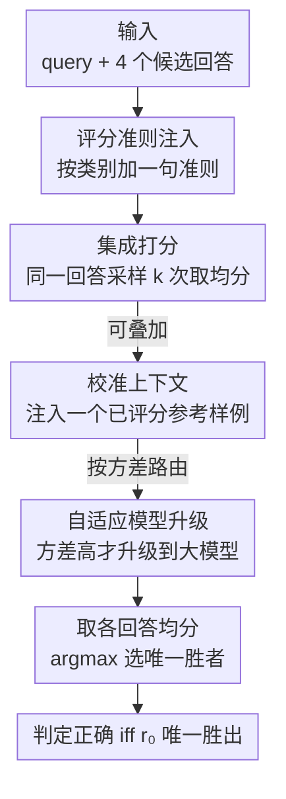

# On Cost-Effective LLM-as-a-Judge Improvement Techniques

**会议**: ICML 2026  
**arXiv**: [2604.13717](https://arxiv.org/abs/2604.13717)  
**代码**: https://github.com/composo-ai/llm-judge-criteria-ensembling  
**领域**: LLM评估  
**关键词**: LLM-as-a-judge, 集成打分, 评分准则, 校准, 成本-精度权衡  

## 一句话总结
针对 LLM-as-a-judge 评判准确率高度依赖 prompt 与聚合策略、却缺乏"哪些技巧真正划算"的系统证据这一问题，本文在 RewardBench 2 上以"对随机评判器做噪声控制"为统一视角，系统对比了**集成打分、任务专属评分准则、校准上下文、自适应模型升级**四种即插即用技巧，发现"评分准则注入（几乎零成本）+ 集成打分"两招就能拿到最高 85.8% 准确率（较 baseline +13.5pp），并占据成本-精度 Pareto 前沿，而校准与模型升级被它压制。

## 研究背景与动机
**领域现状**：LLM-as-a-judge 已是 RLHF 奖励建模、benchmark、线上质量监控里最主流的自动评测手段——让一个评判模型给候选回答打分或排序，输出一个可用于奖励和评测的信号。

**现有痛点**：评判可靠性在不同 prompt 策略和聚合方法下波动很大。已有研究揭示了一堆系统性失败模式（位置偏置、冗长偏置、与人类判断发散），社区也提出了不少改进招数（集成、加准则、校准、路由），但**缺乏在统一 benchmark、统一成本口径下"到底哪招值得用、值多少钱"的横向证据**。实践者面对一堆技巧不知道该叠哪些。

**核心矛盾**：评判准确率和调用成本之间存在权衡——集成多次采样能提精度但成倍烧钱，加准则几乎免费但效果未知，校准和路由听上去合理但不一定真有增量。问题是：在**同样的成本预算**下，哪些技巧真正推动 Pareto 前沿？

**本文目标**：在 RewardBench 2（RB2）上，把四种 drop-in 技巧放进同一套评测协议、同一套成本口径里系统对比，外加一个"四招全叠"的组合条件测加性，给出可落地的成本-精度结论。

**切入角度**：作者用一个统一视角看待这四招——**对"随机评判器"做噪声控制**。温度 $>0$ 时评判器对一个回答的打分是个分布，单次采样是带噪样本：集成 = 对单次调用噪声做蒙特卡洛平均；准则注入 = 锐化回答之间的区分度；每个回答的打分方差 = 不确定性信号（可用于路由）。

**核心 idea**：与其堆复杂技巧，不如系统量化"噪声控制"四招的成本-精度，结论是**准则注入 + 集成**这对组合几乎吃掉了全部收益，且小模型从集成中受益尤其大，让"高精度评判器"在低成本下也变得可及。

## 方法详解

### 整体框架
评测协议固定：RB2 每条样本含一个 query 和 4 个候选回答 $r_0,\dots,r_3$（$r_0$ 永远是正确答案），评判器 $f$ 给每个回答打 1–10 的整数分；预测胜者是均分**严格最高**的回答，只有 $r_0$ 唯一胜出才算对（任何并列都算错，这种保守的判平规则避免奖励"分不出高下"的评判器）。在这个固定协议上，四种技巧都是对"评判调用"的即插即用改造，可单用也可叠加（组合条件就是四招全叠）。

### 关键设计

**1. 集成打分：对单次调用噪声做蒙特卡洛平均**

单次采样的评判分是从评判分布里抽的带噪样本，方差大、容易选错。集成打分对每个回答用 API 的 `n` 参数一次请求 $k$ 个独立 completion，取均分再选胜者：

$$\hat y=\operatorname*{arg\,max}_i\;\bar s_i,\qquad \bar s_i=\frac1k\sum_{j=1}^k s_{ij}$$

均分是期望分的蒙特卡洛估计，方差随 $k$ 下降、准确率随之上升。实验用 $k=8$。它还顺带大幅压低判平率（因为现在要"4 个均分恰好相等"才算平），full 类从 $k{=}1$ 的 20.4% 降到 $k{=}8$ 的 4.5%。代价是输出 token 随 $k$ 线性增长（输入 token 因 `n` 共享只算一次），full $k{=}8$ 约 5× baseline 成本。

**2. 任务专属评分准则注入：锐化回答间区分度，且几乎零成本**

RB2 基础 prompt 只让评判器笼统考虑"有用性、相关性、准确性、深度、创造性、细节"，但不同类别该侧重的维度不同——数学题该看推理正确性而非创造性，安全题该看是否恰当拒答。准则注入就是在基础 prompt 后**追加一句类别专属准则**（如数学："关注数学推理是否逻辑有效、步骤是否正确、最终答案是否准确"），五个类别各一句、且在数据采集前就固定提交（防止事后调参）。

它的妙处是几乎免费——只多几个输入 token，不改打分协议——却把评判器的注意力聚到"该类别真正要比的维度"上，锐化了回答之间的区分度。$k{=}1$ 时单加准则就 +3.0pp（74.7%，配对 bootstrap $P(\text{criteria}>\text{baseline})>0.999$），且收益主要来自 Math（+12.0pp）和 Safety（+3.3pp）。关键是它和集成**正交**：$k{=}8$ 时准则仍能再贡献 +2.1pp，而校准在 $k{=}8$ 时已无增量。

**3. 校准上下文：注入已评分参考样例锚定打分尺度**

LLM 评判器对锚定效应敏感——同一回答会因为前面看过什么样例而被打不同的分。校准上下文对每个目标 query 随机选一个同类别样例、先用 full 模型 $k{=}1$ 给它的正确回答打一次分，再把这个参考分作为上下文注入，给四个候选打分时锚定打分尺度，降低 query 间方差。作者测了四种参考变体：high（锚到正确回答）、low（锚到错误回答）、both（各一个、展示满量程）、cross-category（跨类别，作为类别特异性的对照）。

结果是"有效但不增量"：$k{=}1$ 时四种变体都比 baseline +1–2pp，low 略好于 high（73.8% vs 72.4%，锚到已知坏样例可能比匹配已知好样例更易区分），cross-category 与同类别几乎一样（说明收益来自一般的尺度锚定而非类别迁移）。但 $k{=}8$ 时所有变体都落在集成（81.5%）的 ±0.2pp 内——集成已经把打分噪声压够了，锚定的好处变冗余。

**4. 自适应模型升级：用打分方差当不确定性信号做路由（负面结果）**

mini 模型比 full 便宜约 3× 但略弱。若能识别"mini 会答错的样例"只把它们路由到 full，就能省钱。作者用 mini 的**每回答打分方差** $\sigma_i=\mathrm{std}(s_{i,1},\dots,s_{i,k})$ 当路由信号，理由是方差与正确性有弱但系统的相关（$r=-0.13$，作为错误分类器 AUC=0.60），且 mini 方差能追踪 full 方差（$r=0.421$，nano 更弱 $r=0.106$）。三种升级策略：硬方差路由（超阈值就升级）、sigmoid 软混合（连续混合 mini/full 分）、方差驱动的自适应集成（按需变 full 调用数）。

但**三种都不推荐**。Section 5.1 的分析点明：每回答方差作为不确定性信号太弱，路由收益不足以盖过直接上"准则 + 集成"。在 Pareto 前沿上，软混合（80.2%，6.1× 成本）和方差驱动集成（74.9%，1.6× 成本）都被"准则 + 集成"在同等或更低成本下压制。这是个诚实的负面结论：方差路由听上去合理，实测不划算。

## 实验关键数据

### 主实验
RB2 共 1753 条样本，5 个类别（Factuality 475 / Focus 495 / Math 183 / Precise IF 159 / Safety 441），跨 full/mini/nano 三档模型、OpenAI GPT-5.4 与 Anthropic Claude 两家。成本以"GPT-5.4 full、$k{=}1$"为 1.0× 锚点。

| 条件 | 模型 | 总体准确率 (95% CI) | 成本 | vs Base |
|------|------|------|------|------|
| Baseline ($k{=}1$) | GPT-5.4 | 71.7% (±2.1) | 1.0× | — |
| Criteria ($k{=}1$) | GPT-5.4 | 74.7% (±2.1) | 1.1× | +3.0pp |
| Ensemble ($k{=}8$) | GPT-5.4 | 81.5% (±1.8) | 5.0× | +9.8pp |
| Criteria+Ensemble ($k{=}8$) | GPT-5.4 | 83.6% (±1.7) | 5.3× | +11.9pp |
| Mini ($k{=}8$) | Haiku 4.5 | 84.8% (±1.7) | 1.3× | +13.1pp |
| **Criteria (mini $k{=}8$)** | **Haiku 4.5** | **85.8% (±1.7)** | **1.3×** | **+13.5pp** |
| Nano ($k{=}8$) | GPT nano | 71.4% (±2.1) | 0.4× | -0.3pp |

### 被压制的技巧（消融对照）

| 条件 | 模型 | 总体准确率 | 成本 | 结论 |
|------|------|------|------|------|
| Calibration low ($k{=}8$) | GPT-5.4 | 81.7% | 5.6× | ≈ 纯集成，无增量 |
| Combined（四招全叠） | GPT-5.4 | 82.6% | 6.8× | 不如准则+集成(83.6%)却更贵 |
| Soft blend（测试集） | GPT-5.4 | 80.2% | 6.1× | 被压制 |
| Variance-informed（测试集） | GPT-5.4 | 74.9% | 1.6× | 被压制 |

### 关键发现
- **准则 + 集成吃掉几乎全部收益**：两招正交、各自独立贡献，full 类合计 +11.9pp（83.6%）；组合条件四招全叠反而 82.6%、更贵，说明校准/路由没带来正交增量。
- **小模型从集成中受益尤其大**：集成绝对增益随基础能力下降而上升（full +9.8pp、mini +14.4pp、nano +19.1pp）；mini+criteria 81.5% 以约 1/4 成本追平 full $k{=}8$ 集成，跨类峰值 85.8%（Haiku mini）超过 panel 里最好的 full 集成。
- **集成收益边际递减**：各档大部分增益在 $k=3$ 就拿到，再加 $k$ 收益变小——但"抬高下限不抬高上限"，nano $k{=}8$ 仍比 mini $k{=}8$ 低 7.8pp。
- **Precise IF 是最难类别**：所有条件下都最低（baseline 仅 34.0%），格式约束类对评判器最难。
- **跨厂商可泛化**：结论在 OpenAI GPT 与 Anthropic Claude 两家上都成立。

## 亮点与洞察
- **"噪声控制"统一视角很提纲挈领**：把集成（蒙特卡洛平均）、准则（锐化区分度）、方差（不确定性信号）三件看似无关的技巧收进同一框架，让"为什么有效/为什么不够"有了机制解释。
- **"几乎零成本的准则注入 +2~3pp"是最高性价比的可复用 trick**：只追加一句类别准则、不改协议，且和集成正交，任何 LLM-as-a-judge pipeline 都能直接抄。
- **小模型 + 集成 + 准则 = 低成本高精度评判器**：mini+criteria 以 1/4 成本追平 full 集成，对预算敏感的线上评测极具实践价值。
- **诚实报告负面结果**：明确说自适应模型升级三种变体都不推荐、组合条件不如更简单的两招，避免社区盲目堆技巧。

## 局限与展望
- **只在 RB2 上验证**：RB2 是 best-of-4、整数 1–10 打分的特定协议，结论能否迁移到成对比较、连续打分、开放式生成评测尚需验证。
- **成本用 API 定价代理算力**：闭源模型不公开参数量，作者用 API 价格当成本代理并只报比值；绝对成本会随厂商定价漂移。
- **方差作为路由信号偏弱**：$r=-0.13$、AUC=0.60 说明每回答方差的判别力有限，更强的不确定性信号（如答案分布熵、跨样本一致性）可能让路由重新划算，本文未深挖。
- **部分 query 被内容过滤拒答**导致各条件样本量略有差异（$N=1700$–1746），虽报告了交集 $N=1710$ 排名不变，但安全类的可比性仍受一点影响。
- **准则是人工固定的一句话**：虽几乎免费，但准则质量靠人工设计，自动生成/优化类别准则是自然的延伸方向。

## 相关工作与启发
- **vs Self-Consistency（Wang et al. 2023）/ Panel-of-Judges（Verga et al. 2024）**：他们对推理路径取多数投票、或用多个不同模型组 panel；本文聚焦"同一模型多次采样取均分"，并系统刻画了不同集成规模和模型档位下的成本-精度曲线。
- **vs G-Eval（Liu et al. 2023）/ 生成式评判（Li et al. 2024）**：这些方法靠 CoT、form-filling、生成详细 rationale 提升评判，prompt 复杂度高；本文走极简路线——只加一句类别准则，证明轻量 prompt 工程就能拿到大头收益。
- **vs FrugalGPT（Chen et al. 2024）**：FrugalGPT 从便宜到贵链式调用、置信足够就停；本文在评判场景测了方差驱动路由，结论是该信号太弱、不如直接上准则+集成，给"路由省钱"泼了盆冷水。

## 评分
- 新颖性: ⭐⭐⭐ 技巧本身多为已知组合，新意在"噪声控制"统一视角和系统的成本-精度横评与负面结论。
- 实验充分度: ⭐⭐⭐⭐ 1753 样本 × 多档模型 × 两厂商 × bootstrap CI，含组合与多种路由变体，证据扎实。
- 写作质量: ⭐⭐⭐⭐ 结构清晰、诚实报告负面结果、成本口径交代到位。
- 价值: ⭐⭐⭐⭐ 直接回答"做评判器该叠哪些技巧最划算"，对工程落地有很强的即用价值。

<!-- RELATED:START -->

## 相关论文

- [\[ICML 2026\] Reasoning Is Not Free: Robust Adaptive Cost-Efficient Routing for LLM-as-a-Judge](reasoning_is_not_free_robust_adaptive_cost-efficient_routing_for_llm-as-a-judge.md)
- [\[ICML 2026\] REAL：把回归感知奖励塞进 RL，让 LLM-as-a-Judge 学会"差一分也是差"](real_regression-aware_reinforcement_learning_for_llm-as-a-judge.md)
- [\[ACL 2026\] CUB: Benchmarking Context Utilisation Techniques for Language Models](../../ACL2026/llm_evaluation/cub_benchmarking_context_utilisation_techniques_for_language_models.md)
- [\[AAAI 2026\] LLM-as-a-Judge for Scalable Test Coverage Evaluation](../../AAAI2026/llm_evaluation/llm-as-a-judge_for_scalable_test_coverage_evaluation_accuracy_operational_reliab.md)
- [\[ICLR 2026\] Preference Leakage: A Contamination Problem in LLM-as-a-judge](../../ICLR2026/llm_evaluation/preference_leakage_a_contamination_problem_in_llm-as-a-judge.md)

<!-- RELATED:END -->
