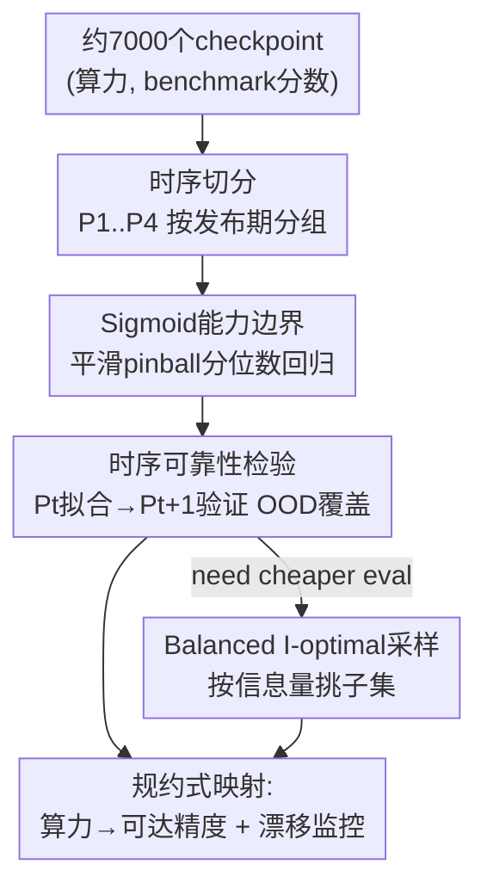

# Prescriptive Scaling Reveals the Evolution of Language Model Capabilities

**会议**: ICML2026  
**arXiv**: [2602.15327](https://arxiv.org/abs/2602.15327)  
**代码**: 有（论文附 Blog / Datasets / Code 链接，发布 Proteus-2k 数据集）  
**领域**: LLM评测 / Scaling Law  
**关键词**: 规约式scaling、能力边界、分位数回归、时序可靠性、I-最优采样  

## 一句话总结
用 5k 历史 + 2k 自测、横跨 2022–2026 的约 7000 个模型 checkpoint，把"给定预训练算力预算能拿到多少下游精度"建模成 log-算力的**单调饱和 sigmoid 能力边界**（高分位数回归），并验证这条边界在时间上是否稳定、能否用约 20% 评测预算高效重建。

## 研究背景与动机

**领域现状**：预训练 scaling law（Kaplan、Chinchilla）已经把"算力 → loss/困惑度"刻画得相当平滑可预测，scale 本身成了核心设计变量，工程上可以提前为训练排算力预算。

**现有痛点**：但部署的模型几乎从不是裸预训练 checkpoint，而是经过指令微调、RLHF、领域适配等**异质后训练**流水线。从业者真正关心的问题——"给定预训练算力预算 $C$，后训练之后在某个 benchmark 上大概能稳到多少分"——现有 scaling law 答不了。同算力的模型在推理、指令跟随、领域问答上的下游表现差异巨大；预训练 loss 和下游精度之间耦合很弱，benchmark 还受数据污染、评测协议等噪声干扰。

**核心矛盾**：scaling law 建模的是**均值趋势**，而部署决策需要的是"在当代后训练实践下**可达到**的性能上界"。把异质后训练 recipe 的方差当噪声拍平，会丢掉"算力能换来多少潜力"这个最有用的信号；而直接取观测最大值又会被离群点带偏。

**本文目标**：(1) 找一个对离群点和 recipe 差异稳健的函数，把"log-算力 → 可达后训练精度"刻画出来；(2) 把"时间"当成一等坐标轴，检验这条边界随后训练技术演进是否仍然可预测；(3) 在有限评测预算下高效重建这条边界。

**切入角度**：作者不去估"真实最大精度"，而是估观测精度的**高条件分位数**（$\tau=0.98$）$q_\tau(z)\approx Q_\tau(Y\mid Z=z)$，$z=\log_{10}C$。分位数对离群点天然稳健，又能代表"足够好的后训练能摸到的天花板"。

**核心 idea**：用**单调饱和 sigmoid 分位数回归**把预训练算力预算翻译成可靠的下游性能期望，并以"早期 generation 拟合、晚期 release 验证"的时序切分来监控能力边界何时发生漂移——这就是作者命名的 **Prescriptive Scaling（规约式 scaling）**。

## 方法详解

### 整体框架
方法本质是一套"从大规模异质 checkpoint 评测中估计能力边界、并验证其时序可靠性、再压缩评测成本"的统计流水线。输入是大量 (模型, 预训练算力 $C_i$, benchmark 分数 $y_i\in[0,1]$) 的观测三元组（来自 Open LLM Leaderboard v1/v2、前沿模型榜单、以及作者自测的 2.4k 开源权重模型 Proteus-2k）；输出是每个任务一条 log-算力到可达精度的能力边界函数，外加一份"何时该重拟合"的时序诊断。

整条流水线分四步走：先把模型按发布时间切成 4 个 chronological period $P_1,\dots,P_4$（数据准备 + 时序切分）；再用平滑 pinball loss 拟合 $\tau$-分位数能力边界，比较常数 / 分箱 / sigmoid / I-spline 四类函数，选出 sigmoid；然后做"$P_t$ 拟合、$P_{t+1}$ 验证"的滚动 OOD 检验，看覆盖误差是否 <2%；最后在硬评测预算约束下，用 balanced I-optimal 设计挑选最信息量的子集，少花评测算力也能重建边界。

### 关键设计

**1. Sigmoid 能力边界 + 平滑 pinball 分位数回归：把"可达上界"而非均值建出来**

针对"均值趋势答不了部署预期、最大值又被离群点带偏"的痛点，作者改估高条件分位数 $\tau=0.98$。函数形式选单调饱和 sigmoid：$q_\tau^{\text{sig}}(z;\theta)=y_0+L\,\sigma(a+\beta z)$，其中 $\sigma(t)=\tfrac{1}{1+e^{-t}}$，约束 $\beta\ge 0$、$0\le y_0\le 1$、$0\le L\le 1-y_0$，保证它随算力单调上升且在 $[0,1]$ 内饱和——这正好对应"算力够大后精度会顶到天花板"的物理直觉。拟合目标是平滑化的 pinball（弹球）损失：

$$\mathcal{L}(\theta)=\sum_{i\in P_t}\ell_\tau(y_i-\hat y_i)+\lambda\,\Omega(\theta),\quad \ell_\tau(u)=\tfrac{1}{\kappa}\log(1+e^{\kappa u})+(\tau-1)u$$

取 $\tau=0.98,\ \kappa=50,\ \lambda=10^{-3}$。$\tau$ 接近 1 时损失对"低估"惩罚更重，于是拟合曲线被推到观测点云的上沿，得到"可达边界"而非中位线。这一步把"算力换潜力"从被方差淹没的信号里捞了出来。

**2. 把时间当一等坐标轴：滚动时序切分 + 覆盖误差诊断**

scaling law 通常默认"规律不随时间变"，但后训练技术每隔几个月就翻新一次，边界很可能上移。作者把所有模型按发布时间分成 $P_1(\le 2024\text{-}06)$、$P_2$、$P_3$、$P_4(2025\text{-}01\sim03)$，做三组滚动训练-验证对 $(P_t,P_{t+1})$：在 $P_t$ 上拟合边界、在 $P_{t+1}$ 上做 OOD 评估（只在 $z$ 的训练-验证重叠区评，避免外推）。诊断指标用**有符号覆盖误差** $\hat\tau_b-\tau$：在每个 log-算力分箱里算经验覆盖 $\hat\tau_b=\tfrac{1}{n_b}\sum_{i\in I_b}\mathbb{1}\{y_i\le\hat y_i\}$，负值表示欠覆盖（新模型超出预测边界比预期更频繁）。一旦某任务持续欠覆盖，就说明出现了新 recipe/架构把边界顶上去了，提示该重新拟合——这把"边界何时失效"变成了可量化、可监控的信号。

**3. Balanced I-optimal 采样：用约 20% 评测预算重建整条边界**

把每个模型全任务评一遍最准但太贵。作者借最优实验设计思路，按模型参数量 $c_i$ 作为评测成本，给定预算 $U_t=\tfrac{\alpha}{100}C_t$ 挑子集 $S_t$。核心是 sigmoid 的 Jacobian $j(z;\theta)=[1,\sigma,L\sigma(1-\sigma),L\sigma(1-\sigma)z]^\top$ 构成的信息矩阵 $M(S)=\sum_{i\in S}j(z_i)j(z_i)^\top$，用 delta 法得到各分箱中点的预测方差 $v_b(S)$，I-最优目标 $\Phi_{\text{info}}(S)=-\sum_b w_b v_b(S)$ 就是最小化平均预测方差。为了不让预算全堆在某个算力区间，再加分箱平衡项 $\Phi_{\text{bal}}(S)=\sum_b\log(n_b(S)+\varepsilon)$，最终准则 $\Phi_\lambda(S_t)=\Phi_{\text{info}}(S_t)+\lambda\Phi_{\text{bal}}(S_t)$ 在预算约束下用贪心 gain-per-cost 近似最大化。它只需模型元数据 $(z_i,c_i)$ 和局部 Jacobian，不用真去跑评测就能挑模型，于是用约 20%（部分任务低至 5%）的参数量加权评测预算就能逼近全量边界。

### 损失函数 / 训练策略
拟合目标即上面的平滑 pinball 损失，$\tau=0.98$、$\kappa=50$、$\lambda=10^{-3}$；对比函数类含常数基线、分箱常数、sigmoid、I-spline（更一般的单调样条过 sigmoid）。分箱用 group-aware 等质量分箱，绝不把相同 $z$ 值拆到不同箱。评测指标用 pinball loss（分位数精度）+ 覆盖误差（局部分位数覆盖）双指标互补。

## 实验关键数据

### 主实验
四类函数在六任务、三组滚动切分上的平均结果（绝对 pinball loss 与校准误差，越小越好）：

| 估计器 | ID Pinball | OOD Pinball | ID 校准误差 | OOD 校准误差 |
|--------|-----------|-------------|------------|-------------|
| Constant（无算力基线） | $5.35\times10^{-3}$ | $6.23\times10^{-3}$ | $4.12\times10^{-2}$ | $3.60\times10^{-2}$ |
| Binwise | $4.01\times10^{-3}$ | $5.00\times10^{-3}$ | $1.66\times10^{-2}$ | $2.81\times10^{-2}$ |
| I-spline | $4.00\times10^{-3}$ | $4.92\times10^{-3}$ | $1.83\times10^{-2}$ | $2.41\times10^{-2}$ |
| **Sigmoid** | $4.08\times10^{-3}$ | $4.93\times10^{-3}$ | $1.84\times10^{-2}$ | $\mathbf{2.21\times10^{-2}}$ |

sigmoid 在 ID pinball 上追平更灵活的 I-spline，OOD 校准误差却最低（2.2% vs 算力无关基线的 3.6%），加上形式简单，被选为默认边界函数。1024 FLOPs 预算下，0.98-分位 sigmoid 边界给出的可达精度估计：

| Benchmark | IFEval | BBH | MATH Lvl 5 | GPQA | MUSR | MMLU-PRO |
|-----------|--------|-----|-----------|------|------|----------|
| Acc.@1024 FLOPs | 0.828 | 0.700 | 0.539 | 0.424 | 0.535 | 0.563 |

### 消融实验
关键对比是函数类与采样预算的消融：

| 配置 | 关键指标 | 说明 |
|------|---------|------|
| Sigmoid（默认） | OOD 校准 2.2% | 单调饱和、OOD 最稳 |
| 换 I-spline | OOD 校准 2.4% | 更灵活但 OOD 反而略差 |
| 换 Constant | OOD 校准 3.6% | 不用算力信息，明显最差 |
| I-optimal α=20% | ≈全量边界 | 仅 20% 参数量加权评测预算 |
| I-optimal α=5%（GPQA/MUSR） | ≈全量边界 | 个别任务 5% 就够 |

### 关键发现
- **时序稳定性是任务相关的**：BBH、GPQA、MMLU-PRO、MUSR 四个任务的覆盖误差跨期都在 ±2% 内，算力-only 的 sigmoid 边界能可靠迁移到下一代开源模型；而 MATH Lvl 5（及较轻的 IFEval）出现持续欠覆盖，边界随时间稳步上移——数学推理的天花板在"进化"。
- **预训练 vs 后训练差距任务相关**：知识密集型（MMLU-PRO）的预训练裸模型已贴近后训练边界，而推理/指令跟随（MATH、IFEval）裸模型远在边界之下，后训练增益巨大。
- **算力比裸精度更能预测潜力**：后训练能力边界随算力高度单调，而预训练裸精度常违反单调性（大算力 base 反而打不过小的）；PCA 还显示算力驱动的进步主要集中在单一主导潜在轴上（前三主成分解释约 95% 方差，仅第一主成分随算力清晰单调上升）。
- **污染诊断**：对前沿模型在 AIME-2025 上未发现明显的污染导致分数虚高的证据。

## 亮点与洞察
- **把 scaling law 从"均值"换成"高分位上界"**，这个视角切换很关键：它回答的是部署者真正问的"我这点算力大概能稳到多少分"，而不是"平均会怎样"。用分位数回归天然规避离群点，是把统计工具用对地方的范例。
- **时间被当成一等坐标轴**，并把"边界失效"翻译成可监控的覆盖误差信号——这让 scaling law 从"一次性拟合"变成"可持续维护的监测系统"，新 recipe 一旦把边界顶上去就会以欠覆盖暴露出来。
- **I-optimal 采样只靠模型元数据 $(z_i,c_i)$ 和 Jacobian 选样本**，不用真跑评测就能省下 80% 评测算力，这个"先用统计设计决定评谁"的思路可直接迁移到任何昂贵 benchmark 的预算分配。
- **数学推理 vs 知识任务的饱和差异**给出一个干净的实证：有些能力很快撞到 size 决定的天花板，有些（数学）天花板还在被后训练持续推高。

## 局限与展望
- **观测性研究的固有偏差**：边界是"当前观测模型族群"的经验上界，若某个被低估的模型族/recipe 在固定算力上系统性地拿更高分，真实边界会高于估计值——作者明确把它定位成保守、可随生态更新的 decision-oriented 映射。
- **算力是唯一条件变量**：方法刻意只用预训练 FLOPs 作设计坐标，把数据混比、架构、后训练 recipe 都折叠进"可达边界"里，因此无法解释"为什么同算力差这么多"，只能给出范围。
- **预训练算力本身是估计值**：很多模型的 base FLOPs 靠推断，$z=\log_{10}C$ 的误差会传导到边界。
- **时序非平稳任务（数学）需要不断重拟合**：方法能监控漂移，但漂移本身意味着对这类任务的预测期更短、置信度更低。

## 相关工作与启发
- **vs 经典预训练 scaling law（Kaplan / Chinchilla）**：他们建"算力 → loss/精度均值"且依赖受控训练 recipe；本文建"算力 → 后训练可达精度的高分位上界"，直面异质后训练生态，并把时序可靠性纳入检验。
- **vs 下游 benchmark scaling 噪声研究（Gadre、Schaeffer 等）**：他们指出下游精度和预训练 loss 弱耦合、benchmark 依赖性强；本文不去修复均值耦合，而是绕开它直接估上界分位数，对 recipe 差异更稳健。
- **vs 时序污染分析（Dominguez-Olmedo 等）**：他们关注时间效应会抬高预训练分数；本文把时间做成滚动验证轴，用覆盖误差量化边界漂移，并顺带在 AIME-2025 上做了污染诊断。

## 评分
- 新颖性: ⭐⭐⭐⭐⭐ 把 scaling law 重构为"高分位可达边界 + 时序监控 + 预算最优采样"，视角和工具组合都很新
- 实验充分度: ⭐⭐⭐⭐⭐ 约 7000 个 checkpoint、六任务、四期滚动切分，外加 Proteus-2k 外部验证
- 写作质量: ⭐⭐⭐⭐ 统计建模严谨、findings 清晰，但公式密度高、需要一定分位数回归背景
- 价值: ⭐⭐⭐⭐⭐ 给从业者一份"算力 → 可靠性能期望"的实用映射，并释放最新评测数据集

<!-- RELATED:START -->

## 相关论文

- [\[ICML 2026\] Estimating Tail Risks in Language Model Output Distributions](estimating_tail_risks_in_language_model_output_distributions.md)
- [\[AAAI 2026\] OptScale: Probabilistic Optimality for Inference-time Scaling](../../AAAI2026/llm_evaluation/optscale_probabilistic_optimality_for_inference-time_scaling.md)
- [\[ICLR 2026\] How Reliable is Language Model Micro-Benchmarking?](../../ICLR2026/llm_evaluation/how_reliable_is_language_model_micro-benchmarking.md)
- [\[ACL 2026\] SciCustom: A Framework for Custom Evaluation of Scientific Capabilities in Large Language Models](../../ACL2026/llm_evaluation/scicustom_a_framework_for_custom_evaluation_of_scientific_capabilities_in_large_.md)
- [\[ICML 2026\] BESPOKE: Benchmark for Search-Augmented Large Language Model Personalization via Diagnostic Feedback](bespoke_benchmark_for_search-augmented_large_language_model_personalization_via_.md)

<!-- RELATED:END -->
