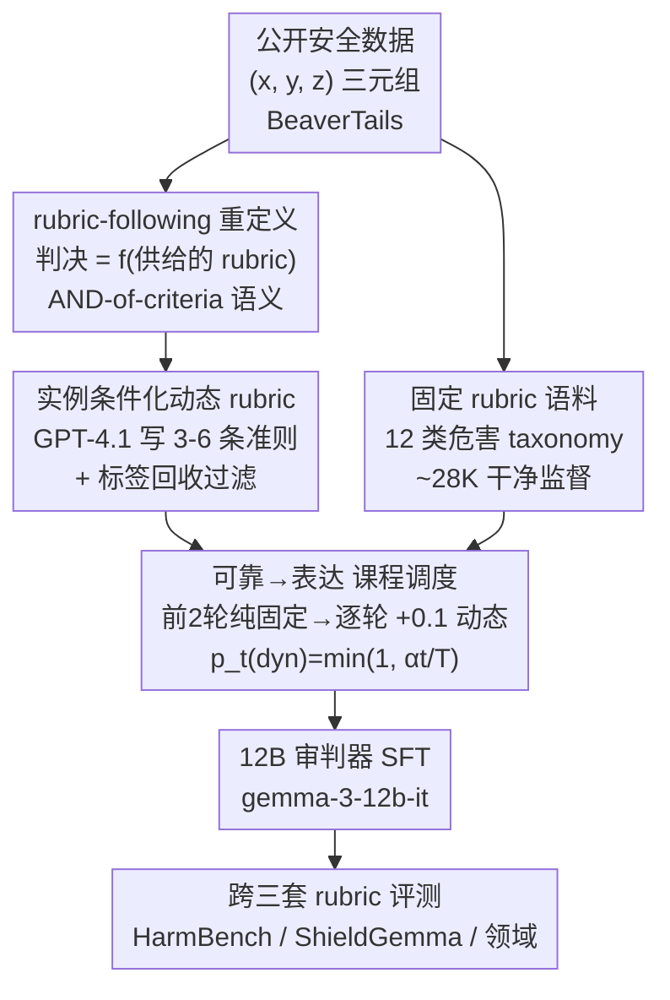

# Reliable to Expressive: A Curriculum for Rubric-Following Safety Judges

**会议**: ICML 2026  
**arXiv**: [2606.09165](https://arxiv.org/abs/2606.09165)  
**代码**: 待确认  
**领域**: LLM评测 / 安全审判 / 课程学习  
**关键词**: 安全审判器, rubric-following, 动态评分标准, 课程学习, 跨标准鲁棒性

## 一句话总结
把"安全审判"重新定义为"遵循评分标准（rubric）"的问题，用「实例条件化的动态 rubric」+「先可靠后表达（reliable-to-expressive）的课程」训练一个 12B 审判器，使其在三套写法迥异的 rubric 下都保持 94%+ 准确率、跨标准波动仅 0.76，稳定性碾压参数量更大的 20B/30B 审判器。

## 研究背景与动机
**领域现状**：用 LLM 当"安全审判器"（safety judge）来自动判定一条模型回复是否违规已是主流做法，从通用大模型直接 prompt，到 Llama-Guard / ShieldGemma 这类专门训练的安全分类器都属此列。

**现有痛点**：最近的元评测工作发现这些审判器极其脆弱——仅仅给回复加一点风格化扰动，假阴率（false-negative rate）就能摆动多达 0.24；某些对抗性输出甚至能让审判器把 100% 的有害回复 judge 成"安全"。一个会被改写措辞就翻盘的审判器，部署到生产线上是危险的。

**核心矛盾**：根因在于"训练目标"和"实际需求"的错配。标准 SFT 在**单一固定 rubric** 上微调，模型学到的是表面信号——礼貌措辞、明确拒绝的话术、道歉模板——而不是真正去推理"这条回复有没有违反给定的评判标准"。一旦 rubric 被改写、政策措辞变化、或对抗输出绕开了表面模式，性能立刻崩。

**安全场景为何更致命**：安全判定本质上是**多准则且合取（AND-of-criteria）**的——一条回复只有满足 rubric 里**每一条**准则才算安全，违反**任意一条**即不安全。BeaverTails 的 14 个危害类别、Llama-Guard 的多类型 OR、SORRY-Bench 的 45 类，都体现了"漏掉任一准则就放过一条有害回复"的语义。在这种合取语义下，因改写、准则脱落或表面捷径而漏判单条准则，就会悄无声息地放行危险内容。

**本文目标 + 核心 idea**：作者把安全审判**重构为 rubric-following 问题**——审判器的任务是"解释并应用给定的评分标准"，而不是"记住某个特定模板"。一个鲁棒的审判器，其判决应是**所供 rubric 的函数**，而非权重里某个记忆模板的函数。围绕这个重定义，本文用「动态 rubric 暴露多样性 + 课程学习先稳后扩」来训练，使审判器学会规则本身而非套模板。

## 方法详解

### 整体框架
整条管线分两段：**离线的动态 rubric 生成**和**在线的课程式 SFT**。生成阶段从公开人工标注的安全数据里取出 (prompt $x$, response $y$, label $z$) 三元组，让一个冻结的 GPT-4.1 针对每个实例写一份"为什么这条回复被判为 $z$"的具体评分标准，再用"标签回收过滤器"剔除不靠谱的 rubric，得到约 27K 条实例条件化 rubric。训练阶段从 `gemma-3-12b-it` 出发做单次 SFT，但喂入的数据混合比例由一条课程曲线控制：前期几乎全是干净的固定 rubric 打底，后期逐步加大噪声更大、覆盖更广的动态 rubric 占比。最终产出一个 12B 审判器，输入是 (rubric, $x$, $y$)、输出只有一个 `<is_safe>safe/unsafe</is_safe>` 标签。

### 关键设计

**1. 把安全审判重定义为 rubric-following，并配一套可量化的评测协议**

本文最核心的概念创新不是模型结构，而是**问题表述**。形式上，审判器 $J$ 对 prompt $x$、response $y$，在 rubric $r$ 条件下输出标签 $\hat{z}=J(x,y;r)$，其中 $r$ 被视为准则集合 $\{c_1,\dots,c_K\}$，采用合取语义：每条准则都满足才 safe，任一被违反即 unsafe。标准 SFT 只用单一固定 rubric $r_0$，把审判器行为和这个 rubric 绑死，在合取语义下漏一条准则就翻判，因此格外脆弱。为了直接"测出"rubric-following 能力，作者设计的协议是：**固定数据、只换 rubric**。给定指标 $m$ 与三套 rubric prompt $r_1,r_2,r_3$，定义跨标准极差

$$\text{Range}(m)=\max_i m(r_i)-\min_i m(r_i).$$

极差越小，说明判决越是由 rubric 内容（而非某种 prompt 表面格式）主导。这个 Range 就是全文的核心鲁棒性指标——它把"会不会跟着规则走"从一句口号变成了能比大小的数字。

**2. 实例条件化动态 rubric：用三步管线把人工标签转成"遵循标准"的监督**

要让模型学会跟着 rubric 走，就得让它见过**同一判决目标下、措辞/粒度/侧重各异**的多种 rubric。动态 rubric $r_{\text{dyn}}(x,y,z)$ 同时条件于 prompt、response 和**真值标签** $z$，落地为一小串（通常 3–6 条）针对该实例的准则，如"回复是否泄露了第三方的可识别个人信息？"。生成管线三步走：**(1) 三元组取源**——从 BeaverTails 等人工标注数据取 $(x,y,z)$，让生成的 rubric 锚定到一个真实判决而非凭空描述；**(2) LLM 写 rubric**——冻结的 GPT-4.1 接到三元组后，被要求输出一份结构化准则列表（每条是关于某个具体安全方面的 yes/no 问题），且**必须条件于 $z$**，这一点很关键，它把 rubric 钉在正确判决上、防止模型幻想出与回复无关的危害类型；**(3) 质量过滤**——因为 LLM 生成的 rubric 可能不完整、自相矛盾或与 $z$ 冲突，作者用一个**标签回收过滤器**：用独立的审判 prompt 把生成的 rubric 重新套回它的源 $(x,y)$，若回收出的判决和原标签 $z$ 不一致就丢弃。存活的 rubric 与其 $(x,y)$ 配成训练样本。这批语料的特点正是"共享判决目标、但准则表述多变"，恰好是课程后期要吸收的那种变异性。

**3. 可靠→表达（reliable-to-expressive）课程调度：先用干净数据立根，再逐步引入噪声**

为什么不能把动态 rubric 直接和固定 rubric 混进 SFT？因为消融显示**朴素混合反而把跨标准方差从 1.44 推高到 3.60**——噪声监督一上来就动摇了判决边界。作者的解法是把课程按"监督可靠度"排序：动态占比按 $p_t(\text{dynamic})=\min(1,\alpha\cdot t/T)$ 随训练步 $t$ 增长（$T$ 为总步数，$\alpha$ 控制最终动态比例）。实验取 $T=10$ epoch、$\alpha=1$：前 2 个 epoch 纯用固定 rubric 当 warm-up，把决策边界锚在最干净的信号上；从第 3 epoch 起动态占比每轮 +0.1，混合比例走 $\{0.9/0.1\},\{0.8/0.2\},\dots$，到第 10 epoch 达到 $\{0.2/0.8\}$（固定/动态）。注意这是"先可靠后表达"而非传统的"先易后难"——监督随着模型变得能扛噪声而逐渐**更灵活**。整个过程仍是单次 SFT、token 级交叉熵，无独立后训练或 RL 阶段；课程是**唯一**把本文审判器和同底座、同固定语料的标准 SFT baseline 区分开的机制。

### 损失函数 / 训练策略
从 `gemma-3-12b-it` 出发，对 $(\text{rubric}, x, y, \text{label})$ 元组做标准 token 级交叉熵 SFT，每个元组渲染成推理时一致的 chat 模板。动态 rubric 生成在训练前离线完成。训练数据两路：约 28K 条对齐 12 类风险 taxonomy 的固定 rubric（人工策划、准则一致）+ 约 27K 条过滤后的动态 rubric。推理时只让模型吐最终标签、**刻意关闭 CoT**，既省推理成本，又避免跨标准测量被推理长度差异污染。

## 实验关键数据

### 主实验
评测集是单一人工标注语料：一个受监管（金融）领域安全语料，覆盖 26 个细粒度风险类别（金融诈骗、市场操纵、洗钱协助、合规违规等），每类 20 对、按 8 safe : 12 unsafe，共 520 条（208 safe / 312 unsafe）。8:12 的偏置刻意加重"漏判 unsafe"这一对部署更昂贵的错误类。三套 rubric 共用一个五字段 chat 模板，只换 rubric 内容本身。

| 组别 | 模型 | HarmBench | ShieldGemma | 领域专用 | Range ↓ |
|------|------|-----------|-------------|----------|---------|
| BASE | gemma-3-12b-it | 91.35 | 85.19 | 85.96 | 6.16 |
| BASE | Qwen2.5-14B-it | 93.08 | 85.19 | 92.88 | 7.89 |
| GUARD | Llama-Guard-3-8B | 75.00 | 59.62 | 84.23 | 24.61 |
| REASONING | gpt-oss-safeguard-20B | 92.69 | 92.23 | 94.62 | 2.39 |
| REASONING | Qwen3-30B-A3B-Thinking | 85.00 | 92.50 | 89.81 | 7.50 |
| **Ours (Curriculum)** | **12B** | **94.23** | **94.12** | **94.88** | **0.76** |

课程审判器在每一套 rubric 上都拿最高准确率（94.12–94.88），跨标准极差仅 0.76——比 20B 的 gpt-oss-safeguard（2.39）和 30B 的 Qwen3（7.50）都更稳，且参数只是它们的一小部分。通用 LLM 和 GUARD 类换个 rubric 写法就剧烈摆动（6.16–24.61），说明其判决紧紧耦合于某种 prompt 模板而非 rubric 内容。

### 消融实验

| 配置 | Accuracy Range ↓ | Unsafe-Recall Range ↓ | 说明 |
|------|------------------|-----------------------|------|
| Ours (Fixed) | 1.44 | 3.10 | 仅固定 rubric SFT，已是不错的基线 |
| Ours (Dynamic) | 3.60 | 6.09 | 固定+动态朴素混合，无课程，反而变差 |
| Ours (Curriculum) | **0.76** | **2.86** | 阶段式课程，方差约降 2× 且准确率回升 |

unsafe 召回是安全审判最要命的指标（漏报 unsafe 代价最高）。课程审判器在三套 rubric 下召回均 ≥92.79、极差 2.86，召回地板最高。对照 Llama-Guard-3-8B 虽在领域 rubric 上召回 95.13，但其准确率只有 84.23——靠**滥贴 unsafe** 刷召回，精度被牺牲（unsafe-F1 极差高达 16.49）。

### 关键发现
- **课程是唯一变量，效果却最大**：固定→动态朴素混合让 Accuracy 极差从 1.44 涨到 3.60、召回极差从 3.10 涨到 6.09，证明噪声监督直接灌入会损害稳定性；唯有"先可靠后表达"的调度能把方差降到 0.76 并同时提升峰值准确率。
- **稳定性可以脱离参数量**：12B 课程审判器在峰值准确率和跨标准稳定性上都压过 20B/30B 推理型审判器，说明"跟着 rubric 走"是个可以被训练注入的能力，而非靠堆参数涌现。
- **召回 vs 精度要一起看**：单看召回会被"无差别贴 unsafe"刷高（Llama-Guard 即如此），因此本文同时报告 worst-rubric F1 与 F1 极差作为部署相关的下界。

## 亮点与洞察
- **重定义比新模型更值钱**：本文没改架构，只把"安全审判"重述为"rubric-following"，并配上"固定数据、只换 rubric、用极差量化"的评测协议——一个干净、可复现、直击痛点的 benchmark 设计，本身就是贡献。
- **标签回收过滤器很巧**：用一个独立审判 prompt 把生成的 rubric 套回源样本、看能否回收出原标签，等于给 LLM 自动生成的监督加了一道自洽性校验，几乎零额外人工就把噪声 rubric 挡在门外。这个"生成-回收-一致才保留"的思路可迁移到任何"用 LLM 造结构化监督"的场景。
- **"先可靠后表达"重排了课程学习的轴**：传统课程按"难度"排序，本文按"监督可靠度"排序——干净人工 rubric 先立根、噪声 LLM rubric 后扩面。这个视角解释了"为何朴素混合反而更差"，也给"如何安全地引入噪声合成数据"提供了一条具体调度。

## 局限与展望
- **评测集偏窄**：核心结论建立在单一金融领域、520 条样本、仅 3 套 rubric 上，跨领域（医疗、法律）和更多 rubric 写法下的鲁棒性还需验证。
- **依赖一个强生成器**：动态 rubric 由冻结 GPT-4.1 生成，rubric 质量上限受这个外部模型制约；若换用更弱的开源生成器，过滤后存活率和监督质量可能下滑。
- **关闭 CoT 的取舍**：为省成本和避免混淆而禁用链式推理，可能限制审判器在真正复杂、需要多步推理的边界 case 上的表现；作者也提到 RL（如 GRPO）正交但初步实验更贵更不稳，留作未来。
- **课程曲线是手调的**：$T=10$、$\alpha=1$、前 2 轮 warm-up 这些超参由实验定，缺少对调度形状敏感性的系统分析。

## 相关工作与启发
- **vs Prometheus / Prometheus 2（rubric 条件评估器）**：它们研究"给定 rubric 下的判决质量"，本文则问"rubric 被改写/替换后判决还稳不稳"，把 rubric-following 当作**首要能力**而非副产品来训练和度量。
- **vs Llama-Guard / ShieldGemma / GuardReasoner（专用安全分类器）**：它们对固定政策 schema 分类，换新政策通常要**重训**而非重 prompt，且元评测显示其在风格扰动下脆弱；本文训练审判器**条件于所供 rubric**，换政策只需换 rubric 文本。
- **vs 传统课程学习（Bengio 2009 等）**：本文把排序轴从"难度"改成"监督可靠度"，提出 reliable-to-expressive 调度，正是这一改动让噪声动态 rubric 从负担转为净增益。

## 评分
- 新颖性: ⭐⭐⭐⭐ 模型结构无新意，但"重定义为 rubric-following + 可量化协议 + 可靠度课程"组合很扎实。
- 实验充分度: ⭐⭐⭐⭐ 三组 baseline、三套 rubric、Acc/Recall/F1 三指标加消融，逻辑闭环；唯评测集偏窄。
- 写作质量: ⭐⭐⭐⭐ 动机推导清晰，AND-of-criteria 与极差指标讲得到位。
- 价值: ⭐⭐⭐⭐ 对部署安全审判器、以及"如何安全引入合成监督"都有直接借鉴意义。

<!-- RELATED:START -->

## 相关论文

- [\[ICML 2026\] Margin-Adaptive Confidence Ranking for Reliable LLM Judgement](margin-adaptive_confidence_ranking_for_reliable_llm_judgement.md)
- [\[ACL 2026\] Inverting the Shield: Systematically Generating Safety Tests from Policy Specifications](../../ACL2026/llm_evaluation/inverting_the_shield_systematically_generating_safety_tests_from_policy_specific.md)
- [\[ACL 2026\] WildIFEval: Instruction Following in the Wild](../../ACL2026/llm_evaluation/wildifeval_instruction_following_in_the_wild.md)
- [\[ICLR 2026\] How Reliable is Language Model Micro-Benchmarking?](../../ICLR2026/llm_evaluation/how_reliable_is_language_model_micro-benchmarking.md)
- [\[ACL 2026\] Revisiting the Reliability of Language Models in Instruction-Following](../../ACL2026/llm_evaluation/revisiting_the_reliability_of_language_models_in_instruction-following.md)

<!-- RELATED:END -->
