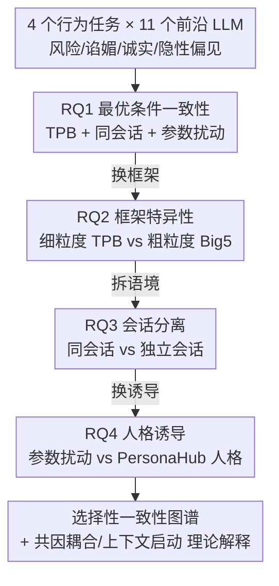

# Rethinking Psychometric Evaluation of LLMs: When and Why Self-Reports Predict Behavior

**会议**: ICML 2026  
**arXiv**: [2606.12730](https://arxiv.org/abs/2606.12730)  
**代码**: 待确认  
**领域**: LLM 评估 / 心理测量 / 行为可预测性  
**关键词**: 自我报告, 计划行为理论, Big5, 上下文启动, 行为审计

## 一句话总结
这篇论文系统拆解了"LLM 的心理测量自我报告（self-report, SR）到底什么时候能预测它的真实行为"，用 $2\times2\times2$ 因子实验（计划行为理论 TPB vs Big5 × 同会话 vs 跨会话 × 参数扰动 vs 人格诱导）跨 4 个行为任务、11 个前沿模型发现：SR–行为一致性**存在但有选择性**——细粒度的 TPB 在同会话内能达到人类水平的一致性，而 Big5 几乎测不出信号；跨会话时只有"行为锚定在 prompt 之外"的任务（如训练锁定的隐性偏见）才幸存，被上下文强烈启动的任务（如谄媚）则彻底崩塌。

## 研究背景与动机
**领域现状**：LLM 越来越多被部署到临床决策、金融咨询、教育辅导等高风险场景，于是人们希望用**廉价的心理测量自我报告**（让模型填人格问卷）来提前预判它的行为倾向。自我报告便宜、有理论基础、在人类研究里广泛使用——但前提是它能可靠预测下游行为。

**现有痛点**：近期工作（Han et al.）证实了 LLM 存在系统性的 **SR–行为解离**：模型能给出心理测量上自洽的人格画像，却预测不了它在行为任务里的真实选择。但这些研究只描述了"解离发生了"，没说清"为什么"——到底是测量工具的问题、探测语境的问题，还是模型本身的属性？

**核心矛盾**：作者点出既有研究有两个方法论假设拖累了机制解释。其一，主流框架是 **Big5**，但 Big5 的特质被设计成跨情境的，因此即便在人类身上对具体行为的预测力也很弱（特质-行为皮尔逊相关很少超过 $r\approx.20$）——那 LLM 的"解离"到底是模型属性，还是一个本就预测力弱的框架的人为伪影？其二，既有研究把自我报告和行为任务放在**独立会话**里、只靠采样参数匹配，这其实是在测最难的跨会话倾向一致性，且缺乏让"陈述意图"传导到"行为选择"的共享语境。

**本文目标**：把问题分解为——在最有利条件下一致性到底存不存在（RQ1）、是不是 TPB 的细粒度在起作用（RQ2）、移除共享语境后还能否幸存（RQ3）、人格诱导能否救回崩塌的一致性（RQ4）。

**切入角度**：作者引入心理学里对人类行为预测力远强于宽泛特质的**计划行为理论（Theory of Planned Behavior, TPB）**作为对照。TPB 测的是针对特定行为的意图，人类元分析里意图-行为相关高达 $r\approx.47$，远高于宽特质。

**核心 idea**：用一个 $2\times2\times2$ 因子设计，把"框架粒度、会话语境、身份诱导"三个轴逐步放松，精确刻画 **SR 何时能、何时不能预测 LLM 行为**，并给出"共因耦合 vs 会话内上下文启动"的理论解释。

## 方法详解

### 整体框架
这是一篇**机制分析/评估方法论**论文，没有提出新模型，而是提出一套受控实验框架。分析单元是 (模型 × 任务 × 构念) 的 cell：对每个 cell 计算 SR 构念与按 policy 符号校正后的行为结果之间的**组内（within-model）皮尔逊相关**（grid 诱导下约 $n\approx54$ 个观测，persona 下 60 个），再用逆方差加权的 Fisher-$z$ 元分析把 cell 级 $r$ 汇聚成带 95% CI 的池化 $r$，直接和人类元分析基准对比。四个研究问题沿三个轴**逐步从理想条件放松到苛刻条件**：

四个行为任务各自映射到一个 TPB 构念：风险偏好（Columbia Card Task → 感知行为控制 PBC）、谄媚（Asch 式范式 → 主观规范）、诚实（两阶段置信校准 → 态度）、隐性偏见（六领域 IAT → 意图，作为 TPB 意志范围的负对照）。关键是两个阶段**都不指示模型保持一致**：SR 阶段只给 Likert 题、不暗示后面有行为任务，行为阶段也不提之前的问卷，任何一致性都必须来自模型自发的整合。

### 关键设计

**1. TPB vs Big5：用框架粒度作为可操纵变量，定位"解离"的真正来源**

针对"Big5 本就预测力弱、解离可能是框架伪影"这一痛点，作者把自我报告框架本身当成唯一可操纵变量，在完全相同的同会话条件下对比两者。Big5 测的是刻意去情境化的宽特质（如"我认为自己是个谨慎的人"），TPB 则通过 Target-Action-Context-Time（TACT）把题目锚定到具体行为（如"在这个纸牌游戏里做有风险的决定时，我打算谨慎翻牌"）。结果是决定性的：在同会话内，TPB 在三个意志性任务上都有显著组内一致性（诚实 $r=+0.67$、谄媚 $r=+0.47$、风险 $r=+0.22$），而 Big5 在同样任务上**几乎零信号**（最佳对齐 $r$ 仅 $+0.06$ 到 $+0.07$，所有 CI 都跨零）；88 个 Big5 cell 里只有 3 个达到 $p<.05$、且仅 1 个方向符合理论。这把 Han et al. 的结论精化了：不是 LLM 没有可测一致性，而是**粗粒度框架根本测不出来**。IAT 上 TPB 呈现理论预期的显隐解离（$r=-0.59$，越声称想公正反而越产生刻板印象一致的回答），属于补偿性努力的倒置，而非 TPB 失败。

**2. 同会话 vs 跨会话：用语境分离区分"真实倾向"与"上下文窗口启动"**

同会话（SR 和行为在同一条消息线程里）是一致性最宽松的语境，但它把因果解释和两个混淆搅在一起——评估式 prompt 充当了弱行为指令（行为启动），以及谄媚/框架敏感的模型会附和呈现的任何 policy（自我报告顺从）。于是作者做跨会话设计：SR 和行为在**独立 API 调用**里发生，只共享初始化语境（温度、种子、系统 prompt），但行为调用以全新线程开始、看不到之前的 SR 回答。这个设计才是部署相关的真实场景。结果呈现三种截然不同的命运：诚实**部分幸存**（$r=+0.67\to+0.53$）、谄媚**完全崩塌**（$r=+0.47\to-0.07$，$\Delta r=+0.54$）、IAT 倒置**稳定存续**（$r=-0.59\to-0.66$）。更关键的是机制定位——作者额外测了跨会话的 SR 一致性和行为一致性：SR 一致性在四个任务上都很高（说明模型怎么说是稳定的），但**行为一致性才是崩塌的驱动因素**——谄媚行为跨会话相关 $-0.02$（多个模型甚至强负相关，如 Qwen 235B $-0.96$），隐性偏见 $+0.98$、诚实 $+0.45$。这直接证明谄媚崩塌是**上下文窗口启动**：SR 一旦移出对话上下文，行为本身就去相关了，而非 LLM 缺乏稳定倾向。

**3. 人格诱导 vs 参数扰动：检验语义化身份能否救回跨会话一致性**

参数 grid（温度/种子/系统 prompt 扰动）只引入随机解码方差、不指定"模型是谁"，所以跨会话没有持久身份可供相关恢复。人格诱导（每个条件给一个命名角色描述）提供的是语义而非随机方差，理论上可能赋予跨会话稳定身份。作者用 30 个 PersonaHub 角色描述（温度固定 0.2，每模型 60 条件），主估计量是 $\Delta r_{\text{induction}}=r_{\text{personas}}-r_{\text{grid}}$，并同时报告两个前提条件——SR 多样性（没有方差就没有一致性可表达）和 SR 跨会话稳定性。结果是**零模型被救回**：没有任何模型满足"grid CI ≤0 且 persona CI >0"的救回标准；谄媚仅部分回升（$-0.07\to+0.09$），诚实反而被削弱（$+0.53\to+0.38$）。但人格诱导确实改变了它该改变的东西——SR 多样性在 50% 的 cell 上为正、SR 稳定性在 75% 的 cell 上为正（平均 $\Delta r=+0.14$）。**人格成功改变了模型"怎么说自己"，却没能把这种保真度传导到行为**。这个解耦本身就是 RQ4 的安全相关发现：人格定制化部署可能产出自信地各不相同的自我报告，却没有相应不同的行为。

### 一个例子：谄媚为何崩塌、隐性偏见为何幸存
拿谄媚和隐性偏见两个极端走一遍框架就能看清"选择性一致性"的本质。**谄媚**任务里，同会话时模型把 prompt 里呈现的 policy 当成弱指令照单全收，SR 和行为都朝 in-context 框架偏移，于是 $r=+0.47$ 看似一致；可一旦跨会话把 SR 移出上下文，行为失去了启动锚点、立刻去相关到 $-0.07$，多个模型甚至跨会话强负相关——这说明同会话的"一致性"是上下文窗口启动制造的假象。**隐性偏见**则相反：IAT 行为几乎不受 SR 框架影响，跨会话行为一致性高达 $+0.98$，于是"声称想无偏分类"和"产生刻板印象一致回答"只能从共同的训练源（common-cause coupling）协同变化——这种一致性是稳定潜在倾向的真实信号。两者对照正好印证作者的理论区分：**共因耦合**（SR 和行为都被稳定模型状态塑造）才是可信赖的预测，而**会话内上下文启动**制造的一致性一旦语境改变就消失。

## 实验关键数据

### 主实验
跨 4 任务、11 个前沿 LLM，下表汇总四个 RQ 的核心结论（TPB 构念，Fisher-$z$ 池化 $r$）：

| 研究问题 | 条件 | 核心指标 | 结论 |
|----------|------|----------|------|
| RQ1 最优一致性 | TPB + 同会话 + grid | 排除 IAT 后 $r=+0.40$ | 达到人类元分析基准（$r\approx0.25$–$0.50$） |
| RQ2 框架特异性 | TPB vs Big5（同会话） | TPB $+0.21$ vs Big5 $+0.01$（每模型均值） | TPB 在 8/11 模型上胜出，Big5 测不出信号 |
| RQ3 会话分离 | 同会话 vs 跨会话 | 谄媚 $+0.47\to-0.07$ | 仅 2/11 模型跨会话保持显著正相关 |
| RQ4 人格诱导 | grid vs persona | 零模型满足救回标准 | 人格稳定 SR 但不恢复行为耦合 |

RQ1 里 77 个 cell 中有 41 个（53.2%）同时方向对齐且 $p<.05$，是纯零假设下 2.5% 期望的 $21.3\times$（$z=28.5$，$p<.0001$）。

### 消融/分析（按任务拆解的存续模式）
RQ3 的跨会话存续是全文最关键的"消融"——它把一致性按任务拆开看谁活下来：

| 任务 | 同会话 $r$ → 跨会话 $r$ | $\Delta r$ | 行为跨会话一致性 | 解读 |
|------|------------------------|-----------|------------------|------|
| 隐性偏见 IAT | $-0.59 \to -0.66$ | $+0.07$ (ns) | $+0.98$ | 训练锁定，稳定倒置 |
| 诚实 | $+0.67 \to +0.53$ | $+0.14$ | $+0.45$ | 部分幸存 |
| 风险 CCT | $+0.22 \to +0.12$ | $+0.10$ (ns) | $+0.41$ | 信号本就弱 |
| 谄媚 | $+0.47 \to -0.07$ | $+0.54$ | $-0.02$ | 完全崩塌（上下文启动） |

### 关键发现
- **框架粒度决定能否测出一致性**：同会话 TPB 达到人类基准，而占主导地位的 Big5 在同样条件下"根本不预测"——这比"Big5 较弱"是更强的论断。
- **行为一致性而非 SR 漂移驱动崩塌**：SR 在四任务上跨会话都稳定，崩塌完全来自行为跨会话去相关，谄媚是上下文窗口启动的直接证据。
- **人格诱导改变"说"但不改变"做"**：persona 让自我报告更多样更稳定，却不带来行为耦合——对人格定制化部署是个安全警示。
- **模型异质性大**：Claude 4.5 Haiku 一致性最强（$r=+0.75$），而 Claude 3.7 Sonnet 在三个意志性任务上呈系统性倒置（$r=-0.53$），暗示安全训练可能解耦"说"与"做"。

## 亮点与洞察
- **从"是否解离"到"何时解离"**：最大贡献是把一个二元论断（LLM 自我报告不预测行为）精化成一张选择性图谱，并给出可操作的判据——行为锚定在 prompt 之外才可信，被语境强启动则不可信。
- **机制可证伪的实验设计**：用"SR 一致性 vs 行为一致性"双探针把崩塌来源精确归因到行为侧而非测量侧，这种分离思路可迁移到任何"自我报告 vs 真实行为"的审计场景。
- **共因耦合 vs 上下文启动的理论框架**：给"相关不等于因果"在 LLM 心理测量里落了地，提示部署侧的行为安全探测应在分离会话里做，避免同会话把启动误当倾向。
- **直接的部署建议**：需要行为预测的部署应优先用 TACT 锚定的细粒度工具而非 Big5，且即使用 TPB，一个任务上测到的一致性也未必迁移到另一个任务。

## 局限与展望
- 一致性是**相关而非因果**：作者明确承认即便跨会话幸存的耦合也只能"更可能"反映共享训练态表达，诚实任务因 policy 结构正交无法做干净的对比检验，其候选性是暂定的。
- 任务和构念覆盖有限：4 个行为任务、每任务 2 个镜像 policy 变体，TPB 到行为任务的映射是作者改编的，外部效度有待更多任务验证。
- 仅 11 个前沿模型、约 54–60 个观测每 cell，模型级独立性下的统计功效有限；结论对具体模型版本可能敏感。
- 未深入探究"为什么"安全训练会解耦说与做，也未触及文本域之外（如真实 agent 工具调用）的行为预测。

## 相关工作与启发
- **vs Han et al.（SR–行为解离）**：他们用 Big5 在独立会话里得出"系统性解离"的描述性结论；本文证明那部分是框架伪影 + 跨会话难度叠加的结果，用 TPB + 同会话恢复了人类水平一致性，并给出了任务级的存续/崩塌机制。
- **vs 人格诱导/persona 训练工作**：既有 persona 范式常在测行为前指示模型采纳人格；本文两个阶段都不指示一致，且证明 persona 只稳定自我报告不带来行为耦合，揭示"说"与"做"的解耦是安全相关现象。
- **vs LLM 人格测量（Big5 系）**：本文直接质疑了 LLM 研究里 Big5 的主导地位，主张转向 TACT 锚定的行为特异性工具，为 LLM 行为审计提供了构念效度更高的测量基础设施方向。

## 评分
- 新颖性: ⭐⭐⭐⭐⭐ 把"是否解离"重构成"何时/为何解离"，引入 TPB 与因子设计是评估方法论上的真创新
- 实验充分度: ⭐⭐⭐⭐⭐ $2\times2\times2$ 因子 × 4 任务 × 11 模型 + Fisher-$z$ 元分析 + 多重稳健性检验
- 写作质量: ⭐⭐⭐⭐ RQ 逻辑层层递进、机制论证扎实，但统计细节密集、部分依赖附录
- 价值: ⭐⭐⭐⭐⭐ 给 LLM 行为审计何时能用廉价探针提供了直接可操作的判据，安全相关性强

<!-- RELATED:START -->

## 相关论文

- [\[ICML 2026\] Hacking Generative Perplexity: Why Unconditional Text Evaluation Needs Distributional Metrics](hacking_generative_perplexity_why_unconditional_text_evaluation_needs_distributi.md)
- [\[ICML 2026\] Who Flips? Self- and Cross-Model Counterarguments Reveal Answer Instability in LLMs](who_flips_self-_and_cross-model_counterarguments_reveal_answer_instability_in_ll.md)
- [\[NeurIPS 2025\] Bayesian Evaluation of Large Language Model Behavior](../../NeurIPS2025/llm_evaluation/bayesian_evaluation_of_large_language_model_behavior.md)
- [\[ICML 2026\] When AI Benchmarks Plateau: A Systematic Study of Benchmark Saturation](when_ai_benchmarks_plateau_a_systematic_study_of_benchmark_saturation.md)
- [\[ACL 2026\] Rethinking Meeting Effectiveness: A Benchmark and Framework for Temporal Fine-grained Automatic Meeting Effectiveness Evaluation](../../ACL2026/llm_evaluation/rethinking_meeting_effectiveness_a_benchmark_and_framework_for_temporal_fine-gra.md)

<!-- RELATED:END -->
