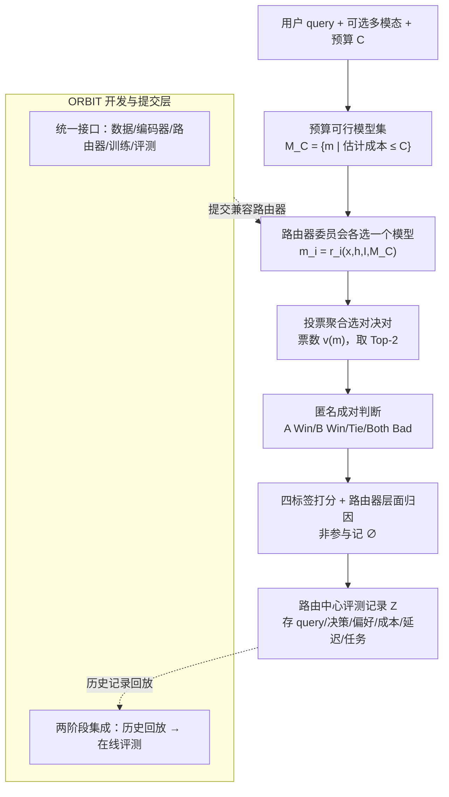

# RouteJudge: An Open Platform for Reproducible and Preference-Aware LLM Routing

**会议**: ICML2026  
**arXiv**: [2606.18774](https://arxiv.org/abs/2606.18774)  
**代码**: https://github.com/AIGNLAI/LAMDA-ORBIT  
**领域**: LLM评测 / LLM路由 / 偏好对齐  
**关键词**: LLM路由, 在线偏好评测, 成对比较, Elo, 可复现工具箱

## 一句话总结
RouteJudge 指出当前 LLM 路由器的评测都停在"离线、对标准答案、对自动分"的范式上、忽略了真实用户的多元偏好，于是提出一个**在线成对偏好评测平台**——同一个 query 让多个路由器在相同模型池与预算下各选一个模型、匿名两两对决、把用户偏好归因回路由器层面，并配套一个可复现的模块化工具箱 ORBIT 作为路由方法的开发与提交入口。

## 研究背景与动机
**领域现状**：LLM 路由把一组能力/成本/延迟各异的异构模型组成模型池，对每个 query 自动挑最合适的模型，本质是"预算受限推理"——简单请求给便宜快的模型、复杂高风险请求给强模型，从而优化质量-成本权衡。现有路由器五花八门：相似度路由、学习型成本-质量路由、级联/不确定性路由、偏好型/结构化路由。

**现有痛点**：尽管路由机制各异，它们**共享同一个评测假设**——路由质量可以离线用基准标签、任务指标或自动评判来度量，"路由器选中的模型在固定 benchmark 上得分高就算好"。但这把路由窄化成了"固定目标预测"问题。

**核心矛盾**：真实部署里很多 query **没有唯一最优答案**。写作、翻译、对话、辅导、分析推理这类任务，多个回答都可能成立，但用户会因为期望、成本敏感度、延迟容忍、详略偏好、推理风格、语气不同而偏好不同回答。于是一个在"标准答案/自动分"下表现好的路由器，**未必选到用户真正偏好的模型**。作者称之为路由的**多元偏好对齐（pluralistic preference alignment）**问题。

**本文目标**：把路由评测目标从"是否选中 benchmark 最优模型"转向"路由决策是否导向用户偏好的回答"，并让这套评测**可持续扩展、可复现**。

**切入角度**：借鉴 LMArena 式的在线匿名成对比较，但把评测对象从"模型回答质量"换成"**路由器决策质量**"——偏好信号要归因回做出选择的路由器，而不是停在被选中的那个模型上。

**核心 idea**：用"在线成对偏好 + 路由器层面归因"评测路由决策（RouteJudge），再用一个标准化工具箱（ORBIT）当统一开发与提交层，两者组成开放、可持续扩张的路由评测生态。

## 方法详解

### 整体框架
RouteJudge 把每个路由器当**黑盒决策者**：给定同一 query、同一模型池、同一预算，它推荐一个候选模型；平台再把不同路由器选中的模型回答拿去匿名两两对决，把用户偏好归因回背后的路由器。整条在线评测流程是一个五阶段管线，背后由 ORBIT 提供路由器的训练/验证/提交基础设施。

整套设计的核心区别是：传统路由 benchmark 比的是"路由器是否同意固定标签"，RouteJudge 比的是"路由器的决策是否让用户更满意"，并通过完整记录把成本、延迟、任务类型都纳入条件化分析。

### 关键设计

**1. 路由器层面的偏好归因：把"模型谁赢"换成"哪个路由器选对了"**

传统在线竞技场（如成对比较 leaderboard）停在模型层面——只知道哪个模型回答赢了。但路由研究真正关心的是**做选择的路由器好不好**。RouteJudge 的做法是：先把用户的四标签偏好转成对决双方的比较分 $(s_A,s_B)$，再按"路由器选中的模型是否进入了被评测的对决对"把分数派回路由器：

$$S_i=\begin{cases}s_A,& m_i=m_A,\\ s_B,& m_i=m_B,\\ \varnothing,& m_i\notin\{m_A,m_B\}.\end{cases}$$

其中 $m_i=r_i(x,h,I,\mathcal{M}_C)$ 是路由器 $r_i$ 的选择。这一步把"模型层面的回答质量"转成"路由器层面的决策质量"，是 RouteJudge 区别于普通模型竞技场的根本所在——同样一场对决，平台能同时回答"哪个回答赢了"和"哪些路由器选到了赢的模型"。

**2. 五阶段在线评测工作流：投票筛选对决对，让评测聚焦高分歧模型**

要在一个 query 上同时评多个路由器，不可能让所有候选模型两两都跑（成本爆炸）。作者设计了投票驱动的对决选择：用户提交 query 和预算 $C$ → 平台构造预算可行集 $\mathcal{M}_C=\{m\in\mathcal{M}\mid\hat c(m\mid x,h,I)\le C\}$ → 所有路由器在同一可行集上各选一个模型 → 按模型得票 $v(m)=|\{i\mid m_i=m\}|$ 取**票数最高的两个模型**组成对决对 $(m_A,m_B)$（票数并列时优先选历史比较次数少的模型以提升覆盖、再随机破平）→ 两模型并行生成回答、随机匿名顺序呈现给用户。这样每场对决都落在"最多路由器看好"的两个模型上，把有限的人类标注预算花在最有区分度、最有争议的比较上。

**3. 四标签打分 + 非参与 ∅：避免强制二选一、也不冤枉没上场的路由器**

用户判断有四个标签 $y\in\{\text{A Win},\text{B Win},\text{Tie},\text{Both Bad}\}$，对应比较分 $(1,0)/(0,1)/(0.5,0.5)/(0,0)$。引入 Tie 和 Both Bad 是为了在两个回答难分伯仲或都很差时不强迫用户给出二元偏好。更关键的是归因里的 $\varnothing$：如果某路由器选的模型根本没进对决对，它记为"非参与"、既不算赢也不算输。这一设计避免把胜负随便派给没被实际评判过的路由器；同时非参与本身是有信息的——一个偏好分高但参与率低的路由器，可能只是评测覆盖有限，所以平台把**参与率与偏好指标一并报告**，而非只给一个聚合分。每条交互都存成路由中心记录 $\mathcal{Z}=(x,h,I,C,\mathcal{M}_C,\mathbf d,\mathbf v,m_A,m_B,y,\mathbf s,\mathbf c,\boldsymbol\ell,\tau,\eta)$，支持偏好/成本/任务条件化的多维分析。

**4. ORBIT 标准化工具箱 + 两阶段提交：让路由器池可持续扩张**

光有评测协议不够——不同路由方法的数据格式、编码器、训练流程各不相同，每加一个路由器都要大量工程，还会引入预处理/模型访问的不可控差异。ORBIT（Optimal Routing and Budgeted Inference Toolbox）把端到端流程标准化：统一的数据加载、query 表征（轻量文本编码器 / 大 embedding / 多模态均可）、路由器实现（继承 `BaseRouter`，只需实现训练与推理）、预算感知评测与方法对比；所有路由器暴露同一预测接口"给 query 表征 + 可行模型集 → 输出推荐模型"，靠两份配置（benchmark 配置定数据集/模型池/编码器/预算，router 配置定算法超参）实现可组合与可复现，一条 `python main.py --dataset X --method Y` 即可跑。ORBIT 同时是 RouteJudge 的**提交层**：研究者把方法实现成 ORBIT 兼容路由器、PR 提交后，先做**历史回放评测**（在过往 RouteJudge 记录上看路由器是否选到当时用户偏好的模型），再进入**在线评测**（加入路由器池参与真实成对比较），两阶段衔接让方法先离线验证、再上线接受真实偏好检验。

### 一个例子：一次完整对决
用户提交一个翻译类 query 并选中等预算 $C$，平台先算出可行集 $\mathcal{M}_C$（过滤掉估计成本超预算的强模型）；20 个路由器各选一个模型，统计票数后发现 GPT-4o 和某开源中模型得票最高，组成对决对 $(m_A,m_B)$；两者并行生成译文、匿名随机摆放给用户；用户觉得后者语气更自然、选 "B Win"，于是 $(s_A,s_B)=(0,1)$。所有选了 B 模型的路由器各得 1 分、选 A 的各得 0 分、选了其它模型的路由器记 $\varnothing$ 不计分。这条记录连同成本、延迟、任务标签 $\tau=\text{Translation}$ 一起入库，进入 Elo / 胜率 / 参与率 / 成本-质量 Pareto 等下游统计。

## 实验关键数据

### 离线 ORBIT 评测
在 RouterEval 基准上，用 all-MiniLM-L6-v2 编码 query、固定 2:8 训练/测试切分（模拟低数据监督），扫描预算得到性能-成本权衡曲线；曲线级指标包括 nAUC、Peak Score、QNC、RCI（细节在附录）。核心价值是让所有路由器在同一数据处理、表征、模型池、预算与报告协议下对比，使差异主要反映路由策略本身而非预处理/编码器/脚本的不一致。

### 在线 RouteJudge 偏好评测
截至 2026-06-08，平台记录 261 场对决、109 张用户投票；下表按 Elo 排名（基于 109 张投票，应视为早期快照而非最终排名）：

| 路由器 | 胜率 | Elo |
|--------|------|-----|
| RouterLLM-MF | 66.67% | 1278 |
| NIRT-Router | 80.00% | 1274 |
| kNNRouter | 60.00% | 1240 |
| GraphRouter | 44.44% | 1218 |
| EmbedLLM | 63.64% | 1215 |
| ... | ... | ... |
| HybridLLM | 18.18% | 1134 |
| MIRT-Router | 36.00% | 1117 |

### 关键发现

| 现象 | 数据 | 解读 |
|------|------|------|
| 离线强不等于在线强 | 部分显式学习打分的路由器在线偏好胜率反而低，简单非参数 / 矩阵分解方法很有竞争力 | 路由质量不能只看离线对标签的吻合度 |
| 偏好不由成本单独决定 | 成本-胜率图上存在 Pareto 前沿，部分低成本模型胜率也有竞争力 | 有效路由应按预算与任务上下文自适应，而非永远挑最贵/最强模型 |
| Elo 要与参与率联读 | 高胜率可能来自较少决定性比较 | 平台联合报告 Elo、胜率、参与率、成本，而非单一聚合分 |

## 亮点与洞察
- **把评测对象从模型挪到路由器**是最核心的"啊哈"——同一套匿名成对竞技场协议，靠"归因回路由器 + 非参与 ∅"两步，就把模型 leaderboard 升级成路由器 leaderboard。
- **离线-在线两阶段评测**直接戳中痛点：论文用数据证明"离线最优设计不一定在线偏好也强"，这个 gap 本身就是 RouteJudge 存在的理由。
- **投票驱动对决选择**是省人力标注的巧设计——把比较预算集中在最有分歧的 Top-2 模型上，可迁移到任何"多策略产出同一决策、靠成对人评打分"的场景。
- **ORBIT 的统一接口 + PR 提交**让评测平台可持续生长，是把"一篇 benchmark 论文"做成"活的生态"的工程范式。

## 局限与展望
- **结果是初步快照**：仅 109 张投票、261 场对决，Elo 排名波动大，作者也明确不作为最终结论。
- **偏好信号稀疏且有偏**：在线用户群体、查询分布可能不代表真实部署；匿名成对判断本身也受呈现顺序、用户疲劳影响。
- **成本估计 $\hat c$ 与预算可行集的准确性**直接影响公平性，论文未深入讨论成本估计误差的影响。
- **路由器层面归因的统计效率**：很多路由器在单场对决里记 $\varnothing$，要积累足够决定性比较才能稳定排名，冷启动较慢。
- **可改进**：引入更系统的主动对决选择（不只看票数）、对用户偏好做分群建模、把多元偏好显式建成多目标而非单一 Elo。

## 相关工作与启发
- **vs 离线路由 benchmark（RouterEval / 对标准答案打分）**：它们衡量"是否选中 benchmark 最优模型"，RouteJudge 衡量"是否导向用户偏好回答"，并补上成本/延迟/任务条件化分析。
- **vs 模型竞技场（成对偏好 leaderboard）**：竞技场评模型回答质量、停在模型层面；RouteJudge 把偏好归因回路由器、评的是路由决策质量。
- **vs 学习型成本-质量路由（RouteLLM 等）**：这些是被评测的"参赛者"，RouteJudge/ORBIT 给它们提供统一的离线复现 + 在线偏好检验通道，并发现部分强离线方法在线表现并不突出。

## 评分
- 新颖性: ⭐⭐⭐⭐ 把竞技场范式迁到路由器层面 + 偏好归因，角度新但技术组件多为已有拼装
- 实验充分度: ⭐⭐⭐ 离线有完整曲线指标，但在线仅 109 票，结论限于早期快照
- 写作质量: ⭐⭐⭐⭐ 动机清晰、协议与工具箱描述完整，工程落地感强
- 价值: ⭐⭐⭐⭐ 提供可持续扩张的开放路由评测生态，对路由研究的评测范式有推动作用

<!-- RELATED:START -->

## 相关论文

- [\[ICML 2026\] Nonparametric LLM Evaluation from Preference Data](nonparametric_llm_evaluation_from_preference_data.md)
- [\[ICML 2026\] Reasoning Is Not Free: Robust Adaptive Cost-Efficient Routing for LLM-as-a-Judge](reasoning_is_not_free_robust_adaptive_cost-efficient_routing_for_llm-as-a-judge.md)
- [\[ICLR 2026\] Unpacking Human Preference for LLMs: Demographically Aware Evaluation with the HUMAINE Framework](../../ICLR2026/llm_evaluation/unpacking_human_preference_for_llms_demographically_aware_evaluation_of_long-fo.md)
- [\[ICLR 2026\] Preference Leakage: A Contamination Problem in LLM-as-a-judge](../../ICLR2026/llm_evaluation/preference_leakage_a_contamination_problem_in_llm-as-a-judge.md)
- [\[ICLR 2026\] Subliminal Signals in Preference Labels](../../ICLR2026/llm_evaluation/subliminal_signals_in_preference_labels.md)

<!-- RELATED:END -->
