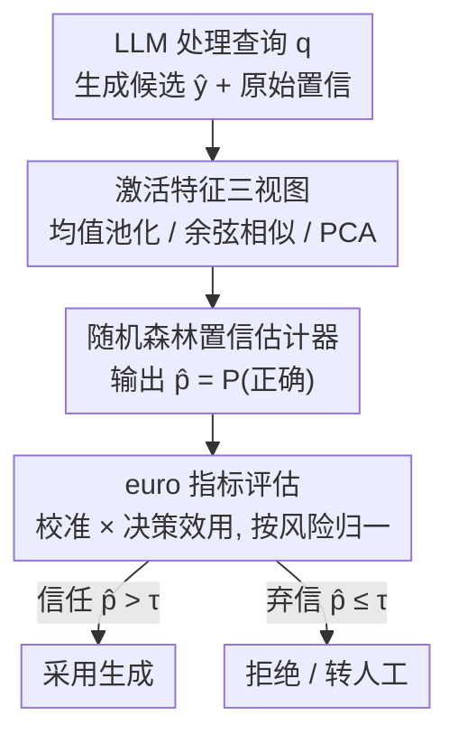

# The ACUTE Protocol: Operationalizing Language Model Activations for Better Calibration, Utility, and Trust

**会议**: ICML 2026  
**arXiv**: [2606.07822](https://arxiv.org/abs/2606.07822)  
**代码**: 待确认  
**领域**: LLM评估 / 置信度校准  
**关键词**: 置信度估计, 校准, 决策效用, 激活探测, 可信度

## 一句话总结
本文指出"校准误差（ECE）"作为信任度量有两处致命缺陷——分不清神谕估计器与"永远报基准率"的废估计器、且对任务风险无感；为此提出新指标 euro（用神谕归一化的期望效用）把校准与决策效用绑在一起衡量，并提出 acute 协议：拿语言模型生成时的逐层激活当特征、训一个随机森林去判断"这次生成对不对"作为校准后的置信度，在 6 个模型 × 3 类任务上既维持低校准误差、又在 euro 上显著超过强基线。

## 研究背景与动机
**领域现状**：用户越来越依赖 LLM 做信息检索、写作、工具调用，并把模型输出直接喂给下游计算。于是"该不该信任这次输出"成了关键问题，需要一个置信度估计器给生成打一个"对的概率"。最常用的现成置信度是模型自报的原始置信度（输出序列各 token 概率之积），但它在单 token 和多 token 生成下都众所周知地校准很差，普遍过度自信。

**现有痛点**：衡量校准好坏的标准指标是期望校准误差 ECE（及其无超参版 smECE），但用 ECE 当"信任"的代理有两个硬伤。作者用一个 50% 准确率的任务把问题摆得很直白：

**核心矛盾**：第一，**ECE 分不清神谕和废估计器**。神谕估计器（对的给概率 1、错的给 0）和基准率估计器（不管对错一律给 0.5）在这个任务上 ECE 都等于 0，但前者完美、后者对决策毫无信息量——ECE 把它们判成一样好。第二，**ECE 对任务风险无感**。同一个概率神谕估计器（对的给 0.75、错的给 0.25），在"需要 0.9 才敢信"的高风险任务和"0.5 就敢信"的中风险任务上 ECE 都是 0.25，可它其实完美解决了中风险任务、在高风险任务上却从不敢信——ECE 给两者同样的分。

**本文目标**：(1) 造一个既反映校准、又反映"信/不信"决策效用、还能纳入任务风险的指标；(2) 造一个高效、样本省的置信度估计器，把估计本身做准。

**切入角度**：决策效用必须显式建模"信任正确 / 弃信错误"两类正收益和"信任错误 / 弃信正确"两类损失，并用一个可调的风险阈值串起来；置信度估计则押注一个观察——语言模型的激活空间里藏着可解读的"这次答得对不对"的信号（激活可被引导、存在任务相关的方向与电路、不同层对应不同语言现象）。

**核心 idea**：用"被神谕归一化的期望效用 euro"取代纯校准指标来评判置信度，再用"激活特征 + 随机森林"的 acute 协议把置信度估准。

## 方法详解

### 整体框架
本文有两个相互配合的产出：一把新的"尺子"euro 和一台新的"估计器"acute。acute 的流水线是：语言模型 $M$ 处理查询 $q$ 生成候选答案 $\hat{y}$ 的同时，抽出它逐层的激活；把高维激活用三种方式之一压成紧凑特征（逐层均值池化 / 与末层的余弦相似 / 逐层 PCA）；用这些特征训一个随机森林分类器去预测"这次生成是否正确"，分类器给"正确"类的概率就是校准后的新置信度 $\hat{p}$。最后用 euro 这把尺子去评判这个估计器到底好不好——euro 同时看它的校准程度和在不同风险阈值下的决策效用。下面的框架图按"激活特征 → 随机森林 → euro 评估"的顺序对应三个关键设计。

### 关键设计

**1. 激活特征三视图：把逐层激活压成可学的紧凑置信特征**

激活空间维度极高（隐藏维 4000、50 层就有约 20 万维），直接全拼不可行，而只取单层又会漏信息，所以 acute 给出三种激活聚合视图。其一**逐层均值池化**：对层 $j$ 的输出序列激活 $H^{(j)} = [\mathbf{h}_1^{(j)} \ldots \mathbf{h}_T^{(j)}]$ 沿序列求均值得单向量 $\bar{\mathbf{h}}^{(j)}$，每层各训一个估计器、只报早/中/晚三档里最好的那个。其二**与末层的逐层余弦相似**：算每层池化激活与最后一层的余弦相似度

$$\mathbf{x}_{\textsc{cosine}} = \big[\,\mathrm{sim}(\bar{\mathbf{h}}^{(1)}, \bar{\mathbf{h}}^{(\ell)})\;\ldots\;\mathrm{sim}(\bar{\mathbf{h}}^{(\ell-1)}, \bar{\mathbf{h}}^{(\ell)})\,\big],$$

得到 $\ell-1$ 维特征，把"各层离最终表示有多远"压成一条曲线（借鉴 BERTScore 用余弦聚合嵌入的思路）。其三**逐层 PCA**：对每层取前 $m$ 个主成分，得 $m\ell$ 维特征（实验用 $m=10, 20$）。三视图分别在"信息量 vs 维度"上做不同折中：均值池化保留单层全貌但层数受限，余弦极致压缩到一维/层，PCA 居中。

**2. 随机森林置信估计器：用一个简单分类器把激活变成校准置信**

有了激活特征，acute 用一个简单分类器预测"生成对不对"，并把它给"正确"类的概率作为新置信度。作者选**随机森林**：先前工作显示它在工具调用和问答上是很强的正确性预测器，且早期试过逻辑回归、SVM 后发现随机森林略优。一个常见顾虑是决策树偏好极端概率、通常要 Platt scaling 重校准，但作者引用近期结论——训练良好的随机森林不需要再校准，故实验默认不做重校准。此外把模型自报的**原始置信度**也作为一个辅助特征喂进去（早期实验显示能带来小幅增益）。这台估计器样本省、算力省，本质是把"读模型内部状态判断它有没有把握"这件事交给一个轻量分类器来做。

**3. euro 指标：用神谕归一化的期望效用，把校准和决策风险一并量化**

这是全文的"尺子"，专治 ECE 的两处缺陷。对查询 $q$，模型生成候选 $\hat{y}$、估计器给概率 $\hat{p}$，依最小贝叶斯风险（MBR）阈值 $\tau$ 切成四种结果：真正 tp（$\hat{p}>\tau$ 且对）、假正 fp（$\hat{p}>\tau$ 但错）、假负 fn（$\hat{p}\le\tau$ 但对）、真负 tn（$\hat{p}\le\tau$ 且错），各配奖励 $R_{tp}, R_{fp}, R_{fn}, R_{tn}$。直接设四个奖励难调，作者重参数化成两个有界量——正确信任净效用 $U_{ct} = R_{tp}-R_{fn}$ 与正确弃信净效用 $U_{ca} = R_{tn}-R_{fp}$，归一化后 $u_{ct}, u_{ca}\in[0,1]$ 且 $u_{ct}=1-u_{ca}$，于是阈值恰好 $\tau = u_{ca}$——**$u_{ca}$ 就直接是任务的风险等级**（越高越要谨慎才敢信）。再以神谕策略 $O$（只产生 tp/tn）和反神谕 $AO$（只产生 fp/fn）为上下界做归一：

$$\textsc{euro}_C(u_{ca}) = \frac{N_{tp,C} + u_{ca}\cdot(N_{tn,C}-N_{tp,C})}{N_{tp,O} + u_{ca}\cdot(N_{tn,O}-N_{tp,O})} \in [0,1],$$

越接近 1 越像神谕、越接近 0 越像反神谕。由于 euro 随 $u_{ca}$ 变化是一条曲线，对曲线求面积得 auc-euro $\in[0,1]$ 概括所有风险设置；再把 $u_{ca}$ 切成低/中/高三段（$(0,\tfrac13), [\tfrac13,\tfrac23), [\tfrac23,1)$）各算一个 auc-euro。这样 euro 既能把神谕和基准率估计器拉开（神谕得 1、基准率得 0.75），又能让概率神谕在中风险任务拿 euro=1.0、高风险任务拿 0.9，彻底修好 ECE"分不清优劣、对风险无感"两个毛病。

### 一个完整示例
以那个 50% 准确率任务和四个估计器为例走一遍：神谕、概率神谕（对 0.75/错 0.25）、基准率（恒 0.5）、噪声基准率（$p\sim U(0.25,0.75)$）。在 ECE/smECE 下，神谕和基准率都得 0、判成一样好，概率神谕反而被判成最差——结论荒谬。换 auc-euro：神谕 1、基准率 0.75，概率神谕被合理地排在两个基准率废估计器之上、神谕之下；并且概率神谕在中风险（$\tau=0.5$）拿 euro=1.0、高风险（$\tau=0.9$）拿 0.9，精确反映了"它解决了中风险、在高风险下过于保守从不敢信"的真实表现。

## 实验关键数据

### 主实验
在 **6 个模型**（gemma-3-4b-it、gemma-3-12b-it、Qwen3-4B-Instruct-2507、Qwen3-14B、phi-4、SmolLM3-3B，来自 4 个家族）× **3 类任务**（MMLU 多选、5-shot；APIGen 工具调用，zeroshot；SCITLDR 科学文档摘要，zeroshot）上评测，指标为 smECE（越低越好）与 auc-euro（越高越好，分 low/med/high/all），所有数字按 6 个模型平均。基线含 Raw Conf（原始置信）、HRE（直方图回归）、NWKR（Nadaraya-Watson 核回归，也是 smECE 的计算法），另含 Platt / 等渗 / beta 校准。下表摘取代表性行（auc-euro 取 all 列）：

| 任务 | 估计器 | smECE ↓ | auc-euro (all) ↑ |
|------|--------|---------|-------------------|
| MMLU | Raw Conf | 0.17 | 0.72 |
| MMLU | NWKR | 0.07 | 0.79 |
| MMLU | acute late act | **0.07** | **0.83** |
| APIGen | Raw Conf | 0.22 | 0.53 |
| APIGen | NWKR | 0.02 | 0.78 |
| APIGen | acute pca20 | 0.06 | **0.88** |
| APIGen | acute mid act | 0.06 | 0.87 |
| SCITLDR | Raw Conf | 0.15 | 0.66 |
| SCITLDR | NWKR | 0.08 | 0.77 |
| SCITLDR | acute mid act | 0.08 | **0.78** |

### 消融 / 变体对比
acute 的几种特征视图横向比较（auc-euro all 列，跨 6 模型平均）：

| 估计器变体 | MMLU | APIGen | SCITLDR |
|------------|------|--------|---------|
| acute early act | 0.79 | 0.86 | 0.78 |
| acute mid act | 0.82 | 0.87 | 0.78 |
| acute late act | **0.83** | 0.87 | 0.77 |
| acute cosine | 0.81 | 0.83 | 0.77 |
| acute pca10 | 0.82 | 0.87 | 0.78 |
| acute pca20 | 0.81 | **0.88** | 0.78 |

### 关键发现
- **euro 与 smECE 解耦**：acute 在拉高 auc-euro（决策效用）的同时把 smECE 维持在与最优基线相当的低位，证明"提升效用"没有以牺牲校准为代价。
- **激活确实带信号**：相比只用原始置信（MMLU 0.72 / APIGen 0.53），acute 各变体把 auc-euro 抬到 0.79~0.88，验证"激活里藏着可解读的对错信号"这一核心假设。
- **APIGen 提升最大**：工具调用任务上原始置信最差（0.53）、激活特征收益最大（pca20 达 0.88），说明多 token 结构化输出场景里模型内部状态比 token 概率乘积信息量大得多。
- **变体各有所长**：MMLU 上晚层激活最好，APIGen 上 PCA20 最好——没有单一最优视图，需按任务选。

## 亮点与洞察
- **指标层面的范式纠偏**：euro 最"啊哈"之处是揭穿"校准好 ≠ 可信"——一个永报基准率的废估计器也能拿满分校准。把"信/不信"的决策效用和任务风险显式塞进指标，是评估置信度这件事的认知升级。
- **风险等级 = 一个可调旋钮**：通过重参数化让阈值 $\tau$ 恰好等于归一化弃信效用 $u_{ca}$，从而"任务有多高风险"直接变成指标里一个 $[0,1]$ 的旋钮，再用 auc 扫遍所有风险——这个把"业务风险"接进数学指标的手法很优雅，可迁移到任何带"接受/拒绝"决策的评估。
- **轻量到能落地**：不微调 LLM、只在已生成的激活上训一个随机森林、还不用重校准，样本省算力省，对线上部署很友好。

## 局限与展望
- **要拿到模型内部激活**：acute 依赖白盒访问逐层激活，对只给 API 的闭源模型不适用。
- **正确性标签的二值化假设**：SCITLDR 这类生成任务要靠 rouge-L 阈值（0.3）把"对/错"硬切成二值来训分类器，阈值选择会影响标签质量（附录另做了消融）。
- **没有单一最优特征视图**：早/中/晚层、余弦、PCA 各任务表现不一，实际用时需调；论文按任务挑最好变体报告，泛化到新任务时的选型成本未充分讨论。
- **euro 需要设定风险/效用**：虽重参数化成一个自由度，但实际部署仍要为具体任务确定 $u_{ca}$（风险等级），这一步依赖人对业务的判断。

## 相关工作与启发
- **vs ECE / smECE**：传统校准指标只看"预测概率是否匹配观测频率"，分不清神谕与废估计器、对风险无感；euro 在它们之上加入决策效用与风险维度，是评估口径的扩展而非替换（smECE 仍作为校准侧指标并列报告）。
- **vs 后处理重校准（HRE / NWKR / Platt / 等渗 / beta）**：这些方法只对单一原始概率做映射重标定，信息源仍是 token 概率；acute 换用模型内部激活当特征、信息更丰富，因而在 euro 上普遍胜出。
- **vs MICE 等激活置信估计器**：acute 的余弦视图被描述为 MICE 工具调用重校准器的更高效版本；整体延续"用激活探测做置信估计"的路线，但用三视图聚合 + 随机森林把效率和泛化做得更好。
- **启发**：凡是要给模型输出配一个"该不该信"的门控（agentic 工具调用、RAG 采纳、自动审核），都可借鉴"激活特征 + 轻分类器"估置信、并用 euro 这类含风险的效用指标来选门控阈值。

## 评分
- 新颖性: ⭐⭐⭐⭐ euro 从原理上修复 ECE 两处缺陷、把决策效用与风险并入校准评估，指标层面贡献扎实。
- 实验充分度: ⭐⭐⭐⭐ 6 模型 × 3 任务 × 多基线 + 多特征视图，覆盖面广；但都需白盒激活、生成任务靠阈值二值化。
- 写作质量: ⭐⭐⭐⭐ 用 50% 准确率的反例把动机讲得极清楚，公式推导完整。
- 价值: ⭐⭐⭐⭐ 同时给出更好的"尺子"和"估计器"，对需要可信门控的 LLM 部署有直接价值。

<!-- RELATED:START -->

## 相关论文

- [\[ICML 2025\] Communicating Activations Between Language Model Agents](../../ICML2025/llm_evaluation/communicating_activations_between_language_model_agents.md)
- [\[ICML 2026\] Who can we trust? LLM-as-a-jury for Comparative Assessment](who_can_we_trust_llm-as-a-jury_for_comparative_assessment.md)
- [\[ACL 2025\] GRACE: A Granular Benchmark for Evaluating Model Calibration Against Human Calibration](../../ACL2025/llm_evaluation/grace_a_granular_benchmark_for_evaluating_model_calibration_against_human_calibr.md)
- [\[ICML 2026\] Prescriptive Scaling Reveals the Evolution of Language Model Capabilities](prescriptive_scaling_reveals_the_evolution_of_language_model_capabilities.md)
- [\[ICML 2026\] Estimating Tail Risks in Language Model Output Distributions](estimating_tail_risks_in_language_model_output_distributions.md)

<!-- RELATED:END -->
