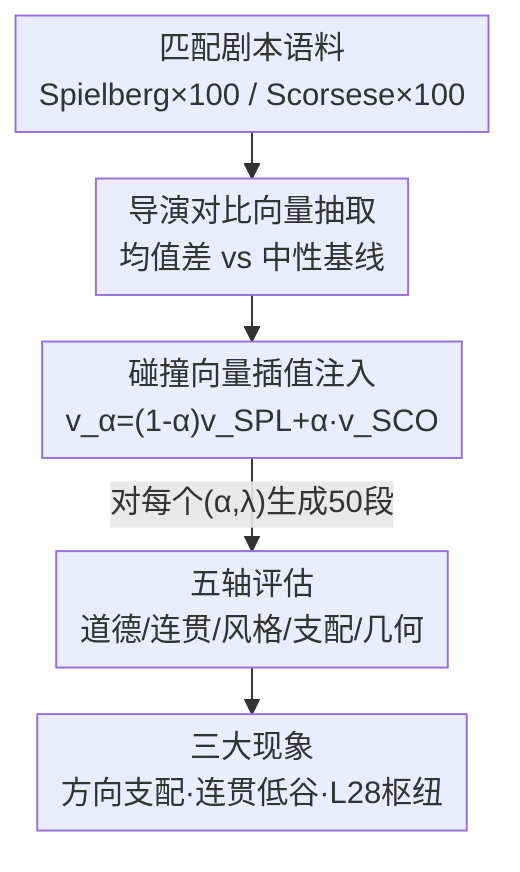

# Creative Collision: Directorial Persona Steering and Competition in Large Language Models

**会议**: ICML2026  
**arXiv**: [2606.16240](https://arxiv.org/abs/2606.16240)  
**代码**: https://github.com/SubramanyamSahoo/Creative-Collision  
**领域**: 可解释性 / 激活引导 / 可控生成  
**关键词**: 激活引导, 表示工程, 向量竞争, 道德基调, 残差流几何

## 一句话总结
把两个语义对立的"导演人格"引导向量（Spielberg 乐观救赎 vs Scorsese 阴暗道德模糊）同时注入大模型残差流，系统刻画两个方向相互竞争时的道德基调、连贯度与几何变化，发现了"方向支配"、"连贯度低谷"和"第 28 层道德枢纽"三个反直觉现象。

## 研究背景与动机
**领域现状**：现代 Transformer 的残差流里，情感、正式度、道德基调这类高层语义属性近似以"线性方向"编码。激活引导（activation steering）正是利用这一线性性，在推理时把一个学到的方向加到若干层的隐状态上，不动权重就能改变模型行为，已成功用于真实性、安全性和人格控制。

**现有痛点**：几乎所有前作都只往残差流注入**单一**语义方向。当两个语义**对立**的方向同时争夺表示控制权时会发生什么——谁赢、怎么赢、连贯度如何变化——几乎没人研究过。

**核心矛盾**：单方向引导假设"道德基调随混合系数单调平移"，但两个非反平行向量叠加时，向量的模长、夹角都会非线性变化，残差流被推离自然文本流形的程度也随之非线性变化，这意味着行为响应很可能不是简单线性插值能预测的。

**本文目标**：构造一对语义对立的引导向量，用一个混合参数 $\alpha\in[0,1]$ 在两者间插值、用引导强度 $\lambda$ 控制注入幅度，沿五个评估轴（道德基调、连贯度、表层风格、方向支配、向量几何）刻画这场"碰撞"。

**切入角度**：创意写作是一个语义丰富、文化上可读、风格上可量化的天然试验场。Spielberg 的电影主打救赎弧线、情感宣泄、童真与乐观结局；Scorsese 主打道德模糊、暴力、背叛与自毁。两位导演恰好定义了"道德基调"这根轴的两极，是天然的对立锚点。

**核心 idea**：用"导演人格碰撞"作为可控探针，研究**两个对立线性方向在残差流里竞争**的动力学，而不是再做一次单方向引导。

## 方法详解

### 整体框架
方法本质是一条"先抽两个对立向量、再在两者间插值注入、最后多轴测量"的流水线。输入是一对在叙事情境上匹配的剧本段落语料（confrontation / loss / moral choice），输出是不同 $(\alpha,\lambda)$ 条件下生成文本的道德基调、连贯度、风格与几何度量。中间分三步：① 用均值差对比从两位导演各抽一个引导向量；② 用 $\alpha$ 线性插值得到"碰撞向量" $\mathbf{v}_\alpha$，乘以 $\lambda$ 加到上中层（第 20–38 层）残差流；③ 在每个网格点生成 50 段文本，沿五个轴评估。

### 关键设计

**1. 导演对比向量抽取：用均值差把"道德基调"从剧情复杂度里剥出来**

痛点是：要研究道德基调的竞争，就得先拿到两个**只编码道德基调、不掺杂剧情复杂度**的向量。作者构造一个配对语料 $\mathcal{D}=\{(x_i^{\mathrm{SPL}}, x_i^{\mathrm{SCO}})\}$，每对在叙事情境上匹配（同样是对峙、失去、道德抉择），这样对比剔掉的就只剩"导演道德基调"。在一个 14B、40 层的解码器模型上，对每位导演的语料取层 $l$ 残差流的均值池化激活，再减去一个共享中性基线语料 $\mathcal{B}$（100 段跨题材文本）的均值：

$$\mathbf{v}_{\mathrm{SPL}}^{(l)}=\frac{1}{N_{\mathrm{SPL}}}\sum_i \mathbf{h}^{(l)}(x_i^{\mathrm{SPL}})-\frac{1}{|\mathcal{B}|}\sum_j \mathbf{h}^{(l)}(b_j)$$

Scorsese 向量同理。两向量都做 $\ell_2$ 归一化。关键观察：两者**并非反平行**，在第 28 层的余弦相似度约 $\rho\approx0.29$——说明两位导演共享一个"电影情感内容"的表示子空间，只在"道德结局"上显著分叉。这个 $\rho<1$ 的事实是后面"连贯度低谷"现象的几何根源。

**2. 碰撞向量插值与注入：用一个标量同时控制"谁主导"和"碰多狠"**

要刻画竞争，就需要一个能连续从"纯 Spielberg"滑到"纯 Scorsese"的旋钮。作者用混合系数 $\alpha\in\{0,0.25,0.5,0.75,1.0\}$ 构造碰撞向量

$$\mathbf{v}_\alpha^{(l)}=(1-\alpha)\,\hat{\mathbf{v}}_{\mathrm{SPL}}^{(l)}+\alpha\,\hat{\mathbf{v}}_{\mathrm{SCO}}^{(l)}$$

$\alpha=0$ 是纯 Spielberg，$\alpha=1$ 是纯 Scorsese，中间是两个方向"对撞"。注入时对第 $l\in\{20,\dots,38\}$ 层、每个 token 位置做 $\tilde{\mathbf{h}}_t^{(l)}=\mathbf{h}_t^{(l)}+\lambda\cdot\mathbf{v}_\alpha^{(l)}$，引导强度 $\lambda\in\{0.5,1.0,1.5,2.0\}$。注入层区间（深度 50–95%）由单层扫描预选，使道德基调位移最大、连贯度代价最小。这套 $\alpha\times\lambda$ 网格让"方向之争"和"注入强度"解耦，从而能区分某个现象到底是"碰撞本身"还是"系数偏大"造成的。

**3. 连贯度低谷的范数缩减解释：把反直觉现象证成纯几何后果**

实验发现一个反直觉现象（见下文）：纯单导演引导在高 $\lambda$ 下困惑度最高（最不连贯），而中间碰撞点反而更连贯。作者用一条范数缩减命题把它解释为纯几何必然，而非巧合。对两个单位向量、余弦相似度 $\rho$，碰撞向量的模长平方为

$$\|\mathbf{v}_\alpha\|_2^2=1-2\alpha(1-\alpha)(1-\rho)$$

它在 $\alpha^*=\tfrac12$ 处最小（只要 $\rho<1$），此时 $\|\mathbf{v}_{1/2}\|_2^2=\tfrac{1+\rho}{2}$。代入实测 $\rho\approx0.29$ 得 $\|\mathbf{v}_{1/2}\|_2\approx0.80 < 1.0$。由于连贯度代价随 $\|\lambda\mathbf{v}_\alpha\|$ 增长，中间 $\alpha$ 实际上对残差流施加了**更弱**的扰动，激活更贴近自然文本流形、困惑度更低。这就把"连贯度低谷"钉死成"两个向量非反平行"的直接推论。

### 评估协议
每个 $(\alpha,\lambda)$ 条件用提示 "Write a short cinematic scene in which a character faces a moral choice." 生成 $G=50$ 段文本（200 token、温度 0.8）。五个轴：**道德基调** $\mathrm{MV}(x)\in[-1,+1]$ 由在 ETHICS 上微调并加入导演对比对的分类器给出（正=Spielberg 式乐观，负=Scorsese 式阴暗），并拆成正/负道德子分 $p^+,p^-$；**连贯度**用基模型下的 token 级困惑度 $\mathcal{P}(x)$；**表层风格**用 spaCy 抽词数、句数、平均句长、对话密度、词汇多样性 TTR；**方向支配** $\mathcal{D}(x)=P_\phi(\mathrm{SPL}\mid x)$ 由风格分类器给出；**向量几何**算碰撞向量对两位导演参考向量的余弦相似度。

## 实验关键数据

### 主结果：三大现象

| 现象 | 关键证据 | 含义 |
|------|----------|------|
| 道德基调非单调 | $\lambda=1.0$ 时 MV 在 $\alpha=0.25$ 最负（$\approx-0.38$），而非 $\alpha=1.0$（$\approx0$） | 弱碰撞引入"道德不连贯"，被分类器罚得比任一纯导演都重 |
| 连贯度低谷 | 纯导演 $\alpha\in\{0,1\}$ 在 $\lambda\ge1.5$ 困惑度最高（$\mathcal{P}\approx28$ / $20$）；中间 $\alpha\in\{0.25,0.5\}$ 在 $\lambda=2.0$ 仍 $\mathcal{P}\approx8$–$9$ | 范数缩减让中间点扰动更小、更连贯 |
| 方向支配 | $P_\phi(\mathrm{SPL})\approx1.0$ 一直持续到 $\alpha=0.5$，$\alpha=0.75$ 仍 $\approx0.97$，只有 $\alpha=1.0$ 才跌到 $\approx0.49$ | Spielberg 的风格签名几乎全程压制 Scorsese |

### 分析实验

| 分析轴 | 关键发现 |
|--------|----------|
| 逐层定位 | 两位导演的道德位移都在**第 28 层**（约 70% 深度）峰值：Scorsese $\Delta\mathrm{MV}\approx-0.50$、Spielberg $\approx+0.47$，近似反对称——指向一个共享"道德基调枢纽" |
| 连贯度 vs 层 | 困惑度随层平滑变化、在 L28 无峰值，说明 L28 的信号是**特定道德编码**而非泛化的扰动敏感性 |
| 风格热图 | 高 $\alpha$、高 $\lambda$ 下词数/句数下降（暗叙事更早收束）；中间碰撞区平均句长病态飙到 280–305 token/句（句法退化的长句）；对话密度几乎只在 $(\alpha=0.75,\lambda=0.5)$ 出现 |
| 道德散点 | $\alpha=0.25$ 时 $p^+\approx0.60$ 且 $p^-\approx0.40$——部分引入 Scorsese 产生"道德放大"，比任一纯导演都更道德显式 |
| 高 $\lambda$ 崩塌 | $\lambda=1.5$ 时各 $\alpha$ 的 MV 全部塌到 $\approx0$、方差 $<10^{-3}$，残差流被推离流形、分类器收不到有意义输入 |

### 关键发现
- **方向支配的两条机制猜想**：① 先验偏置——预训练语料里乐观亲社会叙事多于阴暗内容，残差流先验偏 Spielberg；② 对齐放大——指令微调/RLHF 强化亲社会生成，相当于一个持续的低幅 Spielberg 先验，Scorsese 向量必须先"还债"才能翻盘（这解释了为何只有 $\alpha=1.0$、完全没有 Spielberg 分量时 Scorsese 才显现）。
- **第 28 层是道德枢纽**：峰值近似反对称，支持"两位导演向量躺在同一根近似线性的道德基调方向上、各占一极"的线性表示假说。
- **连贯度低谷有理论支撑**：不是经验巧合，而是非反平行向量插值范数缩减的几何必然。

## 亮点与洞察
- **把"双向量竞争"做成可控探针**：用文化上人人能读懂的导演风格当对立锚点，让抽象的"残差流方向之争"变得可量化、可解释——这是把可解释性和创意生成评估接上的巧思。
- **范数缩减命题**：用一行 $\|\mathbf{v}_\alpha\|_2^2=1-2\alpha(1-\alpha)(1-\rho)$ 把反直觉的"中间更连贯"证成几何必然，可迁移到任意两个非反平行引导向量的叠加场景。
- **道德位移与扰动敏感性的解耦**：L28 在道德轴有峰、在连贯度上无峰，是"找到某个语义专属层"的干净因果证据，可复用为定位其他语义枢纽的范式。
- **对齐即先验**：RLHF 表现为一个持续的低幅引导方向，提示了"模型的亲社会倾向本身就是一种隐式引导"——对理解对齐的副作用很有启发。

## 局限与展望
- **单模型、单对导演**：所有结论基于一个 14B 模型和 Spielberg/Scorsese 一对锚点，方向支配是否是该模型/该对齐策略的特性、还是普遍规律，未跨模型验证。
- **道德分类器是评估瓶颈**：MV 由微调分类器给出，高 $\lambda$ 下"信号塌到 0"究竟是模型真的道德中性、还是分类器在离流形文本上失效，二者难以区分（作者也承认是"分类器收不到有意义输入"）。
- **方向支配机制只是猜想**：先验偏置和对齐放大两条解释都未做消融（如换一个未对齐基模型对比），停留在合理推测。
- **改进思路**：跨模型/跨语言复现方向支配；用未 RLHF 的基模型验证"对齐放大"；把 L28 单层干预做成更精细的可控生成手段。

## 相关工作与启发
- **vs 单方向激活引导（ActAdd / RepE / ITI）**：前作只注入一个方向做真实性/安全/人格控制，本文首次研究**两个对立方向同时注入**的竞争动力学，是对这条线的正交扩展。
- **vs 线性表示假说（Elhage / Burns CCS / Templeton SAE）**：本文实质在检验"导演道德人格"这种复合属性是否也允许线性因果表示、可做向量算术；L28 反对称峰值给该假说提供了创意生成场景下的新证据。
- **vs 风格/人格引导（Subramani 2022）**：他们复现具体风格片段（逐字风格），本文关注更粗粒度的"创意道德基调"，且专注两人格同时注入时的相互作用。

## 评分
- 新颖性: ⭐⭐⭐⭐ 首次系统研究残差流里两个对立方向的竞争，视角新颖
- 实验充分度: ⭐⭐⭐ 五轴刻画细致，但单模型单对锚点、机制多为猜想未消融
- 写作质量: ⭐⭐⭐⭐ 现象-机制-几何证明环环相扣，叙事清晰
- 价值: ⭐⭐⭐⭐ 为可控创意生成与对齐副作用研究提供了可量化探针

<!-- RELATED:START -->

## 相关论文

- [\[ACL 2025\] Sample-Efficient Human Evaluation of Large Language Models via Maximum Discrepancy Competition](../../ACL2025/llm_nlp/sample-efficient_human_evaluation_of_large_language_models_via_maximum_discrepan.md)
- [\[ICML 2026\] The Cylindrical Representation Hypothesis for Language Model Steering](the_cylindrical_representation_hypothesis_for_language_model_steering.md)
- [\[ACL 2025\] Steering off Course: Reliability Challenges in Steering Language Models](../../ACL2025/llm_nlp/steering_off_course_reliability_challenges_in_steering_language_models.md)
- [\[ACL 2026\] CoSToM: Causal-oriented Steering for Intrinsic Theory-of-Mind Alignment in Large Language Models](../../ACL2026/llm_nlp/costomcausal-oriented_steering_for_intrinsic_theory-of-mind_alignment_in_large_l.md)
- [\[ACL 2026\] PersonaArena: Dynamic Simulation for Evaluating and Enhancing Persona-Level Role-Playing in Large Language Models](../../ACL2026/llm_nlp/personaarena_dynamic_simulation_for_evaluating_and_enhancing_persona-level_role-.md)

<!-- RELATED:END -->
