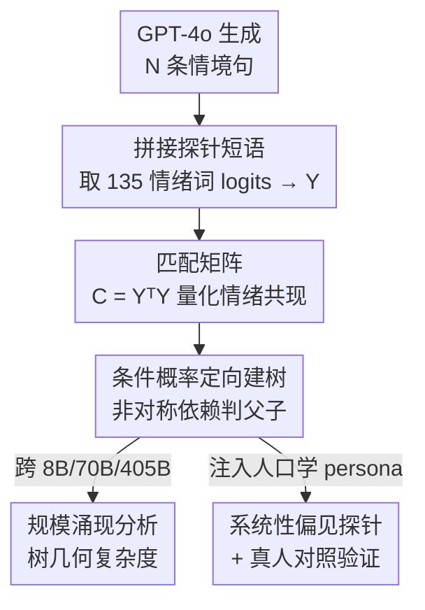

# Emergence of Hierarchical Emotion Organization in Large Language Models

**会议**: ICML2026  
**arXiv**: [2507.10599](https://arxiv.org/abs/2507.10599)  
**代码**: 待确认  
**领域**: LLM / NLP（认知科学交叉·表征分析）  
**关键词**: 情绪层级、表征工程、规模涌现、人口学偏见、认知评估

## 一句话总结
论文用一个只靠 LLM 输出 logits、无需任何标注的建树算法，从模型对情绪词的下一词分布里"挖"出层级化情绪树，发现这种树随模型规模增大越来越接近人类心理学的情绪轮（emotion wheel），并进一步证明 LLM 在不同人口学 persona 下复现了与真人一致的系统性情绪识别偏见。

## 研究背景与动机
**领域现状**：随着语音、视频等多模态能力接入，LLM 驱动的对话智能体越来越像"会聊天的人"，要做好交互就必须追踪对方的情绪状态——这正是心理学里"心智理论（theory of mind）"要求交流者持续推断的隐变量之一。已有工作大多把这件事做成一个情绪分类 benchmark：给一句话，让模型选标签，比准确率。

**现有痛点**：纯分类 benchmark 只看"答对没答对"，回答不了一个更本质的问题——模型内部到底**怎么组织**情绪？人类的情绪不是扁平的标签集合，而是有层级的（"乐观"是"喜悦"的一种、"焦虑"是"恐惧"的一种）。如果只盯准确率，就完全看不到模型有没有这种结构、结构合不合理、会不会随规模演化。

**核心矛盾**：评估 LLM 情绪理解的"工具"和心理学描述人类情绪理解的"理论"是两套话语，没接上。心理学有成熟的层级情绪模型（Shaver 等人的情绪轮），但没人把它变成一个能直接探测 LLM 的算法。

**本文目标**：拆成两个子问题——(1) 能不能不靠标注、只靠模型自己的输出，把 LLM 内部的情绪层级结构"读"出来？(2) 这种结构是否真和人类一致，包括连人类的偏见一起复现？

**切入角度**：作者从一个概率观察出发——如果模型常在"乐观"概率高时也给"喜悦"高概率，但反过来不成立，那"喜悦"就该是"乐观"的父节点。这种**非对称的条件依赖**恰好能定义层级，而它完全藏在模型的下一词分布里。

**核心 idea**：用模型对 135 个情绪词的输出概率构造"匹配矩阵"，再用条件概率的非对称性判定父子关系，建出一棵情绪有向树；用这棵树的几何复杂度量化"情绪理解水平"，并把人口学 persona 注入提示来探测偏见。

## 方法详解

### 整体框架
方法本质是一条"提示 → logits → 矩阵 → 建树 → 分析"的无监督探针流水线。给定一句情境描述，在后面拼上固定短语 "The emotion in this sentence is"，让模型吐出下一词的概率分布，只取 135 个情绪词对应的概率，拼成矩阵 $Y \in \mathbb{R}^{N\times 135}$（$N$ 是情境句数量）。由 $Y$ 算出情绪两两之间的"共现"匹配矩阵 $C=Y^\top Y$，再用条件概率的非对称性在情绪对之间连有向边，最终得到一棵刻画该模型情绪组织方式的有向树。拿到树之后做三件分析：跨规模看树复杂度怎么涨、注入 persona 看识别偏见、和真人做对照实验。

### 关键设计

**1. 匹配矩阵：把"情绪共现"变成一个可计算的量**

痛点是模型内部对情绪的关联并不显式存在，必须从输出里反推。作者的做法是：对 $N$ 条情境句各取一行 135 维情绪概率向量，堆成 $Y$，然后定义匹配矩阵 $C=Y^\top Y$，其每个元素 $C_{ij}=\sum_{n=1}^{N}Y_{ni}Y_{nj}$。直观上 $C_{ij}$ 衡量情绪 $i$ 和 $j$ 在多大程度上"在相似语境里被同时高概率预测"。在"下一词概率等于模型对该情绪可能性的估计"这一假设下，$C$ 的元素近似情绪跨句**共同出现的联合概率**。这一步的巧妙在于：它不需要任何 ground-truth 情绪标签，纯靠模型自己的概率统计就把抽象的"语义关联"落成了一个 $135\times135$ 的实数矩阵，为后面建层级提供了量化基底。

**2. 条件概率非对称性：用"谁更泛化"判定父子关系**

有了共现还不够——共现是对称的，而层级是有方向的（父比子更泛化）。作者用条件概率的非对称性来定向：情绪 $a$ 被判为 $b$ 的孩子，当且仅当

$$\frac{C_{ab}}{\sum_i C_{ai}}>t,\quad \text{且}\quad \frac{C_{ab}}{\sum_i C_{ib}}<\frac{C_{ab}}{\sum_i C_{ai}}.$$

第一个条件（阈值 $0<t<1$）要求"预测到 $a$ 时也常预测到 $b$"，即 $a\to b$ 的连接足够强；第二个条件要求"预测到 $b$ 时反而不那么常预测 $a$"，说明 $b$ 更一般、更上位。以"乐观（$a$）vs 喜悦（$b$）"为例：模型常在乐观概率高时也给喜悦高概率，但反过来未必，于是"喜悦"被定为"乐观"的父节点。这种只看相对大小、不依赖绝对标注的判据，正是从扁平概率里恢复出树状层级的关键，而且作者指出这套建树算法可推广到任意带分类任务的数据集、同样不需要真值标签。

**3. persona 注入 + 树几何：把结构分析接到行为偏见上**

光有结构还要回答"这结构有没有用"。作者在识别提示里注入人口学身份前缀（"As a [demographic identity], I think the emotion involved …"），让 Llama 405B 以不同 persona 的视角识别情绪，从而探测系统性偏见；同时发现**情绪树的几何（深度、分支、总路径长）能反过来预测识别准确率**，把"内部结构"和"外部行为"接成了一条因果链。配合一个 60 人的真人用户研究做对照，证明模型不仅准确率随人口学群体变化，连**误分类的方向**都和真人一致（如黑人 persona 把恐惧场景判成愤怒、女性 persona 把愤怒判成恐惧）。这一步让整篇从"模型有层级结构"上升到"模型内化了人类社会知觉，包括其偏见"。

### 损失函数 / 训练策略
本文是分析型工作，不训练新模型。情境句由 GPT-4o 生成（Exp.1 用 5000 条；Exp.2 对 135 个情绪词各生成 20 条不点名情绪的场景）；建树阈值 $t$ 做了敏感性检查，结论在不同 $t$ 下保持一致。唯一涉及训练的是一个验证性实验：比较 Mistral-7B 基座与其经社交任务（谈判/说服）自我强化学习微调的变体，看 RL 是否提升"惊讶"识别。

## 实验关键数据

### 主实验
**规模涌现**：GPT-2（极小模型）几乎建不出有意义的树结构；Llama 3.1 从 8B → 70B → 405B，树的总路径长和平均深度单调增长，节点按 Shaver 情绪轮的分组着色后呈现清晰的"同色聚在同一父节点下"模式，405B 的情绪轮可视化与人类标注的心理学情绪轮高度相似。

**识别偏见**：中性 persona 下，对 135 个细粒度情绪词的整体分类准确率仅 15.2%，但归并到 6 大类（love/joy/surprise/anger/sadness/fear）后达 87.1%——说明模型粗分很准、细分很难。多数群体 persona 的准确率系统性高于少数群体。

| persona / 情绪类别 | 识别准确率 | 说明 |
|--------------------|-----------|------|
| 中性·6 大类 | 87.1% | 粗粒度基本可靠 |
| 中性·135 细类 | 15.2% | 细粒度普遍困难 |
| White 男性·愤怒类 | 80.7% | 多数群体偏高 |
| Black 男性·愤怒类 | 76.2% | 常把"悲伤"误判为"愤怒" |
| 其它 persona·恐惧类 | 53.0–57.2% | 对照基线 |
| 低收入女性·恐惧类 | 47.6% | 倾向把情绪误判为"恐惧" |
| 低收入黑人女性（交叉） | 最低 | 多重弱势偏见叠加，准确率最低 |

### 消融 / 关键分析

| 分析项 | 关键数据 | 发现 |
|--------|---------|------|
| 文化偏见（Asian persona） | 负面情绪大量汇聚到 "shame" | 把愤怒/恐惧/悲伤都并向"羞耻" |
| 宗教偏见（Hindu persona） | 负面情绪常判为 "guilt" | 系统性的"内疚"倾向 |
| 身体障碍 persona | 26.5% 的情绪被判为 "frustration" | 显著的单点坍缩偏见 |
| 真人对照（60 人用户研究） | 误分类方向一致 | 黑人：恐惧→愤怒；女性：愤怒→恐惧 |
| RL 微调（Mistral-7B） | "惊讶"识别 20.0% → 33.3% | $\chi^2(1)=6.40,\ p=0.011$，显著 |

### 关键发现
- **树几何是识别准确率的可靠预测器**：内部结构越完整，外部识别越准，把表征分析和行为评估打通。
- **交叉性放大偏见**：单一弱势属性（黑人 / 低收入 / 女性）各自掉点，叠加后（低收入黑人女性）准确率最低，呼应社会科学的"交叉性"概念；而高收入黑人女性的偏见被显著缓解，说明偏见可被属性组合调制。
- **预测误差训练能补"惊讶"短板**："惊讶"在心理学上源于预期与现实的失配（预测误差），而 RL 正是按预测误差更新参数，因此 RL 微调模型对"惊讶"特别敏感——一个理论假设被实验证实。

## 亮点与洞察
- **零标注探针**：整套建树只用模型自己的 logits，不碰任何 ground-truth 标签，可直接迁到其它分类层级挖掘（作者用葡萄酒香气域做了泛化验证），是表征工程里很干净的一招。
- **用认知理论当"预测性测试"**：作者提出一个方法论——把人类行为的认知理论当工作假设，去预测 LLM 的内部组件（logits / 中间表征），为"心理学驱动的模型评估"开了口子。
- **结构→行为的因果桥**：从"有层级树"到"树几何预测准确率"再到"复现人类偏见"，三步把抽象表征落到可观测行为，论证链条完整。

## 局限与展望
- 作者承认：层级模型没有效价（正/负）和唤醒度（主动/被动）这两个人类情绪理论的核心维度；Exp.3 把情绪压到 6 个词/类是重大简化。
- 方法假设"模型和人的语言行为直接反映其底层情绪"，但真人读场景可能体会到细腻情绪却无法对应到给定的 6 个词；且对模型看的是全部 logits，对人却是强制单选，二者并不完全可比。
- 用于 Exp.1/2 的情境句本身由 LLM 生成，可能自带偏置（如模型对"惊讶"理解差，就会少生成相关场景），存在评估闭环里的循环偏差风险。
- persona 实验没有考虑社会文化差异（不同文化的情绪表达规范不同），偏见结论的解读需谨慎。

## 相关工作与启发
- **vs 标准情绪分类 benchmark**：它们只比准确率，本文比"内部组织结构"，提供互补视角——能看到分类分数看不到的层级与规模演化。
- **vs 主题模型/层次聚类挖概念层级**：传统方法（topic modeling、hierarchical clustering）依赖语料的词共现或聚类间关系；本文不需要语料，直接用预训练 LLM 的 logits，且挖的是**单个情绪之间**的父子关系而非簇间关系。
- **vs Palumbo et al. (2024) 用 LLM logits 做层次聚类**：他们关注簇与簇的关系，本文关注个体情绪词之间的有向依赖，粒度更细、更贴近心理学情绪轮。

## 评分
- 新颖性: ⭐⭐⭐⭐⭐ 把心理学情绪轮变成零标注的 logits 建树算法，视角新颖且可泛化
- 实验充分度: ⭐⭐⭐⭐ 跨规模 + 多人口学 + 真人对照 + RL 验证，链条完整；但细粒度准确率与文化维度仍偏弱
- 写作质量: ⭐⭐⭐⭐ 动机—方法—证据递进清晰，图表丰富
- 价值: ⭐⭐⭐⭐⭐ 既揭示 LLM 涌现的情绪推理，又暴露其复现人类偏见的风险，对伦理部署与认知驱动评估都有启发

<!-- RELATED:START -->

## 相关论文

- [\[ICML 2026\] ANCHOR: Abductive Network Construction with Hierarchical Orchestration for Reliable Probability Inference in Large Language Models](anchor_abductive_network_construction_with_hierarchical_orchestration_for_reliab.md)
- [\[ACL 2025\] Quantifying Semantic Emergence in Language Models](../../ACL2025/llm_nlp/quantifying_semantic_emergence_in_language_models.md)
- [\[ICML 2026\] Rare Event Analysis of Large Language Models](rare_event_analysis_of_large_language_models.md)
- [\[ICML 2026\] Creative Collision: Directorial Persona Steering and Competition in Large Language Models](creative_collision_directorial_persona_steering_and_competition_in_large_languag.md)
- [\[ICML 2026\] Resting Neurons, Active Insights: Robustify Activation Sparsity for Large Language Models](resting_neurons_active_insights_robustify_activation_sparsity_for_large_language.md)

<!-- RELATED:END -->
